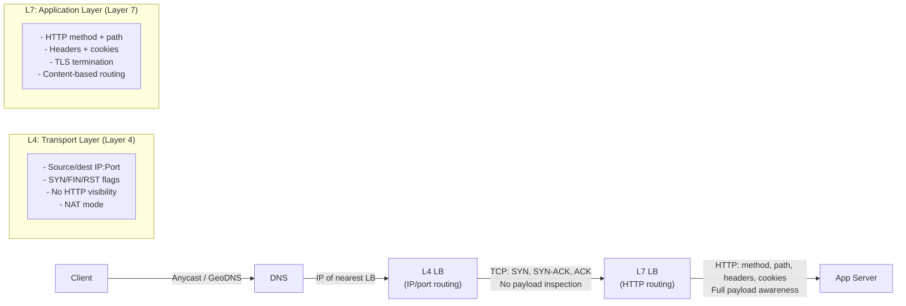

# Traffic Routing & Network Foundations — Advanced Deep Dive

*As a Principal Engineer specializing in Edge Infrastructure at Google, I've designed the traffic systems that handle billions of requests per second across global data centers. This module strips away the abstractions and takes you inside the packet — from the moment a DNS query leaves your machine to the instant a reverse proxy hands a response back to a waiting TCP socket.*

> **Prerequisites:** This module assumes you have read the beginner-friendly [Module 1 guide](01-traffic-routing.md) and understand DNS resolution, Anycast, L4/L7 basics, CDN concepts, and rate limiting. You should be comfortable with TCP handshakes, HTTP semantics, and the OSI model.

---

## Table of Contents

1. [L4 vs L7 Deep Dive — The Packet Journey](#1-l4-vs-l7-deep-dive--the-packet-journey)
2. [Edge Architecture & Caching](#2-edge-architecture--caching)
3. [Reverse Proxies & Edge Security](#3-reverse-proxies--edge-security)
4. [Real-World Failure Modes](#4-real-world-failure-modes)
5. [Teachers Corner — Self-Assessment](#5-teachers-corner--self-assessment)
6. [Glossary of Key Terms](#6-glossary-of-key-terms)
7. [Key Takeaways](#7-key-takeaways)

---

## 1. L4 vs L7 Deep Dive — The Packet Journey



### Layer 4: The Mailroom At Wire Speed

An L4 load balancer operates at the transport layer. It sees only the TCP segment headers — source IP, source port, destination IP, destination port, and the SYN/FIN/RST flags. It does not and cannot inspect the HTTP payload inside.

**The L4 Packet Flow (NAT Mode):**

```
Client ──[SYN]──> L4 LB ──[SYN (new src IP)]──> Backend
Client <──[SYN-ACK]── L4 LB <──[SYN-ACK]── Backend
Client ──[ACK]──> L4 LB ──[ACK]──> Backend
Client ──[HTTP GET]──> L4 LB ──[HTTP GET (NAT'd)]──> Backend
```

The L4 balancer performs **Destination NAT (DNAT)**: it rewrites the destination IP of the incoming packet to the chosen backend's IP, rewrites the source IP to itself (so the return path goes through it), and forwards the packet. The backend sees the TCP connection as originating from the LB, not the client. The handshake is end-to-end between client and backend — the LB is a transparent router.

**Why L4 is cheap:** No TLS termination. No HTTP parsing. No header inspection. The balancer simply hashes the 5-tuple (src IP, src port, dst IP, dst port, protocol) to select a backend and forwards packets at near line rate. A Linux kernel with `IPVS` (IP Virtual Server) can forward millions of packets per second on a single NIC.

**The hidden cost:** Because the LB does not terminate TCP, **connection persistence** is purely 5-tuple based. If a client's source port changes (e.g., NAT rebinding), the hash changes and the client lands on a different backend. Stateful applications that rely on local session state will break.

### Layer 7: The Executive Assistant With Full Visibility

An L7 load balancer terminates the client's TCP connection, optionally terminates TLS, parses the HTTP request, makes routing decisions based on content, and then opens a **new** TCP connection to the chosen backend.

**The L7 Packet Flow (TCP Termination):**

```
Client ──[SYN]──> L7 LB (accepts connection)
Client <──[SYN-ACK]── L7 LB
Client ──[ACK]──> L7 LB
Client ──[TLS ClientHello]──> L7 LB (TLS handshake)
Client ──[HTTP GET /api/orders]──> L7 LB

LB parses HTTP method, path, headers, cookies, auth token.

L7 LB ──[SYN]──> Backend (new connection)
L7 LB <──[SYN-ACK]── Backend
L7 LB ──[ACK]──> Backend
L7 LB ──[HTTP GET /api/orders]──> Backend
Backend ──[HTTP 200 OK]──> L7 LB
L7 LB ──[HTTP 200 OK]──> Client
```

Notice the **two TCP connections**: one between client and LB, one between LB and backend. This is the key architectural difference. The LB is now a full proxy, not a router.

**Why L7 is expensive:**

| Resource | L4 (NAT) | L7 (Reverse Proxy) |
|----------|----------|-------------------|
| CPU per request | ~1-5 µs (packet rewrite) | ~50-500 µs (TLS + HTTP parse) |
| Memory per connection | ~16 bytes (conntrack entry) | ~16-64 KB (TLS context + buffer) |
| Connections at scale | 10M+ (kernel handles) | 1-2M (bounded by RAM) |
| Latency added | < 100 µs | ~1-5 ms (TLS + processing) |

**The Mailroom vs Executive Assistant Analogy — Extended:**

- **L4 (Mailroom Clerk):** An envelope arrives. The clerk glances at the building address and room number (IP:port). They toss it into the appropriate department's bin. They have no idea what's inside — it could be a love letter, a bomb, or a check. They don't care. Throughput: thousands of envelopes per second.
- **L7 (Executive Assistant):** The assistant opens every piece of mail. They check the sender's ID, read the subject, verify the auth token, compress the attachment, decide which specific person should handle it, and log the entire interaction in a tracking system. Throughput: dozens per second, but each one is handled intelligently.

**When L4 is the right call:**
- Non-HTTP protocols (gRPC without TLS termination at LB, database replication streams, DNS, NTP).
- UDP traffic (QUIC, media streaming, real-time gaming) — L4 can forward UDP; L7 typically cannot inspect it.
- Extreme throughput requirements where every microsecond matters (high-frequency trading).
- Simple round-robin scenarios where all backends are identical and content-aware routing provides no value.

**When L7 is non-negotiable:**
- URL-path-based routing (`/api/v1/*` → service A, `/api/v2/*` → service B).
- Cookie-based session persistence (sticky sessions based on `JSESSIONID` or `Session-ID`).
- Authentication enforcement at the edge (validate JWT before the request reaches your app servers).
- Rate limiting by user ID, not just IP.
- TLS termination to offload crypto from backends.
- HTTP/2 or WebSocket multiplexing.

### The Data Center Reality: Both Layers Coexist

In a production Google or Meta edge stack, both layers exist:

```
Client ──> L4 (Google's Maglev) ──> L7 (Envoy/NGINX) ──> Backend
```

Maglev (Google's L4 load balancer) uses ECMP + consistent hashing to distribute packets to a pool of L7 proxies. The L7 proxies then make intelligent routing decisions. This separation gives you the throughput of L4 with the intelligence of L7. The L4 layer handles the DDoS scrubbing and traffic distribution; the L7 layer handles the application logic.

---

## 2. Edge Architecture & Caching

### DNS Routing Methods — A Deeper Technical View

DNS-based traffic routing is the coarsest but most powerful steering mechanism. It operates before any TCP connection is established.

| Method | Mechanism | Resolution Granularity | Failure Detection |
|--------|-----------|----------------------|-------------------|
| **Geolocation** | DNS resolver maps client's source IP to a geographic region via GeoIP databases (MaxMind, IP2Location) | Country/Region/City level | Manual DNS record update |
| **Latency-Based** | Elastic Load Balancer (Route53) probes endpoints with health checks and measures RTT; returns lowest-latency endpoint | Per-resolver (not per-client) | 30-60 second health check window |
| **Weighted Round-Robin** | Multiple A/AAAA records with weight values; resolver returns records proportional to weight | Per-DNS-request | TTL-dependent (30-300s) |
| **Failover** | Primary record with health check; if primary fails, secondary record becomes active | Per-health-check-interval | ~60 seconds (DNS TTL + health check) |

**The critical limitation:** DNS routing is **resolver-constrained**. The client's recursive resolver (e.g., 8.8.8.8) caches the answer for its TTL. All clients behind that resolver see the same IP. You cannot route individual users differently unless they use different resolvers. This is why Google, Netflix, and Facebook use a combination of DNS steering + Anycast.

**Anycast BGP Hijack Protection:** Anycast networks are vulnerable to BGP hijacks (a malicious AS advertises a more specific route and steals traffic). Production edge networks use BGP prefix filtering, RPKI (Resource Public Key Infrastructure), and IRR (Internet Routing Registry) route validation. Cloudflare's BGP announcement includes community strings that signal route preference to transit providers.

### Push vs Pull CDN — The Full Trade-Off Matrix

| Dimension | Push CDN | Pull CDN |
|-----------|---------|----------|
| **Content Pipeline** | You upload assets to CDN origin storage via API (S3 → CloudFront) | CDN fetches from your origin server on first request |
| **Origin Load** | Zero — origin never serves cacheable content | Spikes on first request per asset (miss penalty) |
| **Latency for First User** | Low — content is pre-deployed | High — first user waits for origin fetch |
| **Storage Cost** | Higher — you pay for storage on every edge node | Lower — only popular content is cached |
| **Cache Invalidation** | You control invalidation explicitly (API call) | TTL-based; you must wait or force purge |
| **Staleness Risk** | Lower — you push updated versions | Higher — stale content served until TTL expires |
| **Operational Complexity** | Pipeline management needed (CI/CD to CDN) | Simple — just set Cache-Control headers |

**The Hybrid Strategy (Used by Netflix):**

Netflix uses **Push for the catalog** (pre-load popular content to edge via Open Connect Appliances during off-peak hours) and **Pull for long-tail content** (fetch from regional caches on demand). This minimizes origin load while keeping 80% of views served from local cache.

### Cache Invalidation Techniques at the Edge

- **Cache Purge API (CloudFront, Fastly):** Explicit invalidation request propagates to all edge locations. Costly at scale (Fastly charges per purge request beyond a quota).
- **Versioned URLs:** The most reliable technique. `style.a1b2c3.css` — change the hash, and the new version is fetched automatically by the Pull CDN. Zero invalidation cost.
- **Surrogate Keys (Fastly):** Tag responses with a `Surrogate-Key` header. Invalidate all cached objects that share a key with a single API call. Used by large publishers to invalidate entire content categories at once.
- **Stale-While-Revalidate (RFC 5861):** Serve stale content immediately while fetching fresh version in background. The `stale-while-revalidate` and `stale-if-error` directives on `Cache-Control` headers allow this behavior natively in HTTP.

---

## 3. Reverse Proxies & Edge Security

### SSL/TLS Termination — The Mechanics

When a reverse proxy terminates TLS, it performs the full TLS handshake (asymmetric key exchange via ECDHE, symmetric cipher negotiation, certificate verification) on behalf of the backend. The backend receives plaintext HTTP.

**Why this matters:**
- **CPU Isolation:** TLS handshake requires asymmetric crypto (ECDHE key exchange). Offloading this to the edge proxy means your application servers use zero CPU for encryption.
- **Certificate Centralization:** Manage one wildcard certificate (`*.example.com`) on the proxy instead of installing certs on every backend server.
- **TLS Version Upgrades:** Upgrade TLS 1.2 → 1.3 at the proxy without touching backend code.

**The re-encryption pattern (mTLS between proxy and backend):**
```
Client ──[TLS 1.3]──> Proxy ──[TLS 1.3 + client cert]──> Backend
```
The proxy terminates the client's TLS and opens a **new** TLS connection to the backend, presenting its own certificate. The backend verifies the proxy's cert. This is the standard pattern in service mesh architectures (Istio, Linkerd).

### Gzip/Brotli Compression at the Edge

Compression is one of the most CPU-intensive tasks a reverse proxy performs. A single 1 MB JSON response can take 5-10ms gzip-compressing. Modern proxies offer **Brotli** (Google's compression algorithm), which is 20-30% more efficient than gzip at the same quality level.

**The trade-off:**
- Compressing at the edge saves bandwidth (lower egress costs, faster downloads).
- But it consumes proxy CPU. At 100,000 req/s, compression can saturate the proxy before the backend is even loaded.
- **Strategy:** Pre-compress static assets at build time (`.gz` and `.br` files stored alongside originals). Only compress dynamic responses if bandwidth is more expensive than CPU (common in cloud with metered egress).

### Security Isolation at the Reverse Proxy

| Threat | Mitigation at Reverse Proxy | Mechanism |
|--------|---------------------------|-----------|
| **SQL Injection** | WAF (ModSecurity, Coraza) | Regex patterns matching SQL keywords in query strings and POST bodies |
| **XSS** | WAF + Response Header Injection | Add `Content-Security-Policy`, `X-XSS-Protection` headers |
| **DDoS** | Rate Limiting at Edge | Token bucket, connection limits per IP |
| **TLS Vulnerabilities** | Cipher Suite Whitelisting | Only allow TLS 1.3 with AEAD ciphers (CHACHA20-POLY1305, AES-GCM) |
| **Request Smuggling** | HTTP Parsing Strictness | Reject ambiguous Content-Length/Transfer-Encoding headers |

### Token Bucket Rate Limiting — The Specifics

The token bucket algorithm is the most common at the edge because it allows **bursts** while enforcing an average rate.

**Implementation pseudocode:**

```
rate = 100            // tokens added per second
capacity = 200        // maximum bucket size (burst capacity)
tokens = capacity     // start full
last_refill = now()

on_request(client_id):
    now = current_time()
    elapsed = now - last_refill[client_id]
    tokens[client_id] += rate * elapsed
    tokens[client_id] = min(tokens[client_id], capacity)
    last_refill[client_id] = now

    if tokens[client_id] >= 1:
        tokens[client_id] -= 1
        return ALLOW
    else:
        return DENY  // 429 Too Many Requests
```

**Why this survives at global scale:** Rate limit state is stored in a distributed cache (Redis/Memcached) sharded by client_id. The edge proxy checks the bucket before forwarding the request. If the database is already under load, the rate limiter is the first line of defense.

---

## 4. Real-World Failure Modes

### Thundering Herd — Pull CDN Expiry Crushing the Origin

**Symptom:** All edge nodes simultaneously fetch the same object from the origin. Origin QPS spikes 100x. Origin CPU hits 100%. Response times increase 10x. Clients start timing out.

**Root Cause:** A popular static asset (homepage HTML, app bundle) has a TTL of exactly 3600 seconds across all 50 edge locations. When that TTL expires, every edge node sends a GET to the origin at the exact same second.

**The Origin Shield Pattern (Detailed):**

```
User ──> Edge Frankfurt ──> Origin Shield Frankfurt ──> Origin
User ──> Edge Paris    ──> Origin Shield Frankfurt ──> Origin
User ──> Edge Warsaw   ──> Origin Shield Frankfurt ──> Origin
```

The **Origin Shield** is a dedicated intermediate caching layer. All edge nodes fetch from the shield, and only the shield fetches from the origin. When the TTL expires:
1. 50 edge nodes all request the same object from the shield.
2. The shield has the object cached (one edge already fetched it) — it serves 49 from cache and only 1 goes to origin.

**Quantitative impact:** Without shield: 50 requests to origin. With shield: 1 request to origin. **50x reduction in origin load.**

### Split-Brain in Active-Passive Load Balancers

**Symptom:** Both the primary and standby load balancers transition to "active" state. They begin serving traffic and making conflicting routing decisions. Clients receive unpredictable responses. Connection tracking tables diverge.

**Root Cause:** The heartbeat link between the two LBs fails (cable cut, switch failure, NIC driver crash). Both nodes are healthy but cannot hear each other. Each node's health monitoring detects the *other* node as unreachable and promotes itself to active.

**The Fencing Protocols:**

- **STONITH (Shoot The Other Node In The Head):** The promoting node sends a command to power off the other node via a remote power switch (BMC/IPMI) before taking over. If it cannot confirm the other node is dead, it refuses to promote.
- **Disk-based fencing (SCSI-3 Persistent Reservations):** The active node holds a SCSI reservation on a shared storage device. The standby cannot become active without releasing the reservation. When the standby tries to acquire the reservation, the active node's I/O keeps it.
- **Network-based fencing:** The promoting node sends a GARP (Gratuitous ARP) to redirect the virtual IP to itself, then pings the old active's IP. If the old active responds, the promoting node yields.

**The Witness Node Pattern:**

```
         ┌─────────────┐
         │   Witness   │ (independent node, 3rd AZ)
         └──────┬──────┘
                │
    ┌───────────┴───────────┐
    │                       │
┌───┴───┐             ┌───┴───┐
│ LB A  │──heartbeat──│ LB B  │
│(primary)│           │(standby)│
└───────┘             └───────┘
```

The standby requires **two** independent confirmations of failure before promoting:
1. Heartbeat timeout with A.
2. Witness confirms that A is unreachable.

The witness is deployed in a separate availability zone to avoid correlated failures. This is the pattern used by AWS NLB with the `EnableCrossZoneLoadBalancing` flag and Google Cloud's External HTTPS Load Balancer with health check probes from multiple regions.

**Real-World Incident:** GitHub's October 2018 26-second MySQL outage was triggered by a split-brain during a planned failover. A network timeout caused both MySQL nodes to believe they were primary. The fix included implementing automated fencing and switching to a witness-based failover mechanism.

---

## 5. Teachers Corner — Self-Assessment

### Question 1: L7 vs L4 TCP Connection Lifecycle

**Scenario:** You are designing the edge architecture for a real-time bidding system where each request must be processed in under 10ms. Explain the TCP connection lifecycle for L4 (NAT mode) vs L7 (proxy mode). Why would L7 be inappropriate here?

**Grading Rubric:**

| Score | Criteria |
|-------|----------|
| **Excellent (10/10)** | Identifies that L4 NAT preserves the original TCP handshake (client ↔ backend, no termination). Correctly states that L7 requires TLS termination + HTTP parsing + new backend connection, adding 3-5ms. Recognizes that real-time bidding loses money per ms of latency. Suggests L4 with IPVS or eBPF-based load balancing. |
| **Good (7/9)** | Explains the two-connection model of L7 vs one-connection of L4. Misses the TLS overhead or the implications for latency-sensitive financial systems. |
| **Needs Work (0/6)** | Cannot describe the packet flow differences. Thinks L4 and L7 are interchangeable. |

### Question 2: News Site CDN TTL Configuration

**Scenario:** A major news site serves a homepage that updates every 5 minutes during breaking news. The homepage is cached on a Pull CDN. During a major event, traffic spikes 20x. Editors update the homepage every 30 seconds, but users see a 5-minute-old version. What TTL strategy and cache invalidation mechanism would you configure?

**Grading Rubric:**

| Score | Criteria |
|-------|----------|
| **Excellent (10/10)** | Sets TTL to 30 seconds during breaking news mode (or 0 for no cache on dynamic sections). Uses `stale-while-revalidate=86400` so the CDN serves stale during the 30-second fetch window. Uses Surrogate-Key purging to invalidate all homepage variants simultaneously when a breaking news article is published. Caches static components (CSS, images) with 1-hour TTL + versioned URLs, separate from the dynamic HTML. |
| **Good (7/9)** | Suggests short TTL (30-60s) but doesn't consider stale-while-revalidate. May propose purge API but doesn't consider propagation delay. |
| **Needs Work (0/6)** | Suggests 5-minute TTL as unchangeable. Doesn't distinguish between static assets and dynamic HTML. |

### Question 3: Active-Passive Failover — Cold vs Hot Standby Risks

**Scenario:** Your Active-Passive load balancer pair experiences a heartbeat failure. The standby promotes itself to active. Both LBs are now serving traffic. Describe the data inconsistency risk. How would you implement STONITH fencing to prevent this?

**Grading Rubric:**

| Score | Criteria |
|-------|----------|
| **Excellent (10/10)** | Explains split-brain symptom: both LBs translate the same virtual IP, causing packet drops and connection state divergence. Prescribes STONITH via BMC/IPMI: standby sends an SSH command to the active's BMC to power-cycle before promoting. If STONITH fails, the standby refuses to promote. Describes witness node as an alternative: standby requires witness confirmation before promoting. Mentions SCSI-3 persistent reservations for shared-state LBs. |
| **Good (7/9)** | Understands split-brain concept. Suggests fencing but cannot describe the specific mechanism (STONITH, GARP, witness). |
| **Needs Work (0/6)** | Does not understand that two active LBs cause data corruption. Suggests "manual restart" as the solution. |

---

## 6. Glossary of Key Terms

| Term | Section | Definition |
|------|---------|------------|
| DNAT (Destination NAT) | 1 | Packet rewriting technique where the load balancer changes the destination IP to route traffic to a backend server |
| Connection Tracking (conntrack) | 1 | Linux kernel subsystem that tracks all active network connections through a NAT device |
| Maglev | 1 | Google's L4 load balancer using ECMP and consistent hashing for near-line-rate packet forwarding |
| ECMP (Equal-Cost Multi-Path) | 1 | Routing technique that distributes packets across multiple paths of equal cost using a hash of the 5-tuple |
| TLS Termination | 3 | Decryption of TLS traffic at a proxy so backend servers receive plaintext HTTP |
| Origin Shield | 4 | Intermediate caching layer between edge CDN nodes and the origin server to collapse redundant requests |
| Surrogate-Key | 2 | Fastly-specific response header tag that enables group cache invalidation across related objects |
| STONITH | 4 | Fencing protocol that powers off a suspected-failed node before promoting a standby |
| Witness (Quorum Node) | 4 | Independent third node in a cluster that validates the active node is truly dead before allowing failover |
| Token Bucket | 3 | Rate limiting algorithm that allows burst traffic up to a capacity while capping average rate via periodic refill |
| Stale-While-Revalidate | 2 | HTTP Cache-Control directive that serves stale content while asynchronously fetching a fresh copy from origin |
| GARP (Gratuitous ARP) | 4 | Unsolicited ARP broadcast used to update network switches about a new MAC ownership for a virtual IP |
| BGP Hijack | 2 | Malicious route advertisement that intercepts traffic intended for a specific IP prefix |
| RPKI | 2 | Cryptographic framework that validates BGP route announcements against authorized origin AS numbers |

---

## 7. Key Takeaways

1. **L4 is a wire-speed router; L7 is a full proxy.** L4 NAT preserves the original TCP handshake (client ↔ backend) and adds minimal latency. L7 terminates TCP, inspects HTTP, and opens a new backend connection. Always justify which one you use and why.

2. **Edge architecture is a multi-layer defense.** DNS geography + Anycast BGP + L4 distribution + L7 routing + rate limiting + WAF — each layer adds protection and intelligence. Never expose your app servers directly to the internet.

3. **Pull CDNs need Origin Shield.** Without it, a simultaneous TTL expiry across all edge locations creates a thundering herd that can collapse your origin. Shield collapses N requests into 1.

4. **Cache invalidation is not a single technique.** Versioned URLs work for static assets; Surrogate-Keys work for grouped dynamic content; Stale-While-Revalidate protects against transient failures.

5. **Split-brain requires fencing, not just detection.** Heartbeat failure detection is not enough. You must actively prevent the old node from serving traffic (STONITH, SCSI reservations, witness-based promotion).

6. **Token bucket rate limiting at the edge is your first DDoS defense.** Store bucket state in distributed cache, shard by authenticated identity (not just IP), and reject overflow with 429 status.

7. **Compression is a CPU trade-off.** Pre-compress statics. Only compress dynamic responses if egress cost exceeds CPU cost. Brotli is 20-30% more efficient than gzip.

8. **The best edge architectures use both L4 and L7.** Maglev → Envoy → Backend gives you the throughput of L4 with the intelligence of L7. Don't pick one — use both in sequence.

9. **TLS termination at the edge isolates certificate management and crypto CPU.** The edge proxy handles the asymmetric key exchange; your backends never see a TLS handshake.

10. **Every edge routing decision is a trade-off between granularity and latency.** DNS-based routing is coarse but instant; health-check routing is precise but slow (TTL bound). Use them in combination, not isolation.

---

> This advanced guide extends the foundation built in the [beginner-friendly Module 1](01-traffic-routing.md). You now understand the packet-level mechanics of L4 vs L7, the matrix of edge caching trade-offs, the internals of reverse proxy security, and the real-world failure modes that separate Principal Engineer-grade designs from introductory ones.
>
> *"The edge is not a perimeter — it's an architecture. Every layer you add between the client and the origin is an opportunity for optimization, isolation, and defense."*
