> **You've used this when...** You opened your phone this morning and scrolled Instagram. Every image, every video, every profile — none of it appeared by magic. Behind each tap, a request traveled from your device, crossed the internet, found the nearest Instagram data center, got checked for rate limits, and returned with the content. You didn't think about it because it all happened in under a second.
>
> Now imagine you're the engineer building that system. A billion people are tapping. Every tap needs DNS resolution, routing to the right region, a load balancer to pick the right server, and a rate limiter to make sure one bot doesn't knock the whole thing down. This module teaches you how that invisible infrastructure works — so you can build it, debug it, and design it for your own applications.
>
> Traffic routing is the plumbing of the internet. It's not glamorous, but every request depends on it. By the end of this module, you'll understand the full path from "I pressed a button" to "data arrived on screen."

# Traffic Routing & Network Foundations — A Beginner’s Guide

> **This is a plain‑language version of a complex networking module.**
> It explains how a request flows from your browser to a server and back, using everyday analogies.
> Every technical term is defined the first time it appears, and a full Glossary is provided at the end.
> Once you understand these foundations, the original, more advanced module will feel much easier.

---

> **Before you start:** This module is foundational — no prerequisites. Start here if you're new to system design.

---

## Table of Contents

1. [What Happens When You Type a Web Address?](#1-what-happens-when-you-type-a-web-address)
2. [Reaching the Nearest Office — Anycast](#2-reaching-the-nearest-office--anycast)
3. [Handling the Packet — L4 (Mailroom) vs L7 (Executive Assistant)](#3-handling-the-packet--l4-mailroom-vs-l7-executive-assistant)
4. [Speeding Up Delivery — Content Delivery Networks (CDNs)](#4-speeding-up-delivery--content-delivery-networks-cdns)
5. [Crowd Control — Rate Limiting](#5-crowd-control--rate-limiting)
6. [The Receptionist — Reverse Proxy](#6-the-receptionist--reverse-proxy)
7. [Common Disasters and How to Avoid Them](#7-common-disasters-and-how-to-avoid-them)
8. [Putting It All Together — A Request’s Journey](#8-putting-it-all-together--a-requests-journey)
9. [Glossary of Technical Terms](#9-glossary-of-technical-terms)
10. [Key Takeaways](#10-key-takeaways)

---

> **⏱ TL;DR — If you only learn 3 things from this module:**
> 1. **Every request goes through a chain:** DNS → routing → load balancing → application. Breaking any link breaks the experience.
> 2. **Speed and intelligence trade off:** Layer 4 is fast but blind; Layer 7 is smart but slower. Pick the right level for the job.
> 3. **Caches and rate limits protect your backend.** Without them, a single viral post or a single attacker can take down your entire service.

---

## 1. What Happens When You Type a Web Address?

When you open a browser and type `api.example.com`, you are asking your computer to contact a specific service on the internet. But computers don’t understand names — they understand numbers called **IP addresses** (e.g., `203.0.113.10`). So the first step is to translate the name into a number. This translation system is called **DNS** — the **Domain Name System**, which acts like the internet’s phonebook.

### The DNS Lookup Step by Step

Imagine you need to send a letter to the company **api.example.com**, but you only know the name, not the street address.

1. **Check your own memory (Browser & OS Cache)**
   - Your browser and your operating system keep a temporary memory of recently looked‑up addresses. If they have the IP address for `api.example.com` stored, the process stops here and uses that address. This memory is called a **cache**.

2. **Ask a friend who can find any address (Recursive Resolver)**
   - If your memory fails, you call a friend who knows how to find any address. On the internet, this friend is a **recursive DNS resolver** — usually provided by your ISP (Internet Service Provider) or a public service like Google’s `8.8.8.8`. The resolver may also have the address cached from a previous request.

3. **The resolver asks the global address system (Root, TLD, Authoritative servers)**
   - If the resolver doesn’t have the answer, it starts asking specialised directories, working backwards from the end of the name:
     - **Root DNS servers** — The resolver asks the root, “Who knows about `.com`?”
     - **TLD (Top‑Level Domain) servers** — The root points to the servers responsible for `.com`. The resolver then asks the `.com` TLD, “Who knows about `example.com`?”
     - **Authoritative DNS server** — The TLD responds with the official name server for `example.com`. This is the *authoritative source* — the company’s own phonebook. The resolver asks it, “What is the IP address for `api.example.com`?”

4. **The answer comes with an expiry date (TTL)**
   - The authoritative server replies with the IP address and a **TTL (Time To Live)**, which is the number of seconds the answer can be cached before it must be rechecked. For example, a TTL of 60 means “remember this address for 1 minute, then ask again.” Short TTLs allow the company to change its IP quickly; long TTLs reduce DNS traffic.

Now your browser has the IP address. The next challenge: large companies may have many data centres around the world. Which physical location do you connect to?

---

## 2. Reaching the Nearest Office — Anycast

To provide a fast, reliable service globally, big platforms use a trick called **Anycast**.

**Anycast** means: many servers, in many cities, all **advertise the same IP address**. When your request travels across the internet, routers automatically pick the shortest (or best) path to one of those locations. It’s like a company that advertises a single phone number, but the telephone network routes your call to the nearest open office without you even knowing.

The routers make these decisions using a protocol called **BGP (Border Gateway Protocol)**. BGP is the postal system of the internet — it constantly maps out which paths are available and chooses the most efficient route.

### Other ways DNS can direct traffic

- **Geolocation routing** – The DNS server guesses your country from your IP and returns a local server’s address.
- **Latency‑based routing** – It returns the server that has the lowest measured network delay.
- **Weighted routing** – A percentage of traffic is sent to different servers (useful for slowly testing a new version).
- **Failover routing** – If the primary server is detected as unhealthy, DNS automatically returns a backup IP.

**Important:** DNS failover is not instant. Cached answers at the resolver or browser can keep sending users to a dead server until the TTL expires. Therefore, critical systems combine DNS steering with **health checks** at the load balancer level (more on this next).

---

## 3. Handling the Packet — L4 (Mailroom) vs L7 (Executive Assistant)

Once your request arrives at a data centre, it needs to be handed over to a backend server that can actually process it. How that handover happens depends on whether we use **Layer 4 (L4)** or **Layer 7 (L7)** of the network model.

To understand this, think of a message as a physical letter inside an envelope.

### Analogy: Mailroom Clerk vs Executive Assistant

- **Layer 4 (L4) load balancer** → *Mailroom clerk*
  - Looks only at the envelope: the destination IP address and port number (like a room number).
  - Does **not** open the envelope.
  - Forwards the whole letter, unread, to a backend server.
  - Very fast, because it makes no decisions based on the content of the letter.

- **Layer 7 (L7) load balancer / Reverse proxy** → *Executive assistant*
  - Opens the envelope, reads the letter, checks the subject line, and understands what is being requested.
  - Decides which specific team or person should handle the letter based on its content.
  - Can also handle security (checking IDs), compress attachments, or reject abusive letters before they reach the back office.
  - Slower than the mailroom clerk because reading and checking takes time, but far more intelligent.

### Technical definitions for the envelope and the letter

- **TCP (Transmission Control Protocol)** – The reliable “envelope” that guarantees your data arrives in order and without errors. It creates a connection between your computer and the server.
- **TLS (Transport Layer Security)** – The encryption that makes HTTPS secure. It’s like sealing the letter in a tamper‑proof envelope so nobody can read it along the way.
- **HTTP (Hypertext Transfer Protocol)** – The content of the letter: the method (GET, POST), the path (`/api/orders`), headers (like `Host`), cookies, and body.

A Layer 4 device sees only the TCP envelope. A Layer 7 device terminates (ends) the client’s TCP/TLS connection, decrypts the TLS, reads the HTTP content, and then opens a fresh new connection to the chosen backend server.

### Which one to use?

| Approach | Use when... | Don't use when... |
|----------|-------------|-------------------|
| **L4 (Mailroom)** | You need maximum speed and throughput; all backends are identical; you're handling non‑HTTP protocols; you want minimal added latency | You need to route based on URL, cookies, or authentication headers; you need per‑request security policies |
| **L7 (Executive Assistant)** | You need routing by URL, host, or cookie; you need to enforce auth, rate limits, or security per request; you're building an API gateway | You need absolute minimum latency (e.g., high‑frequency trading); you're handling raw TCP/UDP protocols that can't be inspected; you can't afford the CPU/memory overhead at extreme scale |

**Cost of L7:** Because L7 opens the envelope, it consumes more CPU (decryption, parsing) and memory (keeping state for many client connections). At huge scale (millions of simultaneous connections), this overhead can be significant.

---

## 4. Speeding Up Delivery — Content Delivery Networks (CDNs)

If your service sends the same images, videos, or documents to users over and over, it’s wasteful to fetch them from the main origin server every time. Instead, you can store copies in **local warehouses** around the world. This is called a **CDN (Content Delivery Network)**.

### Two ways to stock the warehouses

| Approach | Use when... | Don't use when... |
|----------|-------------|-------------------|
| **Push CDN** | You know exactly which files will be popular ahead of time; you need full control over when content arrives at edge nodes; your files are large and stable (game patches, software downloads) | Popularity is unpredictable; you'd need to push every individual file change manually; you have dynamic content that changes per user |
| **Pull CDN** | You don't know what will be popular in advance; your content changes frequently; you want automatic caching of new assets | The first request for each asset will be slow (miss penalty); you need control over which content is cached; origin traffic spikes on the first wave of requests to new content | — where you don’t know what will be popular in advance. |

### The thundering herd (cache stampede)

Imagine thousands of customers arrive at a local warehouse at the exact same moment, asking for a product that just expired in the warehouse’s catalogue. If the warehouse has no copy, all customers simultaneously rush to the main factory, overwhelming it. This is called a **thundering herd** or **cache stampede**.

**How to prevent it:**

- **Origin Shield** — A regional super‑warehouse sits between many local edges and the origin. When local edges miss, they ask the shield, and only the shield asks the origin. This collapses thousands of requests into one.
- **Stale‑while‑revalidate** — The warehouse can hand out a slightly old (stale) copy immediately while quietly checking with the factory in the background. The customer never waits, and the factory gets at most one request.
- **Request coalescing** — If many requests for the same object arrive at once, they are combined into a single origin fetch.
- **TTL jitter** — Add a small random variation to cache expiry times so that not everything expires at the exact same second.

---

## 5. Crowd Control — Rate Limiting

To prevent one person from sending thousands of requests per second (either maliciously or accidentally), services use **rate limiting**. It’s like an amusement park ride with a token system:

- A bucket holds a maximum number of tokens (e.g., 5).
- Every second, 1 token is added (up to the bucket’s capacity).
- Each request costs 1 token.
- If tokens are available, the request is allowed. If the bucket is empty, the request is rejected.
- This allows short bursts (up to 5 requests instantly) but limits the average rate over time.

This algorithm is called a **token bucket**. Other rate limiting algorithms exist (fixed window, sliding window, leaky bucket), but the core idea is the same: control how much traffic one user can generate.

**Important:** Never limit based only on the user’s IP address. Many real users can share the same public IP (e.g., everyone in a company office behind a corporate **NAT** (Network Address Translation)). Instead, limit based on an authenticated identity like a user ID, API key, or tenant ID.

---

## 6. The Receptionist — Reverse Proxy

A **reverse proxy** sits in front of one or more backend servers and acts as a single, controlled public entry point. It’s like a receptionist in a building who:

- **Terminates TLS** — decrypts secure traffic so the back‑office doesn’t have to manage certificates.
- **Routes requests** — directs you to the right department based on what you ask (path, host, headers).
- **Enforces security** — checks authentication, applies a Web Application Firewall (WAF), blocks oversized requests.
- **Observes traffic** — logs requests, measures latency, emits metrics.
- **Compresses responses** — reduces bandwidth by using gzip/Brotli compression.
- **Pools connections** — reuses backend connections to reduce the load of opening new ones.

### When NOT to use a reverse proxy

- If your system already has a service mesh (like Istio) that handles identity and telemetry between internal services.
- For real‑time media (WebRTC) where a middleman adds unacceptable latency.
- For ultra‑low‑latency trading systems where every microsecond counts.
- For non‑HTTP protocols that the proxy cannot inspect.

The rule of thumb: **a reverse proxy is a control point. If you don’t need that control, you can skip the overhead.**

---

> **✏️ Check Your Understanding**
> 1. Your friend types xample.com into a browser in Japan. The company has servers in the US, Europe, and Asia. What mechanism ensures they reach the fastest server?
> 2. Your API is returning JSON data, but you need to restrict access to authenticated users only. Should you use L4 or L7 load balancing? Why?
> 3. A celebrity posts a link to your site and millions of users click in one minute. Your database spikes to 100% CPU. Which two traffic-routing features could have prevented this?
> 

> 
Answers

> 1. **Anycast** — the same IP is advertised from all data centers, and BGP routes the request to the nearest one. DNS-based geo-routing could also help, but Anycast works automatically without per-user DNS responses.
> 2. **L7** — only L7 can read the HTTP headers (like Authorization or cookies) to check authentication. L4 only sees IP and port, so it can't tell who the user is.
> 3. **CDN caching** (to serve cached content without hitting the database) and **rate limiting** (to cap requests per user/IP/API key). Reverse proxy TLS termination wouldn't help here.
> 

---

## 7. Common Disasters and How to Avoid Them

### Split-brain in active-passive load balancers

**Symptom:** Both load balancers think they are active, causing duplicate or conflicting traffic routing. Clients receive unpredictable responses.
**Root Cause:** The heartbeat network between the active and standby fails, but both nodes are actually healthy. Each assumes the other is dead and promotes itself.
**Real Incident:** GitHub’s October 2018 MySQL failover — a network timeout during a planned failover caused both MySQL nodes to believe they were the primary, leading to data inconsistencies and a 26-second outage.
**Fix:** Use a third witness (quorum node) that independently checks both nodes. Before the standby promotes itself, the witness must confirm the active is truly down. Then fence the old active: disable its network interface, revoke its lease, or power it off.
**How to Detect Early:** Monitor heartbeat success rate, track both nodes’ state in your monitoring system, and alert if two nodes report “active” simultaneously.

### Cache stampede (thundering herd)

**Symptom:** A single key expires and database QPS spikes 10x-100x in seconds. CPU and connection pool usage on the origin soar.
**Root Cause:** Many clients discover the same cache miss at the same instant and all race to regenerate the value from the origin.
**Real Incident:** Reddit’s 2013 “AMA hug of death” — when a celebrity posted an AMA, millions of users hit the same content simultaneously. The cache was not prepared, and the origin database collapsed.
**Fix:** Origin shield, request coalescing, stale-while-revalidate, TTL jitter, and lease tokens (allow only one client to regenerate).
**How to Detect Early:** Monitor per-key miss rate, track “hot key” lists, and set alerts when a single key accounts for more than 5 percent of total cache misses.

### Rate limit blocking legitimate users

**Symptom:** An entire office or dormitory cannot access your service, while individual users outside that network work fine.
**Root Cause:** Rate limiting is done by IP address only. A corporate NAT gateway makes hundreds of real users appear as one IP, and when that IP hits the rate limit, everyone is blocked.
**Real Incident:** Twitter’s 2023 API rate limiting — aggressive IP-based rate limits blocked thousands of legitimate users who were behind shared IP addresses (especially corporate networks and mobile carriers).
**Fix:** Always add a limit dimension based on authenticated identity (user ID, API key, session token). Use IP as a secondary dimension only.
**How to Detect Early:** Monitor “429 Too Many Requests” responses segmented by IP vs. user ID. If 429s cluster by IP but not by user, you are hitting this problem.

### Origin overload from viral content

**Symptom:** A sudden surge of traffic (10x-100x normal) overwhelms the origin servers. Response times increase, errors increase, and the site may become completely unavailable.
**Root Cause:** Unexpected popularity of a page or feature — the “hug of death” effect from social media, news coverage, or promotional campaigns.
**Real Incident:** Multiple sites have been taken down by the “Reddit hug of death” — when a story hits the Reddit front page, the sudden flood of visitors exceeds the origin’s capacity.
**Fix:** CDN with stale-while-revalidate, longer TTLs on cacheable content, caching of partial page fragments, pre-warming the cache before known traffic spikes, and implementing circuit breakers to shed excess load.
**How to Detect Early:** Monitor origin QPS vs. CDN hit rate. If origin QPS rises faster than cache misses, the problem may be overload rather than cache failure. Set alerts for traffic spikes above 5x normal.

---

## 8. Putting It All Together — A Request’s Journey

```mermaid
flowchart LR
    Client["Client / Browser"]
    DNS["DNS Resolver"]
    CDN["CDN Edge"]
    L4LB["L4 Load Balancer"]
    L7LB["L7 Load Balancer"]
    RP["Reverse Proxy"]
    Backend["Application Server"]

    Client -->|Domain lookup| DNS
    DNS -->|Anycast IP| CDN
    CDN -->|Static assets cached| L4LB
    L4LB -->|TCP routing| L7LB
    L7LB -->|HTTP routing| RP
    RP -->|TLS termination + forwarding| Backend
```

Let’s trace a single click on “Place Order” at `api.example.com` from start to finish, using all the concepts we’ve learned.

1. **DNS Resolution**  
   Your browser asks the recursive resolver for the IP of `api.example.com`. It gets back an Anycast IP with a short TTL. This IP is advertised by data centres on three continents.

2. **Routing via Anycast**  
   The internet routes your request to the nearest edge location that announces that IP — for example, a data centre in Frankfurt if you’re in Europe.

3. **L7 Reverse Proxy at the edge**  
   The edge server terminates your TLS connection (decrypting HTTPS). It reads the HTTP request: method `POST`, path `/api/orders`, and a `Session‑ID` cookie.  
   It checks your authentication token and verifies your rate limit token bucket for this API key. If allowed, it applies WAF rules.

4. **Backend selection**  
   The proxy looks at the path `/api/orders` and selects the “orders” backend pool. It uses a least‑inflight connection algorithm to pick a healthy backend server with the lowest number of active requests. If a backend has failed repeatedly, a circuit breaker temporarily removes it from the pool.

5. **CDN (if caching is involved)**  
   If the request is for a static asset like a product image, the edge cache may serve it directly. If the cache has expired, it uses `stale‑while‑revalidate`: serves the slightly old image immediately while asynchronously refreshing it from the origin shield, which in turn checks the origin.

6. **Response**  
   The proxy receives the response from the backend, compresses it with Brotli, logs the latency and status code, and forwards it back to your browser over the still‑open TLS connection.

If a whole region goes offline, Anycast automatically sends users to the next nearest location. If a backend fails, the circuit breaker stops sending it traffic. If you hit a rate limit, you get a `429 Too Many Requests` response. At every layer, the system is designed to fail gracefully without bringing down the entire service.

> **🧪 Conceptual Exercises**
> 1. **Design a traffic routing system for a global video streaming service.** Users in 50 countries need to watch videos with minimal buffering. Which DNS routing strategy would you use? Would you use L4 or L7 load balancing for the video streaming protocol? How would you handle a new movie release that millions want to watch simultaneously?
> 2. **Your e-commerce site is suffering from bot traffic.** Bots are scraping product prices every second, slowing the site for real customers. Your CEO wants to block them by IP. Why is this risky, and what better approach would you recommend?
> 

> 
Hints

> - For the video service, think about which layer can inspect the video traffic type — and whether you even need to inspect it at all.
> - For the bot problem, consider what rate limiting dimension works better than IP when real users share an office network.
> - For the movie release, focus on CDN pre-warming and origin shield.
> 

---

## 9. Glossary of Technical Terms

| Term | Definition | Section |
|------|------------|---------|
| **DNS (Domain Name System)** | The phonebook of the internet — translates human‑readable names to IP addresses. | 1 |
| **IP Address** | A numerical label assigned to each device on a network (e.g., `192.168.1.1`). | 1 |
| **Cache** | A temporary storage area that keeps frequently used data for quick access. | 1 |
| **Recursive Resolver** | A DNS server that does the legwork of finding an IP address by querying other DNS servers on your behalf. | 1 |
| **Root DNS Servers** | The top of the DNS hierarchy — they know where to find the TLD servers for all top‑level domains. | 1 |
| **Authoritative DNS** | The official DNS server that holds the actual IP address records for a domain. | 1 |
| **TTL (Time To Live)** | The number of seconds a DNS record or cache entry may be kept before it must be refreshed. | 1 |
| **Anycast** | A routing method where multiple servers share the same IP address. The network automatically sends traffic to the nearest one. | 2 |
| **BGP (Border Gateway Protocol)** | The protocol that core internet routers use to exchange routing information and find the best paths. | 2 |
| **TCP (Transmission Control Protocol)** | A reliable, connection‑oriented protocol that ensures data is delivered in order and without errors. | 3 |
| **TLS (Transport Layer Security)** | A cryptographic protocol that provides secure communication over a network (the “S” in HTTPS). | 3 |
| **HTTP (Hypertext Transfer Protocol)** | The protocol used to transmit web pages and API data. It defines methods (GET, POST), headers, and status codes. | 3 |
| **API Gateway** | An L7 reverse proxy designed specifically for managing, routing, and securing API calls. | 3 |
| **Layer 4 (L4)** | The transport layer in networking (TCP/UDP). L4 load balancers route based on IP addresses and ports. | 3 |
| **Layer 7 (L7)** | The application layer in networking (HTTP). L7 load balancers route based on the content of the request. | 3 |
| **Load Balancer** | A device or software that distributes incoming traffic across multiple servers to improve reliability and performance. | 3 |
| **CDN (Content Delivery Network)** | A network of geographically distributed servers that cache and serve content close to users. | 4 |
| **Origin Server** | The original web server where your application and content actually live, before being cached by a CDN. | 4 |
| **Thundering Herd** | A sudden flood of requests for the same resource, typically caused by a cache expiry. | 4 |
| **Origin Shield** | An intermediate caching layer in a CDN that reduces requests hitting the origin by aggregating cache misses. | 4 |
| **Token Bucket** | A rate limiting algorithm where tokens refill at a constant rate and each request consumes one token. | 5 |
| **NAT (Network Address Translation)** | A technique that maps multiple private IP addresses to a single public IP, commonly used in home/office networks. | 5 |
| **Reverse Proxy** | A server that sits in front of backend services, handling client requests and forwarding them internally. | 6 |
| **TLS Termination** | The process of decrypting TLS traffic at a proxy or load balancer so the backend does not need to handle encryption. | 6 |
| **WAF (Web Application Firewall)** | A security system that filters and monitors HTTP traffic, blocking common web attacks. | 6 |
| **Service Mesh** | A dedicated infrastructure layer for handling service‑to‑service communication (often using sidecar proxies). | 6 |
| **Circuit Breaker** | A design pattern that stops sending requests to a failing backend for a “cooldown” period to prevent cascading failures. | 8 |
| **Stale‑while‑revalidate** | A caching strategy where a stale (expired) object is served immediately while a background refresh fetches a fresh copy. | 4 |
| **Split‑brain** | A failure condition where two nodes both believe they are the active primary, leading to conflicting actions. | 7 |

---
## 10. Key Takeaways

- **DNS** = internet phonebook, with an expiry date (TTL) that controls caching.
- **Anycast** = one phone number, automatically routed to the nearest office via BGP.
- **Layer 4** = fast, blind mailroom that only reads the envelope (IP + port).
- **Layer 7** = intelligent executive assistant that reads the letter (HTTP) and makes content‑based decisions.
- **CDNs** = local warehouses for frequently requested content; push vs pull, plus origin shield and stale‑while‑revalidate prevent thundering herds.
- **Rate limiting** = token bucket (or similar) to cap request rates per user/API key, not just per IP.
- **Reverse proxy** = the receptionist that provides security, routing, compression, and observability.
- **Split‑brain** = two bosses; mitigate with witness, quorum, and fencing.
- **Every layer trades something**: intelligence for speed, control for cost. The art is picking the right tool for each job.
- **Health checks and circuit breakers** ensure traffic only goes to healthy servers; always combine DNS steering with active health monitoring.
- **Observability at every hop** (TTL tracking, latency metrics, error rates) is essential — you cannot debug a routing problem you cannot see.

---

> This guide was built from a detailed technical module on traffic routing.  
> If you understand the analogies and terms here, you are ready to dive into the [advanced material](01-traffic-routing-advanced.md) — where we trace the packet journey through L4 NAT vs L7 proxy mode, dissect Facebook and Google's edge architectures, and break down real-world split-brain failures.  
> Keep learning, and remember: every complex system is just a lot of simple pieces working together.
