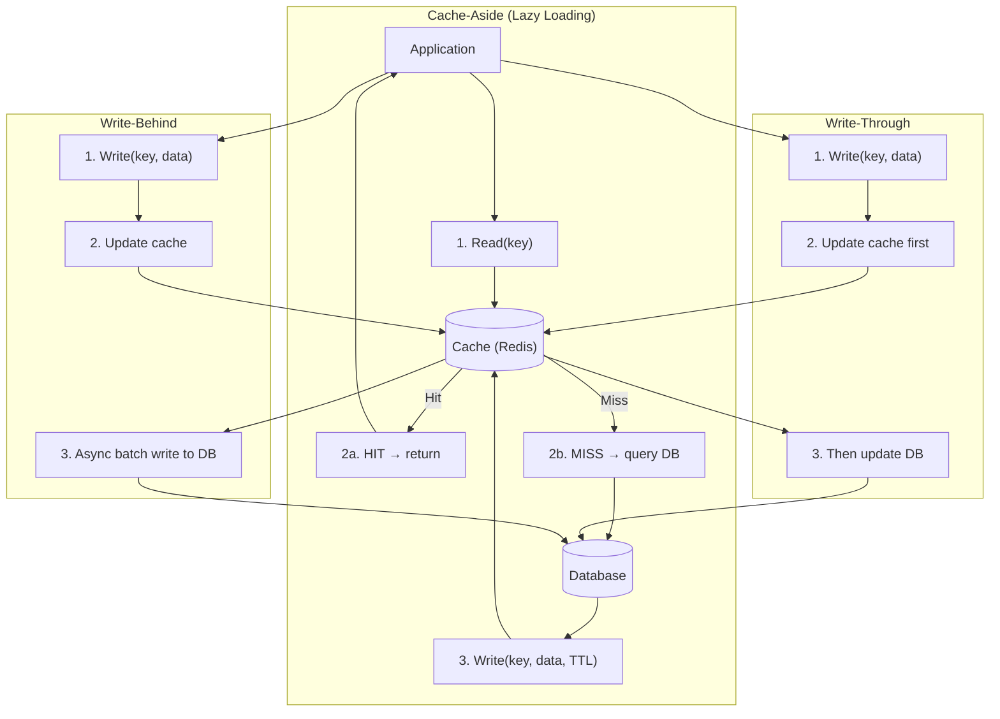

# Caching Strategies & Memory Management — Advanced Deep Dive

*As a Principal Performance Engineer at Google, I've tuned caching systems that handle trillions of requests per day. This module goes deep into the mechanical sympathy of cache invalidation — the exact runtime mechanics of each pattern, the internals of Facebook's Memcached deployment, the mathematical structure of eviction algorithms, and the crisis management playbook when your cache tries to destroy your database.*

> **Prerequisites:** This module assumes you have read the beginner-friendly [Module 3 guide](03-caching-memory.md) and understand cache-aside, write-through, write-behind, and refresh-ahead patterns. You should be comfortable with TTLs, eviction policies, and the three cache disasters (penetration, avalanche, stampede).

---

## Table of Contents

1. [Cache Invalidation Runtime — Code-Level Mechanics](#1-cache-invalidation-runtime--code-level-mechanics)
2. [Facebook Memcached Blueprint](#2-facebook-memcached-blueprint)
3. [Cache Eviction Mathematics](#3-cache-eviction-mathematics)
4. [Crisis Management](#4-crisis-management)
5. [Teacher Briefing — Caching Decision Matrix](#5-teacher-briefing--caching-decision-matrix)
6. [Glossary of Key Terms](#6-glossary-of-key-terms)
7. [Key Takeaways](#7-key-takeaways)

---

## 1. Cache Invalidation Runtime — Code-Level Mechanics



### Cache-Aside (Lazy Loading) — The Exact Runtime

```
FUNCTION get_user_profile(user_id):
    key = "user_profile:" + user_id
    
    // Step 1: Check cache
    profile = cache.get(key)
    IF profile IS NOT NULL:
        RETURN profile  // Cache hit — O(1) latency
    
    // Step 2: Cache miss — fetch from database
    profile = db.query("SELECT * FROM users WHERE id = ?", user_id)
    
    // Step 3: Populate cache with TTL
    cache.set(key, profile, ttl=3600)
    
    RETURN profile
```

**Mechanics:**
- The **application** is responsible for all cache operations. The cache is a passive key-value store — it never initiates data flow.
- On `cache.set()`, the application specifies the TTL. The cache stores `(key, value, expiry_timestamp)`.
- On `cache.get()`, the cache checks the current wall-clock time against `expiry_timestamp`. If expired, the cache deletes the key and returns "miss."
- **No invalidation happens automatically.** If the database is updated through a different path, the cache becomes stale until the TTL expires or the key is explicitly deleted.

**Staleness window:** Up to the full TTL (3600 seconds in the example above). This is why cache-aside is called "lazy" — it accepts staleness in exchange for simplicity.

**Explicit invalidation variant:**

```
FUNCTION update_user_profile(user_id, new_data):
    // Write to database first
    db.query("UPDATE users SET name = ? WHERE id = ?", new_data.name, user_id)
    
    // Then invalidate cache
    key = "user_profile:" + user_id
    cache.delete(key)  // Not update! Delete forces next read to fetch fresh data.
    
    // The next call to get_user_profile() will miss, fetch from DB, and repopulate.
```

**Why delete instead of update:** If two concurrent writes happen, the last writer's value might differ from what was set in cache. Deleting ensures the next read always gets the latest committed state.

### Write-Through — The Exact Runtime

```
FUNCTION write_through_set(key, value):
    // Step 1: Write to database synchronously
    db.insert_or_update(key, value)
    
    // Step 2: Write to cache synchronously
    cache.set(key, value, ttl=3600)
    
    // Step 3: Only now acknowledge success to client
    RETURN SUCCESS
```

**Mechanics:**
- Writes are **serialized** through the cache. The cache is the authoritative write path.
- If the database write fails, the cache write is skipped and the client gets an error. Cache and database remain consistent.
- If the cache write fails but the database write succeeded, the client gets an error. The database has the latest data; the cache has stale (or missing) data. This is acceptable — the next read will either miss (and fetch from DB) or overwrite on the next write-through.

**Latency impact:** Every write waits for the slower of (database write, cache write). If the database takes 50ms and Redis takes 1ms, the write takes 50ms. This is why write-through is not suitable for write-heavy workloads where every millisecond counts.

### Write-Behind (Write-Back) — The Exact Runtime

```
FUNCTION write_behind_set(key, value):
    // Step 1: Write to cache immediately
    cache.set(key, value, ttl=3600)
    
    // Step 2: Enqueue the database write
    durable_queue.enqueue({
        operation: "UPSERT",
        key: key,
        value: value,
        timestamp: now()
    })
    
    // Step 3: Acknowledge client immediately
    RETURN SUCCESS

// Background worker process:
FUNCTION flush_queue():
    WHILE TRUE:
        batch = durable_queue.dequeue(limit=100)
        IF batch IS EMPTY:
            SLEEP(100ms)
            CONTINUE
        BEGIN TRANSACTION:
            FOR each item IN batch:
                db.insert_or_update(item.key, item.value)
        COMMIT TRANSACTION
        durable_queue.ack(batch)
```

**The crash risk and its mitigation:**

**Risk:** The cache acknowledges the write and then crashes before the durable queue is flushed. The write is **lost forever**. The client believes it succeeded, but the database never received the data.

**Mitigation 1: Write-Ahead Log (WAL)**
Before acknowledging the client, append the change to a WAL on local disk (an append-only log that survives crashes). On restart, replay the WAL to rebuild the durable queue. This is exactly how PostgreSQL and MySQL ensure durability even with async write patterns.

```python
FUNCTION write_behind_set_with_wal(key, value):
    # Step 1: Append to WAL first (fsync for durability)
    wal.append({
        "key": key, 
        "value": value, 
        "timestamp": now()
    })
    wal.fsync()  // ~0.1-0.5ms on SSD
    
    # Step 2: Update cache
    cache.set(key, value, ttl=3600)
    
    # Step 3: Enqueue
    durable_queue.enqueue({"key": key, "value": value})
    
    # Step 4: Acknowledge
    RETURN SUCCESS
```

**Mitigation 2: Durable Queue (Kafka)**
Use Kafka (or similar persistent message queue) as the buffer. Kafka persists to disk with configurable durability (acks=all). Even if the cache crashes, the Kafka log retains the pending writes.

**Trade-off:** The WAL adds ~0.5ms per write. Kafka adds 2-10ms. You've traded write latency (the whole point of write-behind) for durability. At some point, you must decide: is 0.5ms latency worth the data loss risk?

### Refresh-Ahead — The Exact Runtime

```
FUNCTION refresh_ahead_get(key, refresh_threshold=60):
    cached_value = cache.get_metadata(key)
    // Returns (value, ttl_remaining)

    IF cached_value IS NULL:
        // Complete miss — fetch synchronously
        fresh_value = db.fetch(key)
        cache.set(key, fresh_value, ttl=3600)
        RETURN fresh_value

    IF cached_value.ttl_remaining < refresh_threshold:
        // TTL is low — trigger async refresh
        // But only if no other request is already refreshing
        IF cache.acquire_lock(key + ":refresh_lock"):
            // We are the designated refresher
            ASYNC:
                fresh_value = db.fetch(key)
                cache.set(key, fresh_value, ttl=3600)
                cache.release_lock(key + ":refresh_lock")

    // Return the current value (may be near-expiry, but it's returned immediately)
    RETURN cached_value.value
```

**Mechanics:**
- The cache entry's TTL is tracked. When remaining TTL drops below `refresh_threshold`, a background refresh is triggered **proactively**, before any client sees a miss.
- A distributed lock (`acquire_lock`) ensures only one process performs the refresh, preventing a miniature stampede.
- The user always gets an immediate response — either the current (near-expiry) value or a previously refreshed one.
- If the background refresh fails, the near-expiry value continues to be served until it actually expires. At that point, it degrades to cache-aside behavior (miss → sync fetch).

**Cost:** If the key becomes unpopular, the background refresh is wasted work. For every key that stays hot, this is free; for every key that cools down, you pay an extra database query that nobody needed. Implement with a **popularity counter** — only enable refresh-ahead for keys that have been accessed > N times in the last TTL window.

---

## 2. Facebook Memcached Blueprint

Facebook's cache infrastructure (detailed in their USENIX '13 paper "Scaling Memcache at Facebook") is the most thoroughly documented production caching system. Here is the blueprint.

### mcrouter — The Smart Routing Layer

mcrouter is a proxy that sits between application servers and Memcached instances. It handles:

- **Connection pooling:** 100 application servers × 100 cache servers = 10,000 connections. mcrouter multiplexes these into a single connection pool per cache server, reducing connection overhead by 100x.
- **Routing:** Consistent hashing to select the right cache server for each key.
- **Batching:** Multiple get requests for keys on the same cache server are coalesced into a single mget command.
- **Failover:** If a cache server is down, mcrouter redirects to a gutter pool.
- **Shadowing:** Duplicate a percentage of traffic to test a new cache configuration without affecting production.

**Mcrouter routing decision tree:**

```
Application calls: cache.get("user:42")

mcrouter:
  1. Hash key "user:42" → shard_id = hash("user:42") % 1000
  2. Look up shard_id in routing table → pool = "main_pool"
  3. Is pool healthy? YES → forward to memcached_42
                    NO  → forward to gutter_pool_42
  4. Is result valid (NOT from stale route)? YES → return to app
                                          NO  → return MISS (forces DB fetch)
```

### UDP for Gets — 20% Latency Reduction

Facebook's key insight: **cache reads are idempotent and best-effort.** If a read packet is lost, the client can simply retry or fall back to the database. There is no need for the reliability guarantees of TCP (retransmission, ordering, flow control).

**UDP read path:**
```
Application sends: UDP packet with key "user:42"
  No TCP handshake (saves 1 RTT = ~500µs in same DC)
  No connection state in kernel (saves memory)
  No slow start (packets sent immediately at line rate)

Memcached replies: UDP packet with value
  If packet lost: application retries or falls to DB
    (Cache miss is acceptable — DB is the source of truth)
```

**TCP write path (unchanged):**
```
Application sends write to Memcached over TCP.
  Writes must be reliable — losing a cache update means serving stale data until TTL expiry.
```

**Measured impact:** UDP reads reduced latency by 20% and reduced the number of TCP connections by 50% (since every application server no longer maintains persistent TCP connections to every cache server just for reads).

### Leases — Solving the Stampede Problem

The lease mechanism prevents cache stampedes (thundering herds) when a hot key expires:

```
1. Client A requests key "trending_topics"
2. Cache misses (key expired)
3. Cache returns MISS + a lease token: [MISS, lease=0xDEADBEEF]
4. Only Client A gets to regenerate. Cache records:
     key: "trending_topics", lease_holder: "0xDEADBEEF", lease_expiry: 5s
5. Client B requests same key 1ms later
6. Cache sees key is missing AND lease is already issued
7. Cache returns: [MISS, lease=INVALID] or serves stale data
8. Client B either waits 5ms and retries, or falls back to stale-while-revalidate
9. Client A finishes DB query and calls:
     cache.set("trending_topics", lease=0xDEADBEEF, value=..., ttl=60)
10. Cache verifies lease matches. If yes: stores value. If no: rejects (stale write).
```

**Why leases are better than TTL jitter alone:** TTL jitter spreads expirations over time but doesn't prevent concurrent misses when multiple clients discover the expired key at the same moment. Leases collapse N concurrent regenerations into exactly 1.

### mcsqueal — Cross-Region Consistency

mcsqueal is the component that listens to MySQL replication streams and invalidates Memcached entries across regions:

```
Region US:  User updates profile.
           MySQL master in US commits the write.
           mcsqueal in US reads the binlog.
           mcsqueal extracts the affected keys from SQL statements.
           mcsqueal calls cache.delete("user_profile:42") in US cache.
           Replication stream sends binlog to Region EU.

Region EU:  MySQL replica in EU receives binlog.
           mcsqueal in EU reads the binlog.
           mcsqueal extracts the affected keys.
           mcsqueal calls cache.delete("user_profile:42") in EU cache.
```

**Latency:** The full cycle (US write → EU cache invalidate) takes ~100-200ms, limited by MySQL cross-region replication lag. This is fast enough for most workloads but not for sub-100ms read-your-writes consistency.

### Remote Markers — Fixing Read-After-Write Globally

Facebook's solution for the "user sees stale data after writing" problem:

```
User in Asia updates their profile name.

Write path:
1. Write to MySQL master in US.
2. Write a "remote marker" to the Asia cache:
     cache.set("user_profile:42:marker", ttl=5s, value="read_from_master")

Read path (user refreshes page):
1. Check Asia cache for user profile:
     cache.get("user_profile:42")  → may return stale value
2. Check for remote marker:
     cache.get("user_profile:42:marker")
3. If marker exists → read profile from US master (not Asia replica).
4. If marker absent → read normally from Asia replica.
```

The marker is set with a 5-second TTL — enough for MySQL cross-region replication to complete. After 5 seconds, the replica has the latest data and the marker naturally expires.

---

## 3. Cache Eviction Mathematics

### LRU — O(1) Implementation

LRU (Least Recently Used) is typically implemented as a **doubly linked list + hash map**:

```
Structure:
  hash_map: dict(key → node_pointer)
  doubly_linked_list: (head) MRU end ←→ ... ←→ LRU end (tail)

Operations:
  get(key):
    node = hash_map[key]
    move_to_front(node)  // Remove from current position, insert at head
    return node.value

  set(key, value):
    IF hash_map is full (e.g., memory limit reached):
        evict_node = list.tail  // LRU node
        hash_map.delete(evict_node.key)
        list.remove_tail()
    
    new_node = Node(key, value)
    list.insert_at_head(new_node)
    hash_map[key] = new_node
```

**Time complexity:** All operations are O(1). The hash_map provides O(1) key lookup. The doubly linked list provides O(1) removal and insertion.

**Cache scan weakness:** If a client iterates through N new items (e.g., a full table scan), LRU evicts all existing hot items to make room. The hot items must then be re-fetched from the database. This is called **cache pollution**. Solution: use **LRU-k** (track the last k accesses before promoting an item) or **ARC**.

### LFU (Least Frequently Used) vs LRU

| Property | LRU | LFU |
|----------|-----|-----|
| Eviction criterion | Recency of access | Frequency of access |
| Hot item after scan | Evicted immediately | Retained (frequency > 1) |
| Cold item with high initial frequency | Not relevant | Retained forever (frequency never decays) |
| Implementation complexity | O(1) — doubly linked list | O(log n) — min-heap or O(1) — approximate (Count-Min Sketch) |
| Adaptive | No — fixed policy | Yes — if combined with frequency decay |

**LFU with frequency decay (TinyLFU — used by Caffeine):**
Every N accesses, all frequency counters are halved. This gives old hot items a "cooling off" period if they become irrelevant. Without decay, a 10-year-old Wikipedia article that was popular in 2016 would never be evicted.

### Facebook's Slab Classes

Memcached allocates memory in **slabs** — fixed-size chunks within a slab class. Each slab class stores items of a specific size range.

```
Slab Class 1:  96 bytes  (stores items 1-96 bytes)
Slab Class 2:  120 bytes (stores items 97-120 bytes)
Slab Class 3:  152 bytes (stores items 121-152 bytes)
...
Slab Class 42: 1,048,576 bytes (stores items > 500KB)
```

**The problem:** If the application stores many 100-byte items (which go to slab class 2) and suddenly stores a 1 MB item, Memcached allocates an entire new slab page (1 MB) from its free memory pool to slab class 42. That 1 MB is now "locked" for large items, even if slab class 2 is running out of space.

**The slab eviction problem:** If slab class 2 is full and all items are hot, but slab class 42 has free space, Memcached cannot repurpose slab class 42's memory for slab class 2. The application sees an evicted hot item from class 2 while empty space sits in class 42.

**Mitigation:** Monitor slab usage by class. If any class is near full (eviction rate > 0), consider:
- Increasing overall memory.
- Reducing item sizes (compress values before storing).
- Rebalancing slabs automatically (Facebook's **slab auto-rebalance** feature).

### Facebook's Transient Item Cache

Facebook observed that 30% of items are accessed only once (e.g., a user's one-time session). These items pollute the LRU and cause hot items to be evicted. Their solution: a separate **transient item cache** with FIFO eviction.

```
Main cache (LRU):            Stores items with expected reuse.
Transient cache (FIFO):      Stores single-use items.
Insertion policy:            New items go to transient cache first.
Promotion policy:            If a transient item is accessed twice, it moves to main cache.
```

This isolates the main LRU from one-hit-wonder pollution.

---

## 4. Crisis Management

### Cache Penetration — Bloom Filters

**Problem:** Requests for keys that don't exist (invalid product IDs, expired sessions) bypass the cache completely. Every request hits the database.

**Solution: Bloom Filter**

A Bloom filter is a probabilistic data structure that answers: "Has this key **ever** been seen before?" It has three key properties:
- **No false negatives:** If the filter says "key not seen," the key definitely has not been seen.
- **False positives possible:** The filter may say "key seen" for a key that was never inserted (but probability is low).
- **Fixed memory:** A filter with 0.1% false positive rate and 10 million expected elements uses ~17 MB of memory.

**Implementation:**

```
FUNCTION get_user_profile(user_id):
    // Step 1: Check Bloom filter BEFORE cache
    IF NOT bloom_filter.might_contain(user_id):
        RETURN NOT_FOUND  // Definitely doesn't exist. Skip cache AND DB.
    
    // Step 2: Normal cache-aside flow
    key = "user_profile:" + user_id
    profile = cache.get(key)
    IF profile IS NOT NULL:
        // Check for negative cache entry
        IF profile == "NEGATIVE_CACHE_MARKER":
            RETURN NOT_FOUND
        RETURN profile
    
    // Step 3: Database query
    profile = db.query("SELECT * FROM users WHERE id = ?", user_id)
    IF profile IS NULL:
        // Negative cache: remember this key doesn't exist (short TTL)
        cache.set(key, "NEGATIVE_CACHE_MARKER", ttl=60)
        bloom_filter.add(user_id)  // Don't insert phantom IDs
    ELSE:
        cache.set(key, profile, ttl=3600)
    
    RETURN profile
```

**Bloom filter sizing formula:**
```
m = -(n * ln(p)) / (ln(2)^2)
k = (m / n) * ln(2)

Where:
  n = expected number of elements
  p = desired false positive probability
  m = number of bits in filter
  k = number of hash functions
```

For n=10M, p=0.001 (0.1%): m = ~17 MB, k = 7 hash functions.

### Cache Avalanche — Jittered TTLs

**Problem:** All keys with the same base TTL expire within the same second, causing a synchronized load spike.

**Solution:** Add random jitter to every TTL:

```python
BASE_TTL = 3600  # 1 hour
JITTER_RANGE = 600  # ±5 minutes

ttl = BASE_TTL + random.randint(-JITTER_RANGE, JITTER_RANGE)
cache.set(key, value, ttl=ttl)
```

**Why it works mathematically:**
- Without jitter: N keys all expire at T. All N are regenerated at T. Database sees N queries at T.
- With jitter (±10% of base): N keys are distributed across a 12-minute window. At any single second, only N/720 keys expire. Peak load drops by 720x.

**Combined with stale-while-revalidate:**
```
Cache-Control: max-age=3600, stale-while-revalidate=86400
```
The CDN serves stale content for up to 24 hours after expiry while fetching fresh content in background. Even if a few keys expire simultaneously, the database only sees 1 refresh request (due to request coalescing on the stale-serve path).

### Cache Stampede — Leases + Gutter Servers

**Problem:** A single hot key expires and N clients all try to regenerate it.

**Solution combination:**

1. **Leases (Facebook):** Only one client gets a valid lease. Others serve stale or retry.
2. **Gutter servers:** A small pool (1%) of spare cache servers. When a primary cache server fails, mcrouter routes its keys to the gutter pool instead of letting them all hit the database.
3. **Request coalescing:** mcrouter combines concurrent requests for the same key into a single backend fetch.

**Gutter pool mechanics:**

```
Primary pool:    100 memcached servers
Gutter pool:      1 memcached server (1%)

When mcrouter detects a primary server has timed out (>2s):
1. Mark primary as "degraded" — no longer route new requests to it.
2. Route all requests for keys on that primary to the gutter pool.
3. Gutter pool temporaily stores the regenerated values (short TTL: 60s).
4. When primary recovers, the gutter pool drains naturally (TTL expiry).
5. Remove the degraded marker. Traffic returns to primary.
```

**Why gutter is better than just hitting the DB:**
- Without gutter: 100,000 keys from a failed server all hit the DB simultaneously. 100,000 concurrent queries.
- With gutter: The first miss per key populates the gutter. Subsequent requests hit the gutter (hit rate > 99%). The database sees at most 1,000 concurrent queries (one per key, not one per request).

---

## 5. Teacher Briefing — Caching Decision Matrix

### Database Query Level vs Object Level Caching

| Dimension | Query-Level Cache | Object-Level Cache |
|-----------|------------------|--------------------|
| **What is stored** | The SQL result (a rowset) | Serialized application objects (deserialized from DB) |
| **Cache key** | Hash of SQL query string + parameters | Primary key or business key |
| **Granularity** | Coarse — one cached entry per query | Fine — one entry per entity |
| **Invalidation** | Hard — must know which queries reference changed data | Easy — delete by key (the exact entity) |
| **Cache hit overlap** | Low — even same entity queried with different WHERE clauses hits different cache entries | High — all queries for the same entity share one cache entry |
| **Memory efficiency** | Lower — duplicate data across many query patterns | Higher — one copy of each entity |
| **Complexity** | Simple to implement (DB query → hash → cache) | Requires serialization framework and cache-aware service layer |

**Decision Matrix:**

| Use Case | Best Strategy | Why |
|----------|--------------|-----|
| **Read-heavy dashboard with precomputed aggregates** | Query-level (cache the dashboard SQL result) | The query is complex and expensive; the result is small. Invalidation happens on a schedule (e.g., every 5 minutes). |
| **Entity-heavy CRUD (user profiles, products)** | Object-level | Each entity changes independently. Object-level cache allows granular invalidation without affecting other entities. |
| **Search results** | Query-level (with pagination token) | Search queries are too varied for object-level cache. Cache the result page, invalidate on index change. |
| **Real-time inventory** | Object-level + Write-Through | Inventory counts change per SKU. Object-level keyed by SKU, invalidated instantly on every inventory change. |
| **Content feed (Twitter, Facebook)** | Hybrid | Object-level for individual posts; query-level for the merged feed timeline. Cache the fan-out result per user. |

**The meta rule:** If your cache is per-query and you have 10 different queries for the same data, you are caching the same data 10 times. Consolidate to object-level. If you have 10 different queries for different subsets of data, query-level is fine — the overlap is low.

---

## 6. Glossary of Key Terms

| Term | Section | Definition |
|------|---------|------------|
| Write-Ahead Log (WAL) | 1 | Append-only log of pending writes, fsynced before acknowledgment, enabling crash recovery in write-behind systems |
| Durable Queue | 1 | Persistent message queue (Kafka, Pulsar) that survives process restarts, used as the buffer between cache flush and database write |
| mcrouter | 2 | Facebook's Memcached proxy that handles connection pooling, routing, failover, and batching |
| Gutter Pool | 2 | Small pool of spare cache servers (~1% of cluster) that absorb traffic when primary cache nodes fail |
| Lease Token | 2 | Time-limited permission allowing exactly one client to regenerate an expired cache key, preventing stampedes |
| mcsqueal | 2 | Facebook's binlog consumer that listens to MySQL replication streams and invalidates Memcached entries across regions |
| Remote Marker | 2 | Short-lived flag in cache that redirects reads to a master region, enforcing read-your-writes consistency globally |
| Slab Class | 3 | Memcached's memory allocation unit — fixed-size chunks within a size range, enabling fragmentation-free storage |
| Transient Item Cache | 3 | FIFO cache for one-hit-wonder items, preventing LRU pollution from single-use keys |
| Bloom Filter | 4 | Probabilistic set membership test with zero false negatives, tunable false positive rate, used for cache penetration prevention |
| Jittered TTL | 4 | Random variation applied to TTL values to desynchronize cache expiry across keys and prevent avalanche |
| Stale-While-Revalidate | 4 | HTTP directive allowing stale content to be served while a background fetch refreshes the value |
| Request Coalescing | 4 | Combining multiple concurrent requests for the same key into a single backend operation |
| LRU-k | 3 | LRU variant that tracks the last k accesses before considering an item for eviction, resisting scan pollution |
| TinyLFU | 3 | Approximate LFU with frequency decay using Count-Min Sketch, used by Caffeine (Java cache library) |

---

## 7. Key Takeaways

1. **Cache-Aside is the simplest but has the longest staleness window.** Use it when stale data is acceptable and write patterns are unpredictable. Always invalidate (delete) rather than update on writes.

2. **Write-Behind is the most dangerous pattern.** The crash risk (acknowledged writes that never reach the database) requires a WAL or durable queue. If you cannot afford data loss, do not use write-behind.

3. **Refresh-Ahead eliminates misses for hot keys** but wastes work for cooling keys. Pair it with a popularity counter to only refresh keys that are actually still hot.

4. **Facebook's Memcached architecture is a masterclass in incremental optimization.** UDP for reads (20% latency reduction), leases for stampedes, gutter pools for failures, remote markers for global consistency — each solves a specific, measured problem.

5. **LRU with a doubly linked list is O(1) but vulnerable to scan pollution.** LFU with TinyLFU and frequency decay resists scans but is more complex. ARC balances both. Choose based on your access pattern.

6. **Slab allocation in Memcached can cause evictions in one class while another class has free space.** Monitor eviction rates per slab class, not just globally. Use auto-rebalance or compress values to avoid size mismatch.

7. **Bloom filters are the first line of defense against cache penetration.** 17 MB of memory prevents millions of database queries for nonexistent keys. Combine with negative caching for a complete solution.

8. **Jittered TTLs are the simplest and most effective defense against cache avalanches.** A random ±10% jitter reduces peak load by ~720x without any additional infrastructure.

9. **Gutter pools absorb the failure of an entire cache node.** Don't let a single memcached failure crash your database. A 1% overhead in cache capacity is worth the safety net.

10. **Object-level caching is almost always better than query-level caching** for entity-heavy workloads. The memory efficiency and invalidation granularity outweigh the serialization complexity. Use query-level only for aggregate queries that are too expensive to compute from individual objects.

---

> This advanced guide extends the foundation built in the [beginner-friendly Module 3](03-caching-memory.md). You now understand the runtime mechanics of every cache pattern, the internals of Facebook's production Memcached deployment, the mathematics of LRU and LFU eviction, and the complete crisis management playbook for cache-induced database failures.
>
> *"A cache is a contract with time. Every cached value is a bet that the past is still relevant. The best caching engineers know exactly when to cash that bet — and when to let it expire."*
