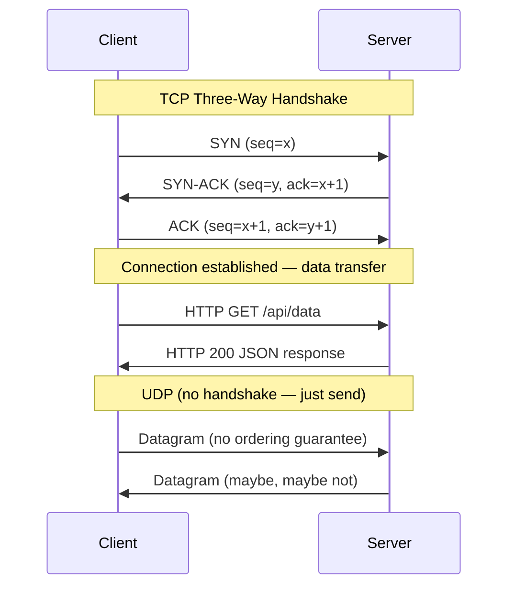

# Distributed Systems & Communication — Advanced Deep Dive

*As an Infrastructure Architect at Microsoft, I've designed communication layers for systems that span 50+ data centers and process exabytes of data daily. This module goes beyond REST vs gRPC debates into the raw transport layer, the mechanics of distributed consensus, and the fault-tolerance patterns that separate production-grade systems from prototypes.*

> **Prerequisites:** This module assumes you have read the beginner-friendly [Module 4 guide](04-distributed-comm.md) and understand REST, gRPC, WebSockets, Raft consensus, vector clocks, circuit breakers, and the fallacies of distributed computing. You should be comfortable with TCP/UDP basics, JSON vs Protobuf serialization, and idempotency concepts.

---

## Table of Contents

1. [Transport Layer Engines — TCP vs UDP](#1-transport-layer-engines--tcp-vs-udp)
2. [RPC vs REST Internals](#2-rpc-vs-rest-internals)
3. [Distributed Consensus Concepts](#3-distributed-consensus-concepts)
4. [Fault-Tolerance Patterns](#4-fault-tolerance-patterns)
5. [Lesson Plan — RPC vs REST Comparison Chart](#5-lesson-plan--rpc-vs-rest-comparison-chart)
6. [Glossary of Key Terms](#6-glossary-of-key-terms)
7. [Key Takeaways](#7-key-takeaways)

---

## 1. Transport Layer Engines — TCP vs UDP



### TCP — The Full Handshake Anatomy

TCP provides a **reliable, ordered, connection-oriented** byte stream. Every deployment of REST, gRPC, or HTTPS rides on TCP (or its successor QUIC). Understanding the exact mechanics is essential for debugging performance issues at scale.

**The Three-Way Handshake:**

```
Client                              Server
  │                                    │
  │────── SYN (seq=x) ──────────────▶  │  Step 1: Client sends SYN with random seq number
  │                                    │
  │◀──── SYN-ACK (seq=y, ack=x+1) ────│  Step 2: Server responds with its own SYN + ACK of client's seq
  │                                    │
  │────── ACK (seq=x+1, ack=y+1) ──▶  │  Step 3: Client ACKs server's SYN
  │                                    │
  │══════ Connection Established ══════│
  │────── HTTP Request ───────────────▶│  Data transfer begins
```

**Cost of one handshake:**
- Same data center: ~500 µs (0.5 ms) — both hosts are physically close.
- Cross-country: ~40-80 ms (round trip time between US East and West).
- Cross-continent: ~150-300 ms (US to Europe or Asia).

**Connection pooling — why it matters:**
Without connection pooling, every HTTP request requires a new TCP handshake:
- New connection: 1 RTT for handshake + 1 RTT for TLS + 1 RTT for HTTP request = 3 RTTs before data.
- Pooled connection: 0 RTT for handshake + 0 RTT for TLS (already done) + 1 RTT for HTTP request = 1 RTT.

**At 10,000 requests per second cross-country:**
- No pooling: 10,000 × 3 RTTs × 60ms = 1,800 seconds of connection setup overhead per second. Impossible without massive parallelism.
- With pooling: 10,000 × 1 RTT × 60ms = 600 seconds of data transfer per second. Achievable with ~100 persistent connections.

### TCP Flow Control — The Window Mechanism

TCP uses a **sliding window** to prevent a fast sender from overwhelming a slow receiver:

```
Sender                      Receiver
  │                            │
  │── Window=64KB ──────────▶  │  Receiver advertises: "I can accept 64 KB before you wait"
  │── [segment 1-1460] ─────▶  │
  │── [segment 1461-2920] ──▶  │
  │── ... until window full     │
  │◀── ACK (seq=2921) ────────│  Receiver processes, sends ACK, opens window
  │── [segment 2921-4380] ──▶  │  Sender continues
```

**The Nagle's algorithm effect:** TCP can buffer small writes before sending, waiting for either:
- The buffer to reach MSS (Maximum Segment Size, typically 1460 bytes).
- An ACK from the previous segment (delayed ACK, typically 200ms).

For latency-sensitive applications (real-time gaming, audio), Nagle's algorithm must be disabled (TCP_NODELAY). Otherwise, a 100-byte write sits in the buffer for 200ms waiting for an ACK — disastrous for real-time communication.

**Head-of-Line Blocking (TCP's fundamental flaw):**
```
Packet 1: HTTP request (lost)
Packet 2: HTTP request (arrives)
Packet 3: HTTP request (arrives)

Receiver processes: Packet 1 (stuck — waiting for retransmission)
                   Packet 2 (must wait — ordered delivery)
                   Packet 3 (must wait)
```

A single lost packet blocks all subsequent packets until retransmitted. HTTP/2 multiplexing over TCP still suffers from HOL blocking. **QUIC solves this** by running on UDP with per-stream independent ordering.

### UDP — Connectionless, Best-Effort, Low-Latency

UDP sends **datagrams** — independent messages with no ordering, no reliability, no flow control. The application handles everything.

**When UDP wins:**
- **DNS lookups:** One query, one response. If the response is lost, the client retries. No handshake overhead.
- **Media streaming (RTP/WebRTC):** Losing one video frame is acceptable (it's displayed for 33ms). Retransmitting it would delay subsequent frames — worse than dropping.
- **Cache reads (Facebook Memcached):** If a cache read is lost, fall back to the database. No need for TCP overhead.
- **QUIC (HTTP/3):** Google designed QUIC to provide TCP-like reliability and TLS-like security over UDP, while eliminating HOL blocking and reducing handshake latency to 0 RTT for returning clients.

**The disadvantage — no built-in congestion control:**
A misconfigured UDP application can saturate a network link, starving TCP connections. This is why production UDP systems implement their own congestion control (e.g., QUIC copies TCP's cubic congestion algorithm; WebRTC uses GCC — Google Congestion Control).

### The Cost of Data Center vs Global Round Trips

| Distance | Typical RTT | TCP Handshake | TLS 1.3 Handshake | Total Before Data |
|----------|-------------|---------------|-------------------|-------------------|
| Same rack | < 100 µs | 200 µs | 300 µs | 500 µs |
| Same data center | 0.5 ms | 1 ms | 1.5 ms | 2.5 ms |
| Same region | 5-10 ms | 10-20 ms | 15-30 ms | 30-50 ms |
| Cross-continent | 60-120 ms | 120-240 ms | 180-360 ms | 300-600 ms |
| Intercontinental | 150-300 ms | 300-600 ms | 450-900 ms | 750 ms - 1.5 s |

**The connection pooling optimization:** A single pooled TCP connection reused for 1,000 requests amortizes the handshake cost across all of them. The first request pays the setup penalty; requests 2-1000 pay zero setup cost. This is why gRPC requires persistent connections (HTTP/2) and why connection pools in HTTP clients (Go's `http.Transport`, Java's `HttpClient`, Python's `urllib3`) are critical for performance.

---

## 2. RPC vs REST Internals

### REST — Resource-Oriented, HTTP-Verb-Based

**REST semantics:**
```
GET    /users/42          → Read user 42
PUT    /users/42          → Replace user 42
PATCH  /users/42          → Partial update of user 42
POST   /users             → Create new user
DELETE /users/42          → Delete user 42
```

Each HTTP request is self-contained (stateless). The server holds no client context between requests. REST relies entirely on HTTP semantics: status codes, headers, caching directives.

**Under the hood of a REST JSON call:**
```
1. TCP connection established (or reused from pool)
2. TLS handshake (if HTTPS)
3. Client sends: POST /api/orders HTTP/1.1
                  Host: example.com
                  Content-Type: application/json
                  Authorization: Bearer <jwt>
                  
                  {"product_id": "abc", "quantity": 2}
4. Server parses JSON (slow — text parsing, reflection/deserialization)
5. Server processes
6. Server sends: HTTP/1.1 200 OK
                 Content-Type: application/json
                 
                 {"order_id": 1234, "status": "created"}
7. Client parses JSON response
```

**Why JSON is expensive at scale:**
- **Parsing CPU:** Parsing a 1 KB JSON response takes ~10-50 µs in Python (more with reflection), ~1-5 µs in Go. At 100K RPS, that's 1-5 cores just for JSON parsing.
- **Payload size:** JSON has field names repeated in every message. `{"product_id": "abc", "quantity": 2}` sends `product_id` and `quantity` as strings — 26 bytes of field names for 6 bytes of actual data. **400% overhead.**
- **Schema enforcement:** JSON is schemaless at the wire level. A missing field is not an error — it's a silent null. Bugs from unexpected field absence are common.

### RPC (gRPC) — Procedure-Call Abstraction, Binary Serialization

**gRPC semantics:**
```
service UserService {
    rpc GetUser(GetUserRequest) returns (GetUserResponse);
    rpc UpdateUser(UpdateUserRequest) returns (UpdateUserResponse);
    rpc ListUsers(ListUsersRequest) returns (stream UserResponse);  // Server streaming
    rpc Chat(stream ChatMessage) returns (stream ChatMessage);      // Bidirectional streaming
}
```

Each RPC is defined by a `.proto` file — a strict contract. The client calls a method as if it were a local function call.

**Under the hood of a gRPC call:**

```
1. HTTP/2 connection established (multiplexed — single TCP connection for all streams)
2. TLS handshake (if mTLS)
3. Client sends HTTP/2 frame (binary format):
     HEADERS frame: :method = POST
                    :path = /UserService/GetUser
                    content-type = application/grpc+proto
     
     DATA frame: Protobuf-encoded {user_id: 42}
                 (binary — field tag 1 = varint 42 = 1 byte)

4. Server reads Protobuf directly into typed struct (zero parsing — just memory copy)
5. Server processes
6. Server sends HTTP/2 frame:
     HEADERS frame: :status = 200
     DATA frame: Protobuf-encoded {name: "Amina", email: "a@b.com"}
```

**Protobuf encoding — how it achieves compact binary:**

```protobuf
message User {
  int32 id = 1;       // field tag 1, wire type 0 (varint)
  string name = 2;    // field tag 2, wire type 2 (length-delimited)
  string email = 3;   // field tag 3, wire type 2
}
```

Encoded bytes for `{id: 42, name: "Amina", email: "a@b.com"}`:

```
Field 1 (id):          08 2A           // tag=1, type=0 | varint 42 = 0x2A
Field 2 (name):        12 05 41 6D 69 6E 61  // tag=2, type=2 | length=5 | "Amina"
Field 3 (email):       1A 07 61 40 62 2E 63 6F 6D  // tag=3, type=2 | length=7 | "a@b.com"
Total: 17 bytes
```

Equivalent JSON: `{"id":42,"name":"Amina","email":"a@b.com"}` = 44 bytes.

**Protobuf saves 61% of wire bytes** for this message. At 1 billion RPCs/day, that's gigabytes of bandwidth saved.

### Why Internal Microservices Prefer Binary Over JSON

| Concern | JSON | Protobuf | Impact at Scale |
|---------|------|----------|-----------------|
| **Payload size** | 44 bytes for `{id:42, name:"Amina"}` | 10 bytes | 4x bandwidth savings |
| **Serialization CPU** | 5-50 µs (reflection, string parsing) | 0.5-2 µs (binary layout) | 10-25x CPU savings |
| **Schema enforcement** | Runtime — missing fields are null silently | Compile-time — missing fields cause compilation errors | Fewer production bugs |
| **Backward compatibility** | Add field → old clients ignore | Add field with `optional` → old clients ignore | Same, but enforced by proto tooling |
| **Streaming** | Not native (SSE or WebSocket required) | Native HTTP/2 streaming (client, server, bidirectional) | No extra infrastructure |
| **Tooling** | curl, Postman, browser | grpcurl, grpc-gateway (REST proxy) | Debugging is harder |

**The rule of thumb:**
- **External APIs (public-facing):** REST + JSON. Debuggability and browser support matter more than CPU savings.
- **Internal APIs (microservice ↔ microservice):** gRPC + Protobuf. CPU and bandwidth savings compound across every hop.
- **But never mix:** A service that speaks gRPC internally should not expose gRPC to external clients without a REST proxy in front. Browsers don't speak gRPC natively (unless using gRPC-Web + Envoy).

---

## 3. Distributed Consensus Concepts

### GFS Centralized Master vs Dynamo Decentralized

These two systems represent the fundamental architectural split in distributed storage: **centralized consensus (GFS)** vs **decentralized consensus (Dynamo)**.

**GFS Architecture:**

```
Client
  │
  ├── Metadata path: ──▶ GFS Master (single node, in-memory metadata)
  │                         │
  │                         └── Manages: file namespace, chunk locations, lease assignments
  │
  └── Data path: ──▶ Chunkserver A (primary replica, holds the lease)
                      │
                      ├── Chunkserver B (secondary replica)
                      └── Chunkserver C (secondary replica)
```

**Lease mechanism in GFS:**
1. The master grants a **lease** to one chunkserver (the primary) for each chunk. The lease lasts 60 seconds by default.
2. All mutations to a chunk go through the primary.
3. The primary serializes writes and pushes to secondaries.
4. If the primary fails, the master waits for the lease to expire (60s) and then grants a new lease to a different chunkserver.

**The centralized trade-off:**
- **Pro:** Simple consistency model. No conflicts. No vector clocks.
- **Con:** The master is a single point of failure and a throughput bottleneck. All metadata operations are serialized through the master. GFS mitigates this with a shadow master (read-only) and by keeping metadata in memory (~64 bytes per file → 1 billion files fit in 64 GB RAM).

**Dynamo Architecture:**

```
Any node can accept any request for any key
  │
  ├── Each key is replicated to N nodes (typically 3)
  ├── No single master for any key
  ├── Conflict resolution via vector clocks
  └── Anti-entropy via Merkle trees
```

**Dynamo's decentralized trade-off:**
- **Pro:** No single point of failure. Writes are always available (sloppy quorum). Scales linearly with nodes.
- **Con:** Conflicts are inevitable. Clients may see stale data. Application must handle siblings.

### Leader Election — Raft-Style Majority

Raft is the most widely deployed consensus algorithm (etcd, Consul, MongoDB replica sets, TiKV). Key principles:

```
Cluster: 5 nodes
Leader: Node 3
Term: 7

            ┌─────────┐
            │ Node 1  │ (Follower)
            └────┬────┘
                 │              
┌─────────┐      │      ┌─────────┐
│ Node 2  │──────┼──────│ Node 3  │ (Leader)
│(Follower)      │      │         │
└─────────┘      │      ├─ broadcasts AppendEntries heartbeats
                 │      │─ receives all client writes
            ┌─────────┐│─ sends writes to followers, waits for majority ACK
            │ Node 4  ││
            │(Follower)│
            └────┬────┘
                 │
            ┌─────────┐
            │ Node 5  │ (Follower)
            └─────────┘
```

**Leader election mechanics:**
1. Followers expect a heartbeat from the leader every 150-300ms (randomized timeout).
2. If a follower hears nothing for its timeout, it increments its **term** counter and transitions to **Candidate**.
3. The candidate votes for itself and sends `RequestVote` RPCs to all other nodes.
4. If it receives votes from a majority (N/2 + 1), it becomes the leader.
5. The new leader begins sending heartbeats to establish authority.

**Why Raft uses randomized timeouts:**
```
Without randomization:
  All followers have 150ms timeout.
  All followers become candidates simultaneously.
  All split their votes (each votes for itself).
  No one gets majority. New election called. Repeat. Deadlock.

With randomization (150-300ms):
  Follower A times out at 157ms. Becomes candidate.
  Follower A sends RequestVote to B and C before they time out.
  B and C vote for A (they see A's term > their current term).
  A becomes leader. Clean.
```

### Vector Clocks vs Last-Write-Wins — The Deep Mechanics

**Last-Write-Wins (LWW):**
```
Write 1: {balance: 100} at timestamp T1
Write 2: {balance: 50}  at timestamp T2 (T2 > T1)
Result:  {balance: 50}  (T2 wins, T1 is lost — even if T2 was a concurrent withdrawal on a different node)
```

LWW is simple but **silently destroys data**. A user adds $100 to their account on node A at the same time as a withdrawal of $50 on node B. LWW picks whichever timestamp is later and discards the other. The user loses $100.

**Vector clocks — the conflict-aware alternative:**

Each node maintains a counter. Every update increments the local counter and includes the full vector in the response.

```
Node A        Node B         Node C
  │             │              │
  │── Write ──▶ │              │  Initial write: {items: []}
  │             │              │  Clock: {A:1}
  │             │              │
  │             │── Write ───▶ │  Write "book" on B: {items: ["book"]}, clock: {A:1, B:1}
  │             │              │
  │── Write ───▶│              │  Write "pen" on C: {items: ["pen"]}, clock: {A:1, C:1}
  │             │              │
  │             │              │  Reconciliation:
  │             │              │  Clock {A:1, B:1} vs {A:1, C:1}
  │             │              │  Neither dominates → sibling conflict
  │             │              │  Merge: {items: ["book", "pen"]}
  │             │              │  New clock: {A:1, B:1, C:1, R:1}
```

**The cost of vector clocks:** The clock grows with the number of nodes that have touched the key. In Dynamo, this is bounded by the replication factor N (typically 3-5). But if a key is touched by many nodes (e.g., a global object), the clock can grow unbounded. Dynamo uses clock truncation — if a clock exceeds a threshold, old entries are dropped (sacrificing some conflict detection precision).

---

## 4. Fault-Tolerance Patterns

### Retries with Exponential Backoff

**The naive retry pattern (dangerous):**
```python
def make_request():
    response = http_client.post(url, data)
    if response.status == 503:
        make_request()  # Immediate retry — will amplify the pileup
```

At 10,000 requests/second, if the server starts returning 503 under load, this immediate retry pattern doubles the request rate to 20,000 RPS. The server slows further, returning more 503s, which triggers more retries. **Cascading failure.**

**The correct pattern — exponential backoff with jitter:**

```python
import random
import time

def make_request_with_backoff(url, data, max_retries=5):
    base_delay = 1.0  # 1 second base
    
    for attempt in range(max_retries):
        response = http_client.post(url, data)
        
        if response.status == 200:
            return response
        
        if response.status >= 500 and attempt < max_retries - 1:
            # Exponential: 1s, 2s, 4s, 8s
            delay = base_delay * (2 ** attempt)
            # Jitter: add ±50% randomness
            jitter = random.uniform(0.5, 1.5)
            actual_delay = delay * jitter
            
            time.sleep(actual_delay)
            continue
        
        # Non-retryable error (400, 403, 404) or exhausted retries
        raise Exception(f"Request failed: {response.status}")
```

**Why jitter matters:**
- Without jitter: Every client retries at exactly 1s, 2s, 4s, 8s. All retries synchronize. The server sees staircase-shaped load spikes.
- With jitter (50%): Retries spread out. A 2s delay becomes 1-3s. Clients desynchronize naturally.

**The AWS retry mode —** Exponential backoff with **full jitter**:
```
delay = random.uniform(0, base * (2 ** attempt))
```
This is more aggressive than additive jitter and is the default in AWS SDKs.

### Circuit Breaker — The Three States

```
         ┌─────────────────────────────────┐
         │                                 │
         ▼                                 │
   ┌──────────┐   failure > threshold   ┌──────────┐
   │  CLOSED  │ ─────────────────────────▶│   OPEN   │
   │ (normal) │                          │ (failed) │
   └──────────┘                          └──────────┘
         ▲                                    │
         │                                    │
         │         timeout elapsed             │
         │                                    │
         │   ┌──────────────┐                 │
         │   │  HALF-OPEN   │◀────────────────┘
         │   │  (probing)   │
         │   └──────┬───────┘
         │          │
         │          ├── success → CLOSED
         │          └── failure → OPEN (restart timeout)
         └──────────────────────────────────────┘
```

**State machine parameters:**
- **failure_threshold:** Number of consecutive failures before opening (e.g., 5 failures in 10 seconds).
- **timeout:** How long the circuit stays open before transitioning to half-open (e.g., 30 seconds).
- **half_open_max_requests:** How many trial requests are allowed in half-open state (e.g., 3 requests).

**The circuit breaker in production:**

```python
class CircuitBreaker:
    def __init__(self, failure_threshold=5, recovery_timeout=30.0):
        self.state = "CLOSED"
        self.failure_count = 0
        self.failure_threshold = failure_threshold
        self.recovery_timeout = recovery_timeout
        self.last_failure_time = None
        self.half_open_requests = 0
        self.half_open_max = 3

    def call(self, func, *args, **kwargs):
        if self.state == "OPEN":
            if time.time() - self.last_failure_time > self.recovery_timeout:
                self.state = "HALF_OPEN"
                self.half_open_requests = 0
            else:
                raise CircuitBreakerOpenError("Circuit is open")
        
        if self.state == "HALF_OPEN":
            if self.half_open_requests >= self.half_open_max:
                raise CircuitBreakerOpenError("Circuit is half-open, max probes reached")
            self.half_open_requests += 1
        
        try:
            result = func(*args, **kwargs)
            self.on_success()
            return result
        except Exception as e:
            self.on_failure()
            raise e
    
    def on_success(self):
        if self.state == "HALF_OPEN":
            self.state = "CLOSED"
            self.failure_count = 0
    
    def on_failure(self):
        self.failure_count += 1
        self.last_failure_time = time.time()
        if self.failure_count >= self.failure_threshold:
            self.state = "OPEN"
```

### Jitter — Desynchronizing Retry Storms

**The math of synchronized retries:**

Without jitter, N clients all crash into the database at the same time:
```
Time 0:  N requests (all fail)
Time 1:  N retries (all hit DB)
Time 2:  2N retries (DB slowing)
Time 4:  4N retries (DB overwhelmed)
Time 8:  8N retries (DB down)
```

With jitter, the N clients spread out across a range:
```
Time 0:   N requests (all fail)
Time 0.5-1.5: N × k retries (where k = fraction that retried at ~1s)
Time 1.5-3.5: N × k retries (spread wider)
```

The database never sees all N clients simultaneously. It sees a nearly constant stream of k clients at any moment, which it can handle.

**Types of jitter:**

| Type | Formula | Spread | Use Case |
|------|---------|--------|----------|
| None | `delay = base * 2^attempt` | 0% | Never use this |
| Equal | `delay = (base * 2^attempt) + random(0, cap)` | Additive, uniform | Simple workloads |
| Full | `delay = random(0, base * 2^attempt)` | Exponential, uniform | AWS SDK default |
| Decorrelated | `delay = min(cap, random(base, delay_prev * 3))` | Multiplicative, exponential | High-throughput systems |

**Full jitter is the most aggressive for desynchronization** because early retries can be anywhere from 0 to the current delay, guaranteeing that no two clients have the same retry schedule.

---

## 5. Lesson Plan — RPC vs REST Comparison Chart

### CRUD Operations Comparison

| Operation | REST (HTTP + JSON) | RPC (gRPC + Protobuf) |
|-----------|-------------------|----------------------|
| **Create** | `POST /orders` → 201 + JSON body | `OrderService.CreateOrder(Order)` → `OrderResponse` |
| **Read** | `GET /orders/123` → 200 + JSON body | `OrderService.GetOrder(GetOrderRequest{id: 123})` → `Order` |
| **Update** | `PUT /orders/123` → 200 + JSON body | `OrderService.UpdateOrder(UpdateOrderRequest{order})` → `Order` |
| **Patch** | `PATCH /orders/123` → 200 (partial update) | `OrderService.UpdateOrder(UpdateOrderRequest{update_mask})` |
| **Delete** | `DELETE /orders/123` → 204 No Content | `OrderService.DeleteOrder(DeleteOrderRequest{id: 123})` → `Empty` |
| **List** | `GET /orders?status=active&page=2` → 200 + JSON array | `OrderService.ListOrders(ListOrdersRequest{filter, page_token})` → stream of Orders |
| **Bulk Create** | `POST /orders/bulk` → 201 + JSON array | `OrderService.BulkCreateOrders(stream Order)` → `BulkResponse` |

**When REST is the right choice:**
- Public APIs consumed by third-party developers (browser JavaScript, curl, mobile apps with varying SDKs).
- Simple CRUD with low throughput (< 10K RPS).
- Debugging and human readability is a priority.
- You need HTTP caching (CDN, browser cache) — REST naturally supports `Cache-Control`, `ETag`, `Last-Modified`.

**When RPC is the right choice:**
- Internal microservice communication (high throughput, low latency).
- Streaming use cases (real-time data feeds, log ingestion, event subscriptions).
- Polyglot environments — Protobuf generates native types for 20+ languages.
- Strong typing and schema enforcement are critical.

**The hybrid pattern (used by Google, Netflix, Uber):**

```
External Client (browser/mobile)
        │
        ▼
REST/JSON Gateway (Envoy, NGINX, Apigee)
        │  Converts JSON ↔ Protobuf
        ▼
Internal Microservices (gRPC + Protobuf)
```

The gateway translates external REST calls into internal gRPC calls. The internal system benefits from binary performance; external clients get debuggable JSON. This is the pattern adopted by Google Cloud APIs, Netflix's API gateway, and Uber's edge architecture.

---

## 6. Glossary of Key Terms

| Term | Section | Definition |
|------|---------|------------|
| Three-Way Handshake | 1 | SYN → SYN-ACK → ACK sequence establishing a TCP connection, costing exactly one network round trip |
| Connection Pooling | 1 | Reusing persistent TCP connections across multiple HTTP requests, eliminating per-request handshake overhead |
| Nagle's Algorithm | 1 | TCP optimization that buffers small writes to coalesce into larger segments; must be disabled for latency-sensitive apps |
| Head-of-Line Blocking | 1 | TCP's ordered delivery causing a lost packet to block all subsequent packets until retransmitted |
| QUIC | 1 | HTTP/3 transport protocol over UDP with per-stream ordering, 0-RTT handshake, and built-in encryption |
| Protocol Buffers | 2 | Binary serialization format using field tags and wire types, producing compact messages with compile-time schema enforcement |
| Field Tag | 2 | Numeric identifier for each Protobuf field, replacing textual field names to reduce wire size |
| gRPC | 2 | RPC framework using Protobuf over HTTP/2, supporting bidirectional streaming and strict service contracts |
| Lease (GFS) | 3 | Time-limited exclusive write permission granted by the master to a primary replica, preventing conflicting mutations |
| Raft Term | 3 | Monotonically increasing logical clock in Raft consensus, used to detect stale leaders and resolve election conflicts |
| RequestVote RPC | 3 | Raft message sent by candidates during leader elections, requesting vote from each cluster member |
| Exponential Backoff | 4 | Retry strategy where delay doubles between attempts; the fundamental pattern for handling transient failures |
| Jitter | 4 | Random variation added to retry delays to desynchronize clients and prevent thundering herd retry storms |
| Circuit Breaker | 4 | Fault-tolerance pattern with three states (closed/open/half-open) that stops requests to failing dependencies |
| Half-Open | 4 | Circuit breaker state allowing a limited number of probe requests to test if a failed dependency has recovered |
| Sloppy Quorum | 3 | Write quorum that accepts acknowledgments from any N healthy nodes, not the specific N owners of a key |
| Hinted Handoff | 3 | Temporary write storage on a non-owner node during partition, forwarded to the correct owner on recovery |
| Full Jitter | 4 | AWS-recommended retry jitter: `delay = random(0, base * 2^attempt)` — the most aggressive desynchronization |

---

## 7. Key Takeaways

1. **TCP handshakes cost one RTT — pool your connections.** Without pooling, every request pays 1 RTT for TCP + 1 RTT for TLS before any data transfers. Connection pooling amortizes this across thousands of requests.

2. **TCP head-of-line blocking is real and dangerous.** HTTP/2's multiplexing looks good on paper but a single dropped packet blocks all streams. If latency is critical, use QUIC (HTTP/3) or design for UDP with application-level reliability.

3. **Protobuf saves 40-60% bandwidth and 10x CPU over JSON** for internal microservice communication. The schema enforcement catches bugs at compile time that JSON catches in production.

4. **The REST vs gRPC decision is not binary — use a gateway.** Expose REST/JSON to external clients (debuggability, browser support). Convert to gRPC internally (performance, schema enforcement).

5. **GFS centralized master gives simple consistency but creates a SPOF and throughput bottleneck.** Dynamo decentralization gives availability and linear scalability but requires application-level conflict resolution. Choose based on whether you need simple reads (GFS) or always-available writes (Dynamo).

6. **Raft's randomized timeout is essential for election stability.** Fixed timeouts cause perpetual split votes. Randomized timeouts (150-300ms) ensure one candidate almost always wins without contention.

7. **Vector clocks are strictly superior to last-write-wins** for any system where data loss is unacceptable. The cost is growing clock sizes, mitigated by truncation.

8. **Always use exponential backoff with full jitter for retries.** Without jitter, all retries synchronize and create staircase load spikes. Full jitter `random(0, base * 2^attempt)` is the AWS standard for a reason.

9. **Circuit breakers must have three states.** Closed → Open → Half-Open (with limited probes). A two-state breaker (closed/open) cannot recover without manual intervention.

10. **The half-life of a bug in distributed systems is proportional to how rarely it occurs.** A failure interaction that happens once per million requests will take weeks to surface. Test with fault injection (Toxiproxy, Chaos Monkey) — do not wait for production to reveal your blind spots.

---

> This advanced guide extends the foundation built in the [beginner-friendly Module 4](04-distributed-comm.md). You now understand the raw mechanics of TCP vs UDP at the transport layer, the binary internals of Protobuf encoding, the fundamental consensus split between GFS and Dynamo, and the production-grade fault-tolerance patterns that keep planetary-scale systems alive.
>
> *"The network is not just unreliable — it is actively trying to break your system. Every retry, every timeout, every circuit breaker is a conversation with that reality. Design accordingly."*
