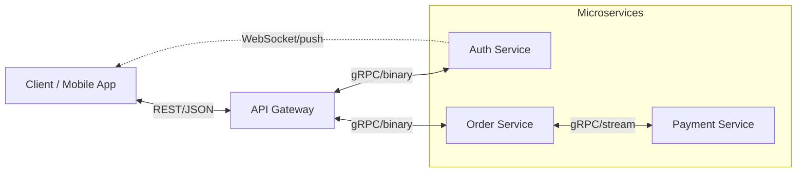

> **You've used this when...** You opened a messaging app and the message arrived instantly. You refreshed a shared document and saw a teammate's cursor moving in real time. You ordered food and the status updated automatically from "preparing" to "out for delivery" to "delivered."
>
> Every one of those seamless interactions hides a miracle of coordination: two or more computers agree on what happened, in what order, and what to do when something breaks. Distributed systems are the plumbing that makes modern apps feel like magic. There is no app without this plumbing — but when this plumbing fails, the app can silently corrupt data, serve stale information, or fall over entirely.
>
> This module explains how services communicate, how they stay consistent without a central boss, and how they survive the inevitable failures of the real world.

# Distributed Systems & Communication – A Beginner’s Guide

> This guide explains how programs talk to each other across unreliable networks.
> We use simple analogies and plain language.
> Every technical term is defined the first time it appears, and a full Glossary is at the end.
> After reading this, the original advanced module will feel like a natural extension.

---

> **Before you start:** You should understand [Module 1: Traffic Routing & Network Foundations](#) (DNS, CDN, load balancers) and [Module 2: Database Scaling](#) (replication, partitioning). This module builds on those networking and data concepts.
>
> No prior knowledge of distributed algorithms is needed. We explain every concept from first principles.

---

## Table of Contents

1. [Why Distributed Systems Are Hard](#1-why-distributed-systems-are-hard)
2. [How Services Talk: REST, gRPC, WebSockets](#2-how-services-talk-rest-grpc-websockets)
3. [Data Formats: JSON vs Binary (Protobuf)](#3-data-formats-json-vs-binary-protobuf)
4. [Making Retries Safe: Idempotency](#4-making-retries-safe-idempotency)
5. [Choosing a Leader: Raft Consensus (The Captain Analogy)](#5-choosing-a-leader-raft-consensus-the-captain-analogy)
6. [Detecting Conflicting Changes: Vector Clocks](#6-detecting-conflicting-changes-vector-clocks)
7. [Preventing Cascading Failures: Circuit Breakers](#7-preventing-cascading-failures-circuit-breakers)
8. [Common Misconceptions (The Fallacies)](#8-common-misconceptions-the-fallacies)
9. [Testing Failure Before It Strikes: Toxiproxy](#9-testing-failure-before-it-strikes-toxiproxy)
10. [Putting It All Together](#10-putting-it-all-together)
11. [Glossary of Technical Terms](#11-glossary-of-technical-terms)
12. [Key Takeaways](#12-key-takeaways)

---

> **⏱ TL;DR — If you only learn 3 things from this module:**
> 1. **The network lies.** Messages can be delayed, duplicated, dropped, or reordered. Every system must be designed assuming the network is unreliable.
> 2. **Idempotency is your best friend.** If an operation can be safely retried without side effects, most distributed failures become manageable. Always design your APIs to be idempotent.
> 3. **Failures cascade.** A single slow service can take down your entire system. Use circuit breakers, timeouts, and bulkheads to contain failures before they spread.

---

## 1. Why Distributed Systems Are Hard

A **distributed system** is a group of independent computers (called **nodes**) that work together over a network to appear as one unified system. The problem? **The network is not reliable.** Messages can be delayed, lost, or arrive out of order. A computer can crash and restart, or its clock can be slightly off.

The core challenge of distributed systems is **handling failure gracefully**. You cannot prevent failure; you can only design your system to detect it, limit its impact, and recover without human intervention.

Think of it like a team of chefs in separate kitchens, communicating over walkie‑talkies. The walkie‑talkie might cut out (network partition), a chef might faint (node crash), or a chef might be busy and respond late (high latency). The recipes must still be followed, and the meal must still be served.

---

## 2. How Services Talk: REST, gRPC, WebSockets

When two programs need to communicate, they must agree on a **protocol** – a set of rules for how messages are structured and exchanged.

### REST (Representational State Transfer)

**Analogy:** Sending a letter with a standard form.
- You write your request in a structured way (GET /users/42) on a piece of paper.
- You put it in an envelope and mail it (HTTP).
- The recipient opens the envelope, reads your request, and sends back a letter with the answer.
- Most common format is **JSON** – a human‑readable text format.

**Good for:** Public APIs, web browsers, simple request‑response patterns.
**Weakness:** Text parsing can be slower at scale; streaming data is not native.

### gRPC (gRPC Remote Procedure Call)

**Analogy:** A direct phone call where you fill out a shared, pre‑agreed form.
- Both sides agree on a contract (a `.proto` file that defines the exact structure).
- When you call, you send binary data that is very compact and fast to decode.
- It runs over **HTTP/2**, which supports streaming (sending multiple responses over the same call, like a live feed).
- **Protobuf** is the most common serialization format (see next section).

**Good for:** High‑speed internal microservices, mobile apps talking to backends, real‑time data feeds.
**Weakness:** Not directly readable by a browser without extra tools; harder to debug by hand.

### WebSockets

**Analogy:** Two walkie‑talkies that stay on the same channel for a long conversation.
- Once the connection is established, both sides can send messages at any time.
- No need to keep sending new letters or re‑dialling; the channel is always open.
- Used for real‑time updates: chat, live sports scores, collaborative editing.

**Good for:** Live dashboards, messaging, gaming.
**Weakness:** Maintaining many long‑lived connections can consume server resources.

| Style | Best for | Like… | Don't use when… |
|-------|----------|-------|-----------------|
| **REST + JSON** | Public APIs, simple request‑response, CRUD operations | Mailing letters | Latency is critical (text parsing is slower); you need real‑time streaming or server push |
| **gRPC + Protobuf** | High‑speed internal microservices, mobile→backend, real‑time data feeds | Pre‑filled form on a phone call | Your clients are browsers (no native gRPC support); debugging by hand matters; team is unfamiliar with `.proto` contracts |
| **WebSockets** | Live dashboards, chat, gaming, collaborative editing | Open walkie‑talkie channel | You only need request‑response (the overhead of maintaining a persistent connection is wasted); you need to scale to millions of concurrent users without careful connection management |

---

## 3. Data Formats: JSON vs Binary (Protobuf)

When you send data over the network, it must be converted into a stream of bytes. This process is called **serialization** (converting an object into bytes) and **deserialization** (rebuilding the object from bytes).

**JSON (JavaScript Object Notation)**
- Text format: `{"user_id": "42", "name": "Amina"}`
- Human‑readable and universal.
- Verbose: field names are repeated, and parsing text is slower.

**Protobuf (Protocol Buffers)**
- Binary format: you define the structure once, and the data is encoded in a compact, efficient binary form.
- The field names are replaced by tiny numbers (field tags).
- Faster to parse and smaller over the network.
- Used by gRPC and many internal systems.

**Why it matters at scale:** If you make millions of API calls per second, JSON parsing can eat up a significant amount of CPU and network bandwidth. Binary formats reduce that cost.

| Format | Readability | Speed | Payload Size | Schema required? | Best for |
|--------|-------------|-------|--------------|------------------|----------|
| **JSON** | High (text, human‑readable) | Moderate | Larger | No | Public APIs, browser clients, debugging, logs |
| **Protobuf** | Low (binary) | Very high | Very small | Yes (`.proto` file) | Internal microservices, high‑throughput RPC (gRPC), mobile apps |
| **Avro** | Medium (schema stored alongside data) | High | Small | Yes (schema embedded or external) | Streaming data pipelines (Kafka), Hadoop ecosystem, schema evolution |

> **Which to choose?**
> - **Public API or MVP?** Use JSON. Debugging by hand is worth the overhead.
> - **Internal high‑volume service (>10K RPS)?** Use Protobuf. The CPU and bandwidth savings add up fast.
> - **Data pipeline (Kafka, Hadoop)?** Use Avro. It's designed for schema evolution — old and new clients can coexist without breaking.

---

## 4. Making Retries Safe: Idempotency

In a distributed system, you often **retry** a request because the first one might have been lost. But retrying can be dangerous: what if the first request actually succeeded and you’re now doing the same thing twice? (e.g., charging a credit card twice).

**Idempotency** is the property that doing the same operation multiple times has the same effect as doing it once.

**Analogy:** Pressing an elevator button. Press it once or five times – the elevator still comes once. The button press is idempotent.

### How to achieve it

1. The client generates a unique **idempotency key** (like a UUID) for each important request.
2. The server stores that key along with the response the first time it processes the request.
3. If the server receives the same key again, it simply returns the stored response without performing the operation again.

**Example:** A payment service. The client sends `POST /payments` with an idempotency key. If the network drops, the client retries with the same key. The server sees the key is already known and replies, “payment already processed”.

**Important:** The idempotency record must be saved in the same database transaction as the actual business change (e.g., inserting the payment). Otherwise, a crash could save the payment but not the key, or vice versa.

**Idempotency is not magic:** It only works for exactly the same request. Two different update operations (like “set balance to 50” and “withdraw 10”) may conflict – that requires a different technique (like version checks or vector clocks).

---

## 5. Choosing a Leader: Raft Consensus (The Captain Analogy)

When you have multiple servers that must agree on the same state (like the order of transactions), you need a **consensus algorithm**. **Raft** is a popular one because it’s designed to be understandable.

**Analogy:** A sailing ship with a crew that must elect a captain.

- Every crew member starts as a **follower**.
- If followers don’t hear from a captain for a while, they become **candidates** and call an election.
- A candidate asks the others for votes. If a candidate gets votes from the majority of the crew, it becomes the **leader** (captain).
- The captain now sends regular **heartbeats** (AppendEntries messages, even if there’s no new data) to let everyone know they’re still in charge.
- If the captain fails, the followers will detect the missing heartbeats and start a new election.

**Key details:**
- Each election cycle is numbered with a **term** (like a calendar year). Terms only increase.
- If a server sees a message from a higher term, it immediately steps down (it knows a new leader has emerged in a later term).
- Elections have **randomized timeouts** to prevent multiple candidates from splitting the vote forever.

This ensures that at any given time, at most one captain is giving orders, and the ship moves in one direction.

---

## 6. Detecting Conflicting Changes: Vector Clocks

When data can be updated on multiple servers at the same time (especially during a network partition), conflicts can happen. A **vector clock** is a tool that helps you detect these conflicts automatically.

**Analogy:** Each update is like a receipt with a list of who has seen the item and how many times. If you have two receipts and neither’s counts are all greater than or equal to the other’s, you know they were written independently and need to be merged.

**Example: Shopping Cart**
- Server A handles an update and says “I’ve seen 1 update from me” → clock `{A:1}`.
- During a network split, server B handles a “add book” → clock `{A:1, B:1}`.
- Simultaneously, server C handles “add pen” → clock `{A:1, C:1}`.
- When the network heals, the system compares the clocks: `{A:1, B:1}` and `{A:1, C:1}`. Neither totally dominates the other, so the versions are **siblings**.
- The application can then merge them intelligently (e.g., `items = ["book", "pen"]`) and create a new clock that includes all three servers.

Vector clocks are much safer than **last‑write‑wins**, which might silently discard one of the items. However, the actual merge logic must be written by the application developer – it knows what “merge” means for a shopping cart vs. a calendar invite.

---

## 7. Preventing Cascading Failures: Circuit Breakers

Imagine you call a friend who is always slow to answer. You might decide: “If they take more than 10 seconds three times in a row, I’ll stop calling them for a minute, and if they then answer quickly a couple of times, I’ll start calling normally again.”

That’s a **circuit breaker** – a pattern that stops you from wasting time on a failing dependency and gives it time to recover.

### States

- **Closed:** Everything is normal. Requests go through. If failures exceed a threshold, open the circuit.
- **Open:** The circuit trips. Requests immediately fail without even attempting the real call. This protects both the caller (not wasting threads/time) and the failing service (not flooded with retries).
- **Half‑Open:** After a recovery timeout, a few trial requests are allowed. If they succeed, the circuit closes again. If they fail, it returns to Open.

This is essential for preventing a slow downstream service from taking down your entire system. When a circuit breaker opens, you might serve a fallback response (like cached data) or a graceful error message.

---

> **\u270f\ufe0f Check Your Understanding**
> 1. A payment service receives a request, charges the credit card, and then crashes before responding. The client retries with the same idempotency key. What happens, and why is it safe?
> 2. Two database replicas both accept writes at the same time. User A adds "apples" to a shopping list; User B removes "apples" from the same list. Without a leader, how do we know which happened first?
> 3. A downstream service starts responding in 30 seconds instead of 30 ms. Your service's response time climbs from 50 ms to 10 seconds. What should you add to protect your service?
> 

> 
Answers

> 1. **Safe because the server stored the idempotency key** in the same transaction as the charge. When the retry arrives, the server finds the key, returns the stored response, and does not charge again. The key and the charge are committed together.
> 2. **This is exactly what vector clocks solve.** Each replica stamps the write with its own counter. Later, when the replicas sync, they compare clocks: one shows "Alice: 5, Bob: 3" and the other "Alice: 5, Bob: 4". Neither clearly descends the other, so the conflict is flagged for merge (like keeping both items and asking the user).
> 3. **A circuit breaker.** After detecting that 50% of requests exceed a 2-second timeout, the circuit breaker opens and immediately fails or falls back to cached data without waiting for the slow downstream. This protects your service from cascading timeout pileup.
> 

---

## 8. Common Misconceptions (The Fallacies)

Distributed computing has a famous list of **fallacies** – assumptions that beginners and even experienced engineers often make. Here they are, translated:

| Fallacy | What it really means | Real‑world example |
|---------|----------------------|-------------------|
| **The network is reliable** | Cables get cut, routers misconfigure, DNS fails. | Your server is up, but half the internet can’t reach it. |
| **Latency is zero** | Sending a request across the world takes time (~100‑300ms). | A query that is fast in one region becomes slow when the user is on another continent. |
| **Bandwidth is infinite** | Networks have limits; big messages saturate them. | Sending huge JSON payloads for every request can clog the pipe. |
| **The network is secure** | Internal networks can be breached; always encrypt and authenticate. | A misconfigured firewall exposes your database to the public. |
| **Topology doesn’t change** | Servers are added, removed, or crash. IP addresses change. | An autoscaler kills a server you were talking to; you must reconnect. |
| **There is one administrator** | Cloud, DNS, third‑party APIs – each has its own admins. | Your cache outage might be caused by a DNS change you didn’t make. |
| **Transport cost is zero** | Encryption (TLS) and serialization (JSON) cost CPU. | Turning on JSON logging for everything can double your server CPU usage. |
| **The network is homogeneous** | Mobile networks, corporate firewalls, and different regions behave differently. | A user on a flaky 3G connection sees timeouts you never saw in testing. |

Understanding these fallacies is the first step to building resilient systems.

---

### Common Pitfalls: When the Fallacies Bite You

Here are the most frequent real-world failures caused by these fallacies, structured as mini incident reports.

#### Pitfall 1: The Retry Storm

| | |
|---|---|
| **Symptom** | A downstream service (e.g., database) slows down. Your retry logic kicks in, making **10x the original requests**. The extra load makes the downstream slower, which triggers more retries, until it collapses entirely. |
| **Root Cause** | Na\u00efve retry logic that retries immediately and infinitely. The fallacies of reliable network and zero latency combine to turn a small blip into a cascading failure. |
| **Real Incident** | In 2017, a minor AWS S3 outage was amplified when every service that depended on S3 retried simultaneously, overwhelming the recovery process. What should have been a 30-minute issue lasted over 4 hours. |
| **Fix** | \u2022 **Exponential backoff** \u2014 wait 1s, then 2s, then 4s, then 8s between retries.\n\u2022 **Jitter** \u2014 add randomness so retries don\u2019t synchronize.\n\u2022 **Circuit breaker** \u2014 stop retrying entirely after a threshold of failures. |
| **How to Detect Early** | Monitor the ratio of retries to original requests. If retries exceed 10% of total traffic, investigate. Use Toxiproxy in testing to verify retry behavior under failure. |

#### Pitfall 2: The Leaderless Split-Brain

| | |
|---|---|
| **Symptom** | Two database replicas accept writes independently. User data is lost or diverges. One replica shows \u201corder placed\u201d and the other shows \u201corder failed.\u201d Both are \u201cright\u201d from their own view. |
| **Root Cause** | No consensus mechanism (like Raft) to elect a single leader. Both replicas believe they should handle writes. The fallacies of topology and single administration create a \u201csplit-brain\u201d scenario. |
| **Real Incident** | A major cloud database provider experienced a network partition where two regions both believed they were the primary. Customer data diverged across regions for 20 minutes before engineers detected and manually resolved the conflict. |
| **Fix** | \u2022 **Use Raft or Paxos** for leader election so only one node accepts writes.\n\u2022 **Quorum-based writes** \u2014 require a majority of nodes to acknowledge a write before confirming.\n\u2022 **Fencing tokens** \u2014 prevent a stale leader from accepting writes after being demoted. |
| **How to Detect Early** | Monitor the number of active leaders. If more than one node claims to be leader at any time, trigger an immediate alert. Simulate network partitions with Toxiproxy to verify your leader election works. |

#### Pitfall 3: Timeout Cascade (Thundering Herd of Connections)

| | |
|---|---|
| **Symptom** | A downstream service slows down. Clients wait for their timeout (e.g., 30 seconds). While waiting, they hold open connections. The number of open connections grows far beyond the pool limit. New requests are rejected before they even try the downstream. |
| **Root Cause** | Long timeouts plus no circuit breaker. Each client holds a thread/connection for up to 30 seconds. With 1,000 concurrent clients, that\u2019s 1,000 connections held hostage. The service fails even after the downstream recovers because it can\u2019t accept new connections. |
| **Real Incident** | In 2015, a major airline\u2019s check-in system failed when a slow payment gateway caused connection pool exhaustion. Every check-in attempt waited for payment to timeout, consuming all available connections. The check-in system was down for 2 hours. |
| **Fix** | \u2022 **Short timeouts** \u2014 fail fast. 500ms is often better than 30 seconds.\n\u2022 **Circuit breaker** \u2014 fail immediately after detecting the downstream is unhealthy.\n\u2022 **Bulkhead pattern** \u2014 limit connections to each downstream to a fixed pool so one failing service can\u2019t consume all resources. |
| **How to Detect Early** | Monitor connection pool utilization. If any pool is over 70% utilized, investigate. Use Toxiproxy to inject latency and verify your timeout/circuit breaker behavior in CI. |

#### Pitfall 4: The Silent Data Corruption

| | |
|---|---|
| **Symptom** | Data is corrupted or lost without any error. A log shows \u201cwrite successful,\u201d but the data never actually reached the disk on the replica. Months later, a restored backup reveals missing records. |
| **Root Cause** | The application acknowledged the write after the primary confirmed it, but the primary confirmed before the write was durable (not fsynced to disk) or before it was replicated to a quorum of replicas. The fallacies of reliable network and zero latency meet premature confirmation. |
| **Real Incident** | In 2012, GitHub experienced a database failover where the new primary was missing some recent writes. The writes had been acknowledged by the old primary but not yet replicated. GitHub lost about 30 seconds of data during the transition. |
| **Fix** | \u2022 **fsync before confirm** \u2014 ensure data is written to disk before acknowledging the client.\n\u2022 **Quorum writes** \u2014 confirm only after a majority of replicas acknowledge.\n\u2022 **Read-after-write consistency** \u2014 read from the primary immediately after writing. |
| **How to Detect Early** | Add checksums to all data written and verify on read. Monitor replication lag. If lag exceeds a safe threshold, serve stale reads from replicas rather than losing writes. |

---

## 9. Testing Failure Before It Strikes: Toxiproxy

You don’t want to find out your circuit breaker is broken during a real outage. **Failure injection testing** lets you deliberately break things in a controlled environment.

**Toxiproxy** is a popular tool that works like a **network chaos switchboard**. You place it between your application and a dependency (like a database), and then you can tell it:

- “Add 2 seconds of latency to every request.”
- “Drop 20% of all packets.”
- “Close the connection after every 10 requests.”

Your automated tests then check whether your application handles these faults correctly: Does the circuit breaker open? Does the retry logic stop? Is the fallback path working?

**Analogy:** Before a ship sets sail, you don’t just trust the lifeboats. You drill: “What if the engine fails? What if a compartment floods?” Toxiproxy lets you run those drills for your software.

---

## 10. Putting It All Together

Let’s imagine a user updating their profile on a globally distributed service:

1. The mobile app makes a **gRPC** call (with a 3‑second deadline) to update the display name. It sends a **Protobuf** payload and includes an **idempotency key**.
2. The request hits a load balancer and lands on a service in the user’s region.
3. The service needs to persist the change. It talks to a **Raft** cluster (3 nodes). The leader receives the write and replicates it to followers. Only after a majority acknowledge does it confirm success.
4. Meanwhile, the user’s profile is cached. A background process invalidates the old cache entry.
5. If the profile service were down, the **circuit breaker** for that call would open after a few failures, and the API would return a gracefully degraded response (maybe a slightly stale profile) instead of crashing the whole app.
6. All of this has been tested by injecting network delays and packet loss with **Toxiproxy** to ensure the system stays healthy under real‑world conditions.

The key lesson: **build with the assumption that anything can break at any time, and design your system to survive those breaks.**

---

> **\u{1f4dd} Conceptual Exercises**
>
> *Exercise 1: Design a distributed counter for a live voting app*
>
> You're building a real-time voting system for a talent show. Millions of viewers vote for their favorite contestant, and the total must be accurate (no lost votes, no double-counting). The system runs across three data centers.
>
> **Tasks:**
> 1. Which communication protocol would you use between the mobile app and backend? Why?
> 2. How would you make vote submission idempotent so retries don't double-count?
> 3. What happens if one data center loses network connectivity to the other two? Can it still accept votes? What happens to those votes when connectivity returns?
> 4. How would you detect and resolve conflicting vote counts between data centers?
>
> 

> 
Suggested Approach

> 1. **gRPC with Protobuf** \u2014 low latency, compact payloads, and streaming support for real-time updates. The mobile app needs fast, reliable communication with the backend.
> 2. **Idempotency key per vote submission.** The app generates a UUID for each vote. If the network drops and the app retries, the server sees the same key and returns "vote recorded" without recording a duplicate.
> 3. **If isolated, the data center can still accept votes** (it has a local leader). It timestamps each vote with a vector clock. When connectivity returns, the clocks are compared, concurrent writes are flagged, and votes are merged \u2014 the total is the sum of all unique votes across all regions.
> 4. **Vector clocks.** After reconnection, each data center's votes are stamped with (DC1: 1500, DC2: 0, DC3: 0) vs (DC1: 0, DC2: 1300, DC3: 0). These are concurrent, so they're all kept \u2014 the total is 2800. Only if one clock *descends* another (e.g., DC1: 1500 is older than DC1: 1550) would we drop the older value.
> 

>
> *Exercise 2: Debug a cascading failure*
>
> It's Black Friday. Your e-commerce site is receiving 10x normal traffic. Suddenly:
> - Checkout service response time jumps from 200ms to 15 seconds
> - Payment gateway starts returning 503 errors
> - Your frontend starts timing out
> - CPU on every service is at 95%
>
> **Tasks:**
> 1. What is the most likely root cause?
> 2. What's your first action \u2014 restart all services, scale horizontally, or open circuit breakers?
> 3. How would you confirm your diagnosis?
> 4. What permanent architectural changes would you make?
>
> 

> 
Suggested Approach

> 1. **Timeout cascade.** The payment gateway slowed under load, checkout services started waiting longer for payment responses, which caused connection pool exhaustion, which caused all other services that depend on checkout to pile up. A cascading failure.
> 2. **First action: open circuit breakers** on the checkout \u2192 payment gateway connection. Fail fast with a "try again later" response rather than waiting 30 seconds. This frees up connections and CPU immediately. Then scale the payment gateway.
> 3. Check connection pool utilization on checkout services (likely 100%). Check if checkout timeouts match the payment gateway timeout setting. Use distributed tracing to find the bottleneck.
> 4. Add **circuit breakers** with short timeouts (500ms), **bulkheads** (separate connection pools per downstream), and **automatic retry with exponential backoff** on the payment gateway. Add **load shedding** at the frontend to reject excess traffic gracefully.
> 

---

## 11. Glossary of Technical Terms

| Section | Term | Definition |
|---------|------|------------|
| 1: Why Distributed Systems Are Hard | **Distributed System** | A system whose components are located on different networked computers, which communicate and coordinate their actions. |
| 1: Why Distributed Systems Are Hard | **Node** | A single machine or process in a distributed system. |
| 1: Why Distributed Systems Are Hard | **Latency** | The time it takes for a message to travel from sender to receiver (usually measured in milliseconds). |
| 1: Why Distributed Systems Are Hard | **Network Partition** | A situation where some nodes cannot communicate with others, effectively splitting the network. |
| 2: How Services Talk | **Protocol** | A set of rules governing the format and exchange of messages between computers. |
| 2: How Services Talk | **REST** | An architectural style for designing networked applications using simple HTTP and stateless operations. |
| 2: How Services Talk | **gRPC** | A high-performance RPC framework that uses Protobuf and HTTP/2. |
| 2: How Services Talk | **WebSocket** | A protocol providing full-duplex, long-lived communication channels over a single TCP connection. |
| 2: How Services Talk | **Protobuf (Protocol Buffers)** | A language-neutral, binary serialization format developed by Google. |
| 3: Data Formats | **Serialization** | The process of converting an object into a stream of bytes for storage or transmission. |
| 4: Idempotency | **Idempotency** | The property that an operation can be applied multiple times without changing the result beyond the initial application. |
| 4: Idempotency | **Idempotency Key** | A unique identifier sent with a request that the server uses to detect duplicate retries. |
| 4: Idempotency | **Retry** | Sending a request again because the first attempt may have failed. |
| 4: Idempotency | **Deadline / Timeout** | A maximum time a client will wait for a response. After it, the request is abandoned. |
| 5: Leader Election | **Consensus** | The process by which multiple servers agree on a single value or order of operations (e.g., Raft). |
| 5: Leader Election | **Raft** | A consensus algorithm designed for understandability; it manages a replicated log via a leader. |
| 5: Leader Election | **Leader Election** | The process of selecting one node to be the coordinator (leader) in a distributed consensus system. |
| 5: Leader Election | **Heartbeat** | A small, periodic message sent to confirm that a node is alive and functioning. |
| 6: Vector Clocks | **Vector Clock** | A data structure that captures causal relationships between versions of data, used to detect concurrent updates. |
| 7: Circuit Breakers | **Circuit Breaker** | A pattern that stops requests to a failing service for a recovery period, preventing cascading failures. |
| 8: Fallacies | **Fallacies of Distributed Computing** | Common false assumptions that lead to bugs in distributed systems (e.g., \u201cthe network is reliable\u201d). |
| 9: Toxiproxy | **Toxiproxy** | A network fault injection tool used to simulate network issues for resilience testing. |

---

## 12. Key Takeaways

1. **Networks are unreliable.** Always design for delays, failures, and partitions.
2. **Choose your communication style wisely:** REST for public APIs, gRPC for fast internal services, WebSockets for real‑time feeds.
3. **Binary formats (Protobuf) beat JSON** at scale, but JSON wins on human readability.
4. **Never retry a write without an idempotency key.** Duplicate charges are a real risk.
5. **Raft provides a single leader** through randomized elections and heartbeats – essential for consistent data.
6. **Vector clocks detect conflicts** without losing data; they enable smart merging instead of blind last‑write‑wins.
7. **Circuit breakers protect your system** by failing fast and giving dependencies time to heal.
8. **The fallacies remind us** that our mental model of a perfect network is wrong. Build for reality.
9. **Test your assumptions.** Use tools like Toxiproxy to simulate network chaos and verify that your resilience patterns actually work.
10. **Every component must be prepared to degrade gracefully.** A partial response is better than a total outage.
11. **Use exponential backoff with jitter.** Naive retry logic amplifies failures; add randomness to prevent synchronized retry storms.
12. **Monitor everything with distributed tracing.** A single slow downstream can cascade through the entire system — you must see the full request path to diagnose it.

---

> This guide explains the “why” behind distributed communication patterns.
> Once you\u2019re comfortable with these concepts, the [advanced material](04-distributed-comm-advanced.md) will serve as your in\u2011depth reference \u2014 covering TCP handshake mechanics, Protobuf wire encoding byte-by-byte, the GFS vs Dynamo consensus split, and production-grade retry/circuit breaker implementations.
> Remember: in a distributed system, failure is the normal state – your job is to design for it.
