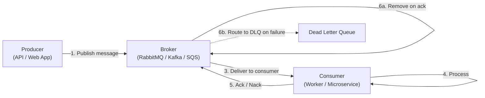

# Asynchronous Processing & Message Queues – A Beginner’s Guide

You've used this when you ordered something online and got an instant "We're processing your order" page instead of staring at a loading spinner. Behind that message is a message queue — your order was written down as a job and handed off to be processed later, so you could click "Continue Shopping" immediately.

You've also felt the pain when it breaks. Ever uploaded a photo that never appeared? Submitted a support ticket and never heard back? Those are signs of a lost async job — the message fell off the queue, a worker crashed mid-step, or nobody was watching the dead letter queue.

Message queues are the unsung heroes behind every smooth digital experience. They're why food delivery apps survive dinner rush, why YouTube processes your video while you keep browsing, and why e-commerce sites don't collapse on Black Friday. Let's see how they work.

> This guide explains why modern systems don't do everything at once, and how they use message queues to stay fast, reliable, and scalable.
> Every technical term is defined the first time it appears, and a full Glossary is at the end.
> Once you understand these concepts, the original advanced module will feel like a natural next step.

---

> **Before you start:** You should understand [Module 4: Distributed Communication Patterns](../Docs/04-distributed-comm.md). If you haven't read those yet, start there.

## Table of Contents

1. [Why Not Do Everything Right Now?](#1-why-not-do-everything-right-now)
2. [The Restaurant Kitchen Analogy](#2-the-restaurant-kitchen-analogy)
3. [How a Message Queue Works](#3-how-a-message-queue-works)
4. [Point‑to‑Point vs. Publish/Subscribe](#4-pointtopoint-vs-publishsubscribe)
5. [Delivery Guarantees and Idempotency](#5-delivery-guarantees-and-idempotency)
6. [Backpressure: Saying "Slow Down!"](#6-backpressure-saying-slow-down)
7. [Dead Letter Queues – The Problem Table](#7-dead-letter-queues--the-problem-table)
8. [Retries and Why Randomness Matters](#8-retries-and-why-randomness-matters)
9. [Partitions and Scaling Consumers](#9-partitions-and-scaling-consumers)
10. [Kafka Transactions (Exactly‑Once Explained)](#10-kafka-transactions-exactlyonce-explained)
11. [Real‑World Example: Black Friday Checkout](#11-realworld-example-black-friday-checkout)
12. [Monitoring – What to Watch](#12-monitoring--what-to-watch)
13. [Common Disasters and How to Avoid Them](#13-common-disasters-and-how-to-avoid-them)
14. [Glossary of Technical Terms](#14-glossary-of-technical-terms)
15. [Key Takeaways](#15-key-takeaways)

---

> **⏱ TL;DR — If you only learn 3 things from this module:**
> 1. **Use message queues to decouple work** — the producer sends a job and moves on; the consumer processes it when ready. The user never waits for slow background tasks.
> 2. **Expect duplicates and build idempotent workers** — at-least-once delivery means the same message can arrive twice. Your worker must handle that safely (e.g., with a processed-message table).
> 3. **Protect your system with backpressure and DLQs** — when the queue grows too deep, tell producers to slow down before everything crashes. Move broken messages to a dead letter queue for later inspection.

---

## 1. Why Not Do Everything Right Now?

When you click “Buy” on a website, you want the confirmation quickly. But behind the scenes, many things may need to happen:
- Charge your credit card (which can take seconds)
- Send an email confirmation
- Update inventory
- Generate a report or a PDF
- Notify the shipping department

If the website tried to do all of this **before** showing you the “Thank you” page, you’d be waiting for ages. Worse, if the email server is down, your whole order would fail.

**The solution:** instead of doing everything in the same request, the website writes down what needs to be done (a “job”) and sends it to a **message queue**. A separate **worker** picks it up and handles the slow work later, while you already have your confirmation.

This is called **asynchronous processing**. The user doesn’t wait for everything to finish. The system becomes faster and more resilient.

---

## 2. The Restaurant Kitchen Analogy

Think of a busy restaurant:

- **You (the customer)** place an order with the waiter.
- The waiter doesn’t go into the kitchen and cook the meal right there. Instead, they put the order ticket on a **queue** (the kitchen order rail).
- The kitchen staff (**workers**) take tickets one by one and cook the meals.
- You get a receipt and a number, so you can go back to your table. Later, your food is ready.

In a software system:

| Restaurant | Software |
|------------|----------|
| Customer | User or another service |
| Waiter | Web application / API |
| Order ticket | Message (a job description) |
| Order rail | Message queue (the broker) |
| Kitchen staff | Worker processes |
| Receipt number | Order ID or status URL |

This decoupling allows the kitchen to work at its own speed, and if the kitchen is busy, orders just pile up on the rail – the waiter doesn’t crash.

---

## 3. How a Message Queue Works

A **message queue** is a middleman that stores messages (jobs) until someone is ready to process them. The flow is:

1. **Producer** (the API) creates a message and sends it to the **broker**.
2. The broker stores the message durably (so it doesn't get lost).
3. A **consumer** (worker) pulls the message from the queue.
4. The worker does the work (e.g., charges the card).
5. Once done, the worker sends an **acknowledgment** (ack) to the broker.
6. The broker removes the message.

If the worker crashes before finishing, the broker notices (via a timeout) and gives the message to another worker. This ensures the job is not lost.

### Important: Ack only after the real work is done
The worker must never ack before completing the business operation. If it ack’s and then crashes, the job is lost forever.

---

## 4. Point‑to‑Point vs. Publish/Subscribe

There are two main patterns for messaging:

### Point‑to‑Point (Message Queue)
One message is consumed by **exactly one** worker. Perfect for tasks that should be done only once, like processing a payment or generating a report.

**Analogy:** The order ticket for table 5 goes to one chef. Two chefs shouldn’t cook the same dish twice.

### Publish/Subscribe (Pub/Sub)
One event is broadcast to **many** subscribers. Each subscriber gets a copy and can react independently. This is ideal when multiple systems need to know that something happened.

**Analogy:** A loudspeaker announces “Order #42 is ready!”. The cashier, the packaging station, and the delivery person all hear it and act accordingly.

| Approach | Use when… | Don't use when… |
|----------|-----------|-----------------|
| Point‑to‑Point | Exactly one worker must process each task; tasks are independent | Multiple systems need to react to the same event |
| Pub/Sub | Many independent subscribers need to react to the same event | You need exactly-once ordering across all consumers |

---

## 5. Delivery Guarantees and Idempotency

Most message brokers promise **at‑least‑once delivery** – they guarantee the message will be delivered, but it might be delivered more than once (e.g., if a worker crashes after finishing the job but before ack’ing).

If a message is processed twice, you don’t want to charge the customer’s card twice. Therefore, your workers must be **idempotent** – able to handle duplicate messages without causing double effects.

### How to make a worker idempotent

Store a record of the message ID in the same database transaction as the business update. If a duplicate arrives, the database will notice the ID already exists and skip the work.

**Simplified example:**
- Worker receives message with ID `msg‑123`.
- It starts a database transaction.
- It checks a `processed_messages` table: if `msg‑123` is already there, do nothing.
- Otherwise, process the payment and insert `msg‑123` into that table.
- Commit the transaction.

Now, no matter how many times `msg-123` arrives, the payment happens only once.

| Approach | Use when… | Don't use when… |
|----------|-----------|-----------------|
| At-least-once + idempotency | Most async scenarios; Kafka-to-database pipelines; general job processing | You need Kafka-to-Kafka atomic commits without external side effects |
| Exactly-once (Kafka transactions) | Stream processing where a single duplicate corrupts results (e.g., financial reconciliation) | External databases or APIs are involved (idempotency is still required) |

---

## 6. Backpressure: Saying "Slow Down!" `msg‑123` arrives, the payment happens only once.

---

## 6. Backpressure: Saying “Slow Down!”

If the kitchen gets too many tickets, the rail overflows, food takes longer, and eventually the kitchen catches fire. **Backpressure** is the mechanism that tells the waiters to stop sending new tickets until the backlog is under control.

In software:
- The broker queue depth (number of waiting messages) grows.
- If it passes a safe limit, the system starts refusing new requests at the front door (the API returns HTTP 429 “Too Many Requests”).
- Workers may also be scaled up, but only if the downstream systems (like the database) can handle it.

**Key rule:** Protecting the system is more important than accepting every request. It’s better to tell a few users “try again later” than to crash the whole site.

---

## 7. Dead Letter Queues – The Problem Table

Sometimes a message is bad: the customer ID is missing, the payment method is invalid, or the job fails repeatedly. These messages shouldn’t keep being retried forever, because they clog the queue.

A **Dead Letter Queue (DLQ)** is a separate queue where these “poison” messages are moved after several failed attempts.

**Analogy:** In the kitchen, if a ticket says “cook a grilled unicorn,” the chef won’t keep trying. They put it on a special “impossible orders” spike, and a manager later decides what to do.

From the DLQ, operators can:
- Inspect the failed message (with error details).
- Fix the bug or the data.
- Replay the corrected message back into the main queue.

A DLQ is a **safety net**, not a trash can. It must be monitored, and teams should be alerted when messages land there.

---

## 8. Retries and Why Randomness Matters

When a temporary failure occurs (like a network hiccup), workers should retry the job, but not instantly. If thousands of workers all retry at the same time, they create a **retry storm** that can knock the downstream service over again.

The recipe: **exponential backoff with jitter**.

- **Exponential backoff:** wait longer after each failure (e.g., 1s, 2s, 4s, 8s).
- **Jitter:** add a random amount to the wait time. This scatters the retry attempts so they don’t synchronize.

**Analogy:** If a store temporarily closes, 10,000 people standing outside don’t all knock on the door at the exact same second. They spread out.

---

## 9. Partitions and Scaling Consumers

To process millions of messages per second, you need many workers reading from the queue. Some brokers (like Kafka) use **partitions** – each message goes to a specific partition based on a key (like `order_id`).

Within a consumer group, each partition is assigned to exactly one worker. That means you can have many workers, each handling a subset of the messages, while still preserving the order of messages for the same key (e.g., all events for order #42 are processed in sequence).

**Analogy:** Instead of one long line at the post office, there are several counters, and each customer’s letters go to a specific counter based on their last name. That way, you can scale by adding more counters, and all letters for “Smith” are handled in order by the same clerk.

---

## 10. Kafka Transactions (Exactly‑Once Explained)

In some systems, you need **exactly‑once** processing – not just at least once. Kafka can provide this when the application reads from a topic, does some transformation, and writes the result back to another topic. The “trick” is that the input offsets and the output records are committed together in an **atomic transaction**.

If the worker crashes mid‑way, either everything is written (offsets + output) or nothing is, so there is no duplicate output.

However, this only covers Kafka‑to‑Kafka pipelines. If you also need to update a database or call an external API, you still need idempotency or the [Outbox pattern](https://microservices.io/patterns/data/transactional-outbox.html). So, in practice, **design for at‑least‑once + idempotent consumers** is the safest default.

---

## 11. Real‑World Example: Black Friday Checkout

Let’s see how a message queue saves an e‑commerce site during a massive sales event.

**Situation:** At midnight, the sale opens. 100,000 users try to check out within one minute. Normally, 10 payment workers handle 2,000 orders per minute.

**Without a queue:** The web server would directly call the payment provider for each request. The provider’s latency spikes from 250ms to 8 seconds. Web server threads get exhausted, the site becomes unresponsive, and orders are lost.

**With a queue:**
1. The checkout API quickly writes the order (status `pending`) and publishes an `OrderPlaced` message to the broker. Then it returns `202 Accepted` to the user – fast!
2. The broker stores millions of messages.
3. Payment workers consume messages at a controlled rate. The backlog grows, but the web layer remains responsive.
4. Monitoring shows queue depth climbing. Autoscaler adds more workers, but caps them to avoid overloading the database.
5. The payment provider recovers slowly. Backpressure kicks in: new checkouts from anonymous users get a `429 Too Many Requests` (with a “Retry‑After” time), while paying customers still proceed.
6. Some orders fail permanently (e.g., invalid credit cards). Those messages are routed to a DLQ for later inspection.
7. After the peak, the backlog drains, workers scale down, and the DLQ is processed.

**Outcome:** The site stayed up. Users saw a “your order is being processed” page instead of an error. The business retained orders even when downstream systems struggled.

---

## 12. Monitoring – What to Watch

A message queue is like a heartbeat for your async system. You must watch:

| Metric | What it tells you |
|--------|-------------------|
| **Queue depth** | Number of messages waiting. If it rises continuously, workers are too slow. |
| **Message age (p99)** | How long the oldest messages have been waiting. This directly affects user experience. |
| **Ack rate** | How many messages are successfully processed per second. A drop means workers are stuck. |
| **DLQ size** | Any message here is a business failure that needs human attention. |
| **Consumer lag** | For stream systems, how far behind the latest message the consumer is. |
| **Retry rate** | Spike may indicate downstream problems or configuration errors. |
| **Downstream latency** | If the database or API called by workers is slow, workers will be blocked. |

Set up alerts so that if, for example, the DLQ is not empty for more than 5 minutes, the on‑call team is paged.

---

> **✏️ Check Your Understanding**
> 1. You run an e-commerce site and notice that some orders are being processed twice, charging customers double. Your workers use at-least-once delivery. What pattern did you forget to implement?
> 2. During a flash sale, your payment workers are overwhelmed and the queue grows to 500,000 messages. Web servers start timing out and the site becomes unresponsive. What mechanisms should have been in place?
> 3. A bug in your order processing code causes every tenth message to fail. Workers keep retrying those messages until they hit the maximum retry count, then they are discarded. What is the problem with this approach?
> 

> 
Answers

> 1. **Idempotency.** Workers are processing duplicate messages without deduplication. Add a processed-message table (keyed by message ID) and check it before processing.
> 2. **Backpressure.** The system should have started refusing new requests (HTTP 429) well before the queue grew to 500K. Also consider autoscaling workers if the downstream can handle it.
> 3. **No DLQ.** Messages that fail permanently just disappear after max retries. A dead letter queue would capture them for inspection and replay after the bug is fixed.
> 

---

## 13. Common Disasters and How to Avoid Them

### Worker Acknowledges Before Work Is Complete

**Symptom:** Random data loss — orders are marked "paid" but the payment never went through, or emails are never sent.

**Root Cause:** The worker sends the ack to the broker immediately after receiving the message, then crashes during the actual work. The broker considers the message processed and deletes it. The work is lost forever.

**Real Incident:** In 2020, a major food delivery app experienced a partial outage where driver assignments were lost because the acknowledgment was sent before the assignment database write was confirmed. Drivers never received the order, and customers waited indefinitely.

**Fix:** Always ack **after** the business logic completes successfully. If your worker does: (1) receive, (2) ack, (3) process — swap steps 2 and 3.

**How to Detect Early:** Monitor the ratio of acks to successful business outcomes. If the ack rate is higher than the success rate, workers are acking too early. Track "orphaned" work items (e.g., orders stuck in "processing" state for too long).

### Retry Storm (Thundering Herd)

**Symptom:** A downstream service (database, payment API) becomes slow. Workers start failing. They all retry at the same time, creating a traffic spike that overwhelms the downstream completely.

**Root Cause:** Workers are configured with fixed retry intervals (e.g., retry every 5 seconds). When thousands of workers fail simultaneously, they all retry at 5 seconds, 10 seconds, 15 seconds — creating synchronized waves of traffic.

**Real Incident:** In 2012, a popular social news site experienced a cascading failure when a database replica lagged. Workers retried every 3 seconds, and each synchronized wave pushed the database further behind, extending the outage from minutes to hours.

**Fix:** Use exponential backoff with jitter. Start with a 1-second wait, then 2 seconds, 4 seconds, 8 seconds — each with a random offset added. This scatters retries across a wider window.

**How to Detect Early:** Monitor retry rate. A sudden spike (5x normal) indicates a potential retry storm. Also monitor downstream latency — if it rises, retries will follow.

### DLQ Not Monitored — Silent Failures

**Symptom:** Customers report missing orders or features that silently break. You discover weeks later that a bug has been causing failures, but nobody noticed.

**Root Cause:** Messages that fail repeatedly are routed to the DLQ, but the team has no alert on DLQ size. The DLQ fills up silently while the main queue keeps working, so no obvious alarm is triggered.

**Real Incident:** A large e-commerce platform discovered that 0.5% of their order confirmation emails had not been sent for three months. A minor change in the email template caused a parsing error. Failed messages went to a DLQ that nobody monitored. Customers never got receipts, and support tickets were dismissed as "must be in your spam folder."

**Fix:** Set up an alert on DLQ size. If the DLQ is non-empty for more than 5 minutes (adjust based on traffic), page the on-call team. Assign a regular "DLQ review" task in the team's rotation.

**How to Detect Early:** Alert on `dlq_depth > 0` for more than 5 minutes. Track DLQ ingress rate — if it goes from 0 to 10 messages/minute, something changed.

---

> **🧪 Conceptual Exercises**
> 1. Your team is designing a payment processing system that must handle 10x normal traffic on sale days. You need to ensure no orders are lost and the web tier stays responsive. What components would you put in place, and how would they interact?
> 2. A worker crashes halfway through processing a message. The broker redelivers the message to another worker. How do you ensure the order is not charged twice? What happens if the crash occurs after the ack is sent but before the work is fully committed?
> 

> 
Hints

> Think about the flow: producer → queue → consumer → ack. For question 1, consider where backpressure, DLQs, and autoscaling fit. For question 2, think about idempotency keys and the timing of acknowledgment.
> 

---

## 14. Glossary of Technical Terms

| Term | Definition | Section |
|------|------------|
| **Asynchronous** | Not happening at the same time. A request is accepted, but the work is completed later. | 1 |
| **Message Queue** | A durable buffer that holds messages until consumers are ready to process them. | 1 |
| **Broker** | The server or service that manages the queues (e.g., RabbitMQ, Kafka, Amazon SQS). | 2 |
| **Producer** | The application that creates and sends messages. | 3 |
| **Consumer / Worker** | The application that receives and processes messages. | 3 |
| **Acknowledgment (Ack)** | A signal from the consumer to the broker that a message has been successfully processed and can be removed. | 3 |
| **Pub/Sub (Publish/Subscribe)** | A messaging pattern where one message is sent to multiple interested consumers. | 4 |
| **At‑least‑once delivery** | A guarantee that a message will be delivered, but possibly more than once. Requires idempotent consumers. | 5 |
| **Idempotency** | The property that an operation can be repeated without changing the result. | 5 |
| **Idempotency Key** | A unique identifier that a consumer uses to detect duplicate messages. | 5 |
| **Backpressure** | The mechanism that slows down producers when the system cannot process work quickly enough. | 6 |
| **Dead Letter Queue (DLQ)** | A special queue where messages that cannot be processed are moved after repeated failures. | 7 |
| **Exponential Backoff** | A retry strategy where the wait time increases with each attempt. | 8 |
| **Jitter** | Adding randomness to retry delays to prevent synchronized retry storms. | 8 |
| **Partition** | A division of a topic (in Kafka) that allows parallel consumption while preserving order for a key. | 9 |
| **Consumer Group** | A set of workers that cooperate to consume a topic, each receiving a disjoint subset of partitions. | 9 |
| **Exactly‑once semantics** | The ideal that a message is processed exactly one time. Usually achieved through a combination of idempotency and transactional boundaries. | 10 |

---

## 15. Key Takeaways

1. **Don’t make the user wait for everything.** Use a message queue to offload slow or risky work.
2. **Message queues decouple** producers and consumers, so each can scale and fail independently.
3. **Always ack after the work is done**, never before. Otherwise you risk losing data.
4. **Expect duplicates.** Build your workers to be idempotent – use a processed‑message table or a unique ID.
5. **Protect your system with backpressure.** It’s better to reject a few requests early than to crash.
6. **Isolate poison messages in a DLQ.** Monitor it and have a plan for replay.
7. **Retry with exponential backoff + random jitter.** Avoid thundering herds of retries.
8. **Scale consumers with partitions.** For Kafka, choose a good partition key to balance load and preserve order where needed.
9. **Exactly‑once is hard.** In most cases, at‑least‑once + idempotent processing is the practical, safe choice.
10. **Monitor queue depth, message age, and DLQ size.** Async systems hide failures behind queues; you need visibility.

---

> This guide translates the complex **Module 5: Asynchronous Processing & Message Queues** into plain language.
> Once you're comfortable with these concepts, the original module (with its code templates and deep dives) will give you everything you need to design production-ready async architectures.
> For a deep-dive into back pressure mechanics, broker comparisons, service discovery, and a full Black Friday case study, read the [advanced companion file](05-async-messaging-advanced.md) - written from a Principal Cloud Systems Architect's perspective.
> Remember: a good message queue is like a good kitchen - it keeps working under pressure and doesn't lose orders.