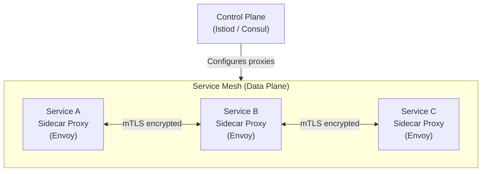

# Service Discovery & Service Mesh – A Beginner's Guide

You've used this when you opened a mobile app and it immediately showed your profile, orders, and recommendations — all fetched from different backend services. Behind the scenes, those services had to discover each other, establish secure connections, and share data, all without dropping your request.

You've also felt the pain when it breaks. When a site shows "Something went wrong" after you log in, it might be because the auth service couldn't find the user profile service — they lost track of each other in the cloud. Service meshes solve exactly this kind of problem.

Service discovery and service mesh are the invisible plumbing that makes microservices work. They handle finding the right service instance, encrypting communication, retrying failures, and even shifting traffic between versions — all without touching a single line of application code. Let's see how.

> This guide explains how services find each other in a dynamic cloud environment and how a service mesh secures and manages their communication without changing application code.
> Every technical term is defined the first time it appears, and a full Glossary is at the end.
> Once you understand these foundations, the original advanced module will feel like a natural next step.

---

> **Before you start:** You should understand [Module 1: Traffic Routing](../Docs/01-traffic-routing.md) and [Module 4: Distributed Communication Patterns](../Docs/04-distributed-comm.md). If you haven't read those yet, start there.

## Table of Contents

1. [The Problem: Services Move Around](#1-the-problem-services-move-around)
2. [Finding a Service: Client-Side vs Server-Side Discovery](#2-finding-a-service-client-side-vs-server-side-discovery)
3. [Health Checks: Making Sure the Service Is Actually Alive](#3-health-checks-making-sure-the-service-is-actually-alive)
4. [What Is a Service Mesh?](#4-what-is-a-service-mesh)
5. [The Two Layers: Control Plane vs Data Plane](#5-the-two-layers-control-plane-vs-data-plane)
6. [How the Sidecar Works (Transparent Interception)](#6-how-the-sidecar-works-transparent-interception)
7. [Secure Communication with mTLS](#7-secure-communication-with-mtls)
8. [Traffic Splitting: Canary Deployments and Blue-Green](#8-traffic-splitting-canary-deployments-and-blue-green)
9. [Circuit Breaking: Protecting Yourself from Slow Dependencies](#9-circuit-breaking-protecting-yourself-from-slow-dependencies)
10. [Common Disasters and How to Avoid Them](#10-common-disasters-and-how-to-avoid-them)
11. [Putting It All Together — A Request Through a Mesh](#11-putting-it-all-together--a-request-through-a-mesh)
12. [Glossary of Technical Terms](#12-glossary-of-technical-terms)
13. [Key Takeaways](#13-key-takeaways)

---

> **⏱ TL;DR — If you only learn 3 things from this module:**
> 1. **Services change addresses constantly** — hardcoded IPs break when instances restart or scale. A service registry keeps a live directory of where every service is.
> 2. **A service mesh moves network logic into infrastructure** — sidecar proxies handle discovery, encryption, routing, and retries so application code stays simple.
> 3. **mTLS and circuit breakers are built-in safety nets** — every service-to-service call is authenticated and encrypted by default, and failing dependencies are isolated before they cause cascading failures.

---

## 1. The Problem: Services Move Around

Imagine you run a large hotel. Guests (services) check in and out constantly. Each guest gets a different room number (IP address). If you print a directory of room numbers every morning, it will be wrong by noon. Guests who checked out still have their old rooms listed, and new guests are not listed at all.

That's the problem with hardcoded IP addresses in a cloud environment. Services are constantly restarting, scaling up and down, and moving to different machines. If Service A has Service B's IP address hardcoded, Service B will disappear when it restarts, and Service A will send requests into a black hole.

The solution is a **service registry** — a live directory that every service updates when it starts or stops, and that every other service queries to find the current location of its dependencies.

---

## 2. Finding a Service: Client-Side vs Server-Side Discovery

There are two main ways to use a service registry.

### Client-Side Discovery

**Analogy:** You are in a hotel and want to find Guest B. You walk to the digital directory in the lobby (the registry), look up Guest B's current room number, and walk directly there.

- The **client** (Service A) talks directly to the registry to find Service B.
- The client picks one instance from the list of healthy servers (round-robin, least connections, etc.).
- The client makes the call directly — one hop.

**Examples:** Netflix Eureka, Consul, ZooKeeper.

**Pros:** Fast (no middleman), direct client-to-server connection.
**Cons:** Every service must include a library that knows how to talk to the registry. If you change the registry, you must update every service.

### Server-Side Discovery

**Analogy:** You are in a hotel and want to find Guest B. You go to the front desk (a central load balancer) and tell them the name. The front desk finds the room and either gives you directions or escorts you there.

- The **client** sends the request to a fixed address (a load balancer or DNS name).
- The load balancer checks the registry internally and forwards the request to a healthy instance.
- Two hops: client → load balancer → server.

**Examples:** AWS ALB, Kubernetes kube-proxy, Nginx.

**Pros:** The client does not need to know anything — it just sends requests to a fixed address. Much simpler client code.
**Cons:** The load balancer becomes a single point of failure (unless replicated) and adds latency.

| Approach | Use when… | Don't use when… |
|----------|-----------|-----------------|
| Client-Side Discovery | You need lowest latency (1 hop); you control all service code and can embed registry libraries | You cannot modify client code; you want to keep clients simple; your services are written in many languages |
| Server-Side Discovery | You want simple clients (just call a fixed address); your environment already has a load balancer (Kubernetes, AWS ALB) | You need direct client-to-server connections; the load balancer is a single point of failure without replication |

---

## 3. Health Checks: Making Sure the Service Is Actually Alive

A registry is only useful if it knows which services are actually healthy. The registry **probes** each service regularly by calling a health endpoint (like `/health`). If the service fails to respond or returns an error several times in a row, the registry marks it as unhealthy and stops sending traffic to it.

**Critical detail:** The probe must be **external** — the registry checks the service from the outside. A service might be running but unable to serve traffic (stuck, out of database connections, corrupted state). If the service only reports its own health, it might say "I'm fine!" while it's actually broken.

---

## 4. What Is a Service Mesh?

A **service mesh** is a dedicated infrastructure layer that handles all service-to-service communication. Instead of each service implementing retries, timeouts, load balancing, encryption, and monitoring in its own code, the mesh provides all of these as a **transparent sidecar proxy** that sits next to each service and intercepts all network traffic.

**Analogy:** Think of each service as a guest in the hotel who has a personal assistant (the sidecar proxy). Whenever the guest needs to talk to another guest, they tell their assistant, "I need to talk to Guest B." The assistant finds Guest B (service discovery), opens the door (establishes the connection), checks that Guest B is who they claim to be (mTLS), and reports back. The guest never leaves their room or deals with any of this complexity.

---

## 5. The Two Layers: Control Plane vs Data Plane

A service mesh has two distinct parts:

| Layer | Role | Analogy | Example |
|-------|------|---------|---------|
| **Data Plane** | Fast, distributed proxies that handle every packet | The muscles that do the actual work | Envoy, Linkerd-proxy |
| **Control Plane** | Central brain that configures the proxies | The brain that tells the muscles what to do | Istiod, Consul Connect |

- The **data plane** is everywhere — a sidecar proxy runs next to every single service instance. It intercepts all inbound and outbound traffic and applies rules: route to this version, require a certificate, break the circuit after 5 failures.
- The **control plane** is the source of truth. It manages certificates, pushes routing rules to all sidecars, and monitors the health of the mesh. It does **not** touch data packets — it only configures the proxies.

This separation is powerful because the data plane is fast (it handles every packet) and the control plane can be slower (it only pushes configuration changes, which happen infrequently).

---

## 6. How the Sidecar Works (Transparent Interception)

The mesh installs a **sidecar proxy** (like Envoy) in the same machine or pod as each service. It then uses low-level firewall rules (iptables) to redirect all network traffic through the proxy.

**The magic:** The service does not know the proxy exists. The service opens a connection to what it thinks is another service, but the firewall silently redirects the traffic through the sidecar. The sidecar performs discovery, load balancing, encryption, and observability — all without a single line of application code.

**Analogy:** The hotel guest (service) writes a letter and puts it in the hotel mail chute, believing it will be delivered directly. But the hotel's internal mail system actually intercepts every letter, checks the recipient, redirects it correctly, makes a copy for security, and logs the delivery time. The guest never knows.

---

## 7. Secure Communication with mTLS

**mTLS (mutual TLS)** is like a two-way ID check. In normal HTTPS, only the client verifies the server's identity. In mTLS, both sides verify each other.

**How it works in a mesh:**

1. When Service A starts, the control plane issues it a cryptographic certificate (like a passport).
2. When Service A calls Service B, Service A presents its certificate to prove it is really Service A.
3. Service B also presents its certificate to prove it is really Service B.
4. Both sides verify each other's certificates using the mesh's Certificate Authority (the control plane).
5. The communication is encrypted.

This means **only authorized services can communicate**. If an attacker deploys a malicious service, it cannot connect to any other service because it does not have a valid certificate signed by the mesh.

---

## 8. Traffic Splitting: Canary Deployments and Blue-Green

Once all traffic goes through the mesh, the mesh can make routing decisions based on rules. For example:

**Canary deployment:** You deploy version 2.0 of a service alongside version 1.0. You tell the mesh: "Send 90% of traffic to v1, 10% to v2." If v2 has no errors after 10 minutes, increase to 50%, then 100%. If v2 fails, the mesh automatically stops sending traffic to it.

**Analogy:** A restaurant testing a new menu. The chef prepares 10 dishes: 9 from the classic menu and 1 new dish. If customers complain about the new dish, only 1 in 10 had a bad experience — the damage is limited.

This is done entirely in the mesh configuration — **zero code changes** to the services themselves.

| Approach | Use when… | Don't use when… |
|----------|-----------|-----------------|
| **Canary** (gradual % shift) | You want to test a new version on real traffic; you need fine-grained rollout control (1%, 10%, 50%, 100%) | You need instant rollback to a known-good state; the old and new versions are incompatible (e.g., schema changes) |
| **Blue-Green** (full swap) | You need instant switch-over between two complete environments; old and new versions are fully deployed side-by-side | You want gradual traffic testing; the full environment is too expensive to duplicate |

---

## 9. Circuit Breaking: Protecting Yourself from Slow Dependencies

If Service B becomes slow or starts failing, Service A should not keep calling it forever. A **circuit breaker** monitors the failure rate. After a threshold (e.g., 5 consecutive failures), the circuit breaker "opens" — all calls to Service B fail immediately without attempting a real connection.

**Analogy:** If you call a friend who is always busy, you might decide: "If they don't answer after 3 tries, I'll stop calling for 5 minutes." After 5 minutes, you try once. If they answer, you resume normal calling. If not, you wait again.

This protects:
- **Service A** (it doesn't waste threads waiting for timeouts)
- **Service B** (it doesn't get flooded with requests while struggling to recover)

---

> **✏️ Check Your Understanding**
> 1. You deploy a new microservice but it cannot reach the database service. Both services are running. What component is most likely misconfigured or unavailable?
> 2. Your service mesh is running, but you notice that two unauthorized services can still communicate directly. What security feature is likely not enabled?
> 3. During a traffic spike, Service B becomes slow and Service A starts timing out. Service A keeps retrying, making Service B even slower. What pattern should be in place between them?
> 

> 
Answers

> 1. **Service registry or DNS.** The new service cannot find the database service's address. Check whether the registry (e.g., Consul, Kubernetes DNS) has the database service registered and whether the new service is querying the right endpoint.
> 2. **mTLS.** Without mutual TLS, any service can impersonate another. In a mesh, mTLS should be enforced to require valid certificates from every caller.
> 3. **Circuit breaker.** A circuit breaker would detect the failures and stop sending traffic to Service B after a threshold, giving it time to recover and preventing cascading failures.
> 

---

## 10. Common Disasters and How to Avoid Them

### Control Plane Goes Down

**Symptom:** You cannot update routing rules, deploy new services, or rotate certificates. Existing traffic continues flowing but changes are blocked.

**Root Cause:** The control plane is a single point of failure for configuration. If it crashes or becomes unreachable, the data plane proxies operate on cached rules and cannot accept updates.

**Real Incident:** In 2020, a major US bank experienced a multi-hour outage during a service mesh migration. A misconfigured control plane certificate expired, preventing any new services from joining the mesh. Existing services continued working, but the deployment pipeline was frozen.

**Fix:** Run the control plane as a highly available replicated set with at least three replicas across availability zones. Use PodDisruptionBudgets to prevent all replicas from going down during updates.

**How to Detect Early:** Monitor control plane leader election and API server response times. Alert if the control plane is unreachable for more than 30 seconds.

### The Performance "Hop Tax"

**Symptom:** End-to-end latency increases noticeably after adding a service mesh. Deep call chains (Service A → B → C → D) show the most degradation.

**Root Cause:** Every request in a mesh goes through two sidecar proxies (the caller's and the receiver's). Each proxy adds microseconds of processing for routing, encryption, and metrics. In a deep chain with 5 services, this means 10 proxy hops.

**Real Incident:** A large e-commerce company measured 15ms added latency per proxy hop in their mesh. For a checkout flow touching 8 services, this added 120ms — enough to trigger their p99 alert. They optimized by moving latency-critical paths to direct connections.

**Fix:** Measure the overhead. For most systems, the added latency (microseconds to low milliseconds) is worth the security and observability benefits. For ultra-low-latency paths, allow direct connections that bypass the mesh sidecars.

**How to Detect Early:** Compare p99 latency before and after mesh adoption for the same traffic patterns. Monitor sidecar proxy CPU — high utilization correlates with added latency.

### Graceful Draining

**Symptom:** During rolling deployments or scale-down events, a small percentage of requests fail with "connection refused" or time out.

**Root Cause:** When a service is shut down, it must stop accepting new requests before closing connections. If the shutdown signal arrives and the process exits immediately, in-flight requests are dropped. The proxy deregisters the instance, but existing connections are abruptly terminated.

**Real Incident:** A streaming service's rolling update caused 0.1% of video playback failures because the old pods were terminated while still serving active streams. Each terminated stream caused a buffering spike for the viewer.

**Fix:** Configure the drain timeout properly. The proxy deregisters the instance from the registry, waits for in-flight requests to complete (with a configurable timeout), then shuts down. Set the termination grace period longer than the maximum expected request duration.

**How to Detect Early:** Monitor connection-dropped metrics on the sidecar proxy. Alert if any connections are terminated during shutdown (non-zero pre-stop hook failures).

---

## 11. Putting It All Together — A Request Through a Mesh

Let's trace a request from Service A (Order API) to Service B (Payment Service) in a service mesh:

1. **Service A starts a call.** It opens a TCP connection to what it believes is the Payment Service's address.
2. **Sidecar intercepts.** The local Envoy proxy intercepts the connection via iptables.
3. **Service discovery.** The sidecar asks the control plane or its cached registry for healthy Payment Service instances.
4. **Load balancing.** The sidecar picks one instance using least-connections or round-robin, preferring the local data center.
5. **mTLS handshake.** The sidecar establishes a mutual TLS connection to the target Payment Service's sidecar. Both present certificates signed by the mesh CA.
6. **Routing rules.** If a canary deployment is active, the sidecar routes based on the configured traffic split.
7. **Circuit breaker check.** If the Payment Service has been failing, the circuit breaker opens and the call fails fast with a clear error.
8. **Observability.** Both sidecars emit metrics (request count, latency, status), logs, and trace headers (propagating the trace ID).
9. **Response.** The response flows back through the same path.
10. **Service A gets the result.** It never knew the mesh existed.

All of this happens without changing a single line of application code. The mesh provides discovery, security, load balancing, circuit breaking, and observability as infrastructure.

---

> **🧪 Conceptual Exercises**
> 1. Your team deploys a new version of the payment service alongside the old one. You want to send 5% of traffic to the new version and monitor for errors before rolling out fully. Your application code cannot be changed. How would you achieve this using a service mesh?
> 2. Service A calls Service B, which calls Service C. Service C becomes slow and starts timing out. Without a circuit breaker, what happens to Service A? How would a circuit breaker change the outcome? What about Service B's threads?
> 

> 
Hints

> For question 1, think about traffic splitting rules in the mesh control plane — no code changes needed. For question 2, trace the failure propagation: slow C → queued B threads → queued A threads → cascading timeout. The circuit breaker sits between A and B (or B and C) and fails fast before queues build up.
> 

---

## 12. Glossary of Technical Terms

| Term | Definition | Section |
|------|------------|---------|
| **Service Registry** | A live directory of all running service instances and their addresses. | 1 |
| **Client-Side Discovery** | The client queries a service registry directly to find the address of a dependency. | 2 |
| **Server-Side Discovery** | The client sends requests to a fixed load balancer, which resolves the target internally. | 2 |
| **DNS (Domain Name System)** | The phonebook of the internet — translates names to IP addresses. | 2 |
| **Load Balancer** | A device or software that distributes incoming traffic across multiple servers. | 2 |
| **Health Check** | An external probe that verifies a service is actually capable of serving traffic. | 3 |
| **Service Mesh** | An infrastructure layer for managing service-to-service communication via sidecar proxies. | 4 |
| **Sidecar Proxy** | A helper process that runs alongside a service and handles its network communication. | 4 |
| **Proxy** | An intermediary that forwards requests on behalf of a client. | 4 |
| **Control Plane** | The central brain of a service mesh that manages certificates, routing rules, and configuration. | 5 |
| **Data Plane** | The distributed proxies that handle every network packet between services. | 5 |
| **Envoy** | A high-performance proxy commonly used as a sidecar in service meshes. | 6 |
| **iptables** | A Linux firewall tool used by meshes to transparently redirect traffic through the sidecar. | 6 |
| **Istio** | A popular open-source service mesh platform. | 6 |
| **mTLS (Mutual TLS)** | A security protocol where both client and server verify each other's identity. | 7 |
| **Certificate Authority (CA)** | A trusted entity that issues digital certificates, verifying the identity of services in the mesh. | 7 |
| **SPIFFE** | A standard for service identity in dynamic environments (used by many meshes). | 7 |
| **Canary Deployment** | Rolling out a new version to a small percentage of traffic first to test before full release. | 8 |
| **Traffic Splitting** | Distributing traffic across multiple versions of a service for canary or blue-green deployments. | 8 |
| **Circuit Breaker** | A pattern that stops requests to a failing service after a threshold, giving it time to recover. | 9 |
| **Graceful Drain** | The process of letting in-flight requests complete before shutting down a service. | 10 |
| **Hop Tax** | The added latency from traffic going through extra network hops (sidecar proxies). | 10 |

---

## 13. Key Takeaways

1. **Services are ephemeral** — they move, restart, and scale constantly. Hardcoded IPs do not work.
2. **Client-side discovery** gives low latency but requires every service to embed a registry library.
3. **Server-side discovery** simplifies clients but adds a central load balancer hop.
4. **External health checks** catch zombie instances that are alive but broken.
5. **A service mesh** moves network intelligence (discovery, security, routing) from application code into infrastructure sidecars.
6. **Data plane = muscles, control plane = brain.** The two-layer architecture keeps data fast and configuration centralized.
7. **Transparent interception** via iptables means the application never knows the mesh exists.
8. **mTLS** ensures every service-to-service call is authenticated and encrypted by default.
9. **Traffic splitting** enables canary deployments without code changes.
10. **Circuit breakers** protect both the caller (no wasted time) and the callee (no flood of requests).
11. **The hop tax is real** but usually worth it for the security and observability benefits.
12. **Plan for graceful draining** — a service that disappears mid-request can cause data loss.

---

> This guide explains the "why" behind service discovery and service mesh patterns.
> Once you're comfortable with these concepts, the original module (with its code templates, mTLS handshake deep dive, and Netflix migration case study) will serve as your in-depth reference.
> For a deep-dive into xDS protocol, iptables interception mechanics, canary routing configuration, and control plane partition failure modes, read the [advanced companion file](06-service-mesh-advanced.md) — written from a Principal Infrastructure Engineer's perspective.
> Remember: a good mesh makes your infrastructure smarter so your application code can stay simple.
