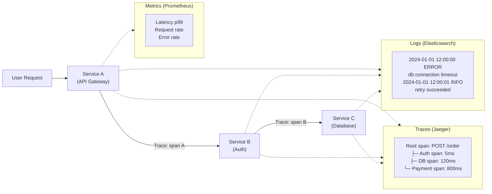

# Observability: Monitoring, Logging & Tracing – A Beginner's Guide

You've used this when a website told you "Something went wrong" and you had no idea what. Was it your internet? The server? A database? Without observability, debugging a distributed system is like finding a leak in a house with the lights off.

You've also experienced observability working well: when a mobile app shows you "We're investigating the slow loading times" and 10 minutes later posts "Found it — fixed a slow database query." That rapid diagnosis doesn't happen by luck. It happens because the team can see metrics (response times spiked), traces (the database call was the slowest step), and logs (the query was missing an index).

Observability is the difference between guessing and knowing. It turns a black box into a glass box — and it's the single most important investment you can make before your system goes to production.

> This guide explains the three pillars of observability — Metrics, Logs, and Traces — and how they work together to help you understand what your system is doing, why it is failing, and where to look.
> Every technical term is defined the first time it appears, and a full Glossary is at the end.
> Once you understand these foundations, the original advanced module will feel like a natural next step.

---

> **Before you start:** This module is foundational with no prerequisites — you can jump right in.

## Table of Contents

1. [Why Observability Matters](#1-why-observability-matters)
2. [The Three Pillars: Metrics, Logs, Traces](#2-the-three-pillars-metrics-logs-traces)
3. [Metrics – The What](#3-metrics--the-what)
4. [Logs – The Why](#4-logs--the-why)
5. [Traces – The Where](#5-traces--the-where)
6. [SLI, SLO, and Error Budgets](#6-sli-slo-and-error-budgets)
7. [Alerts: Push vs Pull](#7-alerts-push-vs-pull)
8. [Common Disasters and How to Avoid Them](#8-common-disasters-and-how-to-avoid-them)
9. [Putting It All Together — Debugging a Slow Request](#9-putting-it-all-together--debugging-a-slow-request)
10. [Glossary of Technical Terms](#10-glossary-of-technical-terms)
11. [Key Takeaways](#11-key-takeaways)

---

> **⏱ TL;DR — If you only learn 3 things from this module:**
> 1. **Metrics tell you what, logs tell you why, traces tell you where** — you need all three pillars to debug effectively. Any one alone is incomplete.
> 2. **SLIs → SLOs → Error Budgets** form a data-driven reliability framework that tells you when to ship features and when to stop and fix things.
> 3. **High cardinality kills time-series databases** — never use user IDs or session IDs as metric labels. Use traces for high-cardinality data.

---

## 1. Why Observability Matters

When your application is a single process running on one machine, you can debug it by looking at the console, attaching a debugger, or checking a single log file. But in a distributed system with hundreds of microservices, a request may pass through 10 different services, each running on a different machine in a different data center. You cannot attach a debugger to all of them at once.

**Observability** is the practice of designing your system to answer questions about its internal state *from the outside*, without deploying new code. If your system is observable, you can ask "what happened?" after a failure without ever connecting to a running server.

---

## 2. The Three Pillars: Metrics, Logs, Traces



Relying on only one type of telemetry is like diagnosing a car with only a speedometer:

- The **speedometer** tells you the car is moving (Metrics), but not why the engine is sputtering.
- The **check-engine light** tells you something is wrong (Logs), but not which cylinder misfired first.
- The **timing of the misfire** pinpoints the exact problem (Traces).

You need all three to form a complete picture.

| Pillar | Answers | Analogy |
|--------|---------|---------|
| **Metrics** | What is happening? | Speedometer, fuel gauge, odometer |
| **Logs** | Why is it happening? | Check-engine light, mechanic's notes |
| **Traces** | Where is it happening? | Which cylinder misfired, in what order |

---

## 3. Metrics – The What

**Metrics** are numbers measured over time. They are cheap to store and fast to query. There are three basic types:

| Type | Behavior | Example | Analogy |
|------|----------|---------|---------|
| **Counter** | Only goes up (monotonic) | Total HTTP requests | An odometer — you read the difference between now and 5 minutes ago |
| **Gauge** | Goes up and down | Current memory usage | A fuel gauge — you care about the value right now |
| **Histogram** | Statistical distribution | Request latency (p50, p99) | A speed camera that records every car's speed — you ask "what speed did 99% of cars stay under?" |

**Why metrics are valuable:** They are extremely efficient. A single metric with a few labels takes a few bytes. You can store millions of data points across thousands of machines in a dedicated **Time-Series Database (TSDB)** like Prometheus.

**Why metrics are insufficient:** They tell you something is wrong (e.g., error rate spiked) but not *why*. For that, you need logs and traces.

---

## 4. Logs – The Why

**Logs** are records of discrete events. A good log entry is **structured** (machine-readable) — it is a JSON object with key-value pairs, not a sentence:

```json
{"timestamp": "2026-05-21T14:30:00Z", "level": "ERROR", "service": "payments", "message": "payment declined", "error_code": "insufficient_funds", "amount": 49.99}
```

Structured logs can be indexed and queried: "How many `insufficient_funds` errors happened in the last hour?" — a question that is slow and expensive with unstructured text.

**The cost of logs:** Logs are **10-100x more expensive** to store than metrics. Every string takes disk space and CPU to index. In production, teams aggressively reduce log volume by:
- Sampling debug logs (store 1 in 100 debug messages)
- Using higher log levels in production (WARN and above only)
- Expiring low-value logs after days, not years

**Best practice:** Always include a **correlation ID** (like a `trace_id`) in every log entry. This lets you connect a log to a specific request's trace.

---

## 5. Traces – The Where

**Traces** track a single request as it moves through multiple services. A trace is a tree of **spans**, where each span represents one unit of work (e.g., "validate token" in the auth service, "query database" in the order service).

**How tracing works:**

1. The first service (e.g., API gateway) generates a unique **Trace ID** and creates a **Span** for the incoming request.
2. When the gateway calls the next service, it passes the Trace ID in an HTTP header (`traceparent`).
3. The next service creates a child span, records its work, and passes the Trace ID further downstream.
4. A collector gathers all spans from all services and assembles them into a single trace.

**Why traces are critical:** In a distributed system, a single user request might touch 10-15 services. Without traces, you have 15 sets of metrics and 15 log files. With traces, you can see exactly which service caused the slowdown.

**The cost of traces:** Storing every span for every request is expensive. Most systems use **sampling**:

| Approach | Use when… | Don't use when… |
|----------|-----------|-----------------|
| **Head-based sampling** | Budget is tight; you need a simple, predictable trace volume; most errors are frequent enough to be captured at 1% | Rare errors account for significant user impact — head-based will almost always miss them |
| **Tail-based sampling** | Error rates are low but critical; you need every error trace preserved for debugging | Your trace volume is extremely high (tail-based requires buffering all traces temporarily, which is memory-intensive) |

---

## 6. SLI, SLO, and Error Budgets

These three concepts form the contract between your team and your users about reliability.

| Term | Meaning | Example |
|------|---------|---------|
| **SLI (Service Level Indicator)** | A metric that measures a specific aspect of reliability | "The percentage of requests that complete in under 200ms" |
| **SLO (Service Level Objective)** | The target value for the SLI | "99.9% of requests complete in under 200ms, measured over 30 days" |
| **Error Budget** | The allowed amount of unreliability | "100% - 99.9% = 0.1% of requests can be slow or fail. If we have 10M requests per month, that is 10,000 allowed errors." |

**How error budgets drive decisions:** If your error budget is not exhausted, you can deploy new features. If the budget is running low, you must stop deploying and focus on reliability. This turns reliability into a data-driven decision, not an emotional argument between "ship fast" and "don't break things."

**Burn rate alerting:** Instead of alerting when you have exceeded your SLO (too late!), you alert when you are **burning through your error budget too fast**. For example, if your error budget for a month is 10,000 errors and you have 5,000 errors in 1 hour, something is very wrong — alert immediately.

---

## 7. Alerts: Push vs Pull

There are two main ways to collect telemetry:

| Approach | Use when… | Don't use when… |
|----------|-----------|-----------------|
| **Pull (Prometheus)** | Services run persistently on known servers; you want centralized scrape control | Services are ephemeral (Lambda, batch jobs) and may disappear before the next poll; the `/metrics` endpoint might overload a struggling service |
| **Push (StatsD, OpenTelemetry Collector)** | Workloads are short-lived or serverless; you need the service to control when data is sent | The collector could become a bottleneck or crash, losing metrics; you lose visibility if the network between service and collector is congested |

**The danger of push:** If the collector crashes or the network is congested, metrics can be lost. The service thinks it sent data, but nobody received it.

**The danger of pull:** If a service is overloaded, serving the `/metrics` page might make it more overloaded. Also, short-lived jobs may finish before the next poll.

---

> **✏️ Check Your Understanding**
> 1. Your dashboard shows that the error rate for the payment service suddenly dropped to zero. Is that good news? What could it actually mean?
> 2. You add a `customer_tier` label (gold, silver, bronze) to your request latency metric. Is this safe? What about adding `customer_id`?
> 3. A user reports a bug you have never seen before. Your traces sample 1% of requests. The bug affects 0.1% of users. What is the probability that you captured it in a trace? How would you improve the odds?
> <details>
> <summary>Answers</summary>
> 1. **Not necessarily.** An error rate drop to zero could mean nobody is hitting the service (the metrics pipeline is broken, the service is down, or requests are being rejected before they reach the service). Always investigate sudden drops, not just spikes.
> 2. **`customer_tier` is safe** (low cardinality — only 3 values). **`customer_id` is dangerous** (high cardinality — millions of values). High-cardinality labels blow up TSDB memory and should be avoided in metrics.
> 3. **Very low.** With 1% sampling and 0.1% error rate, you have roughly a 0.001% chance of capturing that error. Use tail-based sampling to keep all error traces, or increase the sampling rate for the specific endpoint.
> </details>

---

## 8. Common Disasters and How to Avoid Them

### Cardinality Explosion

**Symptom:** Prometheus or your TSDB runs out of memory and crashes. Dashboards stop loading. Queries time out.

**Root Cause:** A metric with a high-cardinality label (like `user_id`, `session_id`, or `email`) was added. With 1 million users, the TSDB must track 1 million unique time series — each consuming memory and disk.

**Real Incident:** In 2016, a major observability vendor experienced a multi-hour outage when a single customer added a `user_id` label to a metric, causing the TSDB's memory to spike from 4GB to 100GB in minutes. The shared infrastructure affected all customers.

**Fix:** Never use unbounded values (user IDs, session IDs, email addresses, IP addresses) as metric labels. Use high-cardinality data in traces or logs, not metrics. Enforce label limits in your metrics pipeline (e.g., Prometheus `label_limit` configuration).

**How to Detect Early:** Monitor TSDB memory usage and unique series count. Alert if the number of series grows by more than 20% in an hour. Set up a pre-commit hook that rejects metrics with potentially unbounded labels.

### Head-Based Sampling Misses Rare Errors

**Symptom:** A rare bug is causing errors, but your trace dashboard shows zero error traces. Customer support is flooded with reports you cannot reproduce.

**Root Cause:** Head-based sampling decides whether to trace a request at the start, before knowing the outcome. If you sample 1% of requests and the error rate is 0.01%, only 1 in 10,000 error requests will be traced. You are effectively blind to rare errors.

**Real Incident:** A large streaming service discovered that 0.05% of video playback failures were caused by a codec negotiation bug that only occurred with specific device/browser combinations. Their 1% head-based sampling caught exactly zero instances in three months.

**Fix:** Use tail-based sampling (keep all traces with errors) or increase the sampling rate for error spans. If tail-based is too expensive, use adaptive sampling that boosts the sampling rate for services or endpoints with higher error rates.

**How to Detect Early:** Compare your sampled error rate (from traces) with your actual error rate (from metrics). If the trace error rate is consistently lower, sampling is missing errors.

### The 15-Minute Blind Spot

**Symptom:** Your dashboard shows normal metrics, but users are reporting outages. By the time the metrics update, 15 minutes have passed.

**Root Cause:** Push-based metrics collectors (StatsD) send data in infrequent batches (e.g., every 15 minutes) to reduce cost. A failure that starts between batches is invisible until the next batch arrives.

**Real Incident:** During a Black Friday sale, a major retailer's payment gateway went down for 22 minutes before the ops team noticed. Their monitoring pipeline had a 15-minute batch interval, and the failure started 7 minutes after the last successful batch. The team lost 22 minutes of revenue before reacting.

**Fix:** Use real-time streaming (sub-minute granularity) for critical metrics (error rates, latency, throughput). Reserve batching for non-critical, high-volume, or aggregate metrics where delayed insight is acceptable.

**How to Detect Early:** For critical services, set up a synthetic heartbeat check that runs every 30 seconds. If the heartbeat fails, page immediately — don't wait for the next metrics batch. Monitor the age of the most recent data point and alert if it exceeds the expected interval.

---

## 9. Putting It All Together — Debugging a Slow Request

A user reports that the "Place Order" button takes 10 seconds. Here is how observability helps:

1. **Metrics (p99 latency)** — You open your dashboard and see that the order service p99 latency jumped from 200ms to 8 seconds. Something is clearly wrong.

2. **Traces** — You search for recent traces with high latency. You see one trace showing:
   - API Gateway → 50ms (normal)
   - Order Service → 200ms (normal)
   - Payment Service → 7.5 seconds (problem found!)

3. **Logs** — You open the payment service logs for that trace ID. You see: `"level": "WARN", "message": "connection timeout on attempt 3/3"`. The payment service is timing out trying to reach the external payment provider.

4. **Action:** The payment provider's API is down. You activate the fallback (queue payments for later) and page the provider's support team.

Without all three pillars, you would have known *something* was slow (metrics), but not *where* (traces) or *why* (logs).

---

> **🧪 Conceptual Exercises**
> 1. A user reports that checkout is slow. Your dashboard shows p99 latency is normal. Traces show one particular database query timing out 0.5% of the time. Logs show "connection pool exhausted." Walk through how you would use all three pillars to diagnose and fix this.
> 2. Your team adopts tail-based sampling for traces. Your infrastructure budget is fixed, and trace storage costs triple. How would you decide which traces to keep and which to discard? What metrics would you track to ensure you are not losing signal?
> <details>
> <summary>Hints</summary>
> For question 1, think about what each pillar reveals: metrics show the aggregate (p99 is fine, but p999 might be bad), traces pinpoint the exact slow step, logs reveal the root cause (pool exhaustion). For question 2, consider that tail-based keeps traces with errors by default — but you may also want to keep slow traces, traces from high-value users, or a representative sample of healthy traces for baseline comparison.
> </details>

---

## 10. Glossary of Technical Terms

| Term | Definition | Section |
|------|------------|---------|
| **Observability** | The ability to understand a system's internal state from its external outputs. | 1 |
| **Three Pillars** | Metrics, Logs, and Traces — the three types of telemetry data. | 2 |
| **Metrics** | Numerical measurements aggregated over time. | 2 |
| **Logs** | Discrete records of events, ideally in structured (JSON) format. | 2 |
| **Traces** | The complete path of a single request through a distributed system. | 2 |
| **Counter** | A metric that only increases (e.g., total requests). | 3 |
| **Gauge** | A metric that goes up and down (e.g., current memory). | 3 |
| **Histogram** | A metric that records a distribution of values (e.g., latency percentiles). | 3 |
| **Prometheus** | A popular pull-based metrics and alerting system. | 3 |
| **TSDB (Time-Series Database)** | A database optimized for storing and querying metrics with timestamps. | 3 |
| **Structured Logging** | Logging in a machine-readable format (JSON) rather than free text. | 4 |
| **Correlation ID** | A unique identifier attached to a request that flows through all services and log entries. | 4 |
| **Trace** | The complete path of a single request through a distributed system. | 5 |
| **Trace ID** | A unique identifier shared by all spans in a single request. | 5 |
| **Span** | A single unit of work within a trace (e.g., a database query). | 5 |
| **Sampling** | Recording only a subset of traces to reduce cost. | 5 |
| **Head-Based Sampling** | Deciding at the start of a request whether to trace it. | 5 |
| **Tail-Based Sampling** | Deciding which traces to keep after seeing the full result (keeps errors). | 5 |
| **OpenTelemetry** | An open standard for generating, collecting, and exporting telemetry data. | 5 |
| **p50 / p95 / p99** | The latency value below which 50%/95%/99% of requests fall. p99 is the most important for user experience. | 5 |
| **SLI (Service Level Indicator)** | A specific metric that measures reliability (e.g., latency, error rate). | 6 |
| **SLO (Service Level Objective)** | The target value for an SLI (e.g., 99.9% of requests succeed). | 6 |
| **Error Budget** | The acceptable amount of unreliability: 100% minus your SLO target. | 6 |
| **Burn Rate** | The rate at which you consume your error budget. High burn rate = immediate action required. | 6 |
| **Cardinality** | The number of unique values a label or field can have. High cardinality = expensive. | 8 |

---

## 11. Key Takeaways

1. **Metrics tell you what, logs tell you why, traces tell you where.** You need all three.
2. **Structured logs** (JSON with key-value pairs) are far more useful than unstructured text.
3. **Always include a correlation ID (trace ID)** in every log entry to connect logs to traces.
4. **SLIs → SLOs → Error Budgets** form a decision framework for reliability: is it safe to deploy?
5. **Watch the burn rate**, not just the absolute error count. A sudden high burn rate is an emergency.
6. **High cardinality kills TSDBs.** Never use user IDs, email addresses, or session IDs as metric labels.
7. **Tail-based sampling** catches rare errors that head-based sampling would miss.
8. **Push for ephemeral workloads, pull for persistent services.**
9. **Correlation IDs are the glue** that tie the three pillars together.
10. **Design for observability from the start.** Adding it after a crisis is expensive and slow.

---

> This guide explains the "why" behind observability patterns.
> Once you're comfortable with these concepts, the original module (with its OpenTelemetry details, PromQL burn rate alerts, and structured logging code) will serve as your in-depth reference.
> For a deep-dive into burn rate alerting math, tail-based sampling at 500K QPS, cardinality explosion mechanics, and Google SLO engineering, read the [advanced companion file](07-observability-advanced.md) — written from a Staff SRE's perspective.
> Remember: you cannot fix what you cannot see — invest in observability before you need it.
