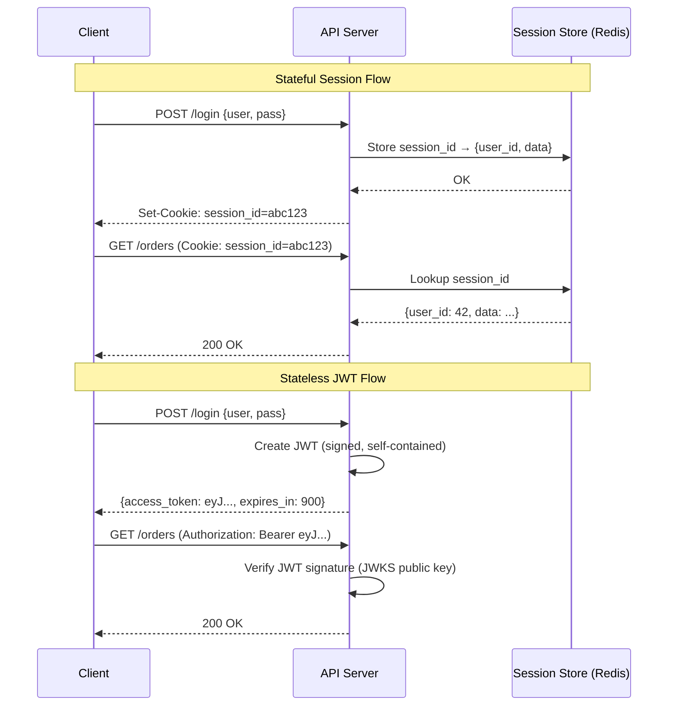

# Authentication & Authorization — The Principal Engineer's Deep Dive

*As a Principal Security Architect at AWS Identity, I've designed authentication systems that process billions of login requests daily across AWS's global infrastructure. This module transforms your understanding of auth from "JWT vs sessions" to a complete zero-trust security model — covering PKCE internals, mTLS handshake mechanics, OAuth2 security threats, and the real-world failure modes that separate production-grade auth from vulnerable implementations.*

> **Prerequisites:** This module assumes you have read the beginner-friendly [Module 8 guide](08-security-auth.md) and understand the basics (AuthN vs AuthZ, JWT structure, OAuth2/OIDC distinction, mTLS). You should also understand [Module 1: Traffic Routing](../Docs/01-traffic-routing.md) (API gateways, reverse proxies) and [Module 4: Distributed Communication](../Docs/04-distributed-comm.md) (TLS, certificate authorities).

---

## Table of Contents

1. [Stateless Tokens vs Stateful Sessions — A Deep Trade-Off Analysis](#1-stateless-tokens-vs-stateful-sessions--a-deep-trade-off-analysis)
2. [OAuth2 and OIDC Deep Dive](#2-oauth2-and-oidc-deep-dive)
3. [Service-to-Service Security (mTLS)](#3-service-to-service-security-mtls)
4. [Real-World Failure Modes](#4-real-world-failure-modes)
5. [Teacher's Corner](#5-teachers-corner)
6. [Glossary of Key Terms](#6-glossary-of-key-terms)
7. [Key Takeaways](#7-key-takeaways)

---

## 1. Stateless Tokens vs Stateful Sessions — A Deep Trade-Off Analysis



### The Session Lifecycle (Stateful)

```
Client                    Server                    Session Store (Redis)
  │                         │                            │
  │  POST /login            │                            │
  │  {user, pass}           │                            │
  │────────────────────────▶│                            │
  │                         │  Generate session ID       │
  │                         │  Store: session_id →       │
  │                         │  {user_id, expiry, data}   │
  │                         │───────────────────────────▶│
  │                         │  OK                         │
  │  Set-Cookie:            │◀───────────────────────────│
  │  session=abc123         │                            │
  │◀────────────────────────│                            │
  │                         │                            │
  │  GET /api/orders        │                            │
  │  Cookie: session=abc123 │                            │
  │────────────────────────▶│                            │
  │                         │  Lookup session_id         │
  │                         │───────────────────────────▶│
  │                         │  {user_id: 42, ...}        │
  │                         │◀───────────────────────────│
  │                         │  Process request           │
  │  200 OK + data          │                            │
  │◀────────────────────────│                            │
```

**Pros:** Instant revocation — delete the session from Redis and the user is logged out immediately. Simple mental model.

**Cons:** Every request requires a synchronous round-trip to the session store. If Redis is overloaded, every authenticated request slows down. If Redis is down, no one can authenticate. The session store becomes a **read bottleneck at scale** — at 100K QPS with 10ms Redis latency, you need 1,000 concurrent Redis connections just for session lookups.

### The JWT Lifecycle (Stateless)

```
Client                    API Gateway                  Auth Service
  │                         │                            │
  │  POST /login            │                            │
  │  {user, pass}           │                            │
  │────────────────────────▶│                            │
  │                         │  POST /auth/verify         │
  │                         │───────────────────────────▶│
  │                         │  Sign JWT (RS256)          │
  │                         │  {sub: 42, exp: T+15min}  │
  │                         │◀───────────────────────────│
  │  {access_token: jwt,    │                            │
  │   refresh_token: ...}   │                            │
  │◀────────────────────────│                            │
  │                         │                            │
  │  GET /api/orders        │                            │
  │  Authorization: Bearer  │                            │
  │  <jwt>                  │                            │
  │────────────────────────▶│                            │
  │                         │  Fetch JWKS (cached)       │
  │                         │  Verify signature          │
  │                         │  Check exp, iss, aud       │
  │                         │  Extract sub: 42           │
  │                         │  **No DB lookup**          │
  │                         │                            │
  │                         │  Forward to order service  │
  │  200 OK + data          │                            │
  │◀────────────────────────│                            │
```

**Pros:** Zero database reads for authentication. The API gateway verifies the JWT locally using a cached public key. Scales horizontally trivially — every gateway instance verifies independently.

**Cons:** **Revocation is impossible.** A stolen JWT is valid until its TTL. Solutions exist (denylist, short TTLs) but each compromises the stateless property.

### JWKS Validation at the API Gateway — The Architecture

The JWKS (JSON Web Key Set) endpoint is the mechanism that enables stateless verification at scale:

```
┌─────────────────────────────────────────────────────────┐
│  API Gateway (Envoy / Kong / Custom)                     │
│                                                         │
│  ┌─────────────────┐                                    │
│  │ JWKS Cache       │  Public keys from Auth Service    │
│  │ kid: key1 → RSA  │  Fetched on startup + refreshed   │
│  │ kid: key2 → RSA  │  every N minutes (e.g., 60 min)   │
│  └────────┬────────┘                                    │
│           │                                              │
│  Incoming JWT header: { kid: "key1", alg: "RS256" }     │
│           │                                              │
│           ▼                                              │
│  1. Lookup kid in cache → use public key "key1"          │
│  2. Verify JWT signature using key1                      │
│  3. Check exp, nbf, iss, aud                             │
│  4. Extract sub (user ID) and metadata (roles, scopes)   │
│  5. Forward request + user context to backend            │
└─────────────────────────────────────────────────────────┘
```

**Key rotation without invalidating tokens:**
- Auth service generates a new key pair (key2) 24 hours before key1 expires.
- JWKS endpoint returns both keys: `{ keys: [key1, key2] }`.
- Tokens signed with key1 have `kid: key1` in the header.
- Gateways that have cached key1 continue verifying tokens signed with key1.
- New tokens are signed with key2 (after key1's expiry, tokens signed with key2 only).
- **The rotation window must overlap** — old keys remain in JWKS until the max token TTL has passed since the rotation.

| Approach | Revocation Speed | Scalability | Ops Complexity | Best For |
|----------|-----------------|-------------|----------------|----------|
| **Stateful Session (Redis)** | Instant | Bounded by Redis cluster | Medium (Redis HA) | Monoliths, server-rendered web apps |
| **JWT (stateless)** | None (until TTL) | Unlimited | Low (no session store) | Microservices, API-first architectures |
| **JWT + Denylist (hybrid)** | Near-instant (denylist lookup) | Bounded by denylist size | High (split brain: stateless token + stateful denylist) | Systems needing both scale and revocation |

**Google's approach:** Short-lived access tokens (15 minutes), long-lived refresh tokens (revocable server-side), and a user-facing "revoke all sessions" button that increments a user's token version — the token version is embedded in the JWT and verified against the user's current version from a fast cache.

---

## 2. OAuth2 and OIDC Deep Dive

### Authorization Code Flow with PKCE

PKCE (Proof Key for Code Exchange) protects public clients (mobile apps, SPAs) from authorization code interception. Here is the complete flow with every cryptographic detail:

```
Mobile App                            Authorization Server
    │                                        │
    │  Generate code_verifier (random)       │
    │  code_verifier = base64url(M)          │
    │  where M = 32 cryptographically        │
    │  random bytes (256 bits)               │
    │                                        │
    │  code_challenge = base64url(           │
    │    SHA256(code_verifier)               │
    │  )                                     │
    │                                        │
    │  Step 1: Authorization Request         │
    │  ─────────────────────────────────────  │
    │  GET /authorize?                       │
    │    response_type=code                  │
    │    client_id=mobile_app                │
    │    redirect_uri=myapp://callback       │
    │    code_challenge=<hash>               │
    │    code_challenge_method=S256          │
    │    state=<anti-csrf-token>             │
    │───────────────────────────────────────▶│
    │                                        │  User authenticates
    │                                        │  User consents
    │                                        │
    │  Step 2: Authorization Code            │
    │  Redirect to:                          │
    │  myapp://callback?code=<auth_code>     │
    │  &state=<anti-csrf-token>              │
    │◀───────────────────────────────────────│
    │                                        │
    │  Verify state matches sent value       │
    │                                        │
    │  Step 3: Token Exchange                │
    │  POST /token                           │
    │    grant_type=authorization_code       │
    │    code=<auth_code>                    │
    │    redirect_uri=myapp://callback       │
    │    code_verifier=<original_verifier>   │
    │───────────────────────────────────────▶│
    │                                        │
    │  Server: verify code_verifier          │
    │  SHA256(code_verifier) ==              │
    │    stored code_challenge?               │
    │                                        │
    │  Step 4: Tokens                        │
    │  { access_token,                       │
    │    refresh_token,                      │
    │    id_token (JWT) }                    │
    │◀───────────────────────────────────────│
```

**Why PKCE is mandatory:**
Without PKCE, an attacker who intercepts the authorization code (via malicious app on same device, URL hijacking on mobile, or compromised OS notification) can immediately exchange it for tokens. The attacker needs only the `client_id` and `redirect_uri`, which are public. PKCE binds the authorization code to the specific app instance that initiated the flow — the attacker does not have the `code_verifier`, so the exchange fails.

**The `code_challenge_method` security:** `S256` (SHA-256 hash) is secure. `plain` (sends the verifier directly as the challenge) is insecure — an attacker who sees the challenge has the verifier. Never use `plain` in production.

### AuthN vs AuthZ — OIDC and OAuth2 Boundaries

This confusion causes production security vulnerabilities. The two protocols serve different purposes that are often mixed:

| | OAuth 2.0 | OIDC (OpenID Connect) |
|--|-----------|----------------------|
| **Purpose** | Authorization — grant access to resources | Authentication — verify identity |
| **Token** | Access Token (opaque or JWT) | ID Token (always JWT) |
| **Contains** | Scopes, resource access | `sub`, `name`, `email`, `iss` |
| **Who inspects** | Resource server (API) | Client application (app) |
| **Standard** | RFC 6749 | RFC 7519 + OpenID Connect Core |

**The dangerous anti-pattern:** Using the access token as proof of identity. "I have a valid access token, therefore I am user 42." This is wrong because:
- An access token might grant access to only one specific API (e.g., `calendar:read`), not identity.
- The access token was issued to a client, not necessarily to the user who is currently sitting at the device.
- OAuth2 has no standardized user identity claim — `sub` in an access token is a client-specific identifier, not a global user ID.

**The correct approach:**
1. Use OIDC (ID Token) for authentication: "Who is the user?"
2. Use OAuth2 (Access Token) for authorization: "What can this app do on behalf of the user?"
3. The ID Token is verified by the client app. The Access Token is opaque to the client and verified by the resource server.

---

## 3. Service-to-Service Security (mTLS)

### The Mutual TLS Handshake — Step by Step

```
Client (Service A)              Server (Service B)
      │                               │
      │  Step 1: TCP Handshake         │
      │──────────────────────────────▶│
      │◀──────────────────────────────│
      │                               │
      │  Step 2: TLS ClientHello      │
      │  + supported cipher suites    │
      │──────────────────────────────▶│
      │                               │
      │  Step 3: ServerHello          │
      │  + certificate                │
      │  + CertificateRequest (mTLS)  │
      │◀──────────────────────────────│
      │                               │
      │  Step 4: Client verifies      │
      │  server cert against CA       │
      │                               │
      │  Step 5: ClientCertificate    │
      │  + ClientCertificateVerify    │
      │──────────────────────────────▶│
      │                               │
      │  Step 6: Server verifies      │
      │  client cert against CA       │
      │                               │
      │  Step 7: Key Exchange &       │
      │  Encrypted Channel            │
      │◀═════════════════════════════▶│
```

**The key distinction from regular TLS:**
- Regular TLS (HTTPS): Step 5 is optional. The server sends a certificate, but the client sends nothing.
- mTLS: Both sides send and verify certificates. **The connection fails if either side's certificate is invalid.**

### Centralized PKI for Certificate Management

In a service mesh with thousands of services, managing individual certificates is impossible. The solution is **automated PKI with SPIFFE**:

```
┌──────────────────────────────────┐
│  Certificate Authority (Istiod)  │
│                                  │
│  - Issues certificates           │
│  - Signs with root CA key        │
│  - Auto-rotates before expiry    │
│  - Revokes on demand             │
└──────────┬───────────────────────┘
           │  SPIFFE identity per workload:
           │  spiffe://cluster.local/ns/default/sa/payment-sa
           │
           ▼
┌──────────────────────┐     ┌──────────────────────┐
│  Service A           │     │  Service B           │
│  Certificate:        │     │  Certificate:        │
│  NotAfter: T+24h     │     │  NotAfter: T+24h     │
│  Identity: payment-sa│     │  Identity: order-sa  │
│  Renews every 12h    │     │  Renews every 12h    │
└──────────────────────┘     └──────────────────────┘
```

**The identity is embedded in the certificate's SAN (Subject Alternative Name) as a SPIFFE URI.** When Service B receives a connection from Service A, it extracts the SPIFFE ID from the certificate and uses it for authorization decisions.

### RBAC vs ABAC

| Model | Decision Basis | Example | Scalability |
|-------|---------------|---------|-------------|
| **RBAC (Role-Based)** | Predefined roles | `role: admin → permission: delete_order` | Easy — roles are finite; adding 100K users does not add complexity |
| **ABAC (Attribute-Based)** | User + resource + environment attributes | `user.department == order.department && time between 9-5` | Complex — policy explosion risk; each additional attribute multiplies combinations |

**Production recommendation:** RBAC for coarse-grained access (90% of use cases). ABAC for fine-grained, context-dependent decisions (e.g., "a user can edit their own documents but not others"). Use ABAC only when RBAC's role granularity is insufficient.

**Google's approach (Zanzibar / Google Groups):** ACL-based (Access Control Lists) with group membership as the core primitive. Every resource has an ACL (e.g., `viewer: group-engineering`). User authorization = "is the user a member of any group in this resource's ACL?" This is RBAC with dynamic group membership — the most scalable model for global systems.

---

## 4. Real-World Failure Modes

### JWT Revocation Dilemma

**The problem:** A user's account is compromised. You revoke their password and freeze the account. But the JWT they have in their browser is still valid for 12 more hours. They continue calling APIs with that JWT.

**Three solutions, each with trade-offs:**

| Solution | Mechanism | Weakness |
|----------|-----------|----------|
| **Short TTL + Refresh** | Access token TTL = 15 min. Refresh token = revocable (DB lookup on each use) | Refresh token exchange requires a DB call — trading statelessness for revocability. If the refresh token itself is stolen, the attacker can get new access tokens for 30+ days. |
| **Denylist** | Redis cache of revoked JWT IDs (jti claims). Gateway checks denylist before verifying. | Denylist must be replicated to all gateways. If the denylist is stale, a revoked JWT is accepted. If the denylist is down, all JWTs are rejected (deny by default) or accepted (allow by default — less secure). |
| **Token Version** | JWT contains a `token_version` claim. Auth service stores the user's current version. Gateway checks: `jwt.token_version >= user.token_version`? | Requires a cache lookup (user's token version) — not fully stateless. But the lookup is a simple integer check, not a full session scan. |

**The Principal Engineer's recommendation:** Short TTL (15 min) + versioned token + denylist for high-risk accounts only. The denylist is checked only for users flagged as "compromised" — a tiny fraction of total traffic. 99.9% of JWT verifications are stateless. This is **defense in depth**: fast path for normal traffic, slower path for high-risk edge cases.

### Replay Attacks and MITM

**The problem:** An attacker captures a valid JWT from the network (via TLS interception at a compromised proxy, or by reading the browser's localStorage via XSS). The attacker sends the captured JWT to the API. The API cannot distinguish the attacker's request from the legitimate user's request.

**Solution 1: DPoP (Demonstration of Proof of Possession)**
- The client generates a key pair and includes the public key in the token request.
- The authorization server binds the token to the public key: `{ ..., "cnf": { "jkt": "<thumbprint of public key>" } }`.
- Every API request includes a DPoP header: a JWT signed with the client's private key, containing the request method, URL, and timestamp.
- The server verifies the DPoP signature matches the public key bound to the access token.

**DPoP prevents token replay because:**
- Token + DPoP header are tied to a specific request (method + URL + timestamp).
- An attacker cannot replay the token + DPoP header for a different request (different URL → invalid DPoP).
- An attacker cannot generate a new DPoP header without the private key.
- The DPoP header timestamp (within 5-minute window) limits replay window.

**Solution 2: mTLS-bound tokens (RFC 8705)**
- The client authenticates with mTLS during the token request.
- The authorization server binds the token to the client's X.509 certificate thumbprint.
- The resource server verifies that the TLS connection's client certificate matches the token's bound certificate.

**DPoP vs mTLS-bound:**

| | DPoP | mTLS-bound |
|--|------|------------|
| **Implementation** | Application layer (HTTP headers) | Transport layer (TLS) |
| **Requires** | Client generates key pair | PKI with client certificates |
| **Browser support** | Yes (JavaScript can sign) | No (browsers do not expose client TLS) |
| **Mobile support** | Yes | Yes (native apps can use client certs) |
| **Revocation** | Rotate client key | Revoke client certificate |

---

## 5. Teacher's Corner

### Advanced Question 1: PKCE Downgrade Attack

*"An attacker intercepts the authorization request to your OAuth2 server and changes the `code_challenge_method` from `S256` to `plain`. The authorization server does not reject `plain` method. Explain the attack. How do you prevent it?"*

**Grading Rubric (Principal level):**

| Score | Criteria |
|-------|----------|
| **Outstanding (10)** | Explains: The attacker changes `code_challenge_method=S256` to `plain` and sets `code_challenge` to a known value (e.g., the attacker's own verifier). The authorization server accepts `plain` method, stores the attacker-provided challenge, and issues the authorization code. The legitimate app receives the code and tries to exchange it with the original `code_verifier`. The server computes `SHA256(code_verifier)` and compares against the attacker's `code_challenge` — they do not match, so the exchange fails. The attacker then exchanges the code with their known verifier and gets the tokens. **The fix:** The authorization server MUST reject `code_challenge_method=plain` (or any method other than `S256`). The spec (RFC 7636) says `S256` MUST be supported and `plain` SHOULD NOT be used. Google and Auth0 reject `plain` by default. Also: the server must store the original `code_challenge_method` sent and use it during verification — not infer it from the verifier. |
| **Good (7-9)** | Identifies the downgrade attack. Knows that `plain` is insecure. Cannot articulate the full exchange failure mechanism or the fix. |
| **Needs Work (<7)** | Does not understand that the attacker can manipulate the method. Thinks PKCE is bulletproof regardless of method. |

### Advanced Question 2: Multi-AS Mix-Up Attack

*"Your system uses two OAuth2 authorization servers (AS1 for internal users, AS2 for social login). An attacker configures their client to use AS1 but sends the authorization code to AS2's token endpoint. How does the mix-up attack work? How do OAuth2 security BCP (RFC 9700) prevent this?"*

**Grading Rubric (Staff/Principal level):**

| Score | Criteria |
|-------|----------|
| **Outstanding (10)** | Explains: The attacker registers a client with AS1 (which has weaker security) and sends the user to AS1 for authorization. AS1 issues an authorization code. The attacker's client sends this code to AS2's token endpoint. AS2 does not know whether the code was issued by itself or AS1 — it might accept the code if AS2's token endpoint is lenient (some OAuth2 implementations accept any code without verifying the issuer). The attacker gets tokens from AS2. **The fix (RFC 9700 Security BCP):** Use `iss` parameter in the authorization response. The authorization server includes its issuer identifier in the response. The client MUST validate that the issuer in the response matches the expected AS. Additionally, the client MUST NOT send a code to an AS that did not issue it — the token endpoint should be paired with the authorization endpoint used. The `aud` claim in the token should also identify which AS issued it. |
| **Good (7-9)** | Understands the general concept of code misdirection. Mentions issuer validation but not specifically `iss` parameter in authorization response. |
| **Needs Work (<7)** | Thinks OAuth2 is inherently secure against cross-AS attacks. Does not understand token endpoint pairing. |

### Advanced Question 3: Zombie Refresh Token During Network Partition

*"A network partition occurs between your mobile app and your auth server for 30 minutes. The user has a refresh token with a 90-day lifetime. The app tries to refresh the access token (15-min TTL) during the partition. After 30 minutes when connectivity is restored, 2 refresh attempts have been made (both failed). The user's access token is expired by 15 minutes. Design the recovery. What if the refresh token's `exp` claim was 30 minutes from now (almost expiring)? Can the user lose their session?"*

**Grading Rubric (Principal level):**

| Score | Criteria |
|-------|----------|
| **Outstanding (10)** | Identifies two scenarios. **Scenario 1 (long refresh TTL):** The 2 failed attempts do not invalidate the refresh token (unless the server decrements a "max refresh attempts" counter). The app should retry refresh when connectivity resumes. If the server stores `last_refresh_attempt` in the refresh token record, the 2 attempts that failed should not count against the user if they never reached the server. **Scenario 2 (refresh expiring during partition):** If the refresh token expires during the 30-minute partition, the user must re-authenticate. This is by design — but the UX must handle it gracefully (the app shows "session expired, please log in"). The real failure mode is a **zombie refresh token**: if the server-internal clock drifts (NTP failure) and the partition prevents token revocation from propagating, a refresh token that was revoked during the partition might still be accepted after recovery if the revocation state was not replicated. **The fix:** The auth server must use a distributed counter or version number per refresh token. Each refresh attempt (even failed) increments the version. The token is valid only if the presented version matches the server's latest version. This prevents replay of stale refresh tokens across partitions. |
| **Good (7-9)** | Describes refresh retry logic correctly. Mentions the re-authentication edge case. Does not consider distributed revocation state. |
| **Needs Work (<7)** | Assumes the refresh token magically survives the partition. Does not understand the revocation propagation problem. |

---

## 6. Glossary of Key Terms

| Term | Section | Definition |
|------|---------|------------|
| **JWKS** | 1 | JSON Web Key Set — a set of public keys published by an authorization server for stateless JWT signature verification |
| **Kid (Key ID)** | 1 | Identifier in the JWT header that tells verifiers which public key from the JWKS to use |
| **Token Binding** | 1 | Cryptographic binding of a token to the client that possesses a specific key, preventing stolen-token reuse |
| **PKCE** | 2 | Proof Key for Code Exchange — extension to OAuth2 that prevents authorization code interception on public clients |
| **Code Verifier** | 2 | A cryptographically random string (43-128 characters) generated by the client, used as the secret in PKCE |
| **Code Challenge** | 2 | A transformed version of the code verifier (SHA256 hash) sent in the initial authorization request |
| **SPIFFE** | 3 | Secure Production Identity Framework for Everyone — standard URI format for workload identity in mTLS |
| **SAN (Subject Alternative Name)** | 3 | Field in an X.509 certificate that contains the identity — SPIFFE URI is placed here in service mesh certificates |
| **DPoP** | 4 | Demonstration of Proof of Possession — mechanism to bind an access token to a specific client's key pair per request |
| **Token Version** | 4 | Monotonically incrementing integer stored server-side and embedded in JWT; checking it enables efficient revocation |
| **Denylist** | 4 | A list of revoked JWT IDs (jti claims) checked during verification — trading statelessness for revocability |
| **Issuer Confusion** | 5 | Attack where an authorization code from one AS is sent to a different AS's token endpoint, exploiting missing issuer validation |

---

## 7. Key Takeaways

1. **Stateful sessions give instant revocation. JWTs give unlimited scalability. Hybrid approaches (short TTL + versioned tokens + denylist for high-risk users) give both.**

2. **JWKS is the mechanism that makes stateless verification work at scale.** Cache public keys in the API gateway. Rotate keys with a window that covers the maximum token TTL.

3. **PKCE is mandatory for public clients.** Use `S256`, never `plain`. The authorization server must reject `plain`.

4. **AuthN (OIDC) and AuthZ (OAuth2) are separate protocols.** The ID Token proves identity. The Access Token grants resource access. Never use the access token for identity.

5. **mTLS provides transport-layer identity.** Service mesh PKI with SPIFFE identities and automated certificate rotation makes mTLS operationally feasible at scale.

6. **DPoP and mTLS-bound tokens prevent replay attacks.** Without sender-constraining, a stolen JWT can be used by anyone until it expires.

7. **Short TTLs (15 minutes) limit the blast radius of stolen tokens.** Refresh tokens remain revocable server-side with a database lookup.

8. **Authorization code mix-up attacks are prevented by issuer validation (RFC 9700).** The authorization response must include the issuer, and the client must verify it.

9. **Network partitions create token revocation propagation problems.** Use versioned tokens with a distributed counter to prevent stale token replay.

10. **Token revocation is fundamentally at odds with statelessness.** Every "stateless" system eventually needs some state for revocation. Design this state carefully — it should be fast (Redis), small (only revoked token IDs), and highly available.

---

> This deep-dive gives you the cryptographic and architectural foundation to design zero-trust authentication at global scale. You now understand not just *how* JWT, OAuth2, and mTLS work — but *why* they fail in production and *how* to build systems that survive token theft, partition, and issuer confusion.
