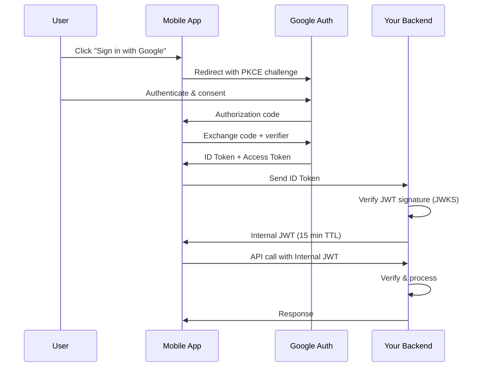

# Authentication & Authorization – A Beginner's Guide

You've used this every time you clicked "Sign in with Google" instead of creating yet another username and password. That single button triggers a cascade of authentication (proving who you are) and authorization (deciding what you can do) — all without the website ever seeing your Google password.

You've also felt the pain when it goes wrong. Ever been logged out of a site in the middle of a purchase? Or seen "Access denied" on a page you should have access to? Those are authentication and authorization failures — the system either didn't recognize you or didn't trust what you were allowed to do.

Auth is the security perimeter of the digital world. Every API call, every page load, every service-to-service request must answer two questions: "Who is this?" and "Should they be allowed?" This module explains how modern systems answer both questions securely and at scale.

> This guide explains how systems verify who you are (authentication) and what you are allowed to do (authorization) in a distributed, API-driven world.
> Every technical term is defined the first time it appears, and a full Glossary is at the end.
> Once you understand these foundations, the original advanced module will feel like a natural next step.

---

> **Before you start:** You should understand [Module 1: Traffic Routing](../Docs/01-traffic-routing.md). If you haven't read those yet, start there.

## Table of Contents

1. [Authentication vs Authorization](#1-authentication-vs-authorization)
2. [Stateful Sessions: The Hotel Key Card](#2-stateful-sessions-the-hotel-key-card)
3. [Stateless Tokens (JWT): The Passport](#3-stateless-tokens-jwt-the-passport)
4. [How JWT Signatures Work](#4-how-jwt-signatures-work)
5. [OAuth 2.0: Delegating Access](#5-oauth-20-delegating-access)
6. [OIDC: Proving Who You Are](#6-oidc-proving-who-you-are)
7. [Service-to-Service Security with mTLS](#7-service-to-service-security-with-mtls)
8. [Common Disasters and How to Avoid Them](#8-common-disasters-and-how-to-avoid-them)
9. [Putting It All Together — A User Logs In](#9-putting-it-all-together--a-user-logs-in)
10. [Glossary of Technical Terms](#10-glossary-of-technical-terms)
11. [Key Takeaways](#11-key-takeaways)

---

> **⏱ TL;DR — If you only learn 3 things from this module:**
> 1. **AuthN first, then AuthZ** — always verify who the user is before checking what they can do. They are two separate steps, not one.
> 2. **JWTs are stateless and scalable but cannot be revoked** — use short TTLs (15 minutes) and refresh tokens. For instant revocation, use stateful sessions.
> 3. **Never roll your own crypto** — use standard protocols (OAuth 2.0, OIDC, mTLS) and well-vetted libraries. Algorithm confusion and `alg: none` attacks are real and catastrophic.

---

## 1. Authentication vs Authorization

These two terms are often confused. They are different:

| Term | Short | Answers | Analogy |
|------|-------|---------|---------|
| **Authentication** | AuthN | "Who are you?" | Showing your ID at airport security |
| **Authorization** | AuthZ | "What are you allowed to do?" | Your boarding pass says you can board the flight but not enter the cockpit |

A system must always do **AuthN first**, then **AuthZ**. There is no point checking permissions if you do not know who the user is.

---

## 2. Stateful Sessions: The Hotel Key Card

**How it works:**

1. The user logs in with username and password.
2. The server creates a session record (a row in a database or a key in Redis) and generates a random **session ID**.
3. The server sends the session ID to the client as a cookie.
4. On every subsequent request, the client sends the cookie. The server looks up the session ID in its database to verify the user.

**Analogy:** This is like a hotel key card. The front desk (server) keeps a record of which room you are in. Every time you enter the building, you hand over your card, and the clerk checks the computer to confirm you are a guest.

**Pros:**
- Easy to revoke — delete the session record and the user is instantly logged out.
- Simple to implement for traditional web applications.

**Cons:**
- The server must store every active session. If you have 10 million users, you need 10 million session entries.
- Cannot scale horizontally without a shared session store (all servers must access the same Redis/database).

---

## 3. Stateless Tokens (JWT): The Passport

**JWT** stands for **JSON Web Token**. It is a compact, self-contained way to transmit identity information.

**How it works:**

1. The user logs in with username and password.
2. The server creates a JWT containing the user's ID, permissions, and an expiration time.
3. The server signs the JWT with a private key (like a digital signature) and sends it to the client.
4. On every subsequent request, the client sends the JWT. The server verifies the signature using the corresponding public key — **no database lookup required**.

**Analogy:** A JWT is like a passport. It contains your photo, your name, and an official stamp (signature) that any border agent can verify using a public document (the signing key). The agent does not need to call your home country to confirm you are who you say you are — the cryptographic signature proves it.

**Pros:**
- **Stateless:** The server does not need to store anything. Scales horizontally instantly.
- **Decentralized verification:** Any service with the public key can verify a JWT.

**Cons:**
- **Cannot be revoked.** If a JWT is stolen, it is valid until it expires (unless you maintain a denylist, which defeats the stateless purpose).
- **Token size** is larger than a session ID.

| Approach | Use when… | Don't use when… |
|---------|-----------|-----------------|
| **Stateful Sessions** | You need instant revocation; your app is a monolith or traditional web app; you have a small number of servers or a shared session store (Redis) | You need horizontal scalability without a shared store; your services are distributed across many regions |
| **Stateless JWTs** | You have microservices or APIs that need to verify tokens without calling a central database; you need horizontal scalability out of the box | You need to revoke tokens instantly; you cannot tolerate the risk of stolen tokens being valid until TTL expiry |

---

## 4. How JWT Signatures Work

A JWT looks like this: `xxxxx.yyyyy.zzzzz` — three parts separated by dots.

| Part | Content | Example |
|------|---------|---------|
| **Header** | Algorithm and token type | `{"alg": "RS256", "typ": "JWT"}` |
| **Payload** | Claims (user ID, expiration, issuer) | `{"sub": "user_42", "exp": 1718000000, "iss": "auth.example.com"}` |
| **Signature** | Cryptographic proof | Ensures nobody tampered with the payload |

**The signature is what makes JWT secure.** Here is how it works:

1. The server takes the header and payload, hashes them, and encrypts the hash with its **private key**. This creates the signature.
2. The verifier (any service) does the same hash and uses the server's **public key** to check the signature.

If an attacker modifies the payload (e.g., changes `"sub": "user_42"` to `"sub": "admin"`), the signature will not match, and the JWT is rejected. The attacker cannot create a valid signature because they do not have the private key.

**Key rotation:** The server can publish multiple public keys via a **JWKS (JSON Web Key Set)** endpoint. Each key has a unique `kid` (key ID). The JWT header includes the `kid` so verifiers know which public key to use. This allows the server to rotate keys without invalidating active tokens.

---

## 5. OAuth 2.0: Delegating Access

OAuth 2.0 is a protocol that allows a user to grant a third-party application limited access to their resources **without sharing their password**.

**Analogy:** A nightclub stamp. You show your ID at the door (prove who you are). The club stamps your hand. Later, the bartender sees the stamp and knows you are allowed to be there, but the bartender never sees your ID — they just trust the stamp.

**Real-world example:** You click "Sign in with Google" on a website. The website never sees your Google password. Instead, Google gives the website a temporary token that proves you are you (OIDC — see next section) and optionally allows the website to access specific Google APIs on your behalf (OAuth 2.0).

### PKCE — Protection for Mobile Apps

**PKCE** (Proof Key for Code Exchange) is an extra security layer for OAuth. The app generates a secret (code verifier) and sends a hashed version (code challenge) to the authorization server. When exchanging the code for a token, it must provide the original secret. This prevents an attacker who intercepts the authorization code from using it.

---

## 6. OIDC: Proving Who You Are

**OIDC (OpenID Connect)** is an identity layer on top of OAuth 2.0. While OAuth 2.0 is about access ("this app can read my calendar"), OIDC is about identity ("this is who I am").

**Analogy:**
- **OAuth 2.0** = a key card that opens specific doors (access).
- **OIDC** = a passport that proves your identity (authentication).

In practice, OIDC gives you an **ID Token** (a JWT) containing the user's identity, while OAuth 2.0 gives you an **Access Token** (opaque or JWT) used to call APIs.

| Protocol | Use when… | Don't use when… |
|----------|-----------|-----------------|
| **OAuth 2.0** | You need to grant a third-party app limited access to a user's resources (e.g., "let this app read my calendar"); you need delegated authorization | You only need to verify who the user is (authentication); you need identity information in the token itself |
| **OIDC** | You need to verify a user's identity via a third-party provider (e.g., "Sign in with Google"); you need standardized identity claims (name, email, profile) in a JWT | You only need to authorize API access without identity verification; the overhead of the OIDC flow is unnecessary |

---

## 7. Service-to-Service Security with mTLS

**mTLS (mutual TLS)** extends the TLS protocol that secures HTTPS. In normal TLS, only the client verifies the server's certificate. In mTLS, **both sides verify each other**.

**How it works:**

1. Every service gets a digital certificate (like a passport) issued by the organization's Certificate Authority.
2. When Service A calls Service B, Service A presents its certificate.
3. Service B verifies that Service A's certificate is signed by the trusted CA.
4. Service B also presents its own certificate, and Service A verifies it.
5. Only if both certificates are valid does the connection proceed.

This means **only authorized services can communicate**. If an attacker deploys a malicious service, it cannot connect to any other service because it does not have a valid certificate.

---

> **✏️ Check Your Understanding**
> 1. Your API server receives a JWT with `"alg": "none"` and no signature. Should it accept it? What should your server do instead?
> 2. A user is banned from your platform, but their JWT is still valid for 12 hours. You cannot afford to wait. How do you revoke access immediately without losing the benefits of stateless tokens entirely?
> 3. Your auth server uses RS256 (asymmetric). An attacker changes the algorithm in the JWT header to HS256 and uses your server's public key (which is published via JWKS) to forge a valid token. What went wrong in your verification logic?
> 

> 
Answers

> 1. **Never accept `alg: none`.** Always hardcode the allowed algorithms on the server. Reject any token that uses a non-whitelisted algorithm, especially "none."
> 2. **Use short TTLs (15 min) with a revocable refresh token.** The access token expires quickly. The refresh token can be revoked server-side (it requires a database lookup when exchanged). Combine this with a short-lived denylist (in Redis) for the most critical accounts.
> 3. **Your verification logic allowed the client to specify the algorithm.** The server should hardcode the expected algorithm (RS256) and refuse to use any other, especially symmetric algorithms like HS256 when the server uses asymmetric keys.
> 

---

## 8. Common Disasters and How to Avoid Them

### The `alg: none` Attack

**Symptom:** An attacker gains unauthorized access by sending a JWT with no signature. The server accepts it and grants access to protected resources.

**Root Cause:** The JWT library is configured to accept the algorithm specified in the token header. The attacker sets `"alg": "none"` and removes the signature. The library sees "no signature required" and passes the token as valid.

**Real Incident:** In 2015, several popular JWT libraries were found vulnerable to this attack. Attackers could forge tokens for any user by simply removing the signature and setting `alg: none`. The vulnerability affected applications using `jsonwebtoken`, `pyjwt`, and many other libraries.

**Fix:** Always hardcode the allowed algorithms on the server. Never read the algorithm from the token header without validating it against a whitelist. Reject any token that uses a non-whitelisted algorithm, especially "none."

**How to Detect Early:** Monitor for tokens with unexpected algorithms in your API gateway logs. Set up an alert if any request contains a JWT with `alg` set to `none` or any algorithm not in your whitelist.

### Algorithm Confusion

**Symptom:** An attacker forges valid JWTs using your server's public key. The tokens pass signature verification and grant unauthorized access.

**Root Cause:** The server uses RS256 (asymmetric: private key signs, public key verifies). The attacker changes the algorithm to HS256 (symmetric: same key signs and verifies). If the verification code does not check whether the algorithm is asymmetric or symmetric, it uses the public key (which is public!) as the HMAC secret to verify the forged token — and it passes.

**Real Incident:** Several enterprise SSO implementations were found vulnerable to this attack in 2018. Attackers could forge admin-level tokens by simply changing the algorithm field. The fix required updating JWT libraries and verification logic across thousands of integrations.

**Fix:** Do not use the same verification function for asymmetric and symmetric algorithms. Hardcode the expected algorithm on the server. Use separate code paths for RS256 (asymmetric) and HS256 (symmetric). Better yet, only support asymmetric algorithms in production.

**How to Detect Early:** Log the algorithm used in every JWT verification. Alert if a token using HS256 is received by a server that only publishes RS256 public keys.

### Token Revocation

**Symptom:** A user is banned, terminated, or their account is compromised, but they continue to access APIs for hours. The JWT is still within its validity period.

**Root Cause:** JWTs are stateless — once issued, they cannot be revoked without a server-side denylist. If the token has a long TTL (e.g., 24 hours), the window for unauthorized access is large.

**Real Incident:** In 2019, a SaaS company terminated an employee but the employee's JWT-based API access remained active for 18 hours because the token's TTL was set to 24 hours. The employee downloaded sensitive customer data before the token expired.

**Fix:** Use short TTLs (15 minutes) with refresh tokens. The refresh token can be revoked server-side (it requires a database lookup when exchanged for a new access token). For critical accounts, maintain a short-lived denylist (in Redis with a TTL matching the access token lifetime) that is checked on every request.

**How to Detect Early:** Monitor for tokens being used after account status changes. Alert if a disabled account's tokens are still being accepted. Track the average time between account ban and token expiry.

### Clock Skew

**Symptom:** Valid JWTs are rejected, or expired JWTs are accepted. Users are randomly logged out, or attackers can use expired tokens.

**Root Cause:** The JWT's `exp` (expiration) claim is checked against the server's clock. If the issuing server and verifying server have different clock times (even by seconds), a token may appear expired or not-yet-valid.

**Real Incident:** A financial API provider experienced a 47-minute outage when one of their auth servers drifted 90 seconds ahead of the others. Tokens issued by the drifted server were rejected by verifying servers for being "issued in the future." The fix required adding NTP synchronization and a 60-second leeway.

**Fix:** Always add a small leeway (30-60 seconds) to both the `exp` (expiration) and `nbf` (not before) checks. Ensure all servers use NTP for clock synchronization. Use the `iat` (issued at) claim to detect tokens that were issued significantly in the future.

**How to Detect Early:** Monitor clock skew between servers using NTP. Alert if any server's clock drifts by more than 5 seconds from the reference. Track JWT verification failures caused by `exp` or `nbf` claims and alert if they spike.

---

## 9. Putting It All Together — A User Logs In

Let's trace a user logging into a mobile app using "Sign in with Google":

1. **User clicks "Sign in with Google"** — the app opens a browser window to Google's authorization server.
2. **OAuth 2.0 + PKCE** — The app generates a code verifier and sends a code challenge. The user authenticates with Google. Google asks: "This app wants to know your identity. Do you consent?"
3. **User consents** — Google redirects to the app with an **authorization code**.
4. **App exchanges the code** — The app sends the authorization code + code verifier to Google. Google verifies the verifier and returns an ID Token (OIDC — who the user is) and an Access Token (OAuth — access to Google APIs).
5. **App calls its own backend** — The app sends the ID Token to the app's API server.
6. **Backend verifies the JWT** — The backend fetches Google's public key from Google's JWKS endpoint, verifies the JWT signature, checks the expiration and issuer, and extracts the user's identity.
7. **Backend issues its own JWT** — The backend creates a short-lived internal JWT (15 minute TTL) for the app's own API calls. This JWT is signed with the backend's private key.
8. **App calls the API** — The app sends the internal JWT. The API verifies the signature and processes the request.

The user's password was never shared with the app. The app's backend never needed to store session state. And every service verifies the JWT locally without calling a central database.

---

> **🧪 Conceptual Exercises**
> 1. Your mobile app uses JWTs for authentication. A user's phone is stolen. The JWT has a 24-hour TTL. How do you prevent the thief from accessing the user's data for the next 24 hours? What trade-offs does your solution involve?
> 2. Your backend calls an external payment API. The payment API requires a client certificate to authenticate your service. Which protocol would you use, and how would you manage certificate expiry without causing a production outage?
> 

> 
Hints

> For question 1, consider refresh tokens and a denylist — the refresh token can be revoked server-side, and stolen access tokens can be checked against a short-lived denylist (at the cost of losing full statelessness). Short TTLs limit the damage window. For question 2, this is mTLS — your service needs a certificate signed by the payment provider's CA. Use a certificate management tool (like cert-manager) to auto-renew before expiry, and set up monitoring on certificate expiry dates.
> 

---

## 10. Glossary of Technical Terms

| Term | Definition | Section |
|------|------------|---------|
| **AuthN (Authentication)** | The process of verifying who a user is. | 1 |
| **AuthZ (Authorization)** | The process of determining what a user is allowed to do. | 1 |
| **Session** | A server-side record of an authenticated user, stored in a database or cache. | 2 |
| **Stateless** | The server does not store any client state between requests. | 3 |
| **JWT (JSON Web Token)** | A compact, self-contained, cryptographically-signed token for transmitting identity and claims. | 3 |
| **Public Key** | A key published openly that anyone can use to verify a JWT signature. | 4 |
| **Private Key** | A secret key used to sign JWTs. Only the issuer knows it. | 4 |
| **RS256** | An asymmetric signing algorithm (RSA with SHA-256) — private key signs, public key verifies. | 4 |
| **JWKS (JSON Web Key Set)** | A set of public keys published by an authorization server for JWT verification. | 4 |
| **OAuth 2.0** | A protocol for delegated authorization — granting limited access without sharing passwords. | 5 |
| **Access Token** | A token that grants access to specific resources or APIs (OAuth 2.0). | 5 |
| **Refresh Token** | A long-lived token used to obtain new access tokens without re-authentication. | 5 |
| **PKCE** | Proof Key for Code Exchange — protects OAuth flows on mobile and public clients. | 5 |
| **DPoP (Demonstration of Proof-of-Possession)** | A technique to bind a token to a specific client, preventing stolen-token reuse. | 5 |
| **OIDC (OpenID Connect)** | An identity layer on top of OAuth 2.0 for authentication. | 6 |
| **ID Token** | A JWT that contains the user's identity (OIDC). | 6 |
| **mTLS (Mutual TLS)** | A security protocol where both client and server verify each other's certificates. | 7 |
| **Certificate Authority (CA)** | A trusted entity that issues digital certificates. | 7 |
| **Token Revocation** | Invalidating a token before its natural expiration. Difficult with stateless JWTs. | 8 |
| **Clock Skew** | The time difference between the clocks of two systems. | 8 |

---

## 11. Key Takeaways

1. **Know the difference:** AuthN = who you are, AuthZ = what you can do. Always do AuthN first.
2. **Stateful sessions** are simple and instantly revocable, but do not scale without a shared store.
3. **Stateless JWTs** scale horizontally and need no server storage, but cannot be easily revoked.
4. **JWT signatures** (not just encoding!) are what make tampering detectable. Always verify the signature.
5. **Hardcode the allowed algorithms** on the server to prevent `alg: none` and algorithm confusion attacks.
6. **JWKS enables key rotation** without invalidating active tokens.
7. **OAuth 2.0 delegates access** without sharing passwords. PKCE is mandatory for mobile apps.
8. **OIDC provides identity** on top of OAuth 2.0. The ID Token (JWT) proves who the user is.
9. **mTLS ensures only authorized services** can communicate within your infrastructure.
10. **Short TTLs + refresh tokens** balance security (limited window if stolen) with usability.
11. **Always set a clock skew leeway** of 30-60 seconds when validating token expiration.
12. **The best defense is defense in depth:** short TTLs, constrained tokens, mTLS, algorithm whitelisting, and monitoring all work together.

---

> This guide explains the "why" behind authentication and authorization patterns.
> Once you're comfortable with these concepts, the original module (with its JWT validation code, OAuth 2.0 flow diagrams, and mTLS handshake deep dive) will serve as your in-depth reference.
> For a deep-dive into PKCE internals, DPoP replay protection, JWKS rotation mechanics, and multi-AS mix-up attacks, read the [advanced companion file](08-security-auth-advanced.md) — written from a Principal Security Architect's perspective.
> Remember: in a zero-trust world, identity is the new perimeter. Every request must be verified, regardless of where it comes from.
