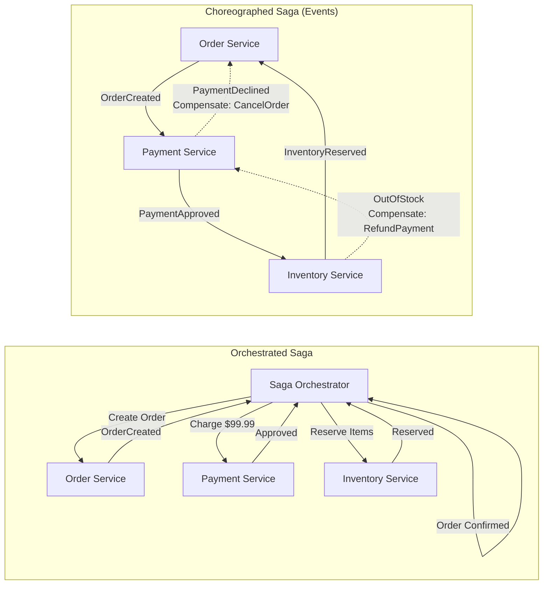

# Enterprise Microservices: Advanced Transactional Patterns

*As a Principal Software Architect at Amazon, I designed the ordering pipeline that processes millions of transactions daily across 200+ microservices. This module dissects the patterns that separate production-grade distributed systems from academic prototypes — the Saga, Transactional Outbox, CQRS, and Event Sourcing patterns you will actually use when your monolith breaks apart.*

> **Prerequisites:** This module assumes you have read the beginner-friendly [Module 9 guide](09-microservices-patterns.md) and understand Sagas, Outbox, CQRS, and Event Sourcing at a conceptual level. You should also understand [Module 05 — Async Messaging](05-async-messaging.md) and [Module 12 — Distributed Consensus](12-distributed-consensus.md).

---

## Table of Contents

1. [The Saga Pattern — Why 2PC Fails in Microservices](#1-the-saga-pattern--why-2pc-fails-in-microservices)
2. [Transactional Outbox — Solving the Dual-Write Problem](#2-transactional-outbox--solving-the-dual-write-problem)
3. [CQRS & Event Sourcing — Separating Paths, Immutable History](#3-cqrs--event-sourcing--separating-paths-immutable-history)
4. [Real-World Failure Modes](#4-real-world-failure-modes)
5. [Teacher's Corner](#5-teachers-corner)
6. [Glossary of Key Terms](#6-glossary-of-key-terms)
7. [Key Takeaways](#7-key-takeaways)

---

## 1. The Saga Pattern — Why 2PC Fails in Microservices



### The Fundamental Mismatch

Two-Phase Commit (2PC) was designed for a world where a single database coordinates across multiple shards within a single trust boundary. In microservices, each service owns its database and exposes an API. 2PC across HTTP boundaries has three fatal problems:

1. **Blocking:** A coordinator crash after Phase 1 leaves every participant holding locks indefinitely. A microservice holding a database row lock for minutes (waiting for a coordinator that may never recover) will cascade failures across the entire call graph.
2. **Synchronous coupling:** Every participant must be reachable for the duration of the transaction. In a distributed system, network partitions are inevitable. A 2PC transaction spanning 5 services has a dramatically higher probability of at least one participant being unreachable.
3. **Single point of failure:** The coordinator is a SPOF. If it crashes before persisting its decision, participants are stuck. Making the coordinator highly available (via Raft) adds complexity that approaches building a Saga engine.

**The Saga pattern replaces locking with compensation.** Each step commits locally and emits an event. If a later step fails, compensating transactions undo the previous steps. No locks are held across services.

### Choreography vs Orchestration

**Choreography** (event-driven, decoupled) is a chain of event handlers. Service A emits "OrderCreated", Service B picks it up and emits "PaymentApproved", and so on. The workflow topology is implicit — you discover it by reading every service's event handlers.

```
OrderCreated ──► PaymentApproved ──► InventoryReserved ──► ShipmentScheduled
     │                                      │
     └──► Compensation chain on failure:    │
          CancelPayment ◄── ReleaseInventory◄┘
```

**Advantage:** Maximum decoupling. Services don't know about each other.

**Disadvantage:** The flow is impossible to observe without monitoring every event stream. Debugging a failed choreography requires tracing events across N services. Cyclic dependencies between events can cause infinite loops. Netflix's early microservices migration discovered choreography cycles that took weeks to untangle.

**Orchestration** uses a centralized Saga Orchestrator — a stateful service that sends commands and tracks responses. The orchestrator maintains a state machine with explicit transitions:

```
State Machine:
  ORDER_PENDING → PAYMENT_PENDING → PAYMENT_COMPLETED → INVENTORY_RESERVED → SHIPPING_SCHEDULED → COMPLETED
       │                │                  │                    │
       ▼                ▼                  ▼                    ▼
  ORDER_CANCELLED  PAYMENT_FAILED    INVENTORY_FAILED     SHIPPING_FAILED
```

**Advantage:** The orchestrator's state machine is auditable. You can replay it to see exactly where any saga failed. Financial systems (Stripe, Adyen) use orchestration because auditors need to trace every failed payment's exact compensation path.

**Disadvantage:** The orchestrator is stateful and must survive crashes. Modern implementations store orchestration state in a database (PostgreSQL or DynamoDB) so it survives restarts.

| Factor | Choreography | Orchestration |
|--------|-------------|---------------|
| Coupling | Event schema only | Services depend on orchestrator API |
| Observability | Distributed tracing required | Single state machine view |
| Testing | Integration test every span | Unit test state machine transitions |
| Latency | Lower (no coordinator hop) | Higher (+1 network hop per step) |
| Best for | Linear 2-3 step flows, high throughput | Complex branching, audit requirements |

**Rule of thumb:** Use choreography for fast, simple pipelines (e.g., "upload image → thumbnail service"). Use orchestration for anything involving money, branching, or compensation retries.

### Compensating Transactions in Depth

A compensating transaction is not a DB rollback. It is a business operation that semantically undoes a previous operation:

| Forward Step | Compensation |
|-------------|--------------|
| Charge $100 | Refund $100 (may include fees) |
| Reserve inventory | Release inventory reservation |
| Send confirmation email | Send cancellation notice (cannot un-send) |
| Book airline seat | Cancel booking (may incur penalty) |

**Idempotency is mandatory.** Compensations may be retried. If "ReleaseInventory" runs twice, it should not double-release. Each compensating operation must carry an idempotency key (typically the original saga ID + step ID).

---

## 2. Transactional Outbox — Solving the Dual-Write Problem

### The Dual-Write Problem

The dual-write problem occurs when a service must atomically update its database and publish a message to a message broker. If the DB write succeeds but the broker write fails (or vice versa), data divergence is guaranteed.

```java
// WRONG: Dual-write, not atomic
order.save(orderData);               // succeeds
messageBroker.send(event);           // crashes here → message lost
```

The service now believes the order is created, but downstream services never received the event. Inventory is not reserved, shipping is not scheduled.

### The Outbox Pattern

Write the outgoing message as a row in the same database transaction:

```java
// RIGHT: Transactional Outbox
@Transactional
public void createOrder(OrderData data) {
    Order order = orderRepository.save(data);
    OutboxEvent event = new OutboxEvent(
        "OrderCreated",
        jsonSerializer.serialize(order),
        OrderCreatedEvent.SCHEMA_VERSION
    );
    outboxRepository.save(event);
}
```

Both `order` and `outbox_event` succeed or fail together because they share the same database transaction and connection.

### Message Relay Strategies

**Polling Publisher:** A background process queries `SELECT * FROM outbox WHERE processed_at IS NULL ORDER BY created_at ASC LIMIT 100`, publishes each message, and marks it processed.

```
Problem: SELECT-based polling adds load to the primary database.
At 10K events/second, the poll query competes with business reads/writes.
```

**Change Data Capture (CDC):** Read the database's transaction log (WAL) directly. Debezium (Kafka Connect) tails PostgreSQL's WAL or MySQL's binlog and publishes changes as Kafka events. No SELECT pressure on the source database.

```
PostgreSQL WAL ──► Debezium Connector ──► Kafka Topic ──► Downstream Services
```

CDC is the production-recommended approach. The WAL is the source of truth — every committed change is recorded there. CDC cannot miss events (unlike polling where a SELECT might skip rows due to transaction isolation).

**Failure mode:** If the CDC connector lags (e.g., Kafka is down), the WAL position advances. When the connector resumes, it processes from its last committed WAL position. Events are never lost, but downstream processing may be delayed. Monitor `consumer_lag` on the CDC connector's consumer group.

### Deduplication with the Outbox

The outbox table's primary key should be a deterministic UUID computed from the business event (not an auto-increment). This makes the outbox itself idempotent:

```sql
CREATE TABLE outbox (
    id UUID PRIMARY KEY,                -- deterministic: SHA256(event_type + aggregate_id + version)
    aggregate_type VARCHAR(50) NOT NULL,
    aggregate_id VARCHAR(255) NOT NULL,
    event_type VARCHAR(100) NOT NULL,
    payload JSONB NOT NULL,
    created_at TIMESTAMP NOT NULL DEFAULT NOW(),
    processed_at TIMESTAMP
);
```

If the same event is inserted twice (due to a client retry), the second insert is a no-op (`ON CONFLICT DO NOTHING`). The outbox is naturally deduplicated.

---

## 3. CQRS & Event Sourcing — Separating Paths, Immutable History

### CQRS: Command Query Responsibility Segregation

CQRS separates the write model (Commands) from the read model (Queries). The write model enforces invariants and validates business rules. The read model is a denormalized projection optimized for specific query patterns.

```
Command Path:                  Query Path:
Client ──► Command Handler     Client ──► Query Handler
              │                            │
              ▼                            ▼
         Write DB ──► Sync ──► Read DB (denormalized)
```

**Why separate?** In a traditional CRUD system, a single model serves both reads and writes. At scale, this breaks:
- A write might need 3 tables (normalized, ACID). A read might need a pre-joined, denormalized view.
- Write throughput is limited by the read model's index maintenance.
- Write and read workloads have different scaling characteristics (1 write master, N read replicas).

**Real example (e-commerce order search):** When a user views "My Orders" on Amazon, the read model is a pre-computed document containing order summary, item names, delivery status, and tracking number — all denormalized into a single document. The write model (order processing pipeline) updates multiple normalized tables. The sync between them happens asynchronously via events.

**Trade-off:** Eventual consistency. A user who just placed an order may see it as "pending" for a few seconds until the read model catches up. For Amazon, this is acceptable — the order was just placed and the user expects processing time. For a payment confirmation screen, you must read from the write model directly.

**Scaling CQRS with separate stores:** You can put the write model on PostgreSQL (ACID) and the read model on DynamoDB (low-latency key-value) or Elasticsearch (full-text search). The sync is done via a stream processor (Kafka Streams, Apache Flink) that consumes write events and updates the read model.

### Event Sourcing: The Immutable Ledger

Event Sourcing stores state as an append-only sequence of events. The current state is derived by replaying all events. No data is ever updated or deleted.

```
Event Stream (immutable):
[AccountOpened, Deposited$100, Withdrew$30, Deposited$50]

Replay → Current Balance: $120
```

**Why Event Sourcing:**

1. **Complete audit trail.** Every state change is preserved with full causality. Financial regulators require this.
2. **Temporal queries.** "What was the account balance on March 15?" — replay events up to that timestamp.
3. **Debugging.** Production bugs can be reproduced by replaying the exact event sequence that caused the bug.
4. **Eliminates object-relational impedance mismatch.** The event stream is the domain model. No ORM mapping.

**Snapshots for performance.** Replaying 10 million events to load one entity is impractical. Periodically, compute and store a snapshot of the entity state at event N. To load, fetch the latest snapshot and replay only events after N.

```java
class Account {
    private int version;     // event index of last snapshot
    private double balance;  // state at snapshot version

    Account load(EventStore store, UUID accountId) {
        Snapshot snap = store.getLatestSnapshot(accountId);
        List<Event> events = store.getEventsSince(accountId, snap.version());
        Account account = new Account(snap.balance(), snap.version());
        for (Event e : events) {
            account.apply(e);  // mutates balance
        }
        return account;
    }
}
```

**Snapshot frequency:** Take a snapshot every N events (e.g., 1000). The trade-off is between snapshot storage overhead and replay speed.

### CQRS + Event Sourcing: The Natural Pair

The event store is the write model. Read models are projections built from the event stream. A projection is a function that consumes events and builds a denormalized view:

```
Event Stream ──► InventoryProjection ──► "Total items in stock: 42"
              ──► OrderHistoryProjection ──► "Last 10 orders for user X"
              ──► SearchIndexProjection ──► Elasticsearch index
```

Different projections can consume the same event stream at different rates and on different infrastructure. This is how large systems (like LMAX at the London Stock Exchange) achieve 6 million transactions per second on a single JVM — by avoiding locks entirely using Event Sourcing.

---

## 4. Real-World Failure Modes

### Dual-Write Network Drop

**Scenario:** The database write succeeds. The Kafka producer `send()` call times out because the broker is in a leader election. The broker loses the message. The outbox table was not used.

**Result:** The order is created. No downstream service knows about it. Inventory is not reserved. The order sits in "pending" forever. The customer never receives their product. Customer support tickets start flooding in 48 hours later.

**Fix:** Always write the outbox record in the same DB transaction as the business data. Use CDC (Debezium) to relay, not a dual-write in application code.

**Detection:** Monitor the ratio of orders to outbox records. If they diverge, you have a dual-write bug. Alert on `outbox_lag_seconds` — the age of the oldest unprocessed outbox record.

### Eventual Consistency Read Gap

**Scenario:** A user updates their shipping address. The write model updates immediately. The read model (CQRS) lags by 3 seconds because the projection processor is under load. The user refreshes the page and sees the old address.

**Result:** The user thinks the update failed. They submit again. Now the address says "123 Main St" but the history shows two identical updates. The UI shows "Processing...". Trust erodes.

**Fix:** Implement "read-your-writes" consistency: for a configurable window (e.g., 5 seconds) after a user's write, serve that user's reads from the write model (primary database). Store a flag in a local cache: `{userId: 123, writeTimestamp: 14:02:05}`. On reads within 5 seconds of write, bypass the read model.

**Detection:** Measure the staleness of your read model in real-time. For every projection update, log the lag between the event's write timestamp and the projection's apply timestamp. Alert if p99 lag exceeds 5 seconds.

### Saga Compensation Cascading Failure

**Scenario:** A 5-step saga fails at step 4. The orchestrator triggers compensations for steps 1-3. Step 2's compensation ("Release Inventory") calls an external inventory service that is also failing (same root cause). The compensation itself fails.

**Result:** The saga is stuck in "COMPENSATING" state. Some steps are compensated, others are not. The orchestrator retries the failed compensation with exponential backoff, but every retry fails.

**Fix:** Compensations must be idempotent and must have their own retry queues separate from forward operations. If a compensation exhausts all retries (e.g., 5 attempts with exponential backoff), it goes to a dead-letter queue monitored by SRE. Human operators reconcile manually. The system must support manual override: an operator can mark a compensation as complete.

**Detection:** Monitor `saga_compensation_failures`. Alert if a saga stays in COMPENSATING state for more than 5 minutes. Track the number of sagas in terminal failure states that require operator intervention.

---

## 5. Teacher's Corner

### Question 1: Idempotency for At-Least-Once Delivery

**Problem:** Your payment service uses at-least-once delivery from Kafka. A network glitch causes the same "PaymentApproved" event to be delivered twice. The payment processor charges the customer twice. Design a solution using idempotency.

**Solution:** Every payment event carries a unique `idempotency_key` (e.g., `SHA256(service_name + order_id + payment_attempt)`). The payment processor stores processed keys in a deduplication table:

```sql
CREATE TABLE processed_events (
    idempotency_key VARCHAR(64) PRIMARY KEY,
    processed_at TIMESTAMP NOT NULL DEFAULT NOW(),
    result JSONB
);
```

On receiving an event:
1. `INSERT INTO processed_events (idempotency_key) VALUES ($key) ON CONFLICT DO NOTHING`.
2. If the insert returned 0 rows (key existed), skip — this is a duplicate.
3. If the insert succeeded, process the event and update the result.

This is idempotent at the database level. The TTL on the dedup table should be at least the maximum replay window (e.g., 7 days).

### Question 2: Orchestration vs Choreography for Financial Audits

**Problem:** You are designing a payment orchestration system that must pass SOC 2 audits. The system routes payments through 3 providers, handles partial refunds, and supports multi-currency settlement. Would you choose choreography or orchestration? Justify.

**Solution:** Orchestration. A financial system needs:
- **Deterministic state machine:** Every payment has a well-defined lifecycle (PENDING → AUTHORIZED → CAPTURED → SETTLED, or FAILED at any step).
- **Audit trail:** The orchestrator logs every state transition with timestamps, request/response payloads, and operator notes.
- **Compensation coordination:** Partial refunds may require compensating a subset of providers. Only an orchestrator can manage this branching logic.
- **Idempotent replay:** The orchestrator's state is stored in a database. On crash, it replays from the last persisted state.

Choreography would scatter the payment logic across provider-specific event handlers, making it impossible to audit or test deterministically. Use orchestration with a state machine stored in PostgreSQL.

### Question 3: Sticky Sessions / Consistent Hashing for CQRS Stale Reads

**Problem:** Your CQRS system has a write master and 5 read replicas with asynchronous replication. A user writes data, then immediately reads from a read replica that has not yet received the update. They see stale data. Propose two solutions and compare their trade-offs.

**Solution A — Sticky Sessions (load balancer affinity):** After a write, the load balancer routes that user's subsequent reads to the write master for N seconds. Implemented via a cookie or a jSessionId hash.

- **Pro:** Simple, no application changes beyond load balancer config.
- **Con:** Breaks if the load balancer restarts or hashing distribution changes. Reduces read replica utilization for those users.

**Solution B — Consistent Hashing with Version Tracking:** Each read replica tracks the last-applied LSN (Log Sequence Number). The client stores the write's LSN after committing. On read, the client includes the LSN in the request. The read replica checks if its applied LSN ≥ the client's LSN. If not, it reads from the write master or waits for replication.

- **Pro:** Precise, no unnecessary writes to master. Works across load balancer restarts.
- **Con:** Requires application-level coordination. More complex.

At Amazon, we used a variant of Solution B: DynamoDB's "ConsistentRead" parameter. The client explicitly requests a strongly consistent read for critical paths (e.g., payment confirmation) and uses eventually consistent reads for everything else.

---

## 6. Glossary of Key Terms

| Term | Section | Definition |
|------|---------|------------|
| Saga | 1 | A sequence of local transactions where each step has a compensating transaction for rollback |
| Compensating Transaction | 1 | A business operation that semantically undoes a previous operation (not a DB rollback) |
| Choreography | 1 | Saga coordination where each service reacts to events autonomously, no central coordinator |
| Orchestration | 1 | Saga coordination via a central state machine that sends commands and tracks responses |
| Dual-Write Problem | 2 | The failure to atomically update two systems (DB + message broker), causing data divergence |
| Transactional Outbox | 2 | Writing outgoing messages as rows in the same DB transaction as business data |
| Change Data Capture (CDC) | 2 | Reading a database's transaction log (WAL/binlog) to detect and publish changes |
| Debezium | 2 | Open-source CDC connector for Kafka supporting PostgreSQL, MySQL, MongoDB, etc. |
| CQRS | 3 | Separating the write (Command) model from the read (Query) model |
| Event Sourcing | 3 | Storing state as an append-only sequence of immutable events, deriving current state by replay |
| Snapshot | 3 | A saved point-in-time state used to avoid replaying all events on every load |
| Projection | 3 | A read model built by consuming and transforming events from the event store |
| Idempotency Key | 5 | A unique identifier that allows safe retry of an operation without duplicate effects |
| Read-Your-Writes | 4 | Serving a user's reads from the write model for a short window after their write |
| LSN (Log Sequence Number) | 5 | A monotonically increasing position in a database's write-ahead log |

---

## 7. Key Takeaways

1. **2PC does not work across microservices.** Blocking locks, synchronous coupling, and SPOF coordinator make it unsuitable. Use Sagas with compensating transactions.

2. **Choreography is for simple linear flows.** Orchestration is for anything involving money, branching, or audit requirements. There is no shame in choosing orchestration — it is the correct default for business-critical workflows.

3. **The Transactional Outbox is non-negotiable.** If you dual-write in application code, you will lose messages. Write the outbox record in the same DB transaction. Use CDC (Debezium) for relay.

4. **CDC beats polling.** Polling places SELECT pressure on your primary database. CDC reads the WAL, which has no performance impact. Debezium is the production standard.

5. **Make the outbox idempotent by design.** Use a deterministic UUID primary key so re-inserting the same event is a no-op.

6. **CQRS enables independent optimization of read and write paths.** Different stores, different schemas, different scaling. Accept the trade-off: eventual consistency between write and read models.

7. **Event Sourcing provides the ultimate audit trail.** Every state change is preserved immutably. Combine with snapshots to avoid unbounded replay.

8. **Read-your-writes consistency solves the immediate read gap.** Serve critical-path reads from the write model for a short window. This is a small complexity investment for a large UX improvement.

9. **Compensating transactions must be idempotent and have dedicated retry queues.** A stuck saga that cannot compensate is a data integrity incident waiting to happen.

10. **Idempotency is the foundation of every pattern here.** Outbox deduplication, compensation retries, event replay — all depend on idempotent operations. Design for at-least-once delivery and deduplicate.

---

> This guide provides the advanced engineering depth for the four essential microservices data patterns.
> For the foundational concepts and step-by-step walkthroughs, refer to the beginner-friendly [Module 9 guide](09-microservices-patterns.md).
> Remember: in distributed systems, you don't prevent failures — you design systems that survive them.

---

*Ready to proceed? Continue to [Module 10 — Storage Systems Advanced](10-storage-systems-advanced.md).*
