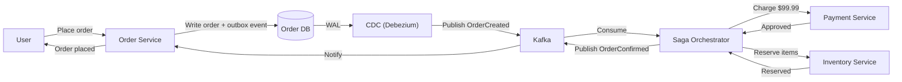

You've used this when... you ordered food delivery and watched the status go from "Placed" → "Restaurant Accepted" → "Preparing" → "Out for Delivery" → "Delivered." Behind the scenes, a half-dozen services (Orders, Payments, Restaurants, Drivers, Notifications) each update their own database. If the payment fails after the restaurant already started cooking, something has to tell the restaurant to stop and throw away that meal. That "something" is the Saga pattern.

You've also used it when you booked a flight + hotel + car on a travel site. If the flight booking succeeds but the hotel is sold out, the system must cancel the flight and refund you — without ever having a single database that knows about all three bookings. Every time you see a multi-step process recover gracefully from a failure, you're looking at a Saga in action.

You might not realize it, but every time you check an order status and see "Processing" instead of "Confirmed" for a few seconds, you're experiencing eventual consistency — the trade-off that makes all of this possible without a giant shared database.

---

# Microservices Patterns (Saga, Outbox, CQRS, Event Sourcing) – A Beginner's Guide

> This guide explains the four essential patterns that maintain data integrity when a single business process spans multiple microservices and databases.
> Every technical term is defined the first time it appears, and a full Glossary is at the end.
> Once you understand these foundations, the original advanced module will feel like a natural next step.

---

> **Before you start:** You should understand [Module 05 — Async Messaging](/Docs/05-async-messaging.md). If you haven't read that yet, start there.

## Table of Contents

1. [The Problem: A Transaction Across Services](#1-the-problem-a-transaction-across-services)
2. [Why Not Just Use a Database Transaction?](#2-why-not-just-use-a-database-transaction)
3. [The Saga Pattern: Step-by-Step with a Safety Net](#3-the-saga-pattern-step-by-step-with-a-safety-net)
4. [Choreography vs Orchestration](#4-choreography-vs-orchestration)
5. [The Transactional Outbox: Never Lose a Message](#5-the-transactional-outbox-never-lose-a-message)
6. [CQRS: Separate Reading from Writing](#6-cqrs-separate-reading-from-writing)
7. [Event Sourcing: The Immutable Ledger](#7-event-sourcing-the-immutable-ledger)
8. [Common Disasters and How to Avoid Them](#8-common-disasters-and-how-to-avoid-them)
9. [Putting It All Together — An Order Flows Through a System](#9-putting-it-all-together--an-order-flows-through-a-system)
10. [Glossary of Technical Terms](#10-glossary-of-technical-terms)
11. [Key Takeaways](#11-key-takeaways)

---
> **⏱ TL;DR — If you only learn 3 things from this module:**
> 1. **Sagas** break a multi-service transaction into small steps with compensating "undo" operations — the foundation of data consistency in microservices.
> 2. **The Transactional Outbox** prevents lost messages by writing events in the same database transaction as your business data.
> 3. **CQRS and Event Sourcing** let you optimize reads and writes independently and give you a full audit trail of every change.
---

## 1. The Problem: A Transaction Across Services

Imagine an e-commerce system with separate services for **Orders**, **Payments**, **Inventory**, and **Shipping**. When a user places an order, the system must:

1. Create the order record.
2. Charge the credit card.
3. Reserve inventory.
4. Schedule shipment.

In a monolith, this would be a single database transaction: all four steps succeed or all four fail together. But in a microservice architecture, each service has its own database. There is no "global transaction" that spans all four databases.

This is the fundamental challenge: **how do you keep data consistent across multiple services without a shared database?**

---

## 2. Why Not Just Use a Database Transaction?

Traditional **Two-Phase Commit (2PC)** is a protocol that tries to coordinate transactions across databases. But it has a fatal flaw for microservices:

**Analogy:** 2PC is like a coordinated wedding toast. The best man asks everyone to raise their glasses ("prepare"), waits for every single guest to confirm they are ready ("vote"), and only then says "cheers" ("commit"). If one guest is stuck in traffic, everyone stands there with raised glasses, unable to drink.

In database terms, those "raised glasses" are **row-level locks**. If the coordinator crashes, every participant is stuck holding locks, unable to proceed or release them. In a microservice environment, this can bring down the entire system.

This is why microservice systems have moved to **eventual consistency** — accepting that data will be briefly inconsistent but will eventually become correct.

---

## 3. The Saga Pattern: Step-by-Step with a Safety Net

A **Saga** is a sequence of local transactions. Each step updates its own service's database and then triggers the next step. Unlike 2PC, each step **commits immediately** — no locks are held across services.

The key innovation: **compensating transactions**. If step 3 fails, the system runs "undo" operations for steps 1 and 2.

**Analogy:** Imagine you book a hotel, then rent a car, then reserve a restaurant table. If the restaurant is full, you don't want to be stuck with a hotel and car but no dinner. So you undo: cancel the car rental, cancel the hotel. Each cancellation is a compensating transaction (and may have its own fees or rules).

```text
Forward: Book Hotel → Rent Car → Reserve Restaurant
                                     ↓ (FAIL)
Compensate:            ← Cancel Car ← Cancel Hotel
```

**Important:** A compensating transaction is not always a perfect inverse. If step 1 was "send confirmation email," the compensation might be "send a follow-up email saying the previous email was in error" — you cannot "un-send" an email. The compensation must leave the system in a **semantically consistent** state, not necessarily the exact previous state.

---

## 4. Choreography vs Orchestration

There are two ways to coordinate a Saga:

### Choreography (No Central Coordinator)

Each service listens for events and decides what to do next. The work flows like a bucket brigade: each person passes the bucket to the next.

```
Order Service: "OrderCreated!"
    → Payment Service: "PaymentApproved!"
        → Inventory Service: "InventoryReserved!"
            → Shipping Service: "ShipmentScheduled!"
```

**Analogy:** A bucket brigade — each person passes the bucket to the next. Nobody is directing the flow; everyone knows their role.

**Pros:** Highly decoupled, simple for linear workflows (2-4 services).
**Cons:** Workflow logic is spread across every service's event handlers. Hard to track what went wrong in a complex flow.

### Orchestration (Central Coordinator)

A single **Saga Orchestrator** tells each service what to do. The orchestrator manages the full workflow, tracks progress, and triggers compensations on failure.

**Analogy:** A film director. The director tells the actor ("action!"), the cinematographer ("roll camera!"), and the sound engineer ("record!"). If something goes wrong, the director calls "cut!" and tells everyone to reset.

**Pros:** Easy to audit, debug, and manage complex workflows. The logic is in one place.
**Cons:** The orchestrator is stateful and must track the current step. It can become a bottleneck.

| Factor | Choreography | Orchestration |
|--------|-------------|---------------|
| **Use when...** | Workflow is simple (2-4 services), linear, and you want maximum decoupling | Workflow is complex (5+ services), has branching logic (if/then/else), or requires strict auditing |
| **Don't use when...** | You need centralized error tracking, or the flow has many conditional branches | Every millisecond of latency matters and the orchestrator would become a bottleneck |
| Complexity | Low for simple flows | Moderate (orchestrator is a service) |
| Decoupling | Maximum | Services know about the orchestrator |
| Debugging | Hard (logic spread everywhere) | Easy (one place to look) |
| Best for | 2-4 services, simple linear flows | 5+ services, complex branching, strict auditing |

---

## 5. The Transactional Outbox: Never Lose a Message

A common problem in microservices is the **dual-write**: you update the database and send a message (to notify other services) in the same operation. What if the database update succeeds but the message sending fails? Or vice versa?

**Analogy:** You try to mail a letter and also update your diary. If you update your diary but the letter gets lost in the mail, you have a problem — you think you sent it, but nobody received it.

The **Transactional Outbox** pattern solves this:

1. Instead of sending the message directly, you write both the business data and the message (called an "outbox record") in the **same database transaction**.
2. A separate process (the **message relay**) reads the outbox table and sends the messages to the message broker.
3. Once a message is successfully sent, the relay marks it as sent or deletes it.

**The trick:** The outbox write and the business data write are in the same transaction, so they succeed or fail together. The message relay can be implemented by polling the database or by using **CDC (Change Data Capture)** — reading the database's write-ahead log (WAL) to see what changed, and sending those changes as messages.

---

## 6. CQRS: Separate Reading from Writing

**CQRS** stands for **Command Query Responsibility Segregation**. It means using different models for reading data and writing data.

**Analogy:** A library has two different counters:
- The **check-in counter** (write model): you return books, the librarian updates the database.
- The **search counter** (read model): you look up where a book is, using a separately maintained search index.

These are connected — when a book is checked in, the system updates both the records database and the search index — but they serve different purposes and can be optimized independently.

**Why CQRS matters in microservices:**

- **Reads and writes have different shapes.** A write might store one row, while a read might join data from five different services. With CQRS, you can create a **read model** that is pre-joined, denormalized, and optimized for the specific query.
- **Independent scaling.** You can have 10 read replicas and 1 write master.
- **Different storage.** You might write to PostgreSQL and read from Elasticsearch.

**The cost:** Eventual consistency. When you write data, the read model is updated asynchronously. There is a brief period where a read returns stale data. This is acceptable for many use cases (catalog search) but not for others (displaying the payment status after a purchase).

---

## 7. Event Sourcing: The Immutable Ledger

**Event Sourcing** means storing the state of a system as a sequence of events, rather than as the current state.

**Analogy:** A bank account. Instead of storing "current balance: $500," the bank stores every transaction: "Deposited $1000, Withdrew $200, Withdrew $300." The current balance ($500) is calculated by replaying all events.

**Why this is powerful:**

- **Full audit trail.** You know exactly what happened, in what order, and who did it. No data is ever deleted or overwritten.
- **Time travel.** You can reconstruct the state at any point in time (great for debugging).
- **Event-driven ecosystem.** The events can drive other services (the Saga pattern loves Event Sourcing).

**The cost:**

- **Complexity.** You now have two ways to access data: by replaying events (authoritative) and by reading snapshots (fast).
- **Storage.** You never delete anything. Over time, the event store grows unboundedly.
- **Schema evolution.** Old events have old schemas. Your code must handle all schema versions.

**Snapshots:** To avoid replaying millions of events every time, you periodically save a **snapshot** of the current state. To reconstruct state, you load the latest snapshot and replay only the events after it.

---
> **✏️ Check Your Understanding**
> 1. Your payment service charges a credit card, then sends a "PaymentApproved" event. The Kafka broker is temporarily down and the event is lost. Which pattern should you have used, and how would it have prevented this?
> 2. A user updates their shipping address, but the next page still shows the old address. What pattern is likely in use, and what's the simplest fix for this specific scenario?
> 3. An order saga fails at step 4 (out of 5). The system runs compensating transactions for steps 1-3, but one compensation fails because a downstream service is unreachable. What should happen next?
> <details>
> <summary>Answers</summary>
> 1. **Transactional Outbox.** The payment confirmation and the outbox record would have been written in the same database transaction. The message relay would retry sending until Kafka is back up — no event is ever lost.
> 2. **CQRS.** The read model hasn't caught up yet. The fix: for a short window after the user makes a write, serve their read from the write model (primary database) instead of the read model.
> 3. **The orchestrator must retry the compensation with exponential backoff.** If it permanently fails after exhausting retries, it should escalate to a dead-letter queue monitored by human operators.
> </details>
---

## 8. Common Disasters and How to Avoid Them

### Dual-Write Failure
**Symptom:** A service updates its database but a downstream service never receives the notification. The system is inconsistent — the order says "confirmed" but shipping was never triggered.
**Root Cause:** The service tried to do two things at once (DB write + message send) without atomicity. One succeeded, the other failed.
**Real Incident:** Many teams have experienced this during Kafka broker upgrades. A database write succeeds, but the Kafka producer times out during the broker leader election. The message is lost permanently.
**Fix:** Always use the Transactional Outbox pattern. Write the message as an outbox record in the same DB transaction as your business data.
**How to Detect Early:** Monitor the ratio of DB writes to outbox records. If they diverge, you have a dual-write bug. Alert on failed message relay deliveries.

### The Double Charge
**Symptom:** A customer is charged twice for the same order. The payment log shows two identical charges milliseconds apart.
**Root Cause:** The payment service received a charge request, charged the card, then crashed before persisting the result. On restart, it retries — but the first charge already went through.
**Real Incident:** In 2021, a major airline's booking system double-charged thousands of customers during a database failover. The payment service retried all in-flight requests after the recovery.
**Fix:** Idempotency keys. The client sends a unique key with each request. The server checks if it has already processed this key before charging.
**How to Detect Early:** Alert on duplicate payment requests with the same idempotency key within a short time window. Monitor payment retry rates.

### Saga Compensation Failure
**Symptom:** A saga is rolling back but gets stuck halfway. Some steps are compensated but others are not, leaving the system in a partially undone state.
**Root Cause:** A compensating transaction itself fails (e.g., the shipping service is down when the saga tries to cancel the shipment).
**Real Incident:** Uber's reservation system experienced this during a regional AWS outage — compensation calls to a dependent service timed out, and manual intervention was needed to reconcile the failed reservations.
**Fix:** The orchestrator must retry compensations with exponential backoff. If a compensation permanently fails after exhausting retries, escalate to a dead-letter queue for human operators.
**How to Detect Early:** Monitor the age of in-flight sagas. If a saga stays in "compensating" state for more than a few minutes, alert. Track compensation failure rates separately from forward-step failures.

### CQRS Stale Read
**Symptom:** A user updates their profile but immediately sees the old data when they refresh the page.
**Root Cause:** The read model is updated asynchronously from the write model. The read replica has not yet received the update.
**Real Incident:** At a large e-commerce company, inventory updates propagated with a 2-5 second delay. Sellers who updated stock levels would see old counts immediately after saving, causing panic. The team added a "read-your-writes" consistency layer that served recently-updated items from the write model.
**Fix:** For critical "read-your-writes" scenarios, read from the write model (primary database) for a short configurable window after the write.
**How to Detect Early:** Measure read-model staleness in milliseconds. Alert if the gap between write-commit time and read-model-update time exceeds your SLO (typically a few seconds).

---

## 9. Putting It All Together — An Order Flows Through a System



Let's trace an order through a system that uses all four patterns:

1. **User places an order.** The Order Service writes the order and an outbox event ("OrderCreated") in the same database transaction (Transactional Outbox).

2. **Message relay picks up the event.** Debezium (CDC) reads the database WAL and publishes "OrderCreated" to Kafka.

3. **The Saga Orchestrator receives the event** and begins orchestrating the order fulfillment saga:
   - Tells Payment Service: "Charge $99.99" (the Payment Service uses idempotency keys).
   - Payment Service responds: "Approved" (or "Declined" → orchestrator starts compensations).

4. **Orchestrator tells Inventory Service:** "Reserve items." Inventory responds: "Reserved."

5. **Orchestrator tells Shipping Service:** "Schedule delivery." Shipping responds: "Scheduled."

6. **Orchestrator marks the saga as complete.** It writes to the read model (CQRS) so the search and display systems see the updated order status.

7. **The read model eventually catches up.** If a user checks the order status immediately, they might see "processing" (Eventual Consistency). A few seconds later, it shows "confirmed" (convergence).

8. **If any step fails at any point,** the orchestrator runs compensating transactions: cancel the charge, release inventory, cancel the shipment.

The system never holds locks across services. Each step commits independently. If something fails, compensations undo the damage. And every event is durably recorded for auditing.

---
> **🧪 Conceptual Exercises**
> 1. Design a ride-sharing trip lifecycle as a Saga. A trip goes through: Rider requests → Driver assigned → Ride started → Payment charged → Ride completed. What happens if the driver cancels after being assigned? Which pattern (choreography vs orchestration) would you choose and why?
> 2. Your team runs a notification service that sends emails for "Order Shipped," "Payment Received," and "Account Created." Currently, each service directly calls the notification API. You've started losing notifications during traffic spikes. How would you redesign this using the patterns from this module?
> <details>
> <summary>Hints</summary>
> 1. Think about which services need to be notified and which compensations are needed for each step. Consider whether the flow is linear or branching — this determines choreography vs orchestration.
> 2. The dual-write problem is the key insight here. Notifications are messages that must not be lost. Which pattern guarantees message delivery? Also consider separating the notification read model from the write model.
> </details>
---

## 10. Glossary of Technical Terms

| Term | Definition | Section |
|------|------------|---------|
| **2PC (Two-Phase Commit)** | A protocol for atomic transactions across multiple databases. Blocking — rarely used in microservices. | 2 |
| **Eventual Consistency** | A model where data may be briefly inconsistent but will converge over time. | 2 |
| **Saga** | A sequence of local transactions with compensating transactions for rollback. | 3 |
| **Compensating Transaction** | An operation that undoes the business effect of a previous step in a Saga. | 3 |
| **Choreography** | A Saga style where each service decides independently based on events, with no central coordinator. | 4 |
| **Orchestration** | A Saga style with a central coordinator that manages the workflow. | 4 |
| **Dual-Write** | The problem of updating two systems (DB + message broker) atomically without a distributed transaction. | 5 |
| **Transactional Outbox** | The pattern of writing business data + outgoing messages in one DB transaction. | 5 |
| **Outbox** | A database table where messages are written atomically with business data for reliable delivery. | 5 |
| **Message Relay** | A process that reads outbox records and publishes them to a message broker. | 5 |
| **CDC (Change Data Capture)** | Reading a database's transaction log to detect and publish changes as events. | 5 |
| **WAL (Write-Ahead Log)** | The append-only log in a database that records every change before applying it. Used by CDC tools. | 5 |
| **CQRS (Command Query Responsibility Segregation)** | Separating the models used for reading data and writing data. | 6 |
| **Read Model** | A denormalized, optimized view of data for querying (in CQRS). | 6 |
| **Event Sourcing** | Storing state as a sequence of immutable events rather than as the current state. | 7 |
| **Snapshot** | A saved copy of state at a point in time, used to avoid replaying all events. | 7 |
| **Idempotency** | The property that an operation can be repeated safely without changing the result. | 8 |
| **Idempotency Key** | A unique identifier that lets a server detect and skip duplicate operations. | 8 |

---

## 11. Key Takeaways

1. **Distributed transactions (2PC) do not scale.** Locks held across services during a crash can bring down the system.
2. **Sagas break a large transaction into small, independent steps** with compensating transactions for rollback.
3. **Compensating transactions are not database rollbacks** — they are business operations that undo the effect (e.g., "send cancellation email" vs. "un-send email").
4. **Choreography is simpler for linear workflows** (2-4 services). Orchestration is better for complex flows with auditing needs.
5. **The Transactional Outbox solves the dual-write problem** — write business data and message in one DB transaction.
6. **CDC (Debezium) is more reliable than polling** for reading the outbox — it does not put extra load on the database.
7. **CQRS lets you optimize reads and writes independently** — different models, different storage, different scaling.
8. **Event Sourcing provides full auditability** — every change is recorded as an immutable event. State is derived by replay.
9. **Snapshots prevent unbounded replay** — combine the latest snapshot with events after it.
10. **Idempotency is the foundation of safe retries.** Always use idempotency keys for payment-like operations.
11. **Eventual consistency is a trade-off:** better scalability and availability, but you must handle stale reads gracefully.
12. **The four patterns work together:** Saga for orchestration, Outbox for reliable messaging, CQRS for read/write separation, Event Sourcing for the audit trail.
13. **Not every microservice needs all four patterns** — start with Sagas and Outbox, then add CQRS and Event Sourcing only when you have a concrete need (complex queries or audit requirements).
14. **Test your compensating transactions regularly** — they run less often than forward steps in production, making them more likely to fail when you actually need them. Run "chaos" tests that trigger compensations to verify they work.

---

> Once you're comfortable with these concepts, dive deeper in the [advanced companion module](09-microservices-patterns-advanced.md), where we dissect Saga orchestration state machines, CDC internals with Debezium, CQRS projection optimization, and production failure postmortems from FAANG-scale systems.
> Remember: strong consistency is a luxury of the monolith. In distributed systems, you design for eventual consistency and handle the edge cases explicitly.
