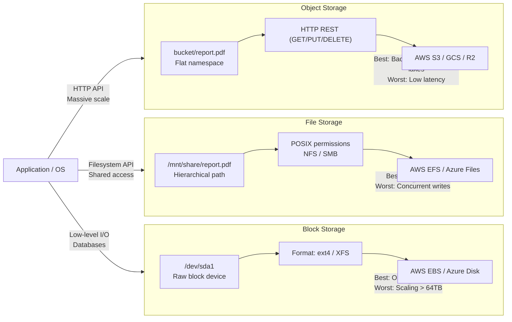

# Distributed Storage Systems: From GFS to S3 Internals

*As a Principal Infrastructure Storage Engineer at AWS, I've designed and operated storage systems spanning hundreds of thousands of disks across global regions. This module breaks down how block, file, and object storage actually work at planetary scale — the sharding mechanics, the durability math, and the failure modes that keep storage engineers awake at night.*

> **Prerequisites:** This module assumes you have read the beginner-friendly [Module 10 guide](10-storage-systems.md) and understand the basic differences between block, file, and object storage. You should also understand [Module 03 — Caching & Memory](03-caching-memory.md).

---

## Table of Contents

1. [Storage Typologies Compared](#1-storage-typologies-compared)
2. [Object Storage Sharding Mechanics](#2-object-storage-sharding-mechanics)
3. [Concurrency & Consistency Models](#3-concurrency--consistency-models)
4. [Real-World Failure Modes](#4-real-world-failure-modes)
5. [Teacher's Corner](#5-teachers-corner)
6. [Glossary of Key Terms](#6-glossary-of-key-terms)
7. [Key Takeaways](#7-key-takeaways)

---

## 1. Storage Typologies Compared



### Block Storage (SAN/EBS)

Block storage exposes raw logical volumes (LUNs) over a fabric (Fibre Channel, iSCSI, or NVMe-oF). The OS sees a raw disk — it formats it with a filesystem (ext4, XFS, NTFS) and manages allocation.

**Latency profile:** 100µs–1ms for SSD-backed EBS. NVMe-oF can reach 10µs.

**Use case:** Databases. PostgreSQL, MySQL, and Oracle depend on block storage because they manage their own buffer pool, flush strategy, and page layout. They need direct control over which blocks are written and when.

**Limitation:** A single EBS volume caps at 64 TB and 260,000 IOPS (io2 Block Express). To exceed this, you must shard the database or use a distributed filesystem on top of block storage.

### File Storage (NAS/EFS)

File storage adds a metadata server that maintains the directory tree (inodes, dentries, permissions). Clients mount the filesystem via NFS or SMB.

**Latency profile:** 1–10ms (metadata server adds overhead).

**Use case:** Shared access patterns — CI/CD artifacts, home directories, media editing where multiple workstations need the same files.

**Bottleneck:** The metadata server. Google's original GFS paper measured metadata server throughput at about 10,000 operations per second. With millions of files, directory listings (`ls`) would take minutes. Every file create, rename, or delete requires a metadata server transaction.

**Parallel NFS (pNFS) – NFSv4.1:** Separates metadata from data. The metadata server provides a layout (file → block locations), and clients read/write directly to the storage nodes in parallel. This eliminates the metadata bottleneck for data operations but not for namespace operations.

### Object Storage (S3): Why Flat Scaling Wins

Object storage eliminates the hierarchical namespace. Every object is identified by a flat key. The mapping from key to storage location is computed by a distributed hash table (consistent hashing or CRUSH), not a central metadata server.

**Latency profile:** 10–100ms (HTTP overhead, but no metadata server).

**Why flat wins:** In a hierarchical filesystem, the metadata server must traverse the directory tree to resolve `/a/b/c/object`. In object storage, the key `/a/b/c/object` is hashed directly to a placement group. No directory traversal is needed. This is why object storage scales to exabytes while file storage requires massive metadata infrastructure.

**CRUSH (Controlled Replication Under Scalable Hashing):** Ceph's data placement algorithm. Instead of maintaining a central mapping table (like GFS's master), CRUSH computes the target OSDs using a hash of the object ID and the cluster topology. Any client can compute where an object lives without consulting a central server.

```
Object "photos/2024/12345.jpg"
    ↓ hash(object_id, placement_group_count)
    Placement Group PG_42
    ↓ CRUSH(PG_42, cluster_map)
    OSD_7, OSD_12, OSD_23  ← 3 replicas
```

No central lookup. The cluster map is distributed to all clients. This eliminates the master bottleneck entirely — the key insight that makes Ceph and later object stores truly scale.

---

## 2. Object Storage Sharding Mechanics

### Hashing Objects to Placement Groups

An object store divides its namespace into Placement Groups (PGs) — logical containers that hold a set of objects. Each object is assigned to a PG via:

```
pg_id = hash(object_key) % num_pgs
```

The PG is then mapped to a set of OSDs (Object Storage Daemons) — the physical disks that store the data. In Ceph, this mapping is computed by CRUSH.

**Why not hash directly to OSDs?** If you hash directly to OSDs, adding or removing a disk changes the hash function for all objects. By inserting an indirection layer (PGs), the mapping from object→PG is fixed (deterministic by key). Only the PG→OSD mapping changes when disks are added or removed. The number of PGs is typically 100–200 per OSD, giving fine-grained rebalancing.

### Erasure Coding vs Replication: The Math

**3x Replication:** Store 3 copies of every object. Storage overhead: 200% (3× data). Durability: survive 2 simultaneous failures for any read.

**Erasure Coding (4+2):** Split object into 4 data chunks + 2 parity chunks. Store on 6 OSDs. Storage overhead: 50% (1.5× data). Durability: survive any 2 OSD failures.

**Cost comparison for 1 PB of usable data:**

| Scheme | Raw Storage | Overhead | Disk Cost (5yr, $10/TB) |
|--------|------------|----------|------------------------|
| 3x Replication | 3 PB | 200% | $30,000 |
| 4+2 EC | 1.5 PB | 50% | $15,000 |
| 8+3 EC | 1.375 PB | 37.5% | $13,750 |

**Recovery bandwidth comparison (failed 10 TB disk):**

| Scheme | Data to Read | Network Time (10 Gbps) |
|--------|-------------|----------------------|
| 3x Replication | 10 TB (copy from 1 replica) | 8,000 sec ≈ 2.2 hours |
| 4+2 EC | 7 × 2.5 TB = 17.5 TB (read all shards, recompute) | 14,000 sec ≈ 3.9 hours |

Erasure coding saves 50–62% on storage but takes 1.8× longer to recover. This is why hot data uses replication (fast recovery) and cold data uses EC (cheap storage, slower recovery).

### When to Use Each

| Factor | Replication | Erasure Coding |
|--------|------------|----------------|
| Storage overhead | 200% (3x) | 37.5–50% |
| Recovery speed | Fast (copy from replica) | Slow (read all shards + recompute) |
| Write cost | Write N replicas | Compute parity + write N+M shards |
| Read optimization | Read any replica (low latency) | Read all shards for degraded reads |
| Best for | Hot/frequently accessed data | Cold/archival data |

Facebook's f4 (Cold Storage) published at USENIX ATC 2014: Facebook moved unreplicated "warm" blobs from replication to Reed-Solomon erasure coding (10+4) saving 50% of storage cost. Their warm blob storage dropped from 3 copies to 1.4 copies effective.

---

## 3. Concurrency & Consistency Models

### GFS Concurrent Appends

Google File System (GFS) paper (SOSP 2003) introduced atomic record append. Multiple clients can append to the same file concurrently. The client sends data to the primary replica, which assigns a sequential offset and notifies secondaries. If any secondary fails, the primary reports failure to the client. The client retries.

**Consistency model:** Relaxed. After a concurrent append, the region of the file between the client's recorded offset and the actual end may contain undefined data or padding. GFS calls this "defined but inconsistent" — the data is there but its boundaries are not guaranteed.

**Why relaxed?** Strict ordering would require a distributed lock per append. GFS was designed for Google's web crawl and indexing pipeline (large, append-only files, thousands of workers). Relaxed consistency was an explicit trade-off for throughput.

### Object Storage Immutability

Object storage takes the opposite approach: overwrite the entire object. There is no "append to an object" operation (S3 does not support it natively). To update, you PUT a new version of the entire object.

**Versioning:** Instead of modifying in place, S3's versioning model creates a new version on every PUT, DELETE creates a delete marker. Old versions are retained and accessible via `versionId`.

```
PUT /photos/123.jpg  →  version_id: abc123
PUT /photos/123.jpg  →  version_id: def456  (new version)
GET /photos/123.jpg  →  latest version (def456)
GET /photos/123.jpg?versionId=abc123  →  original version
```

**Consistency model for S3:** Read-after-write consistency for PUT of new objects. Eventual consistency for overwrite PUT and DELETE. This means: if you PUT an object, you can immediately GET it. But if you overwrite it, you might see the old version for a short window.

**GFS vs Object Storage trade-off:**

| Dimension | GFS | Object Storage (S3) |
|-----------|-----|---------------------|
| Write granularity | Append records | Overwrite whole object |
| Consistency | Relaxed (append) | Read-after-write (new), Eventual (overwrite) |
| Concurrency | Multiple appenders | Single writer per key |
| Use case | Large sequential pipelines | Independent key-value access |

---

## 4. Real-World Failure Modes

### Bit Rot — Silent Data Corruption

**Scenario:** A cosmic ray flips a bit on a disk platter. The data is now corrupted but no hardware error is reported (the disk's ECC failed to correct the multi-bit error). Three years later, a customer downloads their photo and finds a single corrupted pixel. They don't notice until a photo album export reveals the artifact.

**Reality:** At petabyte scale, bit rot is a daily occurrence. Backblaze's 2023 drive failure report shows enterprise drives have ~1 unrecoverable read error per 10^15 bits read. At 1 PB of data read per day, that's ~8 bit errors per day.

**Defense in depth:**

1. **Per-64KB block checksums:** Every data block has a CRC32 or SHA-256 checksum stored separately from the data. On every read, the system recomputes the checksum and compares.
2. **Background scrubbing:** A background process reads all data periodically (e.g., once per week), verifying checksums. Corrupted blocks are reconstructed from replicas or EC parity.
3. **Repair on scrub:** When corruption is found, the corrupted block is replaced with a fresh copy from a healthy replica.

**AWS S3 implementation:** Checksums per object, background scrubbing of all data, automatic repair within 15 minutes of detection. This is why S3 claims 99.999999999% durability — it actively repairs bit rot before you ever read the corrupted data.

### Hot-Spotting — The Shared Prefix Problem

**Scenario:** Your photo-sharing app stores objects with keys like `photos/2024/03/01/{photo_id}.jpg`. All photos from March 1 share the prefix `photos/2024/03/01/`. S3's internal partitioning places objects with similar prefixes on the same partition. When a celebrity uploads 10,000 photos in one day (all with the same date prefix), that partition becomes hot and you get `503 Slow Down` errors.

**Root cause:** S3 uses key prefix as an internal partition boundary. Contiguous key ranges map to the same partition. Sequential keys create hot partitions.

**Mitigations:**

1. **Hash the prefix:** Instead of `photos/{date}/{id}`, use `photos/{hash(id)[:4]}/{date}/{id}`. The first 4 hex characters of the hash spread objects across 65,536 prefixes.
2. **Reverse the key:** `photos/2024/03/01/{id}.jpg` → `photos/{id_reversed}/2024/03/01/{id}.jpg`. Objects with sequential IDs get different prefixes.
3. **Increase replication factor:** For known hot keys, increase from 3 to 5 replicas to distribute read load.
4. **CDN in front:** Cache hot objects at the edge. CloudFront or Cloudflare caches the celebrity's photos and absorbs the read load.

**Detection:** Monitor `SlowDown` (503) error rates from S3. Alert when any prefix exceeds 5,000 PUTs/second or 15,000 GETs/second (S3's partition limits).

### Recovery Bandwidth Saturation

**Scenario:** A 10 TB disk fails in a 100-OSD Ceph cluster with 4+2 erasure coding. The system must read 7 × ~2.5 TB from 7 different OSDs, recompute the missing shards, and write the reconstructed shards to a replacement OSD. Total: ~17.5 TB read, ~2.5 TB write. At 10 Gbps per OSD, with network contention from production traffic: estimated recovery time is 8+ hours.

**Risk:** During those 8 hours, the cluster has reduced redundancy. If a second disk in the same PG fails, data loss occurs.

**Mitigation:**

1. **Minimize recovery impact:** Limit recovery bandwidth to 50% of aggregate network capacity. Yes, it makes recovery slower, but it prevents production traffic from being starved.
2. **Priority-based recovery:** Recover the most critical PGs first (those with the fewest remaining replicas).
3. **Predict failure zones:** If disks in the same server/shelf are failing (correlated failure), recover from a different failure zone first.

**Formula for recovery time:**

```
Recovery Time = Data to Reconstruct / (Recovery Bandwidth × Parallelism)
```

At Facebook, with their f4 cold storage system, a 10 TB SSD failure in a 100-node cluster with parallel recovery from 50 nodes at 440 MB/s each would complete in about 23 minutes — 91 parallel tasks reading 12 GB each.

---

## 5. Teacher's Corner

### Question 1: 10 Billion Small Files — Metadata Bottleneck

**Problem:** A container registry stores 10 billion small files (~10 KB each) on an NFS filesystem. File creates take 500ms, directory listings timeout, and the metadata server has 64 GB of RAM. Diagnose the problem and propose a storage architecture that would solve it.

**Solution:** Each file's inode consumes ~512 bytes of metadata. 10 billion files × 512 bytes = 5 TB of metadata. The metadata server only has 64 GB RAM → the inode cache overflows, causing disk swap on every metadata operation. Each create/lookup requires a disk read for the inode.

**Fix:** Replace NFS with object storage. Object storage has no inodes, no directory tree, no per-file metadata server overhead. The mapping from key to storage is computed via CRUSH hashing — O(1) per lookup regardless of total object count. Container registries like Docker Hub use S3-compatible object storage for this exact reason.

### Question 2: 600 GB Chunk Server Recovery Time

**Problem:** A GFS chunk server with 600 GB of data crashes. The chunks are 64 MB each. Replication factor is 3. Cluster network bandwidth: 10 Gbps. How long to fully recover the chunk data on a replacement server?

**Solution:** Each 64 MB chunk exists on 2 other replicas. Recovery needs to copy 600 GB from peer chunk servers.

```
Raw data to copy: 600 GB
Network bandwidth: 10 Gbps = 1.25 GB/s
Theoretical minimum: 600 GB / 1.25 GB/s = 480 seconds = 8 minutes
With 50% network utilization (competing production traffic): 16 minutes
With 91 parallel tasks reading from 91 different source servers (each at 440 MB/s):
  600 GB / (91 × 440 MB/s) = 600 GB / 40 GB/s ≈ 15 seconds
```

However, the bottleneck is usually the destination server's write bandwidth, not the network. A single HDD writes at ~200 MB/s. A single SSD at ~1 GB/s. The realistic recovery time is determined by the replacement server's write throughput, not the network.

### Question 3: 72 PB Erasure Coding Cost Savings

**Problem:** A data lake stores 72 PB of usable data. Currently using 3x replication. The team proposes switching to 8+3 erasure coding. Calculate the raw storage savings and the dollar cost savings at $10/TB/month for hardware.

**Solution:**

**Current — 3x Replication:**
Raw storage needed: 72 PB × 3 = 216 PB
Monthly cost: 216,000 TB × $10 = $2,160,000/month

**Proposed — 8+3 Erasure Coding:**
Each 8 data chunks + 3 parity = 11 chunks total
Overhead factor: 11/8 = 1.375
Raw storage needed: 72 PB × 1.375 = 99 PB ≈ 100 PB
Monthly cost: 100,000 TB × $10 = $1,000,000/month

**Savings:**
Raw storage: 216 PB → 100 PB = 116 PB saved (54% reduction)
Monthly cost: $2,160,000 → $1,000,000 = $1,160,000/month saved
Annual savings: ~$13.9 million

**Trade-off:** Recovery time increases from ~2.2 hours (replication) to ~4+ hours (EC). Degraded reads require reading all 11 shards instead of 1 replica. Cost savings justify the trade-off for cold data.

---

## 6. Glossary of Key Terms

| Term | Section | Definition |
|------|---------|------------|
| Block Storage | 1 | Raw storage volumes (LUNs) exposed over SAN fabric, formatted with a filesystem by the OS |
| File Storage | 1 | Hierarchical storage with a metadata server managing inodes, directories, and permissions |
| Object Storage | 1 | Flat key-value storage over HTTP, scales to exabytes via distributed hash tables |
| CRUSH | 1 | Ceph's data placement algorithm that computes OSD locations from object hashes, no central lookup |
| Placement Group (PG) | 2 | Logical container in Ceph that maps a set of objects to a set of OSDs |
| OSD | 1 | Object Storage Daemon — the process managing physical disks in Ceph |
| Erasure Coding | 2 | Splitting data into K data + M parity chunks, surviving any M failures with ~K/M/K overhead |
| Reed-Solomon | 2 | The specific erasure coding algorithm used in storage systems (same as QR code recovery) |
| Bit Rot | 4 | Gradual data corruption from cosmic rays, media degradation, or latent sector errors |
| Scrubbing | 4 | Background process that reads all data, verifies checksums, and repairs corruption |
| Hot-Spotting | 4 | Concentrated access on a small set of storage partitions causing throughput bottlenecks |
| Atomic Record Append | 3 | GFS operation allowing multiple clients to append to the same file concurrently |
| pNFS | 1 | Parallel NFS that separates metadata from data for direct client-to-storage access |
| NVMe-oF | 1 | NVMe over Fabrics — low-latency block storage protocol over RDMA or TCP |

---

## 7. Key Takeaways

1. **Block = low latency, single-attach. File = shared hierarchy, metadata bottleneck. Object = flat, exabyte-scale.** Choose by access pattern.

2. **CRUSH eliminates the central metadata bottleneck** by computing placement from object hashes and the cluster topology. This is the key insight that makes object storage scale.

3. **Placement Groups are an indirection layer** that keeps object→PG mapping stable while PG→OSD mapping updates as disks are added/removed. This enables fine-grained rebalancing.

4. **Erasure coding saves 50–62% storage cost over 3x replication** but increases recovery time by ~1.8×. Use replication for hot data, EC for cold data.

5. **GFS's atomic record append enabled concurrent writers** with relaxed consistency. Object storage's immutability gives stronger per-key semantics at the cost of no concurrent append.

6. **Bit rot requires layered defenses:** per-block checksums, background scrubbing, and automatic repair. Without these, petabyte-scale systems lose data silently.

7. **Hot-spotting is a key prefix problem.** Hash your keys, reverse them, or add a CDN to distribute load across partitions.

8. **Recovery bandwidth is a first-class constraint.** The math: recovery time = data_size / (parallelism × per-node bandwidth). Plan for correlated failures.

9. **Metadata server RAM is the hard limit in file storage.** At 10 billion files, inode overhead exceeds any practical server memory. Object storage avoids this entirely.

10. **Cost calculations must include durability guarantees.** Factor in replication/EC overhead, recovery bandwidth, and scrubbing costs. The cheapest storage scheme that meets your durability SLO is the correct one.

---

> This guide provides the advanced engineering depth for distributed storage systems.
> For the foundational concepts, refer to the beginner-friendly [Module 10 guide](10-storage-systems.md).
> Remember: at exabyte scale, every assumption about hardware reliability is wrong — design for continuous failure.

---

*Ready to proceed? Continue to [Module 11 — Stream Processing Advanced](11-stream-processing-advanced.md).*
