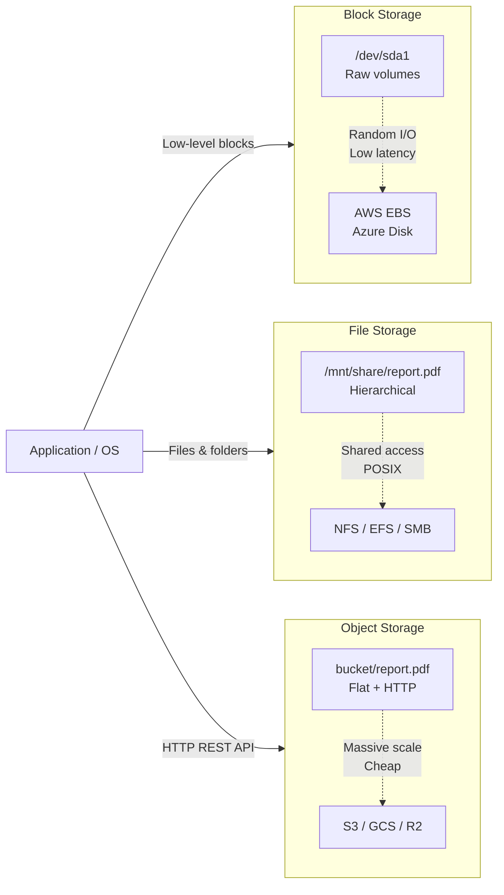

You've used this when... you uploaded a photo to Instagram, shared a Google Doc with a teammate, or installed a game on your PC. Each of those actions hits a different storage system, and the wrong choice would make the experience painfully slow or impossibly expensive.

That photo upload goes to object storage (AWS S3) — a warehouse-sized system that stores billions of photos, each accessible via a simple URL. That Google Doc lives on file storage — a shared network drive that multiple people can edit simultaneously, with folders and permissions. And that game installation? It's running on block storage — the same raw, high-speed technology that powers every database on the planet.

You interact with all three storage types every day without realizing it. Understanding the difference between them is the key to designing systems that are fast, scalable, and cost-effective.

---

# File, Object & Block Storage – A Beginner's Guide

> This guide explains the three fundamental ways computers store data — block, file, and object storage — and when to use each one.
> Every technical term is defined the first time it appears, and a full Glossary is at the end.
> Once you understand these foundations, the original advanced module will feel like a natural next step.

---

> **Before you start:** You should understand [Module 02 — Database Scaling](/Docs/02-database-scaling.md) and [Module 03 — Caching & Memory](/Docs/03-caching-memory.md). If you haven't read those yet, start there.

## Table of Contents

1. [The Three Storage Paradigms](#1-the-three-storage-paradigms)
2. [Block Storage: The Numbered Lockers](#2-block-storage-the-numbered-lockers)
3. [File Storage: The Library with a Librarian](#3-file-storage-the-library-with-a-librarian)
4. [Object Storage: The Barcode Warehouse](#4-object-storage-the-barcode-warehouse)
5. [Which One Should You Pick?](#5-which-one-should-you-pick)
6. [Consistent Hashing: Distributing Data Evenly](#6-consistent-hashing-distributing-data-evenly)
7. [Erasure Coding: Save Space, Survive Failures](#7-erasure-coding-save-space-survive-failures)
8. [Bit Rot: Data Decays Over Time](#8-bit-rot-data-decays-over-time)
9. [Common Disasters and How to Avoid Them](#9-common-disasters-and-how-to-avoid-them)
10. [Putting It All Together — A Photo App's Storage Strategy](#10-putting-it-all-together--a-photo-apps-storage-strategy)
11. [Glossary of Technical Terms](#11-glossary-of-technical-terms)
12. [Key Takeaways](#12-key-takeaways)

---
> **⏱ TL;DR — If you only learn 3 things from this module:**
> 1. **Block, file, and object storage optimize for different things:** block = speed, file = hierarchy, object = scale. Choose based on how you access the data.
> 2. **Consistent hashing and erasure coding** are the superpowers that let object storage scale to exabytes while surviving disk failures with minimal overhead.
> 3. **Bit rot is real** at scale — always use checksums and background scrubbing to detect and repair silent data corruption.
---

## 1. The Three Storage Paradigms

Imagine you need to organize a large collection of items. You have three options:

| Type | Analogy | Best for |
|------|---------|----------|
| **Block storage** | Numbered lockers — fast access, but you need to know the exact locker number | Databases, high-performance applications |
| **File storage** | Library with a catalog and a librarian — hierarchical folders, shared access | Shared files, home directories, media editing |
| **Object storage** | Warehouse with barcodes — flat, massive scale, accessible via HTTP | Backups, data lakes, static web assets |

Each type has a different trade-off between speed, scalability, and cost. The right choice depends on what you are storing and how you access it.

---

## 2. Block Storage: The Numbered Lockers

Block storage is the closest to how physical hard drives work. The storage is divided into **blocks** (chunks of raw bytes, typically 512 bytes to 4 KB). Each block has an address, and the operating system reads and writes blocks by their address.

**Analogy:** A wall of numbered lockers. You open locker #42, put stuff in, close it. Fast, simple, and you can access any locker directly. But you must know the exact locker number — there is no "search by content."

**Real-world examples:** AWS EBS (Elastic Block Store), iSCSI drives, local SSDs.

**Pros:**
- Extremely fast for random reads and writes.
- Low latency (microseconds to milliseconds).

**Cons:**
- Cannot be easily shared between multiple servers (one server at a time).
- Limited size (a single volume can only be so large).

**Used by:** Databases like PostgreSQL and MySQL. They need fast, low-latency access to specific blocks.

---

## 3. File Storage: The Library with a Librarian

File storage adds a **metadata server** that keeps track of a directory tree — folders, filenames, permissions, and which blocks belong to which file.

**Analogy:** A library with a Dewey Decimal System and a librarian. You say, "I need the book in `/science/physics/quantum.txt`". The librarian looks up the catalog, finds which shelf the book is on, and retrieves it. You never need to know the exact shelf number.

**Real-world examples:** NFS (Network File System), SMB/CIFS (Windows file sharing), AWS EFS (Elastic File System).

**Pros:**
- Hierarchical, human-friendly organization.
- Can be mounted and accessed by many servers simultaneously.
- Familiar interface (files and folders).

**Cons:**
- The metadata server can become a bottleneck at massive scale.
- Slower than block storage because every operation goes through the file system layer.

**Used by:** Shared home directories, media editing teams, analytics datasets.

---

## 4. Object Storage: The Barcode Warehouse

Object storage strips away the folder hierarchy entirely. There are no directories — just a flat pool of **objects**. Each object has a unique key (like a barcode), the data (the bytes), and metadata (tags and attributes). You access objects via HTTP (REST API).

**Analogy:** A warehouse where every item gets a unique barcode. To find something, you do not browse shelves — you scan the barcode, and the system uses a lookup map (consistent hashing) to figure out which aisle contains it.

**Real-world examples:** AWS S3, Azure Blob Storage, Google Cloud Storage.

**Pros:**
- Exabyte-scale — limited only by total cluster capacity.
- Accessible via HTTP from anywhere.
- Cheaper than block or file storage for bulk data.

**Cons:**
- Cannot modify a single byte — you must rewrite the entire object.
- Higher latency than block storage (tens to hundreds of milliseconds).

**Used by:** Backups, data lakes, static websites, user-uploaded content (photos, videos).

---

## 5. Which One Should You Pick?

Here is a simple decision tree:

1. **Is sub-millisecond latency critical?** → **Block Storage** (databases, trading systems)
2. **Do you need shared access with folders?** → **File Storage** (team files, home directories)
3. **Is massive scale or geo-distribution needed?** → **Object Storage** (data lakes, backups, media)
4. **On a budget and accessing sequentially?** → **Object Storage** (archives, logs)

| Approach | Use when... | Don't use when... |
|----------|-------------|-------------------|
| **Block Storage** | You need sub-millisecond random I/O for databases, trading systems, or any application with strict latency requirements | You need to share data across multiple servers, or you're storing mostly sequential bulk data |
| **File Storage** | Multiple users/servers need shared access to the same files with a familiar folder hierarchy, or you're building a media editing workflow | You need exabyte-scale, or your workload is mostly random reads/writes with strict latency requirements |
| **Object Storage** | You need massive scale (petabytes+), geo-distribution, cheap archival, or HTTP-accessible static assets | You need to modify a single byte without rewriting the entire object, or you need sub-millisecond latency |

**Real-world example:** A photo-sharing app uses **all three**:
- PostgreSQL runs on **block storage** (needs fast, random reads/writes).
- The team shares analytics CSVs over **file storage** (shared access).
- User-uploaded photos go to **object storage** (massive scale, accessed via URL).

---

## 6. Consistent Hashing: Distributing Data Evenly

When you have many storage servers, you need to decide which server stores which data. The simplest approach would be: `server = hash(key) % N`. But if you add a server (N becomes N+1), almost every key maps to a new server — you would have to move almost all your data.

**Consistent hashing** solves this. Imagine a ring (circle) with many points. Both servers and data keys are placed on this ring. A key belongs to the first server you encounter going clockwise.

- When you **add a server**, it appears on the ring and takes over only the keys in its small arc. Most keys stay where they were.
- When you **remove a server**, only its keys need to be redistributed.

**Virtual nodes:** Each physical server gets many small points on the ring (e.g., 128 virtual nodes). This ensures even load distribution, especially when servers have different capacities (stronger servers get more virtual nodes).

---

## 7. Erasure Coding: Save Space, Survive Failures

To protect against disk failures, you could store 3 copies of every piece of data (3x replication). That uses 3x the storage space. **Erasure coding** achieves the same protection with far less overhead.

**How it works:** Split the data into `k` chunks. Then compute `m` additional parity chunks using math. You can lose up to `m` chunks and still reconstruct the original data from the remaining `k` chunks.

**Analogy:** "In case I lose this page, here are 4 clues to reconstruct it" — you only need some of the clues, not all of them.

**Example:** 4+2 erasure coding (k=4, m=2):
- Split a file into 4 data chunks.
- Compute 2 parity chunks (total 6 chunks, stored on 6 different servers).
- You can lose any 2 servers and still recover the file.
- Overhead: only 50% (6/4 = 1.5x), compared to 200% for 3x replication.

| Method | Overhead | Can Lose |
|--------|----------|----------|
| 3x replication | 200% | 2 copies |
| 4+2 erasure coding | 50% | 2 chunks |
| 8+3 erasure coding | 37.5% | 3 chunks |

**Trade-off:** Erasure coding uses more CPU (to compute parity) and is slower for recovery than simple replication. Use replication for hot (frequently accessed) data, erasure coding for cold (archival) data.

| Approach | Use when... | Don't use when... |
|----------|-------------|-------------------|
| **Replication** | Data is frequently accessed ("hot"), recovery speed is critical, or CPU is scarce | Storage cost is your primary concern, or you're storing petabytes of cold data |
| **Erasure Coding** | Storage cost matters (archives, backups, data lakes), or you're storing petabytes of cold data | You need to serve data with very low latency, or recovery speed is the top priority |

---

## 8. Bit Rot: Data Decays Over Time

**Bit rot** (also called data degradation) is the gradual corruption of data on storage media. Bits can flip spontaneously due to cosmic rays, manufacturing defects, or simple wear over time. While the probability is low (about 1 in 10^15 bits read for enterprise drives), at petabyte scale, it becomes a daily occurrence.

Storage systems protect against bit rot by:
- **Checksums:** Every chunk of data has a checksum stored separately. When the data is read, the system recomputes the checksum and compares it. If they do not match, the data is corrupted.
- **Background scrubbing:** The system periodically reads all data, checks the checksums, and repairs any corruption using the redundant copies or erasure coding parity.
- **Self-healing:** When corruption is detected, the corrupted chunk is replaced with a fresh copy reconstructed from the remaining data.

AWS S3, for example, does this automatically. If you store a file and retrieve it years later, S3 will detect and repair any bit rot during the background scrub, returning your data intact.

---
> **✏️ Check Your Understanding**
> 1. You're designing storage for a video surveillance system that writes 10,000 camera feeds continuously. Each feed appends data sequentially. Which storage type would you choose and why?
> 2. Your database on block storage is running out of space. You add more SSDs, but now the database cannot use them — it was configured with a single volume size limit. What storage concept did you overlook?
> 3. A disk fails in your 100-server storage cluster. Data starts rebuilding from the remaining servers. Halfway through, a second disk fails. The cluster loses data permanently. What two concepts could have prevented this?
> 

> 
Answers

> 1. **Object Storage.** Writes are sequential (append-only), scale is massive, and you never modify existing footage. Block storage would be overkill and expensive; file storage's metadata server would bottleneck at 10,000 concurrent streams.
> 2. **Block storage has limited volume sizes.** You need to either provision a larger block device (striping across multiple physical disks at the storage layer) or switch to a storage type that pools capacity transparently (object storage).
> 3. **Erasure coding** (to survive multiple simultaneous failures with less overhead) and **recovery bandwidth planning** (to minimize the window of vulnerability by controlling how fast data rebuilds).
> 

---

## 9. Common Disasters and How to Avoid Them

### Choosing the Wrong Storage Type
**Symptom:** Your database runs slowly on what you thought was adequate storage. Or your file share cannot handle the number of users. Or your object store cannot serve data fast enough.
**Root Cause:** You matched the wrong storage paradigm to the access pattern. File storage lacks the random I/O speed of block storage. Object storage cannot do byte-level modifications. Block storage cannot be easily shared.
**Real Incident:** Netflix's early CDN used file storage for serving video chunks. The metadata server became a bottleneck at scale, causing buffering during peak hours. They eventually moved to object storage with a CDN layer.
**Fix:** Match access pattern to storage type: block for low-latency random I/O, file for shared hierarchical access, object for massive-scale sequential access.
**How to Detect Early:** Measure your workload's I/O profile (random vs sequential read/write ratio, concurrency, latency requirements) before provisioning. Monitor latency percentiles (p99) after deployment.

### Hot-Spotting in Object Storage
**Symptom:** A single object or key prefix suddenly causes high latency and throttling errors (503 Slow Down on AWS S3).
**Root Cause:** A popular object (a viral video, a popular Docker image) is stored on a small subset of storage nodes. Those nodes are overwhelmed by read requests while the rest of the cluster is idle.
**Real Incident:** Docker Hub experienced this in 2020 when a popular container image was pulled millions of times per day, overloading the specific storage nodes that held that image. Pulls slowed dramatically until the image was manually redistributed.
**Fix:** Spread hot objects across more nodes (increase replication factor), add a CDN in front (CloudFront, Cloudflare), implement rate limiting, or split hot keys into sub-keys (e.g., hash prefixes).
**How to Detect Early:** Monitor request rates per object prefix. Alert when a single prefix exceeds a threshold (e.g., 10x the average). Track 503 error rates from your object store.

### Metadata Server Overload
**Symptom:** Operations like listing files, opening a directory, or creating a new file become extremely slow in a shared file system. Simple `ls` commands hang.
**Root Cause:** The metadata server in a file storage system must maintain an in-memory index of all files and directories. With billions of small files (common in machine learning datasets or container registries), the index exceeds available RAM, causing swapping and thrashing.
**Real Incident:** A large ML training platform used NFS to store training datasets of millions of small files. Dataset iteration (listing all files in a directory) went from 1 second to over 5 minutes as the dataset grew. They migrated to object storage with a separate metadata index.
**Fix:** Use object storage (flat namespace, no central metadata server) for massive-scale workloads with many small files. If you must use file storage, partition files across multiple file systems or use a scale-out NAS with distributed metadata.
**How to Detect Early:** Monitor metadata server memory usage and operation latency (lookup, create, delete per second). Alert on p99 latency for directory listing operations.

### Recovery Bandwidth Saturation
**Symptom:** A disk fails, but the rebuild takes hours. During the rebuild, a second failure causes permanent data loss.
**Root Cause:** When a disk fails, the system reads data from all remaining disks to rebuild the failed disk's content on a spare. If the cluster's network bandwidth is limited, the rebuild is slow, prolonging the window of vulnerability.
**Real Incident:** In 2011, a Facebook storage cluster lost data permanently when a RAID rebuild after a disk failure took so long that a second disk failed during the rebuild, exceeding the RAID-5 redundancy. Facebook subsequently moved to erasure coding with faster rebuild rates.
**Fix:** Spread data across many more disks than needed (smaller recovery per failure), use erasure coding instead of replication (less data to move per failure), prioritize recovering the most critical data first, and reserve spare network capacity for rebuild traffic.
**How to Detect Early:** Monitor rebuild throughput (MB/s) and estimated time to completion. Alert if estimated rebuild time exceeds your risk tolerance (e.g., >30 minutes given your failure rate). Track cluster-wide disk failure rates.

---

## 10. Putting It All Together — A Photo App's Storage Strategy

Let's design the storage for a photo-sharing app with 100 million users:

1. **PostgreSQL database** (user accounts, metadata, comments) → **Block Storage** (AWS EBS). Needs fast, low-latency random I/O for updates and joins.

2. **Uploaded photos** → **Object Storage** (AWS S3). Each photo is 2-10 MB, written once, read many times, accessed via HTTP URLs. Needs to scale to billions of objects. Enables erasure coding (8+3) for cost-effective durability.

3. **CDN caching** (CloudFront) for the most popular photos → Sits in front of S3 to serve popular images from edge locations, reducing load on S3 and latency for users.

4. **Shared analytics files** for the data science team → **File Storage** (AWS EFS). Multiple data scientists mount the same file system to share CSV exports and Jupyter notebooks.

5. **Cold storage for old photos** → Photos older than 1 year move to **S3 Glacier** (deep archive object storage). Cheaper but takes minutes to retrieve.

6. **Bit rot protection** → S3 automatically checksums every object, scrubs for corruption, and repairs using erasure coding parity.

A single application, using all three storage types, each chosen for its specific job.

---
> **🧪 Conceptual Exercises**
> 1. You're building a video streaming platform like YouTube. Users upload videos (100 MB to 2 GB each), viewers stream them worldwide, and your analytics team runs daily reports on viewing patterns. Which storage type(s) would you use for upload storage, stream serving, and analytics data? Where does a CDN fit?
> 2. Your startup runs a document collaboration tool (like Google Docs). Thousands of users edit documents simultaneously. Each keystroke needs to be saved with low latency. Documents must be shared with folder-level permissions. Which storage type fits and why? What storage challenge would you hit at 100 million documents?
> 

> 
Hints

> 1. Think about the different access patterns: uploads are write-once read-many, streaming benefits from geo-distribution and caching, analytics needs fast querying of structured data. A single storage type won't fit all three.
> 2. Low-latency writes suggest block storage. But you also need shared access and hierarchical organization. Consider whether a single type can do both, or whether you need a hybrid approach. The 100M document challenge hints at the metadata server problem.
> 

---

## 11. Glossary of Technical Terms

| Term | Definition | Section |
|------|------------|---------|
| **Block Storage** | Raw storage divided into fixed-size blocks, addressed by block number. | 1 |
| **File Storage** | Hierarchical storage with directories, filenames, and a metadata server. | 1 |
| **Object Storage** | Flat, key-value storage with HTTP access, designed for massive scale. | 1 |
| **Metadata** | Data about data — filenames, sizes, permissions, locations. | 3 |
| **Consistent Hashing** | A distribution technique where adding/removing servers moves only a fraction of the data. | 6 |
| **Virtual Node (vnode)** | In consistent hashing, many small ring positions assigned to one physical node for even load distribution. | 6 |
| **Erasure Coding** | A method of splitting data into chunks with parity, allowing recovery from partial loss. | 7 |
| **Parity** | Redundant data computed from the original data, used for recovery. | 7 |
| **Replication** | Keeping multiple copies of data on separate servers for durability. | 7 |
| **Hot Data** | Frequently accessed data that should be stored on fast, expensive media. | 7 |
| **Bit Rot** | Gradual data corruption over time due to media degradation or cosmic rays. | 8 |
| **Checksum** | A small computed value attached to data to detect corruption. | 8 |
| **Scrubbing** | Periodically reading all data to detect and repair bit rot. | 8 |

---

## 12. Key Takeaways

1. **Block, file, and object storage optimize different axes:** block = speed, file = hierarchy, object = scale.
2. **Choose storage based on access pattern:** random I/O → block, shared hierarchical → file, massive sequential → object.
3. **Most real-world systems use all three** for different workloads.
4. **Consistent hashing enables horizontal scaling** of storage — adding nodes moves only a fraction of the data.
5. **Virtual nodes ensure even distribution** even when servers have different capacities.
6. **Erasure coding saves 60-80% storage cost** compared to 3x replication, at the cost of more CPU.
7. **Use replication for hot data, erasure coding for cold data.**
8. **Bit rot is inevitable at scale.** Always use checksums and background scrubbing.
9. **The metadata server is the bottleneck in file storage.** Object storage avoids this by using a flat namespace.
10. **Recovery bandwidth is a first-class operational concern.** A failed disk means hours of reduced redundancy.
11. **Hybrid strategies win:** replicate frequently accessed data, erasure-code archives.
12. **CDNs are the natural partner for object storage** — they cache hot objects at edge locations, reducing both latency for users and load on storage nodes.
13. **Cost-per-GB is not the only metric** — factor in access frequency, retrieval speed, and egress costs. Object storage is cheap to store but can be expensive to read frequently.

---

> Once you're comfortable with these concepts, dive deeper in the [advanced companion module](10-storage-systems-advanced.md), where we cover CRUSH algorithm internals, erasure coding vs replication math with cost analysis, GFS atomic record append mechanics, and real-world bit rot and hot-spotting postmortems.
> Remember: storage is not a commodity — the wrong choice can cost an order of magnitude more in performance or money.
