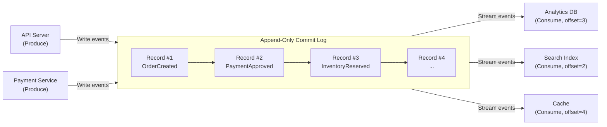

# Stream Processing at Scale: The Log-Centric Architecture

*As a Principal Data Platform Engineer at LinkedIn, I built the streaming infrastructure that processes billions of events per day across Kafka, Samza, and Flink clusters. This module covers the log-centric architecture, time semantics, the Lambda vs Kappa debate, and the failure modes that will crush your pipeline if you ignore them.*

> **Prerequisites:** This module assumes you have read the beginner-friendly [Module 11 guide](11-stream-processing.md) and understand batch vs stream, the log abstraction, consumer groups, offsets, event time, watermarks, and windowing. You should also understand [Module 05 — Async Messaging](05-async-messaging.md).

---

## Table of Contents

1. [The Log-Centric Architecture](#1-the-log-centric-architecture)
2. [Time Semantics & Windowing](#2-time-semantics--windowing)
3. [Lambda vs Kappa Architecture](#3-lambda-vs-kappa-architecture)
4. [Real-World Failure Modes](#4-real-world-failure-modes)
5. [Teacher's Corner](#5-teachers-corner)
6. [Glossary of Key Terms](#6-glossary-of-key-terms)
7. [Key Takeaways](#7-key-takeaways)

---

## 1. The Log-Centric Architecture



Jay Kreps' 2013 article "The Log: What every software engineer should know about real-time data's unifying abstraction" was a watershed moment in data systems design. The core insight: **the immutable append-only commit log is the universal abstraction for distributed data** — equally applicable to databases (write-ahead log), message systems (Kafka), and filesystems (journaling).

### The Log as Source of Truth

A log is an ordered sequence of records, where new records are appended to the end. A record is never modified after writing. Consumers read by maintaining an **offset** (pointer) into the log.

```
Log:
┌──────┬──────┬──────┬──────┬──────┬──────┐
│  #1  │  #2  │  #3  │  #4  │  #5  │  #6  │ ...
└──────┴──────┴──────┴──────┴──────┴──────┘
           ▲                        ▲
           │                        │
     Consumer A                 Consumer B
     (offset 2)                 (offset 5)
```

This is fundamentally different from a message queue (RabbitMQ, ActiveMQ). In a queue, messages are deleted after consumption. In a log, messages persist indefinitely (up to a retention policy). This enables:

- **Multiple consumers at different speeds.** Consumer A processes in real-time (offset near the tail). Consumer B backfills a new projection (offset 0, replaying from the beginning).
- **Replay on failure.** Deploy a bug? Fix it, reset the consumer offset to before the buggy deploy, and reprocess.
- **Multiple independent projections.** An event is consumed once per consumer group but zero-copy for all consumers in the same group (Kafka's zero-copy sendfile optimization).

### Kafka's Partition Model

Kafka partitions are the unit of parallelism. Each partition is an ordered, immutable log append-only. The total order exists only within a partition — there is no global order across partitions.

```
Topic "orders" (3 partitions):
Partition 0: [order_1, order_4, order_7, ...]
Partition 1: [order_2, order_5, order_8, ...]
Partition 2: [order_3, order_6, order_9, ...]
```

The partition key (e.g., `user_id % num_partitions`) determines which partition an event lands in. This guarantees that all events for the same key are in the same partition, preserving causal order within a key's scope.

### Batch vs Stream: The Shift

| Dimension | Batch (MapReduce/Hive) | Stream (Flink/Kafka Streams) |
|-----------|----------------------|------------------------------|
| Data | Bounded (fixed dataset) | Unbounded (continuous) |
| Processing | Periodic (hourly, daily) | Continuous (per-event or micro-batch) |
| Latency | Minutes to hours | Milliseconds to seconds |
| State | Stateless per run | Stateful across runs |
| Recovery | Re-run entire batch | Replay from checkpoint |
| Correctness | Deterministic (same input → same output) | Approximate until watermark closes |

The architectural shift: batch systems treat the log as a data source to be copied into a warehouse, then processed. Stream systems treat the log as the source of truth — processing happens directly on the log without copying.

LinkedIn's transition (2011–2014): Their original Hadoop pipeline processed engagement data daily. By the time they detected a spam wave, it was 24 hours old. Migrating to Kafka → Samza for real-time spam detection reduced detection latency from 24 hours to 30 seconds. The Kafka log became the authoritative record; Hadoop became a secondary system for deep historical analysis.

---

## 2. Time Semantics & Windowing

### Event Time vs Processing Time

The single most common cause of incorrect streaming results is confusing event time with processing time.

**Event time:** When the event *actually occurred* — set by the producer (e.g., the mobile phone's GPS timestamp).

**Processing time:** When the event *arrived at the stream processor* — set by the server's wall clock.

**Why this kills accuracy:** Consider a mobile game where a user in China experiences a 15-second network delay. Their "score = 100" event arrives at your US-based Flink job 15 seconds later. If you window by processing time, that event falls into the wrong 10-second window. Per-minute aggregates are shifted by the delay distribution. Daily totals still match (because all events eventually arrive), but per-minute dashboards are wrong.

**The fix:** Always window by event time. But event time introduces its own problem: out-of-order arrival.

### Watermarks for Late-Arriving Data

A watermark is a temporal bound that the stream processor maintains: *"I have observed all events with event time ≤ watermark."*

```
Event Time:
14:01:00 --- 14:01:10 --- 14:01:20 --- 14:01:30 ---→ time
                 ↑ event_A(t=01:15)
                      ↑ event_B(t=01:22)
                              ↑ event_C(t=01:28)
Watermark = 14:01:15  (still waiting for t between :15 and :28)
```

When watermark > window end, the window fires (its result is emitted). Events that arrive after the watermark (late events) may be dropped, sent to a side output, or trigger an update depending on the configuration.

**How watermarks are computed:**

- **Perfect watermark (ideal):** The processor knows exactly when all events for a given time have been observed. This is only possible in controlled environments (e.g., Kafka with exactly one partition and no latency).
- **Heuristic watermark (realistic):** The processor tracks observed event times and sets watermark = `min(observed_max_event_time) - allowed_lateness`. Google's MillWheel and Apache Flink both use this approach.
- **Idle source handling:** If a partition has no events (idle source), watermarks stall. Flink requires marking sources as idle after a configurable timeout to advance the watermark past idle partitions.

**Trade-off:** Tight watermark → low latency but more late events. Loose watermark → fewer late events but higher latency and memory (more in-flight windows).

### Window Types in Detail

**Tumbling Windows (fixed, non-overlapping):**

```sql
-- Flink SQL: Tumbling window of 1 hour
SELECT TUMBLE_END(event_time, INTERVAL '1' HOUR) AS window_end,
       COUNT(*) AS event_count
FROM events
GROUP BY TUMBLE(event_time, INTERVAL '1' HOUR)
```

Each event belongs to exactly one window. Windows do not overlap. Simple, memory-efficient.

**Sliding Windows (fixed, overlapping):**

```sql
-- Sliding window: 15-minute window, sliding every 5 minutes
SELECT HOP_END(event_time, INTERVAL '5' MINUTE, INTERVAL '15' MINUTE) AS window_end,
       AVG(sensor_value) AS avg_value
FROM sensors
GROUP BY HOP(event_time, INTERVAL '5' MINUTE, INTERVAL '15' MINUTE)
```

An event belongs to `window_size / slide_interval` windows (e.g., 3 windows for a 15-min window sliding every 5 min). More memory and compute. Used for rolling averages.

**Session Windows (activity-gap-based):**

```
User activity: [click] [click]        [click] [click] [click]
                ← session →           ←  session →
                gap > 30 min closes session
```

Windows start on first event and close after a gap of inactivity. No fixed duration. Useful for user session analysis, time-on-site, and funnel tracking. Challenging to implement because windows are not known until gap occurs.

---

## 3. Lambda vs Kappa Architecture

### Lambda Architecture (Nathan Marz, 2011)

Two parallel pipelines feed into a merging serving layer:

```
                        ┌─────────────────┐
Raw Data ──► Batch Layer ──► Master Dataset
             (Hadoop)      (immutable, raw)
                                  │
                                  ▼
                         ┌─────────────────┐
             ┌──────────► Serving Layer ◄──────────┐
             │           (merges views)            │
             │                                     │
             │                                     │
Raw Data ──► Speed Layer ──────────────────────────┘
             (Storm/Samza)
             (incremental)
```

**The problem:** You maintain two codebases that compute the same thing — a batch job (Hive/Pig) and a streaming job (Storm/Samza). They must produce the same result for the same data, but they use different frameworks, different languages, different testing approaches.

**Real-world cost:** At LinkedIn, the Lambda architecture for our "Who Viewed My Profile" feature required a weekly batch pipeline (Hadoop, Pig, 4 hours) and a real-time pipeline (Samza, sub-second). During a batch schema migration, the batch result diverged from the streaming result. It took 2 weeks to reconcile because the debugging required understanding both codebases and the merge logic in the serving layer.

### Kappa Architecture (Jay Kreps, 2014)

One pipeline handles everything:

```
Raw Data ──► Kafka (immutable log) ──► Stream Processor (Flink/Kafka Streams)
                                          │
                                          ▼
                                    Serving Layer
                                    (key-value store)
```

**To reprocess:** Rewind the consumer offset to the beginning. The same code processes historical data (replay) and real-time data (live). No second codebase.

**The catch:** The stream processor must handle the full historical volume during reprocessing. If you have 10 TB of historical data, the reprocessing may take days. You need either enough cluster capacity to handle reprocessing without impacting live traffic, or you run a separate reprocessing cluster.

### When Lambda Still Wins

Despite the ideological appeal of Kappa, Lambda persists for valid reasons:

1. **Ad-hoc queries:** Lambda's batch layer can run arbitrary SQL. Kappa requires you to pre-define all queries as streaming computations.
2. **Multi-year backfills:** Reprocessing 5 years of Kafka data may be impractical (bandwidth, storage, time). The batch layer's HDFS is often cheaper to query.
3. **Organizational inertia:** You have a team of Hive/Spark SQL engineers and a separate streaming team. Merging them is an org change, not a tech change.

**Pragmatic hybrid:** Run Kappa for real-time (0–48 hour latency). Run batch for historical (48+ hours). This avoids the complexity of Lambda's merging step while preserving batch's advantage for deep historical analysis.

---

## 4. Real-World Failure Modes

### Out-of-Order Events

**Scenario:** A user's phone has a GPS clock drift of +30 seconds. The event time is 14:01:00 (phone time) but server time is 14:00:30. The event arrives at the Flink job at 14:01:05 (server time). The watermark, based on observed event times, has already passed 14:01:00. The event is considered "late" and may be dropped.

**Impact:** The event is either dropped (silent data loss) or sent to a side output (requires manual reconciliation). In a revenue analytics pipeline, this means 0.5% of transactions are not counted in the correct hour.

**Mitigations:**

1. **Bound acceptable skew:** Reject event times more than ±24 hours from server time. This prevents a phone with year-1970 clock from stalling the pipeline.
2. **Allowed lateness:** Configure `allowedLateness` in Flink to keep windows open for N seconds after the watermark passes. The window re-emits on each late event (updating the result).
3. **Provenance tracking:** Tag every event with ingestion time (server-side) in addition to event time. Queries can filter by ingestion time to bound the effect of out-of-order arrival.

### Exactly-Once Semantics

**The problem:** A stream processor reads an event from Kafka, processes it, and writes the result to an external database. It then commits the offset to Kafka. If the processor crashes after writing to the database but before committing the offset, the event will be re-processed (at-least-once) → duplicate writes.

**The solution stack:**

1. **Idempotent sinks:** The external database operation must be idempotent — re-applying the same write produces the same result. Use upserts with unique event IDs.
2. **Kafka transactions:** For Kafka-to-Kafka pipelines, Kafka's transaction API (idempotent producers + atomic commits) provides exactly-once semantics within the Kafka ecosystem.
3. **Chandy-Lamport snapshots (Flink):** Flink periodically checkpoints the entire state (operator states + source offsets). On failure, the entire pipeline is restored from the latest checkpoint and reprocesses from the last committed offset. This provides exactly-once semantics at the cost of a "pause and catch up" on recovery.

**The cost:** Exactly-once reduces throughput by 20–50% compared to at-least-once, depending on the sink and checkpoint interval. The trade-off is accuracy vs performance.

| Delivery Guarantee | Throughput | Data Loss | Duplicates | Use Case |
|-------------------|-----------|-----------|------------|----------|
| At-most-once | Highest | Possible | None | Monitoring (miss a tick, OK) |
| At-least-once | High | None | Possible | Log ingestion, analytics |
| Exactly-once | Lower | None | None | Financial transactions, billing |

### State Recovery After Stream Processor Crash

**Scenario:** A Flink job maintains a 24-hour sliding window of per-user click counts. The Flink TaskManager crashes, losing all in-memory state. The JM (JobManager) triggers a full restart from the last checkpoint.

**Recovery process:**
1. JobManager reads the latest checkpoint from the state backend (RocksDB or S3).
2. TaskManagers restore their operator state (window contents, aggregates).
3. Source operators reset their Kafka offsets to the checkpoint's stored offsets.
4. Processing resumes from the checkpoint offsets. Events between checkpoint and crash are re-processed.
5. Idempotent sinks ensure no duplicate writes.

**State backend comparison:**

| Backend | Latency | Throughput | Recovery |
|---------|---------|------------|----------|
| Heap (in-memory) | Fastest | Highest | Lost on crash — requires full reprocess |
| RocksDB (disk) | Moderate | High | Fast recovery from local disk |
| S3/DynamoDB | Slower | Moderate | Recovery from durable remote store |

**Practical advice:** Use RocksDB for state backend with incremental checkpoints to S3. This gives fast local performance with durable remote recovery. A 100 GB window state restores in ~2 minutes from RocksDB + 5 minutes to download the latest checkpoint from S3.

---

## 5. Teacher's Corner

### Question 1: Log vs Delete-on-Read Queue for Microservices

**Problem:** You are building an event bus for microservices. Compare using Kafka (log-based, persistent) vs RabbitMQ (delete-on-read queue) as the backbone. When would you choose each?

**Solution:**

| Factor | Kafka (Log) | RabbitMQ (Queue) |
|--------|-------------|------------------|
| Consumption | Pull (consumer controls rate) | Push (broker pushes to consumer) |
| Message retention | Configurable (hours to years) | Deleted after ack |
| Replay | Yes (reset offset) | No (message gone) |
| Throughput | 1M+ msg/sec per broker | 100K msg/sec per node |
| Latency | ~5ms (batch-oriented) | ~1ms (individual messages) |
| Consumer rebalancing | Yes (partition assignment) | Yes (competing consumers) |
| Routing complexity | Topic-based | Topic + Direct + Fanout + Headers |

**Choose Kafka when:** You need replay capability, multiple independent consumer groups, high throughput (>100K msg/sec), or you're building a streaming data pipeline where historical replay matters.

**Choose RabbitMQ when:** You need flexible routing (fanout, direct, topic exchanges), low-latency individual message delivery (<5ms), or you're building a task queue where each message should be processed exactly once and then discarded.

**Hybrid approach:** Use RabbitMQ for command/request patterns (send payment request → wait for ACK). Use Kafka for event notification patterns (order placed → notify N downstream services).

### Question 2: State Recovery After Stream Processor Crash

**Problem:** A Flink job tracks per-user session windows with 30-minute gaps. The job has been running for 3 days and has 500 GB of session state. The TaskManager crashes. Describe the recovery process with RocksDB state backend and S3 checkpointing. How long does recovery take?

**Solution:**

1. **Failure detection:** JobManager detects TaskManager heartbeat timeout (~10 seconds).
2. **Restart:** JobManager allocates new TaskManager slot and restarts the job from the latest checkpoint.
3. **Checkpoint retrieval:** The new TaskManager downloads the latest checkpoint metadata from S3 (a few KB). It streams the checkpoint shards from S3 (500 GB of RocksDB SST files at ~200 MB/s = ~45 minutes).
4. **State restoration:** RocksDB opens the SST files and initializes indexes (~5 minutes).
5. **Source offset reset:** Kafka source operators reset to the checkpoint's committed offsets.
6. **Reprocessing:** Events between checkpoint time and crash time are re-processed (~2 minutes of wall-clock time per minute of replayed events, depending on throughput).
7. **Normal operation resumes.**

**Total recovery time:** ~45 minutes (download) + 5 minutes (init) + replay = ~50–60 minutes.

**Optimization:** Incremental checkpoints reduce recovery time by only uploading/downloading state shards that changed since the last checkpoint, rather than full state snapshots.

### Question 3: Scaling via Partitioning — No Global Order

**Problem:** Your e-commerce pipeline requires that all events for a given order are processed in order (order_created → payment_approved → shipment_scheduled). But you also need to aggregate total revenue across all orders (global sum). How do you partition to satisfy both ordering and global aggregation?

**Solution:** Two-stage partitioning.

**Stage 1 (per-order ordering):** Partition by `order_id`. All events for a single order land in the same partition and are processed in order. This ensures each order's lifecycle is consistent.

**Stage 2 (global aggregation):** A downstream operator consumes all partitions (no partitioning key). This operator maintains a global counter or windowed aggregate. It receives events from all partitions but does not assume any ordering between events from different orders (because there is no global order).

```python
# Stream 1: Per-order processor (partitioned by order_id)
Input: Kafka topic "orders" (partitioned by order_id)
Operation: Stateful per-order processing, detect lifecycle violations

# Stream 2: Global aggregator (single partition or keyed by aggregate_id)
Input: Output of Stream 1 (republished to "order_events" topic)
Operation: Windowed sum of revenue across all orders
```

**Trade-off:** Stage 2 has no ordering guarantees between orders but does not need them — total revenue is commutative. The price of global ordering across all keys would be a single partition, which kills parallelism.

**Rule of thumb:** If you need ordering across events with different keys, you need to rethink your design. Total order is the enemy of scalability. Design apps to tolerate out-of-order arrival between independent entities.

---

## 6. Glossary of Key Terms

| Term | Section | Definition |
|------|---------|------------|
| Log | 1 | An append-only, ordered sequence of immutable records — the universal distributed data abstraction |
| Partition | 1 | A unit of parallelism in Kafka; an ordered log within a topic |
| Offset | 1 | A sequential pointer indicating a consumer's position within a log partition |
| Consumer Group | 1 | A set of consumers that coordinate to read from a partitioned log, each consuming a subset of partitions |
| Event Time | 2 | The timestamp of when the event actually occurred (set by the producer) |
| Processing Time | 2 | The timestamp of when the event was processed (set by the server) |
| Watermark | 2 | A temporal bound indicating the stream processor has seen all events up to that time |
| Tumbling Window | 2 | Fixed-size, non-overlapping time windows |
| Sliding Window | 2 | Fixed-size, overlapping time windows that slide forward at regular intervals |
| Session Window | 2 | Activity-gap-based windows that close after a period of inactivity |
| Lambda Architecture | 3 | Dual pipeline (batch + streaming) with merging serving layer |
| Kappa Architecture | 3 | Single streaming pipeline where reprocessing is done via offset rewind |
| Chandy-Lamport Snapshot | 4 | Distributed snapshot algorithm used by Flink for state checkpointing |
| Exactly-Once Semantics | 4 | Guarantee that each event is processed exactly once, with no duplicates or gaps |
| Idempotent Sink | 4 | Output destination where re-applying the same write produces the same result |
| Checkpoint | 4 | A consistent snapshot of stream processor state (operator states + source offsets) |
| Allowed Lateness | 4 | Configuration that keeps windows open for a period after the watermark to accept late events |

---

## 7. Key Takeaways

1. **The log is the universal abstraction.** Databases (WAL), messaging (Kafka), and filesystems (journaling) all converge on the append-only log. Understand it deeply.

2. **Always window by event time, not processing time.** Processing-time windowing produces wrong results under any network delay or queue backlog.

3. **Watermarks encode the latency-vs-completeness trade-off.** There is no correct watermark value — it depends on your business tolerance for inaccurate results vs delayed results.

4. **Kappa (single pipeline) is usually simpler than Lambda (dual pipeline).** Use Kappa for greenfield. Fall back to Lambda only when historical reprocessing bandwidth is the bottleneck.

5. **Out-of-order events are physics, not a bug.** Network delays, clock skew, and mobile connectivity all cause out-of-order arrival. Design for it with watermarks and allowed lateness.

6. **Exactly-once semantics require end-to-end coordination.** Kafka transactions + idempotent sinks + checkpointing. The throughput cost is real — measure it.

7. **State recovery from checkpoints is measured in minutes, not seconds.** Plan for 500 GB of state taking 45+ minutes to restore. Use incremental checkpoints.

8. **Partitioning destroys global order.** Within a partition, order is preserved. Across partitions, there is no total order. Design aggregations to be commutative.

9. **Flink checkpoints work via the Chandy-Lamport algorithm.** The JobManager periodically injects barriers into the data stream. When all operators receive the barrier, a consistent snapshot is taken.

10. **Idle sources stall watermarks.** Configure idle source detection to advance watermarks past partitions that have stopped producing. Otherwise, your entire pipeline stalls.

---

> This guide provides the advanced engineering depth for stream processing systems.
> For the foundational concepts, refer to the beginner-friendly [Module 11 guide](11-stream-processing.md).
> Remember: the log is not infrastructure — it is your system's memory. Treat it with respect.

---

*Ready to proceed? Continue to [Module 12 — Distributed Consensus Advanced](12-distributed-consensus-advanced.md).*
