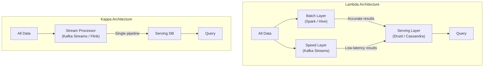

You've used this when... you got a fraud alert from your bank seconds after swiping your card, saw your Uber surge pricing update in real-time, or watched a live dashboard refresh during a sports event. All of these are **stream processing** — systems that analyze data as it arrives, not hours later.

Think about the last time you ordered food delivery and watched the tracking map update every few seconds. That's a stream of GPS events being processed in real-time: matching driver locations to your order, estimating arrival time, detecting if the driver is going the wrong way. A batch system that ran every hour would be useless here — you'd see your food arrive on the map an hour after it was delivered.

Stream processing is everywhere in modern apps, but it's fundamentally different from the batch processing most developers learn first. This module teaches you the mental model shift: from "process everything at once" to "process everything as it arrives, forever."

---

# Stream Processing & Real-Time Analytics – A Beginner's Guide

> This guide explains how systems process data continuously as it arrives, rather than waiting for periodic batch jobs — enabling real-time dashboards, fraud detection, and live pricing.
> Every technical term is defined the first time it appears, and a full Glossary is at the end.
> Once you understand these foundations, the original advanced module will feel like a natural next step.

---

> **Before you start:** You should understand [Module 05 — Async Messaging](/Docs/05-async-messaging.md). If you haven't read that yet, start there.

## Table of Contents

1. [Batch vs Stream: Yesterday's Newspaper vs Live Broadcast](#1-batch-vs-stream-yesterdays-newspaper-vs-live-broadcast)
2. [The Log: The Append-Only Ledger](#2-the-log-the-append-only-ledger)
3. [Consumer Groups and Offsets](#3-consumer-groups-and-offsets)
4. [Event Time vs Processing Time](#4-event-time-vs-processing-time)
5. [Watermarks: When to Stop Waiting for Late Data](#5-watermarks-when-to-stop-waiting-for-late-data)
6. [Windowing: Grouping Events by Time](#6-windowing-grouping-events-by-time)
7. [Lambda vs Kappa Architecture](#7-lambda-vs-kappa-architecture)
8. [Common Disasters and How to Avoid Them](#8-common-disasters-and-how-to-avoid-them)
9. [Putting It All Together — Detecting Fraud in Real-Time](#9-putting-it-all-together--detecting-fraud-in-real-time)
10. [Glossary of Technical Terms](#10-glossary-of-technical-terms)
11. [Key Takeaways](#11-key-takeaways)

---
> **⏱ TL;DR — If you only learn 3 things from this module:**
> 1. **Stream processing** is live broadcast — data is processed continuously as it arrives, enabling real-time fraud detection, dashboards, and pricing.
> 2. **Event time vs processing time** is the most critical distinction. Always use event time for analytics, and set watermarks to handle late-arriving data.
> 3. **Kappa architecture** (one streaming pipeline for all data) is usually simpler than Lambda (batch + stream merged together). Start with Kappa for greenfield projects.
---

## 1. Batch vs Stream: Yesterday's Newspaper vs Live Broadcast

The fundamental difference in data processing is **when** you process it.

| Approach | Analogy | Latency | Example |
|----------|---------|---------|---------|
| **Batch processing** | Reading yesterday's newspaper | Minutes to hours | Generate daily sales report at midnight |
| **Stream processing** | Watching a live news broadcast | Milliseconds to seconds | Detect and block fraud as the transaction happens |

| Approach | Use when... | Don't use when... |
|----------|-------------|-------------------|
| **Batch** | You need accurate, reprocessable reports on historical data; latency of minutes to hours is acceptable; you want simple debugging (rerun on failure) | You need sub-second responses (fraud detection, live dashboards), or the data is unbounded and must be processed as it arrives |
| **Stream** | You need real-time results — fraud detection, live pricing, dashboards, monitoring alerts; you're processing an unbounded stream | The result must be perfectly accurate on the first pass (stream results are often approximate until late events are incorporated), or the business can tolerate hours of delay |

**Batch processing** works on a fixed set of data (all of yesterday's orders) and produces a result. Simple, reliable, easy to debug — if a batch job fails at 95%, you fix the bug and rerun from the beginning.

**Stream processing** works on an unbounded, continuous flow of data (each order as it happens). You never know when the next event will arrive, you cannot sort the entire dataset, and you must produce results within strict time windows.

**When to use each:**
- Batch: reports, historical analytics, backfills, billing (where minutes or hours of delay are acceptable).
- Stream: fraud detection, real-time dashboards, monitoring alerts, live pricing, recommendation updates.

---

## 2. The Log: The Append-Only Ledger

At the heart of stream processing is the **log** — an append-only, ordered sequence of records.

**Analogy:** A bank account ledger. Every transaction (deposit, withdrawal, transfer) is appended to the bottom of the ledger in order. No entry is ever erased or modified. If you want to know your balance at any point, you replay the ledger from the beginning.

In stream processing, the log (implemented by Kafka, Pulsar, or similar) is the **source of truth**. Producers append events, and consumers read them in order.

Key properties of a log:
- **Append-only:** Nothing is ever modified in place.
- **Immutable:** Once written, an event never changes.
- **Replayable:** A consumer can go back to the beginning and reprocess everything.
- **Durable:** Events are persisted to disk and replicated across servers.

---

## 3. Consumer Groups and Offsets

A **consumer group** is a set of consumers that cooperate to read from a log. Each consumer in the group reads a subset of the events.

**Offsets** are pointers that track how far each consumer group has read. The offset is like a bookmark — it tells the consumer "you have processed up to position 42. Next time, start at 43."

**Why offsets are powerful:**
- **Multiple consumers:** A single log can feed a real-time dashboard (reads latest offsets every second), a data lake loader (reads every 5 minutes), and a batch reprocessor (rewound to offset 0 for a schema migration) — all at the same time.
- **Replay:** If you deploy a bug that corrupts the data, you can rewind to the offset before the buggy deploy and reprocess cleanly.
- **Resilience:** If a consumer crashes, another consumer in the group picks up from the last committed offset. No data is lost.

**Analogy:** A book club with three readers. One is on chapter 5 (fast reader), one is on chapter 3 (slow reader), and one just restarted the book (reprocessing). All three read the same book (the log) but track their progress independently (offsets).

---

## 4. Event Time vs Processing Time

This is one of the most important concepts in stream processing.

| Concept | What it means | Risk |
|---------|---------------|------|
| **Event Time** | When the event actually occurred (e.g., the user's phone recorded a click at 14:01:05) | The user's phone clock could be wrong |
| **Processing Time** | When your server processed the event (e.g., the Flink job handled it at 14:01:10) | Depends on scheduling, network delays, and queue backlogs |

**Why the distinction matters:** Imagine a user in Tokyo clicks a button at 14:01 UTC. The event travels through a congested network, lands on a Kafka broker 3 seconds later, and is consumed by a stream processor 7 seconds after that.

- **Event time:** 14:01 (when the user clicked) — this is when the action actually happened.
- **Processing time:** 14:01:10 (when the server processed it) — this is affected by network delay.

If you use processing time for windowing (grouping events into 1-minute windows), that click would be assigned to the 14:01 window instead of the 14:02 window. But both are correct for different purposes. For most analytics (pricing, fraud detection, user behavior), you should use **event time** and handle out-of-order arrivals.

---

## 5. Watermarks: When to Stop Waiting for Late Data

When you use event time, events will **arrive out of order**. A user in Tokyo might click at 14:01, but the event arrives after another event from London that occurred at 14:02. This is normal in distributed systems.

A **watermark** is a temporal cutoff that the stream processor uses to decide: *"I am confident no event with event time older than this value will arrive."*

**Analogy:** You send out party invitations and ask everyone to RSVP by Friday. On Saturday, you finalize the headcount. The watermark is Saturday — you assume nobody else will RSVP. If someone RSVPs on Sunday (a "late event"), you may or may not accept it.

**The trade-off:**
- **Aggressive watermark** (short wait): Low latency, but may miss late events.
- **Conservative watermark** (long wait): Fewer missed events, but higher latency and more memory usage.

Setting the watermark is a **business decision**: how late can events arrive, and how important is it to include them?

---

## 6. Windowing: Grouping Events by Time

Stream processing aggregates events into **windows** — groups of events that fall within a time boundary. The three main types:

| Type | Description | Analogy | Example |
|------|-------------|---------|---------|
| **Tumbling** | Fixed-size, non-overlapping windows | Every hour, a new bucket starts | "Revenue per hour" |
| **Sliding** | Fixed-size, overlapping windows | A 1-hour window that slides every 5 minutes | "Average CPU over the last 5 minutes, updated every 10 seconds" |
| **Session** | Windows defined by activity gaps | A user clicks, then is inactive for 30 minutes → session ends | "Time spent on site per user session" |

**Tumbling windows** are the simplest. Divide time into 1-minute buckets. Every event falls into exactly one bucket. At the end of each minute, emit the result (e.g., count of clicks).

**Sliding windows** overlap. A window of "last 5 minutes" that refreshes every 10 seconds. Events belong to multiple windows.

**Session windows** are irregular — they start when a user becomes active and end after a gap of inactivity. Useful for user behavior analytics.

---

## 7. Lambda vs Kappa Architecture

When building a real-time data pipeline, you have two main architectural choices:

### Lambda Architecture

Two parallel pipelines:
- **Batch layer:** Processes all historical data. Produces accurate, complete results.
- **Speed layer:** Processes recent data in real-time. Produces approximate, low-latency results.
- **Serving layer:** Merges batch and speed results for querying.

**Pros:** You get both accuracy (batch) and low latency (streaming).
**Cons:** You must write and maintain two separate codebases that do the same thing. Merging results is complex.

### Kappa Architecture

A single pipeline:
- All data goes through the stream processor. The same code processes both historical and real-time data.
- To reprocess historical data, you rewind the consumer offset to the beginning.

**Pros:** One codebase, simpler architecture, easier to maintain.
**Cons:** The stream processor must handle the full historical volume during reprocessing (which may be very large).

| Factor | Lambda | Kappa |
|--------|--------|-------|
| **Use when...** | You have an existing batch pipeline that is costly to replace, or you need batch-level accuracy alongside real-time previews | You're building a greenfield project, or you want a single codebase and simpler operations |
| **Don't use when...** | You want a simple architecture and can afford to reprocess via offset rewinds | Your stream processor cannot handle the full historical data volume during reprocessing |
| Codebases | Two (batch + stream) | One (stream only) |
| Complexity | High (merging results) | Lower |
| Repros | Rerun batch | Rewind stream offset |
| Cost | Higher (duplicate processing) | Lower |

**Rule of thumb:** Start with Kappa for greenfield projects. Use Lambda only when you have an existing batch pipeline that is costly to migrate.

---
> **✏️ Check Your Understanding**
> 1. Your streaming pipeline counts website clicks per minute. At 14:05, you notice the count for 14:04 dropped from 1,200 to 800. What happened? Which stream processing concept is involved?
> 2. You deploy a new version of your stream processor with a bug that corrupts output data. You discover the bug 30 minutes later. How do you recover without losing data? Which offset concept makes this possible?
> 3. Your mobile app sends events with timestamps set by the user's phone. Suddenly, your watermark stops advancing and your windows never close. What went wrong? What's the fix?
> 

> 
Answers

> 1. **Late-arriving events were incorporated.** The initial count of 1,200 was based on events that arrived on time. The corrected count of 800 means 400 events arrived late (after the watermark) and were counted in a later window. This is the watermark/late-data trade-off.
> 2. **Rewind the consumer offset** to the point before the buggy deploy. Stream processors store their position (offset) in the log. By rewinding to a known-good offset, the corrected code re-processes all events from that point — no data is lost because the log is immutable and replayable.
> 3. **Client clock skew.** A phone with a wrong clock sent events with timestamps years in the past, so the watermark (which advances based on observed event times) got stuck waiting for events that will never arrive. Fix: reject events with timestamps outside a reasonable bound (e.g., ±24 hours from the server's clock).
> 

---

## 8. Common Disasters and How to Avoid Them

### The Kafka Rebalance Storm
**Symptom:** All consumers in a group stop processing simultaneously. Logs show repeated rebalance attempts. Throughput drops to zero, then slowly recovers, then drops again.
**Root Cause:** A single consumer fails (or times out). Kafka triggers a rebalance — all consumers stop consuming and reallocate partitions among the remaining members. If the remaining consumers are overwhelmed by the extra partitions, they time out too, triggering another rebalance. A cascading failure.
**Real Incident:** LinkedIn's early Kafka deployment experienced this during a major deployment. A single broker rolling restart triggered a rebalance that cascaded across the cluster, causing a 45-minute processing outage. This led to the development of cooperative rebalancing (KIP-429).
**Fix:** Use **cooperative rebalancing** (incremental, not stop-the-world). Set reasonable session timeouts (at least 3x the expected processing time for a batch of records). Avoid consumer groups that are too large relative to partition count.
**How to Detect Early:** Monitor rebalance frequency and duration. Alert if a rebalance takes longer than a few seconds, or if rebalances happen more than once every few minutes. Track "failed rebalance" events in consumer logs.

### Out-of-Order Events Causing Wrong Results
**Symptom:** Your "revenue per minute" dashboard shows 12:01 revenue appearing in the 12:05 window. Daily totals look correct, but per-minute breakdowns are clearly wrong.
**Root Cause:** You used processing time instead of event time for windowing. Network delays, queue backlogs, or retries caused events to arrive at your processor in a different order than they were generated.
**Real Incident:** A major ad-tech company's real-time bidding system initially used processing time for click attribution. Advertisers saw clicks attributed to the wrong minutes, causing billing disputes. They migrated to event-time processing with a 2-minute watermark tolerance.
**Fix:** Always use event time for analytics windowing. Set watermarks based on your observed network delay distribution (p99 of event arrival delay).
**How to Detect Early:** Compare event-time vs processing-time distributions. If the gap (processing time - event time) has high variance (p99 > 5x p50), you have a latency skew problem. Log events where the difference exceeds a threshold.

### Client Clock Skew
**Symptom:** Watermarks stop advancing. Windows never close. The system appears stuck processing events from hours or years ago.
**Root Cause:** A client device has an incorrect clock. Events from that device carry event timestamps that are too far in the past or future, preventing the watermark from advancing past those extreme values.
**Real Incident:** A large IoT platform ingested sensor data from thousands of devices. One batch of sensors had a manufacturing defect that reset their clocks to 1970 on reboot. Events with 1970 timestamps caused the streaming pipeline's watermark to stall, delaying all downstream processing until the bad events were filtered.
**Fix:** Reject events with event times outside a configurable bound (e.g., ±24 hours from the server's current time). Fix client clocks using NTP. For mobile apps, have the server provide a timestamp on connect and use the server's time if the client's clock is too far off.
**How to Detect Early:** Monitor the gap between the watermark and the current processing time. If the watermark has not advanced in more than a few minutes, alert. Log and count events with rejected timestamps.

### Exactly-Once is Hard
**Symptom:** After a stream processor crash and restart, your output database has duplicate records. Counts are double, charges are duplicated.
**Root Cause:** The processor emitted a result (e.g., wrote to a database) and then crashed before committing the offset to Kafka. On restart, it re-processes the same events from the last committed offset, producing the same results again.
**Real Incident:** A fintech company's fraud detection system double-flagged transactions during a Flink job restart. The duplicate flags triggered automatic account freezes, affecting thousands of legitimate users. They added idempotency keys to the alert output and changed the restart procedure to verify no duplicates before unfreezing.
**Fix:** Make your output sink idempotent (deduplicate by event ID or use upsert semantics). Kafka's exactly-once semantics (transactions) help for Kafka-to-Kafka pipelines. For external databases, include a unique event ID in each write and use INSERT ... ON CONFLICT DO NOTHING or equivalent.
**How to Detect Early:** Monitor the ratio of input events to output results. If the ratio deviates significantly from 1:1 (for 1:1 transforms), you may have duplicates or gaps. Track restart counts and the number of events re-processed after each restart.

---

## 9. Putting It All Together — Detecting Fraud in Real-Time

Let's trace a ride-sharing app that detects surge pricing and fraud in real-time:

1. **Events stream in continuously.** Riders request rides, drivers accept, rides start and end — all published as events to a Kafka topic. Each event includes the event time (when it happened) and the rider/driver IDs.

2. **Consumer group for surge pricing.** A Flink job runs a sliding window of "average demand in the last 5 minutes." Every 10 seconds, it recomputes: how many ride requests in this area vs. available drivers? If demand exceeds supply by 3x, it publishes a "surge pricing" event.

3. **Consumer group for fraud detection.** A second Flink job processes the same events. It checks: "Has this rider taken more than 10 rides in the last hour with different credit cards?" If yes, flag for review. This uses event time (to know when the rides actually happened) and a session window per rider.

4. **Watermark handling.** The fraud detector uses a watermark of 30 seconds — it waits up to 30 seconds for late-arriving events (from congested mobile networks) before making a decision. This delays fraud detection by 30 seconds but catches more events.

5. **Results go to different sinks.** Surge pricing updates go to a Redis cache (read by the ride request API). Fraud alerts go to a PostgreSQL table (read by the fraud team's dashboard). Both sinks are idempotent (duplicate events do not cause double-charges or duplicate alerts).

6. **Failure recovery.** If the surge pricing job crashes, it restarts, reads its last committed offset from Kafka, and resumes from where it left off. It may re-process a few events (at-least-once), but the output is idempotent, so no damage.

The system processes millions of events per second with sub-second latency for surge pricing and near-real-time fraud detection — all from the same event stream.

---
> **🧪 Conceptual Exercises**
> 1. You're building a real-time leaderboard for a gaming platform. Every time a player scores points, the leaderboard must update within 1 second for all viewers. You have 10 million concurrent players. Design the streaming pipeline: what's the event schema? What windowing strategy would you use for "top scorers today"? What about "top scorers in the last hour"? How do you handle a player whose phone clock is 5 minutes slow?
> 2. Your team runs an e-commerce site and wants to detect "flash crowd" behavior — when a product page gets 10x normal traffic in under 5 minutes — so you can auto-scale the serving infrastructure. Design the detection system using stream processing concepts. What kind of window do you need? What event time considerations apply?
> 

> 
Hints

> 1. The event schema needs at minimum: player_id, score_delta, event_timestamp (event time), and a unique event_id for idempotency. For "today's top scorers," a tumbling window of 1 day works. For "last hour," use a sliding window that updates every few seconds. Client clock skew: use server-side timestamp on arrival as processing time, and validate the reported event time against a reasonable bound.
> 2. You need a sliding window (e.g., "requests per URL in the last 5 minutes, evaluated every 30 seconds"). Use event time to avoid counting delayed requests in the wrong window. Set a watermark of 10-30 seconds. The trigger to auto-scale is a threshold: 10x the rolling 24-hour average for that URL.
> 

---

## 10. Glossary of Technical Terms

| Term | Definition | Section |
|------|------------|---------|
| **Batch Processing** | Processing a fixed, finite set of data all at once (e.g., a daily job). | 1 |
| **Stream Processing** | Continuous computation over an unbounded, live data stream. | 1 |
| **Log** | An append-only, ordered sequence of immutable events. | 2 |
| **Immutable** | Cannot be changed after creation. Events in a log are immutable. | 2 |
| **Kafka** | A popular distributed streaming platform built around the log abstraction. | 2 |
| **Consumer Group** | A set of consumers that coordinate to read from a partitioned log. | 3 |
| **Offset** | A pointer indicating how far a consumer has read into a log partition. | 3 |
| **Event Time** | The timestamp of when an event actually occurred. | 4 |
| **Processing Time** | The timestamp of when the server processed an event. | 4 |
| **Watermark** | A temporal cutoff indicating that no older events are expected. | 5 |
| **Windowing** | Grouping events by time boundaries for aggregation. | 6 |
| **Tumbling Window** | A fixed-size, non-overlapping time window. | 6 |
| **Sliding Window** | A fixed-size window that advances by a slide interval (overlapping). | 6 |
| **Lambda Architecture** | Dual pipelines (batch + streaming) merged at serving time. | 7 |
| **Kappa Architecture** | A single streaming pipeline for all data (real-time and historical). | 7 |
| **Rebalance** | The process of reassigning partitions among consumers after a failure or scale change. | 8 |
| **Exactly-Once Semantics** | Guaranteeing that each event is processed exactly once, with no duplicates or gaps. | 8 |
| **Idempotent** | An operation that can be applied multiple times without changing the result. | 8 |
| **Sink** | The output destination of a stream processor (database, API, file). | 8 |

---

## 11. Key Takeaways

1. **Batch = yesterday's newspaper, Stream = live broadcast.** Choose based on latency requirements.
2. **The log is the source of truth** — append-only, immutable, replayable.
3. **Offsets enable independent consumer progress** — one log, many consumers, different speeds.
4. **Always use event time for analytics**, not processing time. Network delays will skew your results.
5. **Watermarks are the most critical parameter** in stream processing — set them based on business tolerance for late data.
6. **Windowing types serve different purposes:** tumbling = fixed intervals, sliding = rolling averages, session = user activity bursts.
7. **Kappa wins for greenfield** (one pipeline, one codebase). Lambda is for existing batch systems.
8. **Kafka rebalances are the most dangerous failure mode** — use cooperative rebalancing and configure timeouts correctly.
9. **Client clock skew can stall watermarks** — reject event times outside a reasonable bound.
10. **Make your sinks idempotent** — at-least-once delivery is the default; deduplication is your safety net.
11. **Exactly-once is achievable but requires end-to-end coordination** (2PC, idempotent sinks, transactional boundaries).
12. **Stream processing requires a different mental model** — data is unbounded and never complete. You design for approximate results that improve over time, not perfect answers on the first pass.
13. **Watermarks encode a business decision** about the trade-off between latency (short watermark) and completeness (long watermark). There is no "correct" value — it depends on what your users can tolerate.

---

> Once you're comfortable with these concepts, dive deeper in the [advanced companion module](11-stream-processing-advanced.md), where we cover Kafka partition mechanics, Flink checkpointing with Chandy-Lamport snapshots, watermark computation algorithms, Lambda-vs-Kappa cost analysis, and state recovery at 500 GB scale.
> Remember: the log is not just a queue — it is the authoritative record of everything that happened in your system.
