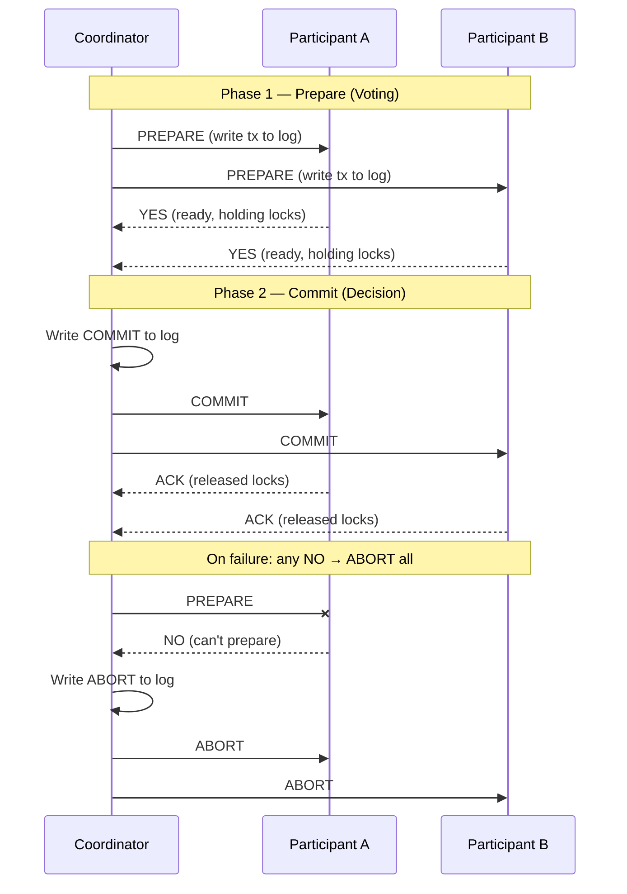

# Distributed Consensus: From 2PC to Raft to BFT

*As a Distributed Systems Researcher who has contributed to the Raft consensus algorithm and implemented production-grade consensus engines at scale, I will guide you through the hard problems that most engineers never encounter until 3 AM after a cluster-wide outage. This module covers transaction coordination, leader-based and leaderless consensus, quorum math, and real-world consensus failures.*

> **Prerequisites:** This module assumes you have read the beginner-friendly [Module 12 guide](12-distributed-consensus.md) and understand 2PC, 3PC, Raft, Dynamo-style consensus, vector clocks, and split-brain. You should also understand [Module 09 — Microservices Patterns](09-microservices-patterns.md) for the transaction coordination context.

---

## Table of Contents

1. [Transaction Coordination Problem](#1-transaction-coordination-problem)
2. [Leader-Based Consensus (Raft)](#2-leader-based-consensus-raft)
3. [Leaderless Consensus & Resolution](#3-leaderless-consensus--resolution)
4. [Real-World Failure Modes](#4-real-world-failure-modes)
5. [Teacher's Corner](#5-teachers-corner)
6. [Glossary of Key Terms](#6-glossary-of-key-terms)
7. [Key Takeaways](#7-key-takeaways)

---

## 1. Transaction Coordination Problem



### Two-Phase Commit (2PC) — The Blocking Protocol

2PC coordinates atomic commitment across multiple participants. The protocol has two phases:

**Phase 1 — Prepare (Voting):**
1. Coordinator sends `PREPARE` to all participants.
2. Each participant writes the transaction to a durable log (prepare state) and responds `YES` (ready) or `NO` (abort).
3. If a participant votes `YES`, it enters the "prepared" state — it has committed to follow the coordinator's decision, whatever it may be. It holds locks on the transaction's resources.

**Phase 2 — Commit/Abort (Decision):**
1. If all participants voted `YES`, the coordinator writes a `COMMIT` record to its log and sends `COMMIT` to all participants.
2. If any participant voted `NO` or timed out, the coordinator writes `ABORT` and sends `ABORT`.
3. Participants receive the decision, apply it, and release locks.

**The blocking problem:** A participant that voted `YES` cannot unilaterally decide. If the coordinator crashes before sending the decision, the participant holds its locks indefinitely. The resources (rows, files, connections) remain locked until the coordinator recovers.

**The window of vulnerability:** Between voting `YES` and receiving the decision, the participant is in a blocking state. In practice, system administrators must manually inspect logs and force-unlock resources — a multi-hour operational emergency.

### Three-Phase Commit (3PC) — Non-blocking in Theory

3PC adds a third phase (Pre-Commit) to enable timeout-based unilateral decisions:

```
2PC:  Prepare → Commit/Abort
3PC:  Prepare → Pre-Commit → Commit/Abort
```

**The Pre-Commit phase:** After receiving all `YES` votes, the coordinator sends `PRE_COMMIT` to all participants. This tells them: "A majority of participants have agreed to commit. If you don't hear the final decision within a timeout, you can commit unilaterally."

**Why 3PC is non-blocking (under specific assumptions):**

- If a participant receives `PRE_COMMIT` but not the final `COMMIT`, it knows a majority voted YES. It can unilaterally commit after a timeout.
- If a participant voted `YES` but never received `PRE_COMMIT`, it knows the coordinator failed before disseminating the majority agreement. It can unilaterally abort.

**Why 3PC is rarely used in practice:**

1. **Network partitions still break it.** If the coordinator is partitioned from some participants but not others, different participants may reach different decisions — violating atomicity.
2. **Extra round-trip latency.** Each transaction requires 3 network rounds instead of 2.
3. **Implementation complexity.** The timeout logic and state machine transitions are error-prone.

**Practical reality:** Most production systems either use 2PC with a highly available coordinator (replicated via Raft) or bypass distributed transactions entirely using Sagas. Google's Spanner uses 2PC but runs the coordinator on a Raft-replicated state machine for fault tolerance. This gives the blocking-free property of 3PC with the simplicity of 2PC.

---

## 2. Leader-Based Consensus (Raft)

Raft is designed for **Crash Fault Tolerance (CFT)** — it assumes nodes crash and recover, but never lie or behave maliciously. For systems where nodes may be adversarial (blockchain, financial settlement), you need Byzantine Fault Tolerance (BFT).

### Leader Election

Raft divides time into **terms**. Each term starts with an election. If a follower does not receive a heartbeat from the leader within the election timeout, it transitions to **candidate** and starts a new term.

**The election algorithm:**
1. Candidate increments its term and votes for itself.
2. Candidate sends `RequestVote RPC` to all other servers.
3. Each server votes for the first candidate it receives a request from in that term, provided the candidate's log is at least as up-to-date as the server's.
4. If the candidate receives votes from a majority (`⌊N/2⌋ + 1`), it becomes leader.
5. The new leader sends heartbeats to establish authority.

**Randomized timeouts prevent split votes:** Each server picks a random timeout in [150ms, 300ms]. This ensures that when the leader fails, one candidate's timeout expires first, and it initiates an election before other candidates' timeouts expire. Probability of a tied election with 3 nodes: <1%.

**Safety property:** At most one leader per term. Even during a network partition, only one node (in the majority side) can be elected.

### Log Replication

Once elected, the leader is the sole authority for log entry ordering:

1. Clients send all writes to the leader.
2. Leader appends the write command to its local log.
3. Leader sends `AppendEntries RPC` (with the new entry) to all followers.
4. Followers append the entry to their logs and acknowledge.
5. When the leader receives acknowledgments from a majority, it **commits** the entry (applies it to the state machine).
6. Leader commits the entry in its own state machine and responds to the client.
7. Leader notifies followers of the committed entry in subsequent heartbeats.

**Log matching property:** If two logs contain an entry with the same term and index, the entries are identical, and all earlier entries are also identical. This is enforced by the `AppendEntries` consistency check: the follower checks that the previous log entry (at prevLogIndex) matches — same term and index — before accepting new entries.

### Quorum Math

A **quorum** is the minimum number of nodes required to agree on a decision.

```
Majority quorum: Q = ⌊N/2⌋ + 1
Survival: N − Q = ⌊(N − 1)/2⌋ simultaneous failures tolerated
```

| Cluster Size | Majority | Failures Tolerated | Read Quorum (strong) | Write Quorum |
|-------------|----------|--------------------|---------------------|--------------|
| 1 | 1 | 0 | 1 | 1 |
| 3 | 2 | 1 | 2 | 2 |
| 5 | 3 | 2 | 3 | 3 |
| 7 | 4 | 3 | 4 | 4 |

**Why majority ensures safety:** Any two majority sets overlap by at least one node. This guarantees that no two disjoint groups can independently decide different values. If a leader commits an entry, any future leader must have that entry in its log (because the future leader's majority set shares at least one node with the previous majority set).

**The trade-off:** Larger clusters tolerate more failures but have higher commit latency (leader must wait for more ACKs). The sweet spot for most Raft deployments is 5 nodes — tolerates 2 failures with a healthy majority of 3.

### Write Performance vs Cluster Size

```
Latency to commit = 2 × RTT_median (leader → follower ACK)
5 nodes: leader waits for 3 ACKs, uses the slowest of the fastest 2 followers
7 nodes: leader waits for 4 ACKs, uses the slowest of the fastest 3 followers
```

With 5 nodes at p99 network RTT of 10ms, commit latency ≈ 2 × 10ms = 20ms. With 7 nodes, commit latency increases slightly because the leader must wait for a slower 3rd follower's ACK.

---

## 3. Leaderless Consensus & Resolution

### Dynamo's Decentralized Model

Amazon Dynamo (2007 SOSP paper) introduced a fully decentralized, leaderless architecture. Every node is equal. The key insight: for shopping cart data (which is per-customer and tolerates brief inconsistency), leaderless consensus provides higher availability than Raft.

**The NWR model:**

| Parameter | Meaning | Shopping Cart Example |
|-----------|---------|----------------------|
| N (Replication) | How many replicas store each key | 3 (each cart on 3 nodes) |
| W (Write quorum) | How many must ack a write | 2 (2 of 3 must confirm) |
| R (Read quorum) | How many must respond to a read | 2 (2 of 3 must respond) |

**Condition for strong consistency:** `R + W > N`. With N=3, W=2, R=2: `2+2=4 > 3` — strong consistency. But you can choose weaker settings: W=1, R=1 gives highest availability but no consistency guarantee.

**Performance characteristic:** Write latency is the slowest of the fastest W nodes. Read latency is the slowest of the fastest R nodes. This is strictly faster than Raft's leader-based approach because reads and writes can go to the nearest replica.

### Vector Clocks

Vector clocks detect causality between conflicting versions:

A vector clock is a list of `(node, counter)` pairs. When a node updates a value, it increments its own counter.

```
Initial: A:1
A writes: (A:2)  ← new version
B writes: (B:1)  ← concurrent with (A:2) from A's perspective
```

**Comparing vector clocks:**
- `A:1 ≤ A:2` (A's version dominates A:1 → causally after)
- `A:2 ∥ B:1` (neither dominates → concurrent → conflict)

**Conflict detection:** A read returning multiple versions (siblings) with non-dominating clocks indicates a conflict. The application must resolve (CRDT merge, last-write-wins, or user-prompted).

### Read-Repair and Hinted Handoff

**Read-repair:** On a read, if the responding replicas have stale versions, the coordinator updates the stale replicas with the latest version. This is passive — it only repairs data that is actually read.

**Hinted handoff:** If the preferred replica for a write is unreachable (partitioned), the coordinator accepts the write and stores a "hint" — a note that a different node holds the data on behalf of the primary. When the primary recovers, the hint is delivered.

These mechanisms give Dynamo-style systems their key property: **always-writable**. You never get a "write failed" error as long as at least one node is reachable. The cost: eventual consistency and conflict resolution complexity.

### CFT vs BFT

| Dimension | CFT (Paxos/Raft) | BFT (PBFT/HotStuff) |
|-----------|-----------------|---------------------|
| Fault model | Crash only (nodes stop) | Byzantine (nodes may lie) |
| Fault tolerance | `⌊N/2⌋` crash failures | `⌊(N-1)/3⌋` Byzantine failures |
| Minimum cluster | 3 for 1 crash | 4 for 1 Byzantine |
| Message complexity | `O(N)` per round | `O(N²)` per round (view change) |
| Throughput | Very high (leader-driven) | Lower (crypto overhead) |
| Applications | etcd, Consul, ZooKeeper, Spanner | Blockchain (Libra, Diem), NASDAQ |

**The cost of Byzantine tolerance:** BFT requires `3f+1` nodes to tolerate `f` failures (vs `2f+1` for CFT). Each message must be signed and verified. Network overhead is quadratic in node count. Practical BFT systems rarely exceed 100 nodes.

---

## 4. Real-World Failure Modes

### Split-Brain

**Scenario:** A 5-node Raft cluster experiences a network partition: 3 nodes on one side, 2 on the other. The 3-node side elects a leader and continues accepting writes. The 2-node side cannot form a majority (needs 3) — clients connecting to those nodes get "no leader" errors.

**On partition heal:** The 2-node side realizes the 3-node side has a higher term (because the 3-node side's leader was elected in a new term). The 2 nodes revert to followers and accept the 3-node side's leader. All writes from the majority side persist. The minority side's data (if any was accepted) is discarded.

**True split-brain (bad configuration):** A 4-node cluster with `minimum_master_nodes=2` (half, not majority). A partition creates two 2-node groups. Each group has 2 votes — each elects a leader. Both leaders accept writes. When the partition heals, there are two divergent histories that Raft cannot reconcile. The cluster has permanently diverged.

**Prevention:** Always set quorum thresholds to `⌊N/2⌋ + 1`. Ensure cluster size is odd (3, 5, 7). Use a witness node exactly when `N` must be even.

### Election Storms

**Scenario:** 100% CPU utilization on etcd nodes causes heartbeat processing to be delayed. The election timeout (500ms) expires before the heartbeat is processed. A new election starts. Election traffic increases CPU further. More heartbeats are missed. More elections cascade.

**Root cause:** Violation of the Raft safety inequality:
```
broadcastTime ≪ electionTimeout ≪ MTBF
```

- `broadcastTime`: time to send RPCs to all followers and receive responses (typically 1-10ms).
- `electionTimeout`: time a follower waits before starting an election (typically 150-300ms).
- `MTBF`: Mean Time Between Failures for individual servers (typically weeks to months).

When `broadcastTime` approaches `electionTimeout` (due to node overload), the inequality is violated.

**Production incident:** In 2017, a Kubernetes cluster with 2000+ pods caused etcd's disk sync time to spike from 2ms to 300ms during a rolling upgrade. The election timeout was 500ms. With disk sync approaching the timeout, heartbeats were consistently late. The cluster entered an election storm with 47 leader changes in 5 minutes. The Kubernetes API server became unavailable for 25 minutes.

**Fix:** Ensure `electionTimeout` is at least 10× the expected `broadcastTime` under peak load. Use dedicated CPU and fast SSDs for consensus nodes. Set `etcd --heartbeat-interval` and `--election-timeout` appropriately (e.g., 100ms heartbeat, 1000ms election timeout for high-latency environments).

### Stale Leader Re-joining After Partition

**Scenario:** Network partition separates Node A (old leader) from the rest. The majority side (Nodes B, C) elects a new leader (Node B). Node A continues to think it is the leader (it has no higher term to observe). Node A accepts writes from clients.

**On heal:** Node A receives a heartbeat from Node B with a higher term. Node A realizes it was partitioned and reverts to follower. The writes Node A accepted during the partition (with its stale term) are discarded — they were never replicated to a majority.

**Safety property violated?** No — Raft guarantees that a leader only commits entries replicated to a majority. Node A's uncommitted entries are discarded. Clients that received "acknowledged" from Node A during the partition will see their writes disappear.

**Mitigation:** Clients should use idempotency keys. When the write is not committed (because the leader lost authority), the client retries, and the new leader sees the same idempotency key. This prevents duplicate charges or double-created resources.

---

## 5. Teacher's Corner

### Question 1: Stale Leader Re-joining

**Problem:** A 5-node Raft cluster suffers a network partition. Node 1 (leader) is isolated. Nodes 2-5 elect Node 2 as the new leader. During the partition, Node 1 accepts write "set X=5" from a client (uncommitted, not replicated). Node 2's side accepts write "set X=10" (committed, replicated to majority). The partition heals. Trace step-by-step what happens to Node 1's uncommitted entry.

**Solution:**

1. Node 1 receives a heartbeat from Node 2 with a higher term (e.g., Node 1's term was 3, Node 2's term is 4).
2. Node 1 steps down — it reverts from leader to follower.
3. Node 1 discovers that its log has an uncommitted entry (term 3, "set X=5") that Node 2's log does not have.
4. Node 2's `AppendEntries` consistency check fails at the point where Node 1's log diverges. Node 2 tells Node 1 to truncate its log from that point.
5. Node 1 truncates the uncommitted entry "set X=5".
6. Node 2 replicates its committed entries (including "set X=10") to Node 1.
7. Node 1's state machine now shows X=10. The client that wrote X=5 received a success response but the write was lost.

**Lessons:** Raft preserves committed entries (replicated to majority) and discards uncommitted ones. Clients experiencing a leader change may have writes silently dropped. Use idempotency keys and read-after-write consistency checks.

### Question 2: Vector Clock Truncation Risk

**Problem:** Your Dynamo-style database uses vector clocks for conflict detection. Over time, the vector clock for a popular key grows to 100 entries (one per node that ever touched it). You implement clock truncation: when the clock exceeds 20 entries, prune the oldest entries. Explain the risk.

**Solution:** Vector clock truncation removes causality information. If you prune entries, you may conflate causally-related updates:

```
Before truncation:
  Clock: [A:10, B:5, C:3, D:2, E:1]
  Entry D:2 and E:1 are pruned
After truncation:
  Clock: [A:10, B:5, C:3]
```

Now a new update on node D arrives with clock `[A:9, D:3]`. The system compares: `[A:10, B:5, C:3] vs [A:9, D:3]`. Neither dominates (A:10 > A:9, but B:5 and C:3 are unknown to the second clock). This is detected as a **conflict** — a false positive.

The old update (D:2 → E:1 → A:10) was actually causally after A:9, but because D:2 was pruned, the system cannot detect the causal relationship. It treats them as concurrent and requires application-level merge.

**Mitigation:** CRDTs (Conflict-free Replicated Data Types) avoid vector clock growth by using mergeable data structures that don't need causality tracking. Use CRDTs (e.g., counters, sets, registers) instead of raw vector clocks when possible.

### Question 3: Quorum Tuning for Write Availability

**Problem:** Your Dynamo-style shopping cart database (N=3) needs the highest possible write availability. Should you set W=1, W=2, or W=3? Explain the trade-off for each setting. Which would you choose and why?

**Solution:**

| Setting | Write Availability | Consistency Risk |
|---------|-------------------|------------------|
| W=1 | Tolerates 2 node failures | Write is accepted by 1 node. If that node fails before replicating, write is lost. Reads may see stale data. |
| W=2 | Tolerates 1 node failure | Write acknowledged by 2 of 3. Survives 1 failure. Higher assurance than W=1. |
| W=3 | Tolerates 0 node failures | All 3 nodes must ack. Any single node failure blocks writes. |

**Recommendation: W=2** for shopping cart data. The trade-off:

- **Benefit:** Writes survive any single-node failure. A second simultaneous failure during the first failure's recovery window is rare.
- **Cost:** A single node failure reduces write availability (only 2 remaining nodes must both ack). But as long as any 2 of 3 are up, writes succeed.
- **Mitigation for lost writes:** Vector clocks detect conflicts during reads. If a write was accepted by only 1 node (e.g., during a double failure scenario), the read may expose a stale version, but the conflict is detected and the application (or user) resolves it.

**Do not use W=1** for anything that must not lose writes. W=1 means "write if any one node accepts" — a single node restart flushes its un-replicated buffer, and the write disappears.

---

## 6. Glossary of Key Terms

| Term | Section | Definition |
|------|---------|------------|
| 2PC (Two-Phase Commit) | 1 | Atomic commitment protocol with Prepare and Commit phases; blocking on coordinator crash |
| 3PC (Three-Phase Commit) | 1 | Non-blocking variant with an extra Pre-Commit phase; rarely used in practice |
| Raft | 2 | Leader-based consensus algorithm with randomized elections and majority commits |
| Term | 2 | A logical epoch in Raft; each election creates a new term |
| Quorum | 2 | Minimum number of nodes required to agree for a decision to be valid |
| Majority | 2 | Quorum = `⌊N/2⌋ + 1`; ensures any two quorums intersect |
| AppendEntries | 2 | Raft RPC that replicates log entries from leader to followers |
| Vector Clock | 3 | Data structure tracking version counters per node for causality detection |
| Sibling | 3 | Conflict detected when two versions have non-dominating vector clocks |
| Read-Repair | 3 | Updating stale replicas with the latest version during a read operation |
| Hinted Handoff | 3 | Temporary write storage on a non-owner node, delivered when the owner recovers |
| CFT (Crash Fault Tolerance) | 3 | Consensus that handles nodes crashing but not malicious behavior |
| BFT (Byzantine Fault Tolerance) | 3 | Consensus that handles nodes that may lie or act maliciously |
| PBFT (Practical Byzantine Fault Tolerance) | 3 | The first practical BFT algorithm; `O(N²)` message complexity |
| Split-Brain | 4 | Two partitions independently electing leaders, causing data divergence |
| Election Storm | 4 | Cascading leader elections caused by heartbeats arriving late due to system overload |
| CRDT (Conflict-free Replicated Data Type) | 5 | A data structure that guarantees conflict-free merging without vector clocks |

---

## 7. Key Takeaways

1. **2PC is the blocking protocol.** The coordinator crash during Prepare locks participants indefinitely. Use only with a highly available coordinator (Raft-replicated).

2. **3PC is theoretically non-blocking but practically irrelevant.** Network partitions break its safety guarantees. Prefer 2PC + replicated coordinator or Sagas.

3. **Raft's safety depends on the log matching property.** Two entries with the same (term, index) are identical, and all prior entries are identical. This ensures that committed entries survive leader changes.

4. **Quorum = `⌊N/2⌋ + 1` ensures safety through intersection.** Any two majority sets overlap by at least one node. This prevents disconnected groups from making conflicting decisions.

5. **Always deploy an odd number of nodes.** 3 tolerates 1 failure, 5 tolerates 2, 7 tolerates 3. Even numbers provide no additional fault tolerance.

6. **Leaderless consensus (Dynamo) trades consistency for availability.** NWR tuning lets you choose where on the consistency-availability spectrum you operate.

7. **Vector clocks detect conflicts but grow unboundedly.** Truncation causes false-positive conflicts. Use CRDTs for simpler conflict-free merging.

8. **CFT vs BFT is a trust question.** CFT is sufficient for internal systems where nodes are controlled. BFT is needed for adversarial environments.

9. **Split-brain is prevented by correct quorum math, not by accident.** A 4-node cluster with `minimum_master_nodes=2` will experience true split-brain. Use `⌊N/2⌋ + 1`.

10. **Election storms happen when the Raft safety inequality is violated.** Ensure `broadcastTime ≪ electionTimeout ≪ MTBF`. Monitor election frequency and heartbeat latency.

11. **Stale leaders discard uncommitted writes on rejoin.** This is a safety feature, not a bug. Clients must use idempotency keys to retry writes safely after leader changes.

---

> This guide provides the advanced engineering depth for distributed consensus protocols.
> For the foundational concepts, refer to the beginner-friendly [Module 12 guide](12-distributed-consensus.md).
> Remember: consensus is not a feature — it is a deep assumption about how your system survives failure. Get it wrong, and no amount of testing will save you.

---

*Ready to proceed? Continue to [Module 13 — Capacity Planning Advanced](13-capacity-planning-advanced.md).*
