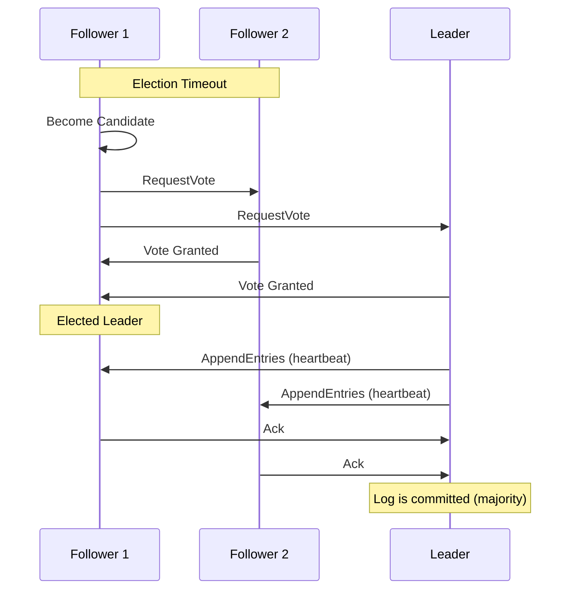

# Distributed Transactions & Consensus – A Beginner's Guide

**You've used this when...**

You transfer money from your bank account to a friend's account. The money leaves your account. Does it arrive in theirs? If your bank's server crashes mid-transfer, the money could be lost forever. Distributed consensus is what ensures that either both accounts are updated or neither is — the transaction either completes fully or not at all.

You use Kubernetes at work. A node running your critical service goes dark. Within seconds, the pod is rescheduled on another node. This works because etcd, Kubernetes' brain, uses the Raft consensus algorithm to agree on cluster state across multiple machines. Without consensus, K8s would not know which nodes are alive or where your pods should run.

You browse Instagram. If you like a post, you expect that like to persist. But Instagram runs on hundreds of servers across the globe. Distributed consensus protocols ensure that data remains consistent across replicas — even if a server crashes mid-write or a network cable is accidentally cut.

> This guide explains how multiple servers agree on a single truth even when some are failing, the network is broken, or messages are delayed.
> Every technical term is defined the first time it appears, and a full Glossary is at the end.
> Once you understand these foundations, the original advanced module will feel like a natural next step.
>
> **Before you start:** You should understand [Module 2: Database Scaling](/Docs/02-database-scaling.md) and [Module 4: Distributed Communication](/Docs/04-distributed-comm.md). If you haven't read those yet, start there.

---

## Table of Contents

1. [The Consensus Problem: Getting Multiple Machines to Agree](#1-the-consensus-problem-getting-multiple-machines-to-agree)
2. [Two-Phase Commit (2PC): All or Nothing](#2-two-phase-commit-2pc-all-or-nothing)
3. [Three-Phase Commit (3PC): Avoiding the Block](#3-three-phase-commit-3pc-avoiding-the-block)
4. [Raft: Electing a Leader](#4-raft-electing-a-leader)
5. [How Raft Replicates Data](#5-how-raft-replicates-data)
6. [Dynamo: Leaderless Consensus](#6-dynamo-leaderless-consensus)
7. [Vector Clocks: Detecting Conflicts](#7-vector-clocks-detecting-conflicts)
8. [Common Disasters and How to Avoid Them](#8-common-disasters-and-how-to-avoid-them)
9. [Putting It All Together — Keeping a Database Consistent Across Three Servers](#9-putting-it-all-together--keeping-a-database-consistent-across-three-servers)
10. [Glossary of Technical Terms](#10-glossary-of-technical-terms)
11. [Key Takeaways](#11-key-takeaways)

---

> **⏱ TL;DR — If you only learn 3 things from this module:**
> 1. **Distributed consensus is the art of getting unreliable machines to agree on a single truth** — without it, data is lost, systems diverge, and failures cascade.
> 2. **Raft is the most practical consensus algorithm for real systems** — it uses a strong leader, randomized elections, and majority quorums. It is what powers etcd, Consul, and many production databases.
> 3. **There is always a trade-off between consistency and availability** — 2PC blocks on failure, Raft tolerates crashes but pauses during elections, and Dynamo-style systems accept writes at the cost of eventual consistency and conflict resolution.

---

## 1. The Consensus Problem: Getting Multiple Machines to Agree

Imagine three friends (servers) keeping a shared diary. They all have copies, and they must agree on what is written. But:

- The phone line between them sometimes drops (network partition).
- One friend might fall asleep (server crash).
- A message might arrive after a long delay (latency).

The **consensus problem** is: *how do multiple machines agree on a single, coherent state despite network partitions, crashes, and delays?*

There are two families of solutions:
- **Leader-based consensus** (Raft): Elect one leader. The leader decides. Everyone follows the leader.
- **Leaderless consensus** (Dynamo): No leader. Every node can accept writes. Conflicts are resolved later.

---

## 2. Two-Phase Commit (2PC): All or Nothing

**Two-Phase Commit** is the classic protocol for ensuring that a transaction either succeeds on all servers or fails on all servers. It has two phases.

**Analogy:** A wedding ceremony. The officiant (coordinator) asks the audience: "Does anyone object?" (Phase 1 — Prepare). If nobody objects, the officiant says "I now pronounce you..." (Phase 2 — Commit). If anyone objects, the wedding is called off (Abort).

### Phase 1: Prepare
- The **Coordinator** sends a "prepare" message to all participants.
- Each participant prepares to commit (locks resources) and replies: "Yes" (ready) or "No" (abort).

### Phase 2: Commit or Abort
- If all participants replied "Yes", the coordinator sends "Commit". Everyone commits.
- If any participant replied "No" or timed out, the coordinator sends "Abort". Everyone aborts.

### The Blocking Problem

The fatal flaw: if a participant has voted "Yes" and the coordinator crashes before sending the final decision, that participant is **blocked**. It cannot unilaterally commit (others might have aborted) or abort (others might have committed). It holds its locks and waits for the coordinator to recover.

**Analogy:** The officiant asks "Does anyone object?" Nobody objects. But before the officiant can say "I now pronounce you," they faint. The guests freeze — they have already stated they have no objection, but they do not know whether the wedding is on or off.

In production, this means database rows remain locked, queue messages remain pending, and file handles remain open — waiting for a coordinator that may not come back.

---

## 3. Three-Phase Commit (3PC): Avoiding the Block

**Three-Phase Commit** adds an extra phase (Pre-Commit) to prevent blocking.

| Phase | 2PC | 3PC |
|-------|-----|-----|
| 1 | Prepare → vote | Prepare → vote |
| 2 | Commit / Abort | **Pre-Commit** (coordinator tells everyone: "a majority agreed") |
| 3 | — | Commit / Abort |

The extra phase gives participants enough information to decide unilaterally if the coordinator fails:

- If a participant received "Pre-Commit" and then the coordinator crashes, it knows a majority voted Yes. It can safely commit on a timeout.
- If a participant voted Yes but never received "Pre-Commit", it knows the coordinator failed early. It can safely abort.

**Reality check:** 3PC is rarely used in production. It is complex to implement correctly and can still fail under network partitions. Most systems prefer 2PC with a highly available coordinator (using Raft for the coordinator) or skip distributed transactions entirely in favor of Sagas.

---

## 4. Raft: Electing a Leader

**Raft** is a consensus algorithm designed to be understandable. It solves the agreement problem by having a **strong leader** that makes all decisions.

**Analogy:** Raft is like a parliamentary democracy. The leader (prime minister) is elected. Once elected, all decisions flow through the leader. If the leader becomes unreachable, a new election is held.

### The Three Roles

| Role | Description | Analogy |
|------|-------------|---------|
| **Leader** | The single authoritative node that accepts writes and replicates them | Prime Minister — makes all decisions |
| **Follower** | Passive nodes that replicate the leader's data | Cabinet members — approve the PM's proposals |
| **Candidate** | A follower that starts an election when it detects the leader is gone | Someone who calls for a new election |

### How Leader Election Works

1. All servers start as **followers**.
2. If a follower does not hear from the leader within a timeout (randomized, 150-300ms), it becomes a **candidate** and starts an election.
3. The candidate asks other servers for votes.
4. If it receives votes from a **majority** (`floor(N/2) + 1`), it becomes the **leader**.
5. The leader sends periodic heartbeats to maintain authority.
6. If the leader fails, followers detect the missing heartbeats and start a new election.

**Critical detail:** Election timeouts are **randomized** (each server picks a random timeout between 150-300ms). This prevents multiple candidates from starting elections simultaneously and splitting the vote forever.

---

## 5. How Raft Replicates Data

Once a leader is elected, all writes go through the leader:

1. **Client sends a write** (e.g., "set x = 5") to the leader.
2. The leader appends this command to its **log** (a file of pending operations).
3. The leader sends the log entry to all followers via `AppendEntries` RPC.
4. Each follower writes the entry to its own log and acknowledges.
5. When a **majority** of followers have acknowledged, the leader **commits** the entry (makes it visible to clients).
6. The leader tells the followers to commit.

**Why majority?** A majority (`N/2 + 1`) is the minimum number of nodes needed to guarantee that even if the current leader fails, any future leader will have seen the committed data. This is because majority sets always overlap — if you have 3 nodes, any 2 nodes always contain at least 1 node in common with any other 2 nodes.

---

## 6. Dynamo: Leaderless Consensus

Amazon's Dynamo (and its open-source descendants like Cassandra, Riak) takes a completely different approach: **there is no leader**. Any node can accept writes at any time.

**Analogy:** A whiteboard in a shared office where anyone can write. If two people write conflicting information at the same time, a third person later compares the two versions and merges them.

### Key Concepts

| Concept | What it means |
|---------|---------------|
| **N (Replication factor)** | How many nodes store each piece of data. N=3 means 3 copies. |
| **W (Write consistency)** | How many nodes must acknowledge a write before it is considered successful. W=2 means 2 out of 3 must confirm. |
| **R (Read consistency)** | How many nodes must respond to a read before returning the result. R=2 means query 2 of 3 nodes. |

For a system with N=3, W=2, R=2:
- A write succeeds when 2 of 3 nodes acknowledge. Even if 1 node is down, the write succeeds.
- A read queries 2 of 3 nodes. If they return different versions, the conflict is detected and resolved.

This gives **high availability**: the system can lose 1 node and still accept writes and reads.

### Choosing a Consensus Approach

| Approach | Use when... | Don't use when... |
|----------|-------------|-------------------|
| **2PC** | You need strong atomicity across a small number of participants and can accept blocking on coordinator failure. Short-lived transactions within a single datacenter. | You need high availability or low latency. The blocking problem means a single coordinator crash locks resources across all participants. Avoid when participants are geographically distributed. |
| **3PC** | You want to avoid the blocking problem of 2PC and have a synchronous network where partitions are rare. | Almost never. It is complex to implement, adds latency from the extra round-trip, and still breaks under network partitions. Prefer 2PC with a highly available coordinator or Raft instead. |
| **Raft** | You need crash-fault-tolerant consensus with strong consistency. Ideal for leader-based systems (distributed databases, configuration stores like etcd/Consul, replicated state machines). | You cannot tolerate brief write unavailability during leader elections (~ms to seconds). Avoid in adversarial environments where nodes may lie (use BFT instead). |
| **Dynamo-style** | You need maximum write availability (accept writes even during network partitions). Suitable for systems that tolerate eventual consistency (shopping carts, content delivery, DNS). | You need strict serializability or when conflicting writes would cause business-critical data loss. Avoid if your application logic cannot handle conflict resolution (vector clocks, CRDTs). |

---

## 7. Vector Clocks: Detecting Conflicts

When multiple nodes can accept writes without coordinating, conflicts are inevitable. How do you detect them?

A **vector clock** is like a version counter attached to each piece of data. It tracks which node has made how many updates.

### Example: Shopping Cart

1. **Initial state:** Cart is empty. Vector clock: `{A:1}` (Server A initialized it).
2. **Adding "book":** Server B handles the update. Clock: `{A:1, B:1}`.
3. **Adding "pen" (concurrently):** Server C handles another update from the same initial state. Clock: `{A:1, C:1}`.
4. **Comparing:** Is `{A:1, B:1}` ≥ `{A:1, C:1}`? No — B has a higher count (1 vs 0), but C has a higher count (1 vs 0). Neither clock completely dominates. These are **siblings** — a conflict.
5. **Resolution:** The application merges the carts: `["book", "pen"]`. New clock: `{A:1, B:1, C:1}`.

**Why not just use "last write wins"?** Because that would silently discard one update. If two users simultaneously add items to the same shopping cart, last-write-wins would lose one item. Vector clocks allow the system to detect the conflict and let the application merge intelligently.

---

> **✏️ Check Your Understanding**
> 1. You run a 3-node Raft cluster. One node fails due to a hardware fault. Can the cluster still accept writes? Why or why not?
> 2. An e-commerce database uses 2PC to coordinate a payment and inventory deduction across two services. The coordinator crashes after receiving all "Yes" votes but before sending the commit. What happens to the inventory row locks?
> 3. Your Dynamo-style database (N=3, W=2, R=2) has a network partition that splits off 1 node while you write to the remaining 2 nodes. A client then reads with R=2 — what happens if one of the responding nodes has not yet received the write?
> 

> 
Answers

> 1. **Yes.** A 3-node cluster tolerates 1 failure. The remaining 2 nodes form a majority (2 of 3) and can continue accepting writes and electing a new leader if needed.
> 2. **The inventory row locks remain held.** The participants voted "Yes" but are blocked — they cannot unilaterally commit (others might have aborted) or abort (others might have committed). They must wait for the coordinator to recover. This is the blocking problem of 2PC.
> 3. **The query returns whichever version the majority of responded nodes have.** With R=2, you query 2 nodes. If one has the new write and the other does not, read-repair kicks in: the stale node is updated, and the client gets the latest version.
> 

---

## 8. Common Disasters and How to Avoid Them

### Split-Brain in Elasticsearch
**Symptom:** A 6-node Elasticsearch cluster with `minimum_master_nodes: 3` experiences a network partition into two groups of 3. Each group elects its own master. Both groups accept writes independently. When the network heals, data is divergent and irreconcilable — queries return inconsistent results and data may be unrecoverable.
**Root Cause:** The `minimum_master_nodes` was set to `N/2` (3 out of 6) instead of a strict majority (`N/2 + 1 = 4`). With 3 nodes in each partition, both groups met the threshold and independently elected a master.
**Real Incident:** Multiple large-scale Elasticsearch outages have been caused by split-brain, including incidents at LinkedIn and Netflix where clusters became unrecoverable after network partitions, requiring restoration from snapshots.
**Fix:** Set `minimum_master_nodes` to `N/2 + 1` (4 for a 6-node cluster). Use a dedicated tiebreaker or witness node if needed. In modern Elasticsearch versions, use the voting configuration exclusions API instead.
**How to Detect Early:** Monitor `elasticsearch_discovery_zen_master_elected`. A sudden spike in master elections indicates potential split-brain. Alert on any period where multiple masters are reported as elected.

### The etcd Election Storm
**Symptom:** etcd (Kubernetes' consensus store) experiences a cascading failure: heartbeats arrive late due to resource throttling, triggering leader elections. Each election generates more disk I/O and network traffic, slowing heartbeats further, triggering more elections. In production incidents, 47 leader elections occurred in 5 minutes, causing the Kubernetes API server to stop responding entirely.
**Root Cause:** Quality of Service (QoS) throttling slowed heartbeat messages below the election timeout threshold. The system violated the Raft safety rule: `broadcastTime ≪ electionTimeout ≪ MTBF`. When the election timeout is not sufficiently larger than the heartbeat interval, transient slowdowns trigger false elections.
**Real Incident:** A production Kubernetes cluster at a major cloud provider experienced total API unavailability when etcd entered an election storm loop under CPU throttling. The cluster required manual intervention to recover.
**Fix:** Ensure `broadcastTime ≪ electionTimeout ≪ MTBF`. Set election timeouts to at least 10× the expected heartbeat round-trip time. Use dedicated CPU resources for etcd nodes to prevent QoS throttling from affecting heartbeat timing.
**How to Detect Early:** Monitor `etcd_server_leader_changes_seen_total`. A rate of more than 1 leader change per minute is abnormal. Alert on any sustained increase in election count.

### 2-Node Raft Cluster
**Symptom:** A Raft cluster with exactly 2 nodes. One node fails. The remaining node cannot form a majority (needs 2 of 2, only has 1). The entire system stops accepting writes and electing leaders. Read-only operations may still work depending on configuration.
**Root Cause:** A 2-node cluster has no fault tolerance. The majority threshold is `floor(2/2) + 1 = 2` nodes. If either node fails, the remaining 1 node cannot reach 2. The cluster is stuck.
**Real Incident:** This is a common rookie mistake in production deployments. Multiple startups have deployed 2-node etcd or Consul clusters and discovered during an outage that their "highly available" configuration was actually a single point of failure.
**Fix:** Always run an odd number of nodes (3, 5, or 7). A 3-node cluster tolerates 1 failure. A 5-node cluster tolerates 2. Never deploy a 2-node Raft cluster in production.
**How to Detect Early:** Review cluster sizing before deployment. Monitor the number of etcd/Consul cluster members. Alert if the cluster size is even (2, 4, 6) instead of odd (3, 5, 7).

### The `alg: none` of Consensus
**Symptom:** A database cluster accepts writes that have not been acknowledged by a majority of nodes. A leader crashes after accepting a write locally but before replicating it. When a new leader is elected, the write is lost. The client believes the write succeeded, but the data is gone.
**Root Cause:** The system was configured without strict quorum enforcement — writes committed with fewer than a majority of acknowledgments. This is the consensus equivalent of the JWT `alg: none` vulnerability: the safety check was disabled.
**Real Incident:** MongoDB suffered from this issue before version 3.0 with its default write concern. A primary could acknowledge a write that had not been replicated to a majority. If the primary failed, the write would disappear when a new primary was elected.
**Fix:** Always enforce strict quorum writes. In MongoDB, set `writeConcern: majority`. In Raft-based systems, never accept a write as committed until a majority of nodes have acknowledged it.
**How to Detect Early:** Audit write concern and consistency settings in your database and consensus configurations. A sudden drop in write latency may indicate quorum checks have been disabled.

---

## 9. Putting It All Together — Keeping a Database Consistent Across Three Servers

Let's trace a write to a replicated database using Raft:

1. **Client sends a write** to the Raft cluster's known leader (Node 1).
2. The leader appends the write to its log and sends it to Node 2 and Node 3.
3. Node 2 receives the entry and acknowledges. Node 3 is slow (maybe under load).
4. The leader has received 2 of 3 acknowledgments — a majority. It commits the entry and responds to the client: "Write successful."
5. The leader tells both followers to commit. Node 2 commits. Node 3 eventually receives the entry, acknowledges, and commits.
6. **Now the leader (Node 1) fails.**
7. Node 2 detects the missing heartbeats (after a random timeout of ~200ms). It becomes a candidate.
8. Node 2 asks Node 3 for a vote. Node 3 votes for Node 2.
9. Node 2 wins with 2 of 2 votes (a majority of the remaining 2 nodes). It becomes the new leader.
10. Node 2's log contains the committed entry. The client's write is safe.
11. When Node 1 recovers, it rejoins as a follower. Node 2 catches it up on any entries it missed.

The write was never lost. The cluster survived a leader failure. The client experienced only a brief delay during the election.

---

> **🧪 Conceptual Exercises**
> 1. **Airline Booking System:** You are designing a distributed airline reservation system with 5 data-center regions. A customer books a flight — this requires checking seat availability, reserving the seat, and processing payment. Analyze whether 2PC, Raft, or Dynamo-style consensus is most appropriate for the booking transaction. What happens if the payment processing datacenter becomes unreachable mid-transaction?
> 2. **Distributed Like Counter:** Design a mechanism to maintain an accurate "like count" for a viral social media post receiving 1 million concurrent likes across 3 data centers. The count must be eventually accurate, but availability is critical. Compare how Raft and Dynamo-style approaches would handle this. What happens to the count during a 30-second network partition?
> 

> 
Hints

> 1. Bookings have strong consistency requirements (double-booking must be impossible), but the system also needs high availability. Consider combining Raft for seat inventory within each region with a saga pattern across regions. What happens to the customer if the coordinator crashes after payment but before seat confirmation?
> 2. Raft's single-leader approach creates a bottleneck — every like must go through one node, limiting throughput. Dynamo-style allows all nodes to accept writes but can over-count during partitions. Consider CRDT-based counters (G-Counter, PN-Counter) that provide automatic conflict-free merging as an alternative.
> 

---

## 10. Glossary of Technical Terms

| Term | Section | Definition |
|------|---------|------------|
| **Consensus** | 1 | The process of multiple servers agreeing on a single value or sequence of operations. |
| **Network Partition** | 1 | A condition where some nodes cannot communicate with others. |
| **2PC (Two-Phase Commit)** | 2 | A protocol for atomic transactions across multiple nodes. Can block during coordinator failure. |
| **Coordinator** | 2 | The node managing a 2PC or 3PC transaction. |
| **Commit** | 2 | Making a log entry visible to clients (permanent). |
| **3PC (Three-Phase Commit)** | 3 | An extension of 2PC that adds a pre-commit phase to avoid blocking. Rarely used in practice. |
| **Raft** | 4 | A leader-based consensus algorithm designed for understandability. |
| **Leader** | 4 | The single authoritative node in Raft that accepts writes and replicates data. |
| **Follower** | 4 | A passive Raft node that replicates the leader's log. |
| **Candidate** | 4 | A Raft node that is holding an election. |
| **Election** | 4 | The process of selecting a new Raft leader. |
| **Heartbeat** | 4 | Periodic messages from the leader to followers to maintain authority. |
| **Term** | 4 | A logical time unit in Raft — each election starts a new term. |
| **Log** | 5 | An ordered sequence of commands that the leader replicates to followers. |
| **Majority / Quorum** | 5 | More than half of the nodes: `floor(N/2) + 1`. |
| **Quorum** | 5 | The minimum number of nodes needed to agree for a decision to be valid. |
| **Read-Repair** | 6 | In Dynamo, correcting stale replicas during a read operation. |
| **Vector Clock** | 7 | A data structure that tracks version history across nodes to detect conflicts. |
| **Split-Brain** | 8 | Two partitions each electing a leader and accepting writes, causing divergence. |
| **BFT (Byzantine Fault Tolerance)** | 11 | Consensus that tolerates nodes that intentionally lie or act maliciously. |
| **CFT (Crash Fault Tolerance)** | 11 | Consensus that tolerates nodes crashing but not malicious behavior. |

---

## 11. Key Takeaways

1. **Consensus = getting unreliable machines to agree.** There is no way around it in distributed systems.
2. **2PC is simple but blocking.** The coordinator crash during prepare locks resources across all participants.
3. **3PC avoids blocking** but is complex and rarely used. Most systems use 2PC with a replicated coordinator or skip distributed transactions entirely.
4. **Raft provides understandable consensus** with a strong leader, randomized elections, and majority-based commits.
5. **Raft elections must be randomized** to prevent vote-splitting. The timeout range (150-300ms) is essential.
6. **A Raft cluster needs an odd number of nodes** (3, 5, 7). 2 nodes provide zero fault tolerance.
7. **Dynamo-style consensus** trades strict consistency for availability. Any node can accept writes.
8. **Vector clocks detect conflicts** without losing data. Last-write-wins should never be used for critical data.
9. **Split-brain is prevented by quorum math**, not chance. A majority ensures at most one leader.
10. **Election storms happen when heartbeats are delayed.** Ensure heartbeat interval ≪ election timeout.
11. **Choose CFT or BFT based on trust.** CFT for internal systems (crash only), BFT for adversarial environments (blockchain, financial settlement).

---

> Once you're comfortable with these concepts, dive deeper in the [advanced companion module](12-distributed-consensus-advanced.md), where we cover Raft log matching safety proofs, 3PC failure semantics, Dynamo NWR tuning with vector clock truncation risks, CFT-vs-BFT trade-offs, and election storm incident postmortems.
> Remember: in a distributed system, agreeing on the truth is the hardest problem — and the most important one to get right.
