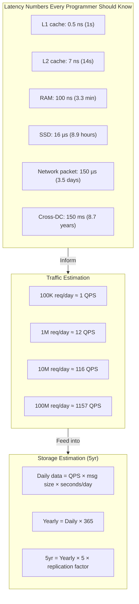

# Capacity Planning: Engineering at Google Scale

*As a Principal Engineer at Google who has served on capacity planning boards for products serving billions of users, I've seen more midnight pages from miscalculated capacity than from software bugs. This module turns the back-of-the-envelope estimations from the beginner guide into a disciplined, multi-dimensional planning framework used at FAANG scale.*

> **Prerequisites:** This module assumes you have read the beginner-friendly [Module 13 guide](13-capacity-planning.md) and understand QPS, storage, bandwidth, peak multipliers, and padding factors. You should also understand [Module 03 — Caching & Memory](03-caching-memory.md) for the cache sizing sections.

---

## Table of Contents

1. [Constants Every Programmer Must Know](#1-constants-every-programmer-must-know)
2. [Calculations Framework](#2-calculations-framework)
3. [Power of Two Rules](#3-power-of-two-rules)
4. [Worked Mock Exercise](#4-worked-mock-exercise)
5. [Teacher's Corner](#5-teachers-corner)
6. [Glossary of Key Terms](#6-glossary-of-key-terms)
7. [Key Takeaways](#7-key-takeaways)

---

## 1. Constants Every Programmer Must Know



These latencies are the fundamental building blocks of capacity estimation. Memorize them — every architecture decision flows from these numbers.

### The Latency Table

| Operation | Latency | Human Time Scale |
|-----------|---------|------------------|
| L1 cache reference | 0.5 ns | 1 second |
| Branch mispredict | 3 ns | 6 seconds |
| L2 cache reference | 7 ns | 14 seconds |
| Mutex lock/unlock | 25 ns | 50 seconds |
| Main memory (RAM) reference | 100 ns | 3.3 minutes |
| Compress 1 KB with Zippy | 3,000 ns (3 µs) | 1.7 hours |
| SSD random read | 16 µs | 8.9 hours |
| SSD sequential read (1 MB) | 49 µs | 1.1 days |
| Same data-center round trip | 0.5 ms | 11.6 days |
| HDD seek | 10 ms | 7.7 months |
| HDD sequential read (1 MB) | 20 ms | 15.4 months |
| Packet CA→Netherlands→CA | 150 ms | 9.5 years |
| HDD+seek+transfer (1 MB) | 30 ms | 23 years |

### What These Numbers Mean

**L1 vs Cross-DC:** L1 cache reference is **300,000,000× faster** than a cross-continental round trip. In human terms: a 1-second L1 access vs waiting 9.5 years for the response.

**SSD vs HDD for databases:** A random SSD read (16 µs) is 625× faster than an HDD seek (10 ms). In the human scale, that's reading a book in 9 hours vs waiting 7.7 months.

**The 10ms rule:** If a database query involves more than 10 sequential SSD reads (10 × 16µs = 160µs), the query is fast. If it involves 10 sequential HDD seeks (10 × 10ms = 100ms), the query is perceptibly slow to the user.

### The Network Gradient

| Distance | Round Trip | Analogy |
|----------|-----------|---------|
| Same rack | 0.1 ms | Walk to the next office |
| Same datacenter | 0.5 ms | Walk across campus |
| Same continent | 30 ms | Drive across the country |
| Cross-continent | 150 ms | Intercontinental flight |

**Architectural implication:** Services that cross datacenter boundaries incur a 500µs minimum penalty per call. A chain of 3 cross-DC calls = 1.5ms added to user-perceived latency. This is why Google and AWS build entire services within a single region and use async replication across regions.

---

## 2. Calculations Framework

### QPS Calculation

The fundamental equation:

```
QPS = DAU × Actions_per_User_per_Day / 86,400
```

**Traffic shortcuts (memorize these):**

| Daily Requests | Approximate QPS |
|----------------|----------------|
| 1 million | ~12 |
| 10 million | ~116 |
| 100 million | ~1,157 |
| 1 billion | ~11,574 |
| 10 billion | ~115,740 |

**Separate read QPS from write QPS.** They have different infrastructure requirements: reads benefit from caching and read replicas; writes require durable storage and often a message queue.

```
Read QPS  = DAU × avg_reads_per_user_per_day / 86,400
Write QPS = DAU × avg_writes_per_user_per_day / 86,400
```

### Storage Calculation (5-Year Horizon)

```
Daily_Volume = Write_QPS × 86,400 × Avg_Object_Size
Yearly_Volume = Daily_Volume × 365
Five_Year_Volume = Yearly_Volume × 5 × Padding × Replication
```

**Padding factors (choose one):**

| Environment | Padding | Rationale |
|-------------|---------|-----------|
| Established product, 2+ years of data | 1.2–1.5× | Historical growth trends are known |
| Growing product, <2 years | 2–3× | Growth may accelerate |
| New product, launch phase | 3–5× | Launch could 10× traffic in weeks |
| Regulatory/audit requirements | Include multiplier | Data retention laws may force keeping everything |

**Replication factor:** Database replicas are not optional. If you use Raft (3 nodes), factor is 3. If you use Dynamo-style (N=3), factor is 3. If you use primary-replica with 1 primary + 2 replicas, factor is 3. You cannot count on 0 failures.

### Bandwidth Calculation

```
Bandwidth (bps) = QPS × Avg_Response_Size × 8
Bandwidth (Gbps) = (QPS × Avg_Response_Size × 8) / 1,000,000,000
```

**Key insight:** Bandwidth is usually asymmetric. Ingress (writes) and egress (reads) must be calculated separately.

```
Ingress Gbps = Write_QPS × Avg_Request_Size × 8 / 1e9
Egress Gbps = Read_QPS × Avg_Response_Size × 8 / 1e9
```

**Peak bandwidth multiplier:** Same as peak QPS multiplier (2–5× for typical systems, 10× for launch events).

### RAM Calculation (80-20 Rule)

The working set is the subset of data accessed frequently. Pareto's principle: ~20% of data generates ~80% of reads.

```
Daily_Read_Data = Read_QPS × 86,400 × Avg_Object_Size
Working_Set = Daily_Read_Data × 0.20
Cache_RAM = Working_Set × Safety_Factor (1.5 to 2×)
```

**Example:** 10 TB read per day. Working set = 2 TB. Cache RAM needed = 3–4 TB (2 TB × 1.5–2×). A Redis cluster with 4 nodes at 1 TB each.

**Warning:** The 80-20 rule is an approximation. If your access pattern is truly random (no hot subset), the working set approaches 100% of data. Monitor actual cache hit ratios and adjust.

---

## 3. Power of Two Rules

### Data Unit Conversion (2^10 boundaries)

| Prefix | Power | Decimal | Good For |
|--------|-------|---------|----------|
| Kilo (KB) | 2^10 | 1,024 | Small text, API payloads |
| Mega (MB) | 2^20 | 1,048,576 | Images, documents |
| Giga (GB) | 2^30 | 1,073,741,824 | Memory, database size |
| Tera (TB) | 2^40 | ~1.1 × 10^12 | Large databases |
| Peta (PB) | 2^50 | ~1.13 × 10^15 | Data lakes, archives |
| Exa (EB) | 2^60 | ~1.15 × 10^18 | Global data stores |

**Quick rounding rule:** For capacity planning, round 2^30 ≈ 1 billion (error: 7.4%). This error is well within your padding factor. Do not waste time on precise 1024 vs 1000 conversions in an interview — the interviewer cares about order of magnitude, not exact bytes.

### Traffic Shortcuts

```
1M requests/day ≈ 12 QPS
100M requests/day ≈ 1,200 QPS
1B requests/day ≈ 12,000 QPS
10B requests/day ≈ 120,000 QPS
```

The relation is linear: `QPS ≈ Daily_Volume / 100,000`. Derivation: 86,400 seconds/day ≈ 100,000. So `QPS ≈ Daily_Volume / 100,000`.

### Peak Multipliers

```
Production peak:       2–3× average
Product launch:        5× average
Viral event:          10× average
DDoS / flash crowd:   50–100× average (mitigation required, not capacity)
```

**Never provision for average.** Always apply at least 2× peak multiplier to your QPS, bandwidth, and connection count estimates.

---

## 4. Worked Mock Exercise

### Problem: Photo-Sharing App (100M DAU)

**Assumptions:**

| Parameter | Value |
|-----------|-------|
| DAU | 100 million |
| Uploads/user/day | 1 photo (compressed 500 KB) |
| Views/user/day | 100 photos (lazy load 10 at a time) |
| Metadata/photo | 500 bytes |
| Retention | 5 years |
| DB replication | 3x (Raft-based NewSQL) |
| Object store | 2x (replication for hot tier) |
| Padding | 1.5x for known, 2x for unknowns |

**Step 1: QPS**

```
Write QPS = 100M × 1 / 86,400 ≈ 1,157 writes/sec
Read QPS  = 100M × 100 / 86,400 ≈ 115,740 reads/sec
Peak Write (3×) = 3,471 writes/sec
Peak Read (3×)  = 347,220 reads/sec
```

**Step 2: Storage (5 Years)**

Photo storage:
```
Daily: 100M × 1 × 500 KB = 50 TB
Yearly: 50 TB × 365 = 18.25 PB
5-year raw: 18.25 PB × 5 = 91.25 PB
5-year with 2x replication + 1.5x padding: 91.25 PB × 2 × 1.5 = 273.75 PB
```

Metadata storage:
```
Daily: 100M × 1 × 500 bytes = 50 GB
Yearly: 50 GB × 365 = 18.25 TB
5-year raw: 18.25 TB × 5 = 91.25 TB
5-year with 3x replication + 2x padding: 91.25 TB × 3 × 2 = 547.5 TB
```

**Step 3: Bandwidth**

```
Upload: 1,157 writes/sec × 500 KB × 8 = 4.6 Gbps (peak 13.8 Gbps)
Download: 115,740 reads/sec × 500 KB × 8 = 463 Gbps (peak 1.4 Tbps)
```

Download bandwidth of 1.4 Tbps peak is massive. This is where CDN serves each photo from edge caches, reducing origin load by ~95%. CDN capacity is rented per-GB egress, not provisioned.

**Step 4: RAM (Cache)**

```
Daily read = 100M × 100 photos × 500 KB = 5 PB read/day
Working set (20%) = 1 PB
Cache RAM (2x safety) = 2 PB
```

2 PB of cache RAM is expensive ($20M+ at $10/GB). Alternative: tiered caching. Hot photos (last 24 hours, ~500 TB) in RAM. Warm photos (last 30 days) in SSD-based cache (Redis on Flash or memcached on NVMe). Cold photos read from S3 with CDN edge caching.

**Step 5: Infrastructure Summary**

| Resource | Average | Peak | Provisioned |
|----------|---------|------|-------------|
| Write QPS | 1,157 | 3,471 | 5,000 (for headroom) |
| Read QPS | 115,740 | 347,220 | 400,000 |
| Photo storage | — | — | 275 PB (object store) |
| Metadata storage | — | — | 550 TB (NewSQL, sharded) |
| Upload bandwidth | 4.6 Gbps | 13.8 Gbps | 20 Gbps |
| Download bandwidth | 463 Gbps | 1.4 Tbps | CDN (pay-per-GB) |
| Cache RAM | — | — | 2 PB (tiered: RAM + SSD) |

**Bottleneck analysis:**

1. **Photo storage:** 275 PB of hot-tier object storage is an exabyte-scale system. Requires erasure coding (8+3) to keep raw storage at ~200 PB. Should use S3 or equivalent.

2. **Metadata DB:** 550 TB with 5K peak writes/sec. Single PostgreSQL cannot handle this. Requires sharding by user_id (100 shards = 5.5 TB per shard). Each shard on a 3-node Raft cluster.

3. **Download bandwidth:** 463 Gbps average, 1.4 Tbps peak. Cannot build this from origin. Must use CDN (CloudFront, Cloudflare) with 300+ edge locations.

4. **Cache:** 2 PB is too expensive for full-RAM. Use multi-tier: RAM for hottest 5% (100 TB), NVMe for next 15% (300 TB), direct-to-S3 for the rest.

---

## 5. Teacher's Corner

### Question 1: URL Shortener — 500M URLs per Month

**Problem:** Design capacity for a URL shortener serving 500 million new short URLs per month. Each URL maps to a 6-character short code (Base62). Average original URL length: 200 bytes. Read-to-write ratio: 100:1 (each short URL is read 100 times after creation). 5-year retention. Calculate total storage, read/write QPS, and cache RAM.

**Solution:**

```
Monthly writes: 500M URLs
Daily writes: 500M / 30 ≈ 16.67M URLs/day

Write QPS = 16.67M / 86,400 ≈ 193 writes/sec
Read QPS = 193 × 100 ≈ 19,300 reads/sec
Peak (3×): 579 writes/sec, 57,900 reads/sec

Storage per URL:
  Short code (6 chars): 6 bytes
  Original URL (avg): 200 bytes
  Created_at, user_id, metadata: 50 bytes
  Total: ~256 bytes per record
  Index overhead (~2×): ~500 bytes per record

Storage (5 years):
  Records in 5 years: 500M × 12 months × 5 = 30B URLs
  Raw data: 30B × 256 bytes = 7.68 TB
  With index overhead (2×): 15.36 TB
  With 3× replication + 1.5× padding: 15.36 × 3 × 1.5 = 69.12 TB

Cache RAM:
  Daily reads: 19,300 × 86,400 × 256 bytes = 427 GB
  Working set (20%): 85 GB
  Cache RAM (1.5× safety): 128 GB
```

**Conclusion:** A 3-node Raft database cluster with 70 TB SSDs and 128 GB Redis cache handles this easily. No sharding needed at this scale.

### Question 2: Video Streaming — 10K Concurrent Viewers at 5 Mbps

**Problem:** A live video platform has 10,000 concurrent viewers. Each viewer consumes 5 Mbps (720p stream). The platform transcodes each stream into 3 qualities (480p, 720p, 1080p). Calculate total egress bandwidth (Gbps), ingress bandwidth from the single streamer, and whether a single 10 Gbps server can handle the transcoding.

**Solution:**

```
Egress bandwidth:
  10,000 viewers × 5 Mbps = 50,000 Mbps = 50 Gbps
  Peak (2× flash crowd): 100 Gbps

Ingress bandwidth (from streamer):
  One streamer at maximum quality (1080p):
  Typical bitrate: 8 Mbps (1080p)
  Ingress bandwidth: 8 Mbps ≈ 0.008 Gbps (trivial)

Transcoding:
  Raw pixel processing: 1080p at 60fps = 1920×1080 × 60 × 3 (RGB) = 373 MB/s
  GPU-accelerated transcoding: ~100-200 MB/s per GPU
  Single server with 4 GPUs: can handle multiple simultaneous transcodes

  But: transcoding 1 input to 3 outputs:
  Input: 8 Mbps
  Outputs: 8 + 5 + 3 (1080p + 720p + 480p) = 16 Mbps total
  Per-server limit: ~100 simultaneous 1080p→3-output transcodes on a 4-GPU server

Storage (for recording):
  5 Mbps average × 86,400 seconds = 54 GB/day per stream
  100 simultaneous streams: 5.4 TB/day
  90-day retention: 486 TB (object storage with erasure coding → ~670 TB raw)
```

**Bottleneck:** Egress bandwidth at 50 Gbps cannot be handled by a single server (10 Gbps NIC limit). You need a CDN with 5+ edge nodes distributing the load. Transcoder needs GPU acceleration — CPU-only transcoding at this scale would require 20+ servers.

### Question 3: Social Network Profile — 2B Profile Requests per Day

**Problem:** A social network serves 2 billion profile page views per day. Each profile response is 1 KB (JSON, compressed). 20% of profiles account for 80% of views. 500 million DAU. Calculate total read QPS, cache RAM (working set), and whether the database read load is acceptable with caching.

**Solution:**

```
Read QPS = 2B / 86,400 ≈ 23,148 reads/sec
Peak (3×) = 69,444 reads/sec

Daily data served = 2B × 1 KB = 2 TB/day
Working set (20% of data, 80% of reads) = 2 TB × 0.20 = 400 GB

But that's wrong. Let's recalculate:
  Hot 20% of profiles get 80% of views:
  80% × 2B = 1.6B reads/day on the hot set
  Hot set size: 20% of ~1B profiles (total profiles) = 200M profiles
  Each profile: ~50 KB (full profile: name, photo URL, bio, etc.)
  But we only cache the response (1 KB JSON), not the full DB record.

Cache RAM:
  200M hot profiles × 1 KB response = 200 MB (trivial!)
  
Wait — that can't be right. The response is 1 KB, but we need to cache enough to serve the hot working set:
  Hot reads per day: 1.6B
  Hot reads per second: 1.6B / 86,400 ≈ 18,519 reads/sec
  Cache should hold the most frequently accessed profiles
  With 200M hot profiles at 1 KB each: 200 MB in cache
  With 10× safety (different response variants, languages): 2 GB

But the database also needs to handle the cold reads:
  20% of reads = 400M/day = 4,630 reads/sec (cold reads)
  With caching, only 5% of reads miss cache (95% hit rate):
  Cache miss rate: 5% × 23,148 ≈ 1,157 reads/sec to database
  A single well-provisioned PostgreSQL can handle 1,157 reads/sec (each ~1ms)

Database:
  Total profiles: 1B
  Profile record: 50 KB (full data)
  Storage: 1B × 50 KB = 50 TB
  With 3× replication + 1.5× padding: 50 × 3 × 1.5 = 225 TB
  Sharding by user_id (64 shards): 3.5 TB per shard
  Each shard: 3-node Raft cluster
```

**Conclusion:** With 95% cache hit rate, the database load is modest (1,157 reads/sec). The real risk is a cache failure — if Redis goes down, the full 23,148 reads/sec hits the database, which would overwhelm a single node. Plan for cache failure with circuit breakers and read replicas.

---

## 6. Glossary of Key Terms

| Term | Section | Definition |
|------|---------|------------|
| DAU (Daily Active Users) | 2 | Unique users interacting with the system per day |
| MAU (Monthly Active Users) | 2 | Unique users per month; typically 2-3× DAU for consumer apps |
| QPS (Queries Per Second) | 2 | Number of requests per second; must be calculated separately for reads and writes |
| Ingress | 2 | Traffic entering the system (writes, uploads); measured in Gbps |
| Egress | 2 | Traffic leaving the system (reads, downloads); usually larger than ingress |
| Padding Factor | 2 | Multiplier applied to estimates for unknowns and safety margin (1.2–5×) |
| Peak Multiplier | 3 | Ratio of peak traffic to average; 2-5× for production, 10× for launches |
| Working Set | 2 | The subset of data responsible for most reads (~20% of data → ~80% of reads) |
| Tiered Caching | 4 | Multiple cache layers with different speed/cost trade-offs (RAM → SSD → disk) |
| 80-20 Rule | 2 | Pareto principle applied to data access patterns |
| Power of Two | 3 | Binary prefix system for data sizes (2^10=KB, 2^20=MB, etc.) |
| RTT (Round Trip Time) | 1 | Network latency for a request-response pair between two endpoints |
| IOPS | 1 | Input/Output Operations Per Second; a measure of storage performance |
| Bytes vs Bits | 2 | Storage = bytes, Bandwidth = bits. Always apply ×8 conversion |
| Compound Growth | — | `projection = current × (1 + rate)^n` — exponential, not linear |
| Erasure Coding Overhead | 4 | Storage space beyond data: `(K+M)/K`; 4+2 EC = 1.5×, 8+3 EC = 1.375× |

---

## 7. Key Takeaways

1. **Memorize the latency table.** L1 (0.5 ns) → RAM (100 ns) → SSD (16 µs) → Cross-DC (150 ms). These numbers drive every architecture choice at scale.

2. **Human time scaling makes latencies intuitive.** A RAM access is 3.3 minutes, a cross-DC round trip is 9.5 years. Use this analogy in interviews to demonstrate depth.

3. **QPS = DAU × actions / 86,400.** Memorize the traffic shortcuts: 1M/day ≈ 12 QPS. Linear scaling.

4. **Separate read QPS from write QPS.** They drive different infrastructure decisions (caching for reads, queues for writes).

5. **Storage is multiplicative, not additive.** Users × actions × size × retention × replication × padding. The multiplier chain makes storage grow deceptively fast.

6. **Bandwidth requires the ×8 conversion.** Storage in bytes, bandwidth in bits. Forgetting ×8 is the most common capacity planning bug.

7. **Always apply peak multipliers.** 2× for stable systems, 5× for launches, 10× for viral events. Average is a lie.

8. **The working set drives cache sizing.** 20% of data typically drives 80% of reads. Cache the working set, not all data.

9. **Tier caching to match access temperature.** RAM for hottest, NVMe/SSD for warm, direct-to-store for cold. Full-RAM caching at exabyte scale is not economical.

10. **Shard before you need to.** If a single database exceeds 5 TB or 5,000 writes/sec, plan for sharding. Design the shard key early — changing it later is a multi-month migration.

11. **Model growth as compound, not linear.** `year_n = start × (1 + rate)^n`. A 3×/year growth rate means 27× in 3 years.

12. **Capacity plans are hypotheses, not contracts.** Revisit quarterly. Real data always diverges from estimates.

---

> This guide provides the advanced engineering depth for capacity planning at FAANG scale.
> For the foundational concepts, refer to the beginner-friendly [Module 13 guide](13-capacity-planning.md).
> Remember: capacity planning is not about getting the number right — it is about knowing your assumptions well enough to know when they change.

---

*Ready to proceed? Continue to [Module 14 — System Design Interview Framework](14-interview-framework.md).*
