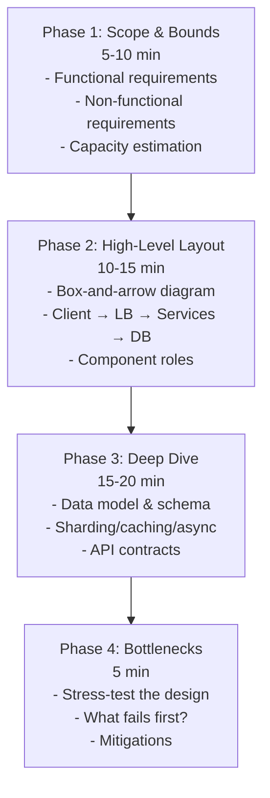

# System Design Mastery: The Executive Interview Framework

*As a Director of Engineering and Lead Bar Raiser at Google and Microsoft, I've evaluated hundreds of system design interviews. This final module synthesizes our entire 14-module curriculum into a weaponized, repeatable framework that will distinguish you as a Senior/Staff engineer in any FAANG interview loop.*

> **Prerequisites:** This module assumes you have read the beginner-friendly [Module 14 guide](14-interview-framework.md) and understand the basic 4-phase structure. It also draws on concepts from all 13 prior modules — databases (Module 2), caching (Module 3), distributed systems (Module 4), async processing (Module 5), and capacity planning (Module 13).

---

## Table of Contents

1. [The 4-Phase Whiteboard Roadmap](#1-the-4-phase-whiteboard-roadmap)
2. [The Senior Signal](#2-the-senior-signal)
3. [The Defensive Whiteboarding Art](#3-the-defensive-whiteboarding-art)
4. [Master Evaluation Rubric](#4-master-evaluation-rubric)
5. [Complete Interview Script](#5-complete-interview-script)
6. [The Final Synthesis](#6-the-final-synthesis)
7. [Glossary of Key Terms](#7-glossary-of-key-terms)
8. [Key Takeaways](#8-key-takeaways)

---

## 1. The 4-Phase Whiteboard Roadmap



### The 45-Minute Interview Timeline

| Phase | Time | Objective | Key Deliverables |
|-------|------|-----------|------------------|
| **Phase 1: Scope & Bounds** | 5-10 min | Extract requirements and quantify scale | Functional/Non-functional list + Back-of-envelope math |
| **Phase 2: High-Level Core Layout** | 10-15 min | Map the request path from client to storage | Box-and-arrow diagram + Component roles |
| **Phase 3: Deep Component Drill-Down** | 15-20 min | Dive into bottlenecks and specific mechanisms | Schemas, sharding, caching, async boundaries |
| **Phase 4: Scaling, Bottlenecks & Evolution** | 5 min | Defensively stress-test and discuss trade-offs | Failure scenarios + Improvement roadmap |

### Phase 1: Scope & Bounds (5-10 Minutes)

**Goal:** Do NOT draw until you understand the problem's true constraints.

#### The "5 Questions" Extraction Framework

1. **Functional Requirements:** "What are the core user actions this system must support?"
2. **Non-Functional Requirements:** "What are the Availability and Consistency requirements? Is this read-heavy or write-heavy?"
3. **Scale:** "What is the expected Daily Active Users (DAU)? What is the read-to-write ratio?"
4. **Data Model:** "What are the key entities and their relationships?"
5. **Constraints:** "Are there any specific latency or data retention requirements?"

#### Back-of-the-Envelope Estimation Blueprint

```
DAILY ACTIVE USERS (DAU): [X] million

READS:
- Average Reads per User per Day: [Y]
- Daily Read Volume = DAU × Y
- Read QPS = Daily Read Volume / 86,400 seconds

WRITES:
- Average Writes per User per Day: [Z]
- Daily Write Volume = DAU × Z
- Write QPS = Daily Write Volume / 86,400 seconds

STORAGE (5-year horizon):
- Daily Storage = Daily Write Volume × Average Object Size
- Annual Storage = Daily Storage × 365
- 5-Year Storage = Annual Storage × 5 × (1.2 to 2.0 padding factor)

BANDWIDTH:
- Ingress = Write QPS × Average Request Size
- Egress = Read QPS × Average Response Size
- Peak = Average × (2x to 5x multiplier)

CACHE MEMORY (80-20 Rule):
- Daily Read Data = Daily Read Volume × Average Object Size
- Cache Size = Daily Read Data × 0.20
```

**Critical Insight:** If your calculations show the system fits on a single server (e.g., < 1 TB storage, < 1,000 QPS), mention that a distributed architecture is over-engineering. This signals pragmatic senior thinking.

### Phase 2: High-Level Core Layout (10-15 Minutes)

**Goal:** Draw the request path from Client to Data Store without diving into deep component specifics.

#### The Standard Request Path Architecture

```
┌─────────────┐     ┌─────────────┐     ┌─────────────┐
│   Client    │────▶│   DNS/CDN   │────▶│   Reverse   │
│   (Mobile/  │     │  (Edge)     │     │   Proxy/    │
│   Browser)  │     │             │     │  LB (L4/L7) │
└─────────────┘     └─────────────┘     └─────────────┘
                                                    │
                                                    ▼
┌─────────────┐     ┌─────────────┐     ┌─────────────┐
│   Cache     │◀───▶│   Web/App   │────▶│   Message   │
│   (Redis/   │     │   Tier      │     │   Queue     │
│  Memcached) │     │ (Stateless) │     │ (RabbitMQ/  │
└─────────────┘     └─────────────┘     │    Kafka)   │
                          │              └─────────────┘
                          │                     │
                          ▼                     ▼
                  ┌─────────────┐     ┌─────────────┐
                  │   Database  │     │   Worker    │
                  │   (SQL/     │     │   Pool      │
                  │   NoSQL)    │     │             │
                  └─────────────┘     └─────────────┘
```

#### Key Components to Position Correctly

| Layer | Component | Purpose | Module Reference |
|-------|-----------|---------|------------------|
| Edge | DNS | Geolocation/Latency-based routing | Module 1 |
| Edge | CDN | Push vs. Pull for static assets | Module 1 |
| Edge | L4/L7 Load Balancer | SSL termination, cookie-based routing | Module 1 |
| App | Reverse Proxy | NGINX, edge rate limiting | Module 1 |
| App | Web/App Tier | Stateless for horizontal scaling | Module 5 |
| Cache | Redis/Memcached | Cache-Aside, Leases | Module 3 |
| Async | Message Queue | Decouple heavy computations | Module 5 |
| Store | SQL | ACID transactions | Module 2 |
| Store | NoSQL | BASE, high-throughput ingestion | Module 2 |

### Phase 3: Deep Component Drill-Down (15-20 Minutes)

**Goal:** Steer the conversation into the specific bottlenecks and mechanisms that matter for your design.

#### The Bottleneck-Driven Deep Dive Strategy

Ask yourself: *"What is the most likely failure point in this system?"* Then dive into the corresponding component.

**If READ-HEAVY System** (e.g., Twitter, News Feed):
- **Caching Strategy:** Detail Cache-Aside (Lazy Loading) with Leases to prevent stampedes.
- **Replication:** Master-Slave with read replicas; discuss Replication Lag and solutions.
- **Denormalization:** Optimize reads at the cost of write complexity.

**If WRITE-HEAVY System** (e.g., Logging, Analytics):
- **Message Queue:** Detail asynchronous ingestion with back pressure.
- **Batch Processing:** Discuss Kafka → Flink/Spark streaming pipelines.
- **NoSQL Selection:** Justify wide-column stores (Cassandra) or document stores (MongoDB).

**If LOW-LATENCY System** (e.g., Search, Ad Serving):
- **In-Memory Cache:** Discuss global distributed cache (Redis cluster).
- **CDN Strategy:** Push CDN for near-zero latency static delivery.
- **Database Choice:** Discuss in-memory databases or specialized search indices.

#### Deep Dive Template: Define Your Schema

```sql
-- Example: URL Shortener Schema
CREATE TABLE pastes (
    shortlink VARCHAR(7) PRIMARY KEY,    -- Base62 encoded
    original_url TEXT NOT NULL,
    created_at TIMESTAMP DEFAULT NOW(),
    expiration_length_minutes INT,
    paste_path VARCHAR(255),              -- Pointer to object store
    INDEX(created_at)
);

-- Example: Twitter Schema
CREATE TABLE tweets (
    tweet_id BIGINT PRIMARY KEY,
    user_id BIGINT NOT NULL,
    content TEXT NOT NULL,
    created_at TIMESTAMP DEFAULT NOW(),
    INDEX(user_id, created_at)
);

CREATE TABLE follows (
    follower_id BIGINT NOT NULL,
    followee_id BIGINT NOT NULL,
    PRIMARY KEY(follower_id, followee_id),
    INDEX(followee_id)
);
```

#### Deep Dive Template: Sharding Strategy

**Consistent Hashing:** Use hash ring with virtual nodes (tokens) per physical server. When adding a server, only immediate neighbors need data migration. Prevents "resharding storms" that would crush the cluster.

**Shard Key Selection:**
- **User_ID:** Good for social networks (all user data on one shard).
- **Geographic Region:** Good for global services (latency optimization).
- **Time-based:** Good for logs/analytics (hot partitions issue!).

**The Celebrity Hot-Spot Fix:** Add in-memory cache (Redis) in front of the celebrity's shard. Increase replication factor for hot data chunks. Use virtual nodes to distribute load evenly.

### Phase 4: Scaling, Bottlenecks & Evolution (5 Minutes)

**Goal:** Defensively stress-test your design and show operational empathy.

#### The "What If" Scenario Framework

**Scenario 1: Traffic Spike (10x normal load)**
- Web Tier: Stateless → horizontal scale out automatically.
- Cache: Gutter servers (1% pool) absorb failures; Leases prevent stampedes.
- Queue: Back pressure rejects excess jobs; exponential backoff on client retries.
- Database: Read replicas absorb read spikes; write master may become bottleneck.

**Scenario 2: Network Partition (P)**
- CAP Decision: Choose Availability (AP) or Consistency (CP).
- AP (Dynamo-style): Sloppy quorums + hinted handoff + vector clocks.
- CP (Raft-style): Majority quorum required; minority nodes become unavailable.

**Scenario 3: Database Master Failure**
- Master-Slave: Promote a slave to master (may lose un-replicated writes).
- Master-Master: Conflict resolution complexity; use vector clocks.
- Federation/Sharding: Only one shard's master fails; partial outage.

**Scenario 4: Cache Stampede (Thundering Herd)**
- Mitigation: Leases (Facebook style) → only one client hits DB per 10 seconds.
- Mitigation: Jittered TTLs → randomize expiration times.
- Mitigation: Gutter servers → absorb cache node failures.

**Scenario 5: Replication Lag**
- Problem: User writes → read from lagging slave → sees stale data.
- Fix: Remote Marker (Facebook) → force read to master for that user.
- Fix: Sticky sessions → route user to master after write.

---

## 2. The Senior Signal

### What Distinguishes a Senior/Staff Engineer from a Junior

| Junior Signal | Senior Signal |
|---------------|---------------|
| Waits for interviewer to guide | Drives the whiteboard independently |
| Calls components "perfect" or "scalable" | States: "Everything is a trade-off" |
| Focuses on average latency | Focuses on 99.9th percentile (SLA) |
| Ignores monitoring and security | Discusses Observability and mTLS as primary concerns |
| Adds caching as an afterthought | Builds architecture around cache invalidation strategy |
| Uses SQL for everything | Justifies DB choice by access pattern |
| Single region design | Multi-region, geo-distributed design |
| Forgets about failure modes | Describes graceful degradation explicitly |

### The Trade-off Articulation Framework

When making any architectural decision, explicitly state the trade-off:

```
"I am choosing [Option A] over [Option B] because [Reason].

The trade-off is:
- Benefit: [What we gain]
- Cost: [What we sacrifice]
- Mitigation: [How we handle the cost]
```

**Example:**

> "I am choosing Dynamo-style Eventual Consistency (AP) over Strong Consistency (CP) because our system needs 99.99% write availability for shopping cart updates.
>
> The trade-off is:
> - **Benefit:** Users can always add items to cart, even during network partitions.
> - **Cost:** Users might briefly see stale data (e.g., items already checked out).
> - **Mitigation:** We use Vector Clocks to detect conflicts and push semantic reconciliation to the client. We also use Read-Repair to propagate the latest version to stale replicas."

---

## 3. The Defensive Whiteboarding Art

### Handling Unexpected Constraints Mid-Interview

When the interviewer drops a curveball, think aloud using your distributed systems knowledge.

**Constraint:** *"The network between your app and cache has 5% packet loss."*

**Frameworked Response:**

1. **Acknowledge the Problem:** "5% packet loss is significant. This is a Network Partition (P) scenario."
2. **Apply CAP Theorem:**
   - "I must choose between Consistency (CP) and Availability (AP)."
   - "If I serve stale cache data, I'm choosing AP (Availability)."
   - "If I refuse requests until the network stabilizes, I'm choosing CP (Consistency)."
3. **Fault-Tolerance Decorators:**
   - "I will implement Retries with Exponential Backoff and Jitter to prevent a Thundering Herd."
   - "I will apply Back Pressure: if the cache becomes unreachable, the app tier returns a 503 and tells clients to retry."
   - "I will use a Circuit Breaker: if 50% of cache requests fail in 10 seconds, trip the circuit and go directly to the database (degraded mode)."
4. **Durability Consideration:**
   - "If this were a write-heavy system, I would use Sloppy Quorums (Dynamo-style): writes go to a healthy node, with Hinted Handoff to the primary when it recovers."

**Constraint:** *"Your database master just died. What happens?"*

**Frameworked Response:**

1. **Identify the State:** "This is a Single Point of Failure scenario."
2. **Mitigation Strategy:**
   - "If I used Master-Slave replication, the monitoring system detects the master failure and promotes a slave to master."
   - "The promotion may take 30-60 seconds (failover time), during which writes are unavailable."
   - "Any writes that were not yet replicated to the promoted slave are lost."
3. **Prevention (if designing from scratch):**
   - "I would use Multi-AZ deployment with automatic failover (RDS Multi-AZ)."
   - "For higher write availability, I would use a leaderless system like Dynamo with W=1 (write accepted if one node responds), at the cost of eventual consistency."
4. **User Experience:**
   - "During failover, users see a 503 Server Busy and retry with exponential backoff."
   - "Once the new master is promoted, writes resume. This is graceful degradation."

**Constraint:** *"A celebrity with 100 million followers tweets. Your system crashes."*

**Frameworked Response:**

1. **Identify the Problem:** "This is a Hot-Key/Hot-Spot problem in the Twitter Timeline design."
2. **Mechanics of Failure:**
   - "Our Fan-out on Write approach tries to push the tweet to 100 million follower timelines."
   - "This blocks the write thread for minutes, causing cascading failures."
3. **Mitigation (Hybrid Approach):**
   - "We apply Fan-out on Read for celebrities: we do NOT push to follower caches."
   - "Instead, when a user loads their timeline, we dynamically query the Search Cluster for recent celebrity tweets."
   - "We merge these with the user's cached timeline at serve time."
4. **Performance:**
   - "The Search Cluster is optimized for this: inverted index on user_id and created_at."
   - "We cache celebrity tweets aggressively with a short TTL (e.g., 1 minute)."

---

## 4. Master Evaluation Rubric

### 10-Point "Outstanding" FAANG Evaluation Checklist

Use this checklist to audit your design before concluding the interview. A Principal/Staff candidate hits all 10 criteria seamlessly.

**✅ 1. REQUIREMENTS BOUNDING** — *Did I calculate Storage, QPS, and Bandwidth before choosing a DB?*
- Storage estimated over 5-year horizon (with padding factor)
- Read QPS and Write QPS calculated from DAU
- Bandwidth (Ingress/Egress) calculated in Gbps
- Determined if system fits on single server or requires distributed architecture
- *Senior Signal:* "The quantitative analysis precedes the architectural decisions."

**✅ 2. CAP ALIGNMENT** — *Did I explicitly state if the system is CP or AP under failure?*
- Identified network partitions (P) as inevitable
- Explicitly chose Consistency (CP) or Availability (AP) with justification
- Explained the trade-off: "We sacrifice X to gain Y"
- For AP systems: described eventual consistency mechanisms (vector clocks, read-repair)
- For CP systems: described quorum requirements (R+W > N)
- *Senior Signal:* "The candidate understands that CAP is not a choice but a constraint."

**✅ 3. EDGE INTEGRITY** — *Are DNS, CDN, and L4/L7 Load Balancers correctly positioned?*
- DNS routing explained (Geolocation, Latency-based, Weighted Round Robin)
- CDN strategy chosen (Push vs. Pull) with trade-offs
- L4 vs. L7 Load Balancing justified based on traffic type
- SSL Termination at Reverse Proxy (offloading crypto from app servers)
- Edge Rate Limiting discussed to block malicious floods
- *Senior Signal:* "The edge is treated as a first-class security and performance layer."

**✅ 4. STATELESS SCALING** — *Is the application tier stateless to allow independent horizontal scaling?*
- Web/App tier explicitly designed as stateless
- Session state externalized (Redis/ElastiCache)
- Horizontal scaling explained: adding more instances distributes load
- Web layer separated from Application layer for asymmetric scaling
- *Senior Signal:* "The candidate understands that statefulness is the enemy of scalability."

**✅ 5. DB JUSTIFICATION** — *Did I justify SQL vs. NoSQL based on data structure and access patterns?*
- SQL chosen for ACID transactions (e.g., financial, inventory)
- NoSQL chosen for high-throughput, schema-flexible, BASE systems
- Specific NoSQL type justified: Key-Value (Redis), Document (MongoDB), Wide-Column (Cassandra), Graph (Neo4j)
- Explained the ACID vs. BASE trade-off explicitly
- *Senior Signal:* "The database choice is driven by the data access pattern, not personal preference."

**✅ 6. SHARDING LOGIC** — *Is there a Shard Key or Consistent Hashing to prevent hot-spots?*
- Shard key chosen explicitly with justification
- Consistent Hashing explained to prevent "resharding storms"
- Virtual Nodes (tokens) used to handle heterogeneous hardware
- Celebrity/Hot-Spot mitigation described (caching + replication)
- *Senior Signal:* "The candidate anticipates and designs for data distribution skew."

**✅ 7. CACHE STRATEGY** — *Did I address Cache Invalidation and the Thundering Herd problem?*
- Cache strategy chosen: Cache-Aside, Write-Through, Write-Behind, Refresh-Ahead
- Cache invalidation explicitly addressed
- Thundering Herd mitigation: Leases (Facebook) or Jittered TTLs
- Gutter servers (1% pool) for cache node failure absorption
- Cache vs. Object-level caching decision explained
- *Senior Signal:* "The candidate understands that cache invalidation is a hard problem and addresses it proactively."

**✅ 8. ASYNC DECOUPLING** — *Are expensive jobs moved to a Message Queue?*
- Heavy operations decoupled via Message Queue (RabbitMQ/Kafka)
- Client unblocked with immediate acknowledgment
- Worker Pool detailed for asynchronous processing
- Back Pressure explained: bounded queue + 503 responses + exponential backoff
- At-least-once vs. Exactly-once delivery trade-offs addressed
- *Senior Signal:* "The candidate designs for non-blocking, resilient workflows."

**✅ 9. SECURITY & AUTH** — *Did I include JWT/OAuth2 for the edge and mTLS for internal services?*
- Authentication: JWT/OAuth2 with PKCE for client-side flow
- Authorization: RBAC or ABAC for fine-grained permissions
- Service-to-Service: mTLS with centralized PKI for automatic verification
- JWT revocation strategy (denylist or short-lived tokens)
- API Gateway/JWKS validation explained (stateless token verification)
- *Senior Signal:* "Security is integrated into the architecture, not an afterthought."

**✅ 10. GRACEFUL DEGRADATION** — *Is there a fallback if a core component dies?*
- User experience during component failure explicitly defined
- Partial functionality available (e.g., read-only mode)
- Stale cache served instead of 503 errors (when acceptable)
- Retry logic with exponential backoff and jitter
- Circuit Breaker pattern to prevent cascading failures
- *Senior Signal:* "The candidate designs for the worst case, not the happy path."

---

## 5. Complete Interview Script

### A Memorized Mental Model for the 45-Minute Loop

```
"Let me start by clarifying the requirements and constraints."

[Phase 1: Scope & Bounds]
- "What are the core use cases?"
- "What are the non-functional requirements?"
- "Let me do some back-of-the-envelope calculations..."
- [WRITE: DAU, QPS, Storage, Bandwidth]

"Based on these numbers, we need a distributed system. Let me sketch the high-level architecture."

[Phase 2: High-Level Core Layout]
- [DRAW: Client → CDN → LB → Web Tier → Cache → DB → Queue → Workers]
- "The web tier is stateless for horizontal scaling."
- "The cache handles read-heavy traffic."
- "The queue decouples write-heavy operations."

"Now let me dive into the components that will be bottlenecks."

[Phase 3: Deep Component Drill-Down]
- "For the database, I'll use [SQL/NoSQL] because [justification]."
- "The shard key will be [X] with Consistent Hashing to prevent hot-spots."
- "For caching, I'll use Cache-Aside with Leases to prevent stampedes."
- "For async jobs, I'll use [Queue] with Back Pressure and exponential backoff."

"Let me stress-test this design."

[Phase 4: Scaling, Bottlenecks & Evolution]
- "If traffic spikes 10x, the stateless web tier scales out horizontally."
- "If the cache node fails, Gutter servers absorb the load."
- "If the database master fails, we promote a slave (failover time ~30-60s)."
- "If a celebrity tweets, we use Fan-out on Read to avoid crushing the cluster."

"Thank you. I'd be happy to discuss any specific component in more detail."
```

---

## 6. The Final Synthesis

### What We've Built Across 14 Modules

| Module | Core Concept | Interview Application |
|--------|--------------|-----------------------|
| 1 | Traffic Routing & Network Foundations | Edge architecture, DNS/CDN/LB placement |
| 2 | Database Architectures & Scaling | SQL vs. NoSQL, sharding, replication |
| 3 | Caching Strategies & Memory Management | Cache invalidation, stampede prevention |
| 4 | Distributed Systems & Communication | CAP theorem, RPC vs. REST, fault tolerance |
| 5 | Asynchronism & Decoupling | Queues, back pressure, microservices |
| 6 | Service Discovery & Service Mesh | Dynamic routing, sidecars, canary deployments |
| 7 | Observability | SLIs/SLOs, metrics, tracing, sampling |
| 8 | Authentication & Authorization | JWT, OAuth2, mTLS, RBAC/ABAC |
| 9 | Microservices Patterns | Saga, Outbox, CQRS, Event Sourcing |
| 10 | File, Object & Block Storage | Erasure coding, GFS mechanics, bit rot |
| 11 | Stream Processing & Real-Time Analytics | Log-centric architecture, windowing, Kappa |
| 12 | Distributed Transactions & Consensus | 2PC, Raft, quorums, vector clocks |
| 13 | Back-of-the-Envelope Estimation | QPS, storage, bandwidth, RAM sizing |
| 14 | System Design Interview Framework | 4-phase roadmap, evaluation rubric |

### The Bar Raiser's Final Advice

> *"The difference between a good engineer and a great architect is not what they know — it's how they think. A great architect starts with the constraints, designs for the failure cases, and articulates the trade-offs with mathematical clarity. They don't just solve the problem; they frame it."*

Your mission: Practice this framework until it becomes muscle memory. When you walk into that interview room, you won't be drawing boxes — you'll be telling a story about how a system survives, adapts, and thrives under the most extreme conditions.

---

## 7. Glossary of Key Terms

| Term | Section | Definition |
|------|---------|------------|
| Back-of-the-Envelope Estimation | 1 | Quick quantitative calculation to bound system requirements (QPS, storage, bandwidth) before making architectural decisions |
| Stateless Scaling | 1 | Architecture where any instance can handle any request because session state is externalized (Redis), enabling horizontal scale-out |
| Read-Repair | 1 | Background process that updates stale replicas with the latest version when a read detects divergence |
| Sloppy Quorum | 1 | Dynamo-style write quorum that accepts operations from the first N healthy nodes, not the strict N owners |
| Hinted Handoff | 1 | Temporary write storage on a non-owner node, forwarded to the correct owner when it recovers |
| Graceful Degradation | 1 | System continues operating with reduced functionality during partial failure rather than complete outage |
| Gutter Pool | 1 | Small pool of spare cache servers (~1% of cluster) that absorb traffic when primary cache nodes fail |
| Fan-out on Read | 1 | Reading data (e.g., celebrity tweets) dynamically at serve time rather than pre-pushing to all followers |
| Fan-out on Write | 1 | Pushing data to all interested consumers (e.g., followers' timelines) at write time for O(1) reads |
| Trade-off Articulation | 2 | Explicitly stating benefit, cost, and mitigation for every architectural decision |
| Circuit Breaker | 3 | Pattern that trips open when failure rate exceeds threshold, preventing cascading failures across services |
| Exponential Backoff | 3 | Retry strategy where wait time doubles between attempts, optionally with random jitter to desynchronize clients |
| Remote Marker | 3 | Flag in a local cache that redirects reads to a master region to prevent stale reads from lagging replicas |
| Failover | 3 | Automatic promotion of a standby/replica to primary role when the active component fails |
| DAU | 1 | Daily Active Users — primary metric for estimating system load |
| QPS | 1 | Queries Per Second — throughput measure derived from DAU × actions per day / 86,400 |
| Consistent Hashing | 1 | Hash ring distribution that minimizes data movement when adding/removing nodes |
| Virtual Nodes | 1 | Multiple hash ring positions per physical node for even load distribution |
| Denormalization | 1 | Intentional data duplication across tables to avoid expensive JOINs at the cost of write complexity |
| Master-Slave Replication | 1 | One primary handles writes; replicas handle reads and are promoted on failure |
| PKCE | 3 | Proof Key for Code Exchange — challenge-verifier mechanism preventing authorization code interception |
| JWKS | 3 | JSON Web Key Set — public key endpoint for stateless JWT signature verification |
| mTLS | 3 | Mutual TLS — both client and server present X.509 certificates during TLS handshake for service-to-service auth |
| RBAC | 3 | Role-Based Access Control — permissions assigned via predefined roles |
| ABAC | 3 | Attribute-Based Access Control — permissions evaluated against user, resource, and environment attributes |

---

## 8. Key Takeaways

1. **Lead the interview, don't follow it.** The interviewer is evaluating how you think, not whether you know the "right answer." Drive the whiteboard independently through the 4-phase structure.

2. **Quantify before you qualify.** Always calculate QPS, storage, and bandwidth before choosing a database or cache strategy. Let the numbers drive your architecture.

3. **State trade-offs explicitly.** Every architectural decision is a compromise. Articulate benefit, cost, and mitigation for each choice. This is the #1 signal of senior-level thinking.

4. **Design for failure, not just success.** The 5 "What If" scenarios (traffic spike, network partition, master failure, cache stampede, replication lag) are mandatory preparation.

5. **CAP is not a choice — it's a constraint.** You must support Partition Tolerance (P) in distributed systems. The only question is whether you prioritize Consistency (CP) or Availability (AP) when a partition occurs.

6. **The edge is a first-class layer.** DNS routing, CDN strategy, L4/L7 load balancing, SSL termination, and rate limiting are not afterthoughts — they are the foundation of global system performance.

7. **Caching requires a strategy, not just a cache.** Address invalidation (write-through vs write-behind), stampede prevention (leases/jittered TTLs), and failure absorption (gutter pools).

8. **Async decoupling is non-negotiable at scale.** Message queues, back pressure, and worker pools protect your system from traffic spikes and allow independent scaling of components.

9. **Security is not optional.** JWT/OAuth2 at the edge, mTLS for internal service-to-service communication, PKCE for client flows — these are primary architectural decisions, not add-ons.

10. **Practice the script until it's muscle memory.** The 4-phase flow, the "What If" scenarios, the trade-off framework — rehearse them until you can execute them under pressure.

---

> This guide concludes the System Design Mastery Curriculum. You now possess the structural knowledge, quantitative tools, and defensive frameworks required to design planetary-scale systems — and to teach others to do the same.
>
> *"The best time to design for failure is before the system is built. The second best time is right now."*
