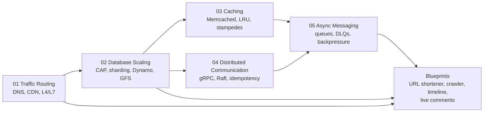

# System Design Academy

Learn how real distributed systems break, and how to design them so they recover.

[](#)
[](LICENSE)
[](#)


> **An interactive engineering manual for senior-level system design preparation, built around real architecture trade-offs, production code templates, and FAANG-style whiteboard execution.**

System Design Academy is a professional, open-source curriculum for engineers who want to move beyond memorized diagrams and learn how large systems actually behave under load, failure, replication lag, cache pressure, global traffic, and async backlogs.

| Quick Overview | Details |
|---|---|
| **Modules** | 14 deep-dive modules |
| **Blueprints** | 4 core blueprints |
| **Beginner Docs** | 14 companion guides with plain-language explanations |
| **Languages used** | Python, TypeScript |
| **Paper references** | Dynamo, GFS, Facebook Memcached |
| **Primary audience** | Backend engineers preparing for senior system design interviews |

---

## Table Of Contents

- [Curriculum Overview](#curriculum-overview)
- [What Makes This Different](#what-makes-this-different)
- [Prerequisites](#prerequisites)
- [Getting Started](#getting-started)
- [Running The Code Locally](#running-the-code-locally)
- [How To Use This Repo For Interview Prep](#how-to-use-this-repo-for-interview-prep)
- [Who This Is For](#who-this-is-for)
- [How To Contribute](#how-to-contribute)
- [Community & Support](#community--support)
- [Roadmap](#roadmap)
- [License](#license)

---

## Curriculum Overview

| # | Module | What You Will Learn |
|---:|---|---|
| 01 | [Traffic Routing & Network Foundations](modules/01-traffic-routing.md) | DNS routing, CDNs, L4 vs L7 load balancing, reverse proxies, failover, and edge security |
| 02 | [Database Architectures & Scaling](modules/02-database-scaling.md) | CAP, replication, sharding, consistent hashing, Dynamo-style availability, GFS storage lessons, and SQL tuning |
| 03 | [Caching Strategies & Memory Management](modules/03-caching-memory.md) | Cache-aside, write-through, write-behind, LRU internals, Facebook Memcached patterns, leases, and cache crisis handling |
| 04 | [Distributed Systems & Communication](modules/04-distributed-comm.md) | TCP/UDP, REST vs gRPC vs WebSockets, consensus, Raft leader election, circuit breakers, retries, and jitter |
| 05 | [Asynchronous Processing & Message Queues](modules/05-async-messaging.md) | Message queues, pub/sub, Kafka partitions, RabbitMQ task queues, acknowledgments, backpressure, retries, and DLQs |
| 06 | [Service Discovery & Service Mesh](modules/06-service-mesh.md) | Client-side vs server-side discovery, sidecar proxies, control plane vs data plane, mTLS, traffic splitting, and circuit breaking |
| 07 | [Observability & Telemetry](modules/07-observability.md) | Metrics, logs, and traces — the three pillars; SLI/SLO/error budgets, structured logging, OpenTelemetry, and push vs pull architectures |
| 08 | [Authentication & Authorization](modules/08-security-auth.md) | Stateless JWT vs stateful sessions, OAuth 2.0 & OIDC flows, PKCE, mTLS for service-to-service security, and API gateway patterns |
| 09 | [Microservices Patterns](modules/09-microservices-patterns.md) | Saga pattern (choreography vs orchestration), transactional outbox, CQRS, event sourcing, and compensating transactions |
| 10 | [File, Object & Block Storage](modules/10-storage-systems.md) | Storage typologies compared, erasure coding, consistent hashing for object storage, bit-rot detection, and S3 internals |
| 11 | [Stream Processing & Real-Time Analytics](modules/11-stream-processing.md) | Log-centric architecture, event time vs processing time, watermarks, Lambda vs Kappa, Kafka Streams, Flink, and windowing |
| 12 | [Distributed Transactions & Consensus](modules/12-distributed-consensus.md) | 2PC, 3PC, Raft leader election, Dynamo-style leaderless consensus, vector clocks, split-brain prevention, and BFT |
| 13 | [Back-of-the-Envelope Estimation](modules/13-capacity-planning.md) | Latency numbers, power-of-two rules, QPS/storage/bandwidth estimation, peak multipliers, and worked exercises |
| 14 | [System Design Interview Framework](modules/14-interview-framework.md) | 4-phase whiteboard roadmap, seniority signaling, defensive whiteboarding, mock interview walkthroughs, and a 10-problem question bank |

Each module has **two companion guides** in the [`Docs/`](Docs/) directory:
- 🟢 **Beginner guide** (`XX-module-name.md`) — plain language, everyday analogies, full glossary. Start here.
- 🔴 **Advanced guide** (`XX-module-name-advanced.md`) — FAANG Principal Engineer deep-dive with paper references, failure modes, and teacher's corner with grading rubrics. Level up here.

### Real-World System Design Blueprints

Apply everything you learn in [`blueprints/system-designs.md`](blueprints/system-designs.md) — complete interview-ready designs for a **URL shortener**, **web crawler**, **Twitter/X timeline engine**, and **Live Comments system** with WebSocket fanout.

### Recommended Learning Path



---

## What Makes This Different

Most system design resources stop at boxes and arrows. This repository is built to go deeper.

| Differentiator | What It Means |
|---|---|
| **Whiteboard-ready trade-offs** | Every concept is framed with decision matrices, staff-engineer notes, and interview-ready trade-off language. |
| **Production code templates** | Runnable Python and TypeScript examples cover reverse proxies, consistent hashing, LRU caches, gRPC services, RabbitMQ workers, circuit breakers, and retries. |
| **Failure-driven explanations** | Modules explain how systems fail: split-brain, cache stampedes, poison messages, retry storms, replication lag, and hot partitions. |
| **Paper-to-practice** | Lessons from Dynamo, GFS, and Facebook Memcached are translated into actionable architecture patterns. |

You will still get Mermaid-rendered architecture diagrams, FAANG-style interview preparation, back-of-the-envelope math, and concrete bottleneck analysis. The point is not to memorize diagrams. The point is to build engineering judgment.

---

## Prerequisites

| Assumed Knowledge | Why It Helps |
|---|---|
| Basic networking: TCP, HTTP, DNS | Needed for routing, load balancing, and failure-mode discussions |
| SQL and NoSQL fundamentals | Needed for replication, sharding, indexing, and consistency trade-offs |
| Ability to read Python or TypeScript pseudocode | Code templates use both languages |
| Interest in distributed systems | Consensus, replication, messaging, and retries show up throughout |

Optional but helpful:

| Background | Useful For |
|---|---|
| Cloud experience | Understanding managed load balancers, databases, queues, and regional failover |
| Containerization | Running RabbitMQ, Toxiproxy, and service examples locally |
| Metrics and monitoring | Making sense of p99 latency, queue lag, DLQ size, cache hit rate, and error budgets |

---

## Getting Started

Clone the repository:

```bash
git clone https://github.com/MachariaP/system-design-academy.git
cd system-design-academy
```

Recommended reading flow — start with a beginner guide, then the advanced module:

```text
Docs/01-traffic-routing.md          →  modules/01-traffic-routing.md
Docs/02-database-scaling.md         →  modules/02-database-scaling.md
Docs/03-caching-memory.md           →  modules/03-caching-memory.md
Docs/04-distributed-comm.md         →  modules/04-distributed-comm.md
Docs/05-async-messaging.md          →  modules/05-async-messaging.md
Docs/06-service-mesh.md             →  modules/06-service-mesh.md
Docs/07-observability.md            →  modules/07-observability.md
Docs/08-security-auth.md            →  modules/08-security-auth.md
Docs/09-microservices-patterns.md   →  modules/09-microservices-patterns.md
Docs/10-storage-systems.md          →  modules/10-storage-systems.md
Docs/11-stream-processing.md        →  modules/11-stream-processing.md
Docs/12-distributed-consensus.md    →  modules/12-distributed-consensus.md
Docs/13-capacity-planning.md        →  modules/13-capacity-planning.md
Docs/14-interview-framework.md      →  modules/14-interview-framework.md
blueprints/system-designs.md        (apply everything)
```

Recommended study loop:

1. Read one module end-to-end.
2. Re-draw the Mermaid diagrams from memory.
3. Explain each trade-off out loud as if in an interview.
4. Run or adapt the code templates locally.
5. Apply the concepts to one new system design prompt.

---

## Running The Code Locally

The academy is primarily Markdown-based, but the modules include standalone Python and TypeScript templates you can run or adapt.

```bash
# Clone the repo
git clone https://github.com/MachariaP/system-design-academy.git
cd system-design-academy

# Set up Python virtual environment for code examples
python -m venv venv
source venv/bin/activate  # or .\venv\Scripts\activate on Windows
pip install -r requirements.txt
```

Example workflow for Python snippets:

```bash
# Create a local scratch file for a module snippet, then run it
mkdir -p scratch
# Example: paste the consistent hashing demo from modules/02-database-scaling.md
python scratch/consistent_hashing_demo.py
```

Example workflow for TypeScript snippets:

```bash
# Reverse proxy examples use Node.js packages
npm init -y
npm install prom-client tsx
npx tsx scratch/proxy.ts
```

Each module’s code blocks are designed to be standalone and can be copied directly into a scratch file. Some examples need external services such as RabbitMQ, PostgreSQL, or Toxiproxy; the relevant module notes call those dependencies out.

---

## How To Use This Repo For Interview Prep

> **📘 Study plan**
>
> **Week 1:** Study beginner guides + modules 01-03: Traffic Routing, Database Scaling, and Caching. Re-draw every Mermaid diagram from memory and explain the bottleneck each diagram is protecting.
>
> **Week 2:** Study beginner guides + modules 04-05: Distributed Communication and Async Messaging. Then modules 06-08: Service Mesh, Observability, and Security.
>
> **Week 3:** Study beginner guides + modules 09-11: Microservices Patterns, Storage Systems, and Stream Processing. Then modules 12-13: Distributed Consensus and Capacity Planning.
>
> **Week 4:** Study module 14 (Interview Framework), work through all four blueprints, and do at least one mock interview with a peer.
>
> **Daily:** Pick one failure scenario or "What if...?" section and explain the mitigation out loud in 3-5 minutes. Focus on what breaks first, what metric proves it, and what trade-off your fix introduces.

---

## Who This Is For

- Backend engineers preparing for senior system design interviews.
- Distributed systems learners who want practical architecture mechanics.
- Developer advocates and educators building teaching material.
- Engineering teams looking for clean internal study references.
- Open-source contributors who enjoy turning complex systems into clear guides.

---

## How To Contribute

Contributions are welcome, especially from engineers who want to add practical, interview-grade system design blueprints.

| Contribution Type | What To Include |
|---|---|
| **New system design blueprint** | Requirements table, architecture diagram, component deep-dive, failure scenarios, decision log |
| **Code template** | Language, dependencies, usage example, error handling, observability |
| **Diagram improvement** | Mermaid source, caption, clear separation of control plane and data plane |
| **Typo or clarification** | Brief description and why it improves accuracy |

Good contributions also include:

- New system design case studies.
- Improved architecture diagrams.
- More production-grade code templates.
- Better capacity estimates and bottleneck analysis.
- Corrections, clarifications, and source-backed improvements.

### Style Guide

- Use Mermaid for diagrams.
- Use `🧠` for staff-engineer notes.
- Use `⚠️` for failure modes.
- Keep code blocks runnable where possible.
- Prefer concrete numbers, assumptions, and trade-offs over generic claims.
- Separate control plane and data plane when drawing architecture diagrams.

Suggested workflow:

```bash
git checkout -b feature/new-blueprint
# edit or add markdown files
git add .
git commit -m "Add system design blueprint for notification service"
git push origin feature/new-blueprint
```

Then open a pull request with:

- The design problem being solved.
- Key trade-offs covered.
- Any assumptions used for calculations.
- Screenshots or previews of Mermaid diagrams if helpful.

---

## Community & Support

Have a question, correction, or blueprint request?

- Open a [GitHub issue](https://github.com/MachariaP/system-design-academy/issues) for bugs, clarifications, or content requests.
- Use GitHub Discussions if enabled for longer design conversations and study-group threads.
- Share the repository with another engineer preparing for system design interviews.

Optional share snippet:

```markdown
I am studying system design with System Design Academy:
https://github.com/MachariaP/system-design-academy

It covers traffic routing, database scaling, caching, distributed communication,
async messaging, and real-world system design blueprints.
```

Star history:

[](https://star-history.com/#MachariaP/system-design-academy&Date)

---

## Roadmap

What’s next:

- Kubernetes deployment examples for each blueprint.
- Video walkthroughs of each module.
- Interactive quizzes for self-assessment.
- Standalone runnable code templates for every module.

---

## License

This project is released under the [MIT License](LICENSE).

If this helps you prepare, teach, or design better systems, consider starring the repository and sharing it with another engineer.
