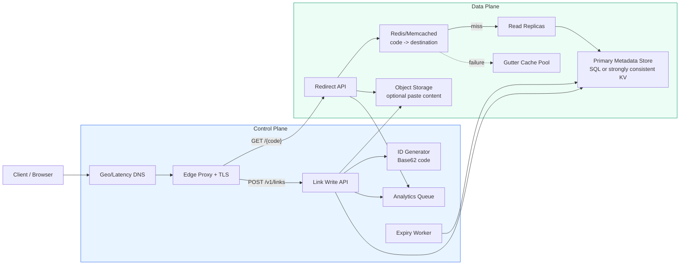
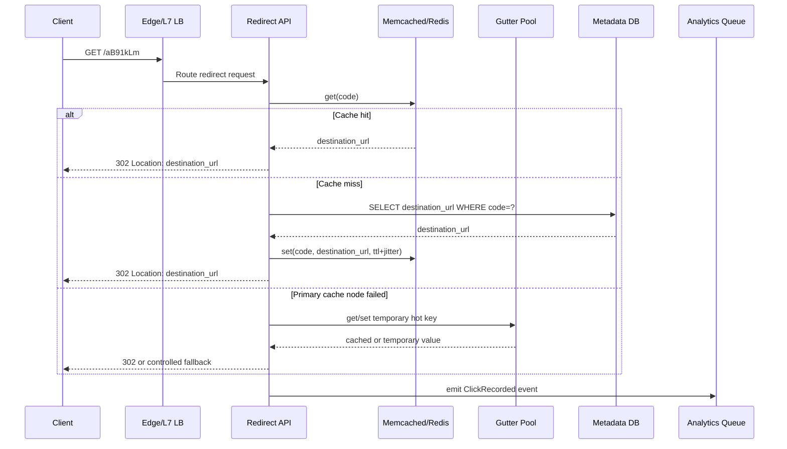
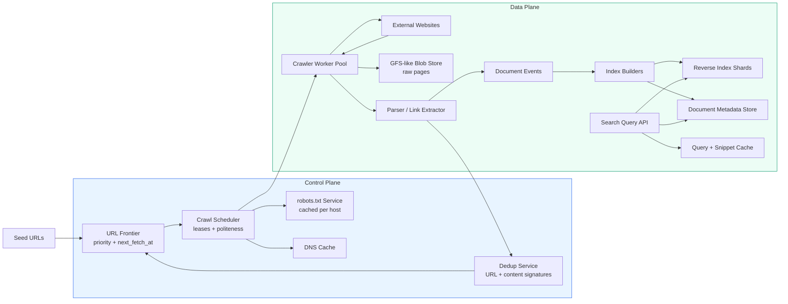
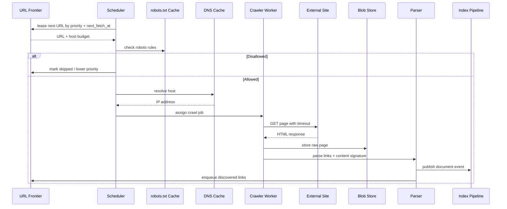
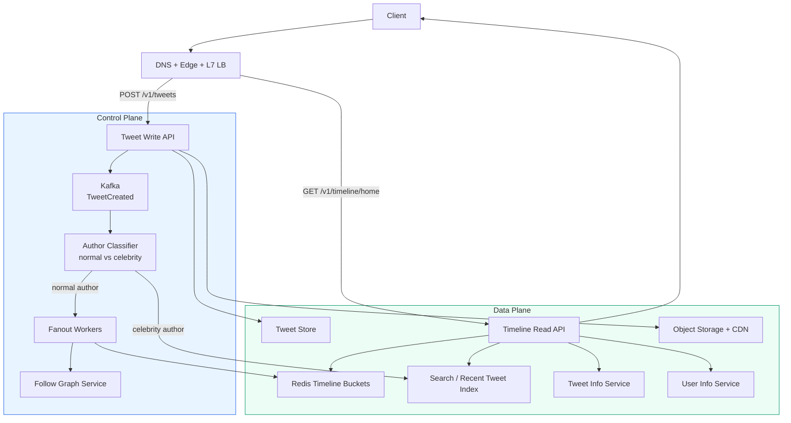
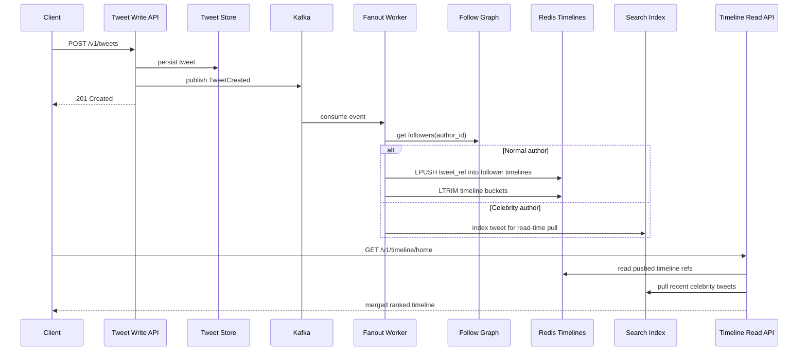
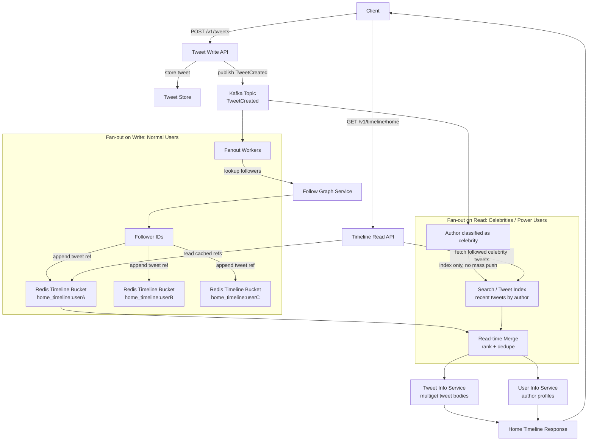
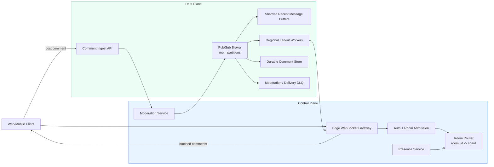
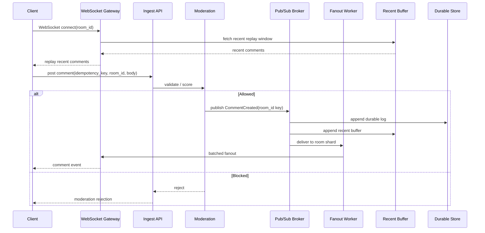

# Real-World System Design Playbook

This playbook turns the academy modules into interview-ready architecture guides.

Each blueprint is structured for senior system design loops: **bound the problem**, **draw the architecture**, **deep-dive the core components**, and **resolve bottlenecks with explicit trade-offs**.

> 🧠 **Staff-engineer note**  
> Strong candidates do not just choose technologies. They explain the failure mode that forced the choice.

---

## Master Comparison

| Blueprint | Read/Write Ratio | Consistency Needs | Primary Scaling Bottleneck | Storage Type | Cache Strategy | Async Patterns |
|---|---:|---|---|---|---|---|
| **URL Shortener** | ~10:1 reads to writes | Strong consistency for code creation; eventual analytics | Viral redirects and hot keys | SQL/KV metadata + object storage for large content | Redis/Memcached for code lookup, negative caching, leases, gutter pool | Click analytics, expiration cleanup |
| **Web Crawler** | Search reads dominate; crawl writes are continuous | Eventual consistency for index freshness; strict politeness constraints | Bandwidth, deduplication, index writes | Distributed blob/chunk storage + inverted index + frontier store | DNS cache, robots cache, query cache, Bloom filters | Crawl frontier, parse/index pipelines |
| **Twitter Timeline** | Extremely read-heavy | Durable tweet writes; eventual timeline/counter consistency | Fan-out explosion and celebrity accounts | Tweet store + graph store + Redis timeline buckets + search index | Redis timeline refs, multiget object cache, gutter pool, leases | Kafka fan-out, indexing, notification jobs |
| **Live Comments System** | Read/broadcast-heavy during live events | Per-stream ordering; idempotent delivery; eventual moderation views | Hot live rooms and WebSocket fanout | Sharded message log + ephemeral buffers + moderation store | Per-room hot buffers, edge connection state, recent message cache | Pub/sub fanout, moderation queues, replay buffers |

---

### URL Shortener

#### 1. Requirements & Bounding (Include clear calculation tables for Storage, QPS, and Bandwidth numbers)

**Functional requirements**

- Create a short URL for a long URL or paste-like object.
- Redirect users from short code to destination.
- Support optional custom aliases and expiration.
- Track click analytics asynchronously.
- Delete or deactivate links.

**Non-functional requirements**

- Redirect path must be extremely fast and highly available.
- Short-code creation must avoid collisions.
- Analytics can be eventually consistent.
- Expired or abusive links must be blocked quickly.

**Assumptions**

| Input | Value |
|---|---:|
| New links | 10 million / month |
| Redirect reads | 100 million / month |
| Read/write ratio | 10:1 |
| Average object | 1 KB content + 300 B metadata |
| Retention | 5 years |
| Short code | 7 Base62 characters |

**Storage**

| Item | Calculation | Result |
|---|---:|---:|
| Monthly writes | 10,000,000 links | 10 million |
| Monthly raw storage | 10,000,000 x 1.3 KB | 13 GB |
| 5-year raw storage | 13 GB x 60 | 780 GB |
| Replication factor 3 | 780 GB x 3 | 2.34 TB |
| Index/metadata overhead | +30% | ~3 TB |

**QPS**

| Traffic | Calculation | Average | 20x Peak |
|---|---:|---:|---:|
| Writes | 10M / 30 / 86,400 | ~4 QPS | ~80 QPS |
| Reads | 100M / 30 / 86,400 | ~39 QPS | ~780 QPS |
| Analytics events | Same as reads | ~39 QPS | ~780 QPS |

**Bandwidth**

| Path | Calculation | Average |
|---|---:|---:|
| Write ingress | 4 QPS x 1.3 KB | ~5.2 KB/s |
| Redirect metadata read | 39 QPS x ~500 B | ~19.5 KB/s |
| Paste/content read | 39 QPS x 1.3 KB | ~51 KB/s |
| Peak content read | 780 QPS x 1.3 KB | ~1 MB/s |

> 📐 **Math check**  
> If read traffic is 1 billion/month instead of 100 million/month, average reads become ~386 QPS and 20x peak becomes ~7,720 QPS. The architecture still works, but cache hit ratio becomes the central SLO.

#### 2. High-Level Architecture (A clear textual map of component placement)

**Component map**



**Critical path: redirect flow**



#### 3. Core Component Deep-Dive (Schema definitions, API endpoint definitions, and algorithmic mechanics)

**API endpoints**

| Endpoint | Method | Purpose |
|---|---|---|
| `/v1/links` | `POST` | Create a short link |
| `/v1/links/{code}` | `GET` | Get owner/admin metadata |
| `/{code}` | `GET` | Redirect user |
| `/v1/links/{code}` | `DELETE` | Deactivate link |
| `/v1/links/{code}/analytics` | `GET` | Read aggregated analytics |

**Idempotent create request**

```json
{
  "idempotency_key": "user-123:create-link:01J5X9Q9",
  "destination_url": "https://example.com/a/very/long/path",
  "custom_alias": null,
  "expires_at": "2027-01-01T00:00:00Z"
}
```

The server stores the `idempotency_key` with the response. If the client retries after a timeout, the API returns the same short code rather than creating duplicates.

**Schema**

```sql
CREATE TABLE short_links (
    code VARCHAR(16) PRIMARY KEY,
    destination_url TEXT NOT NULL,
    content_object_path TEXT NULL,
    owner_user_id BIGINT NULL,
    idempotency_key VARCHAR(128) NULL UNIQUE,
    created_at TIMESTAMP NOT NULL,
    expires_at TIMESTAMP NULL,
    is_active BOOLEAN NOT NULL DEFAULT TRUE
);

-- Speeds up owner dashboards ordered by newest links.
CREATE INDEX idx_short_links_owner_created
ON short_links (owner_user_id, created_at DESC);

-- Allows expiration workers to scan only links that are due for cleanup.
CREATE INDEX idx_short_links_expires_at
ON short_links (expires_at);

-- Supports retry-safe creation for clients that repeat POST /v1/links.
CREATE UNIQUE INDEX idx_short_links_idempotency
ON short_links (idempotency_key);
```

**Short-code generation**

| Strategy | Why Use It | Risk |
|---|---|---|
| ID generator -> Base62 | No collisions and compact codes | Predictable unless salted or shuffled |
| Random Base62 | Hard to enumerate | Must retry on collision |
| Hash URL + salt | Deterministic option | Collision and duplicate semantics need care |

Recommended design: allocate IDs from a dedicated ID service, encode with Base62, and reserve custom aliases through a unique constraint.

#### 4. Scaling & Bottleneck Resolutions (Applying lessons from GFS, Dynamo, and Memcached)

**What if...? Viral link + cache node failure**

> ⚠️ **Failure mode**  
> A viral code is served mostly from one cache node. That node fails. Clients rehash to the remaining cache fleet or fall through to the database. The database sees a sudden hot-key storm and redirect latency spikes.

**Walkthrough**

1. Viral code `xYz1234` reaches hundreds of thousands of QPS.
2. Its cache owner node fails.
3. Redirect API starts missing.
4. Without protection, every miss queries the metadata DB.
5. DB connection pool saturates.
6. Redirects fail globally even though the mapping is small and stable.

**Mitigation**

| Step | Action |
|---|---|
| 1 | Route failed-node keys to a small **gutter pool** instead of rehashing broadly |
| 2 | Use request coalescing or Facebook-style leases so one request refills the key |
| 3 | Serve stale cached redirects briefly when safe |
| 4 | Add negative caching for nonexistent codes |
| 5 | Replicate viral keys across multiple cache nodes |

**Decision log**

| Decision | Choice | Rationale |
|---|---|---|
| Metadata store | SQL or strongly consistent KV | Code uniqueness and idempotent creation need strong constraints |
| Redirect cache | Redis/Memcached | Redirect path is read-heavy and latency-sensitive |
| Analytics | Async queue | Click tracking must not slow redirect |
| Blob content | Object storage | Keeps large data out of metadata DB |
| Hot-key mitigation | Leases + gutter pool | Prevents cache failure from becoming DB failure |

---

### Web Crawler

#### 1. Requirements & Bounding (Include clear calculation tables for Storage, QPS, and Bandwidth numbers)

**Functional requirements**

- Crawl discovered URLs.
- Respect robots.txt and per-host politeness.
- Deduplicate pages and avoid graph cycles.
- Extract links, titles, snippets, and content signatures.
- Build reverse index from terms to documents.
- Serve search queries with ranked results.

**Non-functional requirements**

- Horizontal crawl scalability.
- Low-latency search serving.
- Tunable freshness by domain importance.
- Strict protection against over-crawling external sites.

**Assumptions**

| Input | Value |
|---|---:|
| URLs tracked | 1 billion |
| Recrawl frequency | Weekly |
| Crawls / month | ~4 billion |
| Average page | 500 KB |
| Crawl throughput | 1,600 pages/sec |
| Search traffic | 40,000 QPS |
| Raw retention | 3 years |

**Storage**

| Item | Calculation | Result |
|---|---:|---:|
| Monthly raw crawl | 4B x 500 KB | 2 PB/month |
| 3-year raw crawl | 2 PB x 36 | 72 PB |
| Replication factor 3 | 72 PB x 3 | 216 PB |
| Index storage estimate | 10-30% raw | 7.2-21.6 PB |

**QPS**

| Traffic | Estimate |
|---|---:|
| Crawl fetches | 1,600/sec |
| Link extraction writes | Tens of thousands/sec |
| Document index writes | 1,600 docs/sec plus term postings |
| Search reads | 40,000 QPS |
| Peak query multiplier | 5-10x during events |

**Bandwidth**

| Path | Calculation | Result |
|---|---:|---:|
| Crawl ingress | 1,600 x 500 KB/sec | 800 MB/sec |
| Daily crawl ingress | 800 MB/sec x 86,400 | ~69 TB/day |
| Search egress | 40,000 x 20 KB | ~800 MB/sec |

> 📐 **Math check**  
> If the average page is compressed to 100 KB before long-term storage, 3-year raw storage drops from 72 PB to ~14.4 PB before replication. Compression and tiering are not optimizations here; they are architectural requirements.

#### 2. High-Level Architecture (A clear textual map of component placement)



**Critical path: crawl scheduling**



#### 3. Core Component Deep-Dive (Schema definitions, API endpoint definitions, and algorithmic mechanics)

**APIs**

| Endpoint | Method | Purpose |
|---|---|---|
| `/v1/seeds` | `POST` | Add seed URLs |
| `/v1/crawl-status/{url_hash}` | `GET` | Inspect crawl status |
| `/v1/search?q=...` | `GET` | Query indexed documents |
| `/v1/documents/{doc_id}` | `GET` | Fetch document metadata |

**URL frontier schema**

```sql
CREATE TABLE url_frontier (
    url_hash CHAR(64) PRIMARY KEY,
    canonical_url TEXT NOT NULL,
    host VARCHAR(255) NOT NULL,
    priority_score DOUBLE PRECISION NOT NULL,
    next_fetch_at TIMESTAMP NOT NULL,
    last_fetch_at TIMESTAMP NULL,
    crawl_depth INT NOT NULL,
    status VARCHAR(32) NOT NULL
);

-- Pulls due URLs in priority order for scheduler workers.
CREATE INDEX idx_frontier_next_fetch
ON url_frontier (next_fetch_at, priority_score DESC);

-- Enforces per-host crawl budgets and politeness windows.
CREATE INDEX idx_frontier_host
ON url_frontier (host, next_fetch_at);
```

**Document metadata schema**

```sql
CREATE TABLE documents (
    doc_id BIGINT PRIMARY KEY,
    url_hash CHAR(64) NOT NULL,
    canonical_url TEXT NOT NULL,
    content_hash CHAR(64) NOT NULL,
    title TEXT NULL,
    snippet TEXT NULL,
    language VARCHAR(16) NULL,
    fetched_at TIMESTAMP NOT NULL,
    raw_object_path TEXT NOT NULL
);

-- Finds exact duplicate content across different URLs.
CREATE INDEX idx_documents_content_hash
ON documents (content_hash);

-- Supports freshness scans and recrawl analytics.
CREATE INDEX idx_documents_fetched_at
ON documents (fetched_at);
```

**Concrete posting list example**

```json
{
  "term": "consistent",
  "df": 3,
  "postings": [
    { "doc_id": 101, "tf": 4, "positions": [12, 84, 130, 220], "fields": ["title", "body"], "score_hint": 0.93 },
    { "doc_id": 220, "tf": 2, "positions": [44, 91], "fields": ["body"], "score_hint": 0.71 },
    { "doc_id": 918, "tf": 1, "positions": [17], "fields": ["snippet"], "score_hint": 0.52 }
  ]
}
```

Compact production systems often delta-encode sorted `doc_id`s and positions, then compress postings blocks.

#### 4. Scaling & Bottleneck Resolutions (Applying lessons from GFS, Dynamo, and Memcached)

**What if...? robots.txt misconfiguration + politeness failure**

> ⚠️ **Failure mode**  
> A robots cache bug treats missing robots rules as "allow all" and the scheduler ignores per-host budgets. Thousands of workers crawl one domain aggressively, creating external harm and getting the crawler blocked.

**Walkthrough**

1. robots.txt fetch fails due to timeout.
2. Bug marks host as fully crawlable.
3. Frontier has many high-priority URLs for that host.
4. Scheduler assigns too many workers to the same domain.
5. External site rate limits or blocks the crawler.
6. Crawl freshness drops and legal/abuse risk rises.

**Mitigation**

| Step | Action |
|---|---|
| 1 | Fail closed or conservative when robots state is unknown |
| 2 | Enforce host-level token bucket regardless of URL priority |
| 3 | Add global per-domain concurrency caps |
| 4 | Track HTTP 429/403 spikes and automatically cool down host |
| 5 | Audit scheduler leases and robots decisions |

**Decision log**

| Decision | Choice | Rationale |
|---|---|---|
| Raw page storage | GFS-like blob/chunk store | Petabyte-scale data plane requires distributed storage |
| Frontier | Priority queue / sorted-set model | Crawl order depends on freshness and importance |
| Reverse index | Specialized index shards | Term lookups need posting-list efficiency |
| Dedup | Hashes + near-duplicate signatures | Prevents graph loops and duplicate storage |
| Politeness | Host-level scheduler budget | External systems must be protected |

---

### Twitter Timeline

#### 1. Requirements & Bounding (Include clear calculation tables for Storage, QPS, and Bandwidth numbers)

**Functional requirements**

- Users post tweets.
- Users follow other users.
- Home timeline shows followed accounts.
- User timeline shows one author's tweets.
- Support likes, replies, reposts, media, and search.
- Handle celebrities with millions of followers.

**Non-functional requirements**

- Low-latency home timeline reads.
- Durable tweet creation.
- Eventually consistent timelines and counters are acceptable.
- Celebrity fan-out must not overload the system.

**Assumptions**

| Input | Value |
|---|---:|
| Active users | 100 million |
| Tweets/day | 500 million |
| Tweets/month | 15 billion |
| Tweet payload + metadata | 10 KB |
| Average fanout deliveries/tweet | 10 |
| Home timeline reads | 100,000 QPS |
| Tweet writes | 6,000 QPS |
| Search | 4,000 QPS |

**Storage**

| Item | Calculation | Result |
|---|---:|---:|
| Tweet object storage/month | 15B x 10 KB | 150 TB |
| Tweet object storage/3 years | 150 TB x 36 | 5.4 PB |
| Fanout refs/month | 150B x 16 B | 2.4 TB |
| Fanout refs/3 years | 2.4 TB x 36 | 86.4 TB |
| Tweet storage RF=3 | 5.4 PB x 3 | 16.2 PB |

**QPS and bandwidth**

| Traffic | Estimate |
|---|---:|
| Tweet writes | ~6,000 QPS |
| Home timeline reads | ~100,000 QPS |
| Fanout deliveries | ~60,000/sec average |
| Search | ~4,000 QPS |
| Timeline read egress | 100,000 x 50 KB = ~5 GB/s |

> 📐 **Math check**  
> If average fanout rises from 10 to 200, fanout deliveries jump from 60,000/sec to ~1.2 million/sec. The hybrid celebrity strategy becomes mandatory, not optional.

#### 2. High-Level Architecture (A clear textual map of component placement)



**Critical path: home timeline fan-out**



#### 3. Core Component Deep-Dive (Schema definitions, API endpoint definitions, and algorithmic mechanics)

**APIs**

| Endpoint | Method | Purpose |
|---|---|---|
| `/v1/tweets` | `POST` | Create tweet |
| `/v1/users/{user_id}/tweets` | `GET` | User timeline |
| `/v1/timeline/home` | `GET` | Home timeline |
| `/v1/users/{user_id}/follow` | `POST` | Follow user |
| `/v1/users/{user_id}/follow` | `DELETE` | Unfollow user |
| `/v1/search/tweets?q=...` | `GET` | Search tweets |

**Schema**

```sql
CREATE TABLE tweets (
    tweet_id BIGINT PRIMARY KEY,
    author_id BIGINT NOT NULL,
    body TEXT NOT NULL,
    media_object_paths JSONB NULL,
    created_at TIMESTAMP NOT NULL,
    visibility VARCHAR(32) NOT NULL,
    reply_to_tweet_id BIGINT NULL
);

-- Supports user timeline reads in reverse chronological order.
CREATE INDEX idx_tweets_author_created
ON tweets (author_id, created_at DESC);

CREATE TABLE follows (
    follower_id BIGINT NOT NULL,
    followee_id BIGINT NOT NULL,
    created_at TIMESTAMP NOT NULL,
    PRIMARY KEY (follower_id, followee_id)
);

-- Supports fanout lookup: who follows this author?
CREATE INDEX idx_follows_followee
ON follows (followee_id);
```

**Redis bucket**

```text
home_timeline:{user_id} -> [
  { tweet_id, author_id, created_at },
  ...
]
```

Store compact refs, not full tweet bodies.

**Push vs pull fan-out**



#### 4. Scaling & Bottleneck Resolutions (Applying lessons from GFS, Dynamo, and Memcached)

**What if...? Celebrity tweet + read-time merge breakdown**

> ⚠️ **Failure mode**  
> A celebrity tweet is not pushed to follower timelines. It must be pulled and merged at read time. If the search/recent-tweet index lags or fails, users miss celebrity tweets while their cached normal timeline still loads.

**Walkthrough**

1. Celebrity posts tweet.
2. Tweet is persisted and indexed for pull model.
3. Search index falls behind.
4. Timeline Read API reads Redis timeline refs successfully.
5. Celebrity pull query times out.
6. Users see a stale timeline missing celebrity content.

**Mitigation**

| Step | Action |
|---|---|
| 1 | Keep a small dedicated recent-tweets cache for celebrity authors |
| 2 | Use timeout-bounded merge and return partial results |
| 3 | Mark response as degraded for observability |
| 4 | Fall back to Tweet Store query for followed celebrity IDs when safe |
| 5 | Backpressure celebrity indexing independently from normal fanout |

> 🧠 **Staff-engineer note**  
> The hybrid timeline model creates two correctness paths: pushed normal tweets and pulled celebrity tweets. The merge layer must be observable as its own dependency, not hidden inside the read API.

**Decision log**

| Decision | Choice | Rationale |
|---|---|---|
| Timeline refs | Redis lists | O(1) recent timeline reads |
| Fanout model | Hybrid push/pull | Normal users optimize reads; celebrities avoid write explosion |
| Event transport | Kafka | Fanout needs partitioning, replay, and backpressure |
| Media | Object storage + CDN | Large media should not pass through tweet DB |
| Cache failure | Gutter pool + leases | Prevents cache outage from crushing stores |

---

### Live Comments System

#### 1. Requirements & Bounding (Include clear calculation tables for Storage, QPS, and Bandwidth numbers)

**Functional requirements**

- Users join a live stream comment room.
- Users post comments.
- Viewers receive comments in near real time.
- Moderators can delete or suppress comments.
- Late joiners receive recent history.
- System supports high-traffic live events.

**Non-functional requirements**

- Low-latency fanout over WebSockets.
- Per-room ordering is preferred.
- Duplicate message delivery must not duplicate display.
- Moderation actions must propagate quickly.
- System must isolate hot live rooms.

**Assumptions**

| Input | Value |
|---|---:|
| Concurrent viewers for large event | 1 million |
| Active commenters | 1% of viewers |
| Comment rate/commenter | 1 comment / 30 sec |
| Average message payload | 300 B |
| Recent replay window | 5 minutes |

**QPS**

| Traffic | Calculation | Result |
|---|---:|---:|
| Active commenters | 1,000,000 x 1% | 10,000 |
| Comment writes | 10,000 / 30 sec | ~333 QPS |
| Fanout deliveries | 333 x 1,000,000 | impossible as direct per-message fanout |
| WebSocket connections | 1,000,000 viewers | 1M long-lived sockets |

**Storage and bandwidth**

| Item | Calculation | Result |
|---|---:|---:|
| Raw comments/hour | 333/sec x 3,600 x 300 B | ~360 MB/hour |
| 24h raw comments | 360 MB x 24 | ~8.6 GB/day for one huge room |
| Direct fanout bandwidth | 333/sec x 1M x 300 B | ~100 GB/sec |

> 📐 **Math check**  
> Directly sending every comment to every viewer does not scale. Large rooms need sampling, batching, ranking, regional fanout trees, or client-side throttling.

#### 2. High-Level Architecture (A clear textual map of component placement)



**Critical path: comment delivery**



#### 3. Core Component Deep-Dive (Schema definitions, API endpoint definitions, and algorithmic mechanics)

**APIs**

| Endpoint | Method | Purpose |
|---|---|---|
| `/v1/live/{room_id}/connect` | WebSocket | Join comment stream |
| `/v1/live/{room_id}/comments` | `POST` | Submit comment |
| `/v1/live/{room_id}/comments/recent` | `GET` | Fetch recent replay |
| `/v1/live/{room_id}/moderation/{comment_id}` | `DELETE` | Remove comment |

**Comment schema**

```sql
CREATE TABLE live_comments (
    room_id BIGINT NOT NULL,
    comment_id BIGINT NOT NULL,
    author_id BIGINT NOT NULL,
    idempotency_key VARCHAR(128) NOT NULL,
    body TEXT NOT NULL,
    created_at TIMESTAMP NOT NULL,
    moderation_state VARCHAR(32) NOT NULL,
    PRIMARY KEY (room_id, comment_id)
);

-- Prevents duplicate comments when clients retry POST after timeout.
CREATE UNIQUE INDEX idx_live_comments_idempotency
ON live_comments (room_id, author_id, idempotency_key);

-- Supports recent replay when a viewer joins a live room.
CREATE INDEX idx_live_comments_room_created
ON live_comments (room_id, created_at DESC);
```

**Idempotency example**

```json
{
  "room_id": "stream-900",
  "idempotency_key": "user-77:stream-900:msg-00042",
  "body": "This launch is incredible"
}
```

**Algorithmic mechanics**

| Mechanic | Purpose |
|---|---|
| Shard by `room_id` | Keeps per-room ordering manageable |
| Batch fanout | Reduces per-message network overhead |
| Recent buffer | Supports late join replay |
| Regional fanout tree | Avoids one central broadcaster |
| Moderation queue | Separates safety processing from socket delivery |
| Client sequence numbers | Deduplicate repeated delivery |

#### 4. Scaling & Bottleneck Resolutions (Applying lessons from GFS, Dynamo, and Memcached)

**What if...? Hot room overwhelms fanout**

> ⚠️ **Failure mode**  
> A major live event reaches 1 million viewers. Every comment cannot be sent individually to every socket. Fanout workers saturate and WebSocket gateways build memory queues.

**Walkthrough**

1. A live stream becomes globally popular.
2. Comment rate rises to hundreds or thousands of messages per second.
3. Fanout workers attempt to broadcast every message to every connected viewer.
4. WebSocket gateway send buffers grow.
5. Slow clients hold memory and connection resources.
6. Gateways begin dropping connections or timing out heartbeats.
7. Viewers see delayed, duplicated, or missing comments.

**Mitigation**

| Step | Action |
|---|---|
| 1 | Batch comments into 250-500 ms frames |
| 2 | Apply per-room rate limits and slow-mode |
| 3 | Use ranked/top comments for enormous rooms |
| 4 | Shard viewers by region and gateway |
| 5 | Drop non-critical comments before dropping connections |
| 6 | Keep recent replay buffer so clients can resync |

**Decision log**

| Decision | Choice | Rationale |
|---|---|---|
| Client protocol | WebSockets | Bidirectional low-latency updates |
| Broker | Partitioned pub/sub | Room-based ordering and fanout |
| Storage | Append-oriented comment log | Replay, audit, moderation |
| Dedup | Idempotency key + client sequence | Required under retries |
| Hot-room strategy | Batching + ranking + regional fanout | Direct broadcast is too expensive |

---

## 10-Point System Design Evaluation Checklist

- [ ] **Explicit bounding:** Calculates storage, read/write QPS, peak multipliers, and bandwidth before choosing architecture.
- [ ] **Clear requirements:** Separates functional requirements, non-functional requirements, and consistency boundaries.
- [ ] **Layered request path:** Places DNS, CDN, L4/L7 load balancers, stateless APIs, caches, queues, and databases coherently.
- [ ] **Storage fit:** Chooses SQL, NoSQL, object storage, graph storage, or search indexes based on access patterns.
- [ ] **Cache depth:** Addresses hot keys, stampedes, TTL jitter, negative caching, leases, and emergency cache capacity.
- [ ] **Async decoupling:** Uses queues or logs to isolate slow work, fanout, analytics, indexing, and retries.
- [ ] **Backpressure:** Defines what happens when workers, brokers, databases, or downstream APIs cannot keep up.
- [ ] **Distributed correctness:** Applies CAP, replication lag handling, vector clocks, idempotency, or leader/lease concepts where relevant.
- [ ] **Global design:** Explains multi-region routing, replication, CDN/object storage placement, and read-after-write behavior.
- [ ] **Graceful degradation:** States exactly what users see during partial failures and how core flows remain available.
