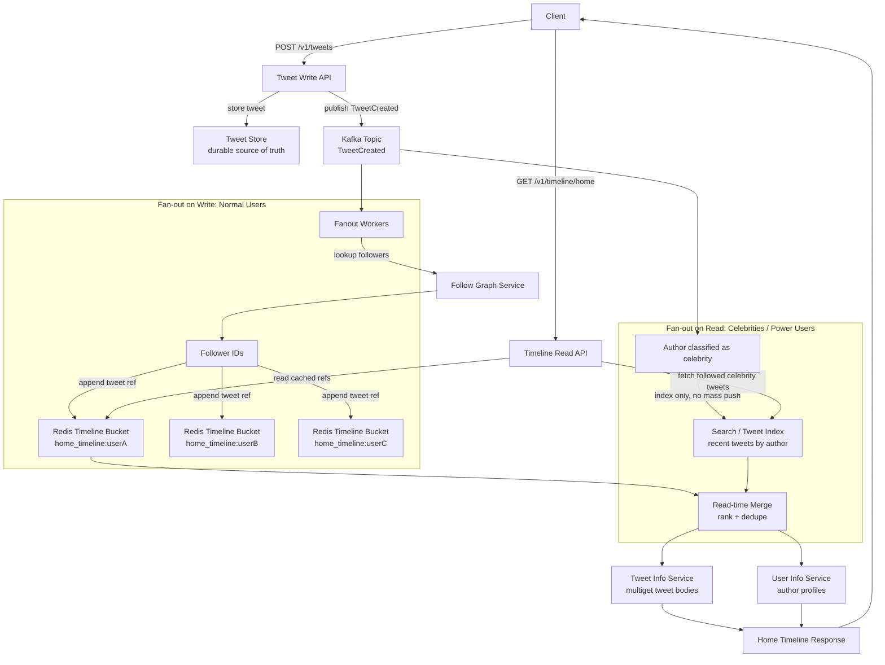

# Real-World System Design Blueprints

This guide turns the repository's core modules into whiteboard-ready architecture playbooks.

The goal is not to memorize diagrams. The goal is to show senior engineering judgment: bound the system mathematically, choose the right storage and communication patterns, identify failure modes early, and explain how the system behaves under stress.

---

### URL Shortener

#### 1. Requirements & Bounding (Include clear calculation tables for Storage, QPS, and Bandwidth numbers)

**Functional requirements**

- Create a short URL for a long URL or paste-like text object.
- Redirect users from a short code to the original URL or stored content.
- Support optional custom aliases and expiration.
- Track click analytics asynchronously.
- Delete or expire old links.

**Non-functional requirements**

- Redirects must be extremely low latency.
- Reads are much higher than writes.
- System should prefer availability for redirects.
- Link creation should avoid collisions.
- Analytics can be eventually consistent.

**Assumptions**

| Input | Value |
|---|---:|
| New URLs / pastes | 10 million / month |
| Reads / redirects | 100 million / month |
| Read-to-write ratio | 10:1 |
| Average stored object | 1 KB content + 300 B metadata = 1.3 KB |
| Retention window | 5 years |
| Short code length | 7 Base62 characters |

**Storage estimate**

| Item | Calculation | Result |
|---|---:|---:|
| Monthly writes | 10,000,000 objects | 10 million |
| Monthly raw storage | 10,000,000 x 1.3 KB | 13 GB / month |
| 5-year raw storage | 13 GB x 60 months | 780 GB |
| Replication factor 3 | 780 GB x 3 | 2.34 TB |
| Index and overhead estimate | ~30% | ~3.0 TB total |

**QPS estimate**

| Traffic Type | Calculation | Average QPS |
|---|---:|---:|
| Writes | 10,000,000 / 30 days / 86,400 sec | ~4 QPS |
| Reads | 100,000,000 / 30 days / 86,400 sec | ~39 QPS |
| Peak multiplier | 20x average | ~80 write QPS, ~780 read QPS |

**Bandwidth estimate**

| Path | Calculation | Average |
|---|---:|---:|
| Write ingress | 4 QPS x 1.3 KB | ~5.2 KB/s |
| Read egress | 39 QPS x 1.3 KB | ~51 KB/s |
| Peak read egress | 780 QPS x 1.3 KB | ~1 MB/s |

These averages are modest. The design challenge is not average traffic. It is **viral hot links**, cache stampedes, global latency, and maintaining redirect availability.

#### 2. High-Level Architecture (A clear textual map of component placement)

**Create path**

1. Client sends `POST /v1/links` to the nearest edge.
2. DNS uses latency or geolocation routing.
3. CDN is mostly bypassed for writes.
4. L7 load balancer terminates TLS and routes to Link Write API.
5. Write API validates input and generates a short code.
6. Metadata is written to the primary database.
7. Large paste content, if supported, is stored in object storage.
8. Analytics event is published to Kafka or RabbitMQ.
9. API returns the short URL.

**Redirect path**

1. Client requests `GET /{short_code}`.
2. Edge proxy routes to Redirect API.
3. Redirect API checks Redis/Memcached for `short_code -> destination`.
4. On hit, return `301` or `302`.
5. On miss, read from database, populate cache with TTL, then redirect.
6. Emit click event asynchronously.

**Component placement**

| Layer | Component | Role |
|---|---|---|
| Edge | DNS, CDN, L7 load balancer | Global routing, TLS termination, request filtering |
| API | Link Write API, Redirect API | Separate write and read scaling |
| Cache | Redis/Memcached | Hot short-code lookup |
| Storage | SQL or strongly consistent KV store | Source of truth for code mapping |
| Object storage | S3/GCS-like blob store | Optional paste content |
| Async | Kafka/RabbitMQ | Click analytics and expiration workflows |
| Analytics | Stream processors + warehouse | Click counts, dashboards, abuse detection |

#### 3. Core Component Deep-Dive (Schema definitions, API endpoint definitions, and algorithmic mechanics)

**API endpoints**

| Endpoint | Method | Purpose |
|---|---|---|
| `/v1/links` | `POST` | Create short link |
| `/v1/links/{code}` | `GET` | Fetch metadata for owner/admin |
| `/{code}` | `GET` | Redirect user |
| `/v1/links/{code}` | `DELETE` | Delete or deactivate link |
| `/v1/links/{code}/analytics` | `GET` | Read aggregated analytics |

**Create request**

```json
{
  "destination_url": "https://example.com/a/very/long/path",
  "custom_alias": "optionalAlias",
  "expires_at": "2027-01-01T00:00:00Z"
}
```

**Core schema**

```sql
CREATE TABLE short_links (
    code VARCHAR(16) PRIMARY KEY,
    destination_url TEXT NOT NULL,
    content_object_path TEXT NULL,
    owner_user_id BIGINT NULL,
    created_at TIMESTAMP NOT NULL,
    expires_at TIMESTAMP NULL,
    is_active BOOLEAN NOT NULL DEFAULT TRUE
);

CREATE INDEX idx_short_links_owner_created
ON short_links (owner_user_id, created_at);

CREATE INDEX idx_short_links_expires_at
ON short_links (expires_at);
```

**Analytics event schema**

```json
{
  "event_id": "uuid",
  "code": "aB91kLm",
  "timestamp": "2026-05-21T10:00:00Z",
  "ip_hash": "privacy-preserving-hash",
  "user_agent": "browser-agent",
  "referer": "https://source.example"
}
```

**Short-code generation**

Base62 alphabet:

```text
abcdefghijklmnopqrstuvwxyzABCDEFGHIJKLMNOPQRSTUVWXYZ0123456789
```

A 7-character Base62 code provides:

```text
62^7 = 3,521,614,606,208 possible codes
```

That is far above the 5-year requirement of:

```text
10 million/month x 60 months = 600 million codes
```

**Generation options**

| Strategy | Strength | Risk |
|---|---|---|
| Auto-increment ID -> Base62 | No collisions, compact | Predictable unless obfuscated |
| Random 7-char Base62 | Simple, hard to enumerate | Collision handling required |
| Hash URL + salt -> Base62 | Deterministic option | Collisions and duplicate semantics need care |
| Dedicated ID service | High scale and no collisions | New infrastructure dependency |

Recommended interview answer: use a dedicated ID generator or monotonic ID range allocator, then Base62 encode the ID. For custom aliases, enforce uniqueness with the primary key.

#### 4. Scaling & Bottleneck Resolutions (Applying lessons from GFS, Dynamo, and Memcached)

**Hot links**

Viral links create hot keys. Use Redis/Memcached in front of the database and apply cache-stampede controls.

| Problem | Resolution |
|---|---|
| Many cache misses for same viral code | Facebook-style leases or request coalescing |
| Cache node failure sends traffic to DB | Gutter pool or emergency cache tier |
| TTL avalanche | Randomized TTL jitter |
| Nonexistent code attack | Negative caching and Bloom filter |

**Database scaling**

| Pressure | Resolution |
|---|---|
| Read pressure | Cache + read replicas |
| Write pressure | Shard by code prefix or hash(code) |
| Expiration scans | Index on `expires_at` and async cleanup workers |
| Analytics writes | Kafka stream, not synchronous DB writes |

**Dynamo lesson**

Redirects are availability-sensitive. For cached redirect mappings, the system can tolerate brief staleness better than outage. Use eventually consistent replicas for global reads, but route owner/admin writes through a primary path.

**GFS lesson**

If paste content or preview blobs grow large, keep metadata separate from blob data. Store link metadata in a database and large content in object storage, so the database does not become the data plane for bulky reads.

---

### Web Crawler

#### 1. Requirements & Bounding (Include clear calculation tables for Storage, QPS, and Bandwidth numbers)

**Functional requirements**

- Crawl discovered URLs.
- Respect robots.txt, politeness rules, and per-host rate limits.
- Deduplicate pages and avoid infinite crawl loops.
- Extract links, titles, snippets, and content signatures.
- Build a reverse index from terms to documents.
- Serve search queries with ranked results.

**Non-functional requirements**

- Massive horizontal scalability.
- High throughput ingestion.
- Freshness should be tunable by domain importance.
- Search query latency must be low.
- Crawling must not overload external websites.

**Assumptions**

| Input | Value |
|---|---:|
| Unique URLs tracked | 1 billion |
| Recrawl frequency | Weekly average |
| URLs crawled / month | ~4 billion |
| Average fetched page | 500 KB |
| Search QPS | 40,000 QPS |
| Crawl write throughput | 1,600 pages/sec |
| Retention window | 3 years raw/archive |

**Storage estimate**

| Item | Calculation | Result |
|---|---:|---:|
| Monthly raw crawl | 4B pages x 500 KB | 2 PB / month |
| 3-year raw crawl | 2 PB x 36 | 72 PB |
| Replication factor 3 | 72 PB x 3 | 216 PB |
| Index storage estimate | 10-30% of raw | 7.2-21.6 PB |

In practice, systems compress, summarize, tier, and expire aggressively. The raw number proves this is a distributed storage problem, not a single database problem.

**QPS estimate**

| Traffic Type | Estimate |
|---|---:|
| Crawl fetches | 1,600 pages/sec |
| Link extraction writes | Tens of thousands/sec depending page fanout |
| Index writes | 1,600 documents/sec plus term postings |
| Search reads | 40,000 QPS |
| Peak query multiplier | 5-10x by event/news cycle |

**Bandwidth estimate**

| Path | Calculation | Result |
|---|---:|---:|
| Crawl ingress | 1,600 x 500 KB/sec | 800 MB/sec |
| Crawl ingress daily | 800 MB/sec x 86,400 | ~69 TB/day |
| Search response egress | 40,000 x 20 KB | ~800 MB/sec |

#### 2. High-Level Architecture (A clear textual map of component placement)

**Crawler control path**

1. Seed URLs enter the frontier.
2. URL Frontier prioritizes URLs by freshness, popularity, domain budget, and politeness.
3. Scheduler assigns URLs to crawler workers.
4. Crawler workers use DNS cache and connection pools.
5. Fetcher downloads pages.
6. Parser extracts links, text, title, canonical URL, and content fingerprint.
7. Dedup service checks URL and content signatures.
8. Raw content is written to distributed object/chunk storage.
9. Parsed document events are published to indexing pipelines.

**Search serving path**

1. User query enters DNS/CDN/edge.
2. L7 load balancer routes to Query API.
3. Query API normalizes terms.
4. Reverse Index Service returns candidate document IDs.
5. Ranking service scores candidates.
6. Document service returns titles and snippets.
7. Cache stores hot query results and document snippets.

**Component placement**

| Layer | Component | Role |
|---|---|---|
| Frontier | Priority queues / sorted sets | Decide what to crawl next |
| Fetch | Crawler workers | Download pages safely |
| Storage | GFS-like distributed blob store | Store raw pages and snapshots |
| Processing | Kafka + stream/batch jobs | Parse, dedup, index |
| Index | Inverted index shards | Term -> posting lists |
| Serving | Query API, rankers, snippet service | Low-latency search results |
| Cache | Query cache, document cache | Hot result acceleration |

#### 3. Core Component Deep-Dive (Schema definitions, API endpoint definitions, and algorithmic mechanics)

**Crawler APIs**

| Endpoint | Method | Purpose |
|---|---|---|
| `/v1/seeds` | `POST` | Add seed URLs |
| `/v1/crawl-status/{url_hash}` | `GET` | Inspect crawl status |
| `/v1/search?q=...` | `GET` | Query indexed documents |
| `/v1/documents/{doc_id}` | `GET` | Fetch stored document metadata |

**URL frontier schema**

```sql
CREATE TABLE url_frontier (
    url_hash CHAR(64) PRIMARY KEY,
    canonical_url TEXT NOT NULL,
    host VARCHAR(255) NOT NULL,
    priority_score DOUBLE PRECISION NOT NULL,
    next_fetch_at TIMESTAMP NOT NULL,
    last_fetch_at TIMESTAMP NULL,
    crawl_depth INT NOT NULL,
    status VARCHAR(32) NOT NULL
);

CREATE INDEX idx_frontier_next_fetch
ON url_frontier (next_fetch_at, priority_score);

CREATE INDEX idx_frontier_host
ON url_frontier (host, next_fetch_at);
```

**Document metadata schema**

```sql
CREATE TABLE documents (
    doc_id BIGINT PRIMARY KEY,
    url_hash CHAR(64) NOT NULL,
    canonical_url TEXT NOT NULL,
    content_hash CHAR(64) NOT NULL,
    title TEXT NULL,
    snippet TEXT NULL,
    language VARCHAR(16) NULL,
    fetched_at TIMESTAMP NOT NULL,
    raw_object_path TEXT NOT NULL
);

CREATE INDEX idx_documents_content_hash
ON documents (content_hash);
```

**Reverse index model**

```text
term -> [
  { doc_id, term_frequency, positions, field_mask, freshness_score },
  ...
]
```

This is usually stored in specialized index shards, not a generic relational table.

**Crawler mechanics**

| Mechanic | Purpose |
|---|---|
| URL canonicalization | Avoid crawling the same page under many URL variants |
| robots.txt cache | Respect crawl rules without repeated fetches |
| Per-host politeness | Avoid overwhelming external websites |
| DNS cache | Reduce lookup overhead |
| Connection pooling | Avoid repeated TCP handshakes |
| Content fingerprint | Detect duplicate or near-duplicate pages |
| Bloom filter | Fast "probably seen" check for URLs |
| Priority frontier | Crawl important or stale pages first |

**Deduplication**

- Exact duplicate: compare content hash.
- Near duplicate: use shingles plus Jaccard similarity or cosine similarity.
- URL duplicate: canonicalize scheme, host, path, query parameters, and trailing slashes.

#### 4. Scaling & Bottleneck Resolutions (Applying lessons from GFS, Dynamo, and Memcached)

**GFS lesson: separate control flow from data flow**

The crawler scheduler should not move page bytes. It should assign work and track metadata. Crawler workers write raw pages directly to distributed blob/chunk storage. Indexers consume document events asynchronously.

| Plane | Responsibility |
|---|---|
| Control plane | URL scheduling, politeness, metadata, leases |
| Data plane | Fetching, storing raw pages, indexing payloads |

**Dynamo lesson: partitioned ownership**

Use consistent hashing for URL ownership:

- `hash(host)` for politeness and host-local scheduling.
- `hash(url)` for dedup and metadata sharding.
- Replicate frontier shards so workers can recover after failure.

**Memcached lesson: protect hot reads**

Search has hot queries. Cache:

- Popular query result pages.
- Document snippets.
- robots.txt by host.
- DNS results.
- URL seen checks with Bloom filters.

**Bottlenecks and fixes**

| Bottleneck | Resolution |
|---|---|
| Network bandwidth | Distributed fetchers, per-region crawling, compression |
| DNS overhead | Local DNS cache with refresh and negative caching |
| External site overload | Per-host rate limits and crawl budgets |
| Duplicate content explosion | Fingerprinting, Bloom filters, canonicalization |
| Index write pressure | Kafka buffering and partitioned index builders |
| Hot search queries | Cache with leases and jittered TTLs |
| Worker failures | Queue leases, retries, idempotent document writes |

---

### Twitter Timeline

#### 1. Requirements & Bounding (Include clear calculation tables for Storage, QPS, and Bandwidth numbers)

**Functional requirements**

- Users post tweets.
- Users follow other users.
- Home timeline shows recent posts from followed accounts.
- User timeline shows posts by one user.
- Support likes, replies, reposts, media, and search.
- Support celebrity accounts with millions of followers.

**Non-functional requirements**

- Extremely low read latency for home timeline.
- High availability for timeline reads.
- Writes should be durable quickly.
- Fan-out should not collapse under celebrity posts.
- Some counters and timelines can be eventually consistent.

**Assumptions**

| Input | Value |
|---|---:|
| Active users | 100 million |
| Tweets / day | 500 million |
| Tweets / month | 15 billion |
| Average tweet payload + metadata | 10 KB |
| Average fanout deliveries / tweet | 10 |
| Home timeline read QPS | 100,000 |
| Tweet write QPS | 6,000 |
| Search QPS | 4,000 |
| Retention estimate | 3 years |

**Storage estimate**

| Item | Calculation | Result |
|---|---:|---:|
| Tweet object storage / month | 15B x 10 KB | 150 TB / month |
| Tweet object storage / 3 years | 150 TB x 36 | 5.4 PB |
| Timeline fanout refs / month | 150B deliveries x 16 B ref | 2.4 TB / month |
| Timeline fanout refs / 3 years | 2.4 TB x 36 | 86.4 TB |
| Replicated tweet storage factor 3 | 5.4 PB x 3 | 16.2 PB |

Timeline caches should not store full tweet bodies. Store compact references such as `tweet_id`, `author_id`, and timestamp.

**QPS estimate**

| Traffic Type | Estimate |
|---|---:|
| Tweet writes | ~6,000 QPS |
| Home timeline reads | ~100,000 QPS |
| Fanout deliveries | ~60,000/sec average from prompt assumptions |
| Search | ~4,000 QPS |
| Celebrity fanout | Can spike to millions of followers for one write |

**Bandwidth estimate**

| Path | Calculation | Result |
|---|---:|---:|
| Tweet write ingress | 6,000 x 10 KB | ~60 MB/s |
| Timeline read egress | 100,000 x 50 KB response | ~5 GB/s |
| Fanout refs | 60,000 x 16 B | ~1 MB/s refs only |
| Media traffic | Offloaded to CDN/object storage | Dominates if included |

#### 2. High-Level Architecture (A clear textual map of component placement)

**Write path**

1. Client posts tweet through edge/L7 load balancer.
2. Tweet Write API validates and stores tweet object.
3. Tweet ID and metadata are written to durable storage.
4. Event is published to Kafka: `TweetCreated`.
5. Fanout service consumes event.
6. For normal users, fanout service pushes tweet refs into followers' Redis home timeline buckets.
7. For celebrities, skip mass push and mark tweet for fan-out-on-read retrieval.

**Read path**

1. Client requests home timeline.
2. Read API fetches home timeline refs from Redis.
3. Read API fetches tweet bodies via Tweet Info Service using multiget.
4. User Info Service provides author profiles.
5. For followed celebrities, Read API pulls recent celebrity tweets at request time.
6. Ranking/merge layer combines cached timeline refs and celebrity pull results.
7. Response is returned to client.

**Component placement**

| Layer | Component | Role |
|---|---|---|
| Edge | DNS, CDN, L7 LB | Global routing, TLS, rate limits |
| API | Tweet Write API, Timeline Read API | Separate write/read scaling |
| Graph | Follow Graph Service | follower/following lists |
| Async | Kafka | TweetCreated event buffering |
| Fanout | Fanout workers | Push tweet refs to timelines |
| Cache | Redis timeline buckets | Fast home timeline reads |
| Storage | Tweet store, user store, graph store | Durable data |
| Search | Search/index cluster | Pull celebrity tweets and keyword search |
| Media | Object storage + CDN | Image/video delivery |

#### 3. Core Component Deep-Dive (Schema definitions, API endpoint definitions, and algorithmic mechanics)

**API endpoints**

| Endpoint | Method | Purpose |
|---|---|---|
| `/v1/tweets` | `POST` | Create tweet |
| `/v1/users/{user_id}/tweets` | `GET` | User timeline |
| `/v1/timeline/home` | `GET` | Home timeline |
| `/v1/users/{user_id}/follow` | `POST` | Follow user |
| `/v1/users/{user_id}/follow` | `DELETE` | Unfollow user |
| `/v1/search/tweets?q=...` | `GET` | Search tweets |

**Tweet schema**

```sql
CREATE TABLE tweets (
    tweet_id BIGINT PRIMARY KEY,
    author_id BIGINT NOT NULL,
    body TEXT NOT NULL,
    media_object_paths JSONB NULL,
    created_at TIMESTAMP NOT NULL,
    visibility VARCHAR(32) NOT NULL,
    reply_to_tweet_id BIGINT NULL
);

CREATE INDEX idx_tweets_author_created
ON tweets (author_id, created_at DESC);
```

**Follow graph schema**

```sql
CREATE TABLE follows (
    follower_id BIGINT NOT NULL,
    followee_id BIGINT NOT NULL,
    created_at TIMESTAMP NOT NULL,
    PRIMARY KEY (follower_id, followee_id)
);

CREATE INDEX idx_follows_followee
ON follows (followee_id);
```

At high scale, the follow graph is often stored in a graph-optimized or wide-column store partitioned by user ID.

**Redis home timeline bucket**

```text
home_timeline:{user_id} -> list[
  { tweet_id, author_id, created_at }
]
```

Keep only the most recent N entries, such as 800 to 1,000 refs. Older timeline pages can be reconstructed from durable stores.

**Fan-out on write**

1. User posts tweet.
2. Fanout service gets follower IDs.
3. For each follower, append tweet ref to `home_timeline:{follower_id}`.
4. Trim list to max length.

Strength: home reads are extremely fast.

Weakness: celebrity posts create huge write amplification.

**Fan-out on read**

1. User requests timeline.
2. Read API fetches list of followed accounts.
3. Query recent tweets from those accounts.
4. Merge and rank at read time.

Strength: no massive write fanout.

Weakness: reads become expensive.

**Hybrid model**

- Normal users: fan-out on write.
- Celebrities/power users: fan-out on read.
- Timeline service merges cached push timeline with pulled celebrity tweets.



#### 4. Scaling & Bottleneck Resolutions (Applying lessons from GFS, Dynamo, and Memcached)

**Celebrity fanout**

| Problem | Resolution |
|---|---|
| Millions of followers cause write explosion | Hybrid fanout: pull celebrity tweets at read time |
| Timeline cache write storm | Kafka partitions + fanout workers with backpressure |
| Followers see delayed celebrity post | Read-time merge from search/tweet index |

**Cache failure**

At 100,000 timeline reads/sec, cache failure can crush the durable stores.

Apply Facebook Memcached lessons:

- Gutter pools for cache node outages.
- Lease tokens to prevent stampedes.
- Remote markers for read-after-write consistency across regions.
- mcrouter-style routing layer to isolate clients from cache topology.
- UDP or optimized protocols for high-volume cache gets where safe.

**Dynamo lesson**

For likes, counters, and some timeline metadata, prefer AP-style availability and reconcile asynchronously. For tweet creation and delete visibility, use stronger write paths and durable event logs.

**GFS lesson**

Media should not flow through the tweet database. Store media in object/chunk storage and serve through CDN. Keep Tweet Store as metadata/control plane; media storage is the data plane.

**Backpressure**

Fanout is asynchronous. If Redis or graph service slows:

- Kafka lag grows.
- Fanout workers reduce concurrency.
- Non-critical fanout can degrade.
- Home timelines may temporarily omit freshest tweets.
- User timeline remains available from Tweet Store.

Graceful degradation: show slightly stale home timeline rather than fail the app.

---

## 10-Point System Design Evaluation Checklist

- [ ] **Explicit bounding:** Calculates storage, read/write QPS, peak multipliers, and bandwidth before choosing architecture.
- [ ] **Clear requirements:** Separates functional requirements, non-functional requirements, and consistency boundaries.
- [ ] **Layered request path:** Places DNS, CDN, L4/L7 load balancers, stateless APIs, caches, queues, and databases coherently.
- [ ] **Storage fit:** Chooses SQL, NoSQL, object storage, graph storage, or search indexes based on access patterns.
- [ ] **Cache depth:** Addresses hot keys, stampedes, TTL jitter, negative caching, leases, and emergency cache capacity.
- [ ] **Async decoupling:** Uses queues or logs to isolate slow work, fanout, analytics, indexing, and retries.
- [ ] **Backpressure:** Defines what happens when workers, brokers, databases, or downstream APIs cannot keep up.
- [ ] **Distributed correctness:** Applies CAP, replication lag handling, vector clocks, idempotency, or leader/lease concepts where relevant.
- [ ] **Global design:** Explains multi-region routing, replication, CDN/object storage placement, and read-after-write behavior.
- [ ] **Graceful degradation:** States exactly what users see during partial failures and how core flows remain available.
