# Real-World System Design Playbook

This playbook turns the academy modules into interview-ready architecture guides.

Each blueprint is structured for senior system design loops: **bound the problem**, **draw the architecture**, **deep-dive the core components**, and **resolve bottlenecks with explicit trade-offs**.

> 🧠 **Staff-engineer note**  
> Strong candidates do not just choose technologies. They explain the failure mode that forced the choice.

---

## Master Comparison

| Blueprint | Read/Write Ratio | Consistency Needs | Primary Scaling Bottleneck | Storage Type | Cache Strategy | Async Patterns |
|---|---:|---|---|---|---|---|
| **URL Shortener** | ~10:1 reads to writes | Strong consistency for code creation; eventual analytics | Viral redirects and hot keys | SQL/KV metadata + object storage for large content | Redis/Memcached for code lookup, negative caching, leases, gutter pool | Click analytics, expiration cleanup |
| **Web Crawler** | Search reads dominate; crawl writes are continuous | Eventual consistency for index freshness; strict politeness constraints | Bandwidth, deduplication, index writes | Distributed blob/chunk storage + inverted index + frontier store | DNS cache, robots cache, query cache, Bloom filters | Crawl frontier, parse/index pipelines |
| **Twitter Timeline** | Extremely read-heavy | Durable tweet writes; eventual timeline/counter consistency | Fan-out explosion and celebrity accounts | Tweet store + graph store + Redis timeline buckets + search index | Redis timeline refs, multiget object cache, gutter pool, leases | Kafka fan-out, indexing, notification jobs |
| **Live Comments System** | Read/broadcast-heavy during live events | Per-stream ordering; idempotent delivery; eventual moderation views | Hot live rooms and WebSocket fanout | Sharded message log + ephemeral buffers + moderation store | Per-room hot buffers, edge connection state, recent message cache | Pub/sub fanout, moderation queues, replay buffers |

---

### URL Shortener

#### 1. Requirements & Bounding (Include clear calculation tables for Storage, QPS, and Bandwidth numbers)

**Functional requirements**

- Create a short URL for a long URL or paste-like object.
- Redirect users from short code to destination.
- Support optional custom aliases and expiration.
- Track click analytics asynchronously.
- Delete or deactivate links.

**Non-functional requirements**

- Redirect path must be extremely fast and highly available.
- Short-code creation must avoid collisions.
- Analytics can be eventually consistent.
- Expired or abusive links must be blocked quickly.

**Assumptions**

| Input | Value |
|---|---:|
| New links | 10 million / month |
| Redirect reads | 100 million / month |
| Read/write ratio | 10:1 |
| Average object | 1 KB content + 300 B metadata |
| Retention | 5 years |
| Short code | 7 Base62 characters |

**Storage**

| Item | Calculation | Result |
|---|---:|---:|
| Monthly writes | 10,000,000 links | 10 million |
| Monthly raw storage | 10,000,000 x 1.3 KB | 13 GB |
| 5-year raw storage | 13 GB x 60 | 780 GB |
| Replication factor 3 | 780 GB x 3 | 2.34 TB |
| Index/metadata overhead | +30% | ~3 TB |

**QPS**

| Traffic | Calculation | Average | 20x Peak |
|---|---:|---:|---:|
| Writes | 10M / 30 / 86,400 | ~4 QPS | ~80 QPS |
| Reads | 100M / 30 / 86,400 | ~39 QPS | ~780 QPS |
| Analytics events | Same as reads | ~39 QPS | ~780 QPS |

**Bandwidth**

| Path | Calculation | Average |
|---|---:|---:|
| Write ingress | 4 QPS x 1.3 KB | ~5.2 KB/s |
| Redirect metadata read | 39 QPS x ~500 B | ~19.5 KB/s |
| Paste/content read | 39 QPS x 1.3 KB | ~51 KB/s |
| Peak content read | 780 QPS x 1.3 KB | ~1 MB/s |

> 📐 **Math check**  
> If read traffic is 1 billion/month instead of 100 million/month, average reads become ~386 QPS and 20x peak becomes ~7,720 QPS. The architecture still works, but cache hit ratio becomes the central SLO.

> 🧠 **Staff-engineer note**  
> The subtle trade-off is not code generation; it is choosing where correctness lives. Creation needs strong uniqueness and abuse controls, while redirects need extreme availability and can often tolerate stale-but-safe cached mappings for a short window.

#### 2. High-Level Architecture (A clear textual map of component placement)

**Component map**

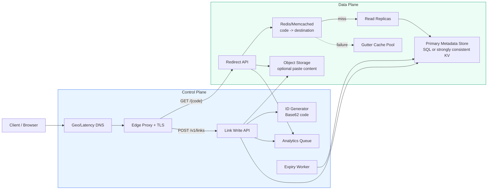
```mermaid
flowchart LR
    Client["Client / Browser"]

    subgraph Control["Control Plane"]
        DNS["Geo/Latency DNS"]
        Edge["Edge Proxy + TLS"]
        WriteAPI["Link Write API"]
        IDGen["ID Generator<br/>Base62 code"]
        AnalyticsQ["Analytics Queue"]
        ExpiryWorker["Expiry Worker"]
    end

    subgraph Data["Data Plane"]
        RedirectAPI["Redirect API"]
        Cache["Redis/Memcached<br/>code -> destination"]
        DB["Primary Metadata Store<br/>SQL or strongly consistent KV"]
        Replicas["Read Replicas"]
        ObjectStore["Object Storage<br/>optional paste content"]
        Gutter["Gutter Cache Pool"]
    end

    Client --> DNS --> Edge
    Edge -->|"POST /v1/links"| WriteAPI
    WriteAPI --> IDGen
    WriteAPI --> DB
    WriteAPI --> ObjectStore
    WriteAPI --> AnalyticsQ
    ExpiryWorker --> DB

    Edge -->|"GET /{code}"| RedirectAPI
    RedirectAPI --> Cache
    Cache -->|"miss"| Replicas
    Replicas --> DB
    RedirectAPI --> ObjectStore
    RedirectAPI --> AnalyticsQ
    Cache -. failure .-> Gutter

    style Control fill:#e8f4ff,stroke:#2563eb
    style Data fill:#ecfdf5,stroke:#059669
```

**Critical path: redirect flow**

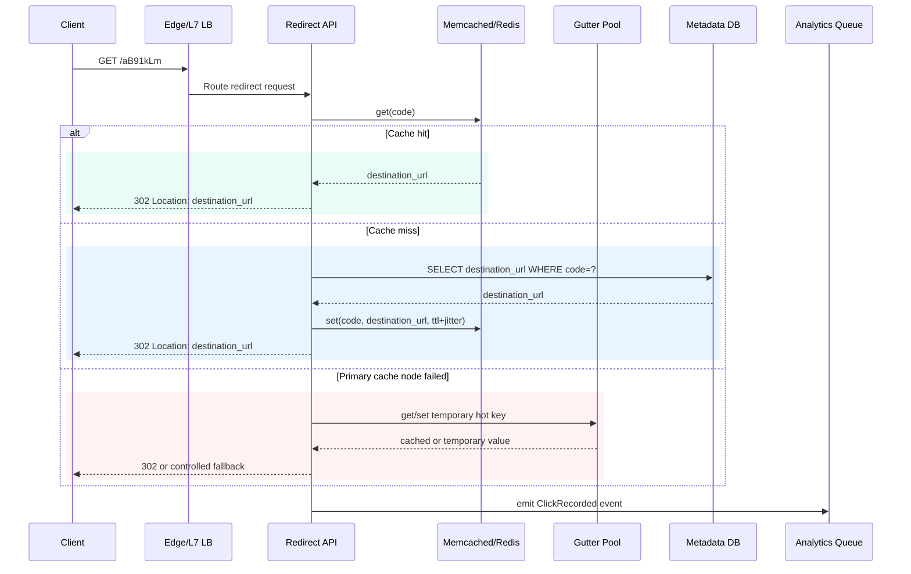
```mermaid
sequenceDiagram
    participant C as Client
    participant E as Edge/L7 LB
    participant R as Redirect API
    participant M as Memcached/Redis
    participant G as Gutter Pool
    participant D as Metadata DB
    participant Q as Analytics Queue

    C->>E: GET /aB91kLm
    E->>R: Route redirect request
    R->>M: get(code)
    alt Cache hit
        rect rgb(232, 253, 245)
        M-->>R: destination_url
        R-->>C: 302 Location: destination_url
        end
    else Cache miss
        rect rgb(232, 244, 255)
        R->>D: SELECT destination_url WHERE code=?
        D-->>R: destination_url
        R->>M: set(code, destination_url, ttl+jitter)
        R-->>C: 302 Location: destination_url
        end
    else Primary cache node failed
        rect rgb(254, 242, 242)
        R->>G: get/set temporary hot key
        G-->>R: cached or temporary value
        R-->>C: 302 or controlled fallback
        end
    end
    R->>Q: emit ClickRecorded event
```

#### 3. Core Component Deep-Dive (Schema definitions, API endpoint definitions, and algorithmic mechanics)

**API endpoints**

| Endpoint | Method | Purpose |
|---|---|---|
| `/v1/links` | `POST` | Create a short link |
| `/v1/links/{code}` | `GET` | Get owner/admin metadata |
| `/{code}` | `GET` | Redirect user |
| `/v1/links/{code}` | `DELETE` | Deactivate link |
| `/v1/links/{code}/analytics` | `GET` | Read aggregated analytics |

**Idempotent create request**

```json
{
  "idempotency_key": "user-123:create-link:01J5X9Q9",
  "destination_url": "https://example.com/a/very/long/path",
  "custom_alias": null,
  "expires_at": "2027-01-01T00:00:00Z"
}
```

The server stores the `idempotency_key` with the response. If the client retries after a timeout, the API returns the same short code rather than creating duplicates.

**Schema**

```sql
CREATE TABLE short_links (
    code VARCHAR(16) PRIMARY KEY,
    destination_url TEXT NOT NULL,
    content_object_path TEXT NULL,
    owner_user_id BIGINT NULL,
    idempotency_key VARCHAR(128) NULL UNIQUE,
    created_at TIMESTAMP NOT NULL,
    expires_at TIMESTAMP NULL,
    is_active BOOLEAN NOT NULL DEFAULT TRUE
);

-- Speeds up owner dashboards ordered by newest links.
CREATE INDEX idx_short_links_owner_created
ON short_links (owner_user_id, created_at DESC);

-- Allows expiration workers to scan only links that are due for cleanup.
CREATE INDEX idx_short_links_expires_at
ON short_links (expires_at);

-- Supports retry-safe creation for clients that repeat POST /v1/links.
CREATE UNIQUE INDEX idx_short_links_idempotency
ON short_links (idempotency_key);
```

**Short-code generation**

| Strategy | Why Use It | Risk |
|---|---|---|
| ID generator -> Base62 | No collisions and compact codes | Predictable unless salted or shuffled |
| Random Base62 | Hard to enumerate | Must retry on collision |
| Hash URL + salt | Deterministic option | Collision and duplicate semantics need care |

Recommended design: allocate IDs from a dedicated ID service, encode with Base62, and reserve custom aliases through a unique constraint.

#### 4. Scaling & Bottleneck Resolutions (Applying lessons from GFS, Dynamo, and Memcached)

**What if...? Viral link + cache node failure**

> ⚠️ **Failure mode**  
> A viral code is served mostly from one cache node. That node fails. Clients rehash to the remaining cache fleet or fall through to the database. The database sees a sudden hot-key storm and redirect latency spikes.

**Walkthrough**

1. Viral code `xYz1234` reaches hundreds of thousands of QPS.
2. Its cache owner node fails.
3. Redirect API starts missing.
4. Without protection, every miss queries the metadata DB.
5. DB connection pool saturates.
6. Redirects fail globally even though the mapping is small and stable.

**Mitigation**

| Step | Action |
|---|---|
| 1 | Route failed-node keys to a small **gutter pool** instead of rehashing broadly |
| 2 | Use request coalescing or Facebook-style leases so one request refills the key |
| 3 | Serve stale cached redirects briefly when safe |
| 4 | Add negative caching for nonexistent codes |
| 5 | Replicate viral keys across multiple cache nodes |

**What if...? Alias enumeration + negative cache gap**

> ⚠️ **Failure mode**  
> An attacker scans random short codes. Nonexistent codes miss cache and repeatedly hit the metadata store because only valid redirects are cached.

**Walkthrough**

1. Botnet generates millions of random `GET /{code}` requests.
2. Most codes do not exist.
3. Redirect API checks cache and misses.
4. Metadata DB receives a high-volume stream of negative lookups.
5. Legitimate redirects compete for DB connections.
6. The attack becomes cheaper than defending each lookup.

**Mitigation**

| Step | Action |
|---|---|
| 1 | Cache `404 code_not_found` responses with a short TTL and jitter |
| 2 | Rate-limit by IP, ASN, user agent, and suspicious code patterns |
| 3 | Use Bloom filters for quick "definitely not present" checks |
| 4 | Keep custom alias namespaces harder to enumerate |
| 5 | Separate abuse traffic from redirect-critical capacity |

**Decision log**

| Decision | Choice | Rationale | Rejected alternative |
|---|---|---|---|
| Metadata store | SQL or strongly consistent KV | Code uniqueness and idempotent creation need strong constraints | Eventually consistent writes that can create duplicate aliases |
| Redirect cache | Redis/Memcached | Redirect path is read-heavy and latency-sensitive | Direct DB lookup on every redirect |
| Analytics | Async queue | Click tracking must not slow redirect | Synchronous analytics writes on redirect path |
| Blob content | Object storage | Keeps large data out of metadata DB | Storing paste bodies inline with metadata |
| Hot-key mitigation | Leases + gutter pool | Prevents cache failure from becoming DB failure | Rehashing failed cache keys across the normal pool |

---

### Web Crawler

#### 1. Requirements & Bounding (Include clear calculation tables for Storage, QPS, and Bandwidth numbers)

**Functional requirements**

- Crawl discovered URLs.
- Respect robots.txt and per-host politeness.
- Deduplicate pages and avoid graph cycles.
- Extract links, titles, snippets, and content signatures.
- Build reverse index from terms to documents.
- Serve search queries with ranked results.

**Non-functional requirements**

- Horizontal crawl scalability.
- Low-latency search serving.
- Tunable freshness by domain importance.
- Strict protection against over-crawling external sites.

**Assumptions**

| Input | Value |
|---|---:|
| URLs tracked | 1 billion |
| Recrawl frequency | Weekly |
| Crawls / month | ~4 billion |
| Average page | 500 KB |
| Crawl throughput | 1,600 pages/sec |
| Search traffic | 40,000 QPS |
| Raw retention | 3 years |

**Storage**

| Item | Calculation | Result |
|---|---:|---:|
| Monthly raw crawl | 4B x 500 KB | 2 PB/month |
| 3-year raw crawl | 2 PB x 36 | 72 PB |
| Replication factor 3 | 72 PB x 3 | 216 PB |
| Index storage estimate | 10-30% raw | 7.2-21.6 PB |

**QPS**

| Traffic | Estimate |
|---|---:|
| Crawl fetches | 1,600/sec |
| Link extraction writes | Tens of thousands/sec |
| Document index writes | 1,600 docs/sec plus term postings |
| Search reads | 40,000 QPS |
| Peak query multiplier | 5-10x during events |

**Bandwidth**

| Path | Calculation | Result |
|---|---:|---:|
| Crawl ingress | 1,600 x 500 KB/sec | 800 MB/sec |
| Daily crawl ingress | 800 MB/sec x 86,400 | ~69 TB/day |
| Search egress | 40,000 x 20 KB | ~800 MB/sec |

> 📐 **Math check**  
> If the average page is compressed to 100 KB before long-term storage, 3-year raw storage drops from 72 PB to ~14.4 PB before replication. Compression and tiering are not optimizations here; they are architectural requirements.

> 🧠 **Staff-engineer note**  
> The hardest trade-off is freshness versus politeness. A crawler that maximizes throughput without host budgets becomes an attack on the web; a crawler that is too conservative produces a stale index.

#### 2. High-Level Architecture (A clear textual map of component placement)

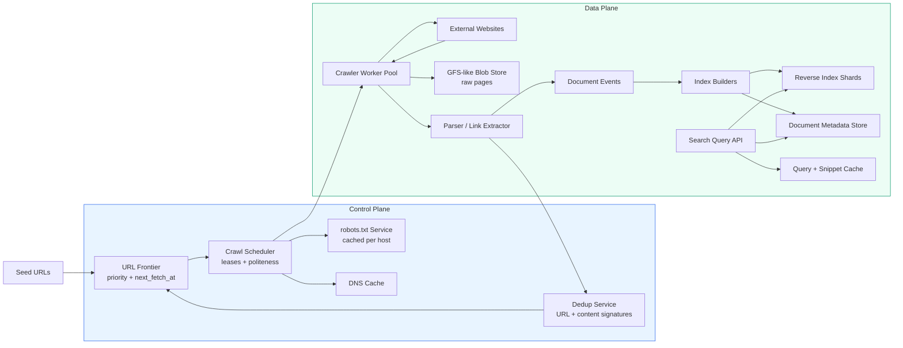
```mermaid
flowchart LR
    Seeds["Seed URLs"]

    subgraph Control["Control Plane"]
        Frontier["URL Frontier<br/>priority + next_fetch_at"]
        Scheduler["Crawl Scheduler<br/>leases + politeness"]
        Robots["robots.txt Service<br/>cached per host"]
        DNSCache["DNS Cache"]
        Dedup["Dedup Service<br/>URL + content signatures"]
    end

    subgraph Data["Data Plane"]
        Fetchers["Crawler Worker Pool"]
        Web["External Websites"]
        Blob["GFS-like Blob Store<br/>raw pages"]
        Parser["Parser / Link Extractor"]
        Kafka["Document Events"]
        Indexer["Index Builders"]
        ReverseIndex["Reverse Index Shards"]
        DocStore["Document Metadata Store"]
        QueryAPI["Search Query API"]
        QueryCache["Query + Snippet Cache"]
    end

    Seeds --> Frontier
    Frontier --> Scheduler
    Scheduler --> Robots
    Scheduler --> DNSCache
    Scheduler --> Fetchers
    Fetchers --> Web
    Web --> Fetchers
    Fetchers --> Blob
    Fetchers --> Parser
    Parser --> Dedup
    Dedup --> Frontier
    Parser --> Kafka
    Kafka --> Indexer
    Indexer --> ReverseIndex
    Indexer --> DocStore
    QueryAPI --> QueryCache
    QueryAPI --> ReverseIndex
    QueryAPI --> DocStore

    style Control fill:#e8f4ff,stroke:#2563eb
    style Data fill:#ecfdf5,stroke:#059669
```

**Critical path: crawl scheduling**

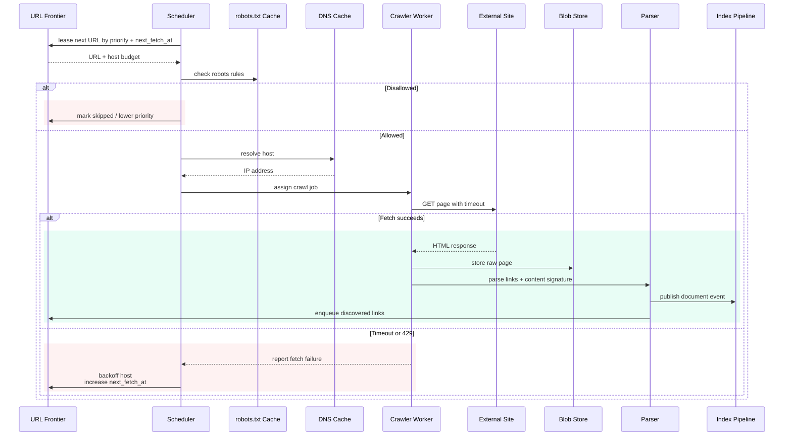
```mermaid
sequenceDiagram
    participant F as URL Frontier
    participant S as Scheduler
    participant R as robots.txt Cache
    participant D as DNS Cache
    participant W as Crawler Worker
    participant Site as External Site
    participant B as Blob Store
    participant P as Parser
    participant I as Index Pipeline

    S->>F: lease next URL by priority + next_fetch_at
    F-->>S: URL + host budget
    S->>R: check robots rules
    alt Disallowed
        rect rgb(254, 242, 242)
        S->>F: mark skipped / lower priority
        end
    else Allowed
        S->>D: resolve host
        D-->>S: IP address
        S->>W: assign crawl job
        W->>Site: GET page with timeout
        alt Fetch succeeds
            rect rgb(232, 253, 245)
            Site-->>W: HTML response
            W->>B: store raw page
            W->>P: parse links + content signature
            P->>I: publish document event
            P->>F: enqueue discovered links
            end
        else Timeout or 429
            rect rgb(254, 242, 242)
            W-->>S: report fetch failure
            S->>F: backoff host<br/>increase next_fetch_at
            end
        end
    end
```

#### 3. Core Component Deep-Dive (Schema definitions, API endpoint definitions, and algorithmic mechanics)

**APIs**

| Endpoint | Method | Purpose |
|---|---|---|
| `/v1/seeds` | `POST` | Add seed URLs |
| `/v1/crawl-status/{url_hash}` | `GET` | Inspect crawl status |
| `/v1/search?q=...` | `GET` | Query indexed documents |
| `/v1/documents/{doc_id}` | `GET` | Fetch document metadata |

**URL frontier schema**

```sql
CREATE TABLE url_frontier (
    url_hash CHAR(64) PRIMARY KEY,
    canonical_url TEXT NOT NULL,
    host VARCHAR(255) NOT NULL,
    priority_score DOUBLE PRECISION NOT NULL,
    next_fetch_at TIMESTAMP NOT NULL,
    last_fetch_at TIMESTAMP NULL,
    crawl_depth INT NOT NULL,
    status VARCHAR(32) NOT NULL
);

-- Pulls due URLs in priority order for scheduler workers.
CREATE INDEX idx_frontier_next_fetch
ON url_frontier (next_fetch_at, priority_score DESC);

-- Enforces per-host crawl budgets and politeness windows.
CREATE INDEX idx_frontier_host
ON url_frontier (host, next_fetch_at);
```

**Document metadata schema**

```sql
CREATE TABLE documents (
    doc_id BIGINT PRIMARY KEY,
    url_hash CHAR(64) NOT NULL,
    canonical_url TEXT NOT NULL,
    content_hash CHAR(64) NOT NULL,
    title TEXT NULL,
    snippet TEXT NULL,
    language VARCHAR(16) NULL,
    fetched_at TIMESTAMP NOT NULL,
    raw_object_path TEXT NOT NULL
);

-- Finds exact duplicate content across different URLs.
CREATE INDEX idx_documents_content_hash
ON documents (content_hash);

-- Supports freshness scans and recrawl analytics.
CREATE INDEX idx_documents_fetched_at
ON documents (fetched_at);
```

**Concrete posting list example**

```json
{
  "term": "consistent",
  "df": 3,
  "postings": [
    { "doc_id": 101, "tf": 4, "positions": [12, 84, 130, 220], "fields": ["title", "body"], "score_hint": 0.93 },
    { "doc_id": 220, "tf": 2, "positions": [44, 91], "fields": ["body"], "score_hint": 0.71 },
    { "doc_id": 918, "tf": 1, "positions": [17], "fields": ["snippet"], "score_hint": 0.52 }
  ]
}
```

Compact production systems often delta-encode sorted `doc_id`s and positions, then compress postings blocks.

#### 4. Scaling & Bottleneck Resolutions (Applying lessons from GFS, Dynamo, and Memcached)

**What if...? robots.txt misconfiguration + politeness failure**

> ⚠️ **Failure mode**  
> A robots cache bug treats missing robots rules as "allow all" and the scheduler ignores per-host budgets. Thousands of workers crawl one domain aggressively, creating external harm and getting the crawler blocked.

**Walkthrough**

1. robots.txt fetch fails due to timeout.
2. Bug marks host as fully crawlable.
3. Frontier has many high-priority URLs for that host.
4. Scheduler assigns too many workers to the same domain.
5. External site rate limits or blocks the crawler.
6. Crawl freshness drops and legal/abuse risk rises.

**Mitigation**

| Step | Action |
|---|---|
| 1 | Fail closed or conservative when robots state is unknown |
| 2 | Enforce host-level token bucket regardless of URL priority |
| 3 | Add global per-domain concurrency caps |
| 4 | Track HTTP 429/403 spikes and automatically cool down host |
| 5 | Audit scheduler leases and robots decisions |

**What if...? Duplicate URL explosion + index pressure**

> ⚠️ **Failure mode**  
> The crawler discovers endless URL variants such as tracking parameters, calendar pages, sort orders, and session IDs. The frontier grows faster than dedup can collapse it, and index writes are wasted on near-duplicates.

**Walkthrough**

1. Parser extracts millions of parameterized links from a few large sites.
2. Canonicalization rules fail to normalize the variants.
3. Frontier stores many URLs that render equivalent content.
4. Fetchers waste bandwidth recrawling duplicate pages.
5. Index shards receive redundant documents and posting lists grow.
6. Search quality drops because duplicate pages crowd results.

**Mitigation**

| Step | Action |
|---|---|
| 1 | Canonicalize URLs before frontier insertion |
| 2 | Strip known tracking parameters and normalize trailing slashes/case where safe |
| 3 | Use content hashes and near-duplicate fingerprints after fetch |
| 4 | Apply per-host frontier growth limits |
| 5 | Feed duplicate signals back into crawl priority scoring |

**Decision log**

| Decision | Choice | Rationale | Rejected alternative |
|---|---|---|---|
| Raw page storage | GFS-like blob/chunk store | Petabyte-scale data plane requires distributed storage | Storing raw pages in one relational database |
| Frontier | Priority queue / sorted-set model | Crawl order depends on freshness and importance | FIFO crawl queue with no recrawl priority |
| Reverse index | Specialized index shards | Term lookups need posting-list efficiency | Scanning document blobs at query time |
| Dedup | Hashes + near-duplicate signatures | Prevents graph loops and duplicate storage | URL-only dedupe, which misses mirrored content |
| Politeness | Host-level scheduler budget | External systems must be protected | Worker-local throttles with no global host view |

---

### Twitter Timeline

#### 1. Requirements & Bounding (Include clear calculation tables for Storage, QPS, and Bandwidth numbers)

**Functional requirements**

- Users post tweets.
- Users follow other users.
- Home timeline shows followed accounts.
- User timeline shows one author's tweets.
- Support likes, replies, reposts, media, and search.
- Handle celebrities with millions of followers.

**Non-functional requirements**

- Low-latency home timeline reads.
- Durable tweet creation.
- Eventually consistent timelines and counters are acceptable.
- Celebrity fan-out must not overload the system.

**Assumptions**

| Input | Value |
|---|---:|
| Active users | 100 million |
| Tweets/day | 500 million |
| Tweets/month | 15 billion |
| Tweet payload + metadata | 10 KB |
| Average fanout deliveries/tweet | 10 |
| Home timeline reads | 100,000 QPS |
| Tweet writes | 6,000 QPS |
| Search | 4,000 QPS |

**Storage**

| Item | Calculation | Result |
|---|---:|---:|
| Tweet object storage/month | 15B x 10 KB | 150 TB |
| Tweet object storage/3 years | 150 TB x 36 | 5.4 PB |
| Fanout refs/month | 150B x 16 B | 2.4 TB |
| Fanout refs/3 years | 2.4 TB x 36 | 86.4 TB |
| Tweet storage RF=3 | 5.4 PB x 3 | 16.2 PB |

**QPS and bandwidth**

| Traffic | Estimate |
|---|---:|
| Tweet writes | ~6,000 QPS |
| Home timeline reads | ~100,000 QPS |
| Fanout deliveries | ~60,000/sec average |
| Search | ~4,000 QPS |
| Timeline read egress | 100,000 x 50 KB = ~5 GB/s |

> 📐 **Math check**  
> If average fanout rises from 10 to 200, fanout deliveries jump from 60,000/sec to ~1.2 million/sec. The hybrid celebrity strategy becomes mandatory, not optional.

> 🧠 **Staff-engineer note**  
> The subtle trade-off is read latency versus write amplification. Pushing tweets makes home reads cheap, but the moment a celebrity posts, the write path can become the largest workload in the system.

#### 2. High-Level Architecture (A clear textual map of component placement)

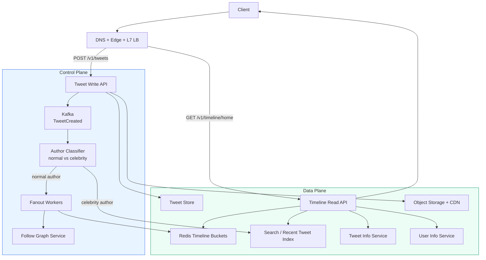
```mermaid
flowchart TB
    Client["Client"]
    Edge["DNS + Edge + L7 LB"]

    subgraph Control["Control Plane"]
        WriteAPI["Tweet Write API"]
        Graph["Follow Graph Service"]
        Classifier["Author Classifier<br/>normal vs celebrity"]
        Kafka["Kafka<br/>TweetCreated"]
        Fanout["Fanout Workers"]
    end

    subgraph Data["Data Plane"]
        TweetStore["Tweet Store"]
        Redis["Redis Timeline Buckets"]
        Search["Search / Recent Tweet Index"]
        TweetInfo["Tweet Info Service"]
        UserInfo["User Info Service"]
        ReadAPI["Timeline Read API"]
        Media["Object Storage + CDN"]
    end

    Client --> Edge
    Edge -->|"POST /v1/tweets"| WriteAPI
    WriteAPI --> TweetStore
    WriteAPI --> Media
    WriteAPI --> Kafka
    Kafka --> Classifier
    Classifier -->|"normal author"| Fanout
    Fanout --> Graph
    Fanout --> Redis
    Classifier -->|"celebrity author"| Search

    Edge -->|"GET /v1/timeline/home"| ReadAPI
    ReadAPI --> Redis
    ReadAPI --> Search
    ReadAPI --> TweetInfo
    ReadAPI --> UserInfo
    ReadAPI --> Client

    style Control fill:#e8f4ff,stroke:#2563eb
    style Data fill:#ecfdf5,stroke:#059669
```

**Critical path: home timeline fan-out**

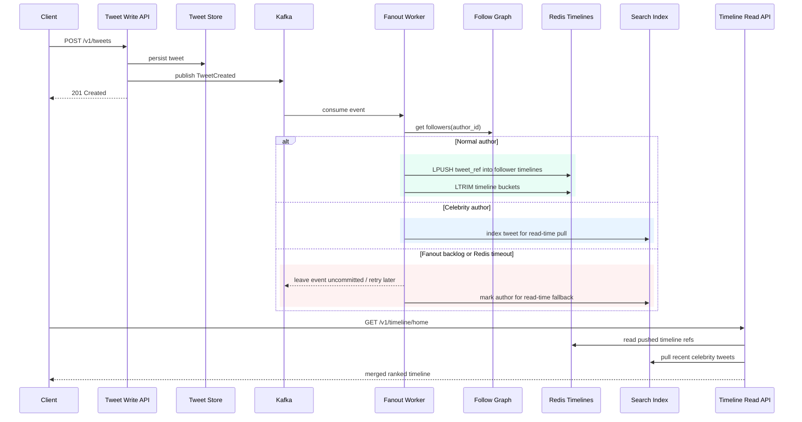
```mermaid
sequenceDiagram
    participant C as Client
    participant W as Tweet Write API
    participant T as Tweet Store
    participant K as Kafka
    participant F as Fanout Worker
    participant G as Follow Graph
    participant R as Redis Timelines
    participant S as Search Index
    participant H as Timeline Read API

    C->>W: POST /v1/tweets
    W->>T: persist tweet
    W->>K: publish TweetCreated
    W-->>C: 201 Created
    K->>F: consume event
    F->>G: get followers(author_id)
    alt Normal author
        rect rgb(232, 253, 245)
        F->>R: LPUSH tweet_ref into follower timelines
        F->>R: LTRIM timeline buckets
        end
    else Celebrity author
        rect rgb(232, 244, 255)
        F->>S: index tweet for read-time pull
        end
    else Fanout backlog or Redis timeout
        rect rgb(254, 242, 242)
        F-->>K: leave event uncommitted / retry later
        F->>S: mark author for read-time fallback
        end
    end
    C->>H: GET /v1/timeline/home
    H->>R: read pushed timeline refs
    H->>S: pull recent celebrity tweets
    H-->>C: merged ranked timeline
```

#### 3. Core Component Deep-Dive (Schema definitions, API endpoint definitions, and algorithmic mechanics)

**APIs**

| Endpoint | Method | Purpose |
|---|---|---|
| `/v1/tweets` | `POST` | Create tweet |
| `/v1/users/{user_id}/tweets` | `GET` | User timeline |
| `/v1/timeline/home` | `GET` | Home timeline |
| `/v1/users/{user_id}/follow` | `POST` | Follow user |
| `/v1/users/{user_id}/follow` | `DELETE` | Unfollow user |
| `/v1/search/tweets?q=...` | `GET` | Search tweets |

**Schema**

```sql
CREATE TABLE tweets (
    tweet_id BIGINT PRIMARY KEY,
    author_id BIGINT NOT NULL,
    body TEXT NOT NULL,
    media_object_paths JSONB NULL,
    created_at TIMESTAMP NOT NULL,
    visibility VARCHAR(32) NOT NULL,
    reply_to_tweet_id BIGINT NULL
);

-- Supports user timeline reads in reverse chronological order.
CREATE INDEX idx_tweets_author_created
ON tweets (author_id, created_at DESC);

CREATE TABLE follows (
    follower_id BIGINT NOT NULL,
    followee_id BIGINT NOT NULL,
    created_at TIMESTAMP NOT NULL,
    PRIMARY KEY (follower_id, followee_id)
);

-- Supports fanout lookup: who follows this author?
CREATE INDEX idx_follows_followee
ON follows (followee_id);
```

**Redis bucket**

```text
home_timeline:{user_id} -> [
  { tweet_id, author_id, created_at },
  ...
]
```

Store compact refs, not full tweet bodies.

**Push vs pull fan-out**

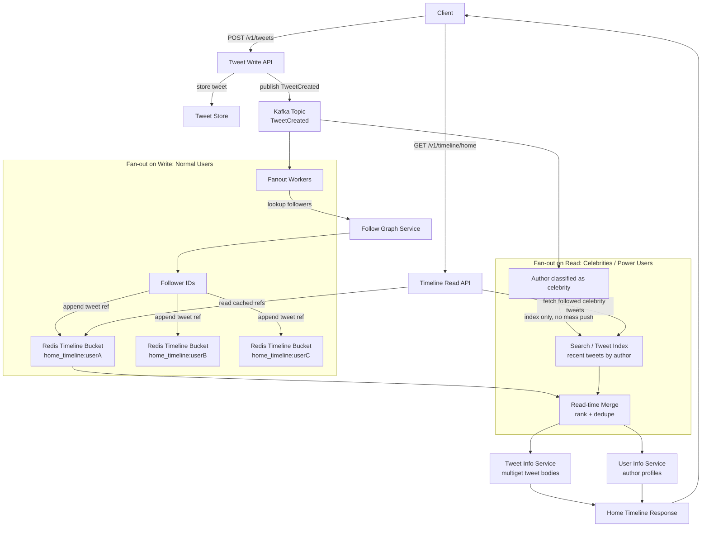
```mermaid
flowchart TB
    Client["Client"]
    WriteAPI["Tweet Write API"]
    TweetStore["Tweet Store"]
    Kafka["Kafka Topic<br/>TweetCreated"]
    Graph["Follow Graph Service"]

    subgraph Push["Fan-out on Write: Normal Users"]
        Fanout["Fanout Workers"]
        Followers["Follower IDs"]
        RedisA["Redis Timeline Bucket<br/>home_timeline:userA"]
        RedisB["Redis Timeline Bucket<br/>home_timeline:userB"]
        RedisC["Redis Timeline Bucket<br/>home_timeline:userC"]
    end

    subgraph Pull["Fan-out on Read: Celebrities / Power Users"]
        CelebrityFlag["Author classified as celebrity"]
        SearchIndex["Search / Tweet Index<br/>recent tweets by author"]
        PullMerge["Read-time Merge<br/>rank + dedupe"]
    end

    ReadAPI["Timeline Read API"]
    TweetInfo["Tweet Info Service<br/>multiget tweet bodies"]
    UserInfo["User Info Service<br/>author profiles"]
    Response["Home Timeline Response"]

    Client -->|"POST /v1/tweets"| WriteAPI
    WriteAPI -->|"store tweet"| TweetStore
    WriteAPI -->|"publish TweetCreated"| Kafka

    Kafka --> Fanout
    Fanout -->|"lookup followers"| Graph
    Graph --> Followers
    Followers -->|"append tweet ref"| RedisA
    Followers -->|"append tweet ref"| RedisB
    Followers -->|"append tweet ref"| RedisC

    Kafka --> CelebrityFlag
    CelebrityFlag -->|"index only, no mass push"| SearchIndex

    Client -->|"GET /v1/timeline/home"| ReadAPI
    ReadAPI -->|"read cached refs"| RedisA
    ReadAPI -->|"fetch followed celebrity tweets"| SearchIndex
    RedisA --> PullMerge
    SearchIndex --> PullMerge
    PullMerge --> TweetInfo
    PullMerge --> UserInfo
    TweetInfo --> Response
    UserInfo --> Response
    Response --> Client
```

#### 4. Scaling & Bottleneck Resolutions (Applying lessons from GFS, Dynamo, and Memcached)

**What if...? Celebrity tweet + read-time merge breakdown**

> ⚠️ **Failure mode**  
> A celebrity tweet is not pushed to follower timelines. It must be pulled and merged at read time. If the search/recent-tweet index lags or fails, users miss celebrity tweets while their cached normal timeline still loads.

**Walkthrough**

1. Celebrity posts tweet.
2. Tweet is persisted and indexed for pull model.
3. Search index falls behind.
4. Timeline Read API reads Redis timeline refs successfully.
5. Celebrity pull query times out.
6. Users see a stale timeline missing celebrity content.

**Mitigation**

| Step | Action |
|---|---|
| 1 | Keep a small dedicated recent-tweets cache for celebrity authors |
| 2 | Use timeout-bounded merge and return partial results |
| 3 | Mark response as degraded for observability |
| 4 | Fall back to Tweet Store query for followed celebrity IDs when safe |
| 5 | Backpressure celebrity indexing independently from normal fanout |

> 🧠 **Staff-engineer note**  
> The hybrid timeline model creates two correctness paths: pushed normal tweets and pulled celebrity tweets. The merge layer must be observable as its own dependency, not hidden inside the read API.

**What if...? Fan-out backlog after a regional event**

> ⚠️ **Failure mode**  
> A sports final ends and millions of normal users tweet at once. Kafka absorbs the write spike, but fanout workers lag. Home timelines look stale even though tweet creation is healthy.

**Walkthrough**

1. Tweet Write API persists tweets and publishes events successfully.
2. Kafka topic lag grows faster than fanout workers can drain it.
3. Redis timeline buckets are updated minutes late.
4. Users refresh home timelines and do not see fresh posts.
5. Read traffic rises because users keep refreshing.
6. Fanout and read systems now amplify each other.

**Mitigation**

| Step | Action |
|---|---|
| 1 | Partition fanout by author ID and overprovision worker pools for known events |
| 2 | Show a "new posts available" marker based on durable tweet writes |
| 3 | Temporarily pull recent tweets for followed users whose fanout is lagging |
| 4 | Apply per-author write backpressure for abusive burst sources |
| 5 | Track fanout lag separately from tweet write success |

**Decision log**

| Decision | Choice | Rationale | Rejected alternative |
|---|---|---|---|
| Timeline refs | Redis lists | O(1) recent timeline reads | Recomputing full home timeline from graph on every request |
| Fanout model | Hybrid push/pull | Normal users optimize reads; celebrities avoid write explosion | Pure fanout-on-write for all accounts |
| Event transport | Kafka | Fanout needs partitioning, replay, and backpressure | Direct synchronous writes to every follower timeline |
| Media | Object storage + CDN | Large media should not pass through tweet DB | Storing media blobs in tweet rows |
| Cache failure | Gutter pool + leases | Prevents cache outage from crushing stores | Letting all timeline cache misses hit primary stores |

---

### Live Comments System

#### 1. Requirements & Bounding (Include clear calculation tables for Storage, QPS, and Bandwidth numbers)

**Functional requirements**

- Users join a live stream comment room.
- Users post comments.
- Viewers receive comments in near real time.
- Moderators can delete or suppress comments.
- Late joiners receive recent history.
- System supports high-traffic live events.

**Non-functional requirements**

- Low-latency fanout over WebSockets.
- Per-room ordering is preferred.
- Duplicate message delivery must not duplicate display.
- Moderation actions must propagate quickly.
- System must isolate hot live rooms.

**Assumptions**

| Input | Value |
|---|---:|
| Concurrent viewers for large event | 1 million |
| Active commenters | 1% of viewers |
| Comment rate/commenter | 1 comment / 30 sec |
| Average message payload | 300 B |
| Recent replay window | 5 minutes |

**QPS**

| Traffic | Calculation | Result |
|---|---:|---:|
| Active commenters | 1,000,000 x 1% | 10,000 |
| Comment writes | 10,000 / 30 sec | ~333 QPS |
| Fanout deliveries | 333 x 1,000,000 | impossible as direct per-message fanout |
| WebSocket connections | 1,000,000 viewers | 1M long-lived sockets |

**Storage and bandwidth**

| Item | Calculation | Result |
|---|---:|---:|
| Raw comments/hour | 333/sec x 3,600 x 300 B | ~360 MB/hour |
| 24h raw comments | 360 MB x 24 | ~8.6 GB/day for one huge room |
| Direct fanout bandwidth | 333/sec x 1M x 300 B | ~100 GB/sec |

**1M viewer event bounding table**

| Dimension | Assumption | Calculation | Design Implication |
|---|---:|---:|---|
| WebSocket gateways | 50,000 stable sockets/gateway | 1,000,000 / 50,000 | ~20 gateways minimum; deploy 30-40 for headroom |
| Comment writes | 1% commenters, 1 per 30 sec | 10,000 / 30 | ~333 writes/sec before moderation |
| Moderation QPS | Every comment scored | ~333/sec | Inline lightweight checks; heavy ML async or sampled |
| Durable writes | Store all accepted comments | ~333/sec | Easy for append log; fanout is the hard part |
| Recent buffer memory | 5 min x 333/sec x 300 B | ~30 MB raw per hot room | Keep replicated in memory by room shard |
| Batched delivery | 4 batches/sec per room | 1M x 4 frames/sec | Gateways send fewer, larger frames |
| Direct message fanout | 333 x 1M x 300 B | ~100 GB/sec | Not acceptable without filtering/batching |
| Sampled fanout | 20 comments/sec x 1M x 300 B | ~6 GB/sec | Still large, but feasible with regional fanout and compression |
| Regional split | 5 regions | 1M / 5 | ~200k sockets/region and local room fanout |
| Replay bandwidth spike | 100k reconnects x 100 comments x 300 B | ~3 GB burst | Throttle replay and compress batches |

> 📐 **Math check**  
> Directly sending every comment to every viewer does not scale. Large rooms need sampling, batching, ranking, regional fanout trees, or client-side throttling.

> 🧠 **Staff-engineer note**  
> The subtle trade-off is fidelity versus survivability. Small rooms can receive every message; massive rooms need controlled loss, ranking, batching, or slow-mode so the live experience remains coherent.

#### 2. High-Level Architecture (A clear textual map of component placement)

**Component placement diagram**

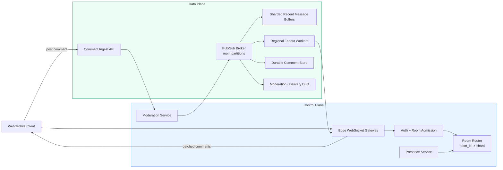
```mermaid
flowchart LR
    Client["Web/Mobile Client"]

    subgraph Control["Control Plane"]
        Edge["Edge WebSocket Gateway"]
        Auth["Auth + Room Admission"]
        Router["Room Router<br/>room_id -> shard"]
        Moderation["Moderation Service"]
        Presence["Presence Service"]
    end

    subgraph Data["Data Plane"]
        Ingest["Comment Ingest API"]
        Broker["Pub/Sub Broker<br/>room partitions"]
        Buffers["Sharded Recent Message Buffers"]
        Fanout["Regional Fanout Workers"]
        Store["Durable Comment Store"]
        DLQ["Moderation / Delivery DLQ"]
    end

    Client --> Edge
    Edge --> Auth
    Auth --> Router
    Client -->|"post comment"| Ingest
    Ingest --> Moderation
    Moderation --> Broker
    Broker --> Buffers
    Broker --> Fanout
    Fanout --> Edge
    Edge -->|"batched comments"| Client
    Broker --> Store
    Broker --> DLQ
    Presence --> Router

    style Control fill:#e8f4ff,stroke:#2563eb
    style Data fill:#ecfdf5,stroke:#059669
```

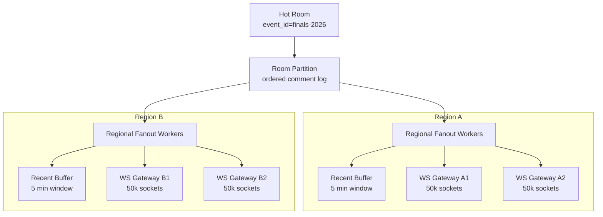
```mermaid
flowchart TB
    Room["Hot Room<br/>event_id=finals-2026"]
    Broker["Room Partition<br/>ordered comment log"]

    subgraph RegionA["Region A"]
        FanoutA["Regional Fanout Workers"]
        BufferA["Recent Buffer<br/>5 min window"]
        GatewayA1["WS Gateway A1<br/>50k sockets"]
        GatewayA2["WS Gateway A2<br/>50k sockets"]
    end

    subgraph RegionB["Region B"]
        FanoutB["Regional Fanout Workers"]
        BufferB["Recent Buffer<br/>5 min window"]
        GatewayB1["WS Gateway B1<br/>50k sockets"]
        GatewayB2["WS Gateway B2<br/>50k sockets"]
    end

    Room --> Broker
    Broker --> FanoutA
    Broker --> FanoutB
    FanoutA --> BufferA
    FanoutB --> BufferB
    FanoutA --> GatewayA1
    FanoutA --> GatewayA2
    FanoutB --> GatewayB1
    FanoutB --> GatewayB2
```

**Critical path: comment delivery**

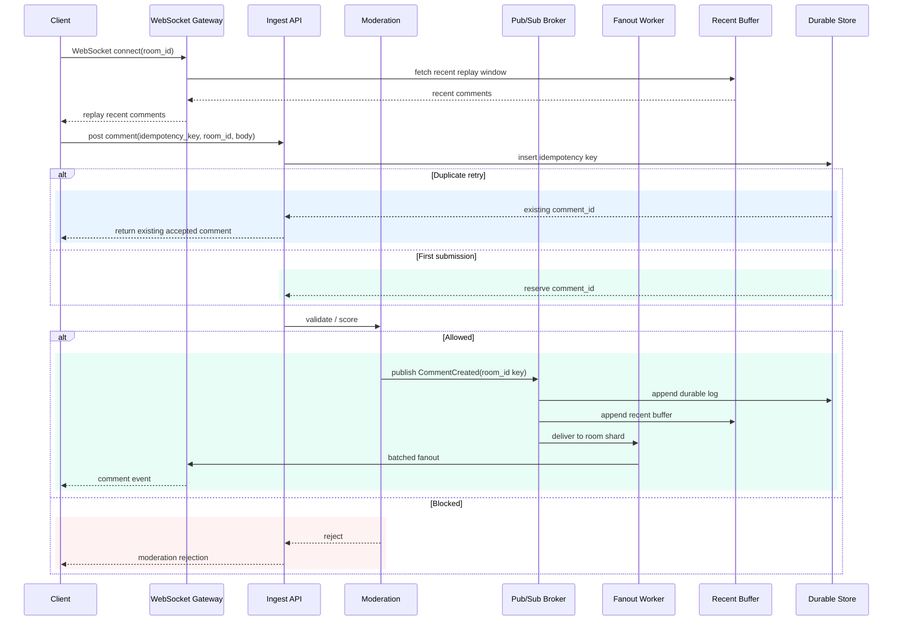
```mermaid
sequenceDiagram
    participant C as Client
    participant E as WebSocket Gateway
    participant I as Ingest API
    participant M as Moderation
    participant B as Pub/Sub Broker
    participant F as Fanout Worker
    participant R as Recent Buffer
    participant S as Durable Store

    C->>E: WebSocket connect(room_id)
    E->>R: fetch recent replay window
    R-->>E: recent comments
    E-->>C: replay recent comments
    C->>I: post comment(idempotency_key, room_id, body)
    I->>S: insert idempotency key
    alt Duplicate retry
        rect rgb(232, 244, 255)
        S-->>I: existing comment_id
        I-->>C: return existing accepted comment
        end
    else First submission
        rect rgb(232, 253, 245)
        S-->>I: reserve comment_id
        end
    end
    I->>M: validate / score
    alt Allowed
        rect rgb(232, 253, 245)
        M->>B: publish CommentCreated(room_id key)
        B->>S: append durable log
        B->>R: append recent buffer
        B->>F: deliver to room shard
        F->>E: batched fanout
        E-->>C: comment event
        end
    else Blocked
        rect rgb(254, 242, 242)
        M-->>I: reject
        I-->>C: moderation rejection
        end
    end
```

#### 3. Core Component Deep-Dive (Schema definitions, API endpoint definitions, and algorithmic mechanics)

**APIs**

| Endpoint | Method | Purpose |
|---|---|---|
| `/v1/live/{room_id}/connect` | WebSocket | Join comment stream |
| `/v1/live/{room_id}/comments` | `POST` | Submit comment |
| `/v1/live/{room_id}/comments/recent` | `GET` | Fetch recent replay |
| `/v1/live/{room_id}/moderation/{comment_id}` | `DELETE` | Remove comment |

**Comment schema**

```sql
CREATE TABLE live_comments (
    room_id BIGINT NOT NULL,
    comment_id BIGINT NOT NULL,
    author_id BIGINT NOT NULL,
    idempotency_key VARCHAR(128) NOT NULL,
    body TEXT NOT NULL,
    created_at TIMESTAMP NOT NULL,
    moderation_state VARCHAR(32) NOT NULL,
    PRIMARY KEY (room_id, comment_id)
);

-- Prevents duplicate comments when clients retry POST after timeout.
CREATE UNIQUE INDEX idx_live_comments_idempotency
ON live_comments (room_id, author_id, idempotency_key);

-- Supports recent replay when a viewer joins a live room.
CREATE INDEX idx_live_comments_room_created
ON live_comments (room_id, created_at DESC);
```

**Idempotency example**

```json
{
  "room_id": "stream-900",
  "idempotency_key": "user-77:stream-900:msg-00042",
  "body": "This launch is incredible"
}
```

**Algorithmic mechanics**

| Mechanic | Purpose |
|---|---|
| Shard by `room_id` | Keeps per-room ordering manageable |
| Batch fanout | Reduces per-message network overhead |
| Recent buffer | Supports late join replay |
| Regional fanout tree | Avoids one central broadcaster |
| Moderation queue | Separates safety processing from socket delivery |
| Client sequence numbers | Deduplicate repeated delivery |

#### 4. Scaling & Bottleneck Resolutions (Applying lessons from GFS, Dynamo, and Memcached)

**What if...? Hot room overwhelms fanout**

> ⚠️ **Failure mode**  
> A major live event reaches 1 million viewers. Every comment cannot be sent individually to every socket. Fanout workers saturate and WebSocket gateways build memory queues.

**Walkthrough**

1. A live stream becomes globally popular.
2. Comment rate rises to hundreds or thousands of messages per second.
3. Fanout workers attempt to broadcast every message to every connected viewer.
4. WebSocket gateway send buffers grow.
5. Slow clients hold memory and connection resources.
6. Gateways begin dropping connections or timing out heartbeats.
7. Viewers see delayed, duplicated, or missing comments.

**Mitigation**

| Step | Action |
|---|---|
| 1 | Batch comments into 250-500 ms frames |
| 2 | Apply per-room rate limits and slow-mode |
| 3 | Use ranked/top comments for enormous rooms |
| 4 | Shard viewers by region and gateway |
| 5 | Drop non-critical comments before dropping connections |
| 6 | Keep recent replay buffer so clients can resync |

**Additional mitigations for million-viewer rooms**

| Mitigation | Effect |
|---|---|
| Batch comments into frames | Reduces syscall and packet overhead |
| Sample or rank comments | Preserves a readable stream when every comment cannot be shown |
| Regional fanout trees | Keeps delivery local and avoids central broadcaster saturation |
| Per-room slow mode | Reduces write rate at the source |
| Gateway backpressure | Drops comment updates before dropping the WebSocket |
| Recent buffer replay | Lets clients reconnect without expensive DB reads |

**What if...? Moderation service slows down**

> ⚠️ **Failure mode**  
> Moderation latency rises from milliseconds to seconds. Comment ingestion queues grow, users retry submissions, and idempotency becomes the difference between one delayed comment and many duplicates.

**Walkthrough**

1. A moderation model deploy increases p99 latency.
2. Comment Ingest API holds requests longer.
3. Clients timeout and retry with the same idempotency key.
4. Without dedupe, the same comment is accepted multiple times.
5. Fanout sends duplicates and room quality degrades.
6. Moderation backlog hides abusive content longer.

**Mitigation**

| Step | Action |
|---|---|
| 1 | Store idempotency key before moderation work |
| 2 | Use fast rules inline and push expensive scoring to async review |
| 3 | Apply temporary slow-mode or subscriber-only mode |
| 4 | Fail closed for high-risk rooms and fail open only for trusted channels |
| 5 | Expose moderation p99 and backlog as launch-blocking metrics |

**Decision log**

| Decision | Choice | Rationale | Rejected alternative |
|---|---|---|---|
| Client protocol | WebSockets | Bidirectional low-latency updates | Short polling for every viewer |
| Broker | Partitioned pub/sub | Room-based ordering and fanout | One global broadcast topic for all rooms |
| Storage | Append-oriented comment log | Replay, audit, moderation | Only ephemeral gateway memory |
| Dedup | Idempotency key + client sequence | Required under retries | Trusting client retries to be rare |
| Hot-room strategy | Batching + ranking + regional fanout | Direct broadcast is too expensive | Sending every comment individually to every socket |

---

### WhatsApp / Messenger

#### 1. Requirements & Bounding (Include clear calculation tables for Storage, QPS, and Bandwidth numbers)

**Functional requirements**

- Send and receive text messages, images, videos, documents, and voice messages.
- Support one-to-one and group chats.
- End-to-end encrypt messages and media.
- Deliver messages reliably even when recipients are offline.
- Show delivery and read receipts.
- Support voice and video calls.
- Provide presence (online/typing indicators) and status/stories.

**Non-functional requirements**

- Messages must be delivered with low latency (sub-second for online recipients).
- Message ordering must be consistent per conversation.
- E2EE must be transparent to users and protect metadata as much as possible.
- Offline messages must be stored durably until delivered.
- Group chat fan-out must not amplify writes unsustainably.

**Assumptions**

| Input | Value |
|---|---:|
| DAU | 2 billion |
| Messages/user/day | 100 |
| Average message size | 1 KB |
| Media messages | 10% of total, avg 500 KB |
| Group messages | 10% of total, average group size 10 |
| Message retention | 90 days for regular, 7 days for media |
| Presence updates/user/day | 1,000 |

**Storage**

| Item | Calculation | Result |
|---|---:|---:|---:|
| Daily text messages | 2B x 100 x 90% text | 180B messages |
| Daily media messages | 2B x 100 x 10% media | 20B messages |
| Text storage/day | 180B x 1 KB | 180 TB/day |
| Media storage/day | 20B x 500 KB | 10 PB/day |
| Text retention (90d) | 180 TB x 90 | 16.2 PB |
| Media retention (7d) | 10 PB x 7 | 70 PB |
| Replication factor 3 | (16.2 + 70) x 3 | ~259 PB |

**QPS**

| Traffic | Calculation | Average | 20x Peak |
|---|---:|---:|---:|---:|
| Text sends | 180B / 86,400 | ~2.1M QPS | ~42M QPS |
| Media sends | 20B / 86,400 | ~231K QPS | ~4.6M QPS |
| Message deliveries | 2B x 100 / 86,400 | ~2.3M QPS | ~46M QPS |
| Presence updates | 2B x 1,000 / 86,400 | ~23M QPS | ~460M QPS |
| Group fan-out writes | 2B x 100 x 10% x 10 / 86,400 | ~2.3M QPS | ~46M QPS |

**Bandwidth**

| Path | Calculation | Average |
|---|---:|---:|---:|
| Text ingress | 2.1M x 1 KB | ~2 GB/s |
| Media ingress | 231K x 500 KB | ~115 GB/s |
| Text egress (delivery) | 2.3M x 1 KB | ~2.3 GB/s |
| Media egress | 231K x 500 KB x 1.1 (fan-out) | ~127 GB/s |
| Peak media egress | 4.6M x 500 KB | ~2.3 TB/s |

> 📐 **Math check**
> Presence updates dominate QPS at 23M/sec average. A naive system that broadcasts every presence change to every user's contact list would generate orders of magnitude more traffic than messages themselves. Presence must be highly optimized, sampled, or pushed only on explicit state changes with client-side throttling.

> 🧠 **Staff-engineer note**
> The inbox/outbox pattern is the key architectural decision. Outbox stores messages until the recipient's device confirms delivery. Once acknowledged, the message moves to an inbox or is deleted. This provides reliable delivery, offline support, and a natural durability boundary. The cost is storage amplification for multi-device users.

#### 2. High-Level Architecture (A clear textual map of component placement)

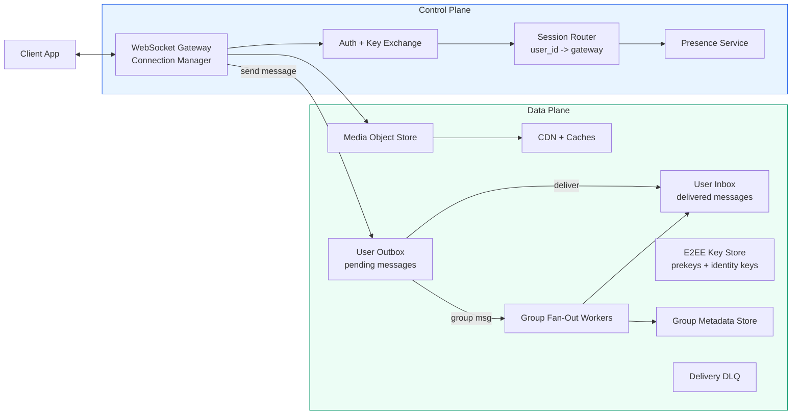
```mermaid
flowchart LR
    Client["Client App"]

    subgraph Control["Control Plane"]
        WS["WebSocket Gateway<br/>Connection Manager"]
        Auth["Auth + Key Exchange"]
        Router["Session Router<br/>user_id -> gateway"]
        Presence["Presence Service"]
    end

    subgraph Data["Data Plane"]
        Outbox["User Outbox<br/>pending messages"]
        Inbox["User Inbox<br/>delivered messages"]
        MediaStore["Media Object Store"]
        MediaCDN["CDN + Caches"]
        KeyStore["E2EE Key Store<br/>prekeys + identity keys"]
        GroupStore["Group Metadata Store"]
        GroupFanout["Group Fan-Out Workers"]
        DLQ["Delivery DLQ"]
    end

    Client <--> WS
    WS --> Auth
    Auth --> Router
    Router --> Presence
    WS -->|"send message"| Outbox
    Outbox -->|"deliver"| Inbox
    Outbox -->|"group msg"| GroupFanout
    GroupFanout --> GroupStore
    GroupFanout --> Inbox
    WS --> MediaStore
    MediaStore --> MediaCDN

    style Control fill:#e8f4ff,stroke:#2563eb
    style Data fill:#ecfdf5,stroke:#059669
```

**Critical path: message delivery**

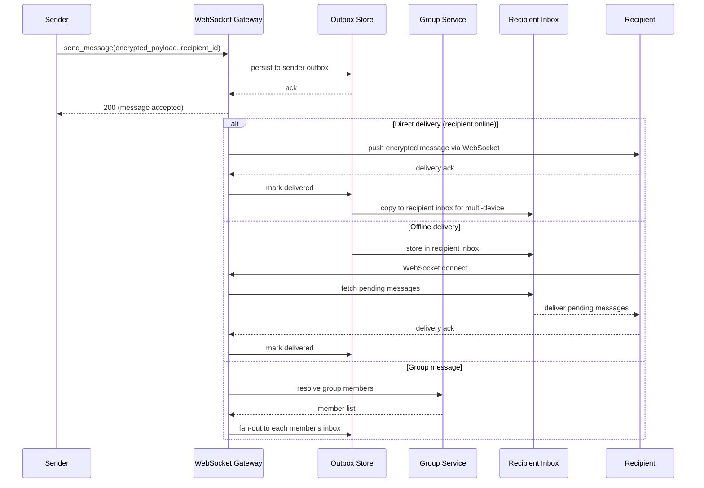
```mermaid
sequenceDiagram
    participant A as Sender
    participant GW as WebSocket Gateway
    participant O as Outbox Store
    participant G as Group Service
    participant I as Recipient Inbox
    participant R as Recipient

    A->>GW: send_message(encrypted_payload, recipient_id)
    GW->>O: persist to sender outbox
    O-->>GW: ack
    GW-->>A: 200 (message accepted)

    alt Direct delivery (recipient online)
        GW->>R: push encrypted message via WebSocket
        R-->>GW: delivery ack
        GW->>O: mark delivered
        O->>I: copy to recipient inbox for multi-device
    else Offline delivery
        O->>I: store in recipient inbox
        R->>GW: WebSocket connect
        GW->>I: fetch pending messages
        I-->>R: deliver pending messages
        R-->>GW: delivery ack
        GW->>O: mark delivered
    else Group message
        GW->>G: resolve group members
        G-->>GW: member list
        GW->>O: fan-out to each member's inbox
    end
```

#### 3. Core Component Deep-Dive (Schema definitions, API endpoint definitions, and algorithmic mechanics)

**APIs**

| Endpoint | Method | Purpose |
|---|---|---|
| `/v1/messages` | `POST` | Send encrypted message |
| `/v1/messages/inbox` | `GET` | Fetch pending messages |
| `/v1/messages/{msg_id}/ack` | `POST` | Acknowledge delivery |
| `/v1/groups` | `POST` | Create group |
| `/v1/groups/{group_id}` | `GET` | Get group metadata |
| `/v1/media/upload` | `POST` | Upload encrypted media |
| `/v1/presence` | `WebSocket` | Presence/typing channel |

**Message schema**

```sql
CREATE TABLE messages_outbox (
    message_id BIGINT PRIMARY KEY,
    sender_id BIGINT NOT NULL,
    recipient_id BIGINT NULL,
    group_id BIGINT NULL,
    encrypted_payload BLOB NOT NULL,
    media_path TEXT NULL,
    created_at TIMESTAMP NOT NULL,
    delivery_state VARCHAR(32) NOT NULL,
    expires_at TIMESTAMP NOT NULL
);

-- Speeds up per-user outbox scans.
CREATE INDEX idx_outbox_sender
ON messages_outbox (sender_id, created_at DESC);

CREATE TABLE messages_inbox (
    message_id BIGINT NOT NULL,
    recipient_id BIGINT NOT NULL,
    sender_id BIGINT NOT NULL,
    encrypted_payload BLOB NOT NULL,
    media_url_token TEXT NULL,
    created_at TIMESTAMP NOT NULL,
    is_read BOOLEAN NOT NULL DEFAULT FALSE,
    PRIMARY KEY (recipient_id, message_id)
);

-- Supports unread count and inbox scans.
CREATE INDEX idx_inbox_recipient_created
ON messages_inbox (recipient_id, created_at DESC);
```

**E2EE key store schema**

```sql
CREATE TABLE e2ee_keys (
    user_id BIGINT PRIMARY KEY,
    identity_key BLOB NOT NULL,
    signed_prekey BLOB NOT NULL,
    signed_prekey_signature BLOB NOT NULL,
    -- One-time prekeys are rotated.
    one_time_prekeys JSONB NOT NULL,
    created_at TIMESTAMP NOT NULL,
    updated_at TIMESTAMP NOT NULL
);

CREATE TABLE e2ee_sessions (
    session_id BIGINT PRIMARY KEY,
    user_a_id BIGINT NOT NULL,
    user_b_id BIGINT NOT NULL,
    session_key BLOB NOT NULL,
    created_at TIMESTAMP NOT NULL,
    UNIQUE (user_a_id, user_b_id)
);
```

**Algorithmic mechanics**

| Mechanic | Purpose |
|---|---|
| Inbox/outbox pattern | Reliable async delivery with offline support |
| E2EE with Double Ratchet | Forward secrecy and future secrecy per message |
| Server-side fan-out for groups | Fan-out on write for groups under 1,000 members |
| Large group broadcast | Read-time pull for groups larger than 1,000 members |
| Presence with exponential backoff | Reduce presence update QPS by 90%+ via throttling |
| Media CDN with expiring tokens | Access control without breaking CDN caching |

#### 4. Scaling & Bottleneck Resolutions (Applying lessons from GFS, Dynamo, and Memcached)

**What if...? Group chat with 100K members sends one message**

> ⚠️ **Failure mode**
> A large group broadcast generates 100,000 inbox writes. If the system treats every group message as write-amplified fan-out, a single message can saturate the write capacity of the inbox store for minutes.

**Walkthrough**

1. Message targets a 100K-member community group.
2. Fan-out service attempts to insert into each member's inbox.
3. Inbox store write throughput saturates.
4. Other users' messages are queued behind the bulk write.
5. Delivery latency spikes for all users sharing the store shard.

**Mitigation**

| Step | Action |
|---|---|
| 1 | Fan-out in batches of 5,000 writes with backpressure |
| 2 | Use read-time pull for groups over 1,000 members |
| 3 | Index the message in a group timeline store; clients pull on open |
| 4 | Dedicated group message cluster isolates chat from one-to-one traffic |
| 5 | Add per-group rate limits to prevent abuse |

**What if...? E2EE key compromise detection lag**

> ⚠️ **Failure mode**
> A user's device is compromised and the attacker obtains the identity key. The attacker can now decrypt all future messages until the user regenerates keys and notifies contacts.

**Walkthrough**

1. Attacker gains access to device.
2. Identity key and prekey bundle are extracted.
3. Compromised device continues normal ratchet exchanges.
4. No server-side signal exists because server cannot read encrypted payloads.
5. Compromised session persists for days before user notices.

**Mitigation**

| Step | Action |
|---|---|
| 1 | Support key rotation with forced re-ratchet every N messages |
| 2 | Notify contacts of key changes via out-of-band identity verification |
| 3 | Provide security notification channel on key change |
| 4 | Allow users to remotely log out compromised devices |
| 5 | Log key change events for abuse investigation (metadata only) |

**Decision log**

| Decision | Choice | Rationale | Rejected alternative |
|---|---|---|---|
| Delivery model | Inbox/outbox | Reliable async delivery with offline support | Direct push-only delivery |
| Group fan-out | Hybrid push/pull | Small groups get push efficiency; large groups avoid write explosion | Pure push for all groups |
| E2EE | Double Ratchet + X3DH | Industry-standard forward secrecy | TLS-only encryption with server-readable messages |
| Presence | Event-driven with backoff | Reduces 23M QPS to manageable levels | Broadcasting every keystroke to all contacts |
| Media storage | Object store + CDN | Large blobs kept out of message database | Storing media blobs inline in message rows |

---

### Uber / Ride-Hailing

#### 1. Requirements & Bounding (Include clear calculation tables for Storage, QPS, and Bandwidth numbers)

**Functional requirements**

- Riders request a ride and see nearby available drivers.
- Drivers go online/offline and receive ride requests.
- System matches rider to nearest available driver.
- Track driver location in real-time during the trip.
- Calculate ETAs and fares (including surge pricing).
- Support trip lifecycle: request → matching → pickup → in-transit → drop-off → payment.

**Non-functional requirements**

- Ride matching must complete in under 1 second.
- Driver GPS updates must be ingested at high throughput.
- Trip state machine must be consistent and recoverable.
- Surge pricing decisions must propagate quickly to all riders in an area.
- System must handle flash crowds (concerts, sports, holidays).

**Assumptions**

| Input | Value |
|---|---:|
| Riders (DAU) | 100 million |
| Drivers (active) | 5 million |
| Trips/day | 15 million |
| Driver GPS update interval | 4 seconds (per driver) |
| GPS payload per update | 200 B |
| Ride request payload | 1 KB |
| Trip record | 5 KB |
| Surge zones | 50,000 geo-fenced zones |
| Geohash precision | 7 characters (76 m x 76 m) |

**Storage**

| Item | Calculation | Result |
|---|---:|---:|---:|
| Daily trips | 15M x 5 KB | 75 GB/day |
| Monthly trips | 75 GB x 30 | 2.25 TB/month |
| 3-year trip storage | 2.25 TB x 36 | 81 TB |
| GPS points/day | 5M drivers x 86,400/4 | 108B points/day |
| GPS storage/day | 108B x 200 B | 21.6 TB/day |
| GPS retention (7 days) | 21.6 TB x 7 | 151 TB |
| Trip storage RF=3 | 81 TB x 3 | 243 TB |
| GPS storage RF=3 | 151 TB x 3 | 453 TB |

**QPS**

| Traffic | Calculation | Average | 20x Peak |
|---|---:|---:|---:|---:|
| GPS writes | 5M / 4 sec | 1.25M QPS | 25M QPS |
| Ride requests | 15M / 86,400 | ~174 QPS | ~3,480 QPS |
| Ride matches | Same as ride requests | ~174 QPS | ~3,480 QPS |
| Geospatial queries | 5x ride requests | ~870 QPS | ~17,400 QPS |
| ETA calculations | 10x ride requests (pre-request heatmap) | ~1,740 QPS | ~34,800 QPS |
| Trip state transitions | 15M / 86,400 | ~174 QPS | ~3,480 QPS |

**Bandwidth**

| Path | Calculation | Average |
|---|---:|---:|---:|
| GPS ingress | 1.25M x 200 B | ~250 MB/s |
| Ride request ingress | 174 x 1 KB | ~174 KB/s |
| Match broadcast egress | 174 x (50 drivers x 1 KB) | ~8.7 MB/s |
| Trip data egress | 174 x 5 KB | ~870 KB/s |
| Peak GPS ingress | 25M x 200 B | ~5 GB/s |

> 📐 **Math check**
> GPS writes dominate at 1.25M QPS average, 25M QPS peak. This is roughly 100x the rate of ride requests. The GPS pipeline must treat writes as fire-and-forget with no strong consistency requirement. Every ride match reads the current GPS state; the system can tolerate seconds-old location data for matching candidates.

> 🧠 **Staff-engineer note**
> The hardest problem is not the ride matching algorithm itself — it is maintaining a fresh, indexed view of 5 million moving points while serving 1,700+ geospatial queries per second. The geospatial index must support fast nearest-neighbor lookups, range queries, and incremental updates without rebuilding the entire index on every GPS write.

#### 2. High-Level Architecture (A clear textual map of component placement)

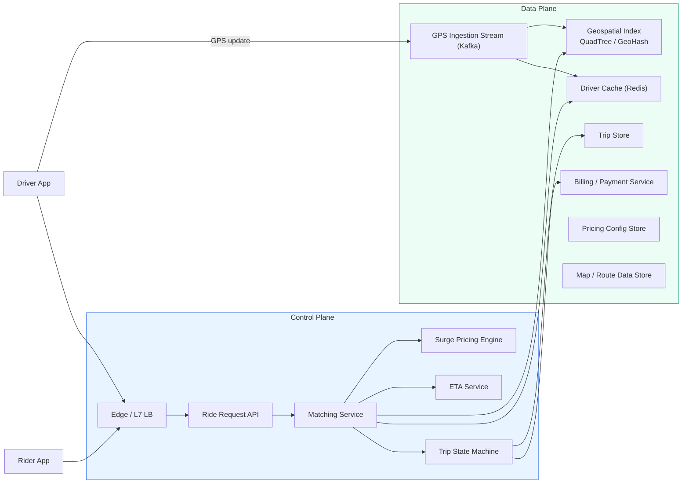
```mermaid
flowchart LR
    Rider["Rider App"]
    Driver["Driver App"]

    subgraph Control["Control Plane"]
        Edge["Edge / L7 LB"]
        RideAPI["Ride Request API"]
        Matching["Matching Service"]
        Surge["Surge Pricing Engine"]
        ETA["ETA Service"]
        TripSM["Trip State Machine"]
    end

    subgraph Data["Data Plane"]
        GPSIngest["GPS Ingestion Stream (Kafka)"]
        GeoIndex["Geospatial Index<br/>QuadTree / GeoHash"]
        DriverCache["Driver Cache (Redis)"]
        TripStore["Trip Store"]
        Billing["Billing / Payment Service"]
        Pricing["Pricing Config Store"]
        MapData["Map / Route Data Store"]
    end

    Rider --> Edge
    Driver --> Edge
    Edge --> RideAPI
    RideAPI --> Matching
    Matching --> GeoIndex
    Matching --> DriverCache
    Matching --> ETA
    Matching --> Surge
    Matching --> TripSM
    Driver -->|"GPS update"| GPSIngest
    GPSIngest --> GeoIndex
    GPSIngest --> DriverCache
    TripSM --> TripStore
    TripSM --> Billing

    style Control fill:#e8f4ff,stroke:#2563eb
    style Data fill:#ecfdf5,stroke:#059669
```

**Critical path: ride matching**

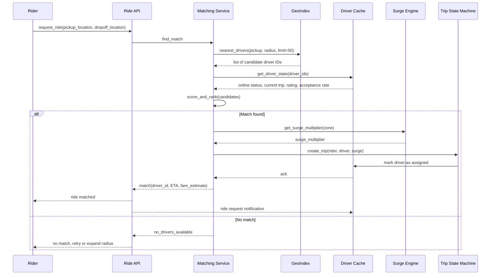
```mermaid
sequenceDiagram
    participant R as Rider
    participant A as Ride API
    participant M as Matching Service
    participant G as GeoIndex
    participant D as Driver Cache
    participant S as Surge Engine
    participant T as Trip State Machine

    R->>A: request_ride(pickup_location, dropoff_location)
    A->>M: find_match
    M->>G: nearest_drivers(pickup, radius, limit=50)
    G-->>M: list of candidate driver IDs
    M->>D: get_driver_state(driver_ids)
    D-->>M: online status, current trip, rating, acceptance rate
    M->>M: score_and_rank(candidates)

    alt Match found
        M->>S: get_surge_multiplier(zone)
        S-->>M: surge_multiplier
        M->>T: create_trip(rider, driver, surge)
        T->>D: mark driver as assigned
        D-->>M: ack
        M-->>A: match(driver_id, ETA, fare_estimate)
        A-->>R: ride matched
        A-->>D: ride request notification
    else No match
        M-->>A: no_drivers_available
        A-->>R: no match, retry or expand radius
    end
```

#### 3. Core Component Deep-Dive (Schema definitions, API endpoint definitions, and algorithmic mechanics)

**APIs**

| Endpoint | Method | Purpose |
|---|---|---|
| `/v1/rides` | `POST` | Request a ride |
| `/v1/rides/{id}` | `GET` | Get trip state |
| `/v1/drivers/location` | `POST` | Update driver GPS (batch) |
| `/v1/drivers/status` | `POST` | Go online/offline |
| `/v1/eta` | `GET` | Get ETA to destination |
| `/v1/surge` | `GET` | Get current surge for zone |

**Trip schema**

```sql
CREATE TABLE trips (
    trip_id BIGINT PRIMARY KEY,
    rider_id BIGINT NOT NULL,
    driver_id BIGINT NOT NULL,
    pickup_geohash VARCHAR(12) NOT NULL,
    dropoff_geohash VARCHAR(12) NULL,
    pickup_location GEOGRAPHY(Point) NOT NULL,
    dropoff_location GEOGRAPHY(Point) NULL,
    status VARCHAR(32) NOT NULL,
    surge_multiplier DECIMAL(4,2) NOT NULL DEFAULT 1.00,
    fare_estimate DECIMAL(10,2) NULL,
    fare_final DECIMAL(10,2) NULL,
    created_at TIMESTAMP NOT NULL,
    started_at TIMESTAMP NULL,
    completed_at TIMESTAMP NULL
);

-- Supports rider history query.
CREATE INDEX idx_trips_rider ON trips (rider_id, created_at DESC);
-- Supports driver history and earnings.
CREATE INDEX idx_trips_driver ON trips (driver_id, created_at DESC);
-- Supports active trip lookup.
CREATE INDEX idx_trips_status ON trips (status, driver_id) WHERE status IN ('MATCHED', 'IN_TRANSIT');

CREATE TABLE driver_locations (
    driver_id BIGINT PRIMARY KEY,
    geohash VARCHAR(12) NOT NULL,
    location GEOGRAPHY(Point) NOT NULL,
    heading DECIMAL(5,2) NULL,
    speed_kmh DECIMAL(5,1) NULL,
    updated_at TIMESTAMP NOT NULL,
    is_online BOOLEAN NOT NULL DEFAULT FALSE
);

CREATE INDEX idx_driver_geohash ON driver_locations (geohash) WHERE is_online = TRUE;
```

**Geospatial index strategies**

| Strategy | Lookup Speed | Update Cost | Complexity | Production Use |
|---|---|---|---|---|---|
| GeoHash prefix scan | Fast for fixed-size queries | O(1) per update | Low | Uber, Lyft |
| QuadTree in-memory | O(log n) | O(log n) rebuild on mutation | Medium | Smaller fleets |
| S2 Geometry | Best precision | O(log n) | High | Google Maps |
| Grid-based sharding | O(1) on grid cell | O(1) | Low | Simple apps |
| H3 (Uber) | Multi-resolution | O(1) per update | Medium | Uber (custom) |

Recommended: Use GeoHashes stored in the database with a prefix index. For the in-memory hot path, maintain sharded QuadTrees per geographic region, rebuilt incrementally from the GPS stream.

**Algorithmic mechanics**

| Mechanic | Purpose |
|---|---|
| Nearest-driver query | Range scan on geohash prefix + Haversine distance filter |
| Score and rank | Weighted combination of distance, driver rating, acceptance rate, surge zone |
| Surge pricing | Dynamic multiplier based on real-time supply/demand ratio per zone |
| ETA computation | Route service distance / historical speed average for zone |
| Trip state machine | Finite state machine with explicit transitions (REQUESTED → MATCHED → ARRIVED → IN_TRANSIT → COMPLETED) |

#### 4. Scaling & Bottleneck Resolutions (Applying lessons from GFS, Dynamo, and Memcached)

**What if...? Concert ends and 50,000 riders simultaneously request rides**

> ⚠️ **Failure mode**
> A major event causes a flash crowd. Matching requests arrive at 5,000+ QPS. GeoIndex is overwhelmed with concurrent nearest-neighbor queries. Trip state machine sees 3,000+ concurrent transition attempts. Driver pool is insufficient, so most matches fail, but clients retry aggressively.

**Walkthrough**

1. Venue event ends at known time.
2. Ride request rate spikes 50x.
3. GeoIndex query latency increases as queue backs up.
4. Matching scores become stale as drivers are slowly moved through queue.
5. Many-match-to-one-driver scenarios cause race conditions in TripSM.
6. Rider app shows "searching..." for minutes.

**Mitigation**

| Step | Action |
|---|---|
| 1 | Pre-scale GeoIndex partitions and matching workers before scheduled events |
| 2 | Use event-aware surge that activates before the event ends |
| 3 | Implement request queuing with progressive backoff and estimated wait time |
| 4 | Batch ride requests into 2-second windows for bulk matching |
| 5 | Dedicated event pool of drivers via scheduled dispatches |

**What if...? GeoIndex and GPS stream fall out of sync**

> ⚠️ **Failure mode**
> A Kafka consumer lag builds up in the GPS ingestion pipeline. The GeoIndex shows driver positions from 30 seconds ago. Matching sends ride requests to drivers who have already moved out of range or gone offline.

**Walkthrough**

1. GPS Kafka topic has a consumer lag of 30+ seconds.
2. Matching queries GeoIndex and returns drivers at old locations.
3. Ride is matched to a driver who is now 2 km away.
4. Driver declines because the pickup is too far.
5. Rider waits longer while the system reattempts matching.
6. Consumer lag compounds as reattempts generate more load.

**Mitigation**

| Step | Action |
|---|---|
| 1 | Monitor GeoIndex lag as a critical SLO; alert at 10 seconds |
| 2 | Add staleness metadata to driver records so matching can filter |
| 3 | Throttle GPS producers if consumers fall behind |
| 4 | Use a secondary fast-path index for the highest-density zones |
| 5 | Implement driver-side last-known-good updates to self-correct stale positions |

**Decision log**

| Decision | Choice | Rationale | Rejected alternative |
|---|---|---|---|
| Geospatial index | GeoHash with prefix scan | Good precision; low update cost; mature database support | In-memory QuadTree per zone (high memory, complex replication) |
| GPS transport | Kafka | Durable stream with replay for geo-index rebuild | Direct write to database (no replay, write-bounded) |
| Matching strategy | Score + rank with proximity bias | Fast, well-understood, tunable | Full integer programming optimization (too slow for real-time) |
| Surge pricing | Zone-based multiplier | Simple, predictable, easy to communicate | Auction-based pricing (confusing to users, harder to explain) |
| Trip state machine | Leader-elected state service | Eliminates race conditions on concurrent transitions | Optimistic locking with retries (too many conflicts under load) |

---

### YouTube / Video Platform

#### 1. Requirements & Bounding (Include clear calculation tables for Storage, QPS, and Bandwidth numbers)

**Functional requirements**

- Upload videos with metadata (title, description, tags, thumbnails).
- Transcode uploaded videos to multiple resolutions and formats.
- Stream video to viewers with adaptive bitrate.
- Serve video recommendations on homepage and related sidebar.
- Track views, likes, comments, and subscriptions.
- Support search, playlists, and channel pages.

**Non-functional requirements**

- Upload must be accepted quickly and processed asynchronously.
- Streaming must have low startup latency and smooth adaptive bitrate switching.
- CDN must serve the vast majority of traffic and survive regional failures.
- View counts must be accurate but can be eventually consistent.
- Transcoding pipeline must scale horizontally with upload volume.

**Assumptions**

| Input | Value |
|---|---:|
| DAU | 2 billion |
| Minutes uploaded/hour | 500 hours |
| Average video bitrate (upload) | 10 Mbps |
| Storage per minute uploaded | 500 MB (raw) |
| View count/user/day | 30 |
| Average view duration | 10 minutes |
| Streaming bitrate (average) | 4 Mbps |
| Thumbnail per video | 200 KB |
| Video metadata | 5 KB |
| Retention | Indefinite (hot/warm/cold tiering) |

**Storage**

| Item | Calculation | Result |
|---|---:|---:|---:|
| Daily upload minutes | 500 x 24 | 12,000 hours/day |
| Daily raw video storage | 12,000 x 60 x 500 MB | 360 TB/day |
| After transcoding (3x multiplier) | 360 TB x 3 | 1.08 PB/day |
| Hot storage (30 days) | 1.08 PB x 30 | 32.4 PB |
| Warm storage (1 year) | 1.08 PB x 335 | 361.8 PB |
| Cold storage (indefinite) | 1.08 PB x 365 x 5 | ~2 EB |
| Replication factor 3 (hot) | 32.4 PB x 3 | 97.2 PB |

**QPS**

| Traffic | Calculation | Average | 20x Peak |
|---|---:|---:|---:|---:|
| Video uploads | 500h / 3,600 / min = 8.3 uploads/min avg | ~5 uploads/sec | ~100 uploads/sec |
| Stream start requests | 2B x 30 / 86,400 | ~694K QPS | ~13.9M QPS |
| Manifest requests | 2x stream starts | ~1.4M QPS | ~28M QPS |
| Segment requests | 694K x 600 sec / 10 sec segments | ~41.6M QPS | ~832M QPS |
| Search queries | 2% of DAU | ~463 QPS | ~9,260 QPS |
| Like/comment writes | 10% of streams | ~69K QPS | ~1.4M QPS |
| Recommendation requests | 1.5x home page views | ~1M QPS | ~20M QPS |

**Bandwidth**

| Path | Calculation | Average |
|---|---:|---:|---:|
| Upload ingress | 500h/h x 10 Mbps | ~1.39 GB/s |
| Streaming egress | 694K x 4 Mbps | ~347 GB/s |
| Peak streaming egress | 13.9M x 4 Mbps | ~6.95 TB/s |
| Transcoding intermediate | 1.39 GB/s x 3 | ~4.17 GB/s |
| Thumbnail egress | 2x stream starts x 200 KB | ~277 GB/s |

> 📐 **Math check**
> Segment requests dominate at 41.6M QPS average. This is the main reason YouTube uses massive CDN edge caches. If only 1% of segment requests miss cache and hit origin servers, that is still 416,000 QPS of origin read traffic — requiring hundreds of storage nodes. CDN cache hit ratio is the single most important SLO for the streaming path.

> 🧠 **Staff-engineer note**
> The key architectural insight is that transcoding is the bottleneck in the upload pipeline, not storage. 500h/hour of upload means 8.3 uploads/sec, which is trivial. But transcoding each video into 5-10 resolution variants at different bitrates requires massive compute. The system must decouple upload acceptance from processing using a durable queue and a large, elastic transcoder pool.

#### 2. High-Level Architecture (A clear textual map of component placement)

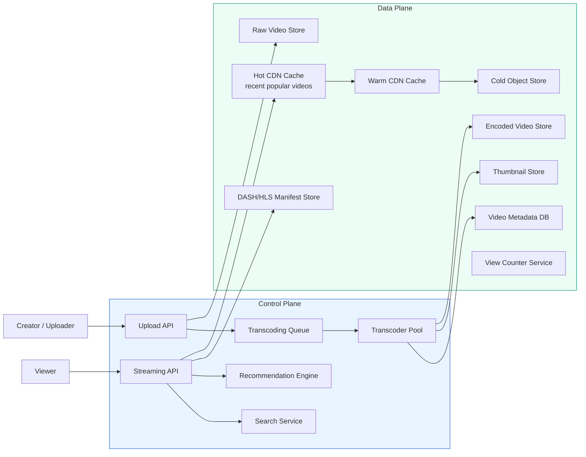
```mermaid
flowchart LR
    Creator["Creator / Uploader"]
    Viewer["Viewer"]

    subgraph Control["Control Plane"]
        UploadAPI["Upload API"]
        TranscodeQ["Transcoding Queue"]
        TranscodePool["Transcoder Pool"]
        StreamAPI["Streaming API"]
        Recommend["Recommendation Engine"]
        SearchSvc["Search Service"]
    end

    subgraph Data["Data Plane"]
        RawStore["Raw Video Store"]
        EncodedStore["Encoded Video Store"]
        HotCache["Hot CDN Cache<br/>recent popular videos"]
        WarmCache["Warm CDN Cache"]
        ColdStore["Cold Object Store"]
        Thumbnail["Thumbnail Store"]
        Metadata["Video Metadata DB"]
        ViewCount["View Counter Service"]
        DASHManifest["DASH/HLS Manifest Store"]
    end

    Creator --> UploadAPI
    UploadAPI --> RawStore
    UploadAPI --> TranscodeQ
    TranscodeQ --> TranscodePool
    TranscodePool --> EncodedStore
    TranscodePool --> Thumbnail
    TranscodePool --> Metadata
    Viewer --> StreamAPI
    StreamAPI --> HotCache
    StreamAPI --> DASHManifest
    HotCache --> WarmCache
    WarmCache --> ColdStore
    StreamAPI --> Recommend
    StreamAPI --> SearchSvc

    style Control fill:#e8f4ff,stroke:#2563eb
    style Data fill:#ecfdf5,stroke:#059669
```

**Critical path: video upload and streaming**

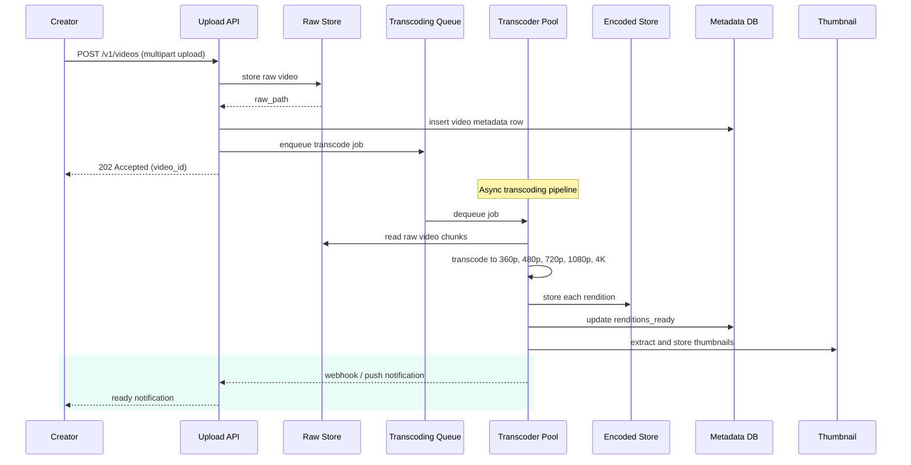
```mermaid
sequenceDiagram
    participant C as Creator
    participant U as Upload API
    participant R as Raw Store
    participant Q as Transcoding Queue
    participant T as Transcoder Pool
    participant E as Encoded Store
    participant M as Metadata DB

    C->>U: POST /v1/videos (multipart upload)
    U->>R: store raw video
    R-->>U: raw_path
    U->>M: insert video metadata row
    U->>Q: enqueue transcode job
    U-->>C: 202 Accepted (video_id)

    Note over T: Async transcoding pipeline
    Q->>T: dequeue job
    T->>R: read raw video chunks
    T->>T: transcode to 360p, 480p, 720p, 1080p, 4K
    T->>E: store each rendition
    T->>M: update renditions_ready
    T->>Thumbnail: extract and store thumbnails

    rect rgb(232, 253, 245)
        T-->>U: webhook / push notification
        U-->>C: ready notification
    end
```

**Critical path: adaptive bitrate streaming**

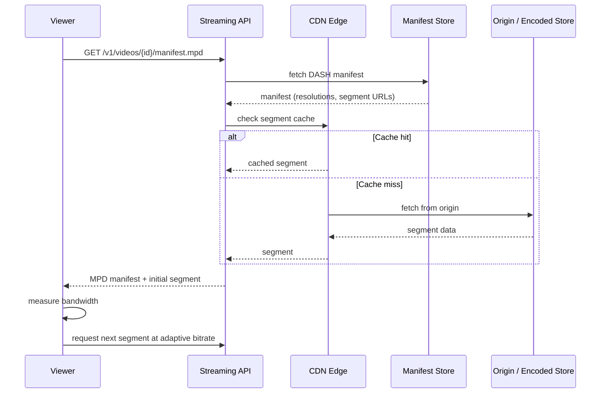
```mermaid
sequenceDiagram
    participant V as Viewer
    participant S as Streaming API
    participant CDN as CDN Edge
    participant M as Manifest Store
    participant O as Origin / Encoded Store

    V->>S: GET /v1/videos/{id}/manifest.mpd
    S->>M: fetch DASH manifest
    M-->>S: manifest (resolutions, segment URLs)
    S->>CDN: check segment cache
    alt Cache hit
        CDN-->>S: cached segment
    else Cache miss
        CDN->>O: fetch from origin
        O-->>CDN: segment data
        CDN-->>S: segment
    end
    S-->>V: MPD manifest + initial segment
    V->>V: measure bandwidth
    V->>S: request next segment at adaptive bitrate
```

#### 3. Core Component Deep-Dive (Schema definitions, API endpoint definitions, and algorithmic mechanics)

**APIs**

| Endpoint | Method | Purpose |
|---|---|---|
| `/v1/videos` | `POST` | Upload video |
| `/v1/videos/{id}` | `GET` | Get video metadata |
| `/v1/videos/{id}/manifest.mpd` | `GET` | DASH manifest |
| `/v1/videos/{id}/segments/{res}/{num}` | `GET` | Video segment |
| `/v1/recommendations` | `GET` | Get recommendations |
| `/v1/search?q=...` | `GET` | Search videos |
| `/v1/videos/{id}/likes` | `POST` | Like/dislike video |
| `/v1/views` | `POST` | Report view |

**Video metadata schema**

```sql
CREATE TABLE videos (
    video_id BIGINT PRIMARY KEY,
    channel_id BIGINT NOT NULL,
    title VARCHAR(256) NOT NULL,
    description TEXT NULL,
    tags JSONB NULL,
    duration_seconds INT NOT NULL,
    upload_status VARCHAR(32) NOT NULL,
    transcoding_status VARCHAR(32) NOT NULL,
    visibility VARCHAR(32) NOT NULL,
    raw_object_path TEXT NOT NULL,
    thumbnail_path TEXT NULL,
    view_count BIGINT NOT NULL DEFAULT 0,
    like_count BIGINT NOT NULL DEFAULT 0,
    created_at TIMESTAMP NOT NULL,
    published_at TIMESTAMP NULL
);

-- Supports channel page and uploader dashboard.
CREATE INDEX idx_videos_channel ON videos (channel_id, created_at DESC);
-- Supports trending and recommended discovery.
CREATE INDEX idx_videos_published ON videos (published_at DESC) WHERE visibility = 'PUBLIC';
-- Supports filter by status for transcoder progress.
CREATE INDEX idx_videos_transcode ON videos (transcoding_status) WHERE upload_status = 'COMPLETE';

CREATE TABLE video_renditions (
    rendition_id BIGINT PRIMARY KEY,
    video_id BIGINT NOT NULL,
    resolution VARCHAR(16) NOT NULL,
    bitrate_kbps INT NOT NULL,
    codec VARCHAR(32) NOT NULL,
    segment_duration_sec FLOAT NOT NULL,
    segment_count INT NOT NULL,
    object_path_prefix TEXT NOT NULL,
    file_size BIGINT NOT NULL,
    FOREIGN KEY (video_id) REFERENCES videos(video_id)
);

CREATE INDEX idx_renditions_video ON video_renditions (video_id, resolution);
```

**Transcoding resolution ladder**

| Label | Resolution | Bitrate | Notes |
|---|---|---|---|
| 144p | 256x144 | 300 Kbps | Minimum for slow connections |
| 360p | 640x360 | 700 Kbps | Baseline |
| 480p | 854x480 | 1.5 Mbps | Standard def |
| 720p | 1280x720 | 3 Mbps | HD |
| 1080p | 1920x1080 | 6 Mbps | Full HD |
| 4K | 3840x2160 | 16 Mbps | UHD |
| 8K | 7680x4320 | 50 Mbps | Latest high-end |

**Algorithmic mechanics**

| Mechanic | Purpose |
|---|---|
| DASH/HLS segmentation | Splits video into 4-10 second segments for adaptive bitrate |
| CDN tiering | Hot (popular) → Warm (medium) → Cold (long tail) with expiry policies |
| View count aggregation | In-memory counter with periodic flush to DB (eventually consistent) |
| Recommendation | Collaborative filtering + content-based + watch history embeddings |
| Abuse detection | Upload rate limits per creator, content hashing, metadata analysis |
| Transcoding pipeline | DAG of jobs: audio, video, thumbnail, caption tracks |

#### 4. Scaling & Bottleneck Resolutions (Applying lessons from GFS, Dynamo, and Memcached)

**What if...? A video goes viral and CDN gets cache miss storm**

> ⚠️ **Failure mode**
> A new video is uploaded and shared by a celebrity. Millions of viewers request segments simultaneously. The CDN has no cached copy. Origin servers receive millions of segment requests per second. Origin throughput saturates and streaming quality collapses globally.

**Walkthrough**

1. Video is uploaded but not pre-populated on CDN edges.
2. Celebrity tweet drives 5M concurrent views within 10 minutes.
3. CDN edges all miss — none have the segments cached.
4. Origin servers receive 5M x (600 sec / 10 sec) = 300M segment requests.
5. Origin throughput peaks at 1 TB/s+ and saturates network links.
6. Video buffers and stalls for all viewers.

**Mitigation**

| Step | Action |
|---|---|
| 1 | Proactively push popular creator content to CDN on upload |
| 2 | Use CDN pre-warming API for known viral content |
| 3 | Implement request coalescing per segment key at edge |
| 4 | Cache at multiple CDN tiers (regional mid-tiers shield the origin) |
| 5 | Peak-aware origin capacity planning with 100x burst margin |

**What if...? Transcoding backlog during a trending event**

> ⚠️ **Failure mode**
> A major event (sports final, concert) causes uploads to spike 20x. Transcoding queue grows faster than worker pool can drain it. Popular uploads remain in processing for hours.

**Walkthrough**

1. 100x upload spike during a live event (millions uploading clips).
2. Raw video storage accepts all uploads with no backpressure.
3. Transcoding queue depth grows to millions of pending jobs.
4. Fixed transcoder pool processes at capacity.
5. Fresh uploads from popular creators are queued behind bulk uploads.
6. Users cannot watch not-ready videos while they are trending.

**Mitigation**

| Step | Action |
|---|---|
| 1 | Implement priority queues: popular creators and known events get priority |
| 2 | Use spot/preemptible compute for elastic transcoder scaling |
| 3 | Serve raw video at minimal bitrate (single 360p pass) until full transcode completes |
| 4 | Add upload admission control during known high-volume windows |
| 5 | Distinguish between foreground (viewer-waiting) and background (archive) transcodes |

**Decision log**

| Decision | Choice | Rationale | Rejected alternative |
|---|---|---|---|
| Upload acceptance | Async with 202 Accepted | Uploads cannot block on transcoding | Synchronous upload-and-process (blocks creators) |
| Transcoding | DAG job pipeline with elastic compute | Supports complex workflow with dependency resolution | Monolithic single-pass transcoder |
| Streaming format | DASH (MPEG) + HLS | Industry standard, wide device support | Proprietary streaming protocol |
| CDN tiering | Hot/Warm/Cold with progressive eviction | Matches access patterns: Pareto distribution (80% views on 20% content) | Single CDN tier (cost-inefficient for long tail) |
| View counter | In-memory buffer + batch flush | View count tolerance for staleness is high | Strongly consistent per-view DB write |
| Storage tiering | Hot (SSD/Replicated) → Warm (HDD) → Cold (tape/archive) | Matches access frequency to cost | All-hot storage (prohibitive cost for 2 EB) |

---

### Netflix / Streaming

#### 1. Requirements & Bounding (Include clear calculation tables for Storage, QPS, and Bandwidth numbers)

**Functional requirements**

- Browse a catalog of movies and TV shows with metadata, ratings, and artwork.
- Stream video on demand with adaptive bitrate across devices.
- Resume playback from where the user left off.
- Provide personalized recommendations per profile.
- Support multiple user profiles per account with parental controls.
- Download content for offline viewing.
- Manage digital rights management (DRM) licensing.

**Non-functional requirements**

- Streaming startup must be under 3 seconds.
- Adaptive bitrate must switch smoothly without buffering.
- CDN must serve 95%+ of traffic and handle flash crowds for new releases.
- Recommendations must update within 24 hours of new viewing data.
- DRM must prevent unauthorized copying while allowing legitimate playback.
- System must survive regional CDN outages gracefully.

**Assumptions**

| Input | Value |
|---|---:|
| DAU | 200 million |
| Streaming hours/user/day | 2 hours |
| Average bitrate (streamed) | 6 Mbps (4K HDR average) |
| Catalog size | 20,000 titles |
| New content added/day | 50 hours |
| Encoding renditions per title | 8 (SD to 4K HDR) |
| Average title duration | 1.5 hours |
| Artwork/metadata per title | 50 MB |
| Download rate | 10% of users download 1 title/week |

**Storage**

| Item | Calculation | Result |
|---|---:|---:|---:|
| Catalog encoded size (all titles) | 20,000 x 1.5h x 8 renditions x 2 TBph | 480 PB |
| New content/day | 50h x 8 x 2 TBph | 800 GB/day |
| Metadata, artwork, subtitles | 20,000 x 50 MB | 1 TB |
| License/DRM records/day | 200M x 2h / 1.5h avg | ~267M records |
| License storage/year | 267M x 1 KB x 365 | ~97 TB/year |
| Download cache/server | 20M users x 1.5 GB/week | ~30 PB |
| Total catalog RF=2 | 480 PB x 2 | 960 PB |

**QPS**

| Traffic | Calculation | Average | 20x Peak |
|---|---:|---:|---:|---:|
| Browse/Menu requests | 200M x 10 sessions | ~23K QPS | ~460K QPS |
| Playback start requests | 200M x 2h / 1.5h avg title | ~74K QPS | ~1.48M QPS |
| Manifest requests | 2x playbacks | ~148K QPS | ~2.96M QPS |
| Segment requests | 74K x (3600 / 4 sec segments) | ~66.6M QPS | ~1.33B QPS |
| Recommendation requests | 200M / 86,400 | ~2,315 QPS | ~46,300 QPS |
| DRM license requests | Same as playbacks | ~74K QPS | ~1.48M QPS |
| Search queries | 5% of sessions | ~1,157 QPS | ~23,140 QPS |

**Bandwidth**

| Path | Calculation | Average |
|---|---:|---:|---:|
| Streaming egress | 200M x 2h x 6 Mbps / 86,400 | ~600 TB/day = ~6.94 GB/s |
| Peak streaming egress | 6.94 GB/s x 20 | ~138.9 GB/s |
| CDN mid-tier egress | 5% cache miss origin | ~6.94 GB/s |
| Content ingest (new titles) | 50h/day x 8 x 2 TBph / 86,400 | ~115 MB/s |
| Artwork/CDN egress | 23K x 2 MB | ~46 MB/s |
| Download egress | 20M x 1.5GB / 7 days / 86,400 | ~496 MB/s |

> 📐 **Math check**
> Segment requests at 66.6M QPS average make Netflix one of the most read-intensive systems ever built. At 4-second segments per stream, each 10-second pause in manifest delivery affects thousands of concurrent playback starts. The CDN must handle millions of concurrent streaming sessions with sub-second segment fetch times.

> 🧠 **Staff-engineer note**
> Netflix's Open Connect CDN is the defining architectural decision. Rather than renting general-purpose CDN capacity, Netflix deploys its own caching appliances inside ISP points of presence. This reduces transit costs by 90%+ and gives Netflix direct control over the streaming path. The cost is operational complexity: deploying, monitoring, and refreshing thousands of appliances globally.

#### 2. High-Level Architecture (A clear textual map of component placement)

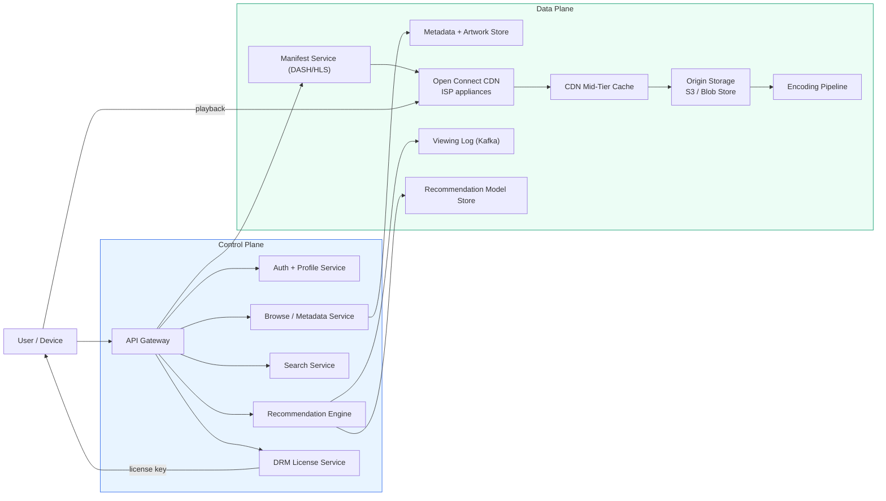
```mermaid
flowchart LR
    User["User / Device"]

    subgraph Control["Control Plane"]
        API["API Gateway"]
        AuthSvc["Auth + Profile Service"]
        BrowseSvc["Browse / Metadata Service"]
        SearchSvc["Search Service"]
        RecSvc["Recommendation Engine"]
        DRM["DRM License Service"]
    end

    subgraph Data["Data Plane"]
        Metadata["Metadata + Artwork Store"]
        MSS["Manifest Service (DASH/HLS)"]
        CDN["Open Connect CDN<br/>ISP appliances"]
        MidTier["CDN Mid-Tier Cache"]
        Origin["Origin Storage<br/>S3 / Blob Store"]
        Encoding["Encoding Pipeline"]
        ViewLog["Viewing Log (Kafka)"]
        RecStore["Recommendation Model Store"]
    end

    User --> API
    API --> AuthSvc
    API --> BrowseSvc
    API --> SearchSvc
    BrowseSvc --> Metadata
    API --> MSS
    MSS --> CDN
    CDN --> MidTier
    MidTier --> Origin
    User -->|"playback"| CDN
    API --> DRM
    DRM -->|"license key"| User
    API --> RecSvc
    RecSvc --> RecStore
    RecSvc --> ViewLog
    Origin --> Encoding

    style Control fill:#e8f4ff,stroke:#2563eb
    style Data fill:#ecfdf5,stroke:#059669
```

**Critical path: playback startup**

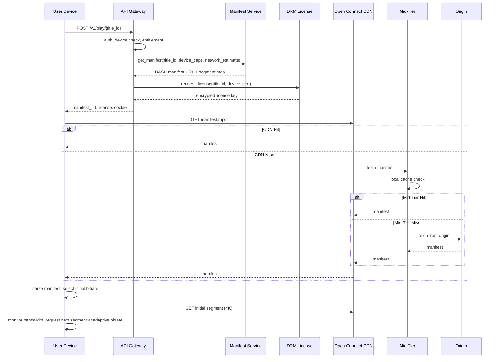
```mermaid
sequenceDiagram
    participant U as User Device
    participant A as API Gateway
    participant MSS as Manifest Service
    participant D as DRM License
    participant O as Open Connect CDN
    participant Mid as Mid-Tier
    participant S as Origin

    U->>A: POST /v1/play/{title_id}
    A->>A: auth, device check, entitlement
    A->>MSS: get_manifest(title_id, device_caps, network_estimate)
    MSS-->>A: DASH manifest URL + segment map
    A->>D: request_license(title_id, device_cert)
    D-->>A: encrypted license key
    A-->>U: manifest_url, license, cookie

    U->>O: GET manifest.mpd
    alt CDN Hit
        O-->>U: manifest
    else CDN Miss
        O->>Mid: fetch manifest
        Mid->>Mid: local cache check
        alt Mid-Tier Hit
            Mid-->>O: manifest
        else Mid-Tier Miss
            Mid->>S: fetch from origin
            S-->>Mid: manifest
            Mid-->>O: manifest
        end
        O-->>U: manifest
    end

    U->>U: parse manifest, select initial bitrate
    U->>O: GET initial segment (4K)
    U->>U: monitor bandwidth, request next segment at adaptive bitrate
```

#### 3. Core Component Deep-Dive (Schema definitions, API endpoint definitions, and algorithmic mechanics)

**APIs**

| Endpoint | Method | Purpose |
|---|---|---|
| `/v1/browse` | `GET` | Get catalog rows |
| `/v1/titles/{id}` | `GET` | Title metadata and artwork |
| `/v1/titles/{id}/seasons` | `GET` | Season/episode list for series |
| `/v1/play/{id}` | `POST` | Start playback session |
| `/v1/search?q=...` | `GET` | Search catalog |
| `/v1/recommendations` | `GET` | Get personalized recommendations |
| `/v1/resume/{id}` | `GET` | Get resume position |

**Title metadata schema**

```sql
CREATE TABLE titles (
    title_id BIGINT PRIMARY KEY,
    title_type VARCHAR(32) NOT NULL, -- MOVIE, SERIES, DOCUMENTARY
    title VARCHAR(256) NOT NULL,
    description TEXT NOT NULL,
    release_year INT NOT NULL,
    runtime_minutes INT NULL,
    maturity_rating VARCHAR(32) NOT NULL,
    genres JSONB NOT NULL,
    cast_members JSONB NULL,
    avg_rating DECIMAL(3,1) NULL,
    artwork_paths JSONB NOT NULL
);

CREATE TABLE seasons (
    season_id BIGINT PRIMARY KEY,
    title_id BIGINT NOT NULL,
    season_number INT NOT NULL,
    episode_count INT NOT NULL,
    FOREIGN KEY (title_id) REFERENCES titles(title_id)
);

CREATE TABLE episodes (
    episode_id BIGINT PRIMARY KEY,
    season_id BIGINT NOT NULL,
    title_id BIGINT NOT NULL,
    episode_number INT NOT NULL,
    title VARCHAR(256) NOT NULL,
    duration_seconds INT NOT NULL,
    synopsis TEXT NULL,
    thumbnail_path TEXT NULL
);

CREATE TABLE play_state (
    profile_id BIGINT NOT NULL,
    title_id BIGINT NOT NULL,
    episode_id BIGINT NULL,
    position_seconds INT NOT NULL,
    updated_at TIMESTAMP NOT NULL,
    PRIMARY KEY (profile_id, title_id, episode_id)
);

CREATE INDEX idx_playstate_profile ON play_state (profile_id, updated_at DESC);
```

**Encoding ladder**

| Profile | Resolution | Bitrate | Audio |
|---|---|---|---|
| SD | 640x480 | 1.5 Mbps | AAC 128 Kbps |
| HD 720p | 1280x720 | 3.5 Mbps | AAC 192 Kbps |
| HD 1080p | 1920x1080 | 6 Mbps | AAC 320 Kbps |
| 4K SDR | 3840x2160 | 15 Mbps | Dolby Digital Plus |
| 4K HDR10 | 3840x2160 | 20 Mbps | Dolby Atmos |
| 4K Dolby Vision | 3840x2160 | 25 Mbps | Dolby Atmos |

**Algorithmic mechanics**

| Mechanic | Purpose |
|---|---|
| Adaptive bitrate (ABR) | Client measures throughput and buffer, selects appropriate rendition |
| Open Connect CDN routing | DNS-based routing to nearest ISP-cached appliance |
| Chaos engineering (Chaos Monkey) | Randomly terminates production instances to test resilience |
| Recommendation (collaborative + content) | Matrix factorization on viewing history + title embeddings |
| DRM license chaining | License bound to device, refreshed per playback session |
| Manifest personalization | Language, audio track, subtitle, and accessibility preferences |

#### 4. Scaling & Bottleneck Resolutions (Applying lessons from GFS, Dynamo, and Memcached)

**What if...? New season release causes Open Connect CDN stampede**

> ⚠️ **Failure mode**
> A highly anticipated series drops a new season. Millions of subscribers start streaming simultaneously. Open Connect appliances experience cache miss storms. Mid-tier caches and origin are overwhelmed by requests for the same segments.

**Walkthrough**

1. New season published at 00:00 UTC globally.
2. Millions of devices request the first episode simultaneously.
3. Open Connect appliances have no cached copy yet.
4. All appliances fetch from mid-tier or origin simultaneously.
5. Origin bandwidth saturates at multiple peering points.
6. Playback startup latency spikes from 2 seconds to 30+ seconds.

**Mitigation**

| Step | Action |
|---|---|
| 1 | Pre-warm Open Connect appliances with new segments before release |
| 2 | Stagger global release times by region |
| 3 | Use request coalescing per segment at each cache level |
| 4 | Implement progressive segment pushing from origin to tiered caches |
| 5 | Pre-launch content to popular regions in advance |

**What if...? ISP peering link fails and a region loses CDN access**

> ⚠️ **Failure mode**
> A major ISP's peering link to Netflix Open Connect goes down. All traffic must route through backup peering or public internet. Latency spikes and available bandwidth drops. Streaming quality degrades for millions.

**Walkthrough**

1. Primary peering link fails.
2. Open Connect appliances in that ISP cannot be reached efficiently.
3. Traffic reroutes via backup links with limited capacity.
4. Streaming bitrate drops as available bandwidth is shared.
5. Users experience resolution downgrades or buffering.
6. Backup link saturates, affecting other CDN traffic.

**Mitigation**

| Step | Action |
|---|---|
| 1 | DNS-based failover to alternate Open Connect appliances |
| 2 | Multiple peering points per ISP for redundancy |
| 3 | Fall back to third-party CDN during ISP peering failures |
| 4 | Client-side ABR adapts gracefully to reduced bandwidth |
| 5 | Pre-position critical content on multiple peering paths |

**Decision log**

| Decision | Choice | Rationale | Rejected alternative |
|---|---|---|---|
| CDN strategy | In-house Open Connect appliances | 90%+ transit cost reduction, full control over streaming path | Pure third-party CDN (higher cost, less control) |
| Content protection | Multi-DRM (Widevine, FairPlay, PlayReady) | Covers all major device platforms | Single DRM vendor (excludes platforms) |
| ABR algorithm | Client-based with throughput prediction | More responsive to network changes than server-side | Server-side ABR (adds latency, less responsive) |
| Recommendation | Offline model training + cached predictions | Recommendations need 24h freshness, not real-time | Real-time collaborative filtering (computationally expensive) |
| Resilience | Chaos engineering | Proactively surfaces failure modes before they hit users | Traditional disaster recovery testing |
| Encoding | Per-title optimized encoding | Saves bandwidth by customizing encoding to content type | Fixed-bitrate ladder for all content |

---

### Discord / Real-Time Comms

#### 1. Requirements & Bounding (Include clear calculation tables for Storage, QPS, and Bandwidth numbers)

**Functional requirements**

- Users can send text messages in guilds (servers) and direct messages.
- Users can join voice channels with low-latency audio.
- Support guild structure: channels organized within servers with role-based access control (RBAC).
- Messages are durable, ordered per channel, with search and history.
- Users can share files, images, and links up to size limits.
- Support presence, typing indicators, and read state per channel.

**Non-functional requirements**

- Voice and video must have sub-50ms latency.
- WebSocket connections must be stable and survive reconnection.
- Message delivery must be ordered per channel.
- Guild sharding must support servers with 500K+ members.
- RBAC must be evaluated quickly for every permission check.
- System must handle peak usage during gaming events and holidays.

**Assumptions**

| Input | Value |
|---|---:|
| DAU | 200 million |
| Guilds | 100 million |
| Active voice users | 20% of DAU (peak) |
| Messages/user/day (text) | 200 |
| Average message size | 500 B |
| File uploads/user/day | 2 (avg 1 MB) |
| Voice packet rate | 50 packets/sec per user |
| Voice packet size (Opus) | 120 B |
| Members per guild (avg) | 50 |
| Large guilds (500K+ members) | 10,000 |

**Storage**

| Item | Calculation | Result |
|---|---:|---:|---:|
| Daily text messages | 200M x 200 x 500 B | 20 TB/day |
| Monthly text | 20 TB x 30 | 600 TB/month |
| 1-year text retention | 20 TB x 365 | 7.3 PB |
| Daily file uploads | 200M x 2 x 1 MB | 400 TB/day |
| 7-day file retention | 400 TB x 7 | 2.8 PB |
| Text storage RF=3 | 7.3 PB x 3 | 21.9 PB |
| File storage RF=3 | 2.8 PB x 3 | 8.4 PB |
| Channel metadata | 100M guilds x 10 channels x 1 KB | 1 TB |

**QPS**

| Traffic | Calculation | Average | 20x Peak |
|---|---:|---:|---:|---:|
| Message writes | 200M x 200 / 86,400 | ~463K QPS | ~9.26M QPS |
| Message fanout | 463K x 50 avg delivery | ~23M QPS | ~460M QPS |
| WebSocket connections | 200M persistent connections | 200M concurrent | 200M concurrent |
| Voice packets | 200M x 20% x 50 | ~2B packets/sec | ~40B packets/sec |
| File uploads | 200M x 2 / 86,400 | ~4,630 QPS | ~92,600 QPS |
| Presence/typing | Same as message writes | ~463K QPS | ~9.26M QPS |
| Read state updates | 2x message reads | ~926K QPS | ~18.5M QPS |

**Bandwidth**

| Path | Calculation | Average |
|---|---:|---:|---:|
| Message write ingress | 463K x 500 B | ~231 MB/s |
| Message delivery egress | 23M x 500 B | ~11.5 GB/s |
| File upload ingress | 4,630 x 1 MB | ~4.63 GB/s |
| File download egress | 10x upload (group channels) | ~46.3 GB/s |
| Voice (in/out per user) | 40M x 120 B x 50 | ~240 GB/s |
| Peak voice | 800M x 120 B x 50 | ~4.8 TB/s |
| WebSocket overhead frames | 200M x 100 B/heartbeat | ~20 GB/s |

> 📐 **Math check**
> 200 million persistent WebSocket connections is one of the most demanding connection counts of any internet service. Each connection consumes CPU for TLS termination, memory for send/receive buffers, and kernel resources for file descriptors. At 50,000 connections per server process, you need 4,000 gateway nodes — and this ignores overhead for regional redundancy and failover.

> 🧠 **Staff-engineer note**
> Discord's architecture is defined by sharding — each guild is assigned to a shard that owns its state, events, and connections. Sharding allows horizontal scaling but creates coordination problems: cross-shard operations (shared friends list, user presence across guilds) require a global event bus. The shard assignment must be sticky and balanced, and a single massive guild can skew shard load.

#### 2. High-Level Architecture (A clear textual map of component placement)

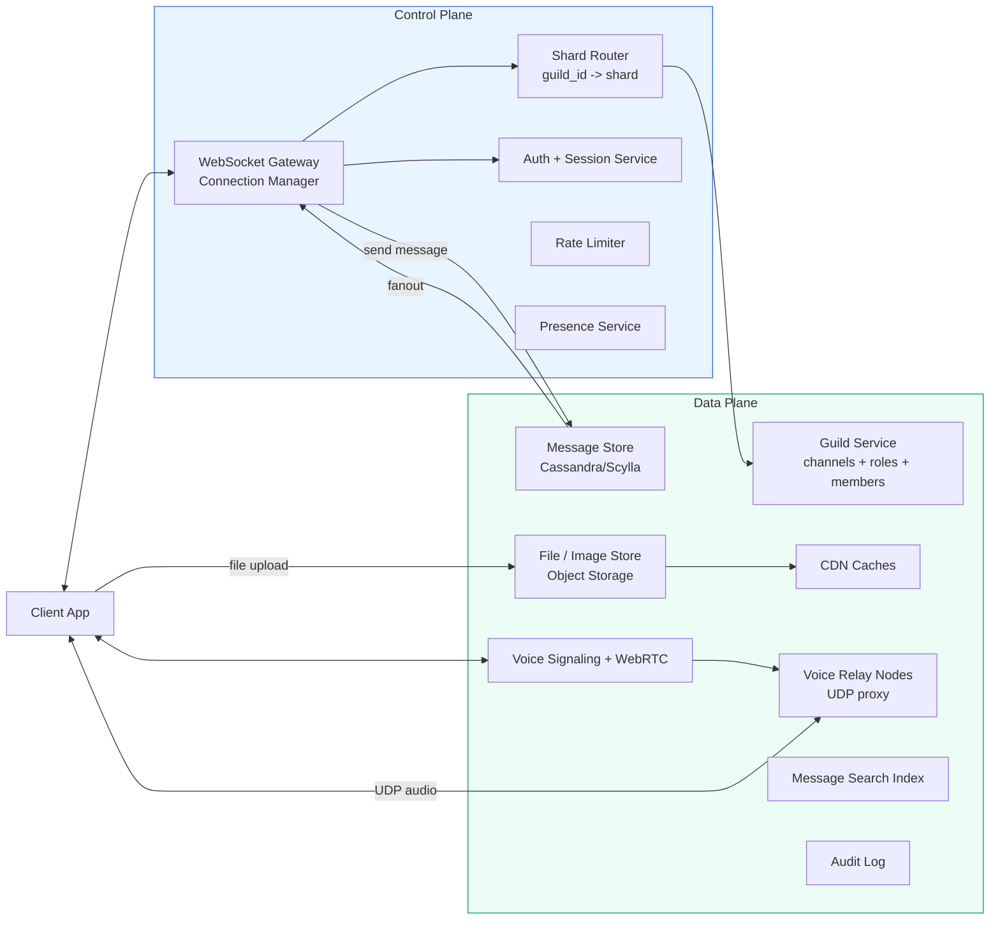
```mermaid
flowchart LR
    Client["Client App"]

    subgraph Control["Control Plane"]
        GW["WebSocket Gateway<br/>Connection Manager"]
        ShardRouter["Shard Router<br/>guild_id -> shard"]
        AuthSvc["Auth + Session Service"]
        RateLimiter["Rate Limiter"]
        Presence["Presence Service"]
    end

    subgraph Data["Data Plane"]
        GuildSvc["Guild Service<br/>channels + roles + members"]
        MessageStore["Message Store<br/>Cassandra/Scylla"]
        FileStore["File / Image Store<br/>Object Storage"]
        CDN["CDN Caches"]
        VoiceSvc["Voice Signaling + WebRTC"]
        VoiceRelay["Voice Relay Nodes<br/>UDP proxy"]
        SearchIndex["Message Search Index"]
        AuditLog["Audit Log"]
    end

    Client <--> GW
    GW --> ShardRouter
    GW --> AuthSvc
    ShardRouter --> GuildSvc
    GW -->|"send message"| MessageStore
    MessageStore -->|"fanout"| GW
    Client -->|"file upload"| FileStore
    FileStore --> CDN
    Client <--> VoiceSvc
    VoiceSvc --> VoiceRelay
    Client <-->|"UDP audio"| VoiceRelay

    style Control fill:#e8f4ff,stroke:#2563eb
    style Data fill:#ecfdf5,stroke:#059669
```

**Critical path: message delivery**

```mermaid
sequenceDiagram
    participant S as Sender
    participant GW as Gateway
    participant M as Message Store
    participant G as Guild Service
    participant R as Recipients

    S->>GW: WebSocket send(channel_id, content)
    GW->>AuthSvc: validate session + permissions
    AuthSvc-->>GW: authorized
    GW->>G: check channel_read_role(role_id)
    G-->>GW: role check result
    GW->>M: INSERT message (channel_id, author, content, timestamp)
    M-->>GW: message_id
    GW-->>S: ack(message_id)

    GW->>G: get_online_members(channel_id)
    G-->>GW: [recipient_gateway_map]

    loop Each online recipient in channel
        GW->>R: push(message_event)
        R-->>GW: delivery_ack
    end

    alt Offline recipients
        GW->>M: mark for offline push
        M->>R: push notification (FCM/APNs)
    end
```

#### 3. Core Component Deep-Dive (Schema definitions, API endpoint definitions, and algorithmic mechanics)

**APIs**

| Endpoint | Method | Purpose |
|---|---|---|
| `/v1/gateway` | WebSocket | Real-time connection |
| `/v1/channels/{id}/messages` | `GET` | Fetch channel history |
| `/v1/channels/{id}/messages` | `POST` | Send message (REST fallback) |
| `/v1/guilds/{id}/channels` | `GET` | Get guild channels |
| `/v1/guilds/{id}/roles` | `GET` | Get guild roles |
| `/v1/users/@me/guilds` | `GET` | User's guild list |
| `/v1/voice/regions` | `GET` | Available voice regions |

**Message schema (Cassandra)**

```cql
CREATE TABLE messages_by_channel (
    channel_id bigint,
    message_id timeuuid,
    author_id bigint,
    content text,
    attachments list<frozen<attachment>>,
    embeds list<frozen<embed>>,
    reply_to_message_id timeuuid,
    created_at timestamp,
    edited_at timestamp,
    PRIMARY KEY (channel_id, message_id)
) WITH CLUSTERING ORDER BY (message_id DESC);

-- Supports pinned messages lookup.
CREATE TABLE pinned_messages (
    channel_id bigint,
    message_id timeuuid,
    pinned_by bigint,
    pinned_at timestamp,
    PRIMARY KEY (channel_id, message_id)
);

-- Supports user's DM list.
CREATE TABLE user_dms (
    user_id bigint,
    channel_id bigint,
    last_message_at timestamp,
    PRIMARY KEY (user_id, channel_id)
) WITH CLUSTERING ORDER BY (channel_id ASC);

-- Supports role-based access.
CREATE TABLE guild_members (
    guild_id bigint,
    user_id bigint,
    role_ids list<bigint>,
    joined_at timestamp,
    nickname text,
    PRIMARY KEY (guild_id, user_id)
);

CREATE TABLE guild_channels (
    guild_id bigint,
    channel_id bigint,
    channel_type int,
    name text,
    position int,
    permission_overwrites map<bigint, int>,
    PRIMARY KEY (guild_id, channel_id)
);
```

**RBAC permission model**

```
Permission bit flags (64-bit integer):
  CREATE_INSTANT_INVITE = 1 << 0
  KICK_MEMBERS          = 1 << 1
  BAN_MEMBERS           = 1 << 2
  MANAGE_CHANNELS       = 1 << 4
  SEND_MESSAGES         = 1 << 11
  MANAGE_MESSAGES       = 1 << 13
  CONNECT               = 1 << 20  -- voice
  SPEAK                 = 1 << 21  -- voice
  MUTE_MEMBERS          = 1 << 22
  ...
```

Permissions are evaluated by combining role permissions, channel-level overwrites, and @everyone / @admin roles using hierarchical precedence rules.

**Algorithmic mechanics**

| Mechanic | Purpose |
|---|---|
| Guild sharding | Each guild assigned to a shard; shard owns all state for that guild |
| WebSocket gateway affinity | Client connected to gateway by hash of session token for sticky routing |
| Voice WebRTC relay | UDP connection via relay nodes to bypass NAT and reduce client-server latency |
| Channel permission check | Bitwise AND of role permissions + channel overwrites, evaluated in O(1) |
| Message fanout | Gateway pushes to all online members in channel subscribed to that shard |
| Read state | Server tracks last_read_message_id per channel per user, stored in Redis |

#### 4. Scaling & Bottleneck Resolutions (Applying lessons from GFS, Dynamo, and Memcached)

**What if...? A single guild with 500K members becomes highly active**

> ⚠️ **Failure mode**
> A large gaming community guild has 500K members, 100K online simultaneously. One channel sees 1,000 messages per second. The shard owning this guild runs out of memory, CPU, or file descriptors. All other guilds on that shard also degrade.

**Walkthrough**

1. A large guild sends messages at 1,000/sec in one channel.
2. The shard processor has to fan-out messages to 100K online members.
3. Message fan-out generates 100M delivery events per second from one shard.
4. Gateway connections on that shard backlog. Heartbeats lag.
5. Client connections time out and reconnect, amplifying load.
6. Other guilds on the same shard experience degraded delivery.

**Mitigation**

| Step | Action |
|---|---|
| 1 | Sub-shard large guilds: split guild state across multiple shards by channel group |
| 2 | Cap fan-out per channel: batch messages and deduplicate for idle members |
| 3 | Ensure no guild exceeds shard capacity: rebalance oversized guilds |
| 4 | Use separate gateway pools for large guilds |
| 5 | Implement per-guild, per-channel rate limiting |

**What if...? Voice relay node failure during peak gaming hours**

> ⚠️ **Failure mode**
> A voice relay node handling 10,000 concurrent voice streams crashes. All connected users drop their calls simultaneously. They reconnect to available relays, causing a flood of connection requests and degrading voice quality across the region.

**Walkthrough**

1. Relay node fails due to hardware or network issue.
2. 10,000 voice sessions disconnect instantly.
3. Clients attempt to reconnect to new relay nodes in the same region.
4. Remaining relays receive 10,000 connection requests within seconds.
5. Relay node CPU spikes as WebRTC ICE negotiations process in parallel.
6. Voice quality degrades for all users on remaining relays.

**Mitigation**

| Step | Action |
|---|---|
| 1 | Over-provision relay capacity per region by 30% |
| 2 | Client-side jitter buffer absorbs brief connection drops |
| 3 | Stagger reconnection using randomized backoff |
| 4 | Route replacement connections to a fresh relay pool before growing existing pools |
| 5 | Voice heartbeat monitoring with proactive failover before hard failure |

**Decision log**

| Decision | Choice | Rationale | Rejected alternative |
|---|---|---|---|
| Message store | Cassandra/Scylla | Horizontally scalable, low-latency writes, no single point of failure | PostgreSQL (vertical scaling limit, harder to shard) |
| Guild state | Sharded in-memory | Sub-millisecond permission and state checks | Database-bound state (latency too high for real-time) |
| WebSocket transport | Persistent TCP with TLS | Reliable ordered delivery for messaging | WebRTC data channel (overhead of ICE for text) |
| Voice transport | UDP WebRTC via relay | Lowest possible latency for real-time audio | TCP-based voice (higher latency, packet loss sensitivity) |
| File storage | Object store + CDN | Keeps large files out of message database | Storing attachments in message rows |
| Push fan-out | Server-initiated WS push | Instant delivery for online users | Pull-only model (latency too high for chat) |

---

### Google Docs / Collaborative Editing

#### 1. Requirements & Bounding (Include clear calculation tables for Storage, QPS, and Bandwidth numbers)

**Functional requirements**

- Multiple users can edit a document simultaneously.
- Edits are synced in near-real-time across all collaborators.
- Users can see other collaborators' cursors and selections.
- Document supports text formatting, images, tables, and comments.
- Revision history allows users to view and restore previous versions.
- Undo/redo must be scoped to the user's own changes.
- Documents can be shared with view or edit permissions.

**Non-functional requirements**

- Edit latency must be under 500 ms for collaborators in the same region.
- Conflict resolution must never lose a user's keystrokes.
- Offline edits must sync when connectivity is restored.
- Revision history must be durable and support point-in-time recovery.
- System must handle 1 billion DAU with documents ranging from 1 KB to 100 MB.
- Collaboration must work across platforms (web, mobile, third-party integrations).

**Assumptions**

| Input | Value |
|---|---:|
| DAU | 1 billion |
| Active documents/day | 500 million |
| Edits/document/minute (active) | 2 |
| Average document size | 50 KB |
| Average edit size (op) | 200 B |
| Revision snapshot interval | Every 50 ops or 5 minutes |
| Active editing sessions (concurrent) | 100 million |
| Collaborators/document (avg) | 2.5 |
| Cursor position (per collaborator) | 50 B |

**Storage**

| Item | Calculation | Result |
|---|---:|---:|---:|
| Daily operations | 500M x 2 x 60 x 24 x 200 B | 288 GB/day |
| Operation log/month | 288 GB x 30 | 8.64 TB/month |
| Operation log/year | 8.64 TB x 12 | ~104 TB/year |
| Revision snapshots/day | 500M / 50 ops x 50 KB | 500 GB/day |
| Revision snapshots/year | 500 GB x 365 | 182.5 TB/year |
| Document metadata | 500M docs x 5 KB | 2.5 TB |
| Comment/annotation storage | 500M x 10 x 1 KB | 5 TB |
| Total storage RF=3 | (104 + 182.5 + 2.5 + 5) x 3 | ~882 TB/year |

**QPS**

| Traffic | Calculation | Average | 20x Peak |
|---|---:|---:|---:|---:|
| Operation submits | 500M x 2 x 60 / 86,400 | ~694K QPS | ~13.9M QPS |
| Operation broadcast | 694K x 2.5 avg collaborators | ~1.74M QPS | ~34.7M QPS |
| Document open requests | 500M / 86,400 | ~5,787 QPS | ~115,740 QPS |
| Cursor presence | 1B x 50 B every 2 sec | ~500M QPS | ~10B QPS |
| Revision history fetch | 5% of opens | ~289 QPS | ~5,787 QPS |
| Comment writes | 10% of document interactions | ~57,870 QPS | ~1.16M QPS |
| Undo/redo operations | 5% of edits | ~34,722 QPS | ~694K QPS |

**Bandwidth**

| Path | Calculation | Average |
|---|---:|---:|---:|
| Op submit ingress | 694K x 200 B | ~139 MB/s |
| Op broadcast egress | 1.74M x 200 B | ~348 MB/s |
| Cursor presence egress | 500M x 50 B | ~25 GB/s |
| Document read (open) | 5,787 x 50 KB | ~289 MB/s |
| Revision snapshot write | 500 GB/day / 86,400 | ~5.8 MB/s |
| Peak op ingress | 13.9M x 200 B | ~2.78 GB/s |

> 📐 **Math check**
> Cursor presence at 500M QPS average (20x peak: 10B QPS) is by far the most demanding number in any of these blueprints. Broadcasting every cursor movement to every collaborator is not feasible beyond small groups. Presence must be throttled: sample cursor updates at 5-10 Hz instead of the native 60+ Hz input rate, batch updates, and send deltas instead of absolute positions.

> 🧠 **Staff-engineer note**
> The fundamental debate in collaborative editing is Operational Transformation (OT) vs CRDT (Conflict-Free Replicated Data Types). OT is proven in production (Google Docs uses OT), but requires a central server to sequence operations. CRDTs work peer-to-peer with no central coordinator but have higher metadata overhead and more complex garbage collection. For a centralized service like Google Docs, OT with a deduplicated operation log is the battle-tested choice.

#### 2. High-Level Architecture (A clear textual map of component placement)

```mermaid
flowchart LR
    ClientA["Collaborator A"]
    ClientB["Collaborator B"]
    ClientC["Collaborator C"]

    subgraph Control["Control Plane"]
        WSEdge["WebSocket Edge Gateway"]
        OpRouter["Operation Router<br/>doc_id -> session"]
        SessionSvc["Session Service<br/>active document map"]
        PresenceSvc["Presence / Cursor Service"]
        ConflictResolver["OT / CRDT Engine<br/>revision + transform"]
        AuthSvc["Auth + Permission Check"]
    end

    subgraph Data["Data Plane"]
        OpLog["Operation Log<br/>ordered per document"]
        DocSnapshot["Document Snapshot Store"]
        RevisionStore["Revision History Store"]
        CommentStore["Comments / Suggestions"]
        DocMetadata["Document Metadata DB"]
    end

    ClientA <--> WSEdge
    ClientB <--> WSEdge
    ClientC <--> WSEdge
    WSEdge --> AuthSvc
    WSEdge --> OpRouter
    OpRouter --> SessionSvc
    WSEdge --> ConflictResolver
    ConflictResolver --> OpLog
    ConflictResolver --> DocSnapshot
    OpLog --> RevisionStore
    RevisionStore --> DocSnapshot
    WSEdge --> PresenceSvc

    style Control fill:#e8f4ff,stroke:#2563eb
    style Data fill:#ecfdf5,stroke:#059669
```

**Critical path: collaborative edit**

```mermaid
sequenceDiagram
    participant A as Collaborator A
    participant E as WebSocket Gateway
    participant OT as OT/CRDT Engine
    participant O as Operation Log
    participant P as Presence
    participant B as Collaborator B

    A->>E: op_insert("hello", position=42, client_version=5)
    E->>OT: apply_op(document_id, op)
    OT->>O: append_op(doc_id, server_version=108, op, client_version=5)
    O-->>OT: server_version=108, ack

    alt Transform needed
        OT->>OT: transform(op, concurrent_ops[105..107])
        Note over OT: Operational transformation resolves<br/>conflicts between concurrent edits
    end

    OT->>DocSnapshot: apply_to_snapshot
    OT-->>E: ack(server_version=108)

    E->>A: ack(server_version=108)
    E->>B: broadcast(op, server_version=108, author_id)
    E->>P: update_cursor(A, position=42)

    B->>E: ack(received_version=108)
    B->>B: apply_to_local(op, transform_local_state)
```

#### 3. Core Component Deep-Dive (Schema definitions, API endpoint definitions, and algorithmic mechanics)

**APIs**

| Endpoint | Method | Purpose |
|---|---|---|
| `/v1/documents/{id}/ws` | WebSocket | Collaborative editing session |
| `/v1/documents` | `POST` | Create document |
| `/v1/documents/{id}` | `GET` | Fetch document metadata |
| `/v1/documents/{id}/revisions` | `GET` | List revision history |
| `/v1/documents/{id}/revisions/{rev}` | `GET` | Get revision snapshot |
| `/v1/documents/{id}/comments` | `GET` | Get comments |
| `/v1/documents/{id}/restore/{rev}` | `POST` | Restore to revision |

**Operation log schema**

```sql
CREATE TABLE operation_log (
    document_id BIGINT NOT NULL,
    server_version BIGINT NOT NULL,
    client_version BIGINT NOT NULL,
    author_id BIGINT NOT NULL,
    op_type VARCHAR(32) NOT NULL,
    op_data JSONB NOT NULL,
    hash CHAR(64) NOT NULL,
    created_at TIMESTAMP NOT NULL,
    PRIMARY KEY (document_id, server_version)
);

-- Supports incremental snapshot rebuild after replay.
CREATE INDEX idx_oplog_doc_created
ON operation_log (document_id, created_at);

CREATE TABLE document_snapshots (
    document_id BIGINT PRIMARY KEY,
    server_version BIGINT NOT NULL,
    content_hash CHAR(64) NOT NULL,
    compressed_snapshot BLOB NOT NULL,
    created_at TIMESTAMP NOT NULL
);

-- Supports point-in-time revision restoration.
CREATE TABLE revision_history (
    revision_id BIGINT PRIMARY KEY,
    document_id BIGINT NOT NULL,
    server_version BIGINT NOT NULL,
    snapshot_version BIGINT NOT NULL,
    author_id BIGINT NOT NULL,
    description TEXT NULL,
    created_at TIMESTAMP NOT NULL,
    FOREIGN KEY (document_id) REFERENCES document_snapshots(document_id)
);

CREATE INDEX idx_revision_doc ON revision_history (document_id, created_at DESC);

CREATE TABLE document_metadata (
    document_id BIGINT PRIMARY KEY,
    title VARCHAR(256) NOT NULL,
    owner_id BIGINT NOT NULL,
    permission_bitfield BIGINT NOT NULL,
    current_version BIGINT NOT NULL,
    created_at TIMESTAMP NOT NULL,
    updated_at TIMESTAMP NOT NULL
);

-- ACL table for shared documents.
CREATE TABLE document_acl (
    document_id BIGINT NOT NULL,
    user_id BIGINT NOT NULL,
    permission VARCHAR(32) NOT NULL,
    PRIMARY KEY (document_id, user_id)
);
```

**OT operation types**

| Op Type | Payload | Example |
|---|---|---|
| `insert` | `{ position, text, attributes }` | Insert "hello" at position 42 with bold |
| `delete` | `{ start, end }` | Delete characters 10-15 |
| `retain` | `{ length, attributes }` | Format existing text bold from 5-12 |
| `format` | `{ start, end, attributes }` | Apply heading style |

**Operational Transformation algorithm**

```
OT Function: insert(op_a, op_b)

Case 1: op_a.insert.pos < op_b.insert.pos
  → op_b.pos += len(op_a.text)
  → Return (op_a, op_b)

Case 2: op_a.insert.pos > op_b.insert.pos
  → op_a.pos += len(op_b.text)
  → Return (op_a, op_b)

Case 3: op_a.insert.pos == op_b.insert.pos
  → Tie-break by author ID (lower ID inserts first)
  → Adjust second op's position accordingly
```

**Algorithmic mechanics**

| Mechanic | Purpose |
|---|---|
| OT with server as sequencer | Central ordering eliminates ambiguity in concurrent operation ordering |
| Revision versions | Server-level version per document; client-level version per collaborator |
| Snapshot with operation log | Periodic snapshots prevent infinite operation replay |
| Undo/redo stack (per user) | Apply counter-operation and track in user-local stack |
| Cursor presence with sampling | Broadcast positions at reduced frequency with interpolation |
| Offline operation queue | Buffer ops locally, submit on reconnection with transformation |

#### 4. Scaling & Bottleneck Resolutions (Applying lessons from GFS, Dynamo, and Memcached)

**What if...? 500 collaborators edit the same paragraph simultaneously**

> ⚠️ **Failure mode**
> A large strategy document is being collectively drafted by a team of 500. All users edit the same paragraph concurrently. The OT engine receives 1,000 ops/second against the same region. Operation transformation latency grows as each op must transform against all concurrent ops in the same version window.

**Walkthrough**

1. Many users type simultaneously into one paragraph.
2. Each op must be transformed against all ops at the current version.
3. Transformation overhead grows O(n²) with concurrent edits.
4. Server processing time per op increases from 1 ms to 50 ms.
5. Clients see high ack latency and visual text jumps.
6. User experience degrades: typing lag, cursor stutter, undo confusion.

**Mitigation**

| Step | Action |
|---|---|
| 1 | Group ops into version buckets; transform batch rather than individually |
| 2 | Implement operational compression: merge adjacent inserts/deletes |
| 3 | Use a layered document model (paragraph-level locking in OT) |
| 4 | Partition document editing into sections; ops within a section transform together |
| 5 | Show co-author presence boundaries to set expectations |

**What if...? Network partition causes OT version divergence**

> ⚠️ **Failure mode**
> A user's network connection drops while offline editing. The user makes 200 edits locally. When reconnecting, the client version (200) has diverged from the server version (500). All 200 ops must be transformed against 300+ server ops that happened in the meantime.

**Walkthrough**

1. User edits offline for 5 minutes.
2. 200 local ops accumulated on the client.
3. Client reconnects and submits ops with client_version=200.
4. Server has advanced to server_version=500.
5. Each submitted op must be transformed against 300 server ops.
6. Replay lag = 200 ops x 300 transforms = 60,000 operations. This blocks the editing session during replay.

**Mitigation**

| Step | Action |
|---|---|
| 1 | Apply transform in bulk by replaying from the last common snapshot |
| 2 | Compute a new snapshot from server state, apply offline ops in order |
| 3 | Fork the document temporarily until offline merge completes |
| 4 | Show "syncing" state with estimated time remaining |
| 5 | Cap offline buffer at reasonable limits (e.g., 500 ops or 30 minutes) |

**Decision log**

| Decision | Choice | Rationale | Rejected alternative |
|---|---|---|---|
| Conflict resolution | OT (Operational Transformation) | Proven in Google Docs; central server sequences ops deterministically | CRDT (no central coordinator needed but higher metadata overhead and GC complexity) |
| Transport | WebSocket with ordered delivery | Bidirectional real-time sync with per-document ordering guarantees | HTTP polling (too slow for collaborative editing) |
| Revision storage | Snapshot + operation log | Efficient history replay without replaying every op | Append-only op log (replay from beginning too expensive) |
| Undo/redo | Per-user undo stack with counter-ops | User-level undo does not affect other collaborators | Document-level undo (undoing another user's changes is wrong) |
| Cursor broadcast | Sampled at 10 Hz with delta encoding | Reduces cursor bandwidth by 95%+ while maintaining smooth appearance | Native input rate broadcast (bandwidth too high at scale) |

---

## 10-Point System Design Evaluation Checklist

- [ ] **Explicit bounding:** Calculates storage, read/write QPS, peak multipliers, and bandwidth before choosing architecture. Example: Live Comments shows why 333 comments/sec becomes ~100 GB/sec if every comment is sent to 1M viewers.
- [ ] **Clear requirements:** Separates functional requirements, non-functional requirements, and consistency boundaries. Example: URL Shortener requires strong uniqueness on create, but analytics can be eventually consistent.
- [ ] **Layered request path:** Places DNS, CDN, L4/L7 load balancers, stateless APIs, caches, queues, and databases coherently. Example: URL redirects go through edge, Redirect API, cache, metadata store, and async analytics queue.
- [ ] **Storage fit:** Chooses SQL, NoSQL, object storage, graph storage, or search indexes based on access patterns. Example: Twitter uses a tweet store, follow graph, Redis timeline refs, search index, and object storage for media.
- [ ] **Cache depth:** Addresses hot keys, stampedes, TTL jitter, negative caching, leases, and emergency cache capacity. Example: URL Shortener handles viral redirect keys with leases, gutter cache, and negative caching for nonexistent codes.
- [ ] **Async decoupling:** Uses queues or logs to isolate slow work, fanout, analytics, indexing, and retries. Example: Twitter writes tweets durably first, then Kafka fanout updates home timelines asynchronously.
- [ ] **Backpressure:** Defines what happens when workers, brokers, databases, or downstream APIs cannot keep up. Example: Web Crawler cools down hosts on 429/403 spikes and enforces host token buckets.
- [ ] **Distributed correctness:** Applies CAP, replication lag handling, vector clocks, idempotency, or leader/lease concepts where relevant. Example: Live Comments stores idempotency keys before moderation so client retries do not create duplicate comments.
- [ ] **Global design:** Explains multi-region routing, replication, CDN/object storage placement, and read-after-write behavior. Example: Live Comments splits a hot room through regional fanout workers and WebSocket gateways.
- [ ] **Graceful degradation:** States exactly what users see during partial failures and how core flows remain available. Example: Twitter returns a partial timeline if celebrity pull queries fail, while marking the response degraded for observability.

---

## Common Interview Mistakes For Each Blueprint

### URL Shortener

- Underestimating hot-key impact when one short link goes viral.
- Forgetting negative caching for nonexistent codes during enumeration attacks.
- Doing click analytics synchronously on the redirect path.
- Treating random code generation as collision-free without a unique constraint.
- Ignoring abuse, expiration, and disabled-link propagation.
- Storing large paste content in the same hot metadata table.

### Web Crawler

- Forgetting robots.txt, per-host politeness, and external harm.
- Using a simple FIFO queue instead of a frontier with priority and `next_fetch_at`.
- Deduplicating only by URL and missing mirrored or near-duplicate content.
- Ignoring canonicalization, tracking parameters, and infinite URL spaces.
- Treating raw page storage as small enough for a normal database.
- Designing search serving and crawl ingestion as one coupled system.

### Twitter Timeline

- Choosing pure fanout-on-write and only discovering celebrity explosion later.
- Choosing pure fanout-on-read and making every home timeline read expensive.
- Storing full tweet bodies in every user's home timeline cache.
- Forgetting fanout lag, replay, and backpressure after Kafka.
- Treating counters, likes, and timelines as strongly consistent when eventual consistency is acceptable.
- Ignoring cache failure and thundering herds on timeline reads.

### Live Comments System

- Multiplying write QPS but forgetting fanout delivery bandwidth.
- Sending every comment to every viewer in a million-viewer room.
- Forgetting idempotency when mobile clients retry comment submissions.
- Keeping recent history only on one WebSocket gateway, making reconnects expensive or lossy.
- Treating moderation as either fully synchronous or fully absent instead of tiered.
- Ignoring slow clients and unbounded gateway send buffers.
