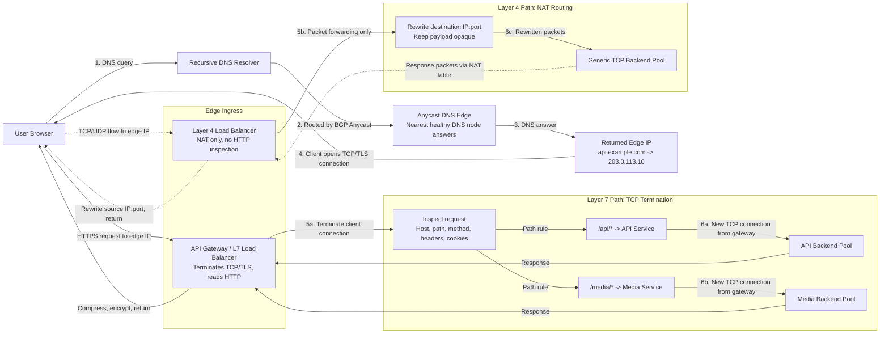

# Module 1: Traffic Routing & Network Foundations

Traffic routing is the front door of a distributed system.

Before a request reaches your application code, it may pass through **DNS**, **Anycast routing**, **CDNs**, **load balancers**, **reverse proxies**, **TLS termination**, **rate limiters**, and **backend connection pools**. Each layer makes a trade-off between **latency**, **cost**, **control**, **security**, and **availability**.

This chapter turns the raw theory into an interview-ready and production-minded foundation for designing systems that survive real traffic.

---

## Learning Goals

By the end of this module, you should be able to:

| Skill | What You Should Be Able To Explain |
|---|---|
| **DNS routing** | How users are directed to the right region or edge location |
| **CDN behavior** | Why push and pull CDNs have different cost, freshness, and origin-load profiles |
| **L4 vs. L7 load balancing** | How packet forwarding differs from request-aware routing |
| **TCP termination** | Why L7 routing requires more CPU and memory than simple L4 NAT |
| **Reverse proxy duties** | How NGINX-style proxies terminate TLS, compress responses, and isolate backends |
| **Edge protection** | How rate limiting blocks abusive traffic before it reaches application servers |
| **Failure modes** | How thundering herds and split-brain failovers take down otherwise healthy systems |

---

## 1. The Request Path: From Browser To Backend

A modern request typically follows this journey:

1. The **browser asks DNS** for the IP address of a domain.
2. DNS routing returns an endpoint based on **Anycast**, **geography**, **latency**, or configured weights.
3. The user connects to an **edge load balancer** or **API gateway**.
4. The edge decides whether to forward packets at **Layer 4** or terminate and inspect the request at **Layer 7**.
5. The request is routed to a backend service.
6. The response may be compressed, cached, encrypted, and returned to the user.

### Native Architecture Diagram



---

## 2. Layer 4 vs. Layer 7 Load Balancing

Load balancers distribute traffic across backend servers. The layer they operate at determines what they can see and what decisions they can make.

### Layer 4: Transport-Level Routing

A **Layer 4 load balancer** operates on TCP or UDP metadata:

- Source IP
- Source port
- Destination IP
- Destination port
- Protocol

It does **not** read HTTP headers, cookies, paths, request bodies, or application messages.

The common implementation model is **Network Address Translation (NAT)**:

1. The client opens a TCP connection to the load balancer IP.
2. The load balancer chooses a backend.
3. It rewrites the packet destination from `LB_IP:443` to `BACKEND_IP:443`.
4. Responses are rewritten in the opposite direction.
5. The packet payload remains opaque.

### Layer 7: Application-Level Routing

A **Layer 7 load balancer** understands application protocols such as HTTP.

It can route based on:

| Routing Signal | Example |
|---|---|
| **Host header** | `api.example.com` vs. `admin.example.com` |
| **URL path** | `/payments/*` vs. `/search/*` |
| **HTTP method** | `GET` vs. `POST` |
| **Cookies** | `session_id=abc123` for sticky sessions |
| **Headers** | `X-Tenant-ID`, `Authorization`, `User-Agent` |
| **Request body** | Usually avoided at the edge unless necessary because it adds latency and memory pressure |

To inspect those fields, the L7 load balancer must first perform **TCP termination**.

---

## 3. TCP Termination: The Core Difference

**TCP termination** means the load balancer ends the client-side TCP connection at itself.

With Layer 7 routing, there is no single end-to-end TCP connection from browser to backend. There are two separate connections:

| Connection | Owned By | Purpose |
|---|---|---|
| **Client -> Load Balancer** | Browser and L7 load balancer | Accept user traffic, terminate TCP/TLS, read HTTP |
| **Load Balancer -> Backend** | L7 load balancer and backend server | Forward the request over a new upstream connection |

### Why L7 Costs More Than L4

Layer 4 NAT is comparatively cheap because it mostly maintains a connection table and rewrites packet headers.

Layer 7 termination requires more work:

| Cost Area | Why It Increases |
|---|---|
| **CPU** | TLS handshakes, encryption/decryption, HTTP parsing, header processing, compression |
| **Memory** | Two connection states, request buffers, response buffers, routing metadata |
| **Latency** | Extra processing before forwarding, plus possible upstream connection setup |
| **Operational complexity** | Certificate management, header trust boundaries, retries, timeouts, observability |

The exact latency impact depends on implementation and hardware. On modern edge infrastructure, the overhead can be small, often in the low milliseconds or less for optimized paths. But it is never free. The trade-off is **more intelligent routing in exchange for more work at the edge**.

### Teaching Analogy: Mailroom vs. Executive Assistant

Use this analogy with junior engineers:

| Load Balancer Type | Analogy | Behavior |
|---|---|---|
| **Layer 4** | Mailroom worker | Looks only at the envelope, keeps it sealed, and forwards it to a destination bin |
| **Layer 7** | Executive assistant | Opens the envelope, reads the message, decides who should handle it, then sends a new message onward |

The mailroom is faster because it does not understand the content. The assistant is slower but can make smarter decisions.

---

## 4. Comparison: L4 vs. L7

| Dimension | Layer 4 Load Balancer | Layer 7 Load Balancer |
|---|---|---|
| **OSI layer** | Transport | Application |
| **Primary data inspected** | IPs and ports | HTTP host, path, headers, cookies, method |
| **Connection model** | Packet forwarding or NAT | TCP/TLS termination plus new backend connection |
| **Protocol awareness** | Protocol-agnostic | Protocol-aware |
| **Typical performance** | Highest throughput, lowest per-request overhead | Lower throughput, richer control |
| **Sticky sessions** | Usually source IP hash | Cookie, header, tenant ID, authenticated identity |
| **Best for** | Generic TCP/UDP, extreme throughput, simple backend pools | APIs, microservices, request-aware routing, edge security |
| **Common products** | LVS, AWS NLB, GCP TCP/UDP LB | NGINX, Envoy, HAProxy HTTP mode, AWS ALB, API gateways |

### Decision Rule

Use **Layer 4** when all backends are interchangeable and performance is the dominant requirement.

Use **Layer 7** when routing decisions require application context.

---

## 5. DNS Routing At The Edge

DNS translates names such as `api.example.com` into IP addresses. Modern DNS also helps decide **which edge location** receives a user.

### DNS Routing Methods

| Method | How It Works | Strength | Risk |
|---|---|---|---|
| **Anycast** | Multiple locations advertise the same IP. BGP routes the user to a nearby network location. | Fast global routing and simple client configuration | BGP changes can shift traffic unexpectedly |
| **Geolocation routing** | DNS answers based on the user's inferred geography | Good for compliance, regionalization, and coarse latency control | IP geolocation can be wrong, especially with VPNs and mobile networks |
| **Latency-based routing** | DNS selects the endpoint with the best measured latency | Better user performance when geography is not enough | Requires accurate health and latency measurements |
| **Weighted routing** | DNS distributes traffic by configured percentages | Useful for migrations, canaries, and regional balancing | DNS caching means the split is approximate |
| **Failover routing** | DNS returns a secondary endpoint when health checks fail | Simple disaster recovery | Failover is limited by DNS TTL and resolver caching |

### TTL: The Hidden Control Knob

**TTL (Time-To-Live)** tells resolvers how long to cache a DNS answer.

| TTL Choice | Benefit | Trade-Off |
|---|---|---|
| **Short TTL** | Faster failover and migrations | More DNS query load and less cache efficiency |
| **Long TTL** | Lower DNS load and stable caching | Slower recovery from bad endpoints |

For changing infrastructure, keep TTLs short. For stable endpoints, longer TTLs reduce DNS overhead.

---

## 6. Content Delivery Networks

A **Content Delivery Network (CDN)** is a distributed network of edge caches that serves content closer to users.

CDNs reduce:

- User-perceived latency
- Origin server load
- Transit bandwidth
- Blast radius during traffic spikes

They are especially useful for:

- Images
- JavaScript bundles
- CSS
- Video segments
- Downloads
- Public HTML pages that can tolerate caching

### Push CDN vs. Pull CDN

| Dimension | Push CDN | Pull CDN |
|---|---|---|
| **How content arrives** | You upload content to the CDN ahead of time | CDN fetches from origin on first request or after expiry |
| **Origin load** | Low after upload | Higher during cache misses and revalidation |
| **First request latency** | Low if already distributed | Higher because the CDN must fetch from origin |
| **Storage cost** | Higher because content is stored whether requested or not | Lower because popular content naturally fills cache |
| **Best fit** | Predictable static assets, software releases, large media libraries | High-traffic sites, unpredictable access, frequently requested content |
| **Cache invalidation** | Explicit upload, purge, or versioning workflow | TTL-driven, purge-driven, or revalidation-driven |

### Practical CDN Strategy For A News Site

A high-traffic news site should usually use a **hybrid strategy**:

| Asset Type | CDN Strategy | TTL | Rationale |
|---|---|---:|---|
| **Article HTML** | Pull CDN | 30 to 300 seconds | Keeps content reasonably fresh while reducing repeated origin hits |
| **Images** | Push or pull with immutable filenames | Hours to days | Images rarely change and can be cached aggressively |
| **CSS and JavaScript** | Push or pull with content-hashed filenames | Months to 1 year | Versioned filenames make long TTLs safe |
| **Breaking news pages** | Pull CDN with purge support | Seconds to minutes | Editors may need fast invalidation |

The key is not "push or pull." The key is matching **cache behavior** to **content volatility**.

---

## 7. Reverse Proxies And Edge Security

A **reverse proxy** sits in front of internal services and presents a controlled public interface.

NGINX, Envoy, HAProxy, and many API gateways can act as reverse proxies.

### Structural Responsibilities

| Responsibility | What It Does | Why It Matters |
|---|---|---|
| **TLS/SSL termination** | Decrypts client HTTPS at the edge | Centralizes certificate management and offloads crypto from app servers |
| **Request routing** | Sends requests to services based on host, path, headers, or cookies | Enables microservice routing without exposing internal topology |
| **Compression** | Applies gzip or Brotli to text responses | Reduces bandwidth and improves perceived latency |
| **Connection pooling** | Reuses upstream connections to backends | Reduces handshake overhead and backend connection churn |
| **Security isolation** | Hides private IPs, ports, and service names | Limits what attackers can directly reach |
| **Request normalization** | Enforces header size, body size, and timeout limits | Blocks malformed or abusive traffic early |
| **Observability** | Emits access logs, latency histograms, and routing metadata | Makes traffic behavior measurable |

### Edge Rate Limiting

**Edge rate limiting** blocks floods before they consume application capacity.

At the edge, a proxy can maintain counters by:

- Source IP
- API key
- User ID
- Tenant ID
- Route
- Country or ASN
- Auth token fingerprint

Common algorithms:

| Algorithm | How It Works | Best For |
|---|---|---|
| **Fixed window** | Counts requests in fixed time buckets | Simple enforcement |
| **Sliding window** | Smooths limits across moving time ranges | Fairer user experience |
| **Token bucket** | Refills tokens over time and spends one per request | Allows controlled bursts |
| **Leaky bucket** | Processes requests at a steady rate | Traffic shaping |

The point is architectural: malicious or accidental floods should be rejected at the edge with `429 Too Many Requests` or blocked before application servers, databases, and queues are forced to do expensive work.

---

## 8. Real-World Failure Modes

### Failure Mode 1: Pull CDN Thundering Herd

A **thundering herd** happens when many clients request the same expired object at nearly the same time.

Example:

1. A celebrity news image goes viral.
2. The CDN caches it for 5 minutes.
3. The TTL expires.
4. A huge number of edge nodes or users request the same asset at once.
5. The CDN treats the object as stale and sends many fetches to the origin.
6. The origin is crushed by redundant requests for the same content.

This is dangerous because the backend may fail even though the content did not change.

#### Mitigations

| Mitigation | How It Helps |
|---|---|
| **Request coalescing / collapsed forwarding** | Only one edge request refreshes the object while others wait |
| **Stale-while-revalidate** | Serve stale content briefly while the CDN refreshes in the background |
| **Soft TTL plus hard TTL** | Refresh proactively before the object fully expires |
| **Cache warming** | Preload viral or predictable assets before traffic arrives |
| **Content-hashed URLs** | Avoid invalidating unchanged assets by naming files after their content |
| **Origin shielding** | Route CDN misses through a smaller set of shield caches before origin |

### Failure Mode 2: Split-Brain In Active-Passive Load Balancers

In an **active-passive** setup, one load balancer owns the virtual IP while the other waits.

They coordinate using a **heartbeat**.

Split-brain occurs when:

1. The active load balancer is still alive.
2. The heartbeat network fails.
3. The passive node stops hearing heartbeats.
4. The passive node assumes the active node is dead.
5. Both nodes try to own the same virtual IP or serve as primary.

The result can be duplicate ownership, inconsistent routing, connection drops, and difficult-to-debug partial outages.

#### Mitigations

| Mitigation | Why It Helps |
|---|---|
| **Quorum or consensus** | Prevents one isolated node from promoting itself incorrectly |
| **Fencing** | Forces the old primary offline before the standby takes over |
| **Independent health checks** | Confirms failure from more than one network path |
| **Redundant heartbeat links** | Reduces false failover due to a single network failure |
| **Active-active architecture** | Avoids single-owner promotion, but adds state and routing complexity |

---

## 9. Production Code Template: Layer 7 Path Router

The following TypeScript template uses Node.js standard HTTP libraries. It demonstrates a conceptual but production-shaped Layer 7 reverse proxy:

- Path-based routing
- Least-outstanding-request backend selection
- Health checks
- Header forwarding
- Timeouts
- Connection accounting
- Graceful shutdown

It is intentionally small enough to study, but structured like infrastructure code you could evolve.

```typescript
/**
 * Layer 7 Reverse Proxy / Request Path Router
 *
 * Runtime: Node.js 18+
 * Dependencies: none
 *
 * This is a teaching-grade production template:
 * - Uses only standard HTTP libraries.
 * - Terminates the client HTTP connection at the proxy.
 * - Opens a separate upstream HTTP connection to the selected backend.
 * - Routes by URL path, which is only possible after reading the HTTP request.
 *
 * In real production, prefer hardened proxies such as Envoy, HAProxy, NGINX,
 * or a managed API gateway. Build your own only when you truly need custom behavior.
 */

import http, { IncomingMessage, ServerResponse } from "node:http";
import { URL } from "node:url";

type Backend = {
  id: string;
  host: string;
  port: number;
  healthy: boolean;
  inFlight: number;
};

type RouteRule = {
  name: string;
  pathPrefix: string;
  backends: Backend[];
};

const routes: RouteRule[] = [
  {
    name: "payments",
    pathPrefix: "/api/payments",
    backends: [
      { id: "payments-a", host: "10.0.10.11", port: 8080, healthy: true, inFlight: 0 },
      { id: "payments-b", host: "10.0.10.12", port: 8080, healthy: true, inFlight: 0 },
    ],
  },
  {
    name: "search",
    pathPrefix: "/api/search",
    backends: [
      { id: "search-a", host: "10.0.20.11", port: 8080, healthy: true, inFlight: 0 },
      { id: "search-b", host: "10.0.20.12", port: 8080, healthy: true, inFlight: 0 },
    ],
  },
  {
    name: "default",
    pathPrefix: "/",
    backends: [
      { id: "app-a", host: "10.0.30.11", port: 8080, healthy: true, inFlight: 0 },
      { id: "app-b", host: "10.0.30.12", port: 8080, healthy: true, inFlight: 0 },
    ],
  },
];

function matchRoute(pathname: string): RouteRule {
  // Longest prefix wins so /api/payments matches before /.
  return routes
    .filter((route) => pathname.startsWith(route.pathPrefix))
    .sort((a, b) => b.pathPrefix.length - a.pathPrefix.length)[0];
}

function selectBackend(route: RouteRule): Backend | null {
  const healthy = route.backends.filter((backend) => backend.healthy);

  if (healthy.length === 0) {
    return null;
  }

  // Least-outstanding-request is simple and effective when request durations vary.
  return healthy.reduce((best, current) =>
    current.inFlight < best.inFlight ? current : best
  );
}

function proxyRequest(clientReq: IncomingMessage, clientRes: ServerResponse): void {
  const requestUrl = new URL(clientReq.url ?? "/", `http://${clientReq.headers.host}`);
  const route = matchRoute(requestUrl.pathname);
  const backend = selectBackend(route);

  if (!backend) {
    clientRes.writeHead(503, { "content-type": "application/json" });
    clientRes.end(JSON.stringify({ error: "No healthy upstreams", route: route.name }));
    return;
  }

  backend.inFlight += 1;

  // Forward standard proxy headers so the backend can recover client context.
  const forwardedFor = [
    clientReq.headers["x-forwarded-for"],
    clientReq.socket.remoteAddress,
  ]
    .filter(Boolean)
    .join(", ");

  const upstreamReq = http.request(
    {
      host: backend.host,
      port: backend.port,
      method: clientReq.method,
      path: clientReq.url,
      timeout: 5_000,
      headers: {
        ...clientReq.headers,
        host: `${backend.host}:${backend.port}`,
        "x-forwarded-for": forwardedFor,
        "x-forwarded-proto": "http",
        "x-forwarded-host": clientReq.headers.host ?? "",
        "x-route-name": route.name,
        "x-upstream-backend": backend.id,
      },
    },
    (upstreamRes) => {
      clientRes.writeHead(upstreamRes.statusCode ?? 502, {
        ...upstreamRes.headers,
        "x-route-name": route.name,
        "x-upstream-backend": backend.id,
      });

      upstreamRes.pipe(clientRes);
      upstreamRes.on("end", () => {
        backend.inFlight -= 1;
      });
    }
  );

  upstreamReq.on("timeout", () => {
    upstreamReq.destroy(new Error("upstream timeout"));
  });

  upstreamReq.on("error", (error) => {
    backend.inFlight = Math.max(0, backend.inFlight - 1);

    // Marking unhealthy on a single error is aggressive. Real systems usually
    // require several failed health checks before ejecting an upstream.
    backend.healthy = false;

    clientRes.writeHead(502, { "content-type": "application/json" });
    clientRes.end(
      JSON.stringify({
        error: "Bad gateway",
        route: route.name,
        backend: backend.id,
        detail: error.message,
      })
    );
  });

  // Stream the client body to the selected backend without buffering the full body in memory.
  clientReq.pipe(upstreamReq);
}

function startHealthChecks(): void {
  setInterval(() => {
    for (const route of routes) {
      for (const backend of route.backends) {
        const req = http.request(
          {
            host: backend.host,
            port: backend.port,
            path: "/healthz",
            method: "GET",
            timeout: 1_000,
          },
          (res) => {
            backend.healthy = (res.statusCode ?? 500) < 500;
            res.resume();
          }
        );

        req.on("timeout", () => req.destroy(new Error("health check timeout")));
        req.on("error", () => {
          backend.healthy = false;
        });
        req.end();
      }
    }
  }, 5_000);
}

const server = http.createServer(proxyRequest);

server.headersTimeout = 10_000;
server.requestTimeout = 30_000;
server.keepAliveTimeout = 5_000;

startHealthChecks();

server.listen(8080, () => {
  console.log("L7 reverse proxy listening on http://0.0.0.0:8080");
});

function shutdown(signal: string): void {
  console.log(`Received ${signal}. Draining connections...`);
  server.close(() => {
    console.log("Proxy stopped.");
    process.exit(0);
  });
}

process.on("SIGINT", shutdown);
process.on("SIGTERM", shutdown);
```

### What This Code Demonstrates

| Concept | Where It Appears |
|---|---|
| **TCP termination** | The proxy receives the client request and creates a new upstream request |
| **L7 routing** | `matchRoute()` routes by URL path |
| **Load balancing** | `selectBackend()` chooses the backend with the fewest active requests |
| **Backend isolation** | Clients never connect directly to `10.0.x.x` services |
| **Operational controls** | Timeouts, health checks, shutdown handling, and forwarding headers |

---

## 10. Design Interview Signals

Strong candidates do not just name components. They explain trade-offs.

| Weak Answer | Strong Answer |
|---|---|
| "Use a load balancer." | "Use L4 if all backends are equivalent and throughput matters most; use L7 if I need host/path/header/cookie-aware routing." |
| "Put a CDN in front." | "Use long TTLs for immutable assets, short TTLs or purge workflows for changing pages, and request coalescing to avoid origin stampedes." |
| "Use active-passive failover." | "Use heartbeats, VIP takeover, redundant heartbeat paths, and fencing to prevent split-brain." |
| "Terminate SSL at the proxy." | "Centralize certificate management, offload crypto, add forwarding headers carefully, and decide whether backend traffic must be re-encrypted." |

---

## Self-Assessment Questions

> **Question 1: TCP Connection Termination in Layer 7 Load Balancing**  
> If you deploy a Layer 7 load balancer to route traffic based on user cookies, describe the exact mechanism that happens to the TCP connection between the client and the backend server compared to a Layer 4 load balancer. What specific advantage does this provide for handling sticky sessions?

> **Question 2: Push vs. Pull CDN for News Websites**  
> You are designing a high-traffic news website where articles are updated sporadically throughout the day, but images are rarely changed. Would you choose a Push CDN or a Pull CDN for this architecture, and how would you configure the TTL for each asset type to balance server load against content staleness? Explain your trade-offs.

> **Question 3: Active-Passive Load Balancer Failover**  
> If you are using an Active-Passive load balancer failover architecture, explain the exact mechanism that triggers the failover from primary to secondary. What is the specific risk regarding downtime during a cold standby versus a hot standby?
<details><summary>Click for FAANG-Level Verification Rubric</summary>

## Question 1: TCP Connection Termination In Layer 7 Load Balancing

A FAANG-level answer must clearly separate **Layer 4 NAT** from **Layer 7 termination**.

### Correct Mechanism

In a **Layer 4 load balancer**, the balancer does not inspect the HTTP request. It forwards packets using transport metadata such as source IP, destination IP, source port, destination port, and protocol. It may rewrite packet headers using NAT, but the payload stays opaque. The balancer does not need to parse cookies because it cannot see application-layer data.

In a **Layer 7 load balancer**, the balancer terminates the client-side TCP connection. If TLS is used, it also terminates TLS, decrypts the request, and reads HTTP fields such as headers, path, method, and cookies. It then opens a separate backend TCP connection to the selected upstream server.

The important detail: **L7 creates two connections**.

| Segment | Description |
|---|---|
| Client to load balancer | The browser believes it is talking to the service endpoint |
| Load balancer to backend | The load balancer becomes the client from the backend's perspective |

### Impact On Latency

TCP termination adds work at the edge. The balancer must manage connection state, parse HTTP, potentially decrypt TLS, apply routing rules, and forward the request on a new upstream connection. That can add latency compared with L4 NAT.

The exact impact depends on implementation, connection reuse, TLS settings, hardware acceleration, and whether upstream connections are already warm. In optimized modern systems, the added overhead can be small, but it is still a real trade-off: **more routing intelligence for more edge processing**.

### Sticky Session Advantage

Layer 4 stickiness is usually based on source IP hashing. That is coarse and can be unfair when many users sit behind the same NAT gateway, corporate proxy, or mobile carrier.

Layer 7 can read cookies. It can route by `session_id`, `user_id`, or another stable application identifier. That allows all requests for the same user session to reach the same backend without overloading one backend just because many users share an IP address.

An excellent answer also mentions that L7 proxies commonly preserve original client context using headers such as `X-Forwarded-For`, `X-Forwarded-Proto`, and `X-Forwarded-Host`.

## Question 2: Push vs. Pull CDN For A News Website

A strong answer should avoid choosing a single CDN mode for everything. The best design is usually **hybrid**.

### Recommended Architecture

Use a **Pull CDN** for article HTML because articles are requested unpredictably and updated throughout the day. The CDN should fetch from the origin on cache miss, then cache for a short TTL.

Use **aggressive caching** for images because they rarely change. This can be a Push CDN workflow or a Pull CDN with immutable, content-hashed URLs and long TTLs.

### TTL Strategy

| Asset | Recommended TTL | Reason |
|---|---:|---|
| Breaking news HTML | 15 to 60 seconds | High freshness requirement |
| Normal article HTML | 60 to 300 seconds | Balance freshness and origin protection |
| Images | Hours to days | Rarely change and expensive to repeatedly serve from origin |
| CSS/JS with hashed filenames | Months to 1 year | Safe because new content gets a new filename |

### Trade-Offs

Short TTLs reduce staleness but increase origin load. Long TTLs reduce load and latency but risk serving stale content.

For a high-traffic news site, the danger is not only cache misses. The danger is synchronized cache expiry. If a viral article expires everywhere at once, the origin may receive a flood of identical revalidation requests.

### Thundering Herd Mitigation

A comprehensive answer should include:

| Technique | Explanation |
|---|---|
| Request coalescing | Let only one request refresh an expired object while others wait |
| Stale-while-revalidate | Serve stale content briefly while refreshing in the background |
| Origin shielding | Route CDN misses through shield caches before origin |
| Soft TTLs | Refresh before hard expiry to avoid synchronized misses |
| Cache warming | Preload predictable high-demand content |
| Content-hashed assets | Avoid purging unchanged images, CSS, and JavaScript |

The best answer connects TTL settings directly to business needs: news freshness, image stability, origin capacity, and user latency.

## Question 3: Active-Passive Load Balancer Failover

A correct answer must describe **heartbeat detection**, **failover promotion**, and **downtime risk**.

### Exact Failover Mechanism

In active-passive failover, the active load balancer owns the virtual IP and serves production traffic. The passive load balancer monitors the active node using heartbeat messages.

Failover occurs when the passive node misses enough heartbeats to conclude that the active node is unavailable. It then promotes itself and takes over the virtual IP. In many environments, this takeover is announced using gratuitous ARP or an equivalent control-plane update so the network begins sending traffic to the new active node.

### Cold Standby Risk

A **cold standby** is not fully ready to serve. It may need to start processes, load configuration, initialize certificates, warm connection pools, rebuild caches, or attach the virtual IP. During that time, users may see connection failures, timeouts, or elevated latency.

The risk is **longer downtime and worse first-request latency** during transition.

### Hot Standby Advantage

A **hot standby** is already running, configured, and often partially synchronized. It can take over faster because the process is alive, certificates are loaded, health checks are active, and backend connections may already be warm.

### Split-Brain Risk

The most dangerous failure mode is split-brain. If the heartbeat path fails but the active load balancer is still alive, the passive node may promote itself incorrectly. Both nodes may believe they are active.

Mitigations include redundant heartbeat networks, quorum, fencing, independent health checks, and careful failover thresholds.

### Rubric

| Level | Expected Answer |
|---|---|
| Beginner | Knows that passive takes over when active fails |
| Intermediate | Explains heartbeat monitoring and cold vs. hot standby |
| FAANG-level | Explains heartbeat thresholds, VIP takeover, downtime sources, split-brain risk, and mitigations |

</details>
