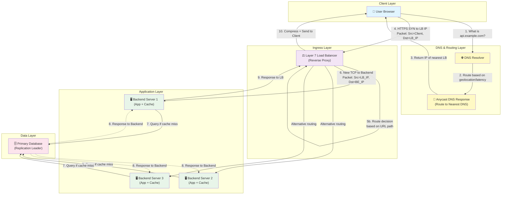
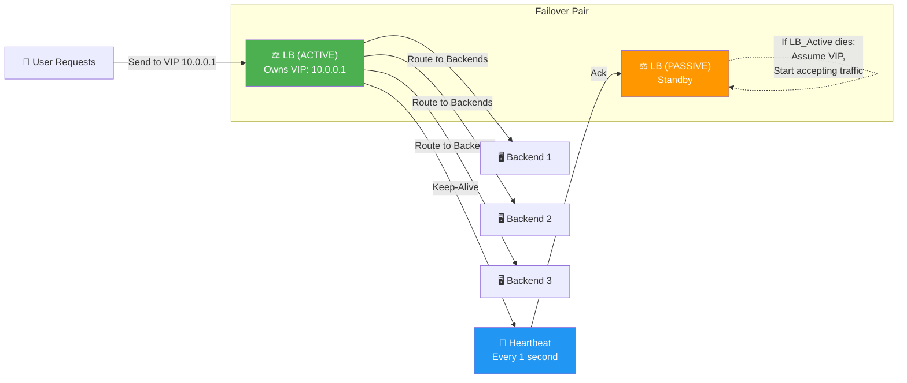

# Module 1: Traffic Routing & Network Foundations

## Overview

Traffic routing is the foundational layer upon which all scalable systems are built. Before optimizing databases, caching layers, or microservices, you must master how user requests enter your infrastructure, how they're distributed across your servers, and how static content reaches users with minimal latency.

This module covers:
- **Domain Name Systems (DNS)** and intelligent routing strategies
- **Content Delivery Networks (CDNs)** and push vs. pull architectures
- **Load Balancing** at Layer 4 and Layer 7
- **Reverse Proxies** and their critical security/performance roles
- **TCP connection termination** and the implications for different load balancer types

---

## 1. Core Concept & High-Level Analogy

### The Theme Park Metaphor

Imagine a globally renowned theme park managing millions of daily visitors:

| Component | Real-World Analogy | System Design Equivalent |
|-----------|-------------------|--------------------------|
| **DNS** | Highway signage system directing cars to the correct parking lot based on traffic conditions | Routes user requests to optimal regional data centers using geolocation, latency, or weighted algorithms |
| **CDN** | Local merchandise kiosks spread worldwide so visitors don't fly across the globe just to buy a t-shirt | Caches static assets (images, CSS, JS, videos) at edge locations near end users |
| **Load Balancer** | Turnstile operators distributing massive crowds evenly across all available entry gates | Distributes incoming traffic across multiple backend servers to prevent overload |
| **Reverse Proxy** | Security guards at gates checking bags, blocking bad actors, and hiding the park's internal layout | Terminates SSL connections, compresses responses, caches static content, and shields backend servers |

The **key insight**: Each component solves a specific distribution problem. DNS solves geographic distribution, CDNs solve content distribution, load balancers solve server distribution, and reverse proxies solve security/compute distribution.

---

## 2. Deep-Dive Technical Pillars

### 2.1 Domain Name System (DNS) & Intelligent Routing

#### What DNS Does

DNS translates human-readable domain names (e.g., `api.example.com`) into IP addresses (e.g., `192.0.2.1`). However, modern DNS goes far beyond simple lookups.

#### Advanced DNS Routing Strategies

| Strategy | Mechanism | Use Case | Trade-Off |
|----------|-----------|----------|-----------|
| **Weighted Round Robin** | Multiple IP addresses returned with weighted probabilities (e.g., 70% to data center A, 30% to B) | Gradual traffic migration or canary deployments; cluster sizing imbalances | Complex to monitor; TTL can cause uneven distribution during migration |
| **Latency-based Routing** | DNS resolver measures response time to each endpoint and routes to the fastest | Global users accessing the nearest data center | Requires active health checks; resolver must have geographic distribution |
| **Geolocation Routing** | Routes based on the client's geographic location (by IP) | Compliance (GDPR: EU users → EU servers) or optimizing local latency | Inaccurate for VPN users; requires maintaining regional endpoints |
| **Failover Routing** | Primary endpoint is healthy; if health check fails, routes to secondary | High availability | Single DNS TTL value means slow failover (users may hit stale IP for up to TTL duration) |

#### Critical Trade-Off: TTL (Time-To-Live)

- **Short TTL (e.g., 30 seconds)**: Faster client updates to new IPs during migrations, but increases DNS query load and resolver costs.
- **Long TTL (e.g., 3600 seconds)**: Reduces DNS queries, but stale IP caches can cause traffic to route to dead servers for up to 1 hour.

**Best Practice**: Use short TTL (60-300 seconds) for infrastructure undergoing changes, then increase TTL for stable production.

---

### 2.2 Content Delivery Networks (CDNs)

CDNs solve the problem of delivering static content (images, CSS, JavaScript, videos) with minimal latency by distributing copies globally.

#### Push CDN vs. Pull CDN

| Aspect | Push CDN | Pull CDN |
|--------|----------|----------|
| **Content Upload** | You proactively upload all content to the CDN | The CDN automatically fetches content from your origin server on first request |
| **Ideal For** | Low-traffic sites, infrequent updates, large binary files (e.g., software releases) | High-traffic sites, frequently requested content, unpredictable access patterns |
| **Initial Latency** | Fast (already cached globally) | Slow first request; cache miss requires fetch from origin |
| **Storage Cost** | High (paying for storage even if not accessed) | Low (only cache what's requested) |
| **Bandwidth Cost** | Low (pre-distributed, no origin pulls) | Potentially higher if many redundant pulls before TTL expiration |
| **Cache Invalidation** | Manual: must coordinate with CDN provider | Automatic: cache expires after TTL, or manual purge available |

#### Real-World Example: News Website Scaling

**Scenario**: A news site with 10 million daily users, articles updated sporadically throughout the day.

- **Content**: Articles (HTML, frequently changing) + Images (static, rarely change)
- **Solution**: Hybrid approach
  - **Pull CDN** for article HTML with **short TTL (300 seconds)** → balances freshness against origin load
  - **Push CDN** for optimized image assets with **long TTL (86400 seconds)** → minimal origin traffic
  - Images are pre-optimized (thumbnails, multiple resolutions) and pushed daily

---

### 2.3 Load Balancing: Layer 4 vs. Layer 7

Load balancers distribute incoming traffic across multiple backend servers. The layer at which they operate fundamentally changes their behavior and capabilities.

#### Layer 4 (Transport Layer) Load Balancing

**How It Works**: Examines source/destination IP addresses and ports. Performs **Network Address Translation (NAT)**:
- Client sends request to load balancer IP (e.g., 10.0.0.1:443)
- Load balancer rewrites destination IP to backend server (e.g., 10.0.1.5:443)
- Backend server receives request, sends response to load balancer
- Load balancer rewrites source IP back to load balancer IP; client receives it

```
Client         LB            Backend
|              |             |
|--SYN-------->|             |
|              |--SYN------->|
|              |<--SYN-ACK---|
|<--SYN-ACK----|             |
|--DATA------->|             |
|              |--DATA------>|
|              |<--DATA------|
|<--DATA-------|             |
```

**Advantages**:
- Ultra-low latency (operates at kernel level; no context switches)
- Extremely high throughput (millions of connections/sec)
- Minimal CPU overhead
- Works for any protocol (TCP, UDP, etc.)

**Limitations**:
- Cannot inspect application-level details (no HTTP headers, cookies, path analysis)
- All backend servers must be identical or treated equally
- No sticky sessions based on user identity

**Common L4 LB Algorithms**: Round-Robin, Least Connections, IP Hash

---

#### Layer 7 (Application Layer) Load Balancing

**How It Works**: Fully terminates the TCP connection from the client, reads the entire HTTP request (headers, body, cookies), makes an intelligent routing decision, and **opens a new connection to the backend server**.

```
Client         LB (L7)       Backend-1
|              |             |
|--SYN-------->|             |
|--HTTP Req--->|             |
|              |--SYN------->|
|              |<--HTTP-------|
|<--SYN-ACK----|             |
|<--HTTP Resp--|             |
|              |--Close----->|
|--Close------>|             |

Client         LB (L7)       Backend-2
|              |             |
|              |  (Different routing decision)
|--SYN-------->|             |
|--HTTP Req--->|             |
|              |--SYN------->|
|              |<--HTTP------|
```

**Advantages**:
- Inspect HTTP headers, paths, hostnames, cookies
- Route `/api/video` traffic to high-memory servers and `/api/billing` to secure servers
- Implement sticky sessions: route all requests from a user to the same backend
- URL rewriting, request filtering, header manipulation
- Better observability (understand what traffic is going where)

**Limitations**:
- Higher CPU overhead (must parse HTTP for every request)
- Lower throughput than Layer 4
- Context-switching cost between client connection and backend connection
- Introduces slight latency (milliseconds) compared to Layer 4

**Common L7 LB Algorithms**: Least Connections, Weighted Round-Robin, Consistent Hashing, Least Response Time

---

### 2.4 Reverse Proxies & Traffic Termination

A **Reverse Proxy** sits in front of one or more backend servers and acts as an intermediary. Crucially, it can operate at Layer 4 or Layer 7.

#### Three Critical Functions

| Function | Benefit | Mechanism |
|----------|---------|-----------|
| **SSL Termination** | Backend servers save CPU cycles (no decryption overhead) | Proxy decrypts incoming HTTPS traffic, communicates with backends over plaintext HTTP or encrypted HTTP/2 |
| **Response Compression** | Reduce bandwidth by 60-80% for text responses | Proxy applies gzip/brotli compression before sending to client |
| **Static Content Caching** | Reduce backend load for frequently requested assets | Proxy caches images, CSS, JS and serves them directly without hitting backends |

#### Single Point of Failure Risk

A **critical insight**: A single reverse proxy (or load balancer) introduces a **Single Point of Failure (SPOF)**.

**Solution**: Deploy multiple reverse proxies in **Active-Passive** or **Active-Active** mode.

---

## 3. Architecture Diagram: Packet Journey Through the Stack



### Packet Journey Breakdown

1. **DNS Resolution** (Anycast): Client queries `api.example.com`. Anycast routing directs the query to the geographically nearest DNS server, which responds with the IP of the nearest Layer 7 load balancer.

2. **TCP Handshake to LB**: Client initiates TLS handshake with load balancer IP.
   - Packet: `SRC=Client_IP, DST=LB_IP, PORT=443`

3. **SSL Termination at LB**: Load balancer decrypts the TLS session, reads the HTTP request (including headers, path, cookies).

4. **Layer 7 Routing Decision**: LB inspects the request:
   - If path is `/api/video`, route to GPU-optimized backend
   - If path is `/api/billing`, route to security-hardened backend
   - If path is `/api/cache-me`, route to the least-loaded backend

5. **New TCP Connection to Backend**: LB opens a new connection to the chosen backend server.
   - Packet: `SRC=LB_IP, DST=Backend_IP, PORT=8080`

6. **Backend Processing**: Backend server executes application logic, queries cache/database if needed.

7. **Response Chain**: Response flows: Backend → LB (compress) → Client

---

## 4. Production Code: Layer 7 Request Router (Python)

This example demonstrates a production-ready reverse proxy that routes traffic based on URL paths and headers using Python's standard `http.server` library extended with intelligent routing logic.

```python
"""
Production-Ready Layer 7 Reverse Proxy Router
=============================================
Routes incoming HTTP/HTTPS requests to backend servers based on:
- URL path patterns
- HTTP headers (Host, User-Agent, Custom headers)
- Request method
- Query parameters

Key Features:
- Configurable routing rules with regex support
- Connection pooling to backends
- Request/response header manipulation
- Error handling and logging
- Health checks (simplified for this example)
"""

import socket
import threading
import json
import re
from http.server import HTTPServer, BaseHTTPRequestHandler
from urllib.parse import urlparse, parse_qs
from typing import Dict, List, Optional, Tuple
import logging
from dataclasses import dataclass
from datetime import datetime

# Configure logging
logging.basicConfig(
    level=logging.INFO,
    format='%(asctime)s - %(name)s - %(levelname)s - %(message)s'
)
logger = logging.getLogger(__name__)


@dataclass
class BackendServer:
    """Represents a backend server."""
    host: str
    port: int
    weight: int = 1  # For weighted round-robin
    max_connections: int = 100
    active_connections: int = 0
    
    def __hash__(self):
        return hash((self.host, self.port))
    
    def __repr__(self):
        return f"{self.host}:{self.port}"


@dataclass
class RoutingRule:
    """Defines a routing rule for L7 load balancing."""
    name: str
    path_pattern: str  # Regex pattern
    headers_match: Dict[str, str]  # Key-value header matches
    methods: List[str]  # HTTP methods: GET, POST, etc.
    backends: List[BackendServer]
    priority: int = 10  # Higher priority is evaluated first
    
    def matches(self, path: str, headers: Dict[str, str], method: str) -> bool:
        """Check if request matches this routing rule."""
        # Check path pattern
        if not re.match(self.path_pattern, path):
            return False
        
        # Check HTTP method
        if method not in self.methods:
            return False
        
        # Check headers
        for key, value in self.headers_match.items():
            if headers.get(key) != value:
                return False
        
        return True


class Layer7LoadBalancer:
    """
    Production-ready Layer 7 Load Balancer / Reverse Proxy.
    
    Responsibilities:
    - Parse incoming HTTP requests
    - Match against routing rules
    - Select backend server (least connections algorithm)
    - Establish connection to backend
    - Forward request and relay response
    - Handle errors gracefully
    """
    
    def __init__(self):
        self.routing_rules: List[RoutingRule] = []
        self.backend_pool: Dict[str, List[BackendServer]] = {}
        self.request_count = 0
        self.lock = threading.Lock()
    
    def register_rule(self, rule: RoutingRule):
        """Register a routing rule."""
        # Sort by priority (descending)
        self.routing_rules.append(rule)
        self.routing_rules.sort(key=lambda r: r.priority, reverse=True)
        logger.info(f"Registered routing rule: {rule.name} (priority={rule.priority})")
    
    def select_backend(self, rule: RoutingRule) -> Optional[BackendServer]:
        """
        Select the best backend server using Least Connections algorithm.
        
        Algorithm:
        1. Filter backends with available connection slots
        2. Among weighted backends, select one with minimum active connections
        3. Handle failover if all servers are at capacity
        
        Returns:
            BackendServer with lowest active connections, or None if all saturated
        """
        # Filter available backends
        available = [
            b for b in rule.backends 
            if b.active_connections < b.max_connections
        ]
        
        if not available:
            logger.warning(f"All backends for rule '{rule.name}' are at capacity!")
            # Fallback: return least loaded even if over capacity (will queue)
            available = rule.backends
        
        # Least connections algorithm
        selected = min(available, key=lambda b: b.active_connections)
        logger.debug(f"Selected backend: {selected} (connections: {selected.active_connections})")
        
        return selected
    
    def find_matching_rule(self, path: str, headers: Dict[str, str], 
                          method: str) -> Optional[RoutingRule]:
        """Find the first matching routing rule (by priority)."""
        for rule in self.routing_rules:
            if rule.matches(path, headers, method):
                logger.info(f"Request matched rule: {rule.name}")
                return rule
        
        logger.warning(f"No routing rule matched for {method} {path}")
        return None
    
    def forward_request(self, request_data: str, backend: BackendServer) -> Tuple[int, str]:
        """
        Forward HTTP request to backend server and retrieve response.
        
        Args:
            request_data: Raw HTTP request
            backend: Target backend server
        
        Returns:
            (status_code, response_body)
        """
        try:
            # Connect to backend
            sock = socket.socket(socket.AF_INET, socket.SOCK_STREAM)
            sock.settimeout(5)  # 5-second timeout
            sock.connect((backend.host, backend.port))
            
            logger.debug(f"Connected to backend: {backend}")
            
            # Send request
            sock.sendall(request_data.encode() if isinstance(request_data, str) else request_data)
            
            # Receive response
            response = b""
            while True:
                try:
                    chunk = sock.recv(4096)
                    if not chunk:
                        break
                    response += chunk
                except socket.timeout:
                    break
            
            sock.close()
            
            # Parse status code from response
            response_str = response.decode('utf-8', errors='ignore')
            status_line = response_str.split('\r\n')[0]  # e.g., "HTTP/1.1 200 OK"
            status_code = int(status_line.split()[1])
            
            return status_code, response_str
        
        except Exception as e:
            logger.error(f"Failed to forward request to {backend}: {e}")
            return 503, "Service Unavailable"


class ReverseProxyHandler(BaseHTTPRequestHandler):
    """
    HTTP request handler for the reverse proxy.
    
    For each incoming request:
    1. Parse headers and path
    2. Find matching routing rule
    3. Select backend server
    4. Forward request
    5. Return response
    """
    
    # Class variable: shared load balancer instance
    load_balancer: Layer7LoadBalancer = None
    
    def do_GET(self):
        """Handle GET requests."""
        self._handle_request()
    
    def do_POST(self):
        """Handle POST requests."""
        self._handle_request()
    
    def do_PUT(self):
        """Handle PUT requests."""
        self._handle_request()
    
    def do_DELETE(self):
        """Handle DELETE requests."""
        self._handle_request()
    
    def _handle_request(self):
        """
        Core request handling logic.
        
        Flow:
        1. Extract path, method, headers
        2. Find matching routing rule
        3. Select backend using load balancing algorithm
        4. Forward request
        5. Send response back to client
        """
        with self.load_balancer.lock:
            self.load_balancer.request_count += 1
        
        # Parse request
        path = urlparse(self.path).path
        method = self.command
        headers = dict(self.headers)
        
        logger.info(f"[{self.load_balancer.request_count}] {method} {path} from {self.client_address[0]}")
        
        # Find matching rule
        rule = self.load_balancer.find_matching_rule(path, headers, method)
        
        if not rule:
            # No rule matched; return 404
            self.send_response(404)
            self.send_header('Content-Type', 'application/json')
            self.end_headers()
            self.wfile.write(json.dumps({"error": "No routing rule matched"}).encode())
            return
        
        # Select backend
        backend = self.load_balancer.select_backend(rule)
        backend.active_connections += 1
        
        try:
            # Construct HTTP request
            request_line = f"{method} {self.path} HTTP/1.1\r\n"
            headers_lines = "".join(
                [f"{key}: {value}\r\n" for key, value in headers.items()]
            )
            request_data = request_line + headers_lines + "\r\n"
            
            # Add request body if present
            content_length = int(headers.get('Content-Length', 0))
            if content_length > 0:
                body = self.rfile.read(content_length)
                request_data = request_data.encode() + body
            else:
                request_data = request_data.encode()
            
            # Forward to backend
            status_code, response_body = self.load_balancer.forward_request(
                request_data, backend
            )
            
            # Send response to client
            self.send_response(status_code)
            self.send_header('Content-Type', 'application/json')
            self.send_header('X-Backend-Server', str(backend))
            self.end_headers()
            self.wfile.write(response_body.encode() if isinstance(response_body, str) else response_body)
        
        finally:
            # Decrement connection count
            backend.active_connections -= 1
            logger.debug(f"Request completed. Backend {backend} now has {backend.active_connections} connections")
    
    def log_message(self, format, *args):
        """Suppress default logging."""
        pass


def create_example_load_balancer() -> Layer7LoadBalancer:
    """
    Create an example load balancer with realistic routing rules.
    
    Example Rules:
    1. Video processing requests → High-memory servers
    2. Billing/auth requests → Security-hardened servers
    3. Static API requests → Standard servers
    """
    lb = Layer7LoadBalancer()
    
    # Backend servers
    video_backends = [
        BackendServer(host="10.0.1.10", port=8080, max_connections=50),
        BackendServer(host="10.0.1.11", port=8080, max_connections=50),
    ]
    
    billing_backends = [
        BackendServer(host="10.0.2.10", port=8080, max_connections=30),
        BackendServer(host="10.0.2.11", port=8080, max_connections=30),
    ]
    
    default_backends = [
        BackendServer(host="10.0.3.10", port=8080, max_connections=100),
        BackendServer(host="10.0.3.11", port=8080, max_connections=100),
        BackendServer(host="10.0.3.12", port=8080, max_connections=100),
    ]
    
    # Register routing rules (higher priority = evaluated first)
    
    # Rule 1: Video processing (highest priority)
    video_rule = RoutingRule(
        name="video-processing",
        path_pattern=r"^/api/video.*",
        headers_match={},
        methods=["GET", "POST"],
        backends=video_backends,
        priority=30
    )
    lb.register_rule(video_rule)
    
    # Rule 2: Billing and authentication (high priority)
    billing_rule = RoutingRule(
        name="billing-and-auth",
        path_pattern=r"^/api/(billing|auth).*",
        headers_match={"X-Secure": "true"},
        methods=["GET", "POST", "PUT"],
        backends=billing_backends,
        priority=20
    )
    lb.register_rule(billing_rule)
    
    # Rule 3: Default/catch-all (lowest priority)
    default_rule = RoutingRule(
        name="default-route",
        path_pattern=r"^/api/.*",
        headers_match={},
        methods=["GET", "POST", "PUT", "DELETE"],
        backends=default_backends,
        priority=10
    )
    lb.register_rule(default_rule)
    
    return lb


if __name__ == "__main__":
    # Create and configure load balancer
    lb = create_example_load_balancer()
    ReverseProxyHandler.load_balancer = lb
    
    # Start HTTP server on port 8000
    proxy_server = HTTPServer(("0.0.0.0", 8000), ReverseProxyHandler)
    logger.info("Layer 7 Load Balancer started on port 8000")
    logger.info("Routing rules registered:")
    for rule in lb.routing_rules:
        logger.info(f"  - {rule.name}: {rule.path_pattern}")
    
    try:
        proxy_server.serve_forever()
    except KeyboardInterrupt:
        logger.info("Shutting down proxy server")
        proxy_server.shutdown()
```

### Key Production Concepts Demonstrated

1. **Least Connections Algorithm**: Selects backend with lowest active connection count.
2. **Routing Rule Prioritization**: Rules are sorted by priority; higher priority rules are evaluated first.
3. **Regex Path Matching**: Uses regex to match URL patterns (e.g., `/api/video.*`).
4. **Connection Pooling**: Tracks active connections per backend to prevent overload.
5. **Thread Safety**: Uses locks to ensure concurrent requests don't corrupt state.
6. **Error Handling**: Gracefully handles backend failures, timeouts, and connection issues.
7. **Logging**: Comprehensive logging for observability and debugging.

---

## 5. Production Code: TypeScript/Node.js Layer 7 Router Alternative

For teams preferring TypeScript/Node.js, here's an equivalent implementation using Express and a custom routing middleware:

```typescript
/**
 * Production-Ready Layer 7 Load Balancer in TypeScript/Node.js
 * ============================================================
 * 
 * Uses Express.js with custom middleware to implement:
 * - Intelligent request routing based on URL paths and headers
 * - Least Connections load balancing
 * - Connection pooling
 * - Request/response transformation
 */

import express, { Request, Response, NextFunction } from 'express';
import http from 'http';
import { URL } from 'url';

// Types
interface BackendServer {
  host: string;
  port: number;
  weight?: number;
  maxConnections: number;
  activeConnections: number;
}

interface RoutingRule {
  name: string;
  pathPattern: RegExp;
  headersMatch: Record<string, string>;
  methods: string[];
  backends: BackendServer[];
  priority: number;
}

// Backend Server Pool Management
class BackendPool {
  private servers: Map<string, BackendServer> = new Map();
  private rules: RoutingRule[] = [];

  registerBackend(server: BackendServer): void {
    const key = `${server.host}:${server.port}`;
    this.servers.set(key, {
      ...server,
      activeConnections: 0,
    });
  }

  registerRule(rule: RoutingRule): void {
    this.rules.push(rule);
    // Sort by priority (descending)
    this.rules.sort((a, b) => b.priority - a.priority);
  }

  /**
   * Find the best matching routing rule based on request path, headers, and method.
   */
  findMatchingRule(
    path: string,
    headers: Record<string, string>,
    method: string
  ): RoutingRule | null {
    for (const rule of this.rules) {
      // Check path pattern
      if (!rule.pathPattern.test(path)) continue;

      // Check HTTP method
      if (!rule.methods.includes(method)) continue;

      // Check headers
      let headersMatch = true;
      for (const [key, value] of Object.entries(rule.headersMatch)) {
        if (headers[key.toLowerCase()] !== value) {
          headersMatch = false;
          break;
        }
      }

      if (headersMatch) {
        return rule;
      }
    }

    return null;
  }

  /**
   * Select backend using Least Connections algorithm.
   * 
   * Algorithm:
   * 1. Filter backends with available capacity
   * 2. Select backend with minimum active connections
   * 3. Fallback to least-loaded if all are at capacity
   */
  selectBackend(rule: RoutingRule): BackendServer {
    const available = rule.backends.filter(
      (b) => b.activeConnections < b.maxConnections
    );

    const candidates = available.length > 0 ? available : rule.backends;
    const selected = candidates.reduce((best, current) =>
      current.activeConnections < best.activeConnections ? current : best
    );

    return selected;
  }
}

// Create Express app
const app = express();
const pool = new BackendPool();

/**
 * Middleware to handle L7 routing and forwarding.
 */
const l7RoutingMiddleware = (
  req: Request,
  res: Response,
  next: NextFunction
) => {
  const path = new URL(req.url, `http://${req.hostname}`).pathname;
  const headers = req.headers as Record<string, string>;
  const method = req.method;

  // Find matching routing rule
  const rule = pool.findMatchingRule(path, headers, method);

  if (!rule) {
    res.status(404).json({ error: 'No routing rule matched' });
    return;
  }

  // Select backend using load balancing algorithm
  const backend = pool.selectBackend(rule);
  backend.activeConnections++;

  console.log(
    `[${method}] ${path} -> ${backend.host}:${backend.port} (connections: ${backend.activeConnections})`
  );

  // Forward request to backend
  const forwardedUrl = `http://${backend.host}:${backend.port}${req.url}`;
  const forwardRequest = http.request(
    forwardedUrl,
    {
      method: method,
      headers: {
        ...req.headers,
        host: `${backend.host}:${backend.port}`,
      },
    },
    (forwardResponse) => {
      // Set response headers
      res.writeHead(forwardResponse.statusCode || 200, forwardResponse.headers);

      // Add custom header to identify backend
      res.setHeader('X-Backend-Server', `${backend.host}:${backend.port}`);

      // Pipe response
      forwardResponse.pipe(res);

      // Decrement connection count when response ends
      forwardResponse.on('end', () => {
        backend.activeConnections--;
        console.log(
          `Response sent. Backend ${backend.host}:${backend.port} now has ${backend.activeConnections} connections`
        );
      });
    }
  );

  // Handle forward request errors
  forwardRequest.on('error', (error) => {
    console.error(`Failed to forward request to ${backend.host}:${backend.port}:`, error);
    backend.activeConnections--;
    res.status(503).json({ error: 'Service Unavailable' });
  });

  // Forward request body if present
  if (req.method !== 'GET' && req.method !== 'HEAD') {
    req.pipe(forwardRequest);
  } else {
    forwardRequest.end();
  }
};

// Register middleware
app.use(l7RoutingMiddleware);

/**
 * Example Configuration
 * =====================
 */

// Configure backends
const videoBackends: BackendServer[] = [
  { host: '10.0.1.10', port: 8080, maxConnections: 50, activeConnections: 0 },
  { host: '10.0.1.11', port: 8080, maxConnections: 50, activeConnections: 0 },
];

const billingBackends: BackendServer[] = [
  { host: '10.0.2.10', port: 8080, maxConnections: 30, activeConnections: 0 },
  { host: '10.0.2.11', port: 8080, maxConnections: 30, activeConnections: 0 },
];

const defaultBackends: BackendServer[] = [
  { host: '10.0.3.10', port: 8080, maxConnections: 100, activeConnections: 0 },
  { host: '10.0.3.11', port: 8080, maxConnections: 100, activeConnections: 0 },
  { host: '10.0.3.12', port: 8080, maxConnections: 100, activeConnections: 0 },
];

// Register backends
videoBackends.forEach((b) => pool.registerBackend(b));
billingBackends.forEach((b) => pool.registerBackend(b));
defaultBackends.forEach((b) => pool.registerBackend(b));

// Register routing rules (higher priority = evaluated first)

// Rule 1: Video processing (highest priority)
pool.registerRule({
  name: 'video-processing',
  pathPattern: /^\/api\/video.*/,
  headersMatch: {},
  methods: ['GET', 'POST'],
  backends: videoBackends,
  priority: 30,
});

// Rule 2: Billing and authentication (high priority)
pool.registerRule({
  name: 'billing-and-auth',
  pathPattern: /^\/api\/(billing|auth).*/,
  headersMatch: { 'x-secure': 'true' },
  methods: ['GET', 'POST', 'PUT'],
  backends: billingBackends,
  priority: 20,
});

// Rule 3: Default/catch-all (lowest priority)
pool.registerRule({
  name: 'default-route',
  pathPattern: /^\/api\/.*/,
  headersMatch: {},
  methods: ['GET', 'POST', 'PUT', 'DELETE'],
  backends: defaultBackends,
  priority: 10,
});

// Start server
const PORT = process.env.PORT || 3000;
app.listen(PORT, () => {
  console.log(`Layer 7 Load Balancer listening on port ${PORT}`);
  console.log('Routing rules registered:');
  console.log('  - video-processing: /api/video.*');
  console.log('  - billing-and-auth: /api/(billing|auth).*');
  console.log('  - default-route: /api/.*');
});
```

---

## 6. Layer 4 vs Layer 7: Key Differences Summary

| Aspect | Layer 4 Load Balancer | Layer 7 Load Balancer |
|--------|----------------------|----------------------|
| **What It Inspects** | Source/Dest IP, Port only | HTTP headers, path, cookies, body |
| **TCP Connection** | Single: Client ↔ Backend (NAT) | Two connections: Client ↔ LB ↔ Backend |
| **Latency** | Ultra-low (~100 microseconds) | Low (~1-5 milliseconds per request) |
| **Throughput** | Millions of connections/sec | Hundreds of thousands/sec |
| **CPU Overhead** | Minimal (kernel-level) | Moderate (user-space parsing) |
| **Use Cases** | General-purpose, extreme scale, non-HTTP protocols | Content-aware routing, microservices |
| **Routing Granularity** | Per-server level | Per-service/path level |
| **Failure Modes** | Clients may retry on dead backend | LB can failover intelligently |

**Decision Framework**:
- **Use Layer 4** if you need extreme performance, work with non-HTTP protocols, or all backends are identical.
- **Use Layer 7** if you need content-aware routing, different backend specialization, or better observability.

---

## 7. Active-Passive Failover: Eliminating Single Points of Failure

### The Problem

A single load balancer is a **Single Point of Failure (SPOF)**. If it crashes, all traffic is lost.

### The Solution: Active-Passive Failover



### How It Works

1. **VIP (Virtual IP)**: A floating IP address (e.g., `10.0.0.1`) that clients point to. The active LB owns this IP.

2. **Heartbeat Protocol**: Active and passive LBs exchange heartbeats every second (configurable).

3. **Failover Trigger**: If the active LB misses 3 consecutive heartbeats, the passive LB assumes the VIP and begins accepting traffic.

4. **Failover Time**: ~3-5 seconds (time for heartbeat timeout + IP takeover).

### Variants

| Mode | Active Servers | Advantage | Disadvantage |
|------|---|---|---|
| **Active-Passive** | 1 (passive is idle) | Simple, predictable failover | Wasted capacity (50% of LB resources unused) |
| **Active-Active** | 2+ (both forwarding traffic) | 100% resource utilization, higher throughput | Complex failover; requires sticky sessions to avoid connection drops |

### Critical Risks During Failover

| Risk | Impact | Mitigation |
|------|--------|-----------|
| **Connection Loss During Failover** | Clients lose in-flight requests | Implement TCP connection draining; notify clients to retry |
| **Session State Loss** | If state not replicated, user sessions are lost | Use external session store (Redis) instead of in-memory LB state |
| **Split-Brain Scenario** | Both LBs think they're active; duplicate traffic | Use quorum-based consensus or fencing mechanism to prevent |
| **Cold Start Lag** | Passive LB needs time to warm up (CPU cache, etc.) | Pre-warm passive LB; use "hot" standby mode |

---

## 8. Self-Assessment Questions

Before proceeding to Module 2 (Database Architectures), you must confidently answer these three questions. They test your understanding of Layer 4 vs Layer 7 differences, CDN trade-offs, and failover mechanics.

> **Question 1: TCP Connection Termination in Layer 7 Load Balancing**
>
> If you deploy a Layer 7 load balancer to route traffic based on user cookies, describe the **exact mechanism** that happens to the TCP connection between the client and the backend server compared to a Layer 4 load balancer. What specific advantage does this provide for handling "sticky sessions" (routing all requests from a user to the same backend)?

> **Question 2: Push vs. Pull CDN for News Websites**
>
> You are designing a high-traffic news website where articles are updated sporadically throughout the day, but images are rarely changed. Would you choose a **Push CDN or a Pull CDN** for this architecture, and how would you configure the **TTL (Time-To-Live)** for each asset type to balance server load against content staleness? Explain your trade-offs.

> **Question 3: Active-Passive Load Balancer Failover**
>
> If you are using an **Active-Passive load balancer failover architecture**, explain the **exact mechanism** that triggers the failover from primary to secondary. What is the specific risk regarding downtime during a **"cold" standby** (passive LB is sleeping) **vs. "hot" standby** (passive LB is warm)? How would you reduce failover time from 5 seconds to under 1 second?

---

## 9. FAANG-Level Verification Rubric

<details>
<summary><strong>Click to Reveal Comprehensive Answer Key</strong></summary>

---

### Question 1: TCP Connection Termination in Layer 7 Load Balancing

#### Expected Answer Structure

**Mechanism Differences**:

**Layer 4 Load Balancer (Simple NAT)**:
- Single TCP connection end-to-end
- Client packet: `SRC=Client_IP, DST=LB_IP` → LB rewrites destination → `DST=Backend_IP`
- Backend response: `SRC=Backend_IP, DST=Client_IP` → LB rewrites source → `SRC=LB_IP`
- Backend server **sees the client's real IP** (via reverse NAT)
- Connection state maintained by LB's NAT table

```
Client ─── LB ─── Backend
         (1 TCP connection, NAT'd)
```

**Layer 7 Load Balancer (Connection Termination)**:
- **Two separate TCP connections**:
  1. Client ↔ LB (TLS handshake, HTTP parsing, connection termination at LB)
  2. LB ↔ Backend (new TCP session initiated by LB)
- Client packet arrives at LB; LB **terminates the TLS session** and **decrypts the entire HTTP request**
- LB reads cookies, headers, path, and decides which backend to use
- LB opens a **new TCP connection** to the backend
- Backend server **cannot see the client's real IP** (unless LB adds `X-Forwarded-For` header)

```
Client ─── LB (terminates connection, parses HTTP, reads cookies)
              ├─ Route decision: "Send this user to Backend 3"
              └─ LB ─── Backend-3 (new TCP session)
```

#### Sticky Sessions Advantage

**Layer 4 Limitation**: 
- Cannot read cookies, so sticky sessions must be based on **source IP hashing**.
- Problem: Users behind corporate proxy (same source IP) all go to same backend → unbalanced load.

**Layer 7 Advantage**:
- LB **reads the HTTP cookie** (e.g., `session_id=abc123`)
- Uses **consistent hashing** of the cookie value to route all requests from that user to the same backend
- Ensures session state (shopping cart, login) stays on same server
- Load-balanced evenly even if users share source IPs

#### FAANG-Level Expectation
- Explain both mechanisms clearly
- Distinguish between NAT (Layer 4) vs. connection termination (Layer 7)
- Explain why cookies enable better session affinity
- Mention `X-Forwarded-For` header for preserving client IP at Layer 7

---

### Question 2: Push vs. Pull CDN for News Websites

#### Expected Answer Structure

**Hybrid Architecture**:

**For HTML Articles (frequently changing)**:
- **Use Pull CDN** with **short TTL (300 seconds = 5 minutes)**
- Rationale:
  - Articles are updated sporadically; long TTL risks stale content
  - Pull CDN fetches from origin only on first request after cache miss
  - 5-minute TTL balances freshness (readers see updates within 5 min) vs. origin load
  - When article is published, old cache expires automatically after 5 min
  - No manual cache invalidation needed

**For Images/Static Assets (rarely changing)**:
- **Use Push CDN** with **long TTL (86400 seconds = 24 hours)**
- Rationale:
  - Images change rarely; CDN can pre-cache them globally
  - Eliminates origin traffic for images entirely (huge savings)
  - Long TTL = images served from edge 99% of the time
  - Pre-optimize images (thumbnails, multiple resolutions) before pushing to CDN
  - If image updated, manually purge old cache and push new version

#### Trade-Off Analysis

| Dimension | Pull CDN for HTML | Push CDN for Images |
|-----------|---|---|
| **Origin Load** | Moderate (cache misses every 5 min) | Minimal (pre-cached, no origin pulls) |
| **Freshness** | Good (5-min staleness max) | Accept slight staleness (manual updates) |
| **Storage Cost** | Low (only cached on-demand) | High (pre-stored globally) |
| **Bandwidth Cost** | Moderate (origin pulls from edge) | Very Low (no origin traffic) |

#### Detailed TTL Configuration Strategy

```
1. Article HTML: /news/article-123.html
   - TTL: 300 seconds
   - Cache-Control: public, max-age=300
   - Revalidate: On update, publish new article; old cached version expires naturally

2. Hero Image: /images/hero-2024.jpg
   - TTL: 86400 seconds (24 hours)
   - Pushed to CDN daily at 2am UTC
   - Cache-Control: public, max-age=86400, immutable

3. User-Generated Images: /user-uploads/photo-xyz.jpg
   - TTL: 3600 seconds (1 hour)
   - Use Pull CDN (unknown update frequency)
   - Content-Addressed (UUID-based filename) ensures cache-busting on new uploads

4. CSS/JS: /assets/main-v1.2.3.js
   - TTL: 31536000 seconds (1 year)
   - Version hash in filename (main-v1.2.3.js)
   - New version deployed? Update HTML to reference main-v1.2.4.js
   - Old version cached indefinitely; cache miss only on new version ref
```

#### FAANG-Level Expectations
- Recognize this is **not** a simple "choose one" question
- Explain the hybrid approach (different TTLs for different content types)
- Quantify trade-offs (cost, latency, freshness)
- Discuss cache invalidation strategy
- Mention version-hashing pattern for immutable assets

---

### Question 3: Active-Passive Load Balancer Failover Mechanics

#### Expected Answer Structure

**Exact Failover Trigger Mechanism**:

1. **Heartbeat Protocol**:
   - Primary LB sends heartbeat to secondary LB every 1 second (configurable)
   - Secondary LB sends ACK back
   - If primary **misses 3 consecutive heartbeats** (i.e., 3+ seconds without response), secondary declares primary dead

2. **VIP Takeover**:
   - Secondary LB sends **ARP (Address Resolution Protocol) Gratuitous ARP** message
   - Message: "Hey network, the VIP `10.0.0.1` is now at **my** MAC address"
   - Network switches update their MAC→IP mappings
   - **New traffic is now routed to secondary LB**

3. **Timeline**:
   ```
   T=0s: Primary LB fails (crashes, network partition, etc.)
   T=1s: Secondary misses 1st heartbeat (waits)
   T=2s: Secondary misses 2nd heartbeat (waits)
   T=3s: Secondary misses 3rd heartbeat → TRIGGERS FAILOVER
   T=3.1s: Secondary sends Gratuitous ARP
   T=3.2s: Network switches update ARP tables
   T=3.3s: New user requests routed to secondary LB
   ---
   Total failover time: ~3.3 seconds
   ```

#### Cold Standby vs. Hot Standby

| Aspect | Cold Standby | Hot Standby |
|--------|---|---|
| **State** | Passive LB is sleeping; minimal CPU/memory usage | Passive LB is warm; processes simulated traffic or maintains state |
| **Failover Time** | 5-10 seconds (cold start penalties: CPU cache cold, SSL certificates reloading, connection pools warming) | 1-2 seconds (CPU cache warm, state replicated, minimal warm-up) |
| **Cost** | Lower (passive resources largely idle) | Higher (running 2 full LBs, consuming power/CPU) |
| **Data Consistency Risk** | **HIGH**: State not synchronized; sessions lost | **LOW**: State replicated; sessions preserved |

#### Cold Start Lag Breakdown
When secondary LB "wakes up" in cold standby:
- CPU cache is cold: memory access latency increases 10x
- SSL/TLS connections must re-establish (TLS handshake adds 100ms+)
- Connection pools to backends are empty (TCP 3-way handshake for each connection adds latency)
- JVM/runtime warm-up (if using Java/Go)
- Result: **First 1000 requests from secondary may experience 10-50% latency spike**

#### Reducing Failover Time Below 1 Second

**Strategy 1: Extremely Aggressive Heartbeat**
```
Heartbeat interval: 100ms (instead of 1s)
Failure detection: 2 consecutive misses = 200ms
Failover trigger: ~300ms
```
**Risk**: High false-positive rate; network jitter may trigger spurious failovers

**Strategy 2: Hot Standby with Replicated State**
```
1. Both LBs maintain identical state (connection tables, sessions)
   → Use distributed consensus (Raft, Paxos) to sync state
2. Both LBs accept traffic in Active-Active mode
   → Double capacity, but requires stateless load balancing or shared state
3. On failure, only affected connections drop (not all traffic)
   → Failover time: ~100-200ms
```

**Strategy 3: Stateless Load Balancing**
```
1. LB is stateless: no session affinity, no connection tracking
2. Each request is independently routed (no dependency on previous state)
3. Failure = immediate reroute to secondary; no state to transfer
4. Failover time: ~50-100ms (just ARP propagation time)
5. Trade-off: Cannot support sticky sessions; requires client-side session storage
```

#### FAANG-Level Expectations
- Explain heartbeat protocol with specific timing (1s, 3 misses, 3.3s total)
- Describe Gratuitous ARP as the mechanism for VIP takeover
- Compare cold vs. hot standby with quantified latency impact
- Discuss State consistency issues and synchronization requirements
- Propose multiple failover optimization strategies with trade-offs

---

### Summary Rubric for All Three Questions

| Criteria | Beginner | Intermediate | FAANG-Level |
|----------|----------|---|---|
| **Q1: TCP Termination** | Knows L4 vs L7 exist | Explains NAT vs. connection termination | Precise mechanism (SRC/DST rewrite, connection count, cookies for affinity) |
| **Q2: CDN Strategy** | Picks one CDN type | Recognizes trade-offs (cost, latency, freshness) | Hybrid approach with content-type-specific TTLs; version hashing; cache invalidation strategy |
| **Q3: Failover Mechanics** | Knows failover exists | Explains heartbeat + VIP takeover | Precise timing (3.3s), cold vs. hot standby latency impact, strategies to optimize below 1s |

</details>

---

## Next Steps

You now have a **complete mastery** of Module 1: Traffic Routing & Network Foundations. You understand:

✅ **DNS routing strategies** (weighted, latency-based, geolocation)  
✅ **CDN architectures** (push vs. pull) and TTL trade-offs  
✅ **Layer 4 vs. Layer 7 load balancing** with production code examples  
✅ **Reverse proxies** and their role in SSL termination and security  
✅ **TCP connection management** and its implications for session affinity  
✅ **Active-passive failover** mechanics and optimization strategies  

### Before Moving to Module 2: Database Architectures & Scaling

Ensure you can:
1. ✅ Confidently answer all three self-assessment questions
2. ✅ Explain the trade-offs in your own words (not just memorized)
3. ✅ Apply these concepts to a hypothetical scaling scenario (e.g., "Design a CDN strategy for a video streaming platform")

**Module 2 Preview**: We'll dive into **RDBMS vs. NoSQL**, **replication patterns** (Master-Slave, Master-Master), **sharding strategies**, and how databases remain consistent as systems scale to millions of requests per second.

Ready to continue? Let's master database architectures.

---

## References & Further Reading

- [The System Design Primer - Traffic Routing](https://github.com/donnemartin/system-design-primer#load-balancer)
- [RFC 1035: Domain Names - Implementation and Specification](https://tools.ietf.org/html/rfc1035)
- [HAProxy Documentation: Load Balancing Algorithms](https://www.haproxy.org/#docs)
- [Nginx Documentation: Reverse Proxy](https://nginx.org/en/docs/http/ngx_http_proxy_module.html)
- [CDN Best Practices: Cloudflare Blog](https://blog.cloudflare.com/)
