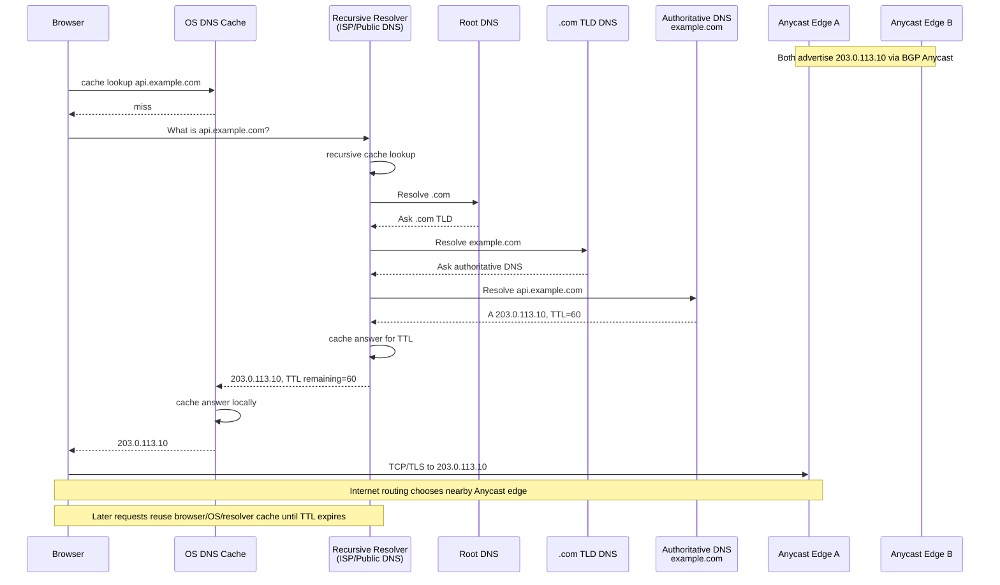
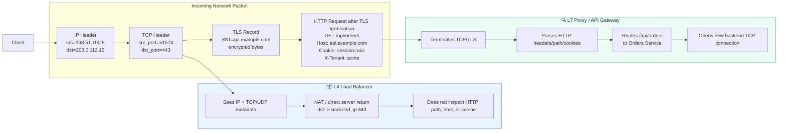
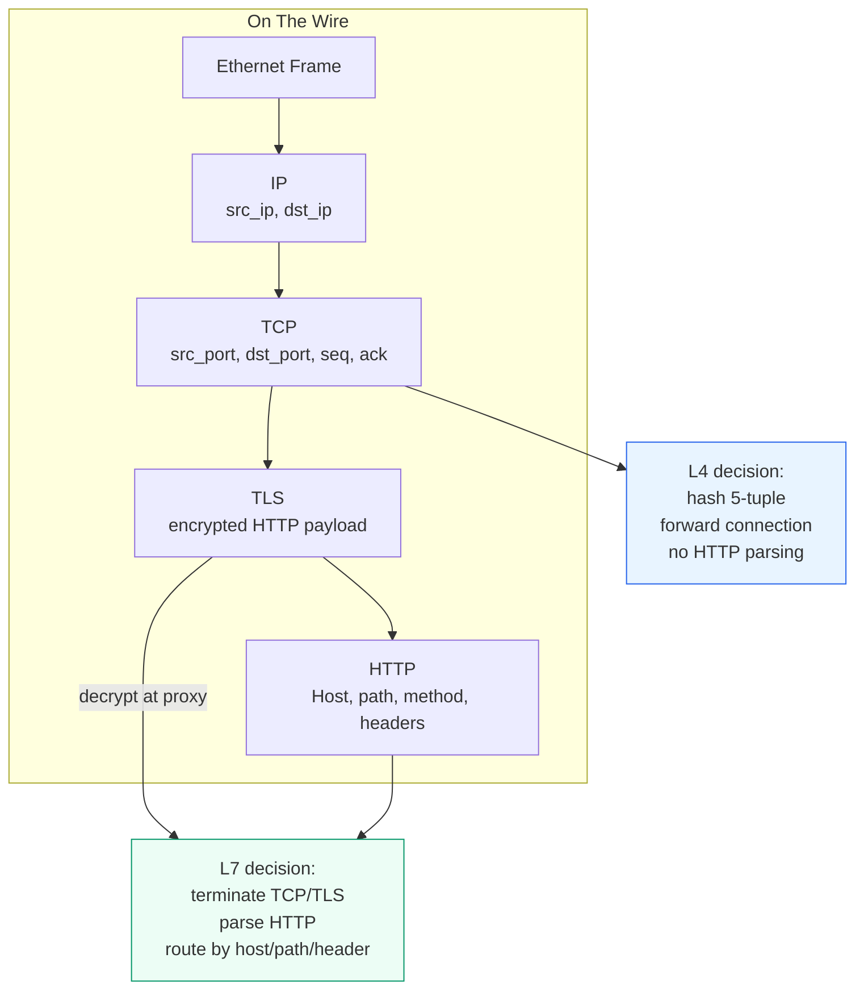
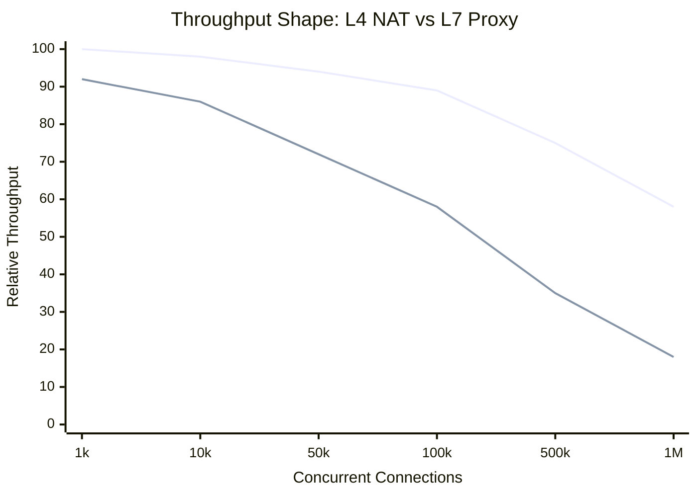
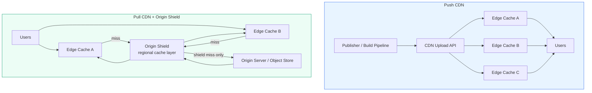
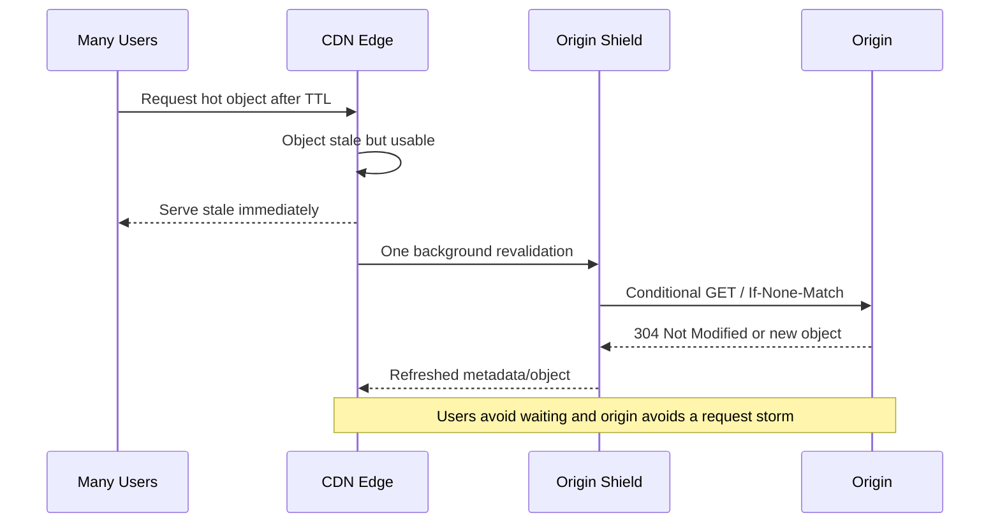
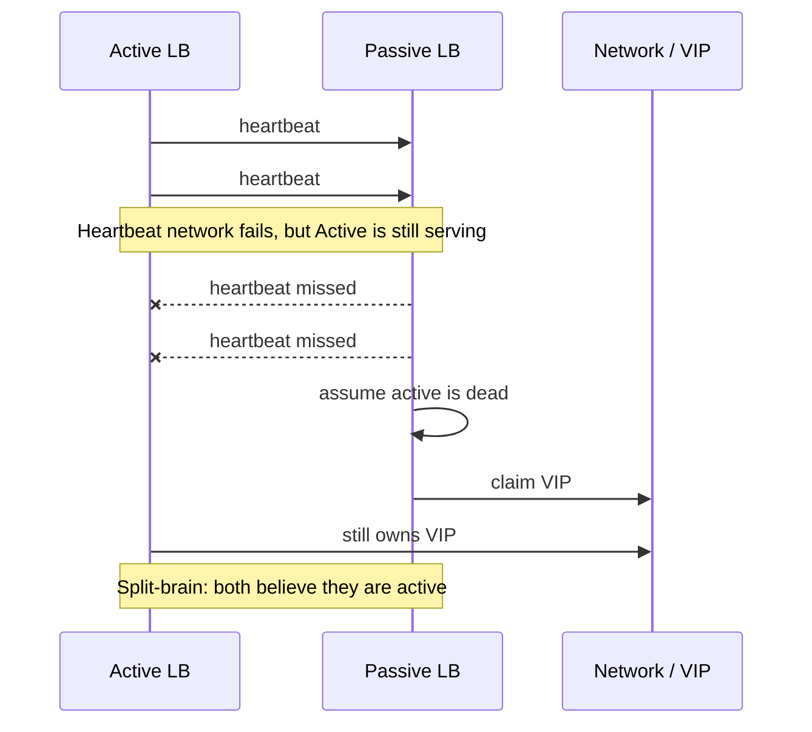
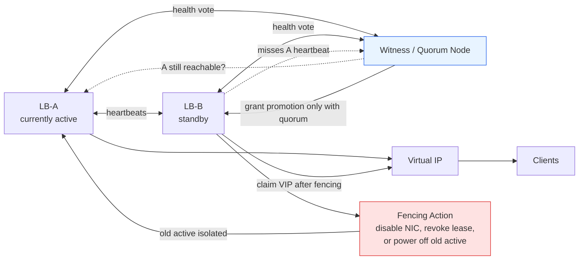

# Module 1: Traffic Routing & Network Foundations

Traffic routing is the front door of a distributed system.

Before a request reaches application code, it may pass through **DNS**, **Anycast routing**, **CDNs**, **L4 load balancers**, **L7 reverse proxies**, **TLS termination**, **rate limiters**, and **backend connection pools**. Each layer trades latency, availability, cost, security, and operational control.

This module is a visual, interview-ready guide to how traffic reaches your system and how edge infrastructure fails under real load.

---

## Visual Glossary

| Icon | Term | Interview Definition |
|---|---|---|
| 🌍 | **Anycast** | One IP advertised from many locations; routing sends users to a nearby healthy edge |
| ⚡ | **CDN** | Distributed cache that serves content close to users and protects origin servers |
| 📦 | **Layer 4** | Transport-level routing using IPs, ports, TCP/UDP metadata |
| 🔍 | **Layer 7** | Application-level routing using HTTP host, path, headers, cookies, body metadata |
| 🔒 | **TLS termination** | Edge decrypts HTTPS, inspects request, and opens a separate backend connection |
| 🚦 | **Rate limiting** | Controls request volume using counters, buckets, quotas, or adaptive policy |

---

## Learning Goals

By the end of this module, you should be able to explain:

| Skill | What You Should Be Able To Teach |
|---|---|
| **DNS resolution** | Recursive resolver, root, TLD, authoritative DNS, TTLs, and Anycast |
| **L4 vs. L7 routing** | Header visibility, TCP termination, NAT, and request-aware routing |
| **CDN strategies** | Push vs. pull, origin shield, stale-while-revalidate, and thundering-herd control |
| **Reverse proxies** | TLS termination, compression, routing, isolation, and observability |
| **Rate limiting** | Token bucket mechanics and edge abuse prevention |
| **Failure modes** | Cache stampedes, split-brain failover, origin overload, and stale data |
| **Interview trade-offs** | When each networking layer is useful and when it is unnecessary |

---

## 1. DNS Resolution And Anycast

DNS translates a name such as `api.example.com` into an address clients can connect to. At scale, DNS is also a traffic steering system.

### DNS Resolution Sequence



### DNS Routing Methods

| Method | How It Works | Strength | Risk |
|---|---|---|---|
| **Anycast** | Many locations advertise the same IP through BGP | Simple global entry point, fast edge routing | Route changes can shift traffic unexpectedly |
| **Geolocation** | DNS answers based on inferred client geography | Compliance and regional routing | VPN/mobile IPs can be inaccurate |
| **Latency-based** | DNS chooses endpoint based on measured latency | Better performance than geography alone | Requires health and latency telemetry |
| **Weighted routing** | DNS distributes traffic by configured weights | Canary, migration, traffic shaping | Resolver caching makes splits approximate |
| **Failover routing** | DNS returns backup endpoint when primary is unhealthy | Simple recovery pattern | Recovery speed limited by TTL and resolver behavior |

> 🧠 **Staff-engineer note**  
> DNS failover is not instant. Even with a short TTL, clients and recursive resolvers may cache answers. For critical services, pair DNS steering with load balancer health checks and client retry behavior.

---

## 2. L4 vs. L7 Packet Flow

The most important interview distinction: **Layer 4 routes connections; Layer 7 routes requests**.

### Two Analogies

**Mailroom vs. executive assistant:** An L4 load balancer is like a mailroom that sorts envelopes by address and room number. It does not open the envelope. An L7 proxy is like an executive assistant who opens the letter, reads the subject, understands the request, and decides which team should handle it.

**Network switch vs. API gateway:** L4 is like a fast network switch with a forwarding table. L7 is like an API gateway with a routing table, auth policy, retry policy, headers, metrics, and per-route rules.

### L4 vs. L7 Header Visibility



### Packet-Level Decision View



### Layer 4: Transport Routing

An L4 load balancer uses:

- Source IP and port.
- Destination IP and port.
- Protocol.
- Connection state.

It usually performs **NAT** or a related packet-forwarding technique. It does not need to decrypt TLS or understand HTTP.

Best fit:

- Extreme throughput.
- Generic TCP/UDP.
- Internal service pools with identical backends.
- Protocols that are not HTTP.

### Layer 7: Application Routing

An L7 load balancer or reverse proxy can use:

- HTTP host.
- URL path.
- Method.
- Headers.
- Cookies.
- Tenant ID.
- Auth context.

Best fit:

- API gateways.
- Microservice routing.
- Header/cookie-based routing.
- WAF, auth, compression, retries, observability.

### Decision Matrix

| Dimension | Layer 4 Load Balancer | Layer 7 Load Balancer |
|---|---|---|
| **Primary data inspected** | IPs, ports, protocol | HTTP host, path, headers, cookies |
| **Connection model** | Packet forwarding/NAT | Client connection terminated, new backend connection |
| **Protocol support** | TCP/UDP and non-HTTP protocols | HTTP/gRPC/WebSocket-aware, depending proxy |
| **Latency overhead** | Lowest | Higher due to parsing/TLS/policy |
| **Throughput ceiling** | Very high | Lower than L4 under equal hardware |
| **Routing intelligence** | Low | High |
| **Sticky sessions** | Usually source IP hash | Cookie/header/session-aware |
| **Use when** | You need speed and simple distribution | You need request-aware control |

---

## 3. TCP/TLS Termination Overhead

**TCP termination** means the proxy ends the client-side connection at itself. If HTTPS is used, the proxy also performs **TLS termination**, decrypts the request, and then opens a separate upstream connection.

### What L7 Adds

| Cost Area | Why It Increases |
|---|---|
| **CPU** | TLS handshake, encryption/decryption, HTTP parsing, compression, policy checks |
| **Memory** | Client connection state, upstream connection state, buffers, routing metadata |
| **Latency** | Parsing and policy work before forwarding; possible upstream connection setup |
| **Operational surface** | Certificates, headers, timeouts, retries, observability, auth, WAF rules |

### Rough Operating Numbers

These are order-of-magnitude interview numbers, not vendor guarantees.

| Item | Rough Range | Notes |
|---|---:|---|
| TCP handshake | 1 network RTT | Avoid with connection reuse |
| TLS 1.3 full handshake | ~1 RTT after TCP, often thousands to tens of thousands of CPU cycles with modern crypto | Depends on cipher, key exchange, hardware, session resumption |
| TLS session resumption | Often 0-1 RTT | Much cheaper than full handshake |
| Idle TCP connection memory | ~10 KB to 100+ KB per connection | Kernel buffers and proxy state vary widely |
| L4 forwarding overhead | Microseconds to low sub-millisecond on optimized paths | Kernel/eBPF/hardware offload can help |
| L7 proxy overhead | Sub-millisecond to several milliseconds | Depends on TLS, filters, body buffering, auth, logging |

> 🧠 **Staff-engineer note**  
> The real killer is often not one request. It is concurrency. One million idle connections at 32 KB each is ~32 GB of memory before application buffers, TLS state, and observability overhead.

> 🧠 **Staff-engineer note: concurrency vs. latency**  
> High concurrency and low latency pull in opposite directions. Keeping 1M idle TLS connections open can consume 32+ GB just for rough connection state at 32 KB each, but aggressively closing idle connections forces new TCP/TLS handshakes and adds RTTs. A strong answer names the knob: tune keep-alive timeouts by client type, reuse upstream pools, enable TLS resumption, and shed slow clients before they exhaust memory.

### Throughput vs. Concurrency Shape



Interpretation: L7 gives more control, but connection state, TLS, parsing, and filters consume more resources as concurrency rises.

---

## 4. CDN Strategies

A CDN serves cacheable content from edge locations close to users. It reduces latency and protects origins.

### Push CDN vs. Pull CDN With Origin Shield



| Dimension | Push CDN | Pull CDN |
|---|---|---|
| **How content arrives** | Uploaded before request | Fetched from origin on miss |
| **First request latency** | Low if pre-distributed | Higher on cold miss |
| **Origin load** | Low after upload | Depends on cache miss and revalidation rate |
| **Storage cost** | Higher for unused assets | Lower because demand fills cache |
| **Invalidation** | Deploy/purge/version workflow | TTL, purge, revalidation |
| **Best for** | Known static assets, releases, game patches | Images, pages, unpredictable demand |

### Thundering Herd: Stale-While-Revalidate

When a hot object expires everywhere at once, many edge nodes can revalidate at the same time. A shield cache and stale serving prevent origin collapse.



> 🧠 **Staff-engineer note**  
> Origin shield and `stale-while-revalidate` are thundering-herd controls, not just cache optimizations. The edge serves a slightly stale object while one shield request refreshes the cache, collapsing thousands of simultaneous misses into one origin validation.

---

## 5. Rate Limiting

Rate limiting is an edge safety mechanism. It protects services from abusive clients, accidental loops, and bursty tenants.

### Token Bucket Timeline

```mermaid
gantt
    title Token Bucket: capacity=5, refill=1 token/sec
    dateFormat X
    axisFormat %Ls

    section Tokens Available
    Start full: milestone, 0, 0
    5 tokens: active, 0, 1
    1 token after burst: active, 1, 2
    0 tokens after partial reject: crit, 2, 3
    Refilling: active, 3, 6

    section Requests
    Burst of 4 allowed: done, 0, 1
    Request of 3: 2 allowed, 1 rejected: crit, 1, 2
    Request of 1 allowed: done, 2, 3
    Request of 2 allowed after refill: done, 5, 6
```

Timeline interpretation:

| Time | Tokens Before Request | Request | Result |
|---:|---:|---:|---|
| 0s | 5 | 4 | 4 allowed, 1 token remains |
| 1s | 2 after refill | 3 | 2 allowed, 1 rejected |
| 2s | 1 after refill | 1 | 1 allowed, bucket empty |
| 5s | 3 after refill | 2 | 2 allowed, 1 token remains |

| Algorithm | Behavior | Best For |
|---|---|---|
| **Fixed window** | Count requests in fixed time buckets | Simple quotas |
| **Sliding window** | Smooths boundary effects | Fair client throttling |
| **Token bucket** | Allows bursts up to bucket capacity | APIs with short bursts |
| **Leaky bucket** | Smooths traffic to steady drain rate | Traffic shaping |

> ⚠️ **Failure mode**  
> Rate limits by source IP can punish many legitimate users behind one NAT. For authenticated APIs, prefer user ID, tenant ID, API key, or token fingerprint as the primary limiter.

---

## 6. Reverse Proxies And Edge Security

A reverse proxy sits in front of internal services and exposes a controlled public interface.

### Responsibilities

| Responsibility | What It Does |
|---|---|
| **TLS termination** | Decrypts client HTTPS and manages certificates centrally |
| **Routing** | Sends traffic based on host, path, headers, cookies |
| **Compression** | Applies gzip/Brotli where useful |
| **Connection pooling** | Reuses backend connections |
| **Security isolation** | Hides internal IPs, ports, and service names |
| **Policy enforcement** | Auth, WAF, rate limits, request size limits |
| **Observability** | Emits access logs, latency histograms, error rates |

### When Not To Use A Reverse Proxy

Reverse proxies are powerful, but they are not free.

Use direct client-to-backend or simpler routing when:

| Scenario | Why A Reverse Proxy May Be Wrong |
|---|---|
| **Internal gRPC with mTLS and service mesh** | Mesh sidecars or client libraries may already handle identity, retries, telemetry |
| **WebRTC media** | Real-time media often needs direct peer/SFU paths; proxying can add latency and jitter |
| **High-throughput binary TCP service** | L7 proxy cannot inspect protocol and only adds overhead |
| **Private batch jobs inside one trusted network** | Direct service discovery plus mTLS may be simpler |
| **Ultra-low-latency trading or telemetry paths** | Every hop and buffer matters |

> 🧠 **Staff-engineer note**  
> The reverse proxy is a control point. If you do not need the control, do not pay the latency, operational, and failure-domain cost.

---

## 7. Real-World Case Studies

### Cloudflare: Anycast + L7 Edge

Cloudflare-style architecture places a reverse-proxy edge close to users, using Anycast routing to attract traffic to nearby locations. At the edge, L7 services can terminate TLS, apply WAF/rate-limit rules, cache content, and proxy to origin.

**Interview takeaway:** Anycast solves the global entry problem; L7 edge logic solves the application policy problem.

### AWS Global Accelerator vs. API Gateway

| Product Shape | Layer Bias | Use Case |
|---|---|---|
| **AWS Global Accelerator** | L4/global networking bias with static anycast IPs | Improve global routing to regional endpoints such as ALB/NLB/EC2 |
| **Amazon API Gateway** | L7 API management | REST/HTTP/WebSocket APIs, auth, throttling, routing to Lambda or HTTP backends |

**Interview takeaway:** Global Accelerator gets clients onto a provider backbone and routes to healthy endpoints. API Gateway understands API requests and policies.

### Fastly/CloudFront-Style CDN: Thundering Herd

Modern CDNs mitigate origin overload using techniques such as:

- Origin shield / tiered cache.
- Request coalescing.
- `stale-while-revalidate`.
- `stale-if-error`.
- Conditional revalidation with ETags.

**Interview takeaway:** The CDN should collapse many edge misses into one origin request.

---

## 8. Production Code Template: L7 Proxy With Metrics And Circuit Breakers

This TypeScript example uses standard Node HTTP primitives plus Prometheus-style metrics via `prom-client`.

```typescript
/**
 * Production-shaped L7 reverse proxy.
 *
 * Features:
 * - Path-based routing
 * - Least-inflight backend selection
 * - Per-backend circuit breaker
 * - Prometheus metrics
 * - Active connection tracking
 * - Graceful draining on shutdown
 *
 * Install:
 *   npm install prom-client
 */

import http, { IncomingMessage, ServerResponse } from "node:http";
import { URL } from "node:url";
import client from "prom-client";

type Backend = {
  id: string;
  host: string;
  port: number;
  inFlight: number;
  failures: number;
  circuitOpenUntil: number;
};

type RouteRule = {
  name: string;
  pathPrefix: string;
  backends: Backend[];
};

const routes: RouteRule[] = [
  {
    name: "orders",
    pathPrefix: "/api/orders",
    backends: [
      { id: "orders-a", host: "10.0.10.11", port: 8080, inFlight: 0, failures: 0, circuitOpenUntil: 0 },
      { id: "orders-b", host: "10.0.10.12", port: 8080, inFlight: 0, failures: 0, circuitOpenUntil: 0 },
    ],
  },
  {
    name: "default",
    pathPrefix: "/",
    backends: [
      { id: "app-a", host: "10.0.20.11", port: 8080, inFlight: 0, failures: 0, circuitOpenUntil: 0 },
      { id: "app-b", host: "10.0.20.12", port: 8080, inFlight: 0, failures: 0, circuitOpenUntil: 0 },
    ],
  },
];

const register = new client.Registry();
client.collectDefaultMetrics({ register });

const requestCount = new client.Counter({
  name: "proxy_requests_total",
  help: "Total requests handled by the proxy",
  labelNames: ["route", "status"],
});

const requestLatency = new client.Histogram({
  name: "proxy_request_duration_seconds",
  help: "Proxy request latency",
  labelNames: ["route", "backend"],
  buckets: [0.005, 0.01, 0.025, 0.05, 0.1, 0.25, 0.5, 1, 2, 5],
});

const activeConnections = new client.Gauge({
  name: "proxy_active_connections",
  help: "Active client connections",
});

register.registerMetric(requestCount);
register.registerMetric(requestLatency);
register.registerMetric(activeConnections);

let draining = false;

function matchRoute(pathname: string): RouteRule {
  return routes
    .filter((route) => pathname.startsWith(route.pathPrefix))
    .sort((a, b) => b.pathPrefix.length - a.pathPrefix.length)[0];
}

function isCircuitOpen(backend: Backend): boolean {
  return Date.now() < backend.circuitOpenUntil;
}

function recordBackendFailure(backend: Backend): void {
  backend.failures += 1;
  if (backend.failures >= 5) {
    backend.circuitOpenUntil = Date.now() + 30_000;
  }
}

function recordBackendSuccess(backend: Backend): void {
  backend.failures = 0;
  backend.circuitOpenUntil = 0;
}

function selectBackend(route: RouteRule): Backend | null {
  const candidates = route.backends.filter((backend) => !isCircuitOpen(backend));
  if (candidates.length === 0) {
    return null;
  }
  return candidates.reduce((best, current) =>
    current.inFlight < best.inFlight ? current : best
  );
}

function proxyRequest(clientReq: IncomingMessage, clientRes: ServerResponse): void {
  if (draining) {
    clientRes.writeHead(503, { "connection": "close" });
    clientRes.end("server draining");
    return;
  }

  if (clientReq.url === "/metrics") {
    register.metrics().then((body) => {
      clientRes.writeHead(200, { "content-type": register.contentType });
      clientRes.end(body);
    });
    return;
  }

  activeConnections.inc();
  clientRes.on("finish", () => activeConnections.dec());

  const requestUrl = new URL(clientReq.url ?? "/", `http://${clientReq.headers.host}`);
  const route = matchRoute(requestUrl.pathname);
  const backend = selectBackend(route);

  if (!backend) {
    requestCount.inc({ route: route.name, status: "503" });
    clientRes.writeHead(503, { "content-type": "application/json" });
    clientRes.end(JSON.stringify({ error: "no healthy upstreams" }));
    return;
  }

  const endTimer = requestLatency.startTimer({ route: route.name, backend: backend.id });
  backend.inFlight += 1;

  const upstreamReq = http.request(
    {
      host: backend.host,
      port: backend.port,
      method: clientReq.method,
      path: clientReq.url,
      timeout: 5_000,
      headers: {
        ...clientReq.headers,
        host: `${backend.host}:${backend.port}`,
        "x-forwarded-for": [clientReq.headers["x-forwarded-for"], clientReq.socket.remoteAddress]
          .filter(Boolean)
          .join(", "),
        "x-forwarded-proto": "http",
        "x-route-name": route.name,
      },
    },
    (upstreamRes) => {
      recordBackendSuccess(backend);
      requestCount.inc({ route: route.name, status: String(upstreamRes.statusCode ?? 502) });

      clientRes.writeHead(upstreamRes.statusCode ?? 502, upstreamRes.headers);
      upstreamRes.pipe(clientRes);
      upstreamRes.on("end", () => {
        backend.inFlight -= 1;
        endTimer();
      });
    }
  );

  upstreamReq.on("timeout", () => {
    upstreamReq.destroy(new Error("upstream timeout"));
  });

  upstreamReq.on("error", () => {
    backend.inFlight = Math.max(0, backend.inFlight - 1);
    recordBackendFailure(backend);
    endTimer();
    requestCount.inc({ route: route.name, status: "502" });

    if (!clientRes.headersSent) {
      clientRes.writeHead(502, { "content-type": "application/json" });
    }
    clientRes.end(JSON.stringify({ error: "bad gateway" }));
  });

  clientReq.pipe(upstreamReq);
}

const server = http.createServer(proxyRequest);

server.keepAliveTimeout = 5_000;
server.headersTimeout = 10_000;
server.requestTimeout = 30_000;

server.listen(8080, () => {
  console.log("proxy listening on http://0.0.0.0:8080");
});

function drain(signal: string): void {
  console.log(`received ${signal}; starting graceful drain`);
  draining = true;

  server.close(() => {
    console.log("all active connections drained");
    process.exit(0);
  });

  setTimeout(() => {
    console.error("drain timeout exceeded; forcing exit");
    process.exit(1);
  }, 30_000).unref();
}

process.on("SIGINT", drain);
process.on("SIGTERM", drain);
```

### Docker Compose: Proxy + Two Backends

This snippet runs the proxy in front of two tiny backend services. In a real repo, place the TypeScript proxy in `proxy.ts`, compile it in the image, and point the backend hosts in the route table at `backend-a` and `backend-b`.

```yaml
version: "3.9"

services:
  proxy:
    image: node:22-alpine
    working_dir: /app
    volumes:
      - .:/app
    command: >
      sh -c "npm install prom-client tsx &&
             npx tsx proxy.ts"
    ports:
      - "8080:8080"
    depends_on:
      - backend-a
      - backend-b

  backend-a:
    image: hashicorp/http-echo:1.0
    command:
      - "-listen=:8080"
      - "-text=hello from backend-a"
    expose:
      - "8080"

  backend-b:
    image: hashicorp/http-echo:1.0
    command:
      - "-listen=:8080"
      - "-text=hello from backend-b"
    expose:
      - "8080"
```

For this Compose topology, the route backends should use:

```typescript
{ id: "backend-a", host: "backend-a", port: 8080, inFlight: 0, failures: 0, circuitOpenUntil: 0 },
{ id: "backend-b", host: "backend-b", port: 8080, inFlight: 0, failures: 0, circuitOpenUntil: 0 },
```

### What To Watch In Production

| Metric | Why It Matters | Interview Signal |
|---|---|---|
| `proxy_requests_total` | Request volume by route and status | Separates backend failures from traffic growth |
| `proxy_request_duration_seconds` | Latency distribution by route/backend | Shows whether one backend is slow or all are slow |
| `proxy_active_connections` | Open client connections | Catches slow clients, leaks, and keep-alive overload |
| Backend `inFlight` | Load per upstream | Lets least-inflight balancing avoid hot backends |
| Circuit state | Whether a backend is temporarily removed | Prevents retry storms against a known-bad upstream |

The circuit breaker here is intentionally simple: after 5 failures, a backend is avoided for 30 seconds. Production breakers usually add half-open probes, rolling error windows, and separate handling for timeouts, `5xx`, and connection failures.

---

## 9. Active-Passive Failover And Split-Brain

In active-passive failover, one load balancer owns a virtual IP while another waits. Heartbeats determine whether the passive node should promote itself.



### Safer Failover With Quorum And Fencing



### Walkthrough

| Step | Bad Split-Brain Behavior | Safer Behavior |
|---:|---|---|
| 1 | Passive misses heartbeats from active | Passive asks witness for quorum |
| 2 | Passive assumes active is dead | Witness checks active from an independent path |
| 3 | Passive claims VIP immediately | Promotion is granted only if quorum agrees |
| 4 | Old active may still serve traffic | Fencing isolates the old active before VIP transfer |
| 5 | Two nodes answer for same VIP | Exactly one node owns the VIP lease |

### Why Fencing Matters

Fencing is the action that makes the old primary unable to keep serving. It can be a cloud control-plane detach, load balancer target deregistration, lease revocation, switch port disable, or power fencing in physical systems.

The interview phrase to remember: **do not promote a new primary until you can prove the old primary cannot still write or serve as primary**.

Mitigations:

- Redundant heartbeat links.
- Quorum or witness node.
- Fencing to ensure the old primary is stopped.
- Conservative failover thresholds.
- Independent health checks from more than one network path.

---

## 10. Interview Scenarios

> **Scenario 1: Your CDN origin is overwhelmed every 60 seconds. Why?**  
> Likely synchronized TTL expiry. Many edge nodes revalidate at the same time. Add TTL jitter, request coalescing, origin shield, stale-while-revalidate, and cache warming for hot objects.

> **Scenario 2: Active-passive LB split-brain just occurred. What do you do?**  
> Fence one node immediately, stabilize VIP ownership, inspect heartbeat network failure, add quorum/witness protection, and review failover thresholds. Prioritize single-writer ownership over fast promotion.

> **Scenario 3: L7 proxy CPU is saturated but L4 metrics look fine. What changes?**  
> Check TLS handshakes, disabled session resumption, header/body buffering, compression, WAF rules, logging volume, and upstream connection reuse. Consider moving simple TCP traffic to L4 or terminating TLS closer to clients.

> **Scenario 4: Users behind one enterprise NAT are rate limited. What changes?**  
> Do not rely only on source IP. Add authenticated user, tenant, API key, or session-aware limit dimensions. Keep IP limits for unauthenticated abuse.

### Whiteboard Question 1: Design Traffic Routing For A Global API

Prompt: Design the request path for `api.example.com` used by customers in North America, Europe, and Asia. The API needs low latency, failover, TLS termination, per-tenant rate limits, and path-based routing to microservices.

| Rubric | Answer Quality |
|---|---|
| **Acceptable** | Uses DNS, CDN or edge POPs, an L7 gateway, regional load balancers, health checks, and backend services. Mentions TLS termination and rate limiting. |
| **Excellent** | Explains Anycast versus DNS steering, resolver TTL limits, regional failover, origin shielding for cacheable paths, L4 vs L7 placement, per-tenant token buckets, observability metrics, and what users see during a regional brownout. |

### Whiteboard Question 2: Debug A Misconfigured L7 Proxy Dropping 50% Of Requests

Prompt: A new L7 proxy deploy is suddenly dropping 50% of requests. L4 load balancer metrics look healthy. How do you debug it?

| Rubric | Answer Quality |
|---|---|
| **Acceptable** | Checks proxy logs, upstream health checks, routing rules, timeouts, TLS/certificate errors, backend availability, and recent config changes. Rolls back if needed. |
| **Excellent** | Splits by route, backend, status code, and proxy instance; checks circuit breaker state, active connections, request body limits, header parsing, keep-alive reuse, retry budget, load balancing algorithm, config canary percentage, and whether one backend pool or path is blackholed. Uses metrics to distinguish dropped before upstream, upstream timeout, and client disconnect. |

### Whiteboard Question 3: Protect A Viral Page From CDN Expiry Herds

Prompt: A celebrity announcement page receives 2M requests/minute. Every 5 minutes, origin CPU spikes and users see high latency. Design the mitigation.

| Rubric | Answer Quality |
|---|---|
| **Acceptable** | Identifies cache expiry stampede, increases TTL, adds CDN caching, and reduces origin load. |
| **Excellent** | Adds origin shield, request coalescing, `stale-while-revalidate`, `stale-if-error`, TTL jitter, conditional revalidation with ETags, cache warming for known launches, and separate purge/versioning strategy so freshness does not require synchronized expiry. |

---

## Self-Assessment Questions

> **Question 1: TCP Connection Termination in Layer 7 Load Balancing**  
> If you deploy a Layer 7 load balancer to route traffic based on user cookies, describe the exact mechanism that happens to the TCP connection between the client and the backend server compared to a Layer 4 load balancer. What specific advantage does this provide for sticky sessions?

> **Question 2: Push vs. Pull CDN for News Websites**  
> You are designing a high-traffic news website where articles are updated throughout the day, but images are rarely changed. Would you choose Push CDN or Pull CDN, and how would you configure TTLs for each asset type?

> **Question 3: Active-Passive Load Balancer Failover**  
> Explain the exact mechanism that triggers failover from primary to secondary. What is the downtime risk of cold standby versus hot standby?

> **Question 4: L4 vs. L7 Product Choice**  
> When would you choose an L4 global accelerator style design over an L7 API gateway style design?

<details><summary>Click for FAANG-Level Verification Rubric</summary>

## Question 1

An L4 load balancer forwards packets using transport metadata and usually NAT. It does not inspect HTTP cookies. An L7 load balancer terminates the client-side TCP/TLS connection, parses HTTP, reads the cookie, makes a routing decision, and opens a separate backend connection.

The sticky-session advantage is that L7 can use a real application identity such as `session_id`, tenant ID, or auth claims rather than coarse source-IP hashing.

## Question 2

Use a hybrid CDN strategy. Article HTML should usually use pull CDN with short TTLs, purge support, and stale-while-revalidate. Images should use long TTLs, content-hashed URLs, and either push or pull distribution. Add origin shield and request coalescing for viral pages.

## Question 3

Failover is triggered by missed heartbeats or failed health checks. A passive node promotes itself and claims the VIP through ARP/control-plane update. Cold standby increases downtime because processes, certificates, caches, and backend pools may need to warm. Hot standby reduces failover time but costs more.

Split-brain risk must be mitigated with quorum, fencing, redundant heartbeats, and independent health checks.

## Question 4

Choose L4 when you need global static anycast entry, TCP/UDP forwarding, very high throughput, and do not need request-aware routing. Choose L7 when you need API policy, auth, path/host routing, request validation, transformation, WAF behavior, or per-route observability.

</details>

---

## References

- [AWS Global Accelerator: How it works](https://docs.aws.amazon.com/global-accelerator/latest/dg/introduction-how-it-works.html)
- [Amazon API Gateway documentation](https://docs.aws.amazon.com/apigateway/)
- [Amazon CloudFront expiration and stale directives](https://docs.aws.amazon.com/AmazonCloudFront/latest/DeveloperGuide/Expiration.html)
- [Amazon CloudFront Origin Shield](https://docs.aws.amazon.com/AmazonCloudFront/latest/DeveloperGuide/origin-shield.html)
- [Cloudflare CDN reference architecture](https://cf-assets.www.cloudflare.com/slt3lc6tev37/18dA4NLfq8oXY8EVZxPlpY/b9cab82be79ebefa80f08c09eaa3d93e/Cloudflare_CDN_Reference_Architecture.pdf)
