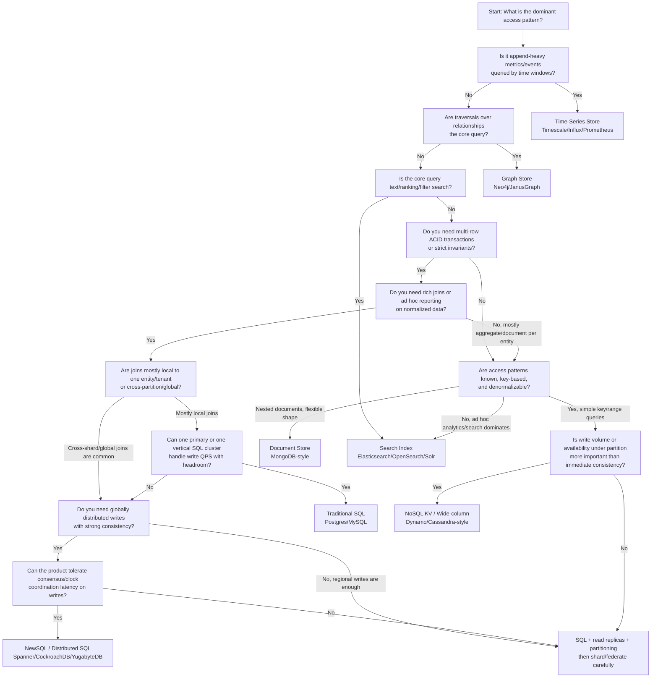
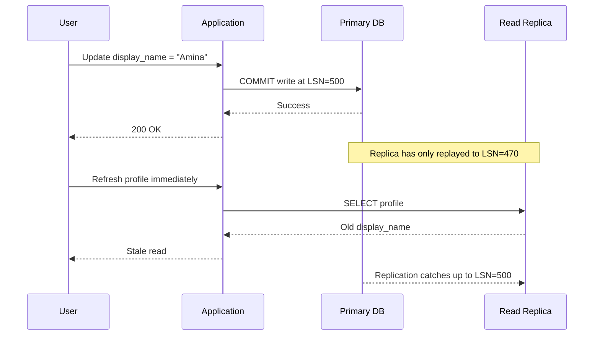
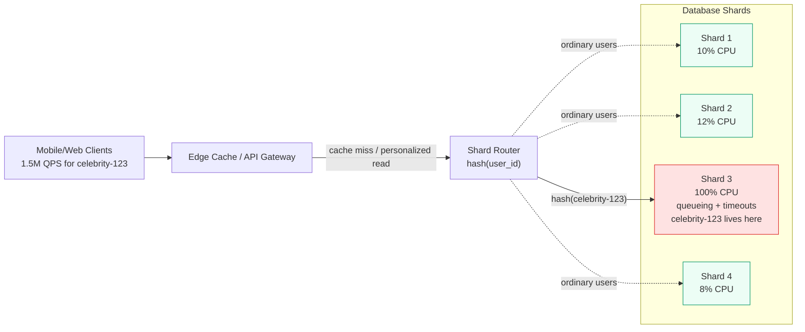
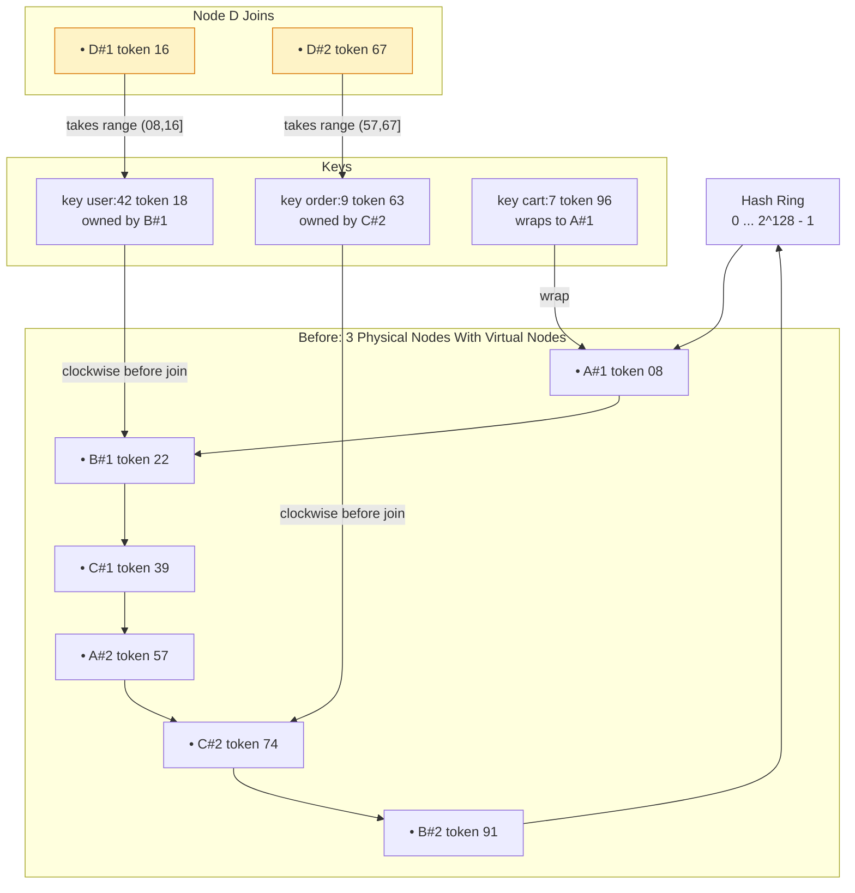
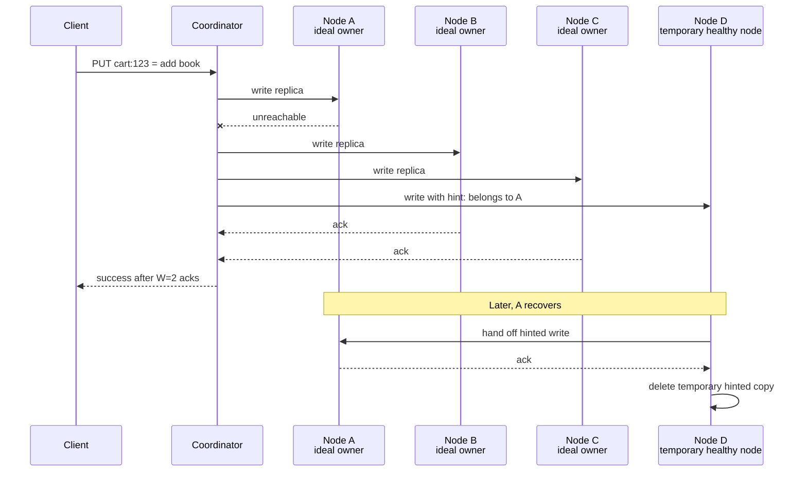
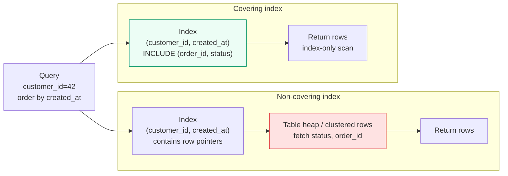

# Module 2: Database Architectures & Scaling

Databases are where system design becomes real.

Stateless services can be cloned. Queues can buffer. Caches can absorb reads. But storage has memory, ordering, ownership, durability, and correctness. Scaling a database means deciding where data lives, how replicas agree, what happens during network partitions, and which invariants cannot be broken.

This module is a definitive reference for distributed storage trade-offs, combining relational scaling, sharding, consistent hashing, Dynamo-style availability, GFS-style separation of control/data planes, and modern hot-partition lessons.

---

## Learning Goals

| Skill | What You Should Be Able To Explain |
|---|---|
| **SQL vs. NoSQL choice** | How consistency, joins, access patterns, and write volume drive storage choice |
| **Replication lag** | Why read replicas can return stale data after a successful write |
| **Sharding** | How shard keys shape query locality, hotspots, and operational complexity |
| **Consistent hashing** | Why virtual nodes reduce rebalancing and smooth ownership |
| **Dynamo-style AP storage** | Sloppy quorum, hinted handoff, vector clocks, and semantic reconciliation |
| **GFS architecture** | Why metadata control and bulk data flow are separated |
| **Hot partition handling** | How poor partition keys and skewed access patterns break otherwise scalable systems |
| **SQL tuning** | How indexing, data types, partitioning, and denormalization affect performance |

---

## 1. Master Decision Tree: Should I Use SQL Or NoSQL?



> 🧠 **Staff-engineer note**  
> The correct database is usually not "SQL vs NoSQL." It is "which invariants must be enforced synchronously, and which views can be rebuilt asynchronously?"

### Decision Questions To Say Out Loud

| Question | Why It Matters | Typical Direction |
|---|---|---|
| Do writes need multi-row invariants? | Determines whether ACID transactions are part of the core data model | SQL or NewSQL |
| Are joins on the hot path? | Cross-shard joins are one of the fastest ways to make a sharded system slow | SQL if local; denormalize or NewSQL if global |
| Is the workload read-heavy, write-heavy, or append-heavy? | Storage engines optimize different write/read shapes | SQL/KV/time-series |
| Can stale reads be tolerated? | Opens up replicas, caches, AP stores, and async materialized views | NoSQL or CQRS-style architecture |
| Is the main query text, graph traversal, or time-window aggregation? | Specialized stores beat general-purpose databases for specialized access patterns | Search, graph, or time-series |
| Can you operate distributed consensus safely? | NewSQL reduces app complexity but increases cluster and latency complexity | NewSQL only when the trade is worth it |

---

## 2. Distributed Storage Reality: CAP And PACELC

In a distributed database, replicas communicate over a network that can drop, delay, duplicate, or reorder packets. During a **network partition**, one replica may be unable to verify whether another replica has accepted a newer write.

| Choice During Partition | Behavior | Trade-Off |
|---|---|---|
| **Consistency over availability** | Refuse or wait until the system can prove the latest value | Correct but may time out |
| **Availability over consistency** | Answer using local state | Responsive but may be stale |

**PACELC** extends the lesson:

- If there is a **Partition**, choose **Availability or Consistency**.
- **Else**, during normal operation, choose **Latency or Consistency**.

---

## 3. Storage Architecture Performance Matrix

| Architecture | Throughput | Write Latency | Data Consistency | Complexity |
|---|---|---|---|---|
| **RDBMS Master-Slave** | High reads via replicas; writes limited by primary | Low to moderate on primary | Strong on primary; replicas can lag | Moderate: failover, read routing |
| **RDBMS Master-Master** | Higher write availability when partitioned by ownership | Higher due to conflict handling or coordination | Hard, concurrent writes may conflict | High: conflict resolution, split-brain risk |
| **Federation** | Good when domains scale independently | Local to one functional database | Strong within domain, weaker across domains | High: cross-domain workflows |
| **Sharding** | High if shard key distributes load | Low for single-shard writes, high for cross-shard writes | Strong within shard, hard across shards | Very high: routing, rebalancing, hotspots |
| **NoSQL / Dynamo-style** | Very high horizontal throughput | Low when accepting local/quorum writes | Eventual or tunable consistency | High: reconciliation and data modeling |
| **NewSQL** | High horizontal scale for SQL workloads | Higher than local SQL due to consensus/clock coordination | Strong distributed transactions | High: operational and latency complexity |

**NewSQL difference:** systems such as Spanner and CockroachDB aim to preserve SQL and ACID semantics across distributed nodes, usually by using consensus and carefully managed replication. They reduce application-level sharding pain, but coordination latency is still real.

### NewSQL Comparison: Spanner/CockroachDB vs. SQL vs. NoSQL

NewSQL is best understood as a trade: you keep SQL and strong transactions across nodes, but you pay for distributed coordination. It is not "SQL, but magically infinite."

| Dimension | Traditional SQL | NewSQL / Distributed SQL | NoSQL / Dynamo-Style |
|---|---|---|---|
| **ACID guarantees** | Strong inside one primary/cluster; cross-shard transactions are hard | Strong distributed transactions across ranges/replicas | Usually per-item or per-partition; app handles conflicts |
| **Global writes latency** | Low in one region; high or awkward across regions | Higher because consensus/clock coordination crosses replicas | Low if accepting local/quorum writes with eventual convergence |
| **Rebalancing ease** | Manual partitioning/sharding unless managed service helps | Automatic range movement is a core feature | Often automatic token/range ownership, but data model still matters |
| **Operational complexity** | Familiar, but failover and sharding are painful at scale | Complex consensus, placement, clock, and topology operations | Complex reconciliation, repair, compaction, and access-pattern modeling |
| **Join support** | Excellent before sharding; cross-shard joins degrade | SQL joins exist, but distributed joins can be expensive | Usually avoided; denormalize for query paths |
| **Best fit** | OLTP apps with clear relational model and moderate write scale | Strongly consistent multi-region business data | High-scale key-based access and availability under partitions |

Interview phrasing: choose NewSQL when distributed transactions are central to the product and the team accepts write latency and operational complexity. Choose NoSQL when availability and write scale matter more than immediate global consistency. Choose traditional SQL when the relational model fits and a single primary or carefully partitioned deployment is enough.

---

## 4. Replication Lag And Read-After-Write Bugs

Master-slave replication scales reads by copying primary writes to read replicas. The cost is **replication lag**.



### Mitigations

| Technique | How It Works |
|---|---|
| **Read own writes from primary** | For a short window after writes, route that user's reads to primary |
| **Version token / LSN token** | Client carries last committed version; router chooses only caught-up replicas |
| **Replica lag tracking** | Remove lagging replicas from read pool |
| **Session consistency** | Keep user reads on a replica known to have observed the write |
| **Synchronous replication** | Wait for replicas before acking, trading latency for consistency |

---

## 5. Data Modeling For Sharding

Sharding is not just splitting rows. It is choosing the ownership model for your data.

### Common Shard Keys

| Shard Key | Good For | Risk |
|---|---|---|
| **user_id** | User-owned profiles, posts, settings, timelines | Celebrity or enterprise users can become hot |
| **tenant_id** | B2B SaaS isolation and billing ownership | Large tenants can dominate one shard |
| **geo_region** | Compliance, latency, regional data boundaries | Poor distribution for global products |
| **object_id hash** | Even distribution for independent objects | Cross-object queries become expensive |
| **time bucket** | Logs, events, metrics, retention windows | Current bucket can become hot |
| **composite key** | `tenant_id + hash(entity_id)` balances locality and spread | Query routing is more complex |

### How To Choose A Shard Key

A good shard key should:

- Have high cardinality.
- Distribute writes evenly.
- Match common query filters.
- Avoid cross-shard joins for the hottest paths.
- Avoid concentrating all traffic for one customer, celebrity, or region.
- Support rebalancing without rewriting the application.

### Bad Choice Example: `country` For A Global Social Network

`country` seems intuitive, but it is usually poor:

- A few countries dominate traffic.
- Users travel and use VPNs.
- Social graph edges cross countries.
- One viral event can heat one country partition.
- The key has low cardinality, so it cannot scale horizontally enough.

> ⚠️ **Failure mode**  
> A shard key can evenly distribute rows but still fail to distribute traffic. Always model request rate per key, not only storage per key.

---

## 6. Sharding Hotspot: Celebrity Key

One of the most common sharding interview traps is assuming that even row distribution means even traffic distribution.

### Case Study: Celebrity Profile Launch

A social network shards profile data by `user_id`. The celebrity `celebrity-123` goes live during a major event.

Assumptions:

| Input | Value |
|---|---:|
| Total shards | 64 |
| Normal profile reads | 200,000 QPS |
| Celebrity profile reads during event | 1,500,000 QPS |
| Per-shard sustainable reads | 40,000 QPS from primary + replicas |
| Celebrity shard before event | 8,000 QPS |
| Celebrity shard during event | 1,508,000 QPS |



### Failure Timeline

| Time | Event | System Effect |
|---:|---|---|
| T+0s | Celebrity posts link to profile during live event | Requests concentrate on one logical key |
| T+5s | Edge cache hit ratio drops because profile includes viewer-specific fields | Router sends most requests to the owning shard |
| T+10s | Shard 3 saturates CPU and DB connection pool | Latency rises from 20 ms to 2+ seconds |
| T+20s | API retries time out requests | Retry amplification increases load on the same shard |
| T+40s | Replica lag grows on Shard 3 | Reads from replicas become stale or unavailable |
| T+60s | Global error rate rises despite other shards being idle | Cluster capacity looks healthy, but the hot key is failing |
| T+120s | Operators enable emergency cache and degrade personalized fields | Profile becomes readable again with slightly stale counters |

### Hotspot Mitigations

| Mitigation | Use When | Pros | Cons |
|---|---|---|---|
| **Cache hot object** | Same profile or metadata is read repeatedly | Fastest relief; protects DB; cheap | Hard for personalized fields; stale data risk |
| **Read replicas for hot shard** | Hot key is read-heavy and replicas can serve stale-ish reads | Increases read capacity without changing key | Lag and replica fanout still concentrate on one shard group |
| **Split logical key** | Comments, likes, counters, and timelines can be bucketed | Spreads writes/reads across subkeys | Application must merge buckets; ordering gets harder |
| **Dedicated partition/shard** | One tenant or celebrity predictably dominates | Isolates blast radius and capacity planning | Operational exception path; migrations required |
| **Materialized public profile** | Public view can be precomputed separately from private viewer fields | High cacheability; simple emergency degradation | Needs async update pipeline |
| **Adaptive partitioning** | Storage engine supports splitting hot ranges/items | Reduces manual work | Cannot always split a single hot item |
| **Rate limits and backpressure** | System needs survival while rebalancing | Stops retry storms and protects neighbors | User-visible degradation |

### Design Lesson

Do not shard only by *storage ownership*. Also model:

- QPS per key.
- Cacheability per key.
- Retry behavior under timeout.
- Whether one key can be split into independent subkeys.
- Whether large tenants or celebrities need placement exceptions.

---

## 7. Consistent Hashing And Virtual Nodes

Consistent hashing maps both keys and nodes onto a fixed ring. A key belongs to the first node encountered while walking clockwise.

### Ring With Virtual Nodes And Key Movement



When node `D` joins, only keys in the ranges it now owns move. The rest of the cluster remains stable.

### Why Virtual Nodes Matter

| Without Virtual Nodes | With Virtual Nodes |
|---|---|
| One physical node owns one large random range | Each node owns many small ranges |
| Load can be uneven | Distribution smooths statistically |
| Adding a node affects one neighbor heavily | Movement spreads across many neighbors |
| Heterogeneous hardware is hard | Stronger nodes can get more virtual nodes |

---

## 8. Production Code: Consistent Hash Ring With Ownership Watch

```python
"""
Consistent Hash Ring with Virtual Nodes
======================================

Runtime: Python 3.10+
Dependencies: standard library only

Features:
- Stable hashing with hashlib.sha256
- Virtual nodes for smoother distribution
- O(log n) lookup using bisect
- Distribution statistics
- Text histogram
- Ownership watch to report which sampled keys move after topology changes
"""

from __future__ import annotations

import bisect
import hashlib
import logging
from collections import Counter
from dataclasses import dataclass
from typing import Callable, Dict, Iterable, List, Optional, Sequence


LOGGER = logging.getLogger(__name__)
MAX_TOKEN = 2**256


def stable_hash(value: str) -> int:
    digest = hashlib.sha256(value.encode("utf-8")).hexdigest()
    return int(digest, 16)


@dataclass(frozen=True)
class RingEntry:
    token: int
    node: str
    vnode_id: int


class ConsistentHashRing:
    def __init__(self, nodes: Optional[Iterable[str]] = None, replicas: int = 128) -> None:
        if replicas <= 0:
            raise ValueError("replicas must be positive")

        self.replicas = replicas
        self._tokens: List[int] = []
        self._ring: Dict[int, RingEntry] = {}
        self._nodes: set[str] = set()

        for node in nodes or []:
            self.add_node(node)

    def add_node(self, node: str) -> None:
        self._validate_node(node)
        if node in self._nodes:
            return

        self._nodes.add(node)
        for vnode_id in range(self.replicas):
            token = self._unique_token(f"{node}#{vnode_id}")
            self._ring[token] = RingEntry(token=token, node=node, vnode_id=vnode_id)
            bisect.insort(self._tokens, token)

    def remove_node(self, node: str) -> None:
        if node not in self._nodes:
            return

        self._nodes.remove(node)
        doomed = [token for token, entry in self._ring.items() if entry.node == node]

        for token in doomed:
            del self._ring[token]
            index = bisect.bisect_left(self._tokens, token)
            if index < len(self._tokens) and self._tokens[index] == token:
                self._tokens.pop(index)

    def get_node(self, key: str) -> str:
        if not self._tokens:
            raise RuntimeError("cannot route key on an empty ring")

        token = stable_hash(key)
        index = bisect.bisect_left(self._tokens, token)
        if index == len(self._tokens):
            index = 0

        return self._ring[self._tokens[index]].node

    def get_replicas(self, key: str, count: int) -> List[str]:
        if count <= 0:
            raise ValueError("count must be positive")
        if count > len(self._nodes):
            raise ValueError("replica count cannot exceed physical node count")

        token = stable_hash(key)
        index = bisect.bisect_left(self._tokens, token)
        replicas: List[str] = []
        seen: set[str] = set()

        while len(replicas) < count:
            if index == len(self._tokens):
                index = 0

            node = self._ring[self._tokens[index]].node
            if node not in seen:
                replicas.append(node)
                seen.add(node)

            index += 1

        return replicas

    def distribution(self, sample_keys: Sequence[str]) -> Counter[str]:
        return Counter(self.get_node(key) for key in sample_keys)

    def distribution_percentages(self, sample_keys: Sequence[str]) -> Dict[str, float]:
        counts = self.distribution(sample_keys)
        total = sum(counts.values()) or 1
        return {node: (count / total) * 100 for node, count in sorted(counts.items())}

    def text_histogram(self, sample_keys: Sequence[str], width: int = 40) -> str:
        percentages = self.distribution_percentages(sample_keys)
        lines: List[str] = []

        for node, pct in percentages.items():
            bar = "#" * max(1, round((pct / 100) * width))
            lines.append(f"{node:>12} | {bar:<{width}} | {pct:6.2f}%")

        return "\n".join(lines)

    def watch_ownership_changes(
        self,
        sample_keys: Sequence[str],
        operation_name: str,
    ) -> Callable[[], Dict[str, tuple[str, str]]]:
        before = {key: self.get_node(key) for key in sample_keys}

        def finish() -> Dict[str, tuple[str, str]]:
            after = {key: self.get_node(key) for key in sample_keys}
            moved = {
                key: (before[key], after[key])
                for key in sample_keys
                if before[key] != after[key]
            }
            LOGGER.info(
                "ring operation=%s moved_keys=%s total_keys=%s",
                operation_name,
                len(moved),
                len(sample_keys),
            )
            return moved

        return finish

    def nodes(self) -> List[str]:
        return sorted(self._nodes)

    def _unique_token(self, seed: str) -> int:
        token = stable_hash(seed)
        collision = 0
        while token in self._ring:
            collision += 1
            token = stable_hash(f"{seed}:collision:{collision}")
        return token

    @staticmethod
    def _validate_node(node: str) -> None:
        if not node or not node.strip():
            raise ValueError("node must be a non-empty string")


if __name__ == "__main__":
    logging.basicConfig(level=logging.INFO)

    keys = [f"user:{i}" for i in range(10_000)]
    ring = ConsistentHashRing(["db-a", "db-b", "db-c"], replicas=128)

    print("Before adding db-d")
    print(ring.text_histogram(keys))

    finish_watch = ring.watch_ownership_changes(keys, "add db-d")
    ring.add_node("db-d")
    moved = finish_watch()

    print("\nAfter adding db-d")
    print(ring.text_histogram(keys))
    print(f"\nMoved sampled keys: {len(moved)} / {len(keys)}")
```

### Unit Test Example

```python
import pytest


def test_same_key_routes_to_same_node() -> None:
    ring = ConsistentHashRing(["db-a", "db-b", "db-c"], replicas=64)

    assert ring.get_node("user:42") == ring.get_node("user:42")


def test_adding_node_moves_only_some_keys() -> None:
    keys = [f"user:{i}" for i in range(5_000)]
    ring = ConsistentHashRing(["db-a", "db-b", "db-c"], replicas=128)

    finish_watch = ring.watch_ownership_changes(keys, "add db-d")
    ring.add_node("db-d")
    moved = finish_watch()

    moved_ratio = len(moved) / len(keys)

    # Adding a fourth node should move roughly 25% of keys. The range is wide
    # because this is a deterministic sample over a finite key set.
    assert 0.15 <= moved_ratio <= 0.35


def test_remove_node_never_routes_to_removed_node() -> None:
    keys = [f"user:{i}" for i in range(1_000)]
    ring = ConsistentHashRing(["db-a", "db-b", "db-c"], replicas=128)

    ring.remove_node("db-b")

    assert "db-b" not in ring.nodes()
    assert all(ring.get_node(key) != "db-b" for key in keys)


def test_replica_selection_uses_distinct_physical_nodes() -> None:
    ring = ConsistentHashRing(["db-a", "db-b", "db-c"], replicas=128)

    replicas = ring.get_replicas("cart:123", count=3)

    assert len(replicas) == 3
    assert len(set(replicas)) == 3
```

### Ownership Watch Output

Example log when adding a fourth node:

```text
INFO:__main__:ring operation=add db-d moved_keys=2471 total_keys=10000
```

That number should be close to 25% for a fourth equally weighted node. If it is 60%, the ring is unstable. If it is 2%, the new node is underutilized.

> 🧠 **Staff-engineer note**  
> Consistent hashing balances key ownership, not request rate. A single hot key can still overwhelm one node.

---

## 9. Dynamo-Style AP Systems

Dynamo-style systems optimize for write availability during failures. They use replication, sloppy quorums, hinted handoff, and conflict reconciliation.

### Sloppy Quorum + Hinted Handoff Write Path



| Mechanism | Purpose |
|---|---|
| **Sloppy quorum** | Write to reachable healthy nodes, not only ideal owners |
| **Hinted handoff** | Temporary node later forwards missed writes to intended owner |
| **Eventual consistency** | Replicas converge after communication resumes |
| **Vector clocks** | Detect whether versions are causal descendants or conflicts |

---

## 10. Vector Clocks: Concrete Cart Conflict

Two clients update the same cart during a partition.

### Before Partition

| Version | Cart Items | Vector Clock |
|---|---|---|
| `V0` | `[]` | `{A: 1}` |

### During Partition

Client 1 writes through node `B`:

| Version | Cart Items | Vector Clock |
|---|---|---|
| `V1` | `["book"]` | `{A: 1, B: 1}` |

Client 2 writes through node `C`:

| Version | Cart Items | Vector Clock |
|---|---|---|
| `V2` | `["pen"]` | `{A: 1, C: 1}` |

Neither clock dominates the other. `V1` and `V2` are concurrent siblings.

### Reconciliation

| Step | Version | Cart Items | Vector Clock |
|---|---|---|---|
| Read after heal | `V1` | `["book"]` | `{A: 1, B: 1}` |
| Read after heal | `V2` | `["pen"]` | `{A: 1, C: 1}` |
| Application merge | `V3` | `["book", "pen"]` | `{A: 1, B: 1, C: 1, R: 1}` |

### Application Merge Snippet

```python
from typing import Dict, Iterable, List, Set


VectorClock = Dict[str, int]


def dominates(left: VectorClock, right: VectorClock) -> bool:
    """Return True when left causally includes right."""
    all_nodes = set(left) | set(right)
    return all(left.get(node, 0) >= right.get(node, 0) for node in all_nodes)


def merge_cart_siblings(siblings: Iterable[dict], resolver_node: str) -> dict:
    """Merge concurrent shopping-cart siblings using semantic reconciliation."""
    merged_items: Set[str] = set()
    merged_clock: VectorClock = {}

    for sibling in siblings:
        merged_items.update(sibling["items"])
        for node, counter in sibling["vector_clock"].items():
            merged_clock[node] = max(merged_clock.get(node, 0), counter)

    # Increment the resolver node to create a new descendant version.
    merged_clock[resolver_node] = merged_clock.get(resolver_node, 0) + 1

    return {
        "items": sorted(merged_items),
        "vector_clock": merged_clock,
    }


siblings = [
    {"items": ["book"], "vector_clock": {"A": 1, "B": 1}},
    {"items": ["pen"], "vector_clock": {"A": 1, "C": 1}},
]

print(merge_cart_siblings(siblings, resolver_node="R"))
```

> ⚠️ **Failure mode**  
> Last-write-wins would silently drop either `book` or `pen`. That is unacceptable for carts, balances, permissions, and collaborative editing.

### Calendar Invite Conflict Example

Calendar invites are trickier than carts because some fields are mergeable and others are not.

Concurrent updates:

| Client | Change | Vector Clock |
|---|---|---|
| Client 1 via node `B` | Adds attendee `amina@example.com` | `{A: 4, B: 1}` |
| Client 2 via node `C` | Changes room to `Room 9` | `{A: 4, C: 1}` |
| Client 3 via node `D` | Changes start time to `10:30` | `{A: 4, D: 1}` |

Safe merge policy:

| Field | Merge Strategy |
|---|---|
| Attendees | Union additions and removals using operation IDs when available |
| Location | Pick latest user-confirmed value or require user review if concurrent |
| Start/end time | Require organizer review when concurrent with another time edit |
| Description | Use document merge or last-writer with edit history |

```python
from __future__ import annotations

from typing import Any, Dict, Iterable, Set


def merge_calendar_invite_siblings(siblings: Iterable[Dict[str, Any]], resolver_node: str) -> Dict[str, Any]:
    attendees: Set[str] = set()
    vector_clock: Dict[str, int] = {}
    locations: Set[str] = set()
    start_times: Set[str] = set()
    descriptions: list[str] = []

    for sibling in siblings:
        attendees.update(sibling.get("attendees", []))
        if sibling.get("location"):
            locations.add(sibling["location"])
        if sibling.get("start_time"):
            start_times.add(sibling["start_time"])
        if sibling.get("description"):
            descriptions.append(sibling["description"])

        for node, counter in sibling["vector_clock"].items():
            vector_clock[node] = max(vector_clock.get(node, 0), counter)

    vector_clock[resolver_node] = vector_clock.get(resolver_node, 0) + 1

    needs_review = len(locations) > 1 or len(start_times) > 1

    return {
        "attendees": sorted(attendees),
        "location": next(iter(locations)) if len(locations) == 1 else None,
        "start_time": next(iter(start_times)) if len(start_times) == 1 else None,
        "description": descriptions[-1] if descriptions else "",
        "needs_organizer_review": needs_review,
        "conflicting_locations": sorted(locations),
        "conflicting_start_times": sorted(start_times),
        "vector_clock": vector_clock,
    }


siblings = [
    {
        "attendees": ["amina@example.com"],
        "location": "Room 4",
        "start_time": "10:00",
        "description": "Planning",
        "vector_clock": {"A": 4, "B": 1},
    },
    {
        "attendees": [],
        "location": "Room 9",
        "start_time": "10:00",
        "description": "Planning",
        "vector_clock": {"A": 4, "C": 1},
    },
    {
        "attendees": [],
        "location": "Room 4",
        "start_time": "10:30",
        "description": "Planning",
        "vector_clock": {"A": 4, "D": 1},
    },
]

print(merge_calendar_invite_siblings(siblings, resolver_node="R"))
```

The key insight: reconciliation is application-specific. Cart item union may be safe. Calendar time conflicts often need human review. Bank balance conflicts should never be merged this way.

---

## 11. GFS: Control Plane vs. Data Plane

GFS separates metadata control from bulk data movement.

| Plane | Component | Responsibility |
|---|---|---|
| **Control plane** | Master | Namespace, file-to-chunk mapping, leases, placement |
| **Data plane** | Chunkservers | Store large chunks and stream bytes |
| **Client** | GFS client | Asks master for metadata, then reads/writes chunkservers directly |

The master does not carry file data. It coordinates. The chunkservers move bytes.

Design lesson: keep high-volume data flow away from centralized metadata controllers.

---

## 12. SQL Tuning Matrix

| Technique | Why It Works | Trade-Off |
|---|---|---|
| **B-tree indexes** | Efficient equality, range, join, and ordering lookups | Slower writes and more storage |
| **Composite indexes** | Match multi-column access patterns | Column order matters |
| **Covering indexes** | Serve query from index only | Storage and write amplification |
| **Correct data types** | Smaller rows improve cache density | Bad choices require migrations |
| **Table partitioning** | Prunes scans and simplifies retention | Planner and operational complexity |
| **Denormalization** | Avoids expensive joins | Slower writes and consistency repair |

### Covering Index Visualization

Query:

```sql
SELECT order_id, status, created_at
FROM orders
WHERE customer_id = 42
ORDER BY created_at DESC
LIMIT 20;
```

Without a covering index, the database finds matching index entries and then jumps back to the table for missing columns.



Example covering index:

```sql
CREATE INDEX idx_orders_customer_created_covering
ON orders (customer_id, created_at DESC)
INCLUDE (order_id, status);
```

The win is avoiding random table lookups for every matched row. The cost is extra index storage and slower writes.

### Common SQL Tuning Mistakes

- Not using `EXPLAIN` / `EXPLAIN ANALYZE` before guessing.
- Using functions on indexed columns, such as `DATE(created_at) = '2026-05-21'`, which can prevent normal index use.
- Creating single-column indexes when the query needs a composite index in the right column order.
- Forgetting that low-cardinality indexes, such as `status`, may not be selective enough alone.
- Selecting too many columns and preventing index-only scans.
- Adding indexes without measuring write amplification and storage cost.
- Ignoring pagination shape; large `OFFSET` scans get slower as users go deeper.
- Mixing tenant data without tenant-leading indexes in multi-tenant tables.
- Assuming the planner will pick the intended index when statistics are stale.
- Fixing one slow query with denormalization but forgetting repair/backfill logic.

### Denormalization Trade-Off

Denormalization duplicates data to optimize read paths. It is useful when reads dominate writes, but every update now has multiple copies to maintain.

| Benefit | Cost |
|---|---|
| Faster reads | Slower writes |
| Fewer joins | Duplicate data |
| Better cache locality | Repair jobs may be needed |
| Simpler read queries | Update logic gets harder |

---

## 13. Real-World Case Studies

### Instagram-Style Sharding And ID Generation

Early Instagram architecture discussions popularized a practical pattern: generate IDs that include a timestamp, a shard identifier, and a per-shard sequence. This lets IDs remain roughly time-sortable while encoding where the object belongs.

| ID Segment | Purpose |
|---|---|
| Timestamp bits | Sort by creation time without another lookup |
| Shard ID bits | Route object to owning shard |
| Sequence bits | Generate many IDs per shard per time unit |

Design lesson: IDs can be routing metadata, not just identifiers.

### DynamoDB Adaptive Capacity And Hot Partitions

AWS DynamoDB documentation describes adaptive capacity as a mechanism that helps tables continue serving uneven access patterns without throttling, as long as traffic stays within table-level and partition-level limits. AWS also documents per-partition limits, so hot partition design still matters.

| Lesson | Meaning |
|---|---|
| Adaptive capacity helps | The database can react to uneven traffic |
| It is not magic | A single hot key or poor partition key can still limit scale |
| Model access patterns | Partition keys must spread request volume, not only storage |
| Watch partition heat | Monitor throttling, consumed capacity, and hot keys |

> 🧠 **Staff-engineer note**  
> Managed databases can reduce operational burden, but they do not remove data-modeling responsibility.

---

## 14. Mock Challenges

> **Challenge 1: Celebrity Hotspot On A Sharded Social Network**  
> A celebrity profile lives on one shard. Traffic spikes to millions of reads and comments. Explain why the whole cluster has capacity but the request still fails.

> **Challenge 2: Read-After-Write Bug From Replication Lag**  
> A user updates their shipping address and immediately refreshes checkout, but the old address appears from a read replica. Design a targeted fix.

> **Challenge 3: Dynamo Conflict During Partition**  
> Two replicas accept different cart updates during a network partition. Explain sloppy quorum, hinted handoff, vector clocks, and semantic reconciliation.

> **Challenge 4: Cross-Shard Join Performance**  
> A SaaS analytics page joins `users`, `projects`, `events`, and `invoices`. After sharding by `tenant_id`, small tenants are fast, but enterprise tenants time out. Explain what happened and redesign the query path.

> **Challenge 5: Choosing A Shard Key For Multi-Tenant SaaS**  
> You are building a project-management SaaS. Tenants range from 3-person startups to 200,000-person enterprises. Most queries are tenant-scoped, but large tenants generate most traffic. Pick a shard key and explain how you handle whales.

<details><summary>Click for Staff-Engineer Level Answers</summary>

## Challenge 1

The shard key routed the celebrity's data to one partition. Total cluster capacity is irrelevant because all traffic for the hot key hits the same owner. Fix with caching, read replicas, hot-key splitting, counter buckets, dedicated shards for extreme accounts, and per-shard circuit breakers.

## Challenge 2

The primary committed the write, but the replica had not replayed the log yet. Return a version token or LSN after the write. Route read-your-writes requests only to replicas caught up to that token, or temporarily to the primary for that user/session.

## Challenge 3

Sloppy quorum accepts writes on reachable nodes. Hinted handoff later forwards missed writes to intended owners. Vector clocks detect concurrent siblings. The application merges the cart semantically, writes back a merged version, and avoids last-write-wins data loss.

## Challenge 4

The system is still "tenant-local" for small tenants, but enterprise tenants are now too large for one shard or one query plan. Cross-table joins may be local to one shard for small tenants, yet produce huge scans, memory-heavy hash joins, and slow aggregations for large tenants.

Fix by separating OLTP and analytics paths. Keep transactional entities tenant-scoped, but stream events/invoices into an analytical store or precomputed materialized views. For large tenants, split by `tenant_id + hash(project_id)` or time bucket where query patterns allow. Avoid live cross-shard joins on user-facing requests; use async rollups, search/OLAP indexes, and query limits.

## Challenge 5

Start with `tenant_id` because most authorization, billing, and queries are tenant-scoped. Then handle whales explicitly: use composite keys such as `tenant_id + hash(entity_id)` for high-volume tables, dedicated shards for the largest tenants, per-tenant rate limits, and tenant-aware rebalancing.

Do not use only `tenant_id` if one enterprise can dominate a shard. Do not use only random object IDs if every common request needs all objects for one tenant. The mature answer is usually hybrid: tenant locality for normal tenants, sub-sharding or dedicated placement for whale tenants.

</details>

---

## References

- [Amazon DynamoDB: Burst and adaptive capacity](https://docs.aws.amazon.com/amazondynamodb/latest/developerguide/burst-adaptive-capacity.html)
- [Amazon DynamoDB warm throughput and partition limits](https://docs.aws.amazon.com/amazondynamodb/latest/developerguide/warm-throughput-scenarios.html)
- [AWS: DynamoDB adaptive capacity handles imbalanced workloads](https://aws.amazon.com/about-aws/whats-new/2019/11/amazon-dynamodb-adaptive-capacity-now-handles-imbalanced-workloads-better-by-isolating-frequently-accessed-items-automatically/)
- [Instagram sharding and ID generation reference](https://media.postgresql.org/sfpug/instagram_sfpug.pdf)
