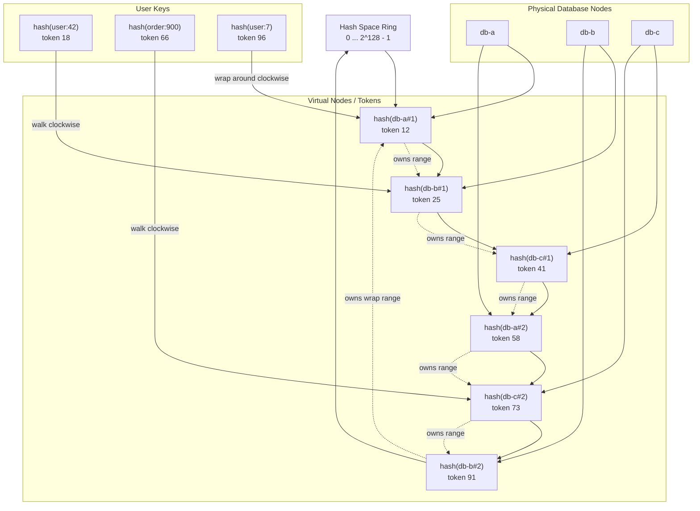

# Module 2: Database Architectures & Scaling

Databases are where system design stops being abstract.

Traffic can be retried. Stateless services can be cloned. Queues can buffer spikes. But storage has memory, ordering, durability, ownership, and correctness. Scaling a database means choosing where data lives, how many copies exist, when replicas agree, and what the system does when the network lies.

This chapter explains how storage layers evolve from a single relational database into globally distributed systems inspired by classic designs such as **Amazon Dynamo** and the **Google File System (GFS)**.

---

## Learning Goals

By the end of this module, you should be able to:

| Skill | What You Should Be Able To Explain |
|---|---|
| **CAP and partition behavior** | Why packet loss forces a choice between consistency and availability |
| **RDBMS scaling** | How replication, federation, and sharding change read/write behavior |
| **Replication lag** | Why users can read stale data after a successful write |
| **Consistent hashing** | How a hash ring reduces resharding when nodes join or leave |
| **ACID vs. BASE** | Why relational and NoSQL systems optimize for different guarantees |
| **Dynamo-style availability** | How sloppy quorums, hinted handoff, and vector clocks handle failure |
| **GFS-style throughput** | Why separating metadata from data flow unlocks massive file throughput |
| **SQL tuning** | How indexing, data types, partitioning, and denormalization affect performance |

---

## 1. The Distributed Storage Reality

Distributed databases are not one database. They are a group of machines attempting to behave like one database while messages between them can be delayed, duplicated, reordered, or dropped.

That is the heart of distributed storage: **the network is part of the database**.

### CAP At The Packet Level

The **CAP theorem** says that when a distributed system experiences a **network partition**, it cannot simultaneously guarantee both:

- **Consistency**: every read sees the latest committed write.
- **Availability**: every request to a non-failing node receives a non-error response.

**Partition tolerance** is not optional in real distributed systems. Links fail. Switches misroute packets. Firewalls drop traffic. Datacenters become temporarily unreachable.

Imagine two replicas:

| Replica | Local State |
|---|---|
| `db-a` | User balance = `$100` |
| `db-b` | User balance = `$100` |

Now a client writes `balance = $50` to `db-a`, but packets between `db-a` and `db-b` are dropping.

If another client reads from `db-b`, the system has two legal choices:

| Choice | Behavior | CAP Position |
|---|---|---|
| **Refuse or wait** | `db-b` cannot prove it has the latest value, so it times out or returns an error | **CP**: preserve consistency, sacrifice availability |
| **Answer locally** | `db-b` returns `$100` because that is its local value | **AP**: preserve availability, accept stale reads |

The engineer does not get to choose "no partition." The engineer chooses what the system does **during** the partition.

### PACELC In One Sentence

**PACELC** extends CAP:

- If there is a **Partition**, choose **Availability or Consistency**.
- **Else**, during normal operation, choose **Latency or Consistency**.

This matters because consistency costs do not disappear when the network is healthy. Synchronous replication, quorum reads, and cross-region coordination can increase latency even on a normal day.

---

## 2. Dynamo-Style AP Systems

Amazon Dynamo was designed for high availability in customer-facing workloads where rejecting writes could directly harm the user experience.

Its bias is clear: **accept writes whenever possible, reconcile later when necessary**.

### Eventual Consistency

In an **eventually consistent** system, replicas are allowed to diverge temporarily.

The promise is not "every read immediately sees the latest write." The promise is: if no new updates occur and replicas can communicate, they will eventually converge.

This model is useful when:

- Writes must stay available during partial failures.
- The application can tolerate temporary inconsistency.
- Conflicts can be repaired automatically or with domain-specific merge logic.

### Sloppy Quorums

A strict quorum writes to the designated replica set for a key.

A **sloppy quorum** writes to the first healthy nodes it can reach, even if some are not the ideal owners for that key.

Example:

| Concept | Example |
|---|---|
| Replication factor | `N = 3` |
| Write quorum | `W = 2` |
| Read quorum | `R = 2` |
| Ideal owners | `A`, `B`, `C` |
| Partitioned node | `A` is unreachable |
| Sloppy write targets | `B`, `C`, and temporary node `D` |

The write succeeds because enough reachable nodes accepted it, even though one ideal owner was unavailable.

### Hinted Handoff

**Hinted handoff** makes sloppy quorum durable.

If node `A` should receive a replica but is down, node `D` can temporarily store that replica with a hint saying, "This belongs to `A`."

When `A` recovers:

1. `D` detects that `A` is healthy again.
2. `D` forwards the hinted data to `A`.
3. `A` stores the missed update.
4. `D` deletes the temporary hinted copy.

This improves write availability without pretending that every replica was up to date at write time.

### Vector Clocks And Conflict Versions

Dynamo uses **vector clocks** to track causality between versions.

A vector clock records the version history from multiple writers or nodes. It helps answer:

- Did version `X` happen before version `Y`?
- Did version `Y` overwrite `X`?
- Or are `X` and `Y` concurrent conflicting versions?

If two versions are concurrent, the database may return both to the application. The application then performs reconciliation.

### Syntactic vs. Semantic Reconciliation

| Reconciliation Type | Meaning | Example |
|---|---|---|
| **Syntactic reconciliation** | The system resolves versions mechanically using metadata | "This vector clock dominates that one, so keep the newer causally-descended version" |
| **Semantic reconciliation** | The application resolves conflict using business meaning | "Two shopping carts diverged; merge the item sets instead of discarding one cart" |

For a shopping cart, semantic reconciliation is often better. If one replica has `["book"]` and another has `["pen"]`, the correct user experience may be `["book", "pen"]`, not last-write-wins.

---

## 3. SQL Scaling And The Cost Of Consistency

Relational databases begin as a beautiful abstraction: normalized tables, transactions, indexes, and SQL.

Scaling them forces a question: **which part of the database abstraction are you willing to weaken?**

### Scaling Matrix

| Architecture | Throughput | Write Latency | Data Consistency | Complexity |
|---|---|---|---|---|
| **RDBMS Replication: Master-Slave** | High read throughput through replicas; write throughput limited by one primary | Low to moderate for primary writes; replicas apply changes asynchronously or semi-synchronously | Strong on primary; replicas may be stale due to replication lag | Moderate: failover, replica promotion, read routing |
| **RDBMS Master-Master** | Higher write availability if writes can be distributed | Higher because conflicts or coordination must be handled | Difficult: concurrent writes can conflict unless carefully partitioned | High: conflict resolution, global ordering, split-brain risk |
| **Federation** | Good when domains are independent; each service/database scales separately | Usually local to one functional database | Strong within a domain; cross-domain consistency is harder | High: cross-database joins, distributed transactions, ownership boundaries |
| **Sharding** | High read and write throughput when shard key distributes load evenly | Low for single-shard writes; higher for cross-shard operations | Strong within a shard; cross-shard transactions are expensive | Very high: shard key design, rebalancing, routing, hotspots |
| **NoSQL / Dynamo-Style** | Very high horizontal throughput | Low when accepting local or quorum writes | Often eventual or tunable consistency | High: conflict resolution, operational tuning, data model constraints |

---

## 4. RDBMS Scaling Patterns

### Master-Slave Replication

In **master-slave replication**, one primary database accepts writes. Replica databases copy the primary's write stream and serve reads.

| Benefit | Cost |
|---|---|
| Scales read-heavy workloads | Writes remain bottlenecked on the primary |
| Enables read replicas close to users | Replicas can lag behind |
| Supports failover by promoting a replica | Promotion requires careful correctness checks |

### Replication Lag

**Replication lag** is the delay between a write committing on the primary and becoming visible on a replica.

It can happen because:

- The primary is producing writes faster than replicas can apply them.
- Network links are slow or congested.
- Replicas replay changes sequentially.
- Long-running queries on replicas interfere with apply speed.

### Read-After-Write Failure

If a user writes to the primary and immediately reads from a lagging replica, they may not see their own update.

Example:

1. User updates profile name to `Amina`.
2. Primary commits successfully.
3. Read router sends the next request to a replica.
4. Replica is 2 seconds behind.
5. User still sees the old name.

This violates **read-your-writes consistency**.

Mitigations:

| Mitigation | How It Helps |
|---|---|
| **Read own writes from primary** | Route a user's immediate post-write reads to the primary |
| **Session stickiness** | Keep a session on a replica known to have caught up |
| **Replica lag tracking** | Send reads only to replicas below a lag threshold |
| **Version tokens** | Client carries the last seen commit timestamp or log sequence number |
| **Synchronous replication** | Wait for replicas before acknowledging writes, trading latency for consistency |

### Master-Master Replication

In **master-master replication**, multiple databases accept writes and replicate to each other.

This can improve write availability, but it introduces conflict risk.

| Conflict Type | Example |
|---|---|
| Same-row conflict | Two regions update the same account email at the same time |
| Uniqueness conflict | Two writers insert the same unique username |
| Ordering conflict | Two financial operations arrive in different orders |

Master-master is safest when writes are naturally partitioned, such as region-owned tenants or user-owned records.

### Federation

**Federation** splits a database by business function.

Example:

| Database | Owns |
|---|---|
| `users_db` | Accounts, profiles, credentials |
| `orders_db` | Orders, carts, payments |
| `catalog_db` | Products, inventory, pricing |

Federation reduces coupling and lets teams scale domains independently. The cost is that joins across domains become application-level workflows or asynchronous data pipelines.

### Sharding

**Sharding** splits one logical dataset across multiple physical databases using a shard key.

Examples:

- `user_id`
- `tenant_id`
- `account_id`
- `region_id`

Good shard keys have:

- High cardinality
- Even distribution
- Query locality
- Low risk of a single key becoming too hot

Bad shard keys create hotspots. A celebrity profile, enterprise tenant, or viral post can overload one shard while the rest of the fleet is idle.

---

## 5. Consistent Hashing

Traditional modulo sharding often uses:

```text
shard = hash(key) % number_of_shards
```

This breaks badly when the number of shards changes.

If you move from 10 shards to 11 shards, most keys map to different shards. That creates a **resharding storm**: huge data movement, cache invalidation, replica rebuilds, and operational risk.

**Consistent hashing** maps both nodes and keys onto a fixed hash ring.

To locate a key:

1. Hash the key.
2. Place it on the ring.
3. Walk clockwise.
4. The first node encountered is the coordinator for that key.

When a node joins, only the keys in its new segment move. The rest of the ring stays stable.

### Consistent Hashing Ring Diagram



### Why Virtual Nodes Matter

If every physical server appears only once on the ring, random placement can create uneven ranges.

**Virtual nodes** solve this by placing each physical node at many positions on the ring.

| Without Virtual Nodes | With Virtual Nodes |
|---|---|
| One large token range can overload one server | Many smaller ranges smooth distribution |
| Adding a node may burden one neighbor | Load transfer is spread across many neighbors |
| Harder to handle mixed hardware sizes | Stronger machines can receive more virtual nodes |
| Hotspots are more likely | Hotspots are reduced, though not eliminated |

---

## 6. Production Code Template: Consistent Hashing

This Python implementation uses `hashlib` and an internal sorted array of ring positions. It supports adding nodes, removing nodes, and looking up the coordinator for a key.

```python
"""
Consistent Hash Ring
====================

Runtime: Python 3.10+
Dependencies: standard library only

This implementation is designed for teaching and production adaptation:
- Stable hashing with hashlib.sha256
- Sorted in-memory ring for O(log n) lookups
- Virtual nodes to smooth key distribution
- Explicit add/remove operations

In a real database system, the ring membership would be stored in a
strongly consistent metadata service and rolled out carefully to clients.
"""

from __future__ import annotations

import bisect
import hashlib
from dataclasses import dataclass
from typing import Dict, Iterable, List, Optional


def stable_hash(value: str) -> int:
    """Return a stable integer hash for a string.

    Python's built-in hash() is intentionally randomized between processes.
    Distributed systems need every node and client to compute the same token
    for the same input, so we use sha256 from hashlib.
    """
    digest = hashlib.sha256(value.encode("utf-8")).hexdigest()
    return int(digest, 16)


@dataclass(frozen=True)
class RingEntry:
    token: int
    node: str
    vnode_id: int


class ConsistentHashRing:
    """Consistent hash ring with virtual nodes.

    The ring is represented by two structures:
    - self._tokens: sorted list of integer token positions
    - self._ring: mapping from token -> RingEntry

    Lookup uses binary search:
    - Hash the key.
    - Find the first token >= key hash.
    - If none exists, wrap to token 0.
    """

    def __init__(self, nodes: Optional[Iterable[str]] = None, replicas: int = 128) -> None:
        if replicas <= 0:
            raise ValueError("replicas must be positive")

        self.replicas = replicas
        self._tokens: List[int] = []
        self._ring: Dict[int, RingEntry] = {}
        self._nodes: set[str] = set()

        for node in nodes or []:
            self.add_node(node)

    def add_node(self, node: str) -> None:
        """Add a physical node and its virtual nodes to the ring."""
        if not node:
            raise ValueError("node must be a non-empty string")
        if node in self._nodes:
            return

        self._nodes.add(node)

        for vnode_id in range(self.replicas):
            token = stable_hash(f"{node}#{vnode_id}")

            # sha256 collisions are practically impossible, but this keeps
            # the structure correct even if a collision is ever encountered.
            while token in self._ring:
                token = stable_hash(f"{node}#{vnode_id}:collision:{token}")

            entry = RingEntry(token=token, node=node, vnode_id=vnode_id)
            bisect.insort(self._tokens, token)
            self._ring[token] = entry

    def remove_node(self, node: str) -> None:
        """Remove a physical node and all of its virtual nodes."""
        if node not in self._nodes:
            return

        self._nodes.remove(node)
        tokens_to_remove = [
            token for token, entry in self._ring.items() if entry.node == node
        ]

        for token in tokens_to_remove:
            del self._ring[token]
            index = bisect.bisect_left(self._tokens, token)
            if index < len(self._tokens) and self._tokens[index] == token:
                self._tokens.pop(index)

    def get_node(self, key: str) -> str:
        """Return the coordinator node for a key."""
        if not self._tokens:
            raise RuntimeError("cannot look up a key on an empty ring")

        key_token = stable_hash(key)
        index = bisect.bisect_left(self._tokens, key_token)

        # Wrap around to the first token when the key lands past the final node.
        if index == len(self._tokens):
            index = 0

        return self._ring[self._tokens[index]].node

    def get_replicas(self, key: str, count: int) -> List[str]:
        """Return distinct replica nodes for a key by walking clockwise."""
        if count <= 0:
            raise ValueError("count must be positive")
        if count > len(self._nodes):
            raise ValueError("replica count cannot exceed number of physical nodes")

        key_token = stable_hash(key)
        index = bisect.bisect_left(self._tokens, key_token)

        replicas: List[str] = []
        seen: set[str] = set()

        while len(replicas) < count:
            if index == len(self._tokens):
                index = 0

            node = self._ring[self._tokens[index]].node
            if node not in seen:
                replicas.append(node)
                seen.add(node)

            index += 1

        return replicas

    def nodes(self) -> List[str]:
        return sorted(self._nodes)


if __name__ == "__main__":
    ring = ConsistentHashRing(["db-a", "db-b", "db-c"], replicas=64)

    for key in ["user:42", "user:7", "order:900", "tenant:acme"]:
        coordinator = ring.get_node(key)
        replicas = ring.get_replicas(key, count=2)
        print(f"{key} -> coordinator={coordinator}, replicas={replicas}")

    print("Adding db-d...")
    ring.add_node("db-d")

    for key in ["user:42", "user:7", "order:900", "tenant:acme"]:
        print(f"{key} -> coordinator={ring.get_node(key)}")
```

### Operational Notes

| Concern | Production Guidance |
|---|---|
| **Ring ownership** | Store membership in a consistent metadata plane |
| **Client rollout** | Roll out ring changes gradually to avoid split routing |
| **Replication** | Place replicas on distinct physical nodes and preferably distinct racks or zones |
| **Hot keys** | Consistent hashing balances key ranges, not necessarily request volume |
| **Rebalancing** | Stream only affected token ranges when nodes join or leave |

---

## 7. ACID vs. BASE

### ACID

Relational databases are commonly associated with **ACID** transactions.

| Property | Meaning |
|---|---|
| **Atomicity** | A transaction commits completely or not at all |
| **Consistency** | A transaction moves the database from one valid state to another |
| **Isolation** | Concurrent transactions behave as though executed under the chosen isolation model |
| **Durability** | Once committed, data survives crashes |

ACID is ideal when correctness depends on strict invariants:

- Payments
- Inventory deduction
- Account balances
- Uniqueness constraints
- Financial ledgers

### BASE

Many NoSQL systems use a **BASE** model.

| Property | Meaning |
|---|---|
| **Basically Available** | The system tries to answer even during partial failure |
| **Soft State** | Replicas may change over time as updates propagate |
| **Eventual Consistency** | Replicas converge if writes stop and communication resumes |

BASE is useful when scale and availability are more important than immediate global agreement:

- Shopping carts
- Activity feeds
- Like counts
- Product recommendations
- Session-like data that can be repaired or merged

### ACID vs. BASE Design Signal

| Question | ACID Bias | BASE Bias |
|---|---|---|
| Can stale reads cause financial or legal harm? | Yes | No |
| Must constraints be enforced immediately? | Yes | Not always |
| Is availability more important than perfect freshness? | Sometimes | Usually |
| Can conflicts be merged by business logic? | Rarely | Often |
| Is global write latency acceptable? | Sometimes | Usually no |

---

## 8. GFS: Separating Control Flow From Data Flow

The **Google File System** was designed for huge files, streaming reads, high aggregate throughput, and failure as a normal condition.

Its key architectural move is separating **metadata control** from **bulk data movement**.

### GFS Components

| Component | Responsibility |
|---|---|
| **Master** | Stores metadata: namespace, file-to-chunk mapping, chunk locations, leases |
| **Chunkserver** | Stores fixed-size chunks as local files |
| **Client** | Asks the master for metadata, then reads/writes directly to chunkservers |

### Why This Scales

The master does not sit in the data path.

Read flow:

1. Client asks the master where a file chunk lives.
2. Master returns chunkserver locations.
3. Client caches that metadata.
4. Client reads directly from the nearest or preferred chunkserver.

Write flow:

1. Client asks the master which chunkserver has the lease for a chunk.
2. Master identifies primary and secondary replicas.
3. Client pushes data to chunkservers, often through a pipeline.
4. Primary orders the mutation.
5. Secondaries apply it in the same order.

This keeps metadata centralized enough to manage the namespace while keeping high-volume data transfer away from the master.

### GFS Design Lesson

For storage systems, the control plane and data plane should often be separated.

| Plane | Optimized For |
|---|---|
| **Control plane** | Metadata correctness, placement, leases, membership |
| **Data plane** | Throughput, streaming, replication, disk and network saturation |

---

## 9. SQL Tuning Matrices

Scaling is not always horizontal. Many relational systems survive much longer with disciplined schema and query design.

### Tuning Matrix

| Technique | Why It Works | Trade-Off |
|---|---|---|
| **B-Tree indexes** | Keep keys ordered for efficient lookups, range scans, and joins, usually `O(log n)` | Slower writes because indexes must be updated |
| **Composite indexes** | Match multi-column query predicates such as `(tenant_id, created_at)` | Useless if column order does not match access patterns |
| **Covering indexes** | Serve queries directly from the index without table lookup | More storage and write amplification |
| **Correct data types** | Smaller types improve cache density and reduce I/O | Poor choices require migrations later |
| **CHAR vs. VARCHAR** | `CHAR` can fit fixed-length values; `VARCHAR` saves space for variable strings | `CHAR` wastes space for variable-length content |
| **Table partitioning** | Splits large tables by range, hash, or list for pruning and maintenance | Query planner and operational complexity increase |
| **Denormalization** | Avoids expensive joins by duplicating read-ready data | Writes become slower and consistency repair gets harder |

### Indexing With B-Trees

B-Tree indexes are effective because they keep data sorted in a balanced tree.

They help with:

- Equality lookups
- Range scans
- Ordered pagination
- Join keys
- Prefix searches on indexed columns

They hurt when:

- Too many indexes amplify every write.
- Low-cardinality indexes do not filter enough rows.
- Queries do not match index order.

### Data Type Optimization

Good schema design keeps rows compact.

| Choice | Guidance |
|---|---|
| `INT` vs. `BIGINT` | Use only as much range as the domain requires |
| `CHAR` | Good for truly fixed-length values such as country codes or hashes of fixed display length |
| `VARCHAR` | Good for variable-length text such as names and emails |
| `TIMESTAMP` | Prefer native time types over strings |
| `BOOLEAN` / enums | Prefer compact representation for low-cardinality state |

Smaller rows mean more rows fit in memory pages, caches, and indexes.

### Table Partitioning

Partitioning breaks a large table into smaller physical pieces.

Common strategies:

| Strategy | Example | Useful When |
|---|---|---|
| **Range partitioning** | Orders by month | Queries are time-bounded |
| **Hash partitioning** | Users by hash of `user_id` | Workload needs even distribution |
| **List partitioning** | Region-specific data | Data has natural categories |
| **Hot/cold partitioning** | Recent rows separate from archive rows | Recent data dominates queries |

Partitioning is not sharding by itself. It usually remains inside one database system. But it can make pruning, maintenance, backups, and cache behavior much better.

### Denormalization Trade-Off

**Denormalization** duplicates data to avoid expensive joins.

Example:

Instead of joining `orders`, `users`, and `addresses` every time an order history page loads, store a read-ready order summary with the user's display name and shipping city.

| Benefit | Cost |
|---|---|
| Faster reads | Slower writes |
| Fewer joins | Duplicate data |
| Better cache locality | Consistency repair jobs may be needed |
| Simpler read queries | Update logic becomes more complex |

The core trade-off: **read optimization vs. write degradation**.

---

## 10. Hotspots And Partition Isolation

Consistent hashing distributes keys, but it does not guarantee equal traffic.

A single key can become hot.

Example: `profile:celebrity-123` may receive more traffic than thousands of ordinary user profiles combined. If that key maps to one shard, one machine becomes overloaded while the rest of the cluster is calm.

### Hotspot Mechanics

| Layer | Failure Mode |
|---|---|
| **Shard router** | Sends all requests for the celebrity key to one shard |
| **Database CPU** | Saturates on repeated reads, writes, indexes, and locks |
| **Storage** | Disk or SSD queue depth spikes |
| **Replication** | Followers lag because the hot shard produces too much change volume |
| **Application** | Threads block waiting for one overloaded partition |

### Fix Strategy

| Step | Action | Why It Works |
|---|---|---|
| 1 | Put cache in front of the hot object | Absorbs repeated reads before they hit the shard |
| 2 | Use request coalescing | Prevents many misses from stampeding the database |
| 3 | Increase replica count for hot ranges | Spreads reads over more copies |
| 4 | Split hot keys when possible | Breaks one logical hotspot into multiple physical keys |
| 5 | Move hot partitions to stronger hardware | Buys time during incident response |
| 6 | Add virtual nodes and rebalance | Smooths future range ownership |
| 7 | Separate read and write paths | Keeps comments, counters, and profile reads from fighting for one lock path |

### Partition Isolation Principle

Good database architecture prevents one partition from damaging the whole fleet.

Partition isolation means:

- Per-shard connection pools
- Per-shard rate limits
- Per-shard circuit breakers
- Bulkheads between hot and normal tenants
- Independent replica lag tracking
- Targeted rebalancing instead of global reshuffling

---

## Database Mock Challenges

> **Challenge 1: Celebrity Hotspot On A Sharded Social Network**  
> A celebrity posts a viral photo. The database is sharded by `user_id`. Within minutes, latency on one shard rises to 10 seconds while other shards are healthy. Explain the underlying mechanics of the failure and provide a step-by-step fix that preserves availability.

> **Challenge 2: Read-After-Write Bug From Replication Lag**  
> A user updates their shipping address and immediately refreshes checkout, but the old address appears. The application writes to the primary and reads from replicas. Explain why this happens and design a fix without sending every read in the system to the primary.

> **Challenge 3: Dynamo-Style Conflict During A Network Partition**  
> A shopping cart service uses an AP key-value store. During a partition, two replicas accept different writes for the same cart. Explain how sloppy quorums, hinted handoff, vector clocks, and semantic reconciliation should work together.
<details><summary>Click for Staff-Engineer Level Answers</summary>

## Challenge 1: Celebrity Hotspot On A Sharded Social Network

The failure is not a lack of total cluster capacity. It is a lack of capacity on the single partition that owns the celebrity key.

If the system shards by `user_id`, all reads and writes for `celebrity-123` route to the same shard or same small replica group. The shard router is doing exactly what it was designed to do, but the shard key has created a traffic hotspot.

### Mechanics

1. The celebrity key hashes to shard `S17`.
2. Millions of profile reads, photo reads, comments, likes, and counters route to `S17`.
3. `S17` saturates CPU, disk, lock queues, or connection pools.
4. Replicas for `S17` fall behind because the write stream is too heavy.
5. Application threads pile up waiting for `S17`.
6. Other shards remain underutilized because their key ranges are not hot.

### Staff-Level Fix

First, protect the rest of the system. Add per-shard circuit breakers and rate limits so `S17` cannot exhaust global application connection pools.

Second, absorb reads. Cache the celebrity profile, photo metadata, and rendered read models in Redis, Memcached, or an edge cache. Use request coalescing so one cache miss refreshes the object while other requests wait or receive stale data.

Third, separate traffic types. Profile reads, comments, likes, and counters should not all hit the same write path. Store high-volume counters in a separate counter service or use sharded counter buckets such as `post_id:bucket_id`.

Fourth, increase read replicas for the hot range and route read-only traffic across those replicas. Track replica lag independently so stale replicas are removed from read rotation.

Fifth, split the hot logical key if the access pattern allows it. For example, comments can be partitioned by `post_id + time_bucket` or `post_id + hash(comment_id)`. Like counters can be bucketed and periodically aggregated.

Sixth, improve long-term placement. Use virtual nodes and rebalance token ranges so one physical host does not own too much hot data. For extreme tenants or celebrities, use tenant isolation: move the account to a dedicated partition or dedicated replica group.

The key architectural idea is **partition isolation**. A hot partition should degrade itself, not the entire database fleet.

## Challenge 2: Read-After-Write Bug From Replication Lag

The write commits on the primary, but the read is served by a replica that has not replayed the write yet. The user sees stale data because asynchronous replication provides eventual replica convergence, not immediate read-your-writes consistency.

### Mechanics

1. User submits address update.
2. Primary commits the new address at log sequence number `LSN=500`.
3. Replica is currently replayed only through `LSN=470`.
4. The read router sends checkout refresh to that replica.
5. The replica returns the old address.

### Staff-Level Fix

Do not send every read to the primary. Use targeted consistency.

Return a version token after the write, such as a commit timestamp or LSN. Store it in the user's session. For subsequent reads that require read-your-writes behavior, route only to replicas that have replayed at least that version. If no replica has caught up within a small timeout, route that user's read to the primary.

Also maintain replica lag metrics in the read router. Replicas above a lag threshold should be removed from latency-sensitive read pools.

For critical checkout flows, use session-based primary reads for a short window after writes, such as 5 to 30 seconds. That protects correctness without moving unrelated users or unrelated pages to the primary.

For less critical pages, show stale-tolerant data with a refresh indicator. The consistency requirement should match the user harm.

The principle is **consistency by workflow**, not one global policy for every query.

## Challenge 3: Dynamo-Style Conflict During A Network Partition

In an AP key-value store, the system accepts writes during partitions to preserve availability. That means conflicting versions can exist.

### Mechanics

Assume the cart key normally replicates to nodes `A`, `B`, and `C`. During a partition, `A` is unreachable from part of the cluster.

A client adds `book` through nodes `B` and `C`. Another client adds `pen` through `A` and a temporary reachable node `D`. Because sloppy quorum is enabled, the system accepts writes on reachable healthy nodes rather than rejecting the operation.

Node `D` stores a hinted handoff record for the replica that belongs to another node. When the partition heals, `D` forwards the hinted update to the intended owner.

Now the system may discover concurrent versions of the cart. Vector clocks show that neither version causally descends from the other.

### Staff-Level Fix

The database should return both sibling versions to the application instead of silently discarding one. For a shopping cart, last-write-wins is usually wrong because it can lose items. The application should perform semantic reconciliation by merging cart item sets, preserving both `book` and `pen` unless business rules say otherwise.

After reconciliation, the application writes the merged cart back with a vector clock that supersedes both conflicting siblings. Future reads can collapse to the merged version.

Sloppy quorums improve write availability because the system can write to reachable substitute nodes. Hinted handoff improves durability and convergence because temporary holders later deliver missed writes to the correct owners.

The staff-level nuance: AP availability moves complexity from the write path into reconciliation. That is acceptable only when the domain has a safe merge strategy.

</details>
