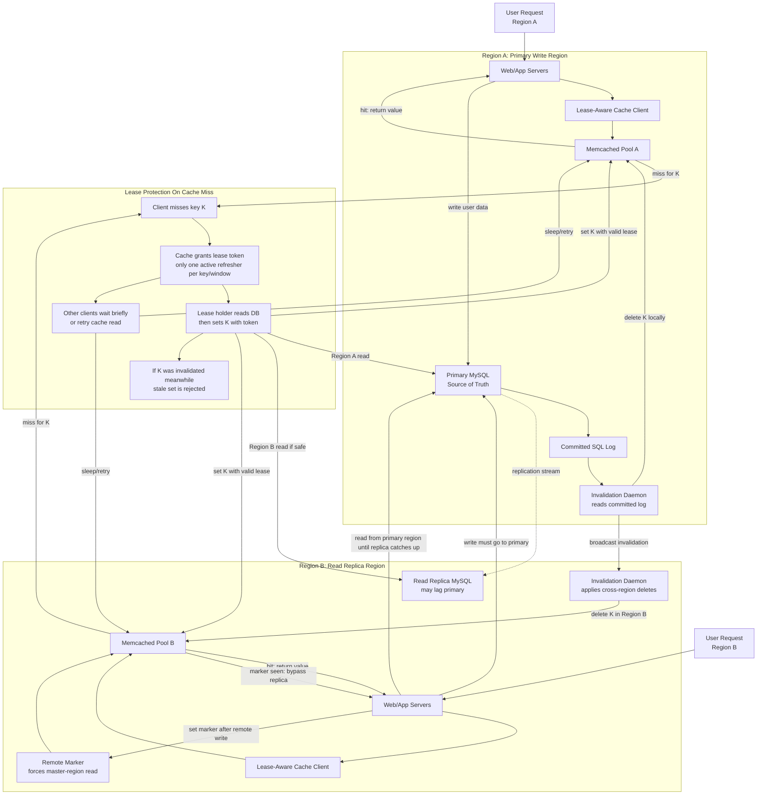

# Module 3: Caching Strategies & Memory Management

Caching is not just "make reads faster."

At scale, caching becomes a distributed systems layer with its own correctness model, memory pressure, invalidation strategy, failure modes, and operational blast radius. A cache can protect a database from billions of reads. It can also amplify an outage if keys expire together, hot objects stampede the database, or stale values are written back after invalidation.

This chapter explains cache mechanics from first principles, then connects them to high-scale lessons inspired by Facebook's Memcached architecture.

---

## Learning Goals

By the end of this module, you should be able to:

| Skill | What You Should Be Able To Explain |
|---|---|
| **Cache-aside** | How lazy loading works and why applications own cache population |
| **Write-through** | Why synchronous cache/database writes improve freshness but increase latency |
| **Write-behind** | Why asynchronous persistence is fast but dangerous without durability controls |
| **Refresh-ahead** | How hot keys can be renewed before expiration |
| **Memcached at scale** | How clients, routers, leases, and invalidation streams support huge read volume |
| **Eviction algorithms** | Why LRU needs a hash map plus doubly linked list for true `O(1)` operations |
| **Cache crises** | How to mitigate penetration, avalanche, stampede, and hot-key contention |
| **Cache placement** | When to cache query results versus serialized objects |

---

## 1. Cache Invalidation Runtime

Every cache pattern answers two questions:

1. **Who updates the cache?**
2. **When is the database updated?**

The right answer depends on read/write ratio, freshness requirements, data loss tolerance, and operational complexity.

---

## 2. Cache-Aside: Lazy Loading

**Cache-aside** is the most common pattern for application-owned caching.

The application checks the cache first. On a miss, it loads from the database, stores the result in cache, and returns it.

### Runtime Read Path

| Step | Operation | Result |
|---|---|---|
| 1 | Application receives request for key `K` | App computes cache key |
| 2 | App calls `cache.get(K)` | Cache hit or miss |
| 3 | If hit, return cached value | Database is bypassed |
| 4 | If miss, query database | Higher latency path |
| 5 | Store database result in cache with TTL | Future reads are faster |
| 6 | Return value to caller | Cache is demand-filled |

### Runtime Write Path

Common write strategy:

1. Write to the database.
2. Delete the cache key.
3. Let the next read repopulate the cache.

This is often safer than updating the cache directly because it avoids keeping a stale object alive after the source of truth changes.

### Strengths

- Simple mental model.
- Cache only stores requested data.
- Works well with Memcached and Redis.
- Application can tune TTLs per object type.

### Failure Risks

| Risk | Explanation |
|---|---|
| **Cache miss penalty** | First request after expiration pays database latency |
| **Stampede** | Many clients miss the same key and hit the database together |
| **Stale reads** | Cached values can outlive database changes if invalidation fails |
| **Negative lookup load** | Repeated requests for nonexistent keys can bypass cache unless cached or filtered |

---

## 3. Write-Through

In **write-through**, the application writes to the cache, and the cache synchronously writes to the database before acknowledging success.

The cache is treated as the write interface, but the database is still the durable backing store.

### Runtime Write Path

| Step | Operation | Result |
|---|---|---|
| 1 | Application writes key `K` to cache layer | Cache receives new value |
| 2 | Cache writes `K` to database synchronously | Caller waits |
| 3 | Database confirms commit | Durable write exists |
| 4 | Cache stores or updates `K` | Future reads hit cache |
| 5 | Cache returns success to application | Write is acknowledged |

### Runtime Read Path

1. Application reads from cache.
2. Cache returns value if present.
3. If absent, the system may load from database or treat absence as an error depending on design.

### Strengths

- Read-after-write behavior is easier to reason about.
- Cached data is usually fresh.
- Good for workloads where reads follow writes.

### Trade-Offs

| Cost | Why It Happens |
|---|---|
| **Higher write latency** | Database write is on the synchronous path |
| **Lower write availability** | Cache write may fail if the database is unavailable |
| **More coupling** | Cache layer must understand persistence behavior |
| **Wasted cache space** | Written values may be cached even if never read |

---

## 4. Write-Behind: Write-Back

In **write-behind**, the application writes to the cache, and the cache asynchronously flushes changes to the database later.

This is designed for write-heavy workloads where low write latency matters.

### Runtime Write Path

| Step | Operation | Result |
|---|---|---|
| 1 | Application writes key `K` to cache | Cache updates memory immediately |
| 2 | Cache enqueues dirty write | Flush happens later |
| 3 | Cache acknowledges success | Very low write latency |
| 4 | Background worker batches writes | Higher database efficiency |
| 5 | Worker persists batch to database | Database eventually catches up |
| 6 | Dirty marker is cleared | Cache and database converge |

### Runtime Read Path

Reads are served from cache when possible. The cache may contain newer data than the database until asynchronous flush completes.

### Crash Risk

If the cache node crashes after acknowledging a write but before flushing it to the database, the acknowledged write can be lost.

That is the central danger of write-behind: **performance improves by moving durability out of the synchronous path**.

### Enterprise Mitigations

| Mitigation | How It Reduces Risk |
|---|---|
| **Write-ahead log** | Persist the mutation to local durable storage before acknowledging |
| **Durable queue** | Publish the mutation to Kafka, Pulsar, or another replicated log before cache update is acknowledged |
| **Replication** | Replicate cache state or dirty queues to peer nodes |
| **Idempotent writes** | Make replay safe after crash recovery |
| **Flush acknowledgements** | Track which mutations have reached the database |
| **Backpressure** | Slow writers when the async queue grows dangerously large |

Write-behind is powerful, but it should be treated like a storage system, not just a cache.

---

## 5. Refresh-Ahead

**Refresh-ahead** renews hot cached values before they expire.

Instead of waiting for a miss, the cache predicts which keys will be requested again and refreshes them in the background.

### Runtime Flow

| Step | Operation | Result |
|---|---|---|
| 1 | Key `K` is read frequently | Cache marks it as hot |
| 2 | TTL approaches refresh threshold | Background refresh is scheduled |
| 3 | Cache fetches latest value from database | User request does not block |
| 4 | Cache updates key and extends TTL | Future reads remain fast |
| 5 | If refresh fails, old value may be served briefly | Availability is protected |

### Best Fit

- Hot product pages.
- User profiles with predictable access.
- Config objects.
- Feed metadata.
- Expensive database query results with stable access patterns.

### Risk

Bad prediction wastes database capacity by refreshing keys that are no longer needed.

---

## 6. Pattern Comparison

| Pattern | Read Latency | Write Latency | Freshness | Data Loss Risk | Operational Complexity |
|---|---|---|---|---|---|
| **Cache-aside** | Fast on hit, slow on miss | Normal database write | TTL/invalidation dependent | Low if database writes first | Low to moderate |
| **Write-through** | Fast after write | Higher because DB is synchronous | Stronger | Low after DB commit | Moderate |
| **Write-behind** | Very fast | Very low | Cache may be ahead of DB | High unless durable queue/WAL exists | High |
| **Refresh-ahead** | Very fast for predicted keys | Usually unchanged | Good for hot keys | Low if DB remains source of truth | Moderate to high |

---

## 7. Facebook-Style Memcached Blueprint

Facebook used Memcached as a massive **demand-filled look-aside cache** in front of MySQL.

The design lesson is subtle: keep cache servers simple, push routing intelligence into clients and proxies, and build explicit mechanisms for correctness under invalidation races.

### Scaling Principles

| Principle | Mechanism |
|---|---|
| **Simple cache servers** | Memcached remains an in-memory key-value store |
| **Smart clients** | Clients know how to route, batch, retry, and handle misses |
| **Connection reduction** | Proxies such as mcrouter coalesce client connections |
| **Protocol selection** | UDP can reduce overhead for gets; TCP is safer for mutation operations |
| **Database protection** | Cache-aside prevents MySQL from serving every read |
| **Failure containment** | Gutter pools absorb traffic when cache nodes fail |
| **Consistency control** | Leases and invalidation daemons reduce stale sets and stampedes |

### UDP vs. TCP For Memcached

| Protocol | Good For | Trade-Off |
|---|---|---|
| **UDP gets** | Lower overhead, no connection setup, lower latency for simple reads | Packet loss must be handled; responses can be dropped or fragmented |
| **TCP sets/deletes** | Reliable mutation delivery and ordered streams | More connection overhead and server resource usage |

The core idea is not "UDP is always better." It is that read-heavy cache traffic can benefit from lower protocol overhead when the application can tolerate retries.

### Gutter Servers

**Gutter servers** are a small reserve pool used when primary cache servers fail.

Without a gutter pool, clients might rehash failed cache traffic across the remaining primary cache fleet. That can overload healthy nodes and trigger cascading failures.

With gutter servers:

1. A primary cache node fails.
2. Clients direct misses for affected keys to the gutter pool.
3. Healthy primary nodes are not forced to absorb all displaced hot keys.
4. The database is shielded from a sudden miss storm.

Gutter servers trade some cache hit quality for failure isolation.

---

## 8. Multi-Region Cache Architecture

Large systems often have multiple regions with local cache clusters and local read replicas, but only one region may own primary writes for a dataset.

The hard problem is synchronization:

- A value changes in the primary database.
- Regional caches must delete or refresh stale values.
- Replicas may lag behind primary.
- A user who just wrote data must not read their old value from a local replica.

### Regional Cache Flow With Leases And Invalidation



### What Leases Solve

Leases protect against two related problems:

| Problem | Lease Behavior |
|---|---|
| **Cache stampede** | Only one client receives permission to repopulate a missing hot key |
| **Stale set** | A client must present a valid token when setting a value after a miss |

If a key is invalidated while a client is fetching from the database, the lease token can be invalidated too. When the client tries to set the old value, the cache rejects it.

### Cross-Region Consistency

Facebook-style invalidation relies on committed database logs.

The important ordering principle:

1. Database commit happens.
2. Invalidation daemon reads committed log.
3. Cache delete is broadcast.

This avoids deleting based on uncommitted or speculative writes.

### Remote Markers

A **remote marker** protects users who write in one region while local replicas lag.

Example:

1. User in Region B updates profile.
2. Write is sent to primary database in Region A.
3. Region B cache stores a remote marker for that key.
4. User immediately reads profile again.
5. Region B sees the marker and routes the read to Region A instead of stale local replica.
6. Once replication catches up, the marker can expire.

Remote markers are a targeted read-your-writes tool for multi-region cache consistency.

---

## 9. Cache Eviction Mathematics

RAM is finite. Eviction decides which objects stay in memory and which are removed.

### LRU: Least Recently Used

**LRU** evicts the item that has gone the longest without being accessed.

It assumes that recently accessed data is more likely to be accessed again.

To implement true `O(1)` `get` and `put`, use:

| Structure | Purpose |
|---|---|
| **Hash map** | Key to linked-list node lookup in `O(1)` |
| **Doubly linked list** | Maintains recency order with `O(1)` move and eviction |

On every `get`:

1. Look up node in hash map.
2. Move node to front of linked list.
3. Return value.

On every `put`:

1. If key exists, update value and move to front.
2. If key is new, insert at front.
3. If capacity is exceeded, remove tail node.
4. Delete evicted key from hash map.

### LFU: Least Frequently Used

**LFU** evicts the item with the lowest access count.

It assumes frequently accessed data is more valuable than merely recent data.

LFU is useful when access frequency is stable. It can perform poorly when workload shifts because historically popular keys may remain cached after they become cold unless decay or aging is used.

### LRU vs. LFU

| Dimension | LRU | LFU |
|---|---|---|
| **Eviction basis** | Time since last access | Number of accesses |
| **Best for** | Workloads with temporal locality | Workloads with stable popularity |
| **Weakness** | One-time scans can evict useful hot items | Old hot keys can linger too long |
| **Common data structures** | Hash map + doubly linked list | Hash maps + frequency buckets |
| **Operational tuning** | Capacity and TTL | Capacity, TTL, frequency decay |

### Slab Classes And Memory Fragmentation

Memcached uses slab classes to reduce allocator overhead. Memory is divided into classes of similarly sized chunks.

| Benefit | Cost |
|---|---|
| Faster allocation | Memory can be stranded in the wrong slab class |
| Less fragmentation inside a class | Poor class distribution can waste RAM |
| Predictable object placement | Large and small objects compete separately |

Memory management is not just eviction policy. It is also object sizing, TTL discipline, allocator behavior, and workload shape.

---

## 10. Production Code Template: O(1) LRU Cache

This implementation builds an LRU cache from scratch using a dictionary and a doubly linked list.

```python
"""
Production-Grade LRU Cache
==========================

Runtime: Python 3.10+
Dependencies: standard library only

Design:
- Dictionary maps key -> linked-list node for O(1) lookup.
- Doubly linked list stores recency order for O(1) move/remove.
- Head side is most recently used.
- Tail side is least recently used.

This is the canonical structure behind an O(1) LRU cache.
"""

from __future__ import annotations

from dataclasses import dataclass
from typing import Dict, Generic, Optional, TypeVar


K = TypeVar("K")
V = TypeVar("V")


@dataclass
class _Node(Generic[K, V]):
    """A node in the doubly linked recency list."""

    key: K
    value: V
    prev: Optional["_Node[K, V]"] = None
    next: Optional["_Node[K, V]"] = None


class LRUCache(Generic[K, V]):
    """A fixed-capacity Least Recently Used cache.

    Public operations:
    - get(key): O(1)
    - put(key, value): O(1)
    - delete(key): O(1)

    The implementation uses sentinel head/tail nodes to avoid edge-case
    branching when adding or removing nodes from the list.
    """

    def __init__(self, capacity: int) -> None:
        if capacity <= 0:
            raise ValueError("capacity must be positive")

        self.capacity = capacity
        self._items: Dict[K, _Node[K, V]] = {}

        # Sentinel nodes do not store real cache entries.
        self._head: _Node[K, V] = _Node(key=None, value=None)  # type: ignore[arg-type]
        self._tail: _Node[K, V] = _Node(key=None, value=None)  # type: ignore[arg-type]
        self._head.next = self._tail
        self._tail.prev = self._head

    def get(self, key: K) -> Optional[V]:
        """Return the cached value, or None if the key is absent.

        Accessing a key makes it the most recently used item.
        """
        node = self._items.get(key)
        if node is None:
            return None

        self._move_to_front(node)
        return node.value

    def put(self, key: K, value: V) -> None:
        """Insert or update a cache entry.

        If the cache exceeds capacity, evict the least recently used entry.
        """
        existing = self._items.get(key)

        if existing is not None:
            existing.value = value
            self._move_to_front(existing)
            return

        node = _Node(key=key, value=value)
        self._items[key] = node
        self._add_to_front(node)

        if len(self._items) > self.capacity:
            self._evict_lru()

    def delete(self, key: K) -> bool:
        """Delete a key if it exists.

        Returns True when an entry was removed.
        """
        node = self._items.pop(key, None)
        if node is None:
            return False

        self._remove(node)
        return True

    def __contains__(self, key: K) -> bool:
        return key in self._items

    def __len__(self) -> int:
        return len(self._items)

    def keys_most_recent_first(self) -> list[K]:
        """Return keys ordered from most recently used to least recently used."""
        keys: list[K] = []
        current = self._head.next

        while current is not None and current is not self._tail:
            keys.append(current.key)
            current = current.next

        return keys

    def _move_to_front(self, node: _Node[K, V]) -> None:
        self._remove(node)
        self._add_to_front(node)

    def _add_to_front(self, node: _Node[K, V]) -> None:
        first_real_node = self._head.next

        node.prev = self._head
        node.next = first_real_node

        self._head.next = node
        if first_real_node is not None:
            first_real_node.prev = node

    def _remove(self, node: _Node[K, V]) -> None:
        previous_node = node.prev
        next_node = node.next

        if previous_node is not None:
            previous_node.next = next_node
        if next_node is not None:
            next_node.prev = previous_node

        node.prev = None
        node.next = None

    def _evict_lru(self) -> None:
        lru = self._tail.prev
        if lru is None or lru is self._head:
            return

        self._remove(lru)
        del self._items[lru.key]


if __name__ == "__main__":
    cache: LRUCache[str, int] = LRUCache(capacity=3)

    cache.put("a", 1)
    cache.put("b", 2)
    cache.put("c", 3)
    print(cache.keys_most_recent_first())  # ["c", "b", "a"]

    assert cache.get("a") == 1
    print(cache.keys_most_recent_first())  # ["a", "c", "b"]

    cache.put("d", 4)  # Evicts "b"
    assert cache.get("b") is None
    print(cache.keys_most_recent_first())  # ["d", "a", "c"]
```

### Complexity

| Operation | Complexity | Why |
|---|---:|---|
| `get` | `O(1)` | Dictionary lookup plus linked-list move |
| `put` | `O(1)` | Dictionary update plus head insert or tail eviction |
| `delete` | `O(1)` | Dictionary lookup plus linked-list removal |
| Space | `O(n)` | One dictionary entry and one node per cached item |

---

## 11. Crisis Management: The Three Evils Of Caching

Caching failures tend to arrive during high traffic, which is exactly when the database has the least spare capacity.

### Cache Penetration

**Cache penetration** happens when requests repeatedly ask for data that does not exist.

Example: an attacker requests random user IDs that are not in the database. Since missing values are not cached, every request bypasses the cache and hits the database.

#### Mitigations

| Mitigation | How It Works |
|---|---|
| **Cache negative results** | Store "not found" for a short TTL |
| **Bloom filter** | Probabilistically reject keys that definitely do not exist |
| **Input validation** | Reject impossible IDs before cache/database access |
| **Rate limiting** | Slow abusive callers |
| **Authentication-aware limits** | Apply stricter limits to anonymous traffic |

#### Bloom Filter Role

A **Bloom filter** can answer:

- "This key definitely does not exist."
- "This key might exist."

It may have false positives, but it does not have false negatives. That makes it useful as a database shield for nonexistent keys.

### Cache Avalanche

**Cache avalanche** happens when many keys expire at the same time, causing a wave of cache misses that overloads the database.

Example: millions of product keys are loaded with the same 1-hour TTL after deployment. One hour later, they expire together.

#### Mitigations

| Mitigation | How It Works |
|---|---|
| **Randomized TTL jitter** | Add randomness so expirations are spread out |
| **Staggered warmup** | Load keys gradually instead of all at once |
| **Refresh-ahead** | Refresh hot keys before expiration |
| **Serve stale on error** | Prefer slightly stale data over database collapse |
| **Tiered caching** | Use local in-process cache plus distributed cache |

### Cache Stampede / Hot Key Contention

**Cache stampede** happens when many clients miss the same hot key and all attempt to regenerate it.

This is also called a thundering herd.

#### Mitigations

| Mitigation | How It Works |
|---|---|
| **Leases** | Only one client gets permission to regenerate a key |
| **Request coalescing** | Concurrent misses wait for one in-flight fetch |
| **Distributed locks** | One worker rebuilds the key while others wait |
| **Stale-while-revalidate** | Serve stale value while refreshing in background |
| **Hot key replication** | Store copies across multiple cache nodes |
| **Gutter servers** | Absorb load when primary cache nodes fail |

### Crisis Triage Checklist

When cache alarms fire:

1. Identify whether misses are broad or concentrated on a few keys.
2. Check database QPS, latency, and connection pool saturation.
3. Check whether TTL expirations are synchronized.
4. Identify nonexistent-key traffic.
5. Enable stale serving or negative caching where safe.
6. Add per-key request coalescing for hot miss paths.
7. Rate limit or shed abusive traffic at the edge.
8. Protect the database before trying to restore perfect freshness.

---

## 12. Teacher Briefing: What Should You Cache?

The strongest caching designs start with the shape of invalidation.

### Query-Level Cache

Cache the raw result of a database query.

Use it when:

- Query text and parameters are stable.
- Underlying data changes infrequently.
- Invalidation blast radius is easy to compute.
- The result is expensive but not deeply reused elsewhere.

The trap: if one row changes, every cached query result that included that row may now be stale.

### Object-Level Cache

Cache serialized domain objects or read models.

Use it when:

- Application code naturally reads by object ID.
- You can invalidate a specific object when its source data changes.
- Multiple endpoints reuse the same object.
- Workers, APIs, and renderers can share the same cached representation.

Object-level caching is usually easier to reason about because invalidation maps to domain ownership.

### Decision Matrix

| Question | Prefer Query Cache | Prefer Object Cache |
|---|---|---|
| Is the result tied to one stable object ID? | No | Yes |
| Does one row appear in many query results? | Risky | Easier |
| Do many endpoints reuse the same entity? | Less useful | Strong fit |
| Is the query expensive and rarely invalidated? | Strong fit | Maybe |
| Do you need domain-aware invalidation? | Weak fit | Strong fit |
| Are you caching fully rendered output? | Sometimes | Strong fit |

### Student Mental Model

Cache the thing whose invalidation you can explain in one sentence.

If you cannot explain how a cached value becomes stale, you probably should not cache it yet.

---

## Mock Questions

<details>
<summary>What are Gutter Servers and how do they prevent cascading failures?</summary>

Gutter servers are a reserve Memcached pool used when primary cache servers fail.

Without gutter servers, clients may rehash keys from the failed cache node across the remaining primary nodes. That increases load on already busy cache servers and can trigger cascading failures. If those nodes fail too, cache misses fall through to the database, which may then collapse under load.

With gutter servers, traffic affected by failed cache nodes is routed to a separate small pool. The gutter pool absorbs temporary cache entries for failed nodes, protecting healthy primary cache servers and reducing direct database pressure.

The trade-off is that gutter cache contents are less complete and may have lower hit rates, but the architecture favors failure isolation over perfect cache efficiency.

</details>

<details>
<summary>How do Facebook-style remote markers maintain cross-regional cache consistency?</summary>

Remote markers protect read-your-writes behavior when a user writes through a remote primary region but their local region has a lagging read replica.

After the write is sent to the primary region, the local cache stores a marker for that key. If the user immediately reads the same key, the cache/client sees the marker and avoids the local replica. It routes the read to the primary region or another source known to include the write.

Once replication catches up, the marker can expire. This prevents the user from seeing stale local data without forcing all users and all reads to go to the primary region.

The key idea is targeted consistency: only reads that are at risk of stale behavior pay the cross-region latency cost.

</details>

<details>
<summary>Explain the trade-offs of using UDP versus TCP for Memcached.</summary>

UDP can reduce latency and connection overhead for high-volume cache reads. It avoids per-connection resource costs and can be efficient for simple `get` operations where the client can retry on loss.

The downside is reliability. UDP packets can be lost, reordered, or fragmented. The client must handle missing responses and retry safely.

TCP is better for mutations such as `set` and `delete` because it provides reliable ordered delivery. That matters for invalidation and cache updates. The cost is higher connection overhead and more server-side connection state.

A high-scale design may use UDP for read-heavy get paths and TCP for operations where delivery correctness matters more than marginal latency.

</details>

<details>
<summary>How do you mitigate cache penetration, avalanche, and stampede during an incident?</summary>

For **cache penetration**, cache negative lookups with short TTLs, reject invalid keys early, rate limit suspicious clients, and use a Bloom filter to avoid hitting the database for keys that definitely do not exist.

For **cache avalanche**, add randomized TTL jitter, stagger cache warmup, enable refresh-ahead for hot keys, and serve stale values when the database is unhealthy.

For **cache stampede**, use leases, request coalescing, distributed locks, stale-while-revalidate, and hot-key replication. The immediate priority is to ensure one miss does not become thousands of concurrent database queries.

Across all three, protect the database first. A slightly stale cache is usually better than a completely unavailable system.

</details>
