# Module 3: Caching Strategies & Memory Management

Caching is not a performance trick. At scale, it is a distributed systems layer with its own correctness model, memory pressure, invalidation protocol, failure modes, and operational blast radius.

A cache can protect a database from millions of reads per second. It can also destroy the database if hot keys expire together, cache nodes fail, or clients stampede the origin.

This module is a definitive guide to cache mechanics, Facebook-scale Memcached patterns, eviction algorithms, warm-up strategies, and crisis response.

---

## Learning Goals

| Skill | What You Should Be Able To Explain |
|---|---|
| **Cache patterns** | Cache-aside, write-through, write-behind, and refresh-ahead runtime mechanics |
| **Facebook Memcached** | mcrouter, UDP gets, leases, gutter pools, and regional invalidation |
| **Stampede control** | Why leases/request coalescing protect databases |
| **Eviction policy** | LRU, LFU, ARC, TTL, and slab-class trade-offs |
| **Production LRU** | O(1) get/put with TTL, stats, cleanup, and thread safety |
| **Warm-up** | Predict and prefill hot keys before users arrive |
| **Crisis triage** | Diagnose penetration, avalanche, and stampede quickly |

---

## 1. Visual Cache Pattern Comparison

### Cache-Aside

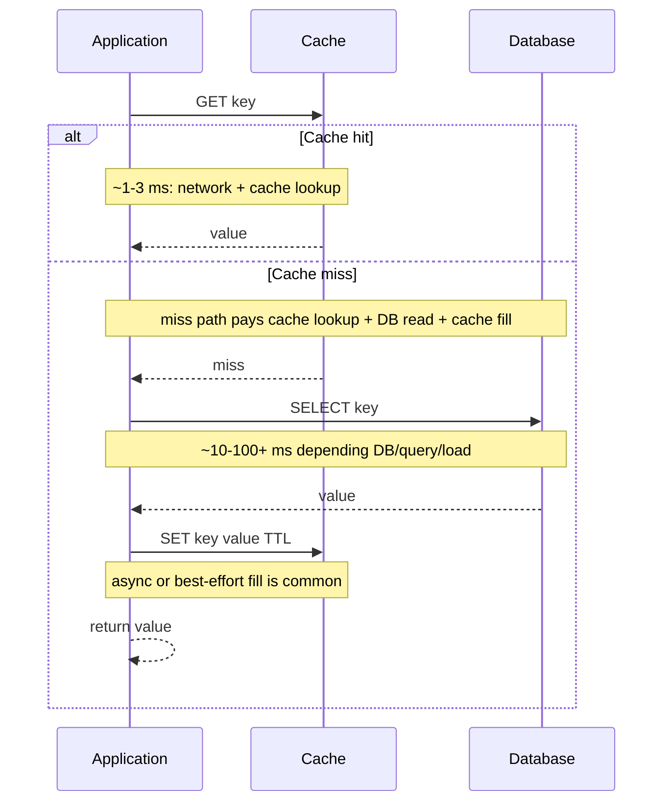

**Use when:** reads dominate, not all data is needed in cache, and the database remains the source of truth.

### Write-Through

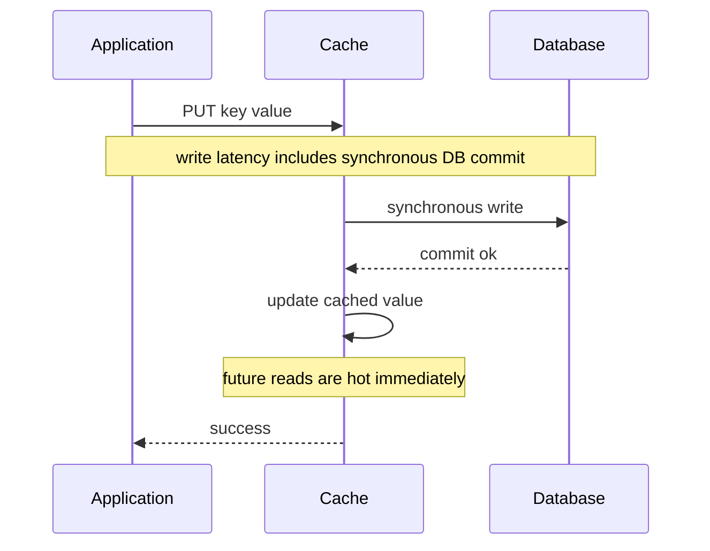

**Use when:** reads often follow writes and write latency can pay the database commit cost.

### Write-Behind

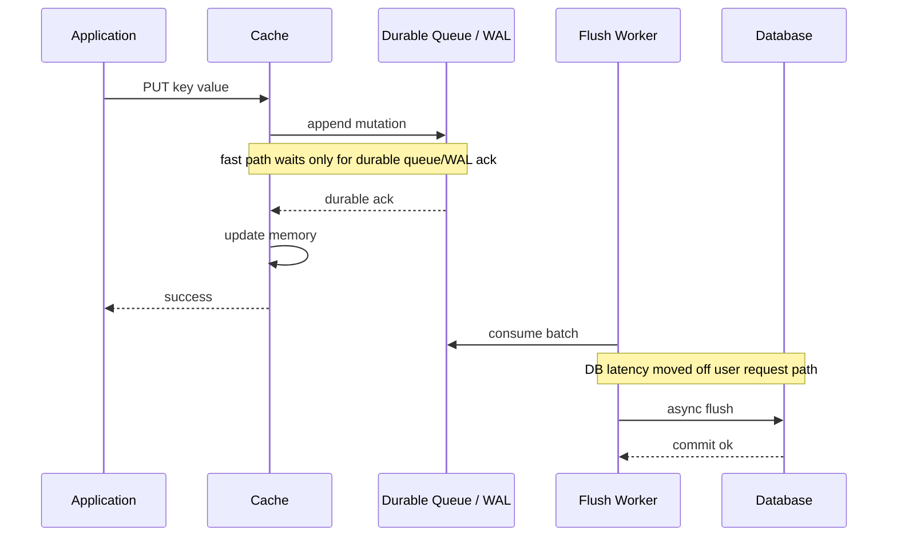

**Use when:** write latency must be very low and you can make the async path durable.

> ⚠️ **Failure mode**  
> Write-behind without a durable queue or write-ahead log can lose acknowledged writes if the cache node crashes before flushing to the database.

### Refresh-Ahead

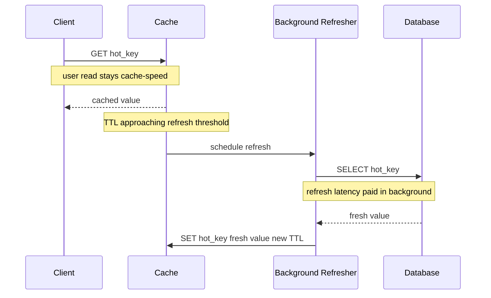

**Use when:** hot keys are predictable and refresh work can be safely done before expiry.

### Latency Shape Under Load

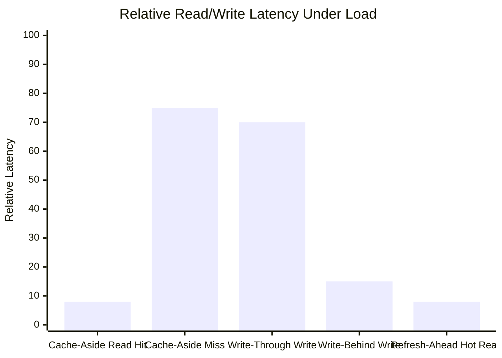

Interpretation:

| Pattern | User-Visible Latency Shape |
|---|---|
| **Cache-aside hit** | One cache round trip |
| **Cache-aside miss** | Cache miss plus database read plus cache fill |
| **Write-through** | Cache write waits for database commit |
| **Write-behind** | User waits for cache update and durable queue/WAL, not database flush |
| **Refresh-ahead** | Hot reads stay fast because refresh work happens before expiry |

---

## 2. Pattern Trade-Off Matrix

| Pattern | Read Latency | Write Latency | Freshness | Data Loss Risk | Complexity |
|---|---|---|---|---|---|
| **Cache-aside** | Fast on hit, slow on miss | Normal DB write | TTL/invalidation dependent | Low if DB writes first | Low |
| **Write-through** | Fast after write | Higher due to sync DB write | Stronger | Low after DB commit | Moderate |
| **Write-behind** | Very fast | Very low | Cache may be ahead of DB | High without durable queue/WAL | High |
| **Refresh-ahead** | Very fast for predicted keys | Usually unchanged | Good for hot keys | Low if DB is source of truth | Moderate |

---

## 3. Facebook-Scale Memcached Blueprint

Facebook used Memcached as a **demand-filled look-aside cache** in front of MySQL. The key design move was keeping Memcached servers simple while pushing routing, batching, retries, and topology awareness into clients and routing layers such as mcrouter.

### Architecture Diagram

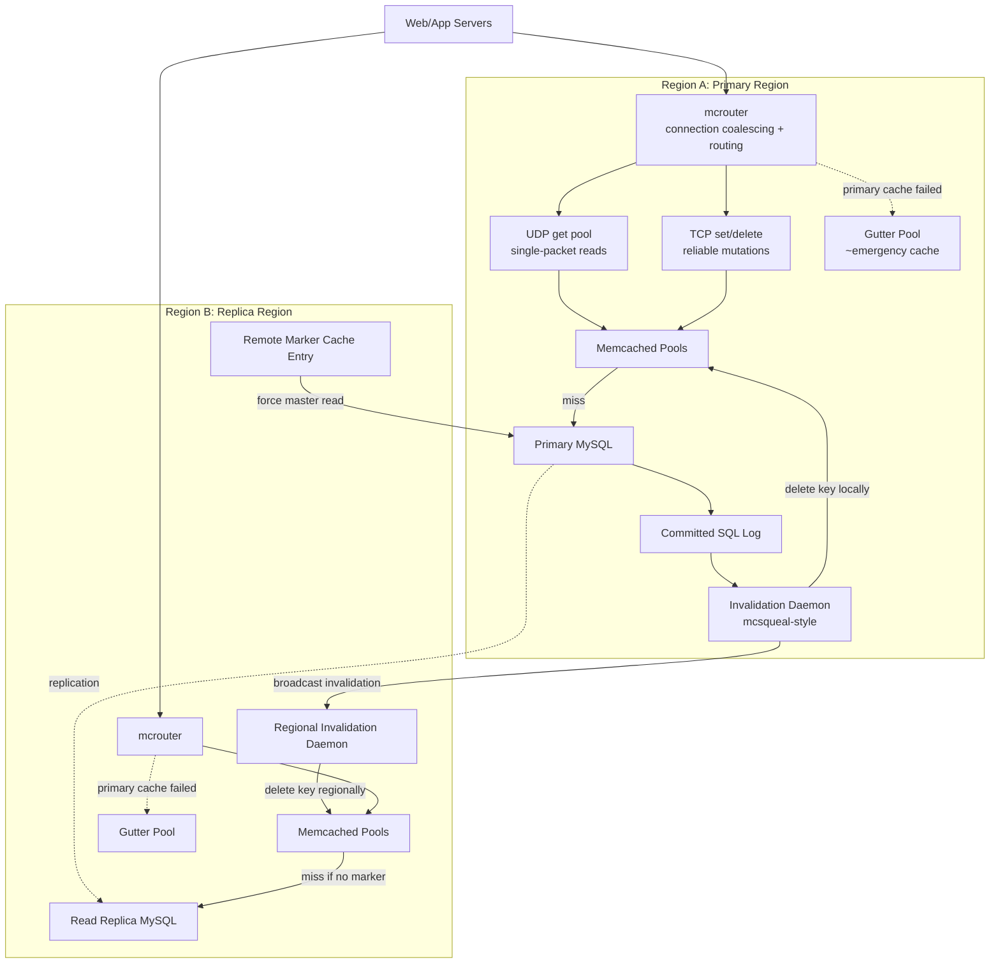

### UDP Gets

UDP gets reduce overhead for read-heavy cache traffic:

| Step | UDP Get Behavior |
|---|---|
| 1 | Client sends a small `get key` request as a UDP datagram |
| 2 | Memcached replies with value if it fits response constraints |
| 3 | If packet is lost, client retries or falls back |
| 4 | Mutations use TCP because `set` and `delete` need reliable delivery |

UDP is useful when the client can tolerate loss by retrying. It is not a correctness mechanism for writes.

### Remote Marker Example

Problem: a user writes in Region B, but Region B's MySQL replica lags behind Region A's primary.

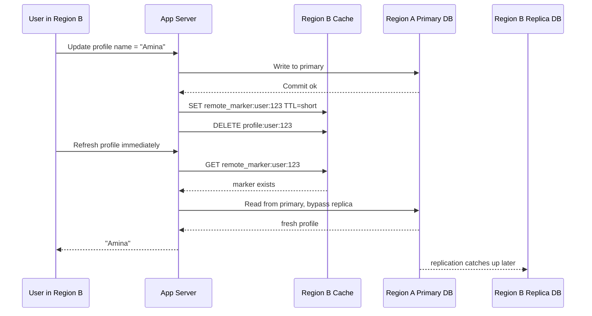

Remote markers make read-your-writes targeted. Only the affected user/key pays the cross-region read cost.

---

## 4. Cache Stampede Visualization

### Without Leases

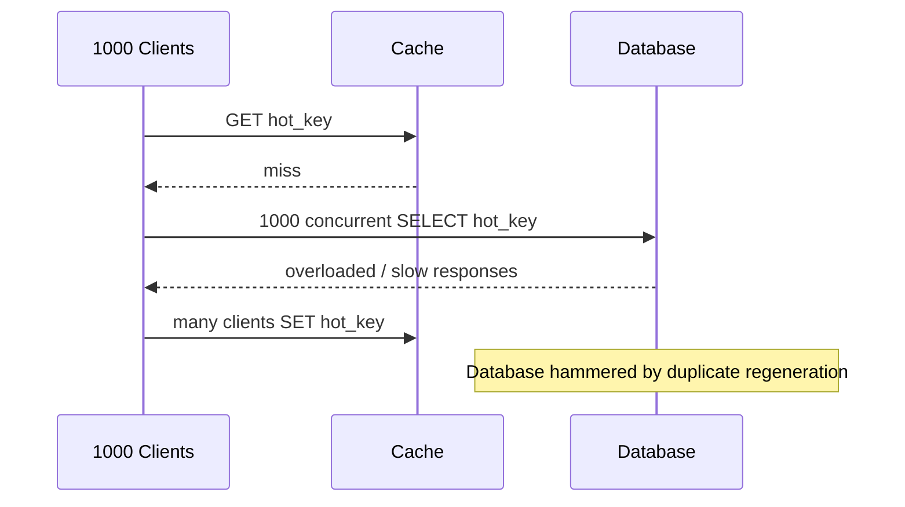

### With Leases

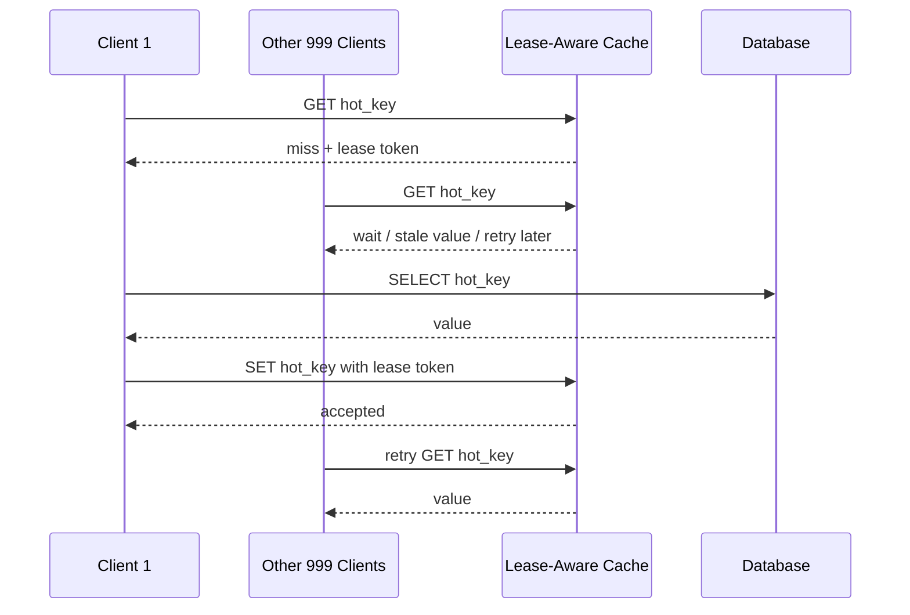

Leases turn 1000 database reads into 1 database read plus 999 waits or stale responses.

---

## 5. Eviction Algorithms

RAM is finite. Eviction decides what survives.

| Policy | Core Idea | Best For | Weakness |
|---|---|---|---|
| **LRU** | Evict least recently used | Temporal locality, general web objects | One-time scans can evict hot items |
| **LFU** | Evict least frequently used | Stable popularity distributions | Old hot keys can linger unless decayed |
| **ARC** | Adaptive Replacement Cache balances recency and frequency | Mixed workloads that shift over time | More complex implementation |
| **FIFO** | Evict oldest inserted | Simple buffers | Ignores access pattern |
| **Random** | Evict random item | Very simple, low metadata | Lower hit ratio |
| **TTL-only** | Expire by time | Correctness/freshness control | Does not respond to memory pressure alone |

### ARC: Adaptive Replacement Cache

ARC tracks both:

- Recently used items.
- Frequently used items.

It adapts between LRU-like and LFU-like behavior based on workload. This helps when a workload alternates between scan-heavy access and stable hot-key access.

### Eviction Behavior Under A Workload Shift

Workload:

1. Repeated hot keys: `A A A B B C A B C`
2. Sudden full-table scan: `D E F G H I J K`
3. Hot keys return: `A B C A B C`

```text
Cache capacity = 3

Before scan:
  LRU: [A B C]   LFU: [A B C]   ARC: [A B C]

During scan D E F G H I J K:
  LRU: [I J K]   scan evicts all hot keys
  LFU: [A B C]   old frequency protects hot keys
  ARC: [A B C]   adapts to protect frequency segment

When hot keys return:
  LRU: misses on A/B/C and must rebuild
  LFU: hits A/B/C, but may retain old hot keys too long after popularity changes
  ARC: usually keeps A/B/C while still adapting if the new pattern persists
```

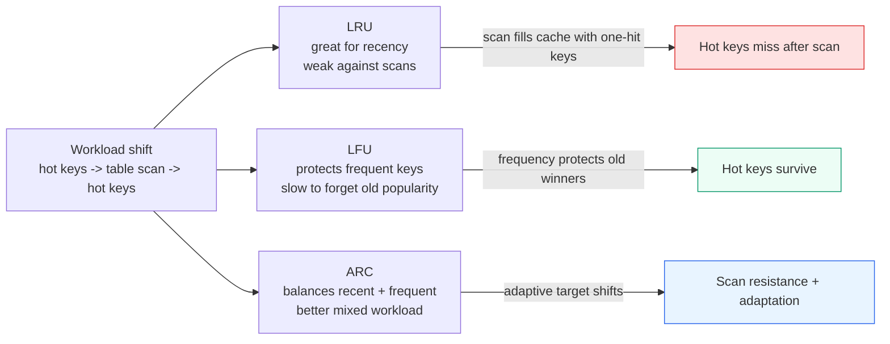

---

## 6. Production Code: Thread-Safe LRU Cache With TTL And Stats

```python
"""
Thread-safe LRU Cache with TTL and Statistics
=============================================

Runtime: Python 3.10+
Dependencies: standard library only

Features:
- O(1) get/put/delete using dict + doubly linked list
- Per-entry TTL
- Thread-safe operations via threading.Lock
- Hit/miss/eviction counters
- Periodic cleanup method for expired entries
"""

from __future__ import annotations

import threading
import time
from dataclasses import dataclass
from typing import Dict, Generic, Optional, TypeVar


K = TypeVar("K")
V = TypeVar("V")


@dataclass
class _Node(Generic[K, V]):
    key: K
    value: V
    expires_at: Optional[float]
    prev: Optional["_Node[K, V]"] = None
    next: Optional["_Node[K, V]"] = None


@dataclass(frozen=True)
class CacheStats:
    hits: int
    misses: int
    evictions: int
    expirations: int
    size: int
    capacity: int
    hit_ratio: float
    miss_ratio: float


class LRUCache(Generic[K, V]):
    def __init__(self, capacity: int, default_ttl_seconds: Optional[float] = None) -> None:
        if capacity <= 0:
            raise ValueError("capacity must be positive")

        self.capacity = capacity
        self.default_ttl_seconds = default_ttl_seconds
        self._items: Dict[K, _Node[K, V]] = {}
        self._lock = threading.Lock()

        self._head: _Node[K, V] = _Node(key=None, value=None, expires_at=None)  # type: ignore[arg-type]
        self._tail: _Node[K, V] = _Node(key=None, value=None, expires_at=None)  # type: ignore[arg-type]
        self._head.next = self._tail
        self._tail.prev = self._head

        self._hits = 0
        self._misses = 0
        self._evictions = 0
        self._expirations = 0

    def get(self, key: K) -> Optional[V]:
        with self._lock:
            node = self._items.get(key)
            if node is None:
                self._misses += 1
                return None

            if self._is_expired(node):
                self._delete_node(node)
                self._misses += 1
                self._expirations += 1
                return None

            self._hits += 1
            self._move_to_front(node)
            return node.value

    def put(self, key: K, value: V, ttl_seconds: Optional[float] = None) -> None:
        with self._lock:
            expires_at = self._compute_expiry(ttl_seconds)
            existing = self._items.get(key)

            if existing is not None:
                existing.value = value
                existing.expires_at = expires_at
                self._move_to_front(existing)
                return

            node = _Node(key=key, value=value, expires_at=expires_at)
            self._items[key] = node
            self._add_to_front(node)

            if len(self._items) > self.capacity:
                self._evict_lru()

    def delete(self, key: K) -> bool:
        with self._lock:
            node = self._items.get(key)
            if node is None:
                return False
            self._delete_node(node)
            return True

    def cleanup_expired(self, max_items: Optional[int] = None) -> int:
        """Remove expired entries.

        Scans from the LRU side first. In production, this can run in a
        background maintenance thread.
        """
        removed = 0
        with self._lock:
            current = self._tail.prev
            while current is not None and current is not self._head:
                previous = current.prev
                if self._is_expired(current):
                    self._delete_node(current)
                    self._expirations += 1
                    removed += 1
                    if max_items is not None and removed >= max_items:
                        break
                current = previous
        return removed

    def stats(self) -> CacheStats:
        with self._lock:
            total = self._hits + self._misses
            hit_ratio = self._hits / total if total else 0.0
            miss_ratio = self._misses / total if total else 0.0
            return CacheStats(
                hits=self._hits,
                misses=self._misses,
                evictions=self._evictions,
                expirations=self._expirations,
                size=len(self._items),
                capacity=self.capacity,
                hit_ratio=hit_ratio,
                miss_ratio=miss_ratio,
            )

    def keys_most_recent_first(self) -> list[K]:
        with self._lock:
            keys: list[K] = []
            current = self._head.next
            while current is not None and current is not self._tail:
                keys.append(current.key)
                current = current.next
            return keys

    def _compute_expiry(self, ttl_seconds: Optional[float]) -> Optional[float]:
        ttl = self.default_ttl_seconds if ttl_seconds is None else ttl_seconds
        if ttl is None:
            return None
        return time.monotonic() + ttl

    @staticmethod
    def _is_expired(node: _Node[K, V]) -> bool:
        return node.expires_at is not None and time.monotonic() >= node.expires_at

    def _move_to_front(self, node: _Node[K, V]) -> None:
        self._remove(node)
        self._add_to_front(node)

    def _add_to_front(self, node: _Node[K, V]) -> None:
        first = self._head.next
        node.prev = self._head
        node.next = first
        self._head.next = node
        if first is not None:
            first.prev = node

    def _remove(self, node: _Node[K, V]) -> None:
        if node.prev is not None:
            node.prev.next = node.next
        if node.next is not None:
            node.next.prev = node.prev
        node.prev = None
        node.next = None

    def _delete_node(self, node: _Node[K, V]) -> None:
        self._remove(node)
        self._items.pop(node.key, None)

    def _evict_lru(self) -> None:
        lru = self._tail.prev
        if lru is None or lru is self._head:
            return
        self._delete_node(lru)
        self._evictions += 1


if __name__ == "__main__":
    cache: LRUCache[str, int] = LRUCache(capacity=2, default_ttl_seconds=1.0)
    cache.put("a", 1)
    cache.put("b", 2)
    assert cache.get("a") == 1
    cache.put("c", 3)
    assert cache.get("b") is None
    time.sleep(1.1)
    assert cache.get("a") is None
    print(cache.stats())
```

### Background Cleanup Thread Example

Lazy expiration on `get` is usually enough for small caches, but large in-process caches often need maintenance so expired items do not occupy memory forever.

```python
from __future__ import annotations

import threading
import time
from typing import TypeVar


K = TypeVar("K")
V = TypeVar("V")


class CacheJanitor:
    def __init__(
        self,
        cache: LRUCache[K, V],
        *,
        interval_seconds: float = 5.0,
        max_items_per_pass: int = 1_000,
    ) -> None:
        self._cache = cache
        self._interval_seconds = interval_seconds
        self._max_items_per_pass = max_items_per_pass
        self._stop = threading.Event()
        self._thread = threading.Thread(target=self._run, name="cache-janitor", daemon=True)

    def start(self) -> None:
        self._thread.start()

    def stop(self) -> None:
        self._stop.set()
        self._thread.join(timeout=self._interval_seconds + 1)

    def _run(self) -> None:
        while not self._stop.wait(self._interval_seconds):
            removed = self._cache.cleanup_expired(max_items=self._max_items_per_pass)
            if removed:
                print(f"cache janitor removed {removed} expired entries")


cache: LRUCache[str, bytes] = LRUCache(capacity=100_000, default_ttl_seconds=60)
janitor = CacheJanitor(cache, interval_seconds=10)
janitor.start()
```

Production note: maintenance threads must be bounded. A cleanup pass that scans millions of keys while holding a lock can create latency spikes worse than the memory waste it is trying to fix.

---

## 7. Cache Warm-Up Strategies

Cold caches are predictable outages in disguise.

| Strategy | How It Works | Use When | Risk |
|---|---|---|---|
| **Precompute hot keys** | Load known hot objects during low traffic | Launch pages, product catalogs, celebrity profiles | Wasted work if predictions are wrong |
| **Analytics-driven prediction** | Use top keys from yesterday, last hour, or seasonal traffic | Stable popularity patterns | Can miss new viral objects |
| **Canary warm-up** | Warm one region/shard first, observe origin pressure, then expand | Deploys and migrations | Slower global readiness |
| **Refresh-ahead** | Refresh keys before TTL expiry | Predictably hot keys with expensive regeneration | Background work can overload origin |
| **Stale restore** | Restore a previous cache snapshot after restart/flush | Large caches where cold start is dangerous | Must avoid restoring invalid or sensitive data |
| **Write-triggered warm-up** | On write, prefill derived read views | Reads frequently follow writes | Write path gets more complex |
| **Tiered warm-up** | Warm L2/shared cache, then local L1 caches | Multi-layer cache systems | Coordination and observability get harder |

> 🧠 **Staff-engineer note**  
> Warm-up jobs need backpressure too. A cache warmer that ignores database health is just a scheduled stampede.

### Simple Analytics-Driven Cache Warmer

```python
from __future__ import annotations

import time
from typing import Callable, Iterable, Protocol


class CacheClient(Protocol):
    def set(self, key: str, value: bytes, ttl_seconds: int) -> None:
        ...


def read_top_keys(path: str, limit: int) -> list[str]:
    with open(path, "r", encoding="utf-8") as file:
        return [line.strip() for line in file if line.strip()][:limit]


def warm_cache_from_top_keys(
    *,
    top_keys_path: str,
    limit: int,
    fetch_from_origin: Callable[[str], bytes | None],
    cache: CacheClient,
    ttl_seconds: int,
    max_origin_qps: float,
) -> None:
    delay = 1.0 / max_origin_qps

    for key in read_top_keys(top_keys_path, limit):
        started = time.monotonic()
        value = fetch_from_origin(key)
        if value is not None:
            cache.set(key, value, ttl_seconds=ttl_seconds)

        elapsed = time.monotonic() - started
        sleep_for = max(0.0, delay - elapsed)
        time.sleep(sleep_for)
```

The warmer is intentionally rate-limited. In production, also stop or slow it when database p99 latency, error rate, or replica lag crosses a threshold.

---

## 8. Crisis Management Decision Flow

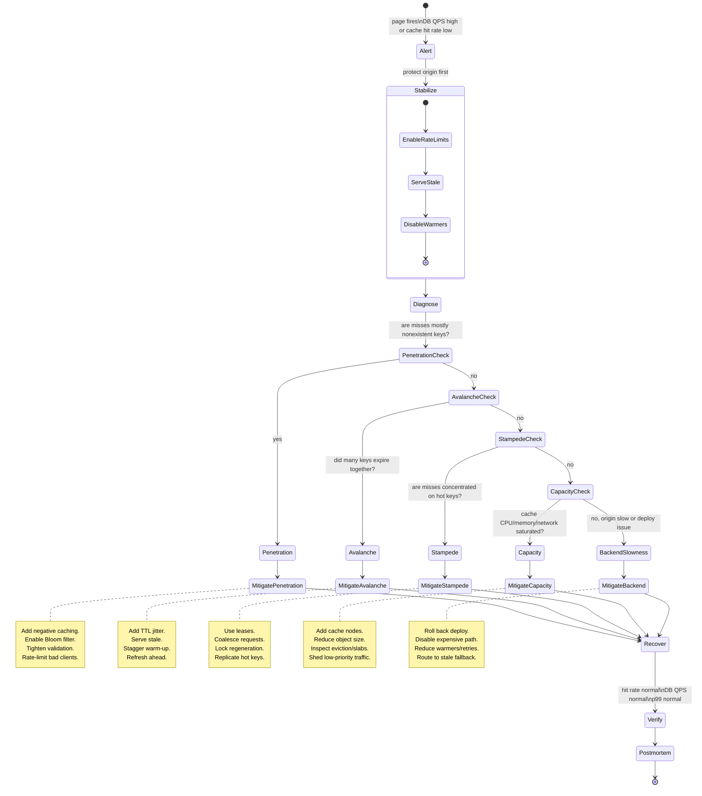

### Crisis Triage Checklist

| Check | Fast Signal | Likely Diagnosis |
|---|---|---|
| Missed keys do not exist in DB | High 404/null lookup rate | Penetration |
| Many TTLs expired in same minute | Miss spike matches TTL boundary | Avalanche |
| One or few hot keys dominate misses | Hot-key dashboard or logs | Stampede |
| Evictions spike while hit rate falls | Memory pressure, slab imbalance, object growth | Capacity |
| Cache hit rate stable but p99 bad | Backend or network path issue | Not a cache miss crisis |
| Warm-up or deploy just started | Origin QPS rises without user traffic rise | Self-inflicted load |

### Cache Penetration

Repeated requests for nonexistent data bypass the cache and hit the database.

Mitigate with:

- Bloom filters.
- Short-lived negative caching.
- Input validation.
- Rate limits.

### Cache Avalanche

Many keys expire at the same time.

Mitigate with:

- Randomized TTL jitter.
- Staggered warm-up.
- Refresh-ahead.
- Serve stale on backend error.

### Cache Stampede

Many clients miss the same hot key simultaneously.

Mitigate with:

- Leases.
- Request coalescing.
- Distributed locks.
- Stale-while-revalidate.
- Hot-key replication.

---

## 9. Design A Cache: Interview Prompt

> **Prompt:** Design a distributed cache for a 10M QPS read-heavy workload with `< 5ms` p99 latency.

### Rubric

| Area | Acceptable Answer | Excellent Answer |
|---|---|---|
| **API** | Supports `get`, `set`, `delete`, TTL | Adds batch get, namespace/versioned keys, compare-and-set where needed, negative caching, and explicit stale reads |
| **Partitioning** | Uses consistent hashing across cache nodes | Adds virtual nodes, weighted nodes, hot-key replication, shard maps, and controlled rebalancing |
| **Replication** | Has replicas or multiple cache pools | Distinguishes cache replication from source-of-truth replication; explains local region reads, cross-region markers, and failure domains |
| **Latency** | Keeps cache in memory and close to callers | Discusses p99 budget, connection pooling, binary protocol, UDP vs TCP trade-offs, kernel/network overhead, and avoiding large values |
| **Consistency** | Uses TTL and invalidation | Explains cache-aside invalidation race, leases, stale-while-revalidate, remote markers, versioned values, and write-through/write-behind trade-offs |
| **Failure handling** | Falls back to database on miss | Protects database with circuit breakers, stale fallback, gutter pools, request coalescing, rate limits, and origin QPS budgets |
| **Eviction** | Chooses LRU or TTL | Compares LRU/LFU/ARC, object size classes, fragmentation, scan resistance, admission policy, and per-tenant fairness |
| **Observability** | Tracks hit rate and latency | Adds miss reason, hot keys, evictions by cause, memory/slab pressure, origin QPS, lease wait time, stale served count, and per-tenant dashboards |
| **Backpressure** | Rate-limits clients | Adds warmer throttling, miss-budget enforcement, fail-open/fail-closed policy, queue limits, and graceful degradation |
| **Security** | Mentions auth and encryption | Adds tenant key isolation, key namespace controls, encryption in transit, abuse prevention, and avoiding sensitive data in shared caches |

### Reference Architecture Sketch

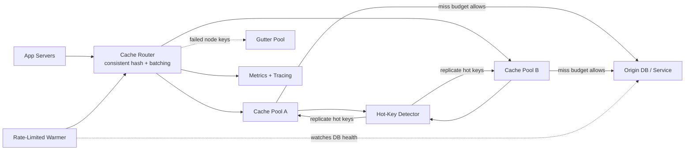

The excellent answer is not "put Redis in front of the DB." It is a design that keeps the origin alive when the cache is cold, partial, overloaded, or wrong.

---

## Mock Questions

<details>
<summary>What are Gutter Servers and how do they prevent cascading failures?</summary>

Gutter servers are a reserve Memcached pool used when primary cache servers fail. Instead of rehashing failed-node keys across the remaining primary cache fleet, clients route those keys to the gutter pool. This prevents healthy cache nodes and databases from being overloaded by displaced hot keys.

</details>

<details>
<summary>How do remote markers maintain cross-regional cache consistency?</summary>

After a remote-region write, the local cache stores a marker for the modified key. If the user immediately reads again, the client sees the marker and bypasses the lagging local replica, routing the read to the primary region. The marker expires once replication is expected to catch up.

</details>

<details>
<summary>Explain UDP versus TCP for Memcached.</summary>

UDP gets avoid connection overhead and can reduce latency for simple cache reads. Lost packets are handled by client retries or fallback. TCP is preferred for mutations such as set/delete because reliable ordered delivery matters for invalidation and correctness.

</details>

<details>
<summary>How do you mitigate penetration, avalanche, and stampede?</summary>

Penetration: Bloom filters, negative caching, validation, rate limits.

Avalanche: TTL jitter, staggered warm-up, refresh-ahead, serve stale.

Stampede: leases, request coalescing, distributed locks, stale-while-revalidate.

The common priority is to protect the database before restoring perfect freshness.

</details>
