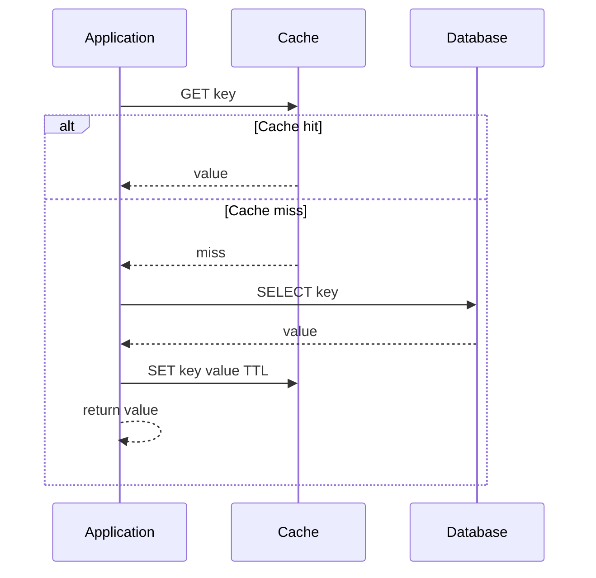
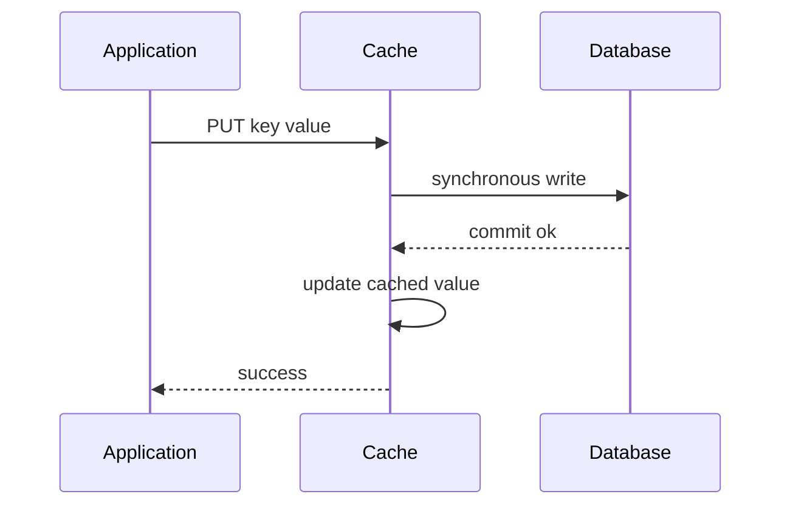
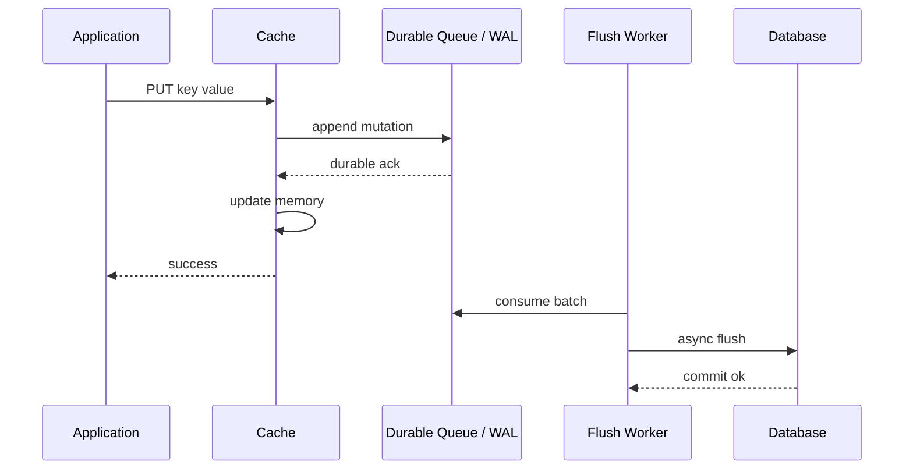
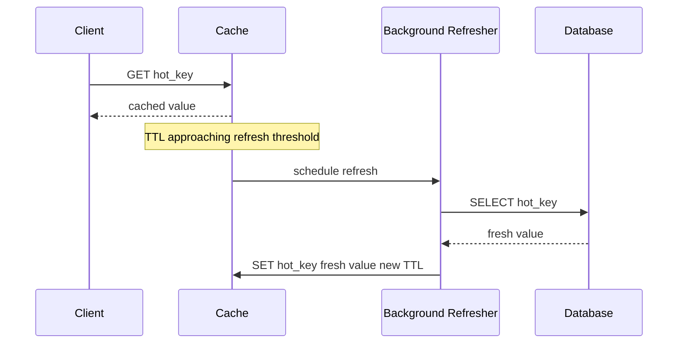
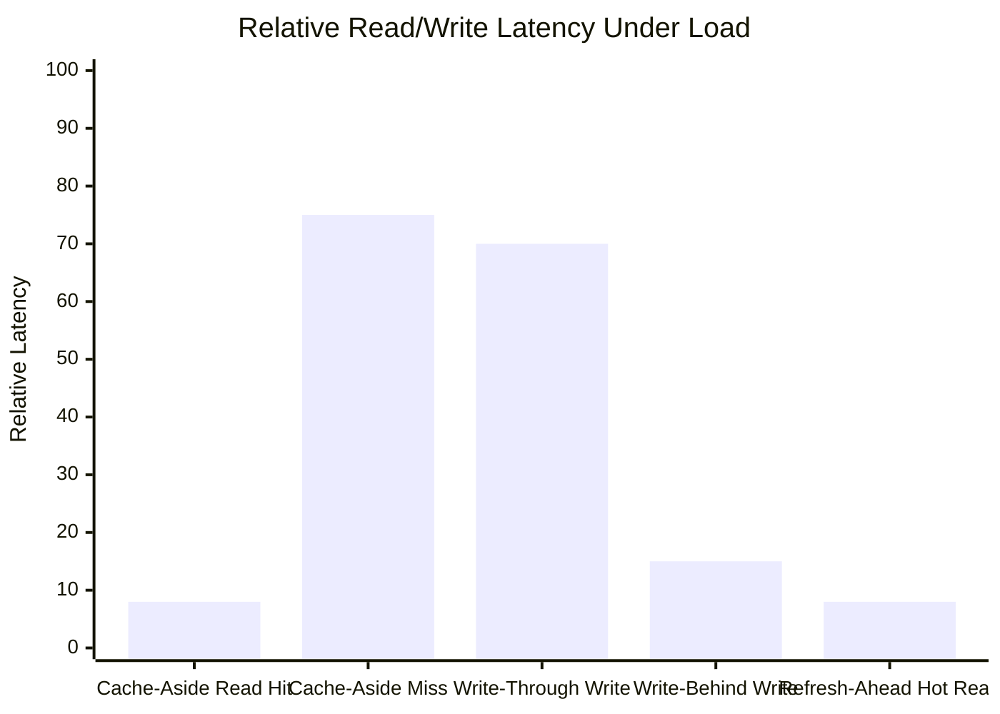
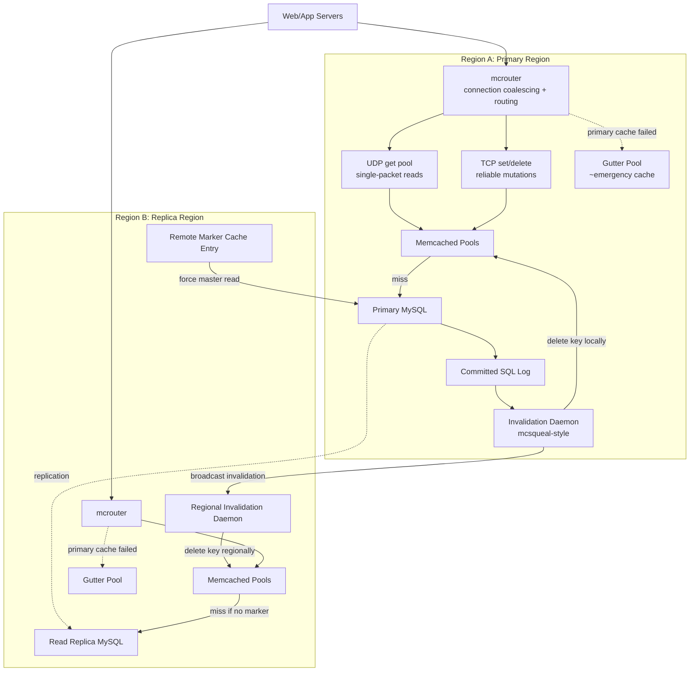
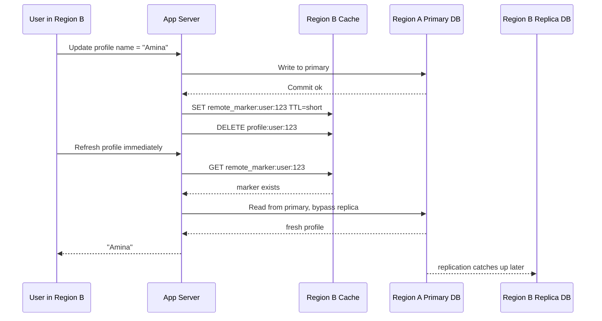
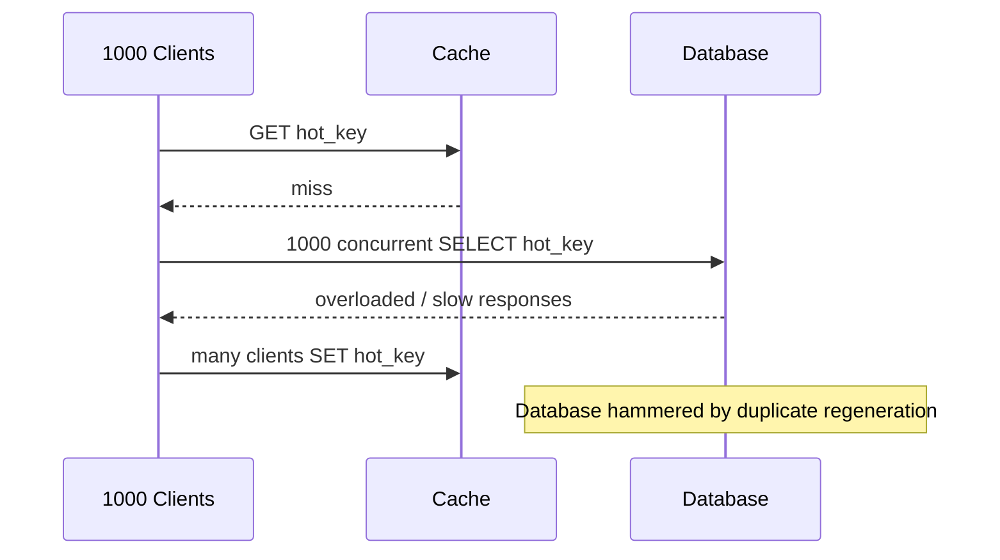
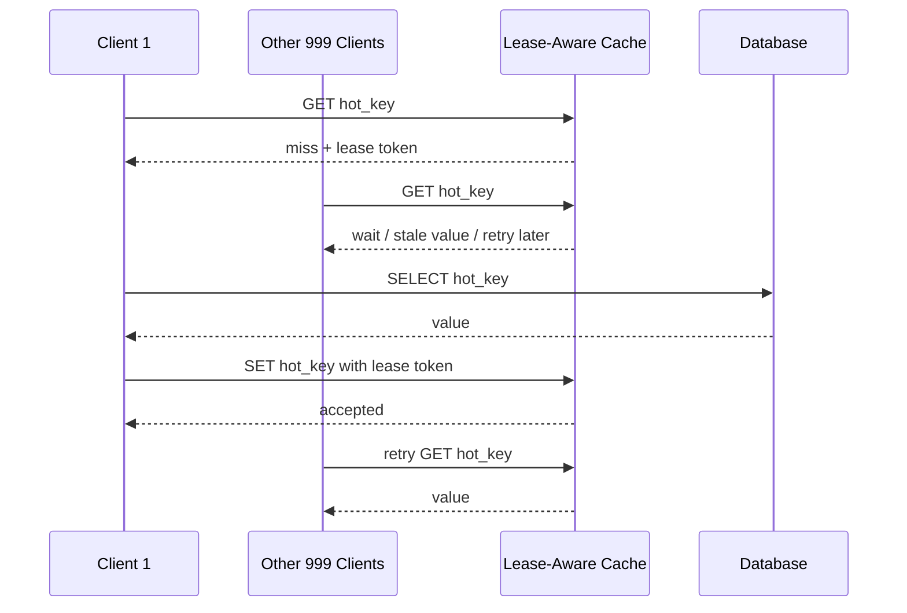
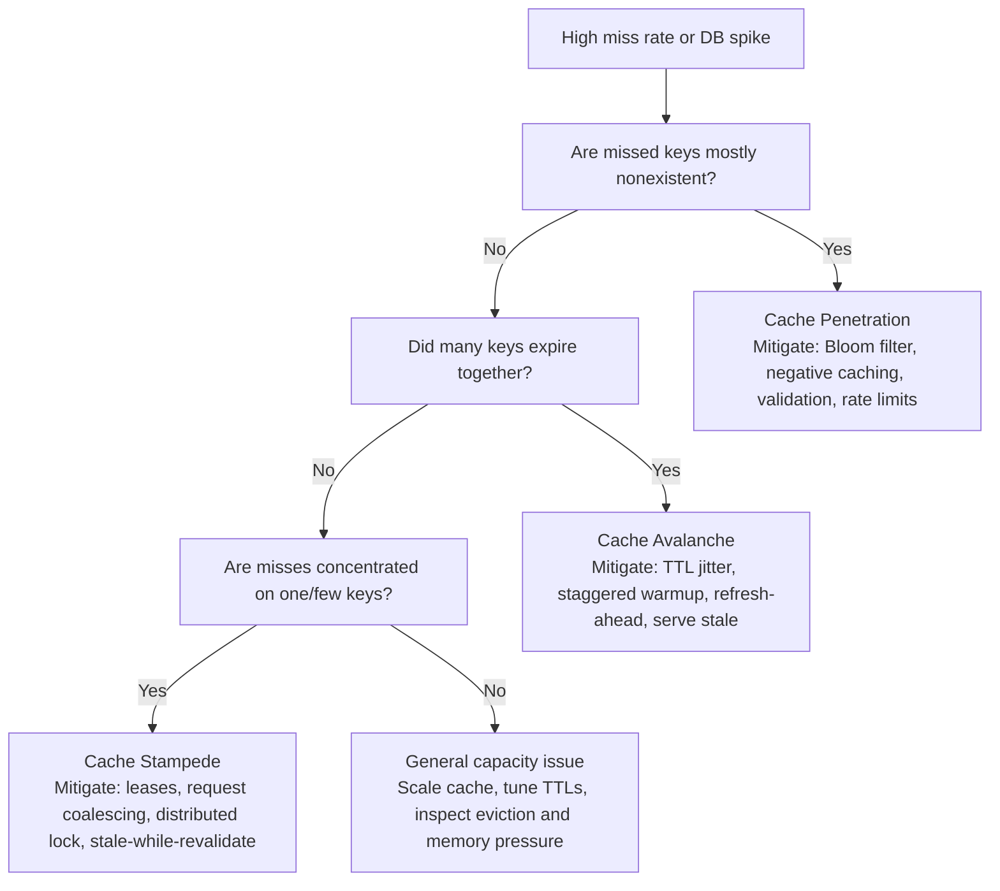

# Module 3: Caching Strategies & Memory Management

Caching is not a performance trick. At scale, it is a distributed systems layer with its own correctness model, memory pressure, invalidation protocol, failure modes, and operational blast radius.

A cache can protect a database from millions of reads per second. It can also destroy the database if hot keys expire together, cache nodes fail, or clients stampede the origin.

This module is a definitive guide to cache mechanics, Facebook-scale Memcached patterns, eviction algorithms, warm-up strategies, and crisis response.

---

## Learning Goals

| Skill | What You Should Be Able To Explain |
|---|---|
| **Cache patterns** | Cache-aside, write-through, write-behind, and refresh-ahead runtime mechanics |
| **Facebook Memcached** | mcrouter, UDP gets, leases, gutter pools, and regional invalidation |
| **Stampede control** | Why leases/request coalescing protect databases |
| **Eviction policy** | LRU, LFU, ARC, TTL, and slab-class trade-offs |
| **Production LRU** | O(1) get/put with TTL, stats, cleanup, and thread safety |
| **Warm-up** | Predict and prefill hot keys before users arrive |
| **Crisis triage** | Diagnose penetration, avalanche, and stampede quickly |

---

## 1. Visual Cache Pattern Comparison

### Cache-Aside



**Use when:** reads dominate, not all data is needed in cache, and the database remains the source of truth.

### Write-Through



**Use when:** reads often follow writes and write latency can pay the database commit cost.

### Write-Behind



**Use when:** write latency must be very low and you can make the async path durable.

> ⚠️ **Failure mode**  
> Write-behind without a durable queue or write-ahead log can lose acknowledged writes if the cache node crashes before flushing to the database.

### Refresh-Ahead



**Use when:** hot keys are predictable and refresh work can be safely done before expiry.

### Latency Shape Under Load



---

## 2. Pattern Trade-Off Matrix

| Pattern | Read Latency | Write Latency | Freshness | Data Loss Risk | Complexity |
|---|---|---|---|---|---|
| **Cache-aside** | Fast on hit, slow on miss | Normal DB write | TTL/invalidation dependent | Low if DB writes first | Low |
| **Write-through** | Fast after write | Higher due to sync DB write | Stronger | Low after DB commit | Moderate |
| **Write-behind** | Very fast | Very low | Cache may be ahead of DB | High without durable queue/WAL | High |
| **Refresh-ahead** | Very fast for predicted keys | Usually unchanged | Good for hot keys | Low if DB is source of truth | Moderate |

---

## 3. Facebook-Scale Memcached Blueprint

Facebook used Memcached as a **demand-filled look-aside cache** in front of MySQL. The key design move was keeping Memcached servers simple while pushing routing, batching, retries, and topology awareness into clients and routing layers such as mcrouter.

### Architecture Diagram



### UDP Gets

UDP gets reduce overhead for read-heavy cache traffic:

| Step | UDP Get Behavior |
|---|---|
| 1 | Client sends a small `get key` request as a UDP datagram |
| 2 | Memcached replies with value if it fits response constraints |
| 3 | If packet is lost, client retries or falls back |
| 4 | Mutations use TCP because `set` and `delete` need reliable delivery |

UDP is useful when the client can tolerate loss by retrying. It is not a correctness mechanism for writes.

### Remote Marker Example

Problem: a user writes in Region B, but Region B's MySQL replica lags behind Region A's primary.



Remote markers make read-your-writes targeted. Only the affected user/key pays the cross-region read cost.

---

## 4. Cache Stampede Visualization

### Without Leases



### With Leases



Leases turn 1000 database reads into 1 database read plus 999 waits or stale responses.

---

## 5. Eviction Algorithms

RAM is finite. Eviction decides what survives.

| Policy | Core Idea | Best For | Weakness |
|---|---|---|---|
| **LRU** | Evict least recently used | Temporal locality, general web objects | One-time scans can evict hot items |
| **LFU** | Evict least frequently used | Stable popularity distributions | Old hot keys can linger unless decayed |
| **ARC** | Adaptive Replacement Cache balances recency and frequency | Mixed workloads that shift over time | More complex implementation |
| **FIFO** | Evict oldest inserted | Simple buffers | Ignores access pattern |
| **Random** | Evict random item | Very simple, low metadata | Lower hit ratio |
| **TTL-only** | Expire by time | Correctness/freshness control | Does not respond to memory pressure alone |

### ARC: Adaptive Replacement Cache

ARC tracks both:

- Recently used items.
- Frequently used items.

It adapts between LRU-like and LFU-like behavior based on workload. This helps when a workload alternates between scan-heavy access and stable hot-key access.

---

## 6. Production Code: Thread-Safe LRU Cache With TTL And Stats

```python
"""
Thread-safe LRU Cache with TTL and Statistics
=============================================

Runtime: Python 3.10+
Dependencies: standard library only

Features:
- O(1) get/put/delete using dict + doubly linked list
- Per-entry TTL
- Thread-safe operations via threading.Lock
- Hit/miss/eviction counters
- Periodic cleanup method for expired entries
"""

from __future__ import annotations

import threading
import time
from dataclasses import dataclass
from typing import Dict, Generic, Optional, TypeVar


K = TypeVar("K")
V = TypeVar("V")


@dataclass
class _Node(Generic[K, V]):
    key: K
    value: V
    expires_at: Optional[float]
    prev: Optional["_Node[K, V]"] = None
    next: Optional["_Node[K, V]"] = None


@dataclass(frozen=True)
class CacheStats:
    hits: int
    misses: int
    evictions: int
    expirations: int
    size: int
    capacity: int


class LRUCache(Generic[K, V]):
    def __init__(self, capacity: int, default_ttl_seconds: Optional[float] = None) -> None:
        if capacity <= 0:
            raise ValueError("capacity must be positive")

        self.capacity = capacity
        self.default_ttl_seconds = default_ttl_seconds
        self._items: Dict[K, _Node[K, V]] = {}
        self._lock = threading.Lock()

        self._head: _Node[K, V] = _Node(key=None, value=None, expires_at=None)  # type: ignore[arg-type]
        self._tail: _Node[K, V] = _Node(key=None, value=None, expires_at=None)  # type: ignore[arg-type]
        self._head.next = self._tail
        self._tail.prev = self._head

        self._hits = 0
        self._misses = 0
        self._evictions = 0
        self._expirations = 0

    def get(self, key: K) -> Optional[V]:
        with self._lock:
            node = self._items.get(key)
            if node is None:
                self._misses += 1
                return None

            if self._is_expired(node):
                self._delete_node(node)
                self._misses += 1
                self._expirations += 1
                return None

            self._hits += 1
            self._move_to_front(node)
            return node.value

    def put(self, key: K, value: V, ttl_seconds: Optional[float] = None) -> None:
        with self._lock:
            expires_at = self._compute_expiry(ttl_seconds)
            existing = self._items.get(key)

            if existing is not None:
                existing.value = value
                existing.expires_at = expires_at
                self._move_to_front(existing)
                return

            node = _Node(key=key, value=value, expires_at=expires_at)
            self._items[key] = node
            self._add_to_front(node)

            if len(self._items) > self.capacity:
                self._evict_lru()

    def delete(self, key: K) -> bool:
        with self._lock:
            node = self._items.get(key)
            if node is None:
                return False
            self._delete_node(node)
            return True

    def cleanup_expired(self, max_items: Optional[int] = None) -> int:
        """Remove expired entries.

        Scans from the LRU side first. In production, this can run in a
        background maintenance thread.
        """
        removed = 0
        with self._lock:
            current = self._tail.prev
            while current is not None and current is not self._head:
                previous = current.prev
                if self._is_expired(current):
                    self._delete_node(current)
                    self._expirations += 1
                    removed += 1
                    if max_items is not None and removed >= max_items:
                        break
                current = previous
        return removed

    def stats(self) -> CacheStats:
        with self._lock:
            return CacheStats(
                hits=self._hits,
                misses=self._misses,
                evictions=self._evictions,
                expirations=self._expirations,
                size=len(self._items),
                capacity=self.capacity,
            )

    def keys_most_recent_first(self) -> list[K]:
        with self._lock:
            keys: list[K] = []
            current = self._head.next
            while current is not None and current is not self._tail:
                keys.append(current.key)
                current = current.next
            return keys

    def _compute_expiry(self, ttl_seconds: Optional[float]) -> Optional[float]:
        ttl = self.default_ttl_seconds if ttl_seconds is None else ttl_seconds
        if ttl is None:
            return None
        return time.monotonic() + ttl

    @staticmethod
    def _is_expired(node: _Node[K, V]) -> bool:
        return node.expires_at is not None and time.monotonic() >= node.expires_at

    def _move_to_front(self, node: _Node[K, V]) -> None:
        self._remove(node)
        self._add_to_front(node)

    def _add_to_front(self, node: _Node[K, V]) -> None:
        first = self._head.next
        node.prev = self._head
        node.next = first
        self._head.next = node
        if first is not None:
            first.prev = node

    def _remove(self, node: _Node[K, V]) -> None:
        if node.prev is not None:
            node.prev.next = node.next
        if node.next is not None:
            node.next.prev = node.prev
        node.prev = None
        node.next = None

    def _delete_node(self, node: _Node[K, V]) -> None:
        self._remove(node)
        self._items.pop(node.key, None)

    def _evict_lru(self) -> None:
        lru = self._tail.prev
        if lru is None or lru is self._head:
            return
        self._delete_node(lru)
        self._evictions += 1


if __name__ == "__main__":
    cache: LRUCache[str, int] = LRUCache(capacity=2, default_ttl_seconds=1.0)
    cache.put("a", 1)
    cache.put("b", 2)
    assert cache.get("a") == 1
    cache.put("c", 3)
    assert cache.get("b") is None
    time.sleep(1.1)
    assert cache.get("a") is None
    print(cache.stats())
```

---

## 7. Cache Warm-Up Strategies

Cold caches are predictable outages in disguise.

| Strategy | How It Works | Risk |
|---|---|---|
| **Precompute hot keys during low traffic** | Load top objects before peak | Wasted work if predictions are wrong |
| **Analytics-driven prediction** | Use yesterday's traffic, seasonality, launches | Can miss new viral objects |
| **Background refresh after deployment** | Repopulate keys after cache flush or release | Can overload origin if not rate-limited |
| **Canary warm-up** | Warm a small shard/region first | Slower global readiness |
| **Stale restore** | Reload previous cache snapshot | Must avoid restoring invalid data |

> 🧠 **Staff-engineer note**  
> Warm-up jobs need backpressure too. A cache warmer that ignores database health is just a scheduled stampede.

---

## 8. Crisis Management Decision Flow



### Cache Penetration

Repeated requests for nonexistent data bypass the cache and hit the database.

Mitigate with:

- Bloom filters.
- Short-lived negative caching.
- Input validation.
- Rate limits.

### Cache Avalanche

Many keys expire at the same time.

Mitigate with:

- Randomized TTL jitter.
- Staggered warm-up.
- Refresh-ahead.
- Serve stale on backend error.

### Cache Stampede

Many clients miss the same hot key simultaneously.

Mitigate with:

- Leases.
- Request coalescing.
- Distributed locks.
- Stale-while-revalidate.
- Hot-key replication.

---

## 9. Design A Cache: Interview Prompt

> **Prompt:** Design a distributed cache for a 10M QPS read-heavy workload with `< 5ms` p99 latency.

In a strong answer, cover:

| Area | Expected Discussion |
|---|---|
| **API** | `get`, `set`, `delete`, batch get, TTL, compare-and-set if needed |
| **Partitioning** | Consistent hashing, virtual nodes, hot-key mitigation |
| **Replication** | Primary/replica cache nodes or client-side multi-read strategy |
| **Latency** | In-memory storage, local region routing, connection pooling, UDP vs TCP trade-offs |
| **Consistency** | Cache-aside invalidation, leases, stale serving, remote markers |
| **Failure handling** | Gutter pools, circuit breakers, fallback to stale, DB protection |
| **Eviction** | LRU/LFU/ARC, TTL, slab classes, memory fragmentation |
| **Observability** | Hit rate, miss rate, evictions, hot keys, p99 latency, backend QPS |
| **Backpressure** | Protect origin when cache is cold or failing |
| **Security** | Tenant isolation, auth, encryption, key namespace controls |

---

## Mock Questions

<details>
<summary>What are Gutter Servers and how do they prevent cascading failures?</summary>

Gutter servers are a reserve Memcached pool used when primary cache servers fail. Instead of rehashing failed-node keys across the remaining primary cache fleet, clients route those keys to the gutter pool. This prevents healthy cache nodes and databases from being overloaded by displaced hot keys.

</details>

<details>
<summary>How do remote markers maintain cross-regional cache consistency?</summary>

After a remote-region write, the local cache stores a marker for the modified key. If the user immediately reads again, the client sees the marker and bypasses the lagging local replica, routing the read to the primary region. The marker expires once replication is expected to catch up.

</details>

<details>
<summary>Explain UDP versus TCP for Memcached.</summary>

UDP gets avoid connection overhead and can reduce latency for simple cache reads. Lost packets are handled by client retries or fallback. TCP is preferred for mutations such as set/delete because reliable ordered delivery matters for invalidation and correctness.

</details>

<details>
<summary>How do you mitigate penetration, avalanche, and stampede?</summary>

Penetration: Bloom filters, negative caching, validation, rate limits.

Avalanche: TTL jitter, staggered warm-up, refresh-ahead, serve stale.

Stampede: leases, request coalescing, distributed locks, stale-while-revalidate.

The common priority is to protect the database before restoring perfect freshness.

</details>
