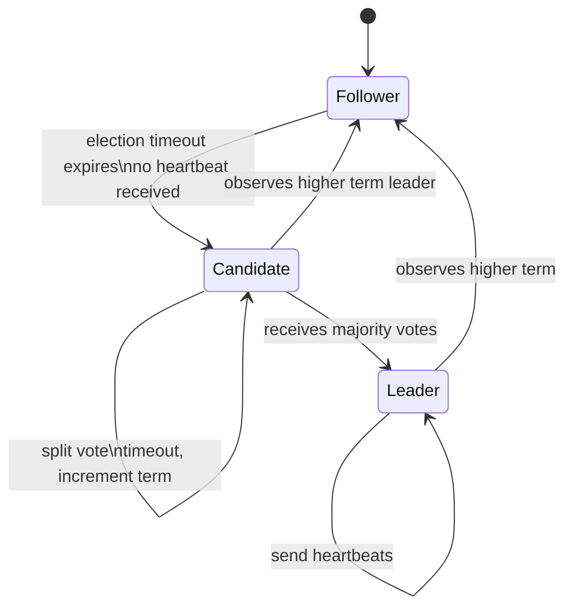
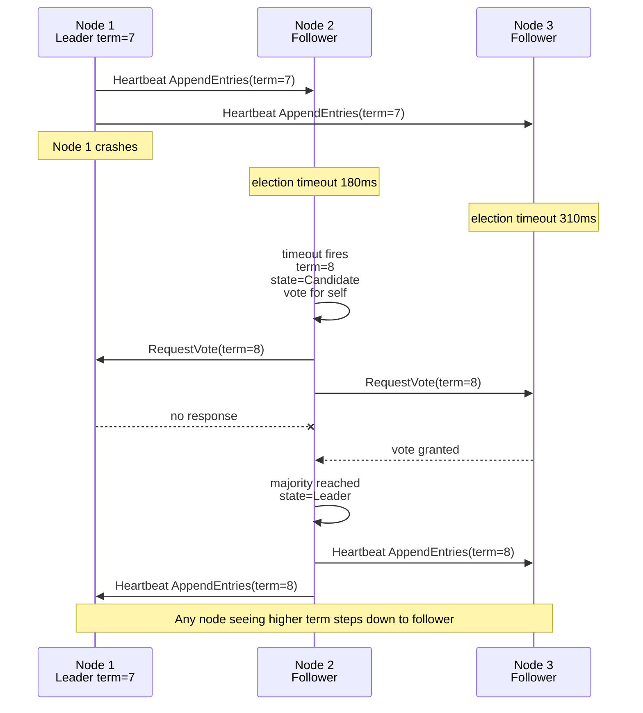
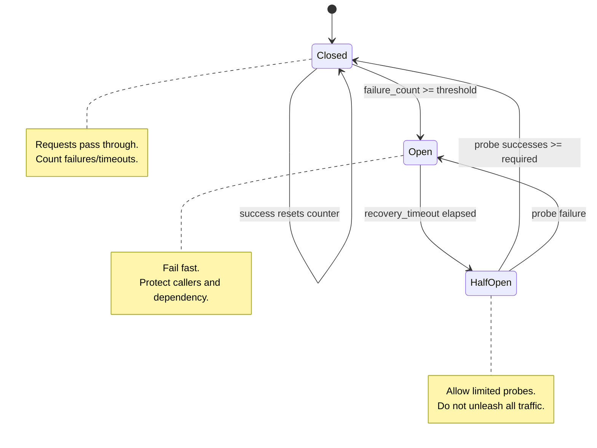
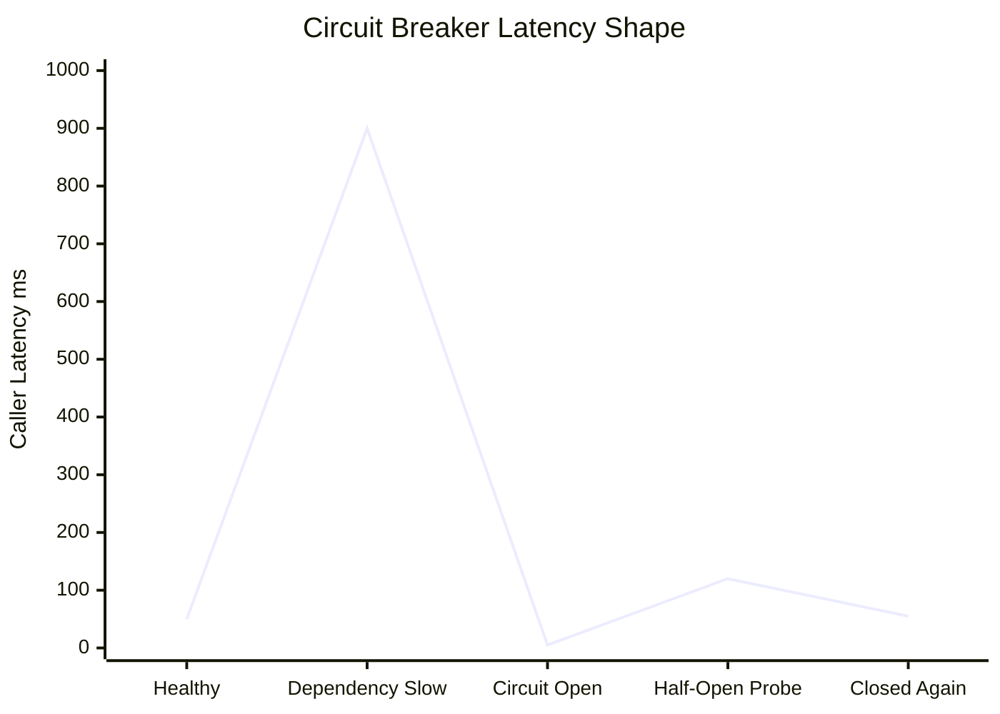

# Module 4: Distributed Systems & Communication

Distributed systems are built on unreliable communication.

Packets drop. DNS fails. Leaders pause. Retries synchronize into storms. A dependency can be healthy from one region and unreachable from another. The goal of distributed communication design is not to remove failure; it is to bound it, observe it, and recover without cascading through the platform.

This module is a practical guide to RPC, serialization, consensus, idempotency, and resilience patterns.

---

## Learning Goals

| Skill | What You Should Be Able To Explain |
|---|---|
| **RPC vs REST** | When to use typed RPC, resource APIs, or persistent streams |
| **Serialization** | Why binary formats reduce CPU and bandwidth at scale |
| **gRPC operations** | Deadlines, retries, health checks, interceptors, and error codes |
| **Raft consensus** | Leader election, terms, heartbeats, and state transitions |
| **Vector clocks** | Detecting concurrent versions and resolving them semantically |
| **Idempotency** | Making retries safe without duplicating business effects |
| **Circuit breakers** | Preventing cascading failures with open/half-open/closed states |
| **Failure testing** | Simulating latency, loss, partitions, and downstream failure |

---

## 1. Protocol Matrix: REST, gRPC, And WebSockets

| Dimension | REST: JSON over HTTP | gRPC: Protobuf over HTTP/2 | WebSockets |
|---|---|---|---|
| **Serialization speed** | Moderate; text parsing costs CPU | High; generated binary encoding | Depends on payload format |
| **Payload size** | Larger due to field names/text | Smaller due to schema tags | Variable |
| **Streaming** | Usually request/response | Unary, server/client streaming, bidirectional | Full-duplex long-lived stream |
| **Browser support** | Excellent | Requires gRPC-Web or gateway | Excellent |
| **Human debuggability** | High | Lower without tooling | Medium |
| **Best external use** | Public APIs and integrations | Controlled partner APIs | Live client sessions |
| **Best internal use** | Simple service APIs | High-throughput typed microservices | Realtime updates, presence, collaboration |

---

## 2. Serialization Format Comparison

| Format | Schema Evolution | Speed | Payload Size | Language Support | Human Readability |
|---|---|---|---|---|---|
| **Protobuf** | Strong field-number based evolution | Very high | Very small | Excellent | Low |
| **Thrift** | Strong IDL evolution | Very high | Very small | Excellent | Low |
| **Avro** | Strong schema evolution, common in data pipelines | High | Small | Strong in data ecosystems | Low to medium with tooling |
| **MessagePack** | Schema optional | High | Small | Broad | Low |
| **JSON** | Flexible but weak contracts | Lower | Larger | Universal | High |

> 🧠 **Staff-engineer note**  
> JSON is often the right public API choice. For internal hot paths, the CPU and bandwidth cost of JSON can become a real capacity problem.

---

## 3. Async gRPC Service Template

The following template shows an async Python gRPC service with:

- `.proto` contract.
- Unary interceptor for logging and metrics.
- Health check service.
- Readiness flag.
- Robust error handling.
- Client retry with exponential backoff and deadline propagation.

Install:

```bash
pip install grpcio grpcio-tools grpcio-health-checking
```

### `user_profile.proto`

```proto
syntax = "proto3";

package userprofile.v1;

service UserProfileService {
  rpc GetUserProfile(GetUserProfileRequest) returns (GetUserProfileResponse);
  rpc UpdateDisplayName(UpdateDisplayNameRequest) returns (UpdateDisplayNameResponse);
}

message GetUserProfileRequest {
  string user_id = 1;
}

message GetUserProfileResponse {
  string user_id = 1;
  string display_name = 2;
  int64 version = 3;
}

message UpdateDisplayNameRequest {
  string user_id = 1;
  string display_name = 2;
  int64 expected_version = 3;
  string idempotency_key = 4;
}

message UpdateDisplayNameResponse {
  string user_id = 1;
  string display_name = 2;
  int64 version = 3;
}
```

Generate stubs:

```bash
python -m grpc_tools.protoc \
  --proto_path=. \
  --python_out=. \
  --grpc_python_out=. \
  user_profile.proto
```

### `server.py`

```python
from __future__ import annotations

import asyncio
import logging
import signal
import time
from dataclasses import dataclass
from typing import Any, Callable, Dict

import grpc
from grpc_health.v1 import health, health_pb2, health_pb2_grpc

import user_profile_pb2
import user_profile_pb2_grpc


LOGGER = logging.getLogger("user-profile")


class NotFoundError(Exception):
    pass


class VersionConflictError(Exception):
    pass


@dataclass
class UserProfile:
    user_id: str
    display_name: str
    version: int


class Metrics:
    def __init__(self) -> None:
        self.requests: Dict[str, int] = {}
        self.errors: Dict[str, int] = {}
        self.latency_seconds: Dict[str, list[float]] = {}

    def record(self, method: str, latency: float, error: str | None) -> None:
        self.requests[method] = self.requests.get(method, 0) + 1
        self.latency_seconds.setdefault(method, []).append(latency)
        if error is not None:
            key = f"{method}:{error}"
            self.errors[key] = self.errors.get(key, 0) + 1


class LoggingMetricsInterceptor(grpc.aio.ServerInterceptor):
    def __init__(self, metrics: Metrics) -> None:
        self._metrics = metrics

    async def intercept_service(self, continuation, handler_call_details):
        handler = await continuation(handler_call_details)
        if handler is None or handler.unary_unary is None:
            return handler

        method = handler_call_details.method
        original = handler.unary_unary

        async def wrapped(request, context):
            start = time.perf_counter()
            error_code = None
            try:
                return await original(request, context)
            except grpc.RpcError as exc:
                error_code = exc.code().name if exc.code() else "UNKNOWN"
                raise
            except Exception:
                error_code = "INTERNAL"
                raise
            finally:
                latency = time.perf_counter() - start
                self._metrics.record(method, latency, error_code)
                LOGGER.info("method=%s latency=%.4fs error=%s", method, latency, error_code)

        return grpc.unary_unary_rpc_method_handler(
            wrapped,
            request_deserializer=handler.request_deserializer,
            response_serializer=handler.response_serializer,
        )


class UserRepository:
    def __init__(self) -> None:
        self._profiles = {
            "user-1": UserProfile("user-1", "Amina", 1),
        }
        self._idempotency: Dict[str, Any] = {}
        self._lock = asyncio.Lock()

    async def get(self, user_id: str) -> UserProfile:
        async with self._lock:
            profile = self._profiles.get(user_id)
            if profile is None:
                raise NotFoundError(user_id)
            return profile

    async def update(self, user_id: str, display_name: str, expected_version: int, idempotency_key: str):
        async with self._lock:
            if idempotency_key in self._idempotency:
                return self._idempotency[idempotency_key]

            profile = self._profiles.get(user_id)
            if profile is None:
                raise NotFoundError(user_id)
            if profile.version != expected_version:
                raise VersionConflictError(f"expected={expected_version} actual={profile.version}")

            updated = UserProfile(user_id, display_name, profile.version + 1)
            self._profiles[user_id] = updated
            self._idempotency[idempotency_key] = updated
            return updated


class UserProfileService(user_profile_pb2_grpc.UserProfileServiceServicer):
    def __init__(self, repository: UserRepository) -> None:
        self._repository = repository

    async def GetUserProfile(self, request, context):
        try:
            if not request.user_id:
                await context.abort(grpc.StatusCode.INVALID_ARGUMENT, "user_id required")

            profile = await self._repository.get(request.user_id)
            return user_profile_pb2.GetUserProfileResponse(
                user_id=profile.user_id,
                display_name=profile.display_name,
                version=profile.version,
            )
        except NotFoundError:
            await context.abort(grpc.StatusCode.NOT_FOUND, "user not found")
        except asyncio.CancelledError:
            raise
        except Exception:
            LOGGER.exception("GetUserProfile failed")
            await context.abort(grpc.StatusCode.INTERNAL, "internal error")

    async def UpdateDisplayName(self, request, context):
        try:
            if not request.user_id or not request.display_name:
                await context.abort(grpc.StatusCode.INVALID_ARGUMENT, "user_id and display_name required")
            if not request.idempotency_key:
                await context.abort(grpc.StatusCode.INVALID_ARGUMENT, "idempotency_key required")

            profile = await self._repository.update(
                request.user_id,
                request.display_name,
                request.expected_version,
                request.idempotency_key,
            )
            return user_profile_pb2.UpdateDisplayNameResponse(
                user_id=profile.user_id,
                display_name=profile.display_name,
                version=profile.version,
            )
        except NotFoundError:
            await context.abort(grpc.StatusCode.NOT_FOUND, "user not found")
        except VersionConflictError as exc:
            await context.abort(grpc.StatusCode.ABORTED, str(exc))
        except asyncio.CancelledError:
            raise
        except Exception:
            LOGGER.exception("UpdateDisplayName failed")
            await context.abort(grpc.StatusCode.INTERNAL, "internal error")


async def serve() -> None:
    logging.basicConfig(level=logging.INFO)
    metrics = Metrics()
    repository = UserRepository()

    server = grpc.aio.server(interceptors=[LoggingMetricsInterceptor(metrics)])
    user_profile_pb2_grpc.add_UserProfileServiceServicer_to_server(
        UserProfileService(repository),
        server,
    )

    health_servicer = health.HealthServicer()
    health_pb2_grpc.add_HealthServicer_to_server(health_servicer, server)
    health_servicer.set("", health_pb2.HealthCheckResponse.SERVING)
    health_servicer.set("userprofile.v1.UserProfileService", health_pb2.HealthCheckResponse.SERVING)

    server.add_insecure_port("[::]:50051")

    stop_event = asyncio.Event()
    loop = asyncio.get_running_loop()
    for sig in (signal.SIGINT, signal.SIGTERM):
        loop.add_signal_handler(sig, stop_event.set)

    await server.start()
    LOGGER.info("gRPC server listening on :50051")
    await stop_event.wait()

    health_servicer.set("", health_pb2.HealthCheckResponse.NOT_SERVING)
    await server.stop(grace=10)


if __name__ == "__main__":
    asyncio.run(serve())
```

### `client_retry.py`

```python
from __future__ import annotations

import asyncio
import random
import time
import uuid

import grpc

import user_profile_pb2
import user_profile_pb2_grpc


RETRYABLE = {
    grpc.StatusCode.UNAVAILABLE,
    grpc.StatusCode.DEADLINE_EXCEEDED,
    grpc.StatusCode.RESOURCE_EXHAUSTED,
}


async def call_with_retry(call_factory, *, total_deadline_seconds: float, max_attempts: int = 4):
    deadline_at = time.monotonic() + total_deadline_seconds

    for attempt in range(1, max_attempts + 1):
        remaining = deadline_at - time.monotonic()
        if remaining <= 0:
            raise TimeoutError("client deadline exhausted before call")

        try:
            return await call_factory(timeout=remaining)
        except grpc.aio.AioRpcError as exc:
            if exc.code() not in RETRYABLE or attempt == max_attempts:
                raise

            backoff = min(1.0, 0.05 * (2 ** (attempt - 1)))
            await asyncio.sleep(random.uniform(0, backoff))


async def main() -> None:
    async with grpc.aio.insecure_channel("localhost:50051") as channel:
        stub = user_profile_pb2_grpc.UserProfileServiceStub(channel)
        request = user_profile_pb2.UpdateDisplayNameRequest(
            user_id="user-1",
            display_name="Amina M.",
            expected_version=1,
            idempotency_key=str(uuid.uuid4()),
        )

        response = await call_with_retry(
            lambda timeout: stub.UpdateDisplayName(request, timeout=timeout),
            total_deadline_seconds=3.0,
        )
        print(response)


if __name__ == "__main__":
    asyncio.run(main())
```

---

## 4. Raft Leader Election

Raft nodes are always in one of three states: follower, candidate, or leader.

### State Transition Diagram



### Election Timeline



Randomized election timeouts reduce simultaneous candidacy and split votes.

---

## 5. Vector Clocks Evolution Example

Two clients update a document during a network partition.

| Step | Actor | Operation | Document Value | Vector Clock |
|---:|---|---|---|---|
| 0 | System | Initial value | `title="Launch"` | `{A:1}` |
| 1 | Client 1 via Node B | Change title | `title="Launch Plan"` | `{A:1, B:1}` |
| 2 | Client 2 via Node C | Add location | `location="Room 9"` | `{A:1, C:1}` |
| 3 | Reader | Reads after partition heals | Sees siblings | `{A:1, B:1}` and `{A:1, C:1}` |
| 4 | App resolver | Semantic merge | `title="Launch Plan", location="Room 9"` | `{A:1, B:1, C:1, R:1}` |

The reader detects concurrency because neither sibling clock dominates the other.

### Calendar Invite Semantic Reconciliation

```python
def merge_calendar_invite(siblings: list[dict], resolver_node: str) -> dict:
    merged = {
        "title": None,
        "location": None,
        "attendees": set(),
        "vector_clock": {},
    }

    for version in siblings:
        if version.get("title"):
            merged["title"] = version["title"]
        if version.get("location"):
            merged["location"] = version["location"]
        merged["attendees"].update(version.get("attendees", []))

        for node, counter in version["vector_clock"].items():
            merged["vector_clock"][node] = max(
                merged["vector_clock"].get(node, 0),
                counter,
            )

    merged["vector_clock"][resolver_node] = merged["vector_clock"].get(resolver_node, 0) + 1
    merged["attendees"] = sorted(merged["attendees"])
    return merged
```

> ⚠️ **Failure mode**  
> Last-write-wins might drop the location or attendee update. Semantic reconciliation preserves user intent when operations are mergeable.

---

## 6. Idempotency In Practice

Retries are mandatory in distributed systems. Idempotency makes retries safe.

### Pattern

1. Client generates a UUID idempotency key.
2. Server starts a transaction.
3. Server checks whether the key already exists.
4. If yes, return the stored response.
5. If no, perform the operation and store the response with the key.
6. Expire idempotency keys after a TTL.

### Relational Table

```sql
CREATE TABLE idempotency_keys (
    key VARCHAR(128) PRIMARY KEY,
    operation VARCHAR(128) NOT NULL,
    request_hash CHAR(64) NOT NULL,
    response_json JSONB NOT NULL,
    status_code INT NOT NULL,
    created_at TIMESTAMP NOT NULL
);

CREATE INDEX idx_idempotency_created_at
ON idempotency_keys (created_at);
```

### When Idempotency Is Not Enough

Idempotency protects duplicate retries of the same operation. It does not make conflicting operations commute.

Examples:

- `set balance = 50` and `withdraw 10` are not interchangeable.
- Two calendar edits may need semantic merge.
- Increment counters can be retried safely only with deduplication or operation IDs.
- External side effects, such as card charges, need provider-level idempotency too.

---

## 7. Circuit Breakers

### State Machine



### Latency Behavior During Recovery



Open circuits return fast errors instead of tying up threads on doomed calls.

---

## 8. Fallacies Of Distributed Computing

| Fallacy | Real-World Incident Shape | Mitigation |
|---|---|---|
| **The network is reliable** | DNS or routing outage makes a healthy region unreachable | Retries, multi-region routing, cached DNS, graceful degradation |
| **Latency is zero** | Cross-region calls turn a 50 ms endpoint into 500 ms p99 | Deadlines, locality, caching, async workflows |
| **Bandwidth is infinite** | Fanout or large JSON payloads saturate links | Compression, pagination, binary serialization, backpressure |
| **The network is secure** | Internal service accepts spoofed traffic | mTLS, authz, network policy, audit logs |
| **Topology does not change** | Autoscaling replaces instances and old IPs fail | Service discovery, health checks, connection draining |
| **There is one administrator** | Cloud, DNS, SaaS, and internal teams have separate control planes | Runbooks, ownership maps, escalation paths |
| **Transport cost is zero** | TLS handshakes and JSON parsing consume CPU under load | Connection pooling, session resumption, efficient serialization |
| **The network is homogeneous** | Mobile, enterprise NAT, and regional networks behave differently | Adaptive timeouts, client telemetry, edge routing |

---

## 9. Fault-Tolerance Patterns

### Exponential Backoff With Jitter

Retries without jitter synchronize clients into waves. Jitter spreads them out.

| Attempt | Base Delay | Full Jitter Range |
|---:|---:|---:|
| 1 | 100 ms | 0-100 ms |
| 2 | 200 ms | 0-200 ms |
| 3 | 400 ms | 0-400 ms |
| 4 | 800 ms | 0-800 ms |

Only retry operations that are safe: reads, idempotent writes, or writes with idempotency keys.

---

## 10. How To Test Distributed Communication

Failure must be tested before production.

### Toxiproxy-Style Failure Injection

Tools such as Toxiproxy sit between client and dependency and inject network faults.

```text
client -> toxiproxy -> dependency
```

Test scenarios:

| Scenario | What To Simulate | Expected Behavior |
|---|---|---|
| **Latency spike** | Add 500 ms delay | Deadlines fire; circuit breaker may open |
| **Packet loss** | Drop 5-20% traffic | Retries with jitter; no retry storm |
| **Connection reset** | Close connections abruptly | Client reconnects; pool recovers |
| **Partition** | Block dependency entirely | Circuit opens; fallback path activates |
| **Slow reads** | Throttle bandwidth | Backpressure and timeout behavior visible |
| **DNS failure** | Return NXDOMAIN or stale IP | Cached DNS or alternate route used |

### Example Commands

```bash
# Conceptual toxiproxy workflow
toxiproxy-cli create user-db -l localhost:15432 -u db.internal:5432
toxiproxy-cli toxic add user-db -t latency -a latency=500 -a jitter=100
toxiproxy-cli toxic add user-db -t timeout -a timeout=2000
```

> 🧠 **Staff-engineer note**  
> A resilience pattern is not real until you have watched it trigger in a controlled failure test.

---

## Mock Questions

<details>
<summary>How do vector clocks handle conflicting versions of a shopping cart?</summary>

Vector clocks attach causal history to each object version. If neither clock dominates, the versions are concurrent siblings. The database should return both to the application, and the application should merge semantically, such as unioning cart items.

</details>

<details>
<summary>What are the trade-offs of last-write-wins?</summary>

Last-write-wins is simple and cheap, but it can silently lose user intent and is vulnerable to clock skew. It is acceptable for ephemeral data, but dangerous for carts, balances, permissions, and collaborative edits.

</details>

<details>
<summary>How does Dynamo use Merkle trees for replica synchronization?</summary>

Merkle trees compare replicas by hashing ranges. Matching root hashes mean ranges match. Differing hashes are recursively compared until only divergent ranges are transferred. This makes anti-entropy repair efficient.

</details>
