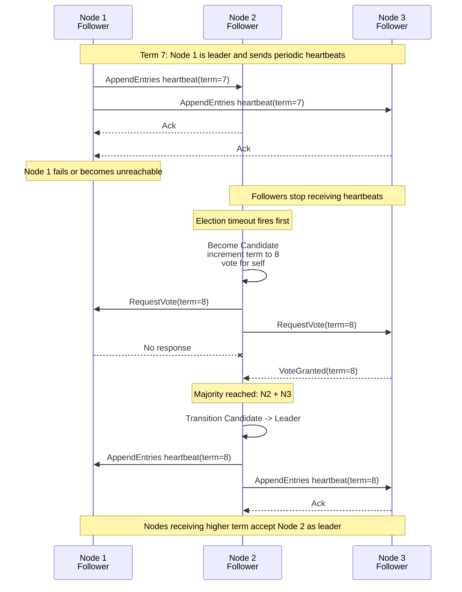

# Module 4: Distributed Systems & Communication

Distributed systems are built on unreliable communication.

Packets can be dropped. Connections can reset. Clocks can drift. Nodes can pause. A service can be healthy from one client and unreachable from another. The job of infrastructure architecture is to make these failures ordinary: detected, bounded, retried, routed around, and never allowed to cascade through the entire platform.

This chapter covers the communication substrate behind high-scale systems: transport protocols, RPC and REST, consensus, fault tolerance, and resilience patterns.

---

## Learning Goals

By the end of this module, you should be able to:

| Skill | What You Should Be Able To Explain |
|---|---|
| **TCP vs. UDP** | How acknowledgments, ordering, retransmission, and flow control change behavior |
| **Latency cost** | Why local datacenter calls and global calls have radically different budgets |
| **RPC vs. REST** | Why internal service calls often use typed binary RPC while public APIs often use REST |
| **Consensus** | How clusters elect leaders and agree on operation order |
| **Vector clocks** | How Dynamo-style systems detect concurrent conflicting versions |
| **Retries** | Why exponential backoff and jitter protect stressed services |
| **Circuit breakers** | How clients stop cascading failures by failing fast |
| **Distributed fallacies** | Which assumptions break when software crosses a network boundary |

---

## 1. Transport Layer Engines

Network protocols define what guarantees an application can assume.

### TCP

**TCP** is connection-oriented and reliable.

Before application data flows, client and server establish a connection. TCP then uses sequence numbers, acknowledgments, checksums, retransmission, and flow control to deliver a byte stream in order.

| Mechanism | Purpose |
|---|---|
| **Three-way handshake** | Establishes a connection before data transfer |
| **Sequence numbers** | Reconstruct ordered byte stream |
| **Acknowledgments** | Tell sender which bytes arrived |
| **Retransmission** | Resend lost segments |
| **Checksums** | Detect corrupted packets |
| **Flow control** | Prevent sender from overwhelming receiver buffers |
| **Congestion control** | Reduce pressure when the network path is saturated |
| **Window sizing** | Controls how much unacknowledged data can be in flight |

TCP is the default choice when correctness requires reliable ordered delivery: HTTP, databases, queues, file transfer, and most RPC systems.

### UDP

**UDP** is connectionless and lightweight.

It sends datagrams without establishing a connection and does not guarantee delivery, ordering, duplicate prevention, or congestion behavior.

| Strength | Cost |
|---|---|
| Lower protocol overhead | Packets can be lost |
| No connection setup | Packets can arrive out of order |
| Useful for latency-sensitive traffic | Application must handle reliability if needed |
| Good for custom protocols | Congestion control is not built in |

UDP is appropriate when late data is worse than lost data, or when the application implements its own reliability model. Examples include live voice, gaming, telemetry, DNS, and QUIC-based transports.

### TCP vs. UDP

| Dimension | TCP | UDP |
|---|---|---|
| **Connection model** | Connection-oriented | Connectionless |
| **Delivery** | Reliable | Best effort |
| **Ordering** | Ordered byte stream | No ordering guarantee |
| **Acknowledgments** | Built in | Not built in |
| **Retransmission** | Built in | Application-defined |
| **Flow control** | Built in | Not built in |
| **Typical use** | HTTP, gRPC, databases, queues | DNS, streaming media, gaming, telemetry |

---

## 2. Latency And Connection Pooling

Latency is bounded by physics, not just code quality.

The System Design Primer's latency numbers make the scale visible:

| Operation | Approximate Cost |
|---|---:|
| Memory reference | Nanoseconds |
| SSD read | Tens to hundreds of microseconds |
| Round trip inside a datacenter | Hundreds of microseconds to low milliseconds |
| Cross-continent round trip | Tens to hundreds of milliseconds |

Within a single datacenter, systems can perform many round trips per second. Globally, a request that crosses oceans spends most of its budget waiting for light, routing, queues, and retransmissions.

### Why Connection Pooling Matters

Creating a new TCP connection repeatedly is expensive.

Each fresh connection can require:

- Socket allocation.
- TCP handshake.
- TLS handshake if encrypted.
- Kernel buffers.
- Congestion window warmup.
- Application authentication.
- Server memory and file descriptors.

**Connection pooling** reuses established connections.

| Benefit | Explanation |
|---|---|
| **Lower latency** | Avoid repeated handshakes |
| **Lower CPU** | Reduce TLS and kernel connection churn |
| **Lower memory pressure** | Bound concurrent open sockets |
| **Better throughput** | Keep warm connections and congestion windows |
| **Safer backpressure** | Pool exhaustion naturally limits outbound concurrency |

Connection pools should be sized deliberately. Too small creates queueing. Too large can overload downstream services.

---

## 3. Protocol Matrix: REST, gRPC, And WebSockets

| Dimension | REST: JSON over HTTP/1.1 or HTTP/2 | gRPC: Protobuf over HTTP/2 | WebSockets |
|---|---|---|---|
| **Serialization Speed** | Moderate; JSON parsing is text-heavy and CPU-expensive at scale | High; Protobuf is compact binary with generated encoders/decoders | Depends on payload; often JSON unless custom binary is used |
| **Payload Size** | Larger; field names and text encoding add overhead | Smaller; schema-based binary fields reduce bytes on wire | Variable; efficient for continuous messages after handshake |
| **Stream Capabilities** | Request/response; HTTP/2 can multiplex but REST APIs are usually unary | Native unary, server streaming, client streaming, and bidirectional streaming | Full-duplex persistent stream |
| **Schema Contract** | Often OpenAPI/JSON Schema, looser by default | Strong `.proto` contract with code generation | Application-defined message protocol |
| **Browser Friendliness** | Excellent | Limited direct browser support without gateways such as gRPC-Web | Excellent |
| **Human Debuggability** | High; easy to inspect JSON | Lower; binary payloads require tooling | Medium; depends on message format |
| **External API Fit** | Strong for public APIs and integrations | Strong for controlled partners or internal APIs with generated clients | Strong for live user-facing sessions |
| **Internal Service Fit** | Good, especially when simplicity matters | Excellent for high-throughput typed microservices | Good for push, presence, collaboration, live events |
| **Best Use Cases** | Public APIs, CRUD resources, broad compatibility | Internal microservices, low-latency RPC, streaming service-to-service calls | Chat, multiplayer, dashboards, notifications, collaborative editing |

### Practical Rule

Use **REST** when interoperability and public API ergonomics matter most.

Use **gRPC** when internal performance, typed contracts, streaming, and code generation matter most.

Use **WebSockets** when the client and server both need to send messages over a long-lived connection.

---

## 4. RPC vs. REST Internals

### RPC

**Remote Procedure Call** makes a remote operation look like a local function call.

The client calls a generated stub. The stub marshals arguments into a request message, sends it over the network, receives a response, and unmarshals the result.

RPC is action-oriented:

```text
UserService.CreateUser(request)
InventoryService.ReserveItem(request)
PaymentService.CapturePayment(request)
```

### REST

**REST** models the world as resources and uses HTTP verbs to operate on them.

REST is resource-oriented:

```text
POST   /users
GET    /users/123
PATCH  /users/123
DELETE /users/123
```

### Why Internal Services Prefer Binary RPC

Big internal systems often choose Protobuf, Thrift, or Avro because they reduce waste at high volume.

| Concern | JSON/REST Cost | Binary RPC Benefit |
|---|---|---|
| **Payload size** | Field names and text values repeat in every message | Compact field tags and binary encoding |
| **CPU cycles** | Text parsing and dynamic object decoding are expensive | Generated encoders/decoders are faster |
| **Schema drift** | Looser contracts can fail at runtime | Versioned schemas and generated clients catch errors earlier |
| **Bandwidth** | Larger payloads increase network cost | Smaller payloads improve throughput |
| **Streaming** | Usually modeled separately | Built into gRPC over HTTP/2 |

REST remains excellent for public APIs because humans, browsers, proxies, API gateways, documentation tools, and third-party integrations understand it well.

### Lesson Plan: RPC vs. REST Operations

| Operation | RPC Abstraction | REST Abstraction |
|---|---|---|
| Signup | `POST /signup` | `POST /persons` |
| Resign | `POST /resign` with `{ "person_id": "1234" }` | `DELETE /persons/1234` |
| Read a person | `GET /readPerson?person_id=1234` | `GET /persons/1234` |
| Read a person's items | `GET /readUsersItemsList?person_id=1234` | `GET /persons/1234/items` |
| Add an item to a person | `POST /addItemToUsersItemsList` with person and item IDs | `POST /persons/1234/items` |
| Update an item | `POST /modifyItem` with item ID and fields | `PATCH /items/456` or `PUT /items/456` |
| Delete an item | `POST /removeItem` with item ID | `DELETE /items/456` |

The teaching distinction: RPC exposes **commands**. REST exposes **resources**.

---

## 5. Production Code Template: Async gRPC Service

The following template shows a production-shaped asynchronous gRPC service in Python.

It includes:

- A `.proto` definition.
- Async server handler logic.
- Deadlines and cancellation awareness.
- Structured error handling.
- Basic validation.
- Graceful shutdown.

### `user_profile.proto`

```proto
syntax = "proto3";

package userprofile.v1;

service UserProfileService {
  rpc GetUserProfile(GetUserProfileRequest) returns (GetUserProfileResponse);
  rpc UpdateDisplayName(UpdateDisplayNameRequest) returns (UpdateDisplayNameResponse);
}

message GetUserProfileRequest {
  string user_id = 1;
}

message GetUserProfileResponse {
  string user_id = 1;
  string display_name = 2;
  int64 version = 3;
}

message UpdateDisplayNameRequest {
  string user_id = 1;
  string display_name = 2;
  int64 expected_version = 3;
}

message UpdateDisplayNameResponse {
  string user_id = 1;
  string display_name = 2;
  int64 version = 3;
}
```

Generation command:

```bash
python -m grpc_tools.protoc \
  --proto_path=. \
  --python_out=. \
  --grpc_python_out=. \
  user_profile.proto
```

### `server.py`

```python
"""
Async gRPC User Profile Service
===============================

Runtime: Python 3.10+
Dependencies:
  pip install grpcio grpcio-tools

Generated files expected:
  user_profile_pb2.py
  user_profile_pb2_grpc.py

This example uses an in-memory repository to keep the template focused on
RPC mechanics. Replace UserRepository with a real database implementation
behind the same async interface.
"""

from __future__ import annotations

import asyncio
import logging
import signal
from dataclasses import dataclass
from typing import Dict

import grpc

import user_profile_pb2
import user_profile_pb2_grpc


LOGGER = logging.getLogger("user-profile-service")


class NotFoundError(Exception):
    pass


class VersionConflictError(Exception):
    pass


@dataclass
class UserProfile:
    user_id: str
    display_name: str
    version: int


class UserRepository:
    """Async repository boundary for user profile storage."""

    def __init__(self) -> None:
        self._profiles: Dict[str, UserProfile] = {
            "user-1": UserProfile(user_id="user-1", display_name="Amina", version=1)
        }
        self._lock = asyncio.Lock()

    async def get(self, user_id: str) -> UserProfile:
        async with self._lock:
            profile = self._profiles.get(user_id)
            if profile is None:
                raise NotFoundError(f"user_id={user_id!r} not found")
            return profile

    async def update_display_name(
        self,
        user_id: str,
        display_name: str,
        expected_version: int,
    ) -> UserProfile:
        async with self._lock:
            profile = self._profiles.get(user_id)
            if profile is None:
                raise NotFoundError(f"user_id={user_id!r} not found")

            if profile.version != expected_version:
                raise VersionConflictError(
                    f"expected version {expected_version}, current version {profile.version}"
                )

            updated = UserProfile(
                user_id=user_id,
                display_name=display_name,
                version=profile.version + 1,
            )
            self._profiles[user_id] = updated
            return updated


def _validate_user_id(user_id: str) -> None:
    if not user_id or len(user_id) > 128:
        raise ValueError("user_id must be non-empty and <= 128 characters")


def _validate_display_name(display_name: str) -> None:
    if not display_name or len(display_name) > 80:
        raise ValueError("display_name must be non-empty and <= 80 characters")


class UserProfileService(user_profile_pb2_grpc.UserProfileServiceServicer):
    def __init__(self, repository: UserRepository) -> None:
        self._repository = repository

    async def GetUserProfile(self, request, context):
        try:
            if not context.time_remaining():
                await context.abort(grpc.StatusCode.DEADLINE_EXCEEDED, "deadline exceeded")

            _validate_user_id(request.user_id)
            profile = await self._repository.get(request.user_id)

            return user_profile_pb2.GetUserProfileResponse(
                user_id=profile.user_id,
                display_name=profile.display_name,
                version=profile.version,
            )

        except ValueError as exc:
            await context.abort(grpc.StatusCode.INVALID_ARGUMENT, str(exc))
        except NotFoundError as exc:
            await context.abort(grpc.StatusCode.NOT_FOUND, str(exc))
        except asyncio.CancelledError:
            LOGGER.info("GetUserProfile cancelled for user_id=%s", request.user_id)
            raise
        except Exception:
            LOGGER.exception("unexpected GetUserProfile failure")
            await context.abort(grpc.StatusCode.INTERNAL, "internal server error")

    async def UpdateDisplayName(self, request, context):
        try:
            _validate_user_id(request.user_id)
            _validate_display_name(request.display_name)

            if request.expected_version <= 0:
                raise ValueError("expected_version must be positive")

            profile = await self._repository.update_display_name(
                user_id=request.user_id,
                display_name=request.display_name,
                expected_version=request.expected_version,
            )

            return user_profile_pb2.UpdateDisplayNameResponse(
                user_id=profile.user_id,
                display_name=profile.display_name,
                version=profile.version,
            )

        except ValueError as exc:
            await context.abort(grpc.StatusCode.INVALID_ARGUMENT, str(exc))
        except NotFoundError as exc:
            await context.abort(grpc.StatusCode.NOT_FOUND, str(exc))
        except VersionConflictError as exc:
            await context.abort(grpc.StatusCode.ABORTED, str(exc))
        except asyncio.CancelledError:
            LOGGER.info("UpdateDisplayName cancelled for user_id=%s", request.user_id)
            raise
        except Exception:
            LOGGER.exception("unexpected UpdateDisplayName failure")
            await context.abort(grpc.StatusCode.INTERNAL, "internal server error")


async def serve() -> None:
    logging.basicConfig(level=logging.INFO)

    repository = UserRepository()
    server = grpc.aio.server(
        options=[
            ("grpc.max_receive_message_length", 4 * 1024 * 1024),
            ("grpc.max_send_message_length", 4 * 1024 * 1024),
        ]
    )

    user_profile_pb2_grpc.add_UserProfileServiceServicer_to_server(
        UserProfileService(repository),
        server,
    )

    listen_addr = "[::]:50051"
    server.add_insecure_port(listen_addr)

    stop_event = asyncio.Event()

    def request_shutdown() -> None:
        LOGGER.info("shutdown requested")
        stop_event.set()

    loop = asyncio.get_running_loop()
    for sig in (signal.SIGINT, signal.SIGTERM):
        loop.add_signal_handler(sig, request_shutdown)

    await server.start()
    LOGGER.info("gRPC server listening on %s", listen_addr)

    await stop_event.wait()
    LOGGER.info("draining gRPC server")
    await server.stop(grace=10)


if __name__ == "__main__":
    asyncio.run(serve())
```

### Production Notes

| Concern | Guidance |
|---|---|
| **Deadlines** | Require clients to set deadlines so calls do not hang forever |
| **Retries** | Retry only idempotent operations or operations with idempotency keys |
| **Status codes** | Use precise gRPC status codes for caller behavior |
| **Message size** | Enforce explicit max send/receive sizes |
| **Auth** | Use mTLS, service identity, and authorization interceptors |
| **Observability** | Emit latency histograms, error codes, deadline exceeded counts, and saturation metrics |

---

## 6. Distributed Consensus

Consensus lets a cluster agree on state despite node failures.

At its core, consensus answers:

- Who is allowed to coordinate writes?
- In what order should operations be applied?
- How does the system continue when a node fails?
- How does it avoid two leaders making conflicting decisions?

### Centralized Coordination: GFS

GFS uses a master for metadata and grants leases to primary chunk replicas.

| Component | Role |
|---|---|
| **Master** | Maintains metadata and grants leases |
| **Primary chunk replica** | Orders mutations for a chunk |
| **Secondary replicas** | Apply mutations in the primary's chosen order |

The master keeps control decisions centralized, while chunkservers move the actual file data.

### Decentralized Coordination: Dynamo

Dynamo avoids a single master. Any eligible node in a key's preference list can coordinate a request.

That improves availability, but concurrent writes can create conflicting versions. Dynamo uses vector clocks to detect whether versions are causally related or concurrent.

### Vector Clocks

A **vector clock** is a set of `(node, counter)` pairs attached to a version.

| Comparison | Meaning |
|---|---|
| Clock A is less than or equal to Clock B for every node | A happened before B |
| Clock B is less than or equal to Clock A for every node | B happened before A |
| Neither dominates | Versions are concurrent siblings |

If two shopping cart versions are concurrent, the database should not blindly discard one. It can return both versions to the application for semantic reconciliation.

---

## 7. Leader Election With Raft

Raft is a consensus algorithm designed to be understandable. It divides nodes into three roles:

| Role | Behavior |
|---|---|
| **Follower** | Responds to leaders and candidates |
| **Candidate** | Requests votes after election timeout |
| **Leader** | Sends heartbeats and coordinates log replication |

### Leader Election Sequence



### Why Heartbeats Matter

Heartbeats are empty or lightweight messages from the leader that say: "I am still leader for this term."

If followers stop receiving heartbeats before their randomized election timeout, they start a new election.

Randomized timeouts reduce the chance that every follower becomes a candidate at the same time.

---

## 8. Fault-Tolerance Patterns

### Retries

Retries are useful for transient failures:

- Packet loss.
- Temporary overload.
- Connection reset.
- Leader failover.
- Rate-limited dependency.

Retries are dangerous when they amplify load on an already failing service.

### Exponential Backoff

**Exponential backoff** increases delay after each failed attempt.

Example:

| Attempt | Base Delay |
|---:|---:|
| 1 | 100 ms |
| 2 | 200 ms |
| 3 | 400 ms |
| 4 | 800 ms |
| 5 | 1600 ms |

### Why Jitter Is Required

Without jitter, thousands of clients can retry in synchronized waves.

If 10,000 clients all fail at the same time and retry at 1s, 2s, 4s, and 8s, the recovering backend gets crushed at exactly those moments.

**Jitter** adds randomness so retries spread out over time.

| Strategy | Behavior |
|---|---|
| **No jitter** | synchronized retry spikes |
| **Equal jitter** | delay is partially randomized |
| **Full jitter** | random delay between `0` and exponential cap |
| **Decorrelated jitter** | next delay depends on previous delay plus randomness |

---

## 9. Fallacies Of Distributed Computing

The classic fallacies are wrong assumptions engineers make when systems cross the network.

| Fallacy | Reality |
|---|---|
| **The network is reliable** | Packets drop, links fail, connections reset |
| **Latency is zero** | Every remote call consumes time budget |
| **Bandwidth is infinite** | Payload size and fanout matter |
| **The network is secure** | Authenticate, authorize, encrypt, and audit |
| **Topology does not change** | Instances, routes, regions, and leaders change |
| **There is one administrator** | Ownership spans teams and vendors |
| **Transport cost is zero** | Serialization, TLS, syscalls, queues, and retries cost CPU |
| **The network is homogeneous** | Clients, regions, protocols, and hardware differ |

The practical lesson: every remote call needs a deadline, retry policy, idempotency story, observability, and fallback behavior.

---

## 10. Circuit Breakers

A **circuit breaker** prevents cascading failures by failing fast when a dependency is unhealthy.

### States

| State | Behavior |
|---|---|
| **Closed** | Requests flow normally |
| **Open** | Requests fail immediately without calling dependency |
| **Half-open** | A limited number of trial requests test recovery |

### Decorator-Style Pseudo-Code

```python
import functools
import time
from enum import Enum


class CircuitState(Enum):
    CLOSED = "closed"
    OPEN = "open"
    HALF_OPEN = "half_open"


class CircuitOpenError(Exception):
    pass


class CircuitBreaker:
    def __init__(
        self,
        failure_threshold: int,
        recovery_timeout_seconds: float,
        half_open_max_calls: int = 1,
    ) -> None:
        self.failure_threshold = failure_threshold
        self.recovery_timeout_seconds = recovery_timeout_seconds
        self.half_open_max_calls = half_open_max_calls
        self.state = CircuitState.CLOSED
        self.failure_count = 0
        self.opened_at = 0.0
        self.half_open_in_flight = 0

    def __call__(self, func):
        @functools.wraps(func)
        def wrapper(*args, **kwargs):
            self._before_call()
            try:
                result = func(*args, **kwargs)
            except Exception:
                self._record_failure()
                raise
            else:
                self._record_success()
                return result

        return wrapper

    def _before_call(self) -> None:
        if self.state == CircuitState.OPEN:
            if time.monotonic() - self.opened_at >= self.recovery_timeout_seconds:
                self.state = CircuitState.HALF_OPEN
                self.half_open_in_flight = 0
            else:
                raise CircuitOpenError("dependency circuit is open")

        if self.state == CircuitState.HALF_OPEN:
            if self.half_open_in_flight >= self.half_open_max_calls:
                raise CircuitOpenError("dependency recovery probe already in flight")
            self.half_open_in_flight += 1

    def _record_success(self) -> None:
        if self.state == CircuitState.HALF_OPEN:
            self.half_open_in_flight = max(0, self.half_open_in_flight - 1)

        self.state = CircuitState.CLOSED
        self.failure_count = 0

    def _record_failure(self) -> None:
        if self.state == CircuitState.HALF_OPEN:
            self.half_open_in_flight = max(0, self.half_open_in_flight - 1)

        self.failure_count += 1
        if self.failure_count >= self.failure_threshold:
            self.state = CircuitState.OPEN
            self.opened_at = time.monotonic()


breaker = CircuitBreaker(failure_threshold=5, recovery_timeout_seconds=30)


@breaker
def call_payment_service(request):
    return payment_client.capture(request)
```

### Circuit Breaker Design Notes

| Concern | Guidance |
|---|---|
| **Failure counting** | Track by dependency and route, not globally |
| **Timeouts** | Timeouts should count as failures |
| **Half-open probes** | Allow only a small number of trial requests |
| **Fallbacks** | Return cached data, degraded responses, or clear errors |
| **Metrics** | Emit state changes, rejected calls, failures, and recovery events |
| **Bulkheads** | Use separate pools so one dependency cannot exhaust all workers |

---

## 11. Interview And Design Review Checklist

Before approving a distributed communication design, ask:

| Question | Why It Matters |
|---|---|
| What is the deadline for every remote call? | Prevents infinite resource retention |
| Are retries bounded and jittered? | Prevents retry storms |
| Are writes idempotent? | Makes safe retries possible |
| Is there a circuit breaker? | Prevents cascading failures |
| Is the protocol appropriate? | Avoids using JSON polling for streaming or gRPC for broad public clients |
| Is serialization cost measured? | Payload size and CPU matter at scale |
| What happens during leader failover? | Consensus transitions affect availability |
| How are conflicting versions detected? | AP systems need reconciliation |
| What metrics prove health? | Latency, saturation, errors, and retries reveal failure early |

---

## Mock Questions

<details>
<summary>How do vector clocks handle conflicting versions of a shopping cart?</summary>

Vector clocks attach causal history to each object version as `(node, counter)` pairs.

If version A's vector clock is less than or equal to version B's vector clock for every node, then A causally happened before B and can be superseded by B.

If neither vector clock dominates the other, the versions are concurrent siblings. For a shopping cart, that can happen when two replicas accept different updates during a network partition.

The database should return both versions to the application. The application then performs semantic reconciliation, usually by merging cart items rather than discarding one version. After merging, the application writes back a new version whose vector clock supersedes both siblings.

</details>

<details>
<summary>What are the trade-offs of using last-write-wins reconciliation?</summary>

Last-write-wins is simple and cheap. It stores one version, avoids surfacing conflicts to the application, and keeps reads easy.

The cost is silent data loss. If two clients update the same shopping cart during a partition, whichever write has the later timestamp wins, even if both updates were meaningful. Clock skew can also choose the wrong winner.

Last-write-wins is acceptable for data where overwriting is harmless, such as ephemeral presence or some caches. It is dangerous for carts, balances, collaborative edits, permissions, and user-generated data where intent must be preserved.

</details>

<details>
<summary>How does Dynamo use Merkle trees for replica synchronization?</summary>

Dynamo uses Merkle trees to compare replicas efficiently without transferring every key.

A Merkle tree hashes data at the leaves and then hashes those hashes up the tree. Two replicas can compare root hashes. If the root hashes match, their data ranges match. If the roots differ, the replicas recursively compare child hashes until they identify the specific ranges that diverged.

This makes anti-entropy repair efficient because nodes exchange only hashes for most of the comparison and transfer actual object data only for ranges that differ.

Merkle trees are especially useful in large key-value stores because full replica comparison would be too expensive in network bandwidth, disk reads, and CPU.

</details>
