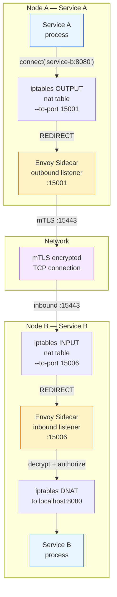
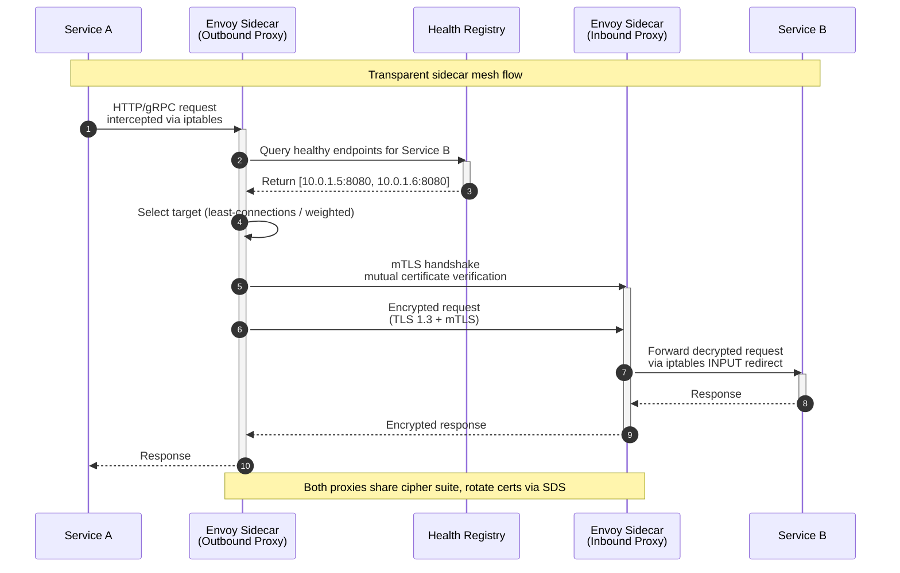

# Module 6: Service Discovery & Service Mesh

Service discovery and service mesh are the connective tissue of a distributed system. Without them, microservices become a "death star" of hardcoded IPs, cascading failures, and brittle point-to-point wiring. This module transitions from simple registry-based discovery into the world of transparent sidecar proxies, mTLS mesh communication, and infrastructure-level traffic control.

---

## Table of Contents

- [1. Client-Side vs. Server-Side Discovery](#1-client-side-vs-server-side-discovery)
- [2. Service Mesh Architecture](#2-service-mesh-architecture)
- [3. Dynamic Routing & Mesh Balancing](#3-dynamic-routing--mesh-balancing)
- [4. Real-World Failure Modes](#4-real-world-failure-modes)
- [5. Production Code Template: Weighted Least-Connections Router](#5-production-code-template-weighted-least-connections-router)
- [6. FAANG Interview Challenges](#6-faang-interview-challenges)
- [7. Common Mistakes](#7-common-mistakes)
- [8. Key Takeaways](#8-key-takeaways)
- [9. Self-Assessment Questions](#9-self-assessment-questions)

---

## 1. Client-Side vs. Server-Side Discovery

In a distributed environment, services are ephemeral—they scale out, die, and move to new IP addresses constantly. Hardcoded IPs are not viable. A **dynamic service registry** provides the source of truth for where every service instance lives.

To understand why this matters, think about what happens without it: you deploy a new version of `Service B`, the old instances shut down, new instances spin up on different IPs, and `Service A` — still holding the old IP — starts sending requests into a black hole. A service registry eliminates this by giving every consumer a live, authoritative answer to the question "where is my dependency right now?"

### Step-by-Step Connection Lifecycle

**Client-Side Discovery** (e.g., `Eureka`, `Consul`, `Zookeeper`):

1. **Registration** — When `Service B` starts, it registers its name and current `IP:port` with the service discovery registry.
2. **Query** — When `Service A` needs `Service B`, its code (via a client library) queries the registry directly for the location of `Service B`.
3. **Selection** — The registry returns a list of all healthy `IP:port` pairs. `Service A` selects one (often via internal load-balancing logic like round-robin or least-connections) and executes the call.

The key architectural property here is that the client is smart — it carries a library that understands the registry protocol, handles caching of the address list, and implements its own load-balancing strategy. This spreads the routing intelligence across every service instance, which eliminates central bottlenecks but also means every service must be updated when the discovery protocol changes.

**Server-Side Discovery** (e.g., `AWS ALB`, `Kubernetes kube-proxy`):

1. **Registration** — `Service B` instances register with a central load balancer or an orchestrator's internal registry (like Kubernetes' `etcd`).
2. **Abstraction** — `Service A` calls a stable, static endpoint (a load balancer VIP or a DNS name like `service-b.prod.svc.cluster.local`).
3. **Routing** — The load balancer intercepts the request, queries its internal membership list, and forwards the packet to a healthy `Service B` instance.

Here the client is dumb — it just sends traffic to a fixed address. All the routing intelligence lives in the infrastructure layer. This makes it easier to evolve the client (it never changes) but introduces a potential single point of failure and an extra network hop.

### Dynamic Health-Checking Registries

Continuous health checks prevent routing to "zombie" or dead instances. The registry pings each instance at a configured interval (e.g., an HTTP `/health` endpoint) with a configurable timeout and failure threshold. If an instance fails `N` consecutive checks, the registry marks it unhealthy and stops returning its address to callers. The instance is also removed from the load balancer's rotation if server-side discovery is used.

The critical detail is that health checks must be **external** — the registry probes the instance from outside, not the instance reporting its own health. This catches cases where the instance is alive but unable to serve traffic (stuck on a deadlock, out of database connections, or in a corrupted state).

### The Real-World Analogy: The Smart Hotel Lobby

Imagine a hotel where guests (services) are constantly checking in and out of different rooms.

- **Traditional system** — a printed directory. If a guest moves rooms, the directory is wrong, and you knock on a door where someone else is sleeping (a "zombie" instance).
- **Service Registry** — a live digital dashboard in the lobby. Every time a guest moves, they tell the front desk. When you want to find "Guest B," you check the dashboard for their current room number before walking to the elevator.

### Extended Analogy: The Hotel with Key Cards and "Do Not Disturb"

Let's extend the hotel analogy to cover mesh security and circuit breaking.

The **front desk** is your **Control Plane** (Istiod). It knows which guests are checked in, what floor each guest is on, and whether a guest has a "Do Not Disturb" sign on the door.

- **Key cards (certificates):** When a guest checks in, the front desk issues a digital key card that is cryptographically signed. To open another guest's door, you must present a valid key card issued by the same front desk. This is **mTLS** — only services with certificates signed by the mesh's Certificate Authority can talk to each other.
- **"Do Not Disturb" (circuit breaker):** If a guest is too hungover to answer the door (a service is failing or overloaded), they flip the "Do Not Disturb" switch. The front desk stops sending visitors to that room for a configurable period. The visitors get a polite "guest is unavailable" response instead of standing in the hallway pounding on the door (wasting resources on timeout retries).
- **Room forwarding (traffic splitting):** The front desk can tell visitors "90% of you go to Room 301 (v1), 10% go to Room 302 (v2)" — a canary deployment at the infrastructure layer.

### Client-Side vs. Server-Side Discovery Matrix

| Dimension | Client-Side Discovery | Server-Side Discovery |
|---|---|---|
| **Routing Point** | Client library embedded in the application | Centralized load balancer / reverse proxy |
| **Network Hops** | Direct client-to-server (one hop) | Client → LB → server (two hops) |
| **Latency Profile** | Lowest; no intermediary | Higher; LB adds parsing and forwarding time |
| **API Gateway Dependency** | Not required; client resolves and calls directly | Required; all traffic must pass through the gateway |
| **Complexity** | Higher in the client (must embed registry-aware libraries) | Higher in the infrastructure (LB maintenance, scaling, TLS termination) |
| **Typical Stacks** | `Netflix Eureka`, `Consul`, `Zookeeper` + client library | `AWS ALB/NLB`, `Kubernetes kube-proxy`, `HAProxy`, `NGINX` |

---

## 2. Service Mesh Architecture

A **service mesh** is a dedicated infrastructure layer for service-to-service communication. It moves the "intelligence" of the network from application code into the infrastructure itself. Instead of each service embedding a client library for discovery, load balancing, retries, and observability, the mesh provides these capabilities as a transparent proxy sidecar that intercepts all network traffic.

### Control Plane vs. Data Plane

| Component | Role | Examples |
|---|---|---|
| **Data Plane** | High-performance proxies deployed as sidecars alongside every service instance. They intercept, route, and secure every packet entering or leaving the service. | `Envoy`, `Linkerd-proxy`, `nginx mesh` |
| **Control Plane** | The brain of the mesh. It does not touch data packets. It provides the source of truth for proxies—pushing routing rules, security policies, and service locations. | `Istiod` (Istio), `Consul Connect`, `Kuma CP` |

Think of the Data Plane as the **muscle** (fast, distributed, handles every packet) and the Control Plane as the **brain** (slow, centralized, handles configuration). The brain tells the muscles what to do; the muscles do the actual work without waiting for the brain on every decision.

### Transparent Interception (iptables)

The sidecar model is powerful because it is **transparent**. The application code believes it is talking to the network normally, but an `Envoy` proxy intercepts all inbound and outbound Layer 7 traffic via `iptables` rules. The application never knows the mesh exists.

Here is how the packet flow works in detail:

```
Service A process
       |
       | (1) Application calls connect("service-b:8080")
       |     Kernel resolves DNS, prepares TCP SYN
       v
  (2) iptables OUTPUT chain (nat table)
       Rule: --dst-port 8080 --protocol tcp
             -j REDIRECT --to-port 15001
       |
       v
  Envoy Sidecar (outbound listener on :15001)
       |
       | (3) Envoy receives the redirected SYN packet.
       |     It looks up the original destination (service-b:8080)
       |     from the SO_ORIGINAL_DST socket option.
       |
       | (4) Envoy applies mesh policies:
       |     - Service discovery lookup
       |     - mTLS handshake with target sidecar
       |     - Circuit breaker check
       |
       v
  (5) Encrypted TCP connection to:
       Service B's node IP : 15443 (inbound listener)
       |
       v
  (6) iptables INPUT chain on Service B's node
       Rule: --dst-port 15443 -j REDIRECT --to-port 15006
       |
       v
  Envoy Sidecar (inbound listener on :15006)
       |
       | (7) Envoy terminates mTLS, verifies client certificate,
       |     applies authorization policies, then forwards:
       v
  (8) iptables redirects to localhost:8080
       |
       v
  Service B process (sees the connection as coming from localhost)
```

#### iptables Packet Flow Diagram



*Complete iptables packet interception flow. The application process calls `connect()` normally; `iptables` `REDIRECT` rules in the `nat` table transparently steer the TCP connection into the Envoy sidecar's listener. The outbound sidecar encrypts with mTLS and forwards to the target node, where the inbound sidecar's `iptables` rule intercepts the packet, terminates TLS, and forwards to the target application process. Neither application knows the proxy exists.*

### What Happens in Production: Netflix's Migration from Eureka to Envoy

Netflix was one of the earliest adopters of client-side discovery with **Eureka** (their own open-source registry). Every Netflix service embedded the Eureka client library, which cached the full registry of thousands of service instances in memory and performed client-side load balancing. This worked for years at massive scale, but several pain points drove the migration toward a mesh architecture.

**The pain points:**

- **Library version fragmentation:** Every service had its own version of the Eureka client library. Upgrading to support a new discovery feature required coordinating upgrades across hundreds of service teams. Some teams lagged by years, leading to hard-to-diagnose interop bugs.
- **Language lock-in:** The Eureka client was a Java library. Teams adopting Node.js, Python, or Go had to reimplement the client protocol from scratch — each with their own bugs, timing issues, and missing features.
- **TLS rollout was painful:** Adding mTLS between services required every application to manage certificates, which meant another library integration per language.
- **Operational blindness:** Each service emitted metrics independently, but correlating a request across services required stitching together logs from different systems with different timestamp granularities.

**The migration strategy:**

Netflix moved gradually, first adopting an **Envoy sidecar** alongside Eureka (not replacing it overnight). The sidecar initially handled only observability and traffic encryption, while Eureka continued to own discovery. Over time, the sidecar took on more responsibilities — health checking, circuit breaking, and eventually discovery itself via the control plane.

The result was a uniform, language-agnostic infrastructure layer where upgrading TLS ciphers, adding retry budgets, or rolling out new routing rules required changing **one** component (the sidecar config) instead of **hundreds** of microservice codebases.

### mTLS Handshake & Sidecar Proxy Flow



*The diagram above shows the full mTLS-protected path: `Service A → Outbound Envoy → Health Registry lookup → mTLS handshake → Inbound Envoy → Service B`. The proxies negotiate mutual TLS transparently; the application code never handles certificates.*

---

## 3. Dynamic Routing & Mesh Balancing

By separating network logic into the sidecar, the mesh enables advanced traffic patterns without any application code changes. The key insight is that the sidecar is **application-agnostic** — it does not care whether it is proxying for a payment service, a notification service, or a search index. It evaluates routing rules from the Control Plane and makes forwarding decisions in real time.

### Traffic Splitting (Canary / Blue-Green)

The Control Plane instructs Data Plane proxies to split traffic by weight:

```yaml
# Istio VirtualService example
apiVersion: networking.istio.io/v1beta1
kind: VirtualService
spec:
  hosts:
    - service-b
  http:
    - route:
        - destination:
            host: service-b
            subset: v1
          weight: 90
        - destination:
            host: service-b
            subset: v2
          weight: 10
```

- **Canary** — 90% of traffic goes to `v1`, 10% to `v2`. If `v2` is stable, shift the weights gradually (20%, 50%, 100%). The key metric to watch during a canary is the **error budget burn rate** of the canary vs. the baseline.
- **Blue-Green** — All traffic is switched from Blue to Green in a single weight update (0% → 100%). This is simpler but more dangerous — if the new version has a bug, all traffic is immediately affected. Blue-green requires a fast rollback mechanism (flip the weight back).

### Circuit Breaking

A circuit breaker is an infrastructure-level "fuse." If `Service B` starts failing or slowing down, the sidecar proxy trips the circuit and immediately returns an error to `Service A`. This prevents wasted resources and cascading failures.

Think of a circuit breaker like the circuit breaker panel in your house: when too much current flows through a wire, the breaker trips and cuts power before the wire overheats and starts a fire. Similarly, when too many requests to a backend are failing, the mesh trips the circuit and stops sending traffic there before the failures cascade to upstream services.

| Parameter | Purpose |
|---|---|
| `maxConnections` | Max concurrent TCP connections to a backend. Prevents connection pool exhaustion. |
| `maxPendingRequests` | Max queued requests before tripping. Prevents request queue buildup. |
| `maxRetries` | Max retry attempts tolerated. Prevents retry storms that amplify load. |
| `sleepWindow` | How long the circuit stays open before half-open probing (testing if the backend recovered). |

### Layer 7 Load Balancing

Unlike L4 balancing (IPs/ports only), the mesh can route based on:

- HTTP headers (`X-Tenant-Id`, `Authorization`)
- Cookies (`session_id`)
- URL paths (`/api/v1/orders` vs `/api/v2/orders`)
- gRPC service/method names

This capability enables powerful patterns like tenant-aware routing (isolate noisy tenants to dedicated backend pools) and API versioning at the infrastructure layer.

---

## 4. Real-World Failure Modes

### Control Plane Partitioning

In a well-designed mesh (e.g., `Istio`), the Data Plane (`Envoy`) is resilient. If the Control Plane goes offline:

- **Proxies do not stop working.** They continue using their last known good configuration. Each proxy caches the full configuration in memory — routing rules, cluster endpoints, listener definitions — and continues to operate independently.
- **No new routing rules** can be pushed until the Control Plane recovers. Canary deployments, traffic shifting, and service additions are frozen.
- **New service instances** are not discovered until the registry syncs. Existing traffic continues to flow to the last known set of endpoints, which may become stale over time.

The mesh favors **Availability over Consistency** during a partition. This is an intentional design choice: a partially outdated routing table is preferable to a complete traffic outage.

### The Performance "Hop Tax"

Injecting sidecars adds two extra network hops:

| Path Segment | Description |
|---|---|
| `Service A → Sidecar A` | Outbound intercept via `iptables` |
| `Sidecar A → Sidecar B` | Encrypted wire (mTLS) |
| `Sidecar B → Service B` | Inbound intercept via `iptables` |

While `Envoy` is optimized for low latency (~sub-millisecond per hop), these hops consume additional CPU and memory for TLS encryption, header parsing, and observability metadata extraction. In a deep call chain (A → B → C → D), the cumulative "hop tax" can add several milliseconds—a tradeoff worth weighing against the benefits of security, observability, and resilience.

### Graceful Draining and Hot-Restart

When an Envoy sidecar needs to be upgraded or restarted (e.g., to pick up a new configuration or a new binary version), it must not drop in-flight requests. Envoy implements **hot-restart** — the old process transfers ownership of the listening sockets to the new process via Unix domain sockets (UDS), while the old process continues to handle in-flight requests until they drain.

**What happens in a hot-restart:**

1. The new Envoy process starts and connects to the old process via UDS.
2. The old process passes file descriptors for the listening sockets to the new process.
3. The new process begins accepting new connections. The old process stops accepting and only handles existing connections.
4. The old process waits for all active requests to complete (up to a configurable `drain_timeout`, typically 5–60 seconds).
5. If connections remain after the drain timeout, Envoy forcibly closes them.

**When hot-restart goes wrong:** If the `drain_timeout` is too short, active requests are terminated mid-flight, causing upstream clients to see 503 errors. If it is too long, the old process accumulates memory until the kernel's OOM killer intervenes. Tuning the drain timeout requires understanding the application's longest acceptable request latency and the cost of a dropped request.

In Kubernetes environments, hot-restart is often replaced by the platform's native pod lifecycle: `preStop` hooks and `terminationGracePeriodSeconds` provide the drain logic at the orchestration layer, removing the need for Envoy's hot-restart entirely.

---

## 5. Production Code Template: Weighted Least-Connections Router

This section provides a production-inspired implementation of a weighted least-connections load balancer — the same algorithm Envoy uses for its `LEAST_REQUEST` load balancing policy.

```python
"""
Weighted Least-Connections Router

Dynamically tracks backend node IPs with active connection counts
and routing weights. Thread-safe registration and deregistration
of unhealthy instances via threading.Lock.

Usage:
    router = WeightedLeastConnectionsRouter()
    router.register_backend("10.0.1.5:8080", weight=3)
    router.register_backend("10.0.1.6:8080", weight=1)

    backend = router.get_next_backend()  # weighted least-connections
    # ... use backend ...
    router.release_backend(backend)      # decrement active count
"""

import threading
from typing import Dict, Optional


class WeightedLeastConnectionsRouter:
    """Routes requests to the backend with the lowest weighted
    active-connection count.

    Each backend has a *weight*: higher-weight backends can
    accept proportionally more connections. The router selects
    the backend that minimizes ``active_connections / weight``.

    Thread safety is provided by a ``threading.Lock`` around
    all mutable state.
    """

    def __init__(self) -> None:
        # Lock guarding both dicts — acquire before any read or write
        self._lock = threading.Lock()
        # Map of address -> current active connection count
        self._connections: Dict[str, int] = {}
        # Map of address -> weight (relative capacity)
        self._weights: Dict[str, int] = {}

    def register_backend(self, address: str, weight: int = 1) -> None:
        """Register a new backend node.

        Args:
            address: ``host:port`` string for the backend.
            weight: Relative capacity. A backend with weight=3
                receives ~3x the connections of weight=1.

        Raises:
            ValueError: If the address is already registered or
                weight is not positive.
        """
        if weight < 1:
            raise ValueError(f"Weight must be >= 1, got {weight}")
        with self._lock:
            if address in self._connections:
                raise ValueError(f"Backend {address} already registered")
            self._connections[address] = 0
            self._weights[address] = weight

    def deregister_backend(self, address: str) -> Optional[int]:
        """Remove a backend from the pool (e.g., health check failed).

        Args:
            address: The backend to remove.

        Returns:
            The active connection count at removal time, or ``None``
            if the address was not registered.
        """
        with self._lock:
            conns = self._connections.pop(address, None)
            self._weights.pop(address, None)
            return conns

    def get_next_backend(self) -> Optional[str]:
        """Select the backend with the lowest weighted connection count.

        The selection algorithm computes ``score = active / weight``
        for each backend and returns the one with the smallest score.
        Scores are only recomputed *after* acquiring the lock so that
        registration changes are reflected atomically.

        Returns:
            The ``address`` of the selected backend, or ``None``
            if no backends are registered.
        """
        with self._lock:
            if not self._connections:
                return None

            best_addr: Optional[str] = None
            best_score: float = float("inf")

            # Iterate all backends, compute score = active / weight
            for address, active in self._connections.items():
                weight = self._weights.get(address, 1)
                score = active / weight
                if score < best_score:
                    best_score = score
                    best_addr = address

            # Increment the active count for the chosen backend
            if best_addr is not None:
                self._connections[best_addr] += 1

            return best_addr

    def release_backend(self, address: str) -> None:
        """Decrement the active connection count for a backend.

        Should be called when a request finishes (success or failure)
        so the router has an accurate view of in-flight load.

        Args:
            address: The backend to release.
        """
        with self._lock:
            if address in self._connections:
                # Clamp at 0 to prevent underflow from double-release bugs
                self._connections[address] = max(
                    0, self._connections[address] - 1
                )

    @property
    def backends(self) -> Dict[str, int]:
        """Return a snapshot of registered backends and their
        active connection counts."""
        with self._lock:
            return dict(self._connections)


# ------------------------------------------------------------------
# Usage Example
# ------------------------------------------------------------------
if __name__ == "__main__":
    router = WeightedLeastConnectionsRouter()

    # Register two backends: one with higher capacity
    router.register_backend("10.0.1.5:8080", weight=3)
    router.register_backend("10.0.1.6:8080", weight=1)

    # Simulate a burst of requests
    for _ in range(8):
        backend = router.get_next_backend()
        print(f"Routed to: {backend}")
        # Simulate work, then release
        router.release_backend(backend)

    # Deregister a failing backend
    router.deregister_backend("10.0.1.6:8080")

    # Remaining requests go to the surviving node
    for _ in range(3):
        backend = router.get_next_backend()
        print(f"After failure, routed to: {backend}")
        router.release_backend(backend)
```

**Line-by-line walkthrough of the selection algorithm:**

At the core of this class is the `get_next_backend()` method. Here is what each section does:

1. **Lock acquisition (line ~303):** `with self._lock:` ensures that only one thread can read or modify the backend state at a time. This prevents race conditions where two threads both see the same `active` count and both select the same backend, defeating load balancing.

2. **Empty check (line ~304):** If no backends are registered, return `None`. The caller must handle this — typically by returning a 503 Service Unavailable.

3. **Score computation (lines ~308–314):** For each backend, compute `score = active / weight`. A backend with 1 active connection and weight=3 scores 0.33. A backend with 1 active connection and weight=1 scores 1.0. The weighted backend is preferred because its score is lower.

4. **Count increment (line ~317):** Before returning the selected backend, increment its active count. This is critical — without this, the next call to `get_next_backend()` would see the same counts and select the same backend again, defeating load balancing.

5. **Release (lines ~322–335):** After the request completes (or fails), call `release_backend()` to decrement the count. The `max(0, ...)` guard prevents bugs where `release_backend` is called more times than `get_next_backend`, which would cause negative counts.

---

## 6. FAANG Interview Challenges

> **Challenge 1: Scaling Discovery to 50,000 Instances**  
> As a system grows from 1,000 to 50,000 service instances, why does a centralized Service Discovery registry (like `Consul` or `Zookeeper`) become a bottleneck? How would you redesign the registry to scale past this limit?

<details><summary>Click for FAANG-Level Verification Rubric</summary>

The candidate must identify that every instance must heartbeat to the registry and every client must pull or watch updates.

**Staff-Engineer Answer:**

- **Write amplification** — At 50,000 nodes, each sending a heartbeat every 5–10 seconds, the registry processes 5,000–10,000 writes per second just for health checks. This saturates the consensus write path (`Raft` / `Zab`).
- **Watch / fan-out amplification** — Each registry change triggers notifications to every subscribed client. With 50,000 services each watching dozens of dependencies, the read-side notification storm can exceed network and CPU capacity.
- **Redesign strategies:**
  - **Partitioning / sharding** — Split the registry into consistent-hash rings. Each node only heartbeats to its shard; clients query the shard responsible for the target service.
  - **Federation** — Deploy independent registry clusters per region or cell; cross-cell lookups route through a gateway.
  - **Hierarchical aggregation** — Use a local agent (sidecar) on each host that batches heartbeats for all containers on that host, reducing the write load on the central registry.
  - **Eventual-consistency gossip** — Replace strong-consensus registries with gossip-based membership (e.g., `SWIM` / `Serf`) for health state; use strongly consistent storage only for configuration metadata.
</details>

> **Challenge 2: Centralized LB vs. Sidecar Mesh**  
> Under what traffic conditions would you choose a centralized Layer 7 Load Balancer over a Service Mesh with sidecar proxies? What specific metrics would drive that decision?

<details><summary>Click for FAANG-Level Verification Rubric</summary>

The candidate must distinguish north-south (client-to-server) from east-west (service-to-service) traffic and articulate the operational complexity tradeoff.

**Staff-Engineer Answer:**

- **Choose centralized L7 LB when:**
  - Traffic is predominantly **north-south** (external clients → a small set of entry services). A single ALB/NGINX tier is simpler to operate and troubleshoot.
  - **Throughput is modest** (< 10K req/s) and the bottleneck is not the LB itself.
  - **Operational maturity is low** — the team cannot yet manage the control-plane lifecycle, certificate rotation, and proxy upgrade workflows that a mesh requires.
  - **Latency budget is extremely tight** (< 1ms p99). The extra sidecar hop tax matters at this scale.
- **Choose sidecar mesh when:**
  - Traffic is predominantly **east-west** (100+ services calling each other). A centralized LB becomes a single point of failure and a throughput bottleneck.
  - **mTLS is required** between every service pair. A mesh provides automatic mutual TLS without application changes.
  - **Fine-grained traffic control** (canary, header-based routing, circuit breaking) is needed at scale.
  - **Decision metrics:** sidecar overhead in microseconds per hop vs. centralized LB overhead in milliseconds at high concurrency; control-plane API call rate; certificate rotation frequency.
</details>

> **Challenge 3: CAP Theorem During a Canary Deployment**  
> During a "Canary" rollout using a service mesh, a client receives a 404 error because the Control Plane has updated `Sidecar A` with the new routing rule but has not yet updated the registry with the new `Service B` instance. How does the CAP theorem apply here, and how would you harden the system against this transient mismatch?

<details><summary>Click for FAANG-Level Verification Rubric</summary>

The candidate must recognize this as an **Eventual Consistency** failure and connect it to the CAP tradeoff between Consistency and Availability during a partial update.

**Staff-Engineer Answer:**

- **CAP analysis:** The system is favoring **Availability (AP)** over **Consistency (CP)** . The Control Plane update (new routing rule) and the registry update (new instance address) are not atomic. In an AP system, some clients see the new rule before the registry has propagated, causing a routing mismatch.
- **Mitigations:**
  - **Retry with backoff** — The client proxy should retry the request on transient 404/503. The registry state will converge within seconds.
  - **Pre-warming** — Before pushing the routing rule, ensure the new `Service B` instance is registered and has passed its startup health check.
  - **Gradual weight shift** — Do not jump from 0% → 10% instantly. Shift weights slowly (e.g., 1% → 2% → 5% → 10%) so the registry state has time to converge.
  - **Readiness gates** — Use a readiness probe that confirms both the proxy config and the registry entry are consistent before the instance is considered healthy.
  - **Configuration versioning** — Each routing rule carries a generation number; the proxy should reject a rule if the corresponding registry generation is not yet visible, forcing a synchronous reconciliation.
</details>

---

## 7. Common Mistakes

> **⚠️ Mistake 1: Adding a mesh before you need one.**  
> A service mesh is not free. It adds CPU, memory, latency, and operational complexity. If you have fewer than ~20 services and do not require mTLS or fine-grained traffic control, a simple load balancer is the right answer. Adding a mesh too early is premature optimization.

> **⚠️ Mistake 2: Treating the control plane as optional.**  
> Some teams deploy the data plane without monitoring the control plane's health. When the control plane goes down and a new service is deployed, the proxy has no way to learn about it. Always alert on control plane availability and configuration push latency.

> **⚠️ Mistake 3: Ignoring the sidecar's resource limits.**  
> Envoy is fast, but it still consumes CPU and memory proportional to the number of active connections, TLS handshakes per second, and the size of the configuration. Set resource requests and limits on the sidecar container. An under-provisioned sidecar becomes the bottleneck.

> **⚠️ Mistake 4: Blindly trusting hot-restart.**  
> Envoy's hot-restart transfers sockets between processes, but if the application has very long-lived requests (e.g., WebSocket connections or streaming gRPC), the drain timeout must be configured to match. Otherwise, connections are dropped mid-stream.

---

## 8. Key Takeaways

1. **Service discovery is the foundation of distributed communication.** Without it, every service must hardcode IPs, creating brittle, unmanageable systems. Choose client-side discovery for latency-sensitive, smart-client architectures; choose server-side discovery for simpler clients and centralized control.

2. **A service mesh moves network intelligence from application code to infrastructure.** This eliminates library version fragmentation and provides language-agnostic security, observability, and traffic control — but at the cost of additional latency and operational complexity.

3. **The sidecar proxy intercepts traffic transparently using iptables rules.** The application never knows the mesh exists. Outbound traffic is redirected to the sidecar's listener via `iptables OUTPUT REDIRECT`; inbound traffic is intercepted via `iptables INPUT REDIRECT`.

4. **mTLS is the backbone of mesh security.** Every service-to-service connection is encrypted and mutually authenticated using X.509 certificates issued by the mesh's Certificate Authority. Certificate rotation is handled automatically via the Secret Discovery Service (SDS).

5. **The control plane is the brain; the data plane is the muscle.** The control plane pushes configuration; the data plane executes it. The data plane continues operating with its last known config if the control plane is partitioned — favoring availability over consistency.

6. **Traffic splitting, circuit breaking, and L7 routing are zero-code changes in a mesh.** Canary deployments, blue-green switches, and per-tenant routing become infrastructure configuration updates, not application deployments.

7. **The performance hop tax is real but manageable.** Two extra network hops per request (outbound sidecar → wire → inbound sidecar) add microseconds per hop in Envoy, but can accumulate in deep call chains. Measure before optimizing.

---

## 9. Self-Assessment Questions

> **Question 1: Client-Side vs. Server-Side Discovery**  
> You are designing a system with 500 microservices that communicate over gRPC. Every service must be able to discover every other service. Latency is critical (p99 < 5ms). Would you choose client-side or server-side discovery? Justify your answer.

<details><summary>Click for Answer</summary>

**Client-side discovery** is the right choice here. The gRPC client already has robust load-balancing support, and the direct connection avoids the extra network hop through a centralized load balancer, keeping p99 latency under 5ms. The trade-off is that every service must embed a compatible discovery client library, but in a gRPC ecosystem this is typically handled by a common library or a sidecar proxy that handles discovery on behalf of the service.
</details>

> **Question 2: iptables Interception**  
> A developer claims that deploying an Envoy sidecar doubles the latency of every request because of the iptables redirect. Is this accurate? Explain what actually happens at the kernel level.

<details><summary>Click for Answer</summary>

No, this is not accurate. The `iptables REDIRECT` rule is applied at **connection establishment time** (TCP SYN), not on every individual packet. Once the TCP connection is established between the outbound Envoy and the inbound Envoy, subsequent packets flow through the kernel's connection tracking table (`conntrack`) at near line rate. The per-packet overhead is minimal (a conntrack lookup, which is an O(1) hash table operation). The real latency cost comes from the TLS handshake (which happens once per connection, not per request) and the application-layer processing in the proxy (header parsing, policy evaluation), not the iptables rule itself.
</details>

> **Question 3: Canary Deployment Failures**  
> You are running a canary deployment that sends 5% of traffic to `v2` of a service. The canary starts failing with 5xx errors, but the circuit breaker does not trip. Why might the circuit breaker fail to protect the canary, and how would you fix it?

<details><summary>Click for Answer</summary>

The circuit breaker may not trip because the failure rate is below the configured threshold. Common causes: (1) The circuit breaker is configured at the cluster level (all versions combined) rather than per subset, so the 5% failure from `v2` is diluted by the 95% success from `v1`. (2) The error threshold (e.g., 50% failure rate over a 10-second window) is too high for a 5% traffic split — the 5% share may not generate enough requests to cross the threshold in the window. Fixes: (1) Configure circuit breakers per-subset or use outlier detection with a per-subset baseline. (2) Lower the circuit breaker's `consecutiveGatewayErrors` or `consecutive5xxErrors` threshold for canary subsets. (3) Use a separate `DestinationRule` for the canary subset with its own circuit breaker settings.
</details>

> **Question 4: Graceful Draining**  
> You notice that during Envoy sidecar upgrades, some requests fail with connection resets. The deployment uses a 5-second `terminationGracePeriodSeconds`. What is likely happening, and what are two ways to fix it?

<details><summary>Click for Answer</summary>

The 5-second `terminationGracePeriodSeconds` is too short for the application's longest in-flight request. When the pod is terminated, the kernel sends `SIGTERM` to the Envoy sidecar, which starts draining. If the drain timeout exceeds 5 seconds and the pod is force-killed (`SIGKILL`), active connections are dropped. Fixes: (1) Increase `terminationGracePeriodSeconds` to at least the 99.9th percentile request latency plus the Envoy drain timeout (e.g., 30 seconds for a typical HTTP API). (2) Implement a `preStop` lifecycle hook that calls Envoy's `/healthcheck/fail` admin endpoint to stop accepting new connections, then sleeps for the drain timeout before allowing the container to exit.
</details>
