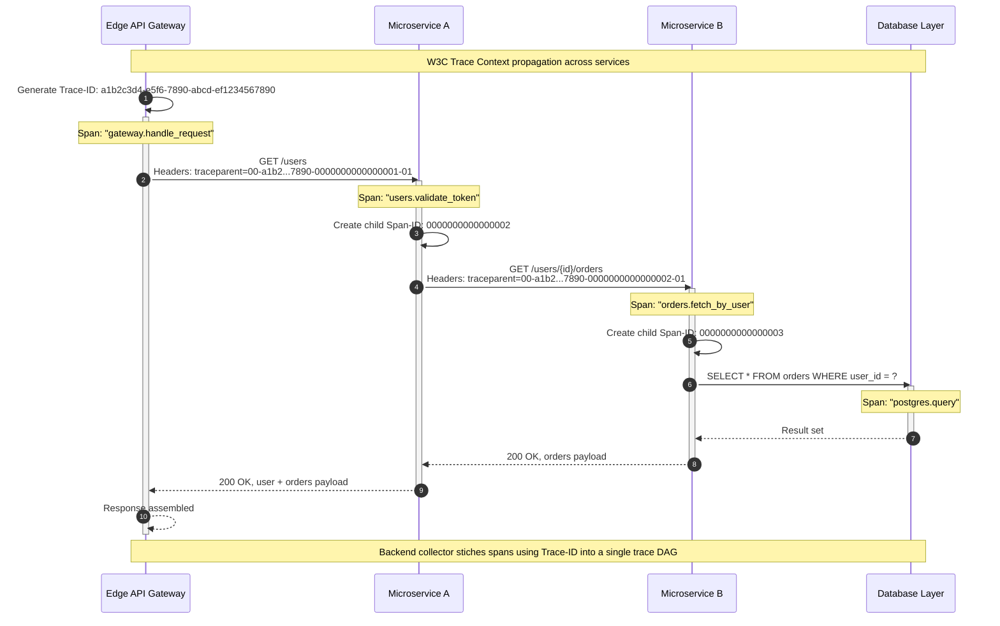

# Module 7: Observability: Monitoring, Logging, Tracing

Observability is the engineering discipline of understanding system internals through externally emitted telemetry — **Metrics**, **Logs**, and **Traces** — without deploying new code.

---

## Table of Contents

- [1. The Three Pillars of Observability](#1-the-three-pillars-of-observability)
- [2. SLI, SLO, and Error Budgets](#2-sli-slo-and-error-budgets)
- [3. Alerts & Push vs. Pull Architectures](#3-alerts--push-vs-pull-architectures)
- [4. Real-World Failure Modes](#4-real-world-failure-modes)
- [5. Production Code Template: Structured Logging Middleware](#5-production-code-template-structured-logging-middleware)
- [6. SRE Assessment Challenges](#6-sre-assessment-challenges)

---

## 1. The Three Pillars of Observability

Modern distributed systems require three distinct telemetry data types. Relying on only one is like diagnosing a car engine failure with only a speedometer.

### **Metrics** ("The What")

Numerical representations of data measured over intervals of time. `OpenTelemetry` defines three metric instrument kinds:

| Instrument | Behavior | Example |
|---|---|---|
| **Counter** | Monotonic, cumulative increase | Total HTTP requests |
| **Gauge** | Instantaneous snapshot | Current memory usage |
| **Histogram** | Statistical distribution | Request latency percentiles |

**Storage & Cost:** Metrics are computationally cheap. Because they are aggregated numbers, they are stored in highly compressed **Time-Series Databases** (`TSDBs`). A single metric with a few labels occupies mere bytes, allowing millions of data points with minimal overhead.

### **Logs** ("The Why")

Persistent records of discrete events. Unlike legacy unstructured text, **Structured Logs** (JSON or `OTLP` format) provide machine-readable metadata queriable at scale.

**Storage & Cost:** Logs are the most expensive pillar. Storing every raw string for thousands of services generates petabytes of data, requiring massive disk I/O and expensive indexing.

### **Traces** ("The Where")

Traces track the progression of a single request as it propagates through a distributed graph of microservices. A **Trace** is a Directed Acyclic Graph (`DAG`) composed of **Spans**, where each span represents one operation within a service.

#### Distributed Trace Propagation



*The sequence above shows a global `Trace-ID` generated at the `Edge API Gateway`, propagated via the `traceparent` HTTP header, with child `Span-IDs` created at each microservice hop. `OpenTelemetry` SDKs handle injection and extraction transparently.*

---

## 2. SLI, SLO, and Error Budgets

We do not monitor for the sake of having graphs. We monitor to defend **Service Level Objectives**.

### Definitions

| Term | Definition | Example |
|---|---|---|
| **SLI** (Service Level Indicator) | Quantitative measure of a service aspect | Latency p99, error rate, throughput |
| **SLO** (Service Level Objective) | Target value or range for an SLI | "99.9% of requests return 200 OK in under 200ms" |
| **SLA** (Service Level Agreement) | Legal contract with consequences if SLO is missed | Financial credits for downtime |

### The Error Budget Math

The error budget is the mathematical "cushion" allowed by your SLO.

| SLO Target | Allowed Downtime Per 30-Day Month |
|---|---:|
| 99% (two 9s) | 7h 18m 17s |
| **99.9% (three 9s)** | **43m 49s** |
| 99.99% (four 9s) | 4m 22s |
| 99.999% (five 9s) | 26s |

### Governance

- **Healthy error budget** — teams can increase deployment velocity and take risks with new features.
- **Exhausted error budget** — all feature launches are frozen until the system's reliability is restored.

---

## 3. Alerts & Push vs. Pull Architectures

Monitoring systems must collect data from ephemeral applications. Two dominant collection models exist.

### Pull-Based Collection (`Prometheus`)

The monitoring server "scrapes" metrics from a standardized endpoint (e.g., `/metrics`) on each service instance.

| Pros | Cons |
|---|---|
| Better control over scrape frequency | Requires an up-to-date registry of every service's IP address |
| Easier liveness detection (failed scrape = likely down) | Cannot reach short-lived instances that finish before the next scrape cycle |

### Push-Based Collection (`StatsD`, `OpenTelemetry Collector`)

The application proactively pushes telemetry data to a centralized collector or daemon.

| Pros | Cons |
|---|---|
| Works for short-lived, transient jobs (Lambda / Serverless) | Can overwhelm the collector during traffic spikes |
| Batch processes that finish before a pull could reach them | Requires back-pressure and buffering to protect the collector |

### Alerting: Burn Rate Alerts

A 1-minute window produces "pagersmith fatigue" (too many false positives). A 30-day error budget window alerts too late. **Burn rate alerts** solve this by measuring how fast the error budget is consumed relative to the SLO target — typically using a multi-window, multi-rate approach (e.g., 1-hour and 6-hour lookbacks).

---

## 4. Real-World Failure Modes

### Metric Cardinality Explosion

In `TSDBs`, every unique combination of a metric name and its labels creates a separate time-series. If a developer injects a high-cardinality value — a **User ID** or **Request UUID** — into a metric tag, the number of time-series explodes from hundreds to millions. This consumes all available RAM in the monitoring cluster, leading to `OOM` (Out of Memory) crashes and complete visibility loss.

| Safe Labels | Dangerous Labels |
|---|---|
| `service`, `region`, `deployment_version` | `user_id`, `session_id`, `request_uuid` |
| `status_code` (categorical) | `customer_email` (unbounded) |
| `http_method` (enum: GET/POST/...) | `trace_id` (unique per request) |

### Sampling in Tracing

At 500k QPS, logging 100% of traces is financially and technically impossible. Samplers in the SDK decide which traces are recorded.

| Strategy | Decision Point | Trade-off |
|---|---|---|
| **Head-Based Sampling** | At the beginning of the trace | Simple, but may miss rare errors |
| **Tail-Based Sampling** | After the trace completes | Keeps 100% of "interesting" traces (errors, high latency); discards ~99% of successful, boring ones. Requires buffering in the collector layer. |

---

## 5. Production Code Template: Structured Logging Middleware

```python
"""
Structured Logging Middleware for FastAPI / Flask-style apps.

Intercepts incoming requests, extracts or generates a unique
correlation_id (UUID), injects it into structured JSON logs,
and measures request execution latency in milliseconds.

Usage:
    from fastapi import FastAPI

    app = FastAPI()
    app.middleware("http")(structured_logging_middleware)

    @app.get("/health")
    async def health():
        return {"status": "ok"}
"""

import logging
import time
import uuid
from typing import Callable, Awaitable

from starlette.middleware.base import BaseHTTPMiddleware
from starlette.requests import Request
from starlette.responses import Response


class JSONLogFormatter(logging.Formatter):
    """Custom formatter that outputs structured JSON log records."""

    def format(self, record: logging.LogRecord) -> str:
        log_entry = {
            "timestamp": self.formatTime(record),
            "level": record.levelname,
            "logger": record.name,
            "message": record.getMessage(),
        }
        if hasattr(record, "correlation_id"):
            log_entry["correlation_id"] = record.correlation_id
        if hasattr(record, "duration_ms"):
            log_entry["duration_ms"] = record.duration_ms
        if hasattr(record, "method"):
            log_entry["method"] = record.method
        if hasattr(record, "path"):
            log_entry["path"] = record.path
        if hasattr(record, "status_code"):
            log_entry["status_code"] = record.status_code
        import json
        return json.dumps(log_entry)


# Configure root logger with JSON formatter
_handler = logging.StreamHandler()
_handler.setFormatter(JSONLogFormatter())
_logger = logging.getLogger("structured_middleware")
_logger.setLevel(logging.INFO)
_logger.addHandler(_handler)
_logger.propagate = False


class StructuredLoggingMiddleware(BaseHTTPMiddleware):
    """Middleware that wraps each request with correlation ID and
    latency measurement.

    - Extracts ``X-Correlation-ID`` from the request header if present.
    - Generates a new UUID if no correlation ID is found.
    - Logs the incoming request with method and path.
    - Measures wall-clock execution time.
    - Logs the completed response with status code and duration.
    """

    async def dispatch(
        self, request: Request, call_next: Callable[[Request], Awaitable[Response]]
    ) -> Response:
        correlation_id = request.headers.get(
            "X-Correlation-ID", str(uuid.uuid4())
        )
        start_ns = time.perf_counter_ns()

        extra = {
            "correlation_id": correlation_id,
            "method": request.method,
            "path": request.url.path,
        }

        _logger.info("incoming request", extra={**extra, "duration_ms": None})

        try:
            response: Response = await call_next(request)
        except Exception as exc:
            duration_ms = (time.perf_counter_ns() - start_ns) / 1_000_000
            _logger.error(
                "request failed",
                extra={
                    **extra,
                    "duration_ms": round(duration_ms, 2),
                    "status_code": 500,
                    "error": str(exc),
                },
            )
            raise

        duration_ms = (time.perf_counter_ns() - start_ns) / 1_000_000
        _logger.info(
            "request completed",
            extra={
                **extra,
                "duration_ms": round(duration_ms, 2),
                "status_code": response.status_code,
            },
        )

        response.headers["X-Correlation-ID"] = correlation_id
        return response


# ------------------------------------------------------------------
# Usage Example (FastAPI)
# ------------------------------------------------------------------
# from fastapi import FastAPI
#
# app = FastAPI()
# app.add_middleware(StructuredLoggingMiddleware)
#
# @app.get("/hello")
# async def hello():
#     return {"message": "Hello, observability!"}
#
# Starting the server:
#   uvicorn app:app --port 8000
#
# Request:
#   curl -H "X-Correlation-ID: my-custom-id" http://localhost:8000/hello
#
# Log output (single line):
#   {"timestamp": "...", "level": "INFO", "logger": "structured_middleware",
#    "message": "request completed", "correlation_id": "my-custom-id",
#    "duration_ms": 2.34, "method": "GET", "path": "/hello",
#    "status_code": 200}
```

---

## 6. SRE Assessment Challenges

> **Challenge 1: The Alerting Paradox**  
> A service has an SLO of 99.9% uptime. During a massive traffic spike, the latency SLI remains healthy, but the error rate SLI spikes to 5%. If you alert based on a 1-minute window, you get "pagersmith fatigue." If you alert based on the 30-day Error Budget, the alert might arrive too late. How do you architect a "Burn Rate" alert to solve this?

<details><summary>Click for SRE Solution Rubric</summary>

**Senior SRE Answer:**

The key insight is that the error budget burn rate tells you *how fast* the budget is being consumed relative to the SLO target, not just whether a threshold was exceeded.

- **Architecture:** Use a multi-window, multi-rate alert. For a 99.9% SLO (0.1% error budget), a 5% error rate represents a **50x burn rate** (5% ÷ 0.1%).
- **Multi-window:** Alert if the burn rate exceeds a threshold over a short window (e.g., 1 hour at 50x) *or* a longer window (e.g., 6 hours at 10x). The short window catches fast, severe spikes; the long window catches slow, sustained degradation.
- **Budget projection:** At a 50x burn rate, the entire monthly error budget would be consumed in ~1.3 days (43m ÷ 50). A 1-hour window catches this with hours of runway remaining.
- **Trade-off:** Shorter windows increase false positives; longer windows delay detection. Tuning requires historical burn rate analysis and alert fatigue tracking.
</details>

> **Challenge 2: Collector Backpressure During Network Partition**  
> You use an `OpenTelemetry Collector` as a sidecar for your microservices. During a network partition, the collector's Exporter cannot reach the backend. How do you configure the Processor and Receiver to ensure critical traces are not lost while protecting the application's memory?

<details><summary>Click for SRE Solution Rubric</summary>

**Senior SRE Answer:**

During partition, the application must not block or crash because the collector is overwhelmed.

- **Memory buffer:** Configure the collector's `batch processor` with an in-memory queue. Set `max_queue_size` and `max_export_batch_size` to absorb burst backpressure without dropping data.
- **Back pressure signaling:** Enable the `receiver` to apply back pressure to the application when the queue is near capacity. In practice, this means the collector's gRPC/HTTP server stops acking spans, causing the SDK to retry with exponential backoff rather than building up an unbounded application-side buffer.
- **Data loss prevention:** Set the exporter to a non-blocking, retrying mode with a configurable `timeout` and `retry_on_failure`. If the backend remains unreachable, the collector can fall back to a file exporter as a dead-letter queue.
- **Memory protection:** Configure `max_concurrent_exports` to prevent unbounded goroutine growth. Set `sending_queue.num_consumers` to limit parallelism.
- **Trade-off:** Buffering delays observability. A long partition means data eventually ages out. Prioritize preserving spans with errors by configuring a tail-based processor in the collector that drops healthy spans first when the queue is full.
</details>

> **Challenge 3: Cardinality vs. Insight at 1M Customers**  
> A team wants to track "Latency per Customer" for their top 1,000,000 customers using `Prometheus`-style metrics. Explain why this is a catastrophic design and propose a more scalable telemetry alternative using the three pillars.

<details><summary>Click for SRE Solution Rubric</summary>

**Senior SRE Answer:**

This is a textbook cardinality explosion scenario.

- **Why it is catastrophic:** A `Prometheus` `Histogram` with 1M unique `customer_id` label values creates 1M distinct time-series *per metric*. At ~50 bytes per series in the TSDB index, that is ~50 MB just for the index. More critically, query performance degrades non-linearly as the label index grows. Every scrape compacts and re-indexes all series, consuming CPU and eventually causing `OOM`.
- **Scalable alternative using the three pillars:**
  - **Metrics** — Track aggregate latency histograms at the service level, bucketed by tier (e.g., `customer_tier: gold/silver/bronze`) and region. This keeps cardinality manageable (< 100 series).
  - **Traces** — Attach `customer_id` as a Span Attribute (not a metric label). This allows querying specific customer journeys in the trace backend (e.g., `Jaeger`, `Tempo`) without bloating the TSDB.
  - **Logs** — Log structured entries with `customer_id` for error events only. Use log-based SLIs to alert when a specific customer cohort sees elevated error rates, then drill into traces for root cause.
- **Trade-off:** You lose instant "p99 latency by customer" on a Grafana dashboard. In practice, you rarely need this — you need the ability to investigate a specific customer's slow request when they report it, which traces provide.
</details>
