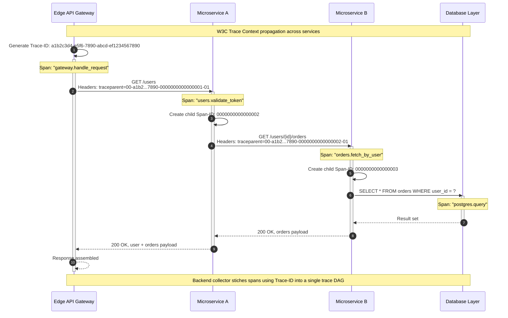
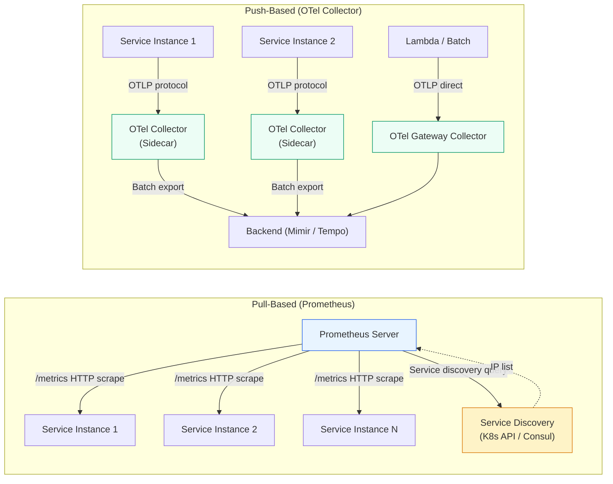

# Module 7: Observability: Monitoring, Logging, Tracing

Observability is the engineering discipline of understanding system internals through externally emitted telemetry — **Metrics**, **Logs**, and **Traces** — without deploying new code.

---

## Table of Contents

- [1. The Three Pillars of Observability](#1-the-three-pillars-of-observability)
- [2. SLI, SLO, and Error Budgets](#2-sli-slo-and-error-budgets)
- [3. Alerts & Push vs. Pull Architectures](#3-alerts--push-vs-pull-architectures)
- [4. Real-World Failure Modes](#4-real-world-failure-modes)
- [5. Production Code Template: Structured Logging Middleware](#5-production-code-template-structured-logging-middleware)
- [6. SRE Assessment Challenges](#6-sre-assessment-challenges)
- [7. Common Mistakes](#7-common-mistakes)
- [8. Key Takeaways](#8-key-takeaways)
- [9. Self-Assessment Questions](#9-self-assessment-questions)

---

## 1. The Three Pillars of Observability

Modern distributed systems require three distinct telemetry data types. Relying on only one is like diagnosing a car engine failure with only a speedometer. The speedometer tells you the car is moving (Metrics), but it will not tell you why the check-engine light is on (Logs), nor will it tell you which cylinder misfired first (Traces). You need all three to form a complete picture.

### **Metrics** ("The What")

Numerical representations of data measured over intervals of time. `OpenTelemetry` defines three metric instrument kinds:

| Instrument | Behavior | Example | Plain-English Analogy |
|---|---|---|---|
| **Counter** | Monotonic, cumulative increase | Total HTTP requests | An odometer: it only goes up, and you read the difference between two points in time to learn how far you travelled |
| **Gauge** | Instantaneous snapshot | Current memory usage | A fuel gauge: it goes up and down constantly and you read the value at a specific moment |
| **Histogram** | Statistical distribution | Request latency percentiles | A speed camera that records every car's speed, letting you answer "what speed did 99% of cars stay under?" |

**Storage & Cost:** Metrics are computationally cheap. Because they are aggregated numbers, they are stored in highly compressed **Time-Series Databases** (`TSDBs`). A single metric with a few labels occupies mere bytes, allowing millions of data points with minimal overhead. A typical Prometheus server storing 1 million active series consumes about 10–15 GB of RAM — orders of magnitude less than storing the same volume of raw log data.

### **Logs** ("The Why")

Persistent records of discrete events. Unlike legacy unstructured text, **Structured Logs** (JSON or `OTLP` format) provide machine-readable metadata queriable at scale. A structured log entry is a dictionary of key-value pairs, not a sentence:

```json
{"timestamp": "2026-05-21T14:30:00Z", "level": "ERROR", "service": "payment", "trace_id": "abc123", "message": "declined", "error_code": "insufficient_funds", "amount": 49.99}
```

This structure allows tools like `Loki`, `Elasticsearch`, or `Cloud Logging` to index specific fields and answer queries like "how many `insufficient_funds` errors did the payment service return in the last hour?" — a question that is prohibitively slow and expensive to answer with unstructured text.

**Storage & Cost:** Logs are the most expensive pillar. Storing every raw string for thousands of services generates petabytes of data, requiring massive disk I/O and expensive indexing. A typical rule of thumb: logs cost **10–100x** more to store than metrics for equivalent informational value. This is why every observability strategy includes log volume reduction — sampling debug logs, increasing the log level in production, and aggressively expiring low-value log streams.

### **Traces** ("The Where")

Traces track the progression of a single request as it propagates through a distributed graph of microservices. A **Trace** is a Directed Acyclic Graph (`DAG`) composed of **Spans**, where each span represents one operation within a service.

#### Distributed Trace Propagation



*The sequence above shows a global `Trace-ID` generated at the `Edge API Gateway`, propagated via the `traceparent` HTTP header, with child `Span-IDs` created at each microservice hop. `OpenTelemetry` SDKs handle injection and extraction transparently.*

#### Annotated Trace JSON

Below is what the backend trace collector actually sees. Each span carries a `trace_id`, a `span_id`, a `parent_span_id`, and attributes that describe the operation.

```json
{
  "resourceSpans": [
    {
      "resource": { "attributes": { "service.name": "gateway" } },
      "scopeSpans": [
        {
          "scope": { "name": "io.opentelemetry.spring-webmvc" },
          "spans": [
            {
              "trace_id": "a1b2c3d4e5f67890abcdef1234567890",
              "span_id": "0000000000000001",
              "parent_span_id": "",
              "name": "gateway.handle_request",
              "kind": "SERVER",
              "start_time_unix_nano": "1711000000000000000",
              "end_time_unix_nano": "1711000000120000000",
              "attributes": {
                "http.method": "GET",
                "http.route": "/users/{id}",
                "http.status_code": 200
              },
              "status": { "code": "OK" }
            }
          ]
        }
      ]
    },
    {
      "resource": { "attributes": { "service.name": "users" } },
      "scopeSpans": [
        {
          "scope": { "name": "io.opentelemetry.grpc" },
          "spans": [
            {
              "trace_id": "a1b2c3d4e5f67890abcdef1234567890",
              "span_id": "0000000000000002",
              "parent_span_id": "0000000000000001",
              "name": "users.validate_token",
              "kind": "SERVER",
              "start_time_unix_nano": "1711000000010000000",
              "end_time_unix_nano": "1711000000050000000",
              "attributes": {
                "rpc.system": "grpc",
                "rpc.service": "users.ValidationService",
                "user.id": "42"
              },
              "status": { "code": "OK" }
            }
          ]
        }
      ]
    }
  ]
}
```

**Key fields explained:**

- `trace_id` (16 bytes, hex-encoded) — Identifies the entire trace. All spans sharing this ID belong to the same request. The `Edge API Gateway` generates this once, and every downstream service propagates it.
- `span_id` (8 bytes, hex-encoded) — Identifies a single span within the trace. Each service operation gets its own `span_id`.
- `parent_span_id` — Points to the span that called this operation. The root span (the gateway) has an empty parent. This field is what lets the collector reconstruct the tree structure of the trace DAG.
- `kind` — Whether the span represents a server-side operation (`SERVER`), a client-side operation (`CLIENT`), or an internal operation (`INTERNAL`). This tells the trace backend whether the span was the entry point into a service.
- `attributes` — Key-value metadata attached to the span. Good candidates: HTTP method, status code, user ID, tenant ID, error code. Bad candidates: large payloads, raw SQL queries with values, anything high-cardinality and unnecessary.
- `status.code` — `OK` or `ERROR`. If `ERROR`, the trace backend should preserve this span even under heavy sampling.

---

## 2. SLI, SLO, and Error Budgets

We do not monitor for the sake of having graphs. We monitor to defend **Service Level Objectives**.

### Definitions

| Term | Definition | Example |
|---|---|---|
| **SLI** (Service Level Indicator) | Quantitative measure of a service aspect | Latency p99, error rate, throughput |
| **SLO** (Service Level Objective) | Target value or range for an SLI | "99.9% of requests return 200 OK in under 200ms" |
| **SLA** (Service Level Agreement) | Legal contract with consequences if SLO is missed | Financial credits for downtime |

### Worked Example: Payment Service SLOs

Consider a **payment processing service** that handles credit card charges. Here is how the team defines its SLIs and SLOs:

| SLI | Measurement | SLO Target | Why This Target? |
|---|---|---|---|
| **Availability** | Fraction of requests returning HTTP 200–499 (excluding 5xx) | 99.95% over 30 days | Every 0.05% above our target costs ~$50K in merchant SLA penalties |
| **Latency (p99)** | Time from request receipt to response, measured at the load balancer | < 500ms for 99.9% of requests | Upstream checkout service times out at 1s — we must respond before then |
| **Freshness** | Age of fraud-detection model loaded in memory | < 5 minutes stale | Transactions approved with stale model cause 2x chargeback rate |
| **Correctness** | Fraction of transactions that settle correctly (no double-charges, no ghost charges) | 99.999% | Each 0.001% of incorrect charges triggers payment card auditor review |

**Error budget calculation for Availability (99.95% SLO):**

```
Allowed error budget per 30 days = 43,200 minutes × (1 − 0.9995)
                                 = 43,200 × 0.0005
                                 = 21.6 minutes
```

This team has just 21.6 minutes of allowed downtime per month. Every deployment must be weighed against this budget.

### Governance

- **Healthy error budget** — teams can increase deployment velocity and take risks with new features. If the payment service has used only 5 of its 21.6 minutes this month, the team can safely deploy a canary and monitor for regressions.
- **Exhausted error budget** — all feature launches are frozen until the system's reliability is restored. The team shifts to "recovery mode" — investigating the root cause of the budget burn, implementing mitigations, and only deploying fixes.

### Burn Rate Alerting with PromQL

A burn rate of `1.0` means the error budget will be exactly consumed over the SLO window (30 days). A burn rate of `2.0` means it will be consumed in half the time (15 days). For a 99.9% SLO, the allowed error rate is 0.1%.

| Burn Rate | Error Rate | Time to Exhaust Budget | Alert Window | Example PromQL |
|---|---|---|---|---|
| 1x (slow burn) | 0.1% | 30 days | 6-hour window | `rate(errors_total[6h]) / rate(requests_total[6h]) > 0.001` |
| 10x (fast burn) | 1% | ~3 days | 1-hour window | `rate(errors_total[1h]) / rate(requests_total[1h]) > 0.01` |
| 50x (critical) | 5% | ~14 hours | 30-min window | `rate(errors_total[30m]) / rate(requests_total[30m]) > 0.05` |

**Google SRE recommends** a multi-window approach: alert on the 1-hour window (catches fast burns) *or* the 6-hour window (catches slow burns that would exhaust the budget over days). This prevents alert fatigue from short spikes while still catching gradual degradation.

---

## 3. Alerts & Push vs. Pull Architectures

Monitoring systems must collect data from ephemeral applications. Two dominant collection models exist. The choice between them fundamentally shapes how you handle service discovery, short-lived workloads, and collector scaling.

### Pull vs. Push Architecture Comparison



*Pull-based (left): the Prometheus server scrapes each service instance directly, using a service-discovery mechanism to find targets. Push-based (right): each service instance sends telemetry to a local `OpenTelemetry Collector` sidecar or gateway, which batches and forwards to the backend.*

### Pull-Based Collection (`Prometheus`)

The monitoring server "scrapes" metrics from a standardized endpoint (e.g., `/metrics`) on each service instance. The scrape interval is controlled by the monitoring server, not the application.

| Pros | Cons |
|---|---|
| Better control over scrape frequency — the server decides when to pull, so scrape timing is consistent across all targets | Requires an up-to-date registry of every service's IP address. In Kubernetes, the API server provides this, but in bare-metal or VM environments it must be maintained externally |
| Easier liveness detection — a failed scrape is a strong signal the target is down | Cannot reach short-lived instances that finish before the next scrape cycle. A cron job that runs for 10 seconds will be missed if Prometheus scrapes every 30 seconds |
| Simpler rate limiting — the server controls its own load by adjusting scrape intervals | Every service must expose an HTTP endpoint on a known port. This adds a small but non-zero security surface |

### Push-Based Collection (`StatsD`, `OpenTelemetry Collector`)

The application proactively pushes telemetry data to a centralized collector or daemon.

| Pros | Cons |
|---|---|
| Works for short-lived, transient jobs (Lambda / Serverless / batch processors). The job pushes metrics as its last action before exiting | Can overwhelm the collector during traffic spikes if no backpressure or buffering is implemented |
| No service discovery needed — the application knows the collector's address at startup | Harder to detect if an instance is alive but not sending (silent failure) |
| The application can buffer telemetry during network partitions and flush when connectivity returns | Requires application-level configuration for collector endpoints, which must be injected via environment variables or config maps |

### Alerting: Burn Rate Alerts

A 1-minute window produces "pagersmith fatigue" (too many false positives). A 30-day error budget window alerts too late. **Burn rate alerts** solve this by measuring how fast the error budget is consumed relative to the SLO target — typically using a multi-window, multi-rate approach (e.g., 1-hour and 6-hour lookbacks). See the PromQL table in [Section 2](#worked-example-payment-service-slos) for exact queries.

### What Happens in Production: The 15-Minute Lag That Cost $300K

A major e-commerce company used a push-based `StatsD` setup where every application instance sent metrics to a shared collector cluster. During a Black Friday sale, a configuration error caused the metric emission rate to double. The collector cluster's CPU saturated, and its internal queue grew unbounded. By the time the operations team noticed the missing metrics on the dashboard, 15 minutes had passed — and during those 15 minutes, a cascading failure in the payment service went undetected. The fix: switching to pull-based scraping with a sidecar collector that applied backpressure to the application, ensuring that a collector bottleneck never again blinded the operations team during a traffic peak.

---

## 4. Real-World Failure Modes

### Metric Cardinality Explosion

In `TSDBs`, every unique combination of a metric name and its labels creates a separate time-series. If a developer injects a high-cardinality value — a **User ID** or **Request UUID** — into a metric tag, the number of time-series explodes from hundreds to millions. This consumes all available RAM in the monitoring cluster, leading to `OOM` (Out of Memory) crashes and complete visibility loss.

| Safe Labels | Dangerous Labels |
|---|---|
| `service`, `region`, `deployment_version` | `user_id`, `session_id`, `request_uuid` |
| `status_code` (categorical, ≤ ~20 values) | `customer_email` (unbounded) |
| `http_method` (enum: GET/POST/...) | `trace_id` (unique per request) |

#### What Happens in Production: The `user_id` Incident

A payment processing team wanted to debug a "slow checkout" issue. A developer added a `user_id` label to a Prometheus histogram tracking checkout duration:

```python
# BAD — this creates one time-series per user
checkout_duration.labels(user_id=user.id).observe(duration)
```

The service had 2 million active users per day. Within 3 hours, the Prometheus server's memory graph looked like this:

```
14:00 — 10 GB RSS (normal, ~500K series)
15:00 — 28 GB RSS (series count growing: 1.5M)
16:00 — 52 GB RSS (series count: 4M — swap starts)
16:15 — OOM kill, Prometheus restarts
16:16 — Prometheus restarts, replays WAL, OOM again
16:30 — page: "prometheus down, all dashboards blank"
```

**The fix was in three phases:**

1. **Immediate — drop the bad metric:** A relabel rule in the scrape config dropped the `user_id` label, collapsing the 4M series back to ~500. Dashboards came back online within minutes.
2. **Short-term — add a cardinality budget:** Configured `prometheus` with `max_series_per_metric` to auto-reject any metric that exceeds 100K series, preventing future explosions.
3. **Long-term — move to traces:** The team needed to debug slow checkouts per user — a valid request. They moved the `user_id` into a **Trace Span Attribute** instead of a metric label. Now when a user reports a slow checkout, the team finds the trace by `user_id` and examines the spans, without bloating the TSDB.

### Sampling in Tracing

At 500k QPS, logging 100% of traces is financially and technically impossible. Samplers in the SDK decide which traces are recorded.

| Strategy | Decision Point | Trade-off |
|---|---|---|
| **Head-Based Sampling** | At the beginning of the trace (first span). A simple probability (e.g., 1%) or a rate-limiter decides. | Simple and fast — no state required. But may miss rare errors because the error happens after the sampling decision was made. If the error rate is 0.01% and you sample at 1%, you only capture 0.0001% of errors. |
| **Tail-Based Sampling** | After the trace completes. The collector buffers all spans and decides which traces to keep based on policy (e.g., keep all traces with `status.code = ERROR` or latency > p99). | Keeps 100% of "interesting" traces and discards ~99% of successful, boring ones. Requires buffering in the collector layer, which adds memory pressure and a small window of data loss if the collector crashes before flushing. |

#### What Happens in Production: Tail-Based Sampling Catches a Race Condition

A social media company used head-based sampling at 0.1% for its feed-generation service. Users were intermittently seeing empty feeds, but the error rate was only 0.05% — well below the 0.1% sampling rate. The team's traces almost never captured the error. After switching to tail-based sampling, a trace was captured showing a race condition between the cache invalidation and the feed assembly, happening only when two specific database shards responded in a particular order. The trace showed the exact span timestamps where the race window opened. The fix required adding a distributed lock around the cache-key generation — a change that would have been nearly impossible to diagnose without the full trace.

---

## 5. Production Code Template: Structured Logging Middleware

```python
"""
Structured Logging Middleware for FastAPI / Flask-style apps.

Intercepts incoming requests, extracts or generates a unique
correlation_id (UUID), injects it into structured JSON logs,
and measures request execution latency in milliseconds.

Usage:
    from fastapi import FastAPI

    app = FastAPI()
    app.middleware("http")(structured_logging_middleware)

    @app.get("/health")
    async def health():
        return {"status": "ok"}
"""

import logging
import time
import uuid
from typing import Callable, Awaitable

from starlette.middleware.base import BaseHTTPMiddleware
from starlette.requests import Request
from starlette.responses import Response


class JSONLogFormatter(logging.Formatter):
    """Custom formatter that outputs structured JSON log records.

    Checks each log record for optional fields (correlation_id,
    duration_ms, method, path, status_code) and includes them
    in the JSON output if present. This keeps the log line
    parseable by log aggregators like Elasticsearch or Loki.
    """

    def format(self, record: logging.LogRecord) -> str:
        log_entry = {
            "timestamp": self.formatTime(record),
            "level": record.levelname,
            "logger": record.name,
            "message": record.getMessage(),
        }
        if hasattr(record, "correlation_id"):
            log_entry["correlation_id"] = record.correlation_id
        if hasattr(record, "duration_ms"):
            log_entry["duration_ms"] = record.duration_ms
        if hasattr(record, "method"):
            log_entry["method"] = record.method
        if hasattr(record, "path"):
            log_entry["path"] = record.path
        if hasattr(record, "status_code"):
            log_entry["status_code"] = record.status_code
        import json
        return json.dumps(log_entry)


# Configure root logger with JSON formatter
_handler = logging.StreamHandler()
_handler.setFormatter(JSONLogFormatter())
_logger = logging.getLogger("structured_middleware")
_logger.setLevel(logging.INFO)
_logger.addHandler(_handler)
_logger.propagate = False


class StructuredLoggingMiddleware(BaseHTTPMiddleware):
    """Middleware that wraps each request with correlation ID and
    latency measurement.

    - Extracts ``X-Correlation-ID`` from the request header if present.
    - Generates a new UUID if no correlation ID is found.
    - Logs the incoming request with method and path.
    - Measures wall-clock execution time using ``perf_counter_ns``
      (nanosecond precision, immune to system clock adjustments).
    - Logs the completed response with status code and duration.
    """

    async def dispatch(
        self, request: Request, call_next: Callable[[Request], Awaitable[Response]]
    ) -> Response:
        correlation_id = request.headers.get(
            "X-Correlation-ID", str(uuid.uuid4())
        )
        start_ns = time.perf_counter_ns()

        extra = {
            "correlation_id": correlation_id,
            "method": request.method,
            "path": request.url.path,
        }

        _logger.info("incoming request", extra={**extra, "duration_ms": None})

        try:
            response: Response = await call_next(request)
        except Exception as exc:
            duration_ms = (time.perf_counter_ns() - start_ns) / 1_000_000
            _logger.error(
                "request failed",
                extra={
                    **extra,
                    "duration_ms": round(duration_ms, 2),
                    "status_code": 500,
                    "error": str(exc),
                },
            )
            raise

        duration_ms = (time.perf_counter_ns() - start_ns) / 1_000_000
        _logger.info(
            "request completed",
            extra={
                **extra,
                "duration_ms": round(duration_ms, 2),
                "status_code": response.status_code,
            },
        )

        response.headers["X-Correlation-ID"] = correlation_id
        return response


# ------------------------------------------------------------------
# Usage Example (FastAPI)
# ------------------------------------------------------------------
# from fastapi import FastAPI
#
# app = FastAPI()
# app.add_middleware(StructuredLoggingMiddleware)
#
# @app.get("/hello")
# async def hello():
#     return {"message": "Hello, observability!"}
#
# Starting the server:
#   uvicorn app:app --port 8000
#
# Request:
#   curl -H "X-Correlation-ID: my-custom-id" http://localhost:8000/hello
#
# Log output (single line):
#   {"timestamp": "...", "level": "INFO", "logger": "structured_middleware",
#    "message": "request completed", "correlation_id": "my-custom-id",
#    "duration_ms": 2.34, "method": "GET", "path": "/hello",
#    "status_code": 200}
```

### How the Middleware Works (Step by Step)

1. **Correlation ID extraction (line ~249):** The middleware reads the `X-Correlation-ID` header from the incoming request. If the caller provided one (e.g., a front-end that generated it), we reuse it. If not, we generate a new `UUID4`. This ID flows into every log line emitted during this request, allowing a log aggregator to group all log entries for the same request — even across microservices.

2. **Nanosecond-precision timer (line ~252):** `time.perf_counter_ns()` provides nanosecond resolution and is immune to system clock adjustments (unlike `time.time()`). This is important because NTP clock corrections can cause `time.time()` to jump backwards, producing negative durations.

3. **Request logging (line ~260):** The middleware logs "incoming request" with the method and path *before* the handler runs. If the handler hangs, this log line proves the request reached the server — a crucial debugging signal for timeout investigations.

4. **Execution and timing (lines ~262–275):** The middleware measures the wall-clock time of the handler. If the handler raises an exception, the error is logged with duration and status code 500, then re-raised so the framework's exception handler can return a proper error response.

5. **Response logging (lines ~277–285):** After the handler returns, the middleware logs the completion with final duration and status code.

6. **Context propagation (line ~287):** The correlation ID is set as a response header. Downstream clients can forward it to other services, building a chain of correlation IDs across the entire request graph.

---

## 6. SRE Assessment Challenges

> **Challenge 1: The Alerting Paradox**  
> A service has an SLO of 99.9% uptime. During a massive traffic spike, the latency SLI remains healthy, but the error rate SLI spikes to 5%. If you alert based on a 1-minute window, you get "pagersmith fatigue." If you alert based on the 30-day Error Budget, the alert might arrive too late. How do you architect a "Burn Rate" alert to solve this?

<details><summary>Click for SRE Solution Rubric</summary>

**Senior SRE Answer:**

The key insight is that the error budget burn rate tells you *how fast* the budget is being consumed relative to the SLO target, not just whether a threshold was exceeded.

- **Architecture:** Use a multi-window, multi-rate alert. For a 99.9% SLO (0.1% error budget), a 5% error rate represents a **50x burn rate** (5% ÷ 0.1%).
- **Multi-window:** Alert if the burn rate exceeds a threshold over a short window (e.g., 1 hour at 50x) *or* a longer window (e.g., 6 hours at 10x). The short window catches fast, severe spikes; the long window catches slow, sustained degradation.
- **Budget projection:** At a 50x burn rate, the entire monthly error budget would be consumed in ~1.3 days (43m ÷ 50). A 1-hour window catches this with hours of runway remaining.
- **Trade-off:** Shorter windows increase false positives; longer windows delay detection. Tuning requires historical burn rate analysis and alert fatigue tracking.
</details>

> **Challenge 2: Collector Backpressure During Network Partition**  
> You use an `OpenTelemetry Collector` as a sidecar for your microservices. During a network partition, the collector's Exporter cannot reach the backend. How do you configure the Processor and Receiver to ensure critical traces are not lost while protecting the application's memory?

<details><summary>Click for SRE Solution Rubric</summary>

**Senior SRE Answer:**

During partition, the application must not block or crash because the collector is overwhelmed.

- **Memory buffer:** Configure the collector's `batch processor` with an in-memory queue. Set `max_queue_size` and `max_export_batch_size` to absorb burst backpressure without dropping data.
- **Back pressure signaling:** Enable the `receiver` to apply back pressure to the application when the queue is near capacity. In practice, this means the collector's gRPC/HTTP server stops acking spans, causing the SDK to retry with exponential backoff rather than building up an unbounded application-side buffer.
- **Data loss prevention:** Set the exporter to a non-blocking, retrying mode with a configurable `timeout` and `retry_on_failure`. If the backend remains unreachable, the collector can fall back to a file exporter as a dead-letter queue.
- **Memory protection:** Configure `max_concurrent_exports` to prevent unbounded goroutine growth. Set `sending_queue.num_consumers` to limit parallelism.
- **Trade-off:** Buffering delays observability. A long partition means data eventually ages out. Prioritize preserving spans with errors by configuring a tail-based processor in the collector that drops healthy spans first when the queue is full.
</details>

> **Challenge 3: Cardinality vs. Insight at 1M Customers**  
> A team wants to track "Latency per Customer" for their top 1,000,000 customers using `Prometheus`-style metrics. Explain why this is a catastrophic design and propose a more scalable telemetry alternative using the three pillars.

<details><summary>Click for SRE Solution Rubric</summary>

**Senior SRE Answer:**

This is a textbook cardinality explosion scenario.

- **Why it is catastrophic:** A `Prometheus` `Histogram` with 1M unique `customer_id` label values creates 1M distinct time-series *per metric*. At ~50 bytes per series in the TSDB index, that is ~50 MB just for the index. More critically, query performance degrades non-linearly as the label index grows. Every scrape compacts and re-indexes all series, consuming CPU and eventually causing `OOM`.
- **Scalable alternative using the three pillars:**
  - **Metrics** — Track aggregate latency histograms at the service level, bucketed by tier (e.g., `customer_tier: gold/silver/bronze`) and region. This keeps cardinality manageable (< 100 series).
  - **Traces** — Attach `customer_id` as a Span Attribute (not a metric label). This allows querying specific customer journeys in the trace backend (e.g., `Jaeger`, `Tempo`) without bloating the TSDB.
  - **Logs** — Log structured entries with `customer_id` for error events only. Use log-based SLIs to alert when a specific customer cohort sees elevated error rates, then drill into traces for root cause.
- **Trade-off:** You lose instant "p99 latency by customer" on a Grafana dashboard. In practice, you rarely need this — you need the ability to investigate a specific customer's slow request when they report it, which traces provide.
</details>

---

## 7. Common Mistakes

> **⚠️ Mistake 1: Treating dashboards as the source of truth.**  
> A green dashboard does not mean the system is healthy — it means the system was healthy *when the metrics were scraped*. Metrics are point-in-time samples. Always pair dashboards with alerting that evaluates burn rates over multiple windows. A dashboard can be green while the error budget is silently burning because the metric refresh interval is wider than the outage window.

> **⚠️ Mistake 2: Adding high-cardinality labels to metrics.**  
> The cardinality explosion incident in [Section 4](#what-happens-in-production-the-user_id-incident) is not rare. Every observability team I have worked with has accidentally added a high-cardinality label at least once. Always set a `max_series_per_metric` limit on your Prometheus server, and always review new metric labels in code review with the question "is this label bounded to fewer than 1,000 values?"

> **⚠️ Mistake 3: Sampling traces without a strategy.**  
> Head-based sampling at a fixed rate (e.g., 1%) is simple to configure but guarantees you will miss rare errors. If your error rate is 0.01% and you sample at 1%, only 1 in 10,000 errors will be captured. For production-critical services, implement tail-based sampling or a hybrid approach: always-sample traces with errors and sample healthy traces at a low probability.

> **⚠️ Mistake 4: Logging everything at INFO level in production.**  
> Structured logging is only useful if the logs are actually searchable. At petabyte scale, every log line has a storage cost. Log at DEBUG in development, INFO for business-meaningful events (state changes, API calls), and WARN/ERROR for anomalies. Use sampling for high-volume debug logs. If a log line has never been queried in 90 days, consider dropping it entirely.

---

## 8. Key Takeaways

1. **The three pillars are complementary, not interchangeable.** Metrics tell you *what* is slow, logs tell you *why* it is slow, and traces tell you *where* in the distributed graph the slowness originates. A system without traces is blind to the topology of failures.

2. **Error budgets turn reliability into a deploy/don't-deploy decision.** Define SLOs for every critical service, measure the burn rate, and freeze deployments when the budget is exhausted. This prevents the "reliability is everyone's job, therefore nobody's job" problem.

3. **Burn rate alerts are the only correct way to alert on SLOs.** Single-window alerts produce either alert fatigue (too short) or silent outages (too long). Use multi-window, multi-rate alerts with PromQL evaluating the error rate over both 1-hour and 6-hour windows.

4. **Push-based collection is better for ephemeral workloads; pull-based is better for persistent services and liveness detection.** Use pull (Prometheus) for long-lived services in Kubernetes. Use push (OTel Collector) for Lambda, batch jobs, and edge devices.

5. **Cardinality is the single fastest way to crash a TSDB.** Never put unbounded identifiers (user IDs, request IDs, email addresses) into metric labels. Move them to trace span attributes or log fields instead.

6. **Tail-based sampling preserves rare errors.** Head-based sampling at a fixed rate is operationally simple but will miss the one-in-a-million errors that cause the worst outages. Use tail-based sampling in the collector layer to keep 100% of error traces and a controlled sample of healthy traces.

7. **Correlation IDs are the glue that ties the pillars together.** A single UUID propagated via HTTP headers (or gRPC metadata) across every service lets you join metrics, logs, and traces for a single request. Without it, you are left guessing which log line corresponds to which trace.

---

## 9. Self-Assessment Questions

> **Question 1: Metric Cardinality**  
> A team adds a `source_ip` label to a Prometheus counter tracking API requests. The service handles 10M requests/day from 500K unique IPs. What happens to the Prometheus server's memory, and how would you fix the design?

<details><summary>Click for Answer</summary>

The `source_ip` label creates a new time-series for every unique IP — potentially 500K series for this single metric. Prometheus's memory usage grows linearly with the series count. At ~2 KB per series, 500K series adds ~1 GB of RAM just for this one metric. If multiple metrics use the same label, the problem multiplies. **Fix:** Remove `source_ip` from metric labels. If you need per-IP analysis, log the IP address in a structured log field and query the logs (or better, use a network flow log tool like `NetFlow` or `sFlow`). Aggregate metrics by region or ASN instead, keeping cardinality under 100 values.
</details>

> **Question 2: SLO Burn Rate Calculation**  
> A service has an SLO of 99.95% availability over a 30-day window. At 2:00 PM, the error rate jumps to 2% and stays there. How long until the error budget is fully consumed?

<details><summary>Click for Answer</summary>

**Step 1 — Calculate the allowed error budget:** 30 days = 43,200 minutes. Allowed error rate = 1 − 0.9995 = 0.0005 (0.05%). Allowed error budget = 43,200 × 0.0005 = 21.6 minutes of errors.

**Step 2 — Calculate the burn rate:** Current error rate (2%) ÷ allowed error rate (0.05%) = 40x burn rate.

**Step 3 — Time to exhaust budget:** Total budget (21.6 min) ÷ burn rate (40) = 0.54 minutes ≈ **32 seconds**.

At a 40x burn rate, the budget is gone in 32 seconds. The team needs a burn rate alert with a sub-minute evaluation window to catch this before the budget is exhausted.
</details>

> **Question 3: Head-Based vs. Tail-Based Sampling**  
> Your e-commerce platform processes 1M transactions per day with a fraud-detection step that fails in 0.005% of cases (rare but expensive — each missed fraud costs ~$10K). You currently use head-based sampling at 0.1%. How many fraud-related traces are you capturing per day, and what is the business risk?

<details><summary>Click for Answer</summary>

**Step 1 — Daily fraud events:** 1M transactions × 0.005% error rate = 50 fraud-detection failures per day.

**Step 2 — Captured at 0.1% head sampling:** 50 failures × 0.001 (0.1%) = 0.05 traces captured per day. That is approximately **1 trace every 20 days**.

**Step 3 — Business risk:** Each missed fraud costs ~$10K. Without a trace, the team must guess why each false approval happened. On average, the team spends 2–3 engineering-days debugging each missed fraud event. The annual cost of missed fraud + debugging time is ~$2M+.

**Recommendation:** Switch to tail-based sampling. Keep 100% of traces with `status.code = ERROR` (including fraud-detection failures) and sample healthy traces at 0.1%. This ensures every fraud-detection failure has a trace while keeping the total trace volume under 1% of full ingestion. The collector memory cost is proportional to the trace completion latency (seconds to minutes of buffering), which is orders of magnitude cheaper than the debugging cost.
</details>

> **Question 4: Push vs. Pull for a Serverless Architecture**  
> You are designing observability for a system that uses AWS Lambda for image processing. Each invocation runs for 200–500ms and is triggered 100K times per hour. The team wants real-time dashboards of invocation duration and error rate. Should you use push-based or pull-based metric collection?

<details><summary>Click for Answer</summary>

**Push-based** is the correct choice. Lambda functions are ephemeral — they run for milliseconds and then the instance is destroyed. A pull-based system (Prometheus scraping) cannot scrape a function that no longer exists. With push-based collection, the Lambda function sends its metrics as the last step before returning (preferably via a lightweight sidecar or directly to an OTel Collector gateway using OTLP over gRPC). The collector batches and forwards to the backend. For Lambda specifically, consider using `AWS CloudWatch Embedded Metric Format` (EMF) which writes metrics as structured logs that CloudWatch extracts automatically — this avoids the need to manage a collector endpoint at all. The trade-off is that CloudWatch metrics have higher latency (typically 30–60 seconds from emission to dashboard visibility) compared to a self-hosted Prometheus setup pulling from a persistent service.
</details>
