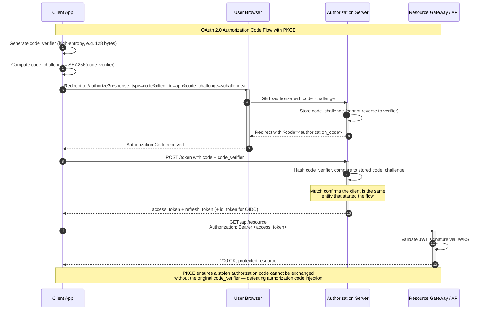

# Module 8: Authentication & Authorization

In a Zero-Trust world, identity is the new perimeter — every request must be cryptographically verified, regardless of network origin, through robust Authentication (`AuthN`) and Authorization (`AuthZ`).

---

## Table of Contents

- [1. Stateless Tokens vs. Stateful Sessions](#1-stateless-tokens-vs-stateful-sessions)
- [2. OAuth 2.0 & OIDC Deep Dive](#2-oauth-20--oidc-deep-dive)
- [3. Service-to-Service Security (mTLS)](#3-service-to-service-security-mtls)
- [4. Real-World Failure Modes](#4-real-world-failure-modes)
- [5. Production Code Template: JWT Validation](#5-production-code-template-jwt-validation)
- [6. Security Briefings](#6-security-briefings)

---

## 1. Stateless Tokens vs. Stateful Sessions

### Architectural Lifecycle

**Stateful Sessions (Cookie-Based):** The server generates a unique `Session ID` upon login, stored in a server-side database or cache (e.g., `Redis`). This ID is sent to the client as a cookie. Every subsequent request requires a stateful lookup to verify the session's validity.

**Stateless Tokens (JWT):** A JSON Web Token (`JWT`) is a compact, URL-safe means of representing claims between two parties. The token itself contains the user's identity and permissions. The server verifies the token mathematically — no database lookup required.

### Comparison Matrix

| Dimension | Session-Based (Stateful) | Token-Based Stateless (JWT) |
|---|---|---|
| **Storage** | Server-side database or cache (`Redis`) | Client-side; no server storage |
| **Scalability** | Requires shared session store across instances | Horizontally scales without shared state |
| **Revocation** | Instant — delete the session record | Impossible before TTL expiry (without a denylist) |
| **Complexity** | Lower; well-understood cookie semantics | Higher; key management, token rotation, clock skew |
| **Use Case** | Monoliths, server-rendered apps | APIs, microservices, distributed systems |

### JWT Cryptography Under the Hood

A `JWT` consists of three `Base64URL`-encoded parts separated by dots:

```
header.payload.signature
```

| Segment | Content | Example |
|---|---|---|
| **`Header`** | Token type and cryptographic algorithm (`RS256`, `ES256`) | `{"alg": "RS256", "typ": "JWT"}` |
| **`Payload`** | Claims — `sub` (subject), `exp` (expiration), `iss` (issuer), `aud` (audience) | `{"sub": "user_123", "exp": 1718000000}` |
| **`Signature`** | Hash of `header.payload` signed with a private key | Prevents tampering |

### Validation via JWKS

An API Gateway validates the signature using **JSON Web Key Sets (`JWKS`)**. In an **asymmetric** setup, the Authorization Server (`AS`) signs the `JWT` with a **private key**, but the Gateway only needs the **public key** — retrieved from a `jwks_uri` endpoint — to verify. This allows the Gateway to validate tokens without ever hitting a central auth database.

```text
Client:  presents JWT to Gateway
Gateway: fetches public key from Authorization Server's jwks_uri
Gateway: verifies RS256 signature using public key
Gateway: checks exp, iss, aud claims
Gateway: forwards request to backend (validated)
```

---

## 2. OAuth 2.0 & OIDC Deep Dive

### PKCE Authorization Code Flow

**Proof Key for Code Exchange (`PKCE`)** was originally designed for native apps but is now recommended for *all* OAuth clients, including web apps. It prevents attackers from intercepting and exchanging a stolen authorization code.



*The diagram above shows the PKCE-protected OAuth 2.0 flow: the client generates a `code_verifier`, sends its `SHA256` hash as the `code_challenge`, and must present the original verifier when exchanging the authorization code. A MitM who steals the code but lacks the verifier cannot complete the exchange.*

### AuthN (OIDC) vs. AuthZ (OAuth2)

| Protocol | Purpose | Token | Example |
|---|---|---|---|
| **OpenID Connect (`OIDC`)** | Authentication — *who you are* | `ID Token` (JWT with user profile claims) | `"sub": "user_123", "email": "a@b.com"` |
| **OAuth 2.0** | Authorization — *what you can do* | `Access Token` (opaque or JWT with scopes) | `"scope": "read:photos write:orders"` |

---

## 3. Service-to-Service Security (mTLS)

### Mutual TLS Architecture

In standard one-way `TLS`, the client verifies the server's identity. In **mutual TLS (`mTLS`)**, the server *also* verifies the client's identity using `X.509` certificates.

```text
Standard TLS:  Client verifies Server
mTLS:          Client verifies Server AND Server verifies Client
```

| Property | One-Way TLS | mTLS |
|---|---|---|
| **Server verification** | Yes | Yes |
| **Client verification** | No | Yes — via client certificate |
| **Certificate scope** | Server certificate only | Both sides present certificates |
| **Use case** | HTTPS web browsing | Microservice mesh, B2B APIs |

### Centralized PKI

Microservices rely on a **Public Key Infrastructure (`PKI`)** for certificate issuance. Each service is provisioned with its own certificate and private key at deployment time. During the `TLS` handshake, services exchange certificates and verify each other's identity against the trusted Root `CA` and certificate fingerprint.

### RBAC vs. ABAC

| Model | Decision Basis | Flexibility | Complexity |
|---|---|---|---|
| **RBAC** (Role-Based Access Control) | Roles (e.g., "Admin", "Editor", "Viewer") | Simpler, but rigid at scale | Low |
| **ABAC** (Attribute-Based Access Control) | User attributes, resource sensitivity, action type, environment | Fine-grained, dynamic | Higher |

---

## 4. Real-World Failure Modes

### The Stateless Dilemma: Revocation

Because `JWTs` are stateless with a fixed `TTL`, they remain valid until they expire — even if the user's permissions are revoked or their account is compromised.

| Solution | How It Works | Trade-off |
|---|---|---|
| **Short-lived tokens + Refresh Rotation** | Access token TTL of 5–10 minutes; each refresh invalidates the previous refresh token | Frequent refresh traffic; lockout risk if rotation response is lost |
| **Denylist (JTI blacklist)** | Cache of revoked token IDs (`jti`) in `Redis` | Reintroduces state; adds latency per request |
| **Sender-Constraining (DPoP / mTLS)** | Token bound to the client's public key; stolen token is useless without the private key | Requires mTLS or DPoP enrollment; higher setup cost |

### Replay Attacks & MITM

- **Replay Attack:** An attacker eavesdrops on the wire, steals a valid `JWT`, and "replays" it at the resource server.
- **MITM Breach:** If an Edge Proxy terminates `TLS` insecurely or fails to validate the cryptographic signature, an attacker can manipulate or spoof messages.
- **Mitigation:** **Sender-Constraining** via **DPoP** (`Demonstration of Proof-of-Possession`) or **mTLS** binds the token to a specific client instance. A stolen token is useless without the corresponding private key material.

---

## 5. Production Code Template: JWT Validation

```python
"""
Production-grade JWT validation function.

Validates a JWT's signature using an RSA public key (RS256), then
verifies the standard claims (exp, iss, aud). Raises specific
exceptions for each failure mode so callers can distinguish between
expired tokens, bad signatures, and wrong audience.

Usage:
    public_key_pem = open("public_key.pem").read()
    try:
        payload = decode_and_validate_jwt(
            token=token_string,
            public_key_pem=public_key_pem,
            expected_issuer="https://auth.example.com",
            expected_audience="api.example.com",
        )
    except jwt.ExpiredSignatureError:
        # Return 401 with "token_expired"
    except jwt.InvalidSignatureError:
        # Return 401 with "invalid_signature"
"""

from datetime import datetime, timezone
from typing import Any, Dict

import jwt
from jwt import PyJWKClient


def decode_and_validate_jwt(
    token: str,
    public_key_pem: str,
    expected_issuer: str,
    expected_audience: str,
    leeway_seconds: int = 30,
) -> Dict[str, Any]:
    """Decode, verify signature, and validate a JWT.

    Steps:
        1. Decode the JWT header to determine the key ID (kid).
        2. Verify the RS256/ES256 signature using the provided PEM.
        3. Validate ``exp`` (expiration), ``iss`` (issuer), and
           ``aud`` (audience) with a configurable clock leeway.

    Args:
        token: The encoded JWT string.
        public_key_pem: RSA or EC public key in PEM format.
        expected_issuer: The ``iss`` claim the token must contain.
        expected_audience: The ``aud`` claim the token must contain.
        leeway_seconds: Clock skew tolerance in seconds (default 30).

    Returns:
        The decoded payload dictionary.

    Raises:
        jwt.ExpiredSignatureError: Token is past its ``exp`` claim.
        jwt.InvalidAudienceError: ``aud`` does not match expected.
        jwt.InvalidIssuerError: ``iss`` does not match expected.
        jwt.InvalidSignatureError: Signature verification failed.
        jwt.DecodeError: Token is malformed.
    """
    options = {
        "verify_exp": True,
        "verify_iss": True,
        "verify_aud": True,
        "require": ["exp", "iss", "aud"],
        "leeway": leeway_seconds,
    }

    payload: Dict[str, Any] = jwt.decode(
        token,
        key=public_key_pem,
        algorithms=["RS256", "ES256"],
        issuer=expected_issuer,
        audience=expected_audience,
        options=options,
    )

    return payload


def fetch_jwks_and_validate(
    token: str,
    jwks_uri: str,
    expected_issuer: str,
    expected_audience: str,
) -> Dict[str, Any]:
    """Fetch the JWKS set from the issuer's ``jwks_uri`` and validate
    the token against the matching key.

    Uses ``PyJWKClient`` to cache the JWKS response and select the
    correct key by the token's ``kid`` (key ID) header.

    Args:
        token: The encoded JWT string.
        jwks_uri: URL of the Authorization Server's JWKS endpoint.
        expected_issuer: The ``iss`` claim the token must contain.
        expected_audience: The ``aud`` claim the token must contain.

    Returns:
        The decoded payload dictionary.
    """
    client = PyJWKClient(jwks_uri, cache_keys=True)
    signing_key = client.get_signing_key_from_jwt(token)

    payload: Dict[str, Any] = jwt.decode(
        token,
        key=signing_key.key,
        algorithms=["RS256", "ES256"],
        issuer=expected_issuer,
        audience=expected_audience,
        options={
            "verify_exp": True,
            "verify_iss": True,
            "verify_aud": True,
            "require": ["exp", "iss", "aud"],
        },
    )

    return payload


# ------------------------------------------------------------------
# Usage Examples
# ------------------------------------------------------------------
if __name__ == "__main__":
    import os

    # Example 1: Validate with a known public key PEM
    pem_path = os.environ.get("JWT_PUBLIC_KEY_PATH", "public_key.pem")
    with open(pem_path) as f:
        pem = f.read()

    demo_token = os.environ.get("DEMO_JWT", "")
    if demo_token:
        try:
            claims = decode_and_validate_jwt(
                token=demo_token,
                public_key_pem=pem,
                expected_issuer="https://auth.example.com",
                expected_audience="api.example.com",
            )
            print(f"Validated claims: {claims}")
        except jwt.ExpiredSignatureError:
            print("Token expired — client must refresh")
        except jwt.InvalidSignatureError:
            print("Signature mismatch — possible tampering")
        except (jwt.InvalidIssuerError, jwt.InvalidAudienceError) as exc:
            print(f"Claim mismatch: {exc}")

    # Example 2: Validate using a live JWKS endpoint
    jwks_token = os.environ.get("JWKS_DEMO_JWT", "")
    jwks_uri = os.environ.get("JWKS_URI", "https://auth.example.com/.well-known/jwks.json")
    if jwks_token:
        try:
            claims = fetch_jwks_and_validate(
                token=jwks_token,
                jwks_uri=jwks_uri,
                expected_issuer="https://auth.example.com",
                expected_audience="api.example.com",
            )
            print(f"JWKS-validated claims: {claims}")
        except Exception as exc:
            print(f"JWKS validation failed: {exc}")
```

---

## 6. Security Briefings

> **Briefing 1: The PKCE Downgrade**  
> A developer implements PKCE but leaves the `code_challenge` parameter optional to support legacy clients. Explain how a web attacker could exploit this to perform an authorization code injection attack.

<details><summary>Click for Senior Security Rubric</summary>

**Senior answer:**

- **Attack mechanism:** The attacker intercepts the authorization request and strips the `code_challenge` parameter from the query. The Authorization Server (`AS`) sees a request without a challenge and falls back to the plain Authorization Code flow (no PKCE). The attacker can now exchange a stolen authorization code for a token without needing the `code_verifier`.
- **Required mitigation:** The `AS` **must reject any token request** that includes a `code_verifier` if no `code_challenge` was present in the original `/authorize` request. It must also reject authorization requests that omit `code_challenge` unless the client is explicitly registered as a non-PKCE client.
- **Trade-off:** Forcing PKCE for all clients breaks legacy integrations that lack SDK support. A safe migration path is: (1) flag all non-PKCE clients, (2) enforce PKCE via a feature flag in the `AS`, (3) remove the flag after a deprecation window.
</details>

> **Briefing 2: The Multi-AS Mix-Up Attack**  
> A client application is registered with two different Authorization Servers (`AS-A` and `AS-B`). Explain the "Mix-Up" attack and how the `iss` (issuer) parameter prevents it.

<details><summary>Click for Senior Security Rubric</summary>

**Senior answer:**

- **Attack mechanism:** The client initiates an OAuth flow with the honest `AS-A`. An attacker-controlled `AS-B` intercepts the redirect and returns its own authorization code to the client. The client then exchanges this code with `AS-B`, leaking the client's credentials to the attacker's server. The attacker uses those credentials to impersonate the client at `AS-A`.
- **Mitigation — the `iss` parameter:** The OAuth 2.0 Mix-Up Mitigation spec requires the Authorization Server to include its `iss` (issuer) identifier in both the authorization response (as a query parameter) and the token response (as a claim). The client **must** verify that the `iss` value matches the `AS` it intended to talk to before proceeding with the code exchange.
- **Trade-off:** The client must maintain a mapping of expected `iss` values per `AS` endpoint. If the `iss` check is added after deployment, existing integrations may break until every `AS` is updated to return the parameter.
</details>

> **Briefing 3: The "Zombie" Refresh Token**  
> You implement Refresh Token Rotation. A network partition occurs, and a legitimate client fails to receive the new refresh token, but the Authorization Server has already invalidated the old one. What happens, and why is this a desirable safety trade-off?

<details><summary>Click for Senior Security Rubric</summary>

**Senior answer:**

- **Result:** The client is permanently locked out from the refresh flow. The user must re-authenticate (re-enter credentials) to obtain a new refresh token pair.
- **Why it is intentional:** The `AS` cannot distinguish between (a) a network failure causing the client to miss the rotated token, and (b) an attacker who stole the old refresh token and used it, triggering rotation. In both cases, the old refresh token has been consumed.
- **Trade-off analysis:** This design favors **Security / Integrity over Availability**. Losing the refresh token forces a re-login (availability impact) but ensures that a stolen refresh token cannot be reused after rotation (security benefit). Engineering mitigations include:
  - **Reuse detection:** The `AS` can detect reuse of a rotated token and alert rather than immediately invalidating the replacement.
  - **Grace period:** Keep the old token valid for a short window (seconds) while the client receives the new one.
  - **Idempotent rotation:** Allow the client to retry the refresh with the same token if the response is lost, using a token endpoint nonce.
</details>
