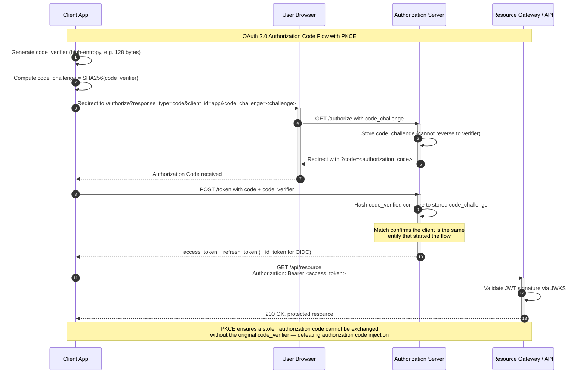
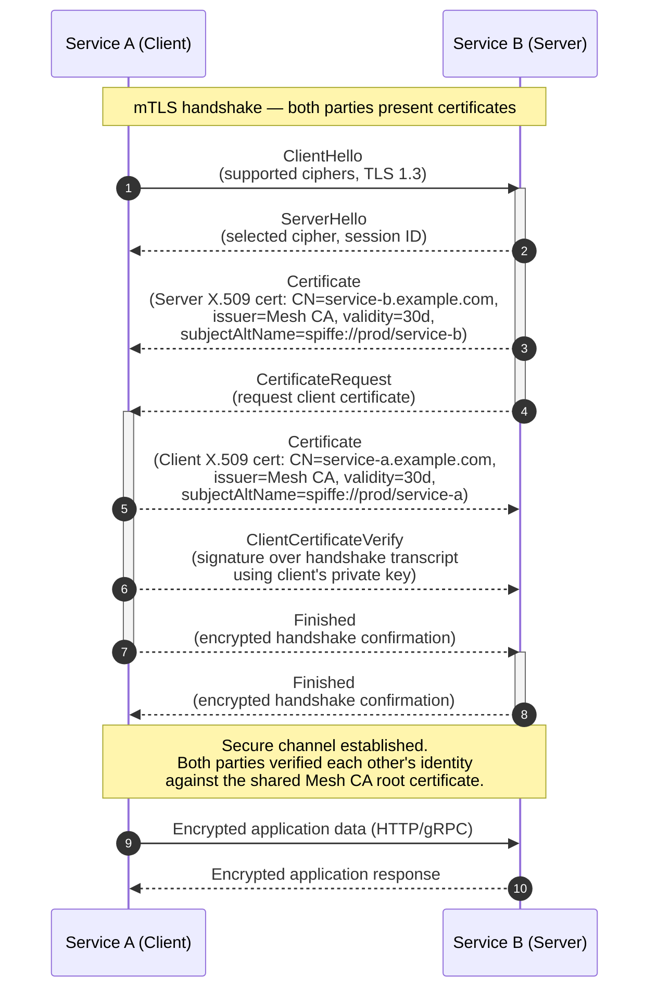

# Module 8: Authentication & Authorization

In a Zero-Trust world, identity is the new perimeter — every request must be cryptographically verified, regardless of network origin, through robust Authentication (`AuthN`) and Authorization (`AuthZ`).

---

## Table of Contents

- [1. Stateless Tokens vs. Stateful Sessions](#1-stateless-tokens-vs-stateful-sessions)
- [2. OAuth 2.0 & OIDC Deep Dive](#2-oauth-20--oidc-deep-dive)
- [3. Service-to-Service Security (mTLS)](#3-service-to-service-security-mtls)
- [4. Real-World Failure Modes](#4-real-world-failure-modes)
- [5. Production Code Template: JWT Validation](#5-production-code-template-jwt-validation)
- [6. Security Briefings](#6-security-briefings)
- [7. Common Mistakes](#7-common-mistakes)
- [8. Key Takeaways](#8-key-takeaways)
- [9. Self-Assessment Questions](#9-self-assessment-questions)

---

## 1. Stateless Tokens vs. Stateful Sessions

### Architectural Lifecycle

**Stateful Sessions (Cookie-Based):** The server generates a unique `Session ID` upon login, stored in a server-side database or cache (e.g., `Redis`). This ID is sent to the client as a cookie. Every subsequent request requires a stateful lookup to verify the session's validity. Think of this like a hotel key card — the front desk (server) keeps a record of which room you are in, and every time you enter the building you must hand over your card so the clerk can look up your reservation in the computer.

**Stateless Tokens (JWT):** A JSON Web Token (`JWT`) is a compact, URL-safe means of representing claims between two parties. The token itself contains the user's identity and permissions. The server verifies the token mathematically — no database lookup required. This is like a passport: it contains your photo, your name, and an official stamp (signature) that any border agent can verify using a public document (the signing key). The agent does not need to call your home country to confirm you are who you say you are — the cryptographic signature proves it.

### Comparison Matrix

| Dimension | Session-Based (Stateful) | Token-Based Stateless (JWT) |
|---|---|---|
| **Storage** | Server-side database or cache (`Redis`) | Client-side; no server storage |
| **Scalability** | Requires shared session store across instances | Horizontally scales without shared state |
| **Revocation** | Instant — delete the session record | Impossible before TTL expiry (without a denylist) |
| **Complexity** | Lower; well-understood cookie semantics | Higher; key management, token rotation, clock skew |
| **Use Case** | Monoliths, server-rendered apps | APIs, microservices, distributed systems |

### JWT Cryptography Under the Hood

A `JWT` consists of three `Base64URL`-encoded parts separated by dots:

```
header.payload.signature
```

| Segment | Content | Example |
|---|---|---|
| **`Header`** | Token type and cryptographic algorithm (`RS256`, `ES256`) | `{"alg": "RS256", "typ": "JWT"}` |
| **`Payload`** | Claims — `sub` (subject), `exp` (expiration), `iss` (issuer), `aud` (audience) | `{"sub": "user_123", "exp": 1718000000}` |
| **`Signature`** | Hash of `header.payload` signed with a private key | Prevents tampering |

#### How the Signature Is Created and Verified

Using `RS256` (RSA with SHA-256), the process is:

1. **Signing:** The issuer takes `base64url(header) + "." + base64url(payload)`, computes `SHA-256` of that string, and encrypts the hash with their **private key** using RSA.
2. **Verification:** The verifier takes the same `base64url(header) + "." + base64url(payload)`, computes `SHA-256` of that string, and uses the issuer's **public key** to decrypt the signature and compare the hashes. If they match, the token has not been tampered with and was definitely signed by the holder of the private key.

**What happens if someone tries to tamper with the payload?** They modify a claim (e.g., change `"sub": "user_123"` to `"sub": "admin"`), re-encode the payload, and create a new JWT with the modified payload. But when the verifier checks the signature, the hash of the modified payload will not match the decrypted signature, and verification fails. The attacker cannot create a valid signature because they do not have the private key.

#### Verification with OpenSSL Commands

Here is exactly what happens under the hood when a gateway verifies an `RS256`-signed JWT:

```bash
# Step 1: Extract the body (header.payload) from the JWT
JWT="eyJhbGciOiJSUzI1NiIsInR5cCI6IkpXVCJ9.eyJzdWIiOiIxMjM0In0.something"
BODY=$(echo "$JWT" | cut -d. -f1-2)

# Step 2: Extract the signature (base64url-encoded)
SIG=$(echo "$JWT" | cut -d. -f3)

# Step 3: Decode the signature from base64url to binary
echo "$SIG" | sed 's/-/+/g; s/_/\//g' | base64 -d > sig.bin

# Step 4: Verify the signature using the public key
echo -n "$BODY" | openssl dgst -sha256 -verify public_key.pem -signature sig.bin
# Output: "Verified OK"
```

### Validation via JWKS

An API Gateway validates the signature using **JSON Web Key Sets (`JWKS`)**. In an **asymmetric** setup, the Authorization Server (`AS`) signs the `JWT` with a **private key**, but the Gateway only needs the **public key** — retrieved from a `jwks_uri` endpoint — to verify. This allows the Gateway to validate tokens without ever hitting a central auth database.

```text
Client:  presents JWT to Gateway
Gateway: fetches public key from Authorization Server's jwks_uri
Gateway: verifies RS256 signature using public key
Gateway: checks exp, iss, aud claims
Gateway: forwards request to backend (validated)
```

The `kid` (key ID) in the JWT header tells the gateway which key from the JWKS set to use. This allows the Authorization Server to rotate keys without invalidating active tokens: old tokens signed with key `kid=1` keep working as long as `kid=1` is still in the JWKS set, and new tokens use `kid=2`.

---

## 2. OAuth 2.0 & OIDC Deep Dive

### PKCE Authorization Code Flow

**Proof Key for Code Exchange (`PKCE`)** was originally designed for native apps but is now recommended for *all* OAuth clients, including web apps. It prevents attackers from intercepting and exchanging a stolen authorization code.

#### The Nightclub Hand-Stamp Analogy

Think of the OAuth Authorization Code flow as a nightclub entry system:

- The **Authorization Code** is like a hand stamp you get at the door. Anyone with the stamp can enter. If a pickpocket copies your stamp, they can walk in as you.
- **PKCE** adds a secret phrase: when you ask for the stamp, the bouncer writes down "the first word of your favourite song" on a card. When you come back with your stamp, you must also whisper the first word of your favourite song. The pickpocket who copied your stamp does not know the secret phrase, so they cannot enter.

**Step by step:**

1. The **client app** generates a random high-entropy string called the `code_verifier`. This is the secret phrase.
2. The client hashes the verifier to create a `code_challenge` — this is the "SHA-256 version of the first word of your favourite song" written on the card.
3. The client sends the `code_challenge` to the Authorization Server during the initial authorization request. The server stores it.
4. When exchanging the authorization code for a token, the client sends the original `code_verifier`. The server hashes it and compares it to the stored `code_challenge`. If they match, the client is proven to be the same entity that started the flow.



*The diagram above shows the PKCE-protected OAuth 2.0 flow: the client generates a `code_verifier`, sends its `SHA256` hash as the `code_challenge`, and must present the original verifier when exchanging the authorization code. A MitM who steals the code but lacks the verifier cannot complete the exchange.*

### AuthN (OIDC) vs. AuthZ (OAuth2)

| Protocol | Purpose | Token | Example |
|---|---|---|---|
| **OpenID Connect (`OIDC`)** | Authentication — *who you are* | `ID Token` (JWT with user profile claims) | `"sub": "user_123", "email": "a@b.com"` |
| **OAuth 2.0** | Authorization — *what you can do* | `Access Token` (opaque or JWT with scopes) | `"scope": "read:photos write:orders"` |

A helpful way to remember the difference: **OIDC = passport. OAuth2 = key card.** A passport proves your identity (name, nationality, date of birth). A key card proves you can open certain doors (room 301, the gym, the parking garage). They are often used together — you show your passport to get a key card — but they serve fundamentally different purposes.

---

## 3. Service-to-Service Security (mTLS)

### Mutual TLS Architecture

In standard one-way `TLS`, the client verifies the server's identity. In **mutual TLS (`mTLS`)**, the server *also* verifies the client's identity using `X.509` certificates.

```text
Standard TLS:  Client verifies Server
mTLS:          Client verifies Server AND Server verifies Client
```

| Property | One-Way TLS | mTLS |
|---|---|---|
| **Server verification** | Yes | Yes |
| **Client verification** | No | Yes — via client certificate |
| **Certificate scope** | Server certificate only | Both sides present certificates |
| **Use case** | HTTPS web browsing | Microservice mesh, B2B APIs |

#### Full mTLS Handshake Sequence



*The mTLS handshake adds two extra messages beyond standard TLS: the server sends a `CertificateRequest` asking for a client certificate, and the client responds with its `Certificate` plus a `ClientCertificateVerify` that proves possession of the corresponding private key. Both certificates are signed by the same Mesh `CA`, forming a mutual chain of trust.*

**Step-by-step walkthrough of the mTLS handshake:**

1. **ClientHello (1):** Service A initiates the connection, advertising supported TLS versions and cipher suites. It also indicates that it is prepared to send a client certificate if requested.
2. **ServerHello + Certificate (2–3):** Service B responds with its chosen cipher and its server certificate. This certificate is signed by the Mesh `CA` and contains its identity (`CN=service-b.example.com`, `spiffe://prod/service-b`).
3. **CertificateRequest (4):** Service B explicitly asks for a client certificate. In one-way TLS, this step does not exist.
4. **Client Certificate (5):** Service A sends its own certificate, signed by the same Mesh `CA`, proving its identity (`CN=service-a.example.com`, `spiffe://prod/service-a`).
5. **ClientCertificateVerify (6):** Service A signs the entire handshake transcript so far with its private key. Service B verifies this signature using the public key in Service A's certificate. This proves Service A actually possesses the private key corresponding to the certificate — it is not just replaying a stolen certificate.
6. **Finished (7–8):** Both sides confirm the handshake is complete and switch to encrypted application data.

### Centralized PKI

Microservices rely on a **Public Key Infrastructure (`PKI`)** for certificate issuance. Each service is provisioned with its own certificate and private key at deployment time. During the `TLS` handshake, services exchange certificates and verify each other's identity against the trusted Root `CA` and certificate fingerprint.

In a service mesh like Istio, the control plane (`istiod`) runs a Certificate Authority that automatically issues SPIFFE-compliant certificates to every sidecar proxy. The certificate's `SubjectAltName` contains the service identity (e.g., `spiffe://cluster.local/ns/default/sa/payment-service`), which the receiving proxy verifies against its authorization policy.

### RBAC vs. ABAC

| Model | Decision Basis | Flexibility | Complexity |
|---|---|---|---|
| **RBAC** (Role-Based Access Control) | Roles (e.g., "Admin", "Editor", "Viewer") | Simpler, but rigid at scale | Low |
| **ABAC** (Attribute-Based Access Control) | User attributes, resource sensitivity, action type, environment | Fine-grained, dynamic | Higher |

**When to use which:** RBAC is the right choice when roles are stable and well-defined (e.g., "only Admins can delete users"). ABAC becomes necessary when access decisions depend on context (e.g., "managers can view salaries of employees in their department during the performance-review window"). Most mature systems use a hybrid: RBAC for coarse-grained access and ABAC for fine-grained overrides.

---

## 4. Real-World Failure Modes

### The Stateless Dilemma: Revocation

Because `JWTs` are stateless with a fixed `TTL`, they remain valid until they expire — even if the user's permissions are revoked or their account is compromised.

| Solution | How It Works | Trade-off |
|---|---|---|
| **Short-lived tokens + Refresh Rotation** | Access token TTL of 5–10 minutes; each refresh invalidates the previous refresh token | Frequent refresh traffic; lockout risk if rotation response is lost |
| **Denylist (JTI blacklist)** | Cache of revoked token IDs (`jti`) in `Redis` | Reintroduces state; adds latency per request |
| **Sender-Constraining (DPoP / mTLS)** | Token bound to the client's public key; stolen token is useless without the private key | Requires mTLS or DPoP enrollment; higher setup cost |

### Replay Attacks & MITM

- **Replay Attack:** An attacker eavesdrops on the wire, steals a valid `JWT`, and "replays" it at the resource server.
- **MITM Breach:** If an Edge Proxy terminates `TLS` insecurely or fails to validate the cryptographic signature, an attacker can manipulate or spoof messages.
- **Mitigation:** **Sender-Constraining** via **DPoP** (`Demonstration of Proof-of-Possession`) or **mTLS** binds the token to a specific client instance. A stolen token is useless without the corresponding private key material.

### What Happens in Production: The JWT `alg: none` Attack

In the early 2010s, several high-profile companies shipped JWT validation code that looked like this:

```python
# VULNERABLE — do not use
header = jwt.decode_header(token)
if header["alg"] == "RS256":
    key = get_public_key()
elif header["alg"] == "none":
    key = None  # "no signature" algorithm
payload = jwt.decode(token, key=key, algorithms=[header["alg"]])
```

**The vulnerability:** An attacker sets the algorithm to `"none"` and removes the signature entirely. The validation library sees `alg: none`, sets `key = None`, and calls `verify()` which trivially passes because there is nothing to verify. The attacker can forge a JWT with any claims they want.

**Impact:** At one major payment company, attackers exploited this to forge admin-level tokens and access internal APIs that processed millions of dollars in transactions. The vulnerability was discovered during a routine security audit after an engineer noticed "impossible" log entries — actions that only an admin could perform, traced back to a user who had never been granted admin privileges.

**The fix:** Never accept the algorithm from the token header. Always hardcode the algorithm on the server side:

```python
# SAFE — algorithm is hardcoded, never read from token
payload = jwt.decode(token, key=public_key, algorithms=["RS256"])
```

Most modern JWT libraries (`PyJWT`, `java-jwt`, `node-jsonwebtoken`) now reject `alg: none` by default, but custom validation code in older deployments may still be vulnerable.

---

## 5. Production Code Template: JWT Validation

```python
"""
Production-grade JWT validation function.

Validates a JWT's signature using an RSA public key (RS256), then
verifies the standard claims (exp, iss, aud). Raises specific
exceptions for each failure mode so callers can distinguish between
expired tokens, bad signatures, and wrong audience.

Usage:
    public_key_pem = open("public_key.pem").read()
    try:
        payload = decode_and_validate_jwt(
            token=token_string,
            public_key_pem=public_key_pem,
            expected_issuer="https://auth.example.com",
            expected_audience="api.example.com",
        )
    except jwt.ExpiredSignatureError:
        # Return 401 with "token_expired"
    except jwt.InvalidSignatureError:
        # Return 401 with "invalid_signature"
"""

from datetime import datetime, timezone
from typing import Any, Dict

import jwt
from jwt import PyJWKClient


def decode_and_validate_jwt(
    token: str,
    public_key_pem: str,
    expected_issuer: str,
    expected_audience: str,
    leeway_seconds: int = 30,
) -> Dict[str, Any]:
    """Decode, verify signature, and validate a JWT.

    Steps:
        1. Decode the JWT header to determine the key ID (kid).
        2. Verify the RS256/ES256 signature using the provided PEM.
        3. Validate ``exp`` (expiration), ``iss`` (issuer), and
           ``aud`` (audience) with a configurable clock leeway.

    Args:
        token: The encoded JWT string.
        public_key_pem: RSA or EC public key in PEM format.
        expected_issuer: The ``iss`` claim the token must contain.
        expected_audience: The ``aud`` claim the token must contain.
        leeway_seconds: Clock skew tolerance in seconds (default 30).

    Returns:
        The decoded payload dictionary.

    Raises:
        jwt.ExpiredSignatureError: Token is past its ``exp`` claim.
        jwt.InvalidAudienceError: ``aud`` does not match expected.
        jwt.InvalidIssuerError: ``iss`` does not match expected.
        jwt.InvalidSignatureError: Signature verification failed.
        jwt.DecodeError: Token is malformed.
    """
    options = {
        "verify_exp": True,
        "verify_iss": True,
        "verify_aud": True,
        "require": ["exp", "iss", "aud"],
        "leeway": leeway_seconds,
    }

    payload: Dict[str, Any] = jwt.decode(
        token,
        key=public_key_pem,
        algorithms=["RS256", "ES256"],
        issuer=expected_issuer,
        audience=expected_audience,
        options=options,
    )

    return payload


def fetch_jwks_and_validate(
    token: str,
    jwks_uri: str,
    expected_issuer: str,
    expected_audience: str,
) -> Dict[str, Any]:
    """Fetch the JWKS set from the issuer's ``jwks_uri`` and validate
    the token against the matching key.

    Uses ``PyJWKClient`` to cache the JWKS response and select the
    correct key by the token's ``kid`` (key ID) header.

    Args:
        token: The encoded JWT string.
        jwks_uri: URL of the Authorization Server's JWKS endpoint.
        expected_issuer: The ``iss`` claim the token must contain.
        expected_audience: The ``aud`` claim the token must contain.

    Returns:
        The decoded payload dictionary.
    """
    client = PyJWKClient(jwks_uri, cache_keys=True)
    signing_key = client.get_signing_key_from_jwt(token)

    payload: Dict[str, Any] = jwt.decode(
        token,
        key=signing_key.key,
        algorithms=["RS256", "ES256"],
        issuer=expected_issuer,
        audience=expected_audience,
        options={
            "verify_exp": True,
            "verify_iss": True,
            "verify_aud": True,
            "require": ["exp", "iss", "aud"],
        },
    )

    return payload


# ------------------------------------------------------------------
# Usage Examples
# ------------------------------------------------------------------
if __name__ == "__main__":
    import os

    # Example 1: Validate with a known public key PEM
    pem_path = os.environ.get("JWT_PUBLIC_KEY_PATH", "public_key.pem")
    with open(pem_path) as f:
        pem = f.read()

    demo_token = os.environ.get("DEMO_JWT", "")
    if demo_token:
        try:
            claims = decode_and_validate_jwt(
                token=demo_token,
                public_key_pem=pem,
                expected_issuer="https://auth.example.com",
                expected_audience="api.example.com",
            )
            print(f"Validated claims: {claims}")
        except jwt.ExpiredSignatureError:
            print("Token expired — client must refresh")
        except jwt.InvalidSignatureError:
            print("Signature mismatch — possible tampering")
        except (jwt.InvalidIssuerError, jwt.InvalidAudienceError) as exc:
            print(f"Claim mismatch: {exc}")

    # Example 2: Validate using a live JWKS endpoint
    jwks_token = os.environ.get("JWKS_DEMO_JWT", "")
    jwks_uri = os.environ.get("JWKS_URI", "https://auth.example.com/.well-known/jwks.json")
    if jwks_token:
        try:
            claims = fetch_jwks_and_validate(
                token=jwks_token,
                jwks_uri=jwks_uri,
                expected_issuer="https://auth.example.com",
                expected_audience="api.example.com",
            )
            print(f"JWKS-validated claims: {claims}")
        except Exception as exc:
            print(f"JWKS validation failed: {exc}")
```

### Step-by-Step Code Walkthrough

**`decode_and_validate_jwt` function:**

1. **Options dictionary (lines ~236–242):** The function builds a set of verification options. `verify_exp`, `verify_iss`, and `verify_aud` are all `True`, forcing the library to check these claims. `require` ensures the token must contain these three claims — if any is missing, `jwt.decode` raises an error immediately. `leeway=30` provides a 30-second clock skew tolerance, which is essential because the servers that issued the token and the server validating it may have slightly different system clocks.

2. **`jwt.decode` call (lines ~244–251):** This single function call does four things under the hood:
   - **Header parsing:** Reads the `alg` field from the token header. Critically, the `algorithms=["RS256", "ES256"]` parameter restricts which algorithms are accepted — if the token header says `alg: none`, the library rejects it.
   - **Key resolution:** Uses the provided `public_key_pem` for RS256 or ES256 verification.
   - **Signature verification:** Computes the hash of `header.payload`, decrypts the signature using the public key, and compares them.
   - **Claim validation:** Checks that `exp` (expiration) is in the future, `iss` matches `expected_issuer`, and `aud` matches `expected_audience`.

**`fetch_jwks_and_validate` function:**

1. **`PyJWKClient` (line ~277):** Creates a client that fetches the JWKS set from the issuer's well-known endpoint. The `cache_keys=True` parameter caches the JWKS response to avoid fetching it on every request. The cache respects the `Cache-Control` and `Expires` headers from the JWKS endpoint response.
2. **`get_signing_key_from_jwt` (line ~278):** This method parses the JWT header, extracts the `kid` (key ID), and finds the matching key in the cached JWKS set. If a key with that `kid` does not exist, it re-fetches the JWKS set (the key may have been rotated since the last fetch).
3. **`signing_key.key` (line ~282):** The `PyJWKClient` automatically converts the JWK format (which contains `n` and `e` for RSA keys or `x` and `y` for EC keys) into a PEM-formatted key object that `jwt.decode` can use.

---

## 6. Security Briefings

> **Briefing 1: The PKCE Downgrade**  
> A developer implements PKCE but leaves the `code_challenge` parameter optional to support legacy clients. Explain how a web attacker could exploit this to perform an authorization code injection attack.

<details><summary>Click for Senior Security Rubric</summary>

**Senior answer:**

- **Attack mechanism:** The attacker intercepts the authorization request and strips the `code_challenge` parameter from the query. The Authorization Server (`AS`) sees a request without a challenge and falls back to the plain Authorization Code flow (no PKCE). The attacker can now exchange a stolen authorization code for a token without needing the `code_verifier`.
- **Required mitigation:** The `AS` **must reject any token request** that includes a `code_verifier` if no `code_challenge` was present in the original `/authorize` request. It must also reject authorization requests that omit `code_challenge` unless the client is explicitly registered as a non-PKCE client.
- **Trade-off:** Forcing PKCE for all clients breaks legacy integrations that lack SDK support. A safe migration path is: (1) flag all non-PKCE clients, (2) enforce PKCE via a feature flag in the `AS`, (3) remove the flag after a deprecation window.
</details>

> **Briefing 2: The Multi-AS Mix-Up Attack**  
> A client application is registered with two different Authorization Servers (`AS-A` and `AS-B`). Explain the "Mix-Up" attack and how the `iss` (issuer) parameter prevents it.

<details><summary>Click for Senior Security Rubric</summary>

**Senior answer:**

- **Attack mechanism:** The client initiates an OAuth flow with the honest `AS-A`. An attacker-controlled `AS-B` intercepts the redirect and returns its own authorization code to the client. The client then exchanges this code with `AS-B`, leaking the client's credentials to the attacker's server. The attacker uses those credentials to impersonate the client at `AS-A`.
- **Mitigation — the `iss` parameter:** The OAuth 2.0 Mix-Up Mitigation spec requires the Authorization Server to include its `iss` (issuer) identifier in both the authorization response (as a query parameter) and the token response (as a claim). The client **must** verify that the `iss` value matches the `AS` it intended to talk to before proceeding with the code exchange.
- **Trade-off:** The client must maintain a mapping of expected `iss` values per `AS` endpoint. If the `iss` check is added after deployment, existing integrations may break until every `AS` is updated to return the parameter.
</details>

> **Briefing 3: The "Zombie" Refresh Token**  
> You implement Refresh Token Rotation. A network partition occurs, and a legitimate client fails to receive the new refresh token, but the Authorization Server has already invalidated the old one. What happens, and why is this a desirable safety trade-off?

<details><summary>Click for Senior Security Rubric</summary>

**Senior answer:**

- **Result:** The client is permanently locked out from the refresh flow. The user must re-authenticate (re-enter credentials) to obtain a new refresh token pair.
- **Why it is intentional:** The `AS` cannot distinguish between (a) a network failure causing the client to miss the rotated token, and (b) an attacker who stole the old refresh token and used it, triggering rotation. In both cases, the old refresh token has been consumed.
- **Trade-off analysis:** This design favors **Security / Integrity over Availability**. Losing the refresh token forces a re-login (availability impact) but ensures that a stolen refresh token cannot be reused after rotation (security benefit). Engineering mitigations include:
  - **Reuse detection:** The `AS` can detect reuse of a rotated token and alert rather than immediately invalidating the replacement.
  - **Grace period:** Keep the old token valid for a short window (seconds) while the client receives the new one.
  - **Idempotent rotation:** Allow the client to retry the refresh with the same token if the response is lost, using a token endpoint nonce.
</details>

---

## 7. Common Mistakes

> **⚠️ Mistake 1: Accepting the algorithm from the JWT header.**  
> Never trust `header["alg"]` when validating a JWT. An attacker can set `alg: none` to bypass signature verification entirely. Always hardcode the accepted algorithms on the server side: `jwt.decode(token, algorithms=["RS256"])`. If the token header specifies a different algorithm, the library should reject it.

> **⚠️ Mistake 2: Using symmetric keys (HS256) for service-to-service JWTs.**  
> `HS256` uses a shared secret — any service that can verify a token can also issue a forged token. In a microservice environment, the key must be shared across all services that validate tokens, which means a compromise of any single service compromises the entire system. Always use asymmetric algorithms (RS256, ES256) for service-to-service communication. The signing service holds the private key; all other services only have the public key and cannot forge tokens.

> **⚠️ Mistake 3: Ignoring clock skew in JWT validation.**  
> JWT expiration (`exp`) is checked against the server's system clock. If the Authorization Server's clock is 10 seconds ahead of the resource server's clock, valid tokens will be rejected. Always set a `leeway` of 30–60 seconds on the `exp` check. More importantly, never use `iat` (issued-at) for critical decisions — an NTP correction on the issuing server can cause `iat` to appear in the future.

> **⚠️ Mistake 4: Not caching the JWKS response.**  
> Every token validation requires the corresponding public key. If the gateway fetches the JWKS set from the Authorization Server on every request (hundreds of requests per second), the Auth Server becomes a bottleneck. Always cache the JWKS response with a TTL equal to the `Cache-Control` max-age (typically 1 hour). Use `PyJWKClient(cache_keys=True)` or equivalent in your language.

---

## 8. Key Takeaways

1. **JWTs enable stateless, scalable authentication.** The token contains all information needed for verification — no server-side session store required. The trade-off is that revocation is impossible before TTL expiry without a denylist.

2. **PKCE is mandatory for all OAuth 2.0 clients.** The `code_challenge` / `code_verifier` mechanism prevents authorization code interception attacks. There is no reason not to use it — it adds one hash operation and a few bytes to the request.

3. **mTLS provides automatic, cryptographically verified service identity.** In a service mesh, every service-to-service connection is mutually authenticated using X.509 certificates issued by a shared CA. No API keys, no shared secrets, no hardcoded tokens.

4. **JWT validation must be done server-side with hardcoded algorithms.** Never trust the `alg` field in the token header. Always specify `algorithms=["RS256", "ES256"]` in your validation call. The `alg: none` attack has been responsible for countless security breaches.

5. **JWKS enables key rotation without token invalidation.** The `kid` (key ID) in the JWT header selects which public key from the JWKS set to use. Old tokens keep working as long as their `kid` is still present in the JWKS set, enabling seamless key rotation.

6. **Sender-constrained tokens (DPoP, mTLS) solve the stolen-token problem.** A bearer token is valuable to anyone who possesses it. Binding the token to a specific client instance via DPoP or mTLS ensures that even if the token is stolen, it cannot be used without the corresponding private key.

7. **Clock skew matters.** Always set a leeway of 30–60 seconds on JWT expiration checks. Use NTP on all servers. Never use `iat` for security-critical decisions.

---

## 9. Self-Assessment Questions

> **Question 1: JWT Algorithm Confusion**  
> A developer implements JWT validation with `HS256` using the public key as the HMAC secret. Why is this vulnerable, and what does the attacker need to exploit it? The Authorization Server uses `RS256` to sign tokens, but the resource server accepts both `RS256` and `HS256`.

<details><summary>Click for Answer</summary>

This is a classic "algorithm confusion" attack (CVE-2015-9235). The resource server accepts `HS256` (symmetric HMAC) and `RS256` (asymmetric RSA). The Authorization Server signs tokens with its private key using `RS256`. The attacker can:

1. Extract the **public key** from the Authorization Server's `jwks_uri` endpoint (this is public information).
2. Forge a JWT with `alg: HS256` in the header and sign it using the **public key** as the HMAC secret.
3. Present the forged token to the resource server. The resource server sees `alg: HS256` and uses... the public key (which it has) as the HMAC secret. The signature verifies, and the forged token is accepted.

**Fix:** Restrict accepted algorithms to asymmetric ones only: `jwt.decode(token, algorithms=["RS256"])`. Never allow symmetric and asymmetric algorithms in the same validation call. Modern JWT libraries (PyJWT ≥2.0) enforce this by default.
</details>

> **Question 2: mTLS Certificate Expiry**  
> In a service mesh with mTLS, all service certificates expire after 24 hours and are automatically rotated by the control plane. The control plane goes offline. What happens to existing mTLS connections and new connection attempts after the certificate expiry?

<details><summary>Click for Answer</summary>

- **Existing connections:** TLS sessions that were established before the certificate expiry remain valid. The mTLS handshake already completed successfully, and the negotiated session keys are still valid. The connection is not torn down.
- **New connections:** When Service A tries to establish a new mTLS connection to Service B, it presents its (expired) certificate. Service B's proxy checks the certificate validity period, finds it expired, and rejects the connection. The handshake fails.
- **Recovery:** When the control plane comes back online, it issues fresh certificates to all proxies (via the Secret Discovery Service / SDS). New connections succeed again. No connections were permanently lost — only new connections during the control plane outage were blocked.
- **Design lesson:** Balance certificate lifetime against control plane risk. A 24-hour TTL is tight but forces rapid rotation; if the control plane is unreliable, consider a longer TTL (7 days) with rotation triggered on a configurable schedule. The trade-off is that a compromised certificate is valid longer.
</details>

> **Question 3: Refresh Token Rotation Failure**  
> A mobile app uses refresh token rotation with a 7-day refresh token TTL and a 10-minute access token TTL. A user opens the app after 2 weeks of inactivity. What happens, and how should the app handle this gracefully?

<details><summary>Click for Answer</summary>

The refresh token has expired (7-day TTL, but 14 days have passed). The token refresh request returns an error (typically `invalid_grant` or `token_expired`). The app must re-authenticate the user.

**Graceful handling:**

1. The app should silently attempt the token refresh. If it fails with a token-related error (not a network error), the app transitions to the logged-out state.
2. The app should NOT show a generic error message. Instead, it should show a login screen with context — "your session expired, please sign in again" — so the user understands why they were logged out.
3. If the app has any locally cached data that was fetched with the previous access token, it should preserve that data across the re-login to avoid a jarring "blank screen" experience.
4. For a smoother UX, consider using **silent authentication** (OIDC `prompt=none` in an iframe) to re-establish the session without a full login redirect. This only works if the user has an active session cookie with the Authorization Server.
</details>

> **Question 4: DPoP vs. mTLS**  
> You are designing a public API that must be consumed by third-party mobile apps and server-side services. You need to prevent replay attacks (a stolen token must be useless). Should you use DPoP or mTLS? Justify your choice.

<details><summary>Click for Answer</summary>

**DPoP** (Demonstration of Proof-of-Possession) is the correct choice for public APIs consumed by third-party mobile apps. Here is why:

- **mTLS requires the client to have a certificate and private key.** Mobile apps cannot securely store private keys — any key embedded in the app binary can be extracted by an attacker who decompiles the app. Issuing certificates to millions of third-party mobile clients is operationally impractical.
- **DPoP** works differently: the client generates a key pair on first use and stores the private key in the device's secure enclave (iOS Keychain / Android Keystore). The public key is registered with the Authorization Server during the token request. Every API call includes a `DPoP` header that proves possession of the private key. The access token is cryptographically bound to the public key. Even if the token is stolen, the attacker cannot create a valid `DPoP` header without the private key.

**For server-side services (where the client is another service with a private key managed by your infrastructure), mTLS is the simpler choice** — no additional headers, no DPoP proof generation, just a standard TLS handshake with client certificates.
</details>
