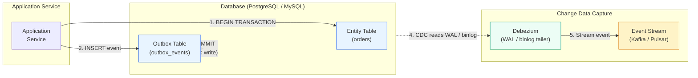

# Module 9: Microservices Patterns (Saga, Outbox, CQRS, Event Sourcing)

In high-throughput microservices, we must abandon the comfort of strong consistency and embrace eventual consistency to achieve planetary scale — this module covers the four essential patterns that maintain data integrity when a single business process spans multiple database boundaries.

---

## Table of Contents

- [1. The Saga Pattern for Distributed Transactions](#1-the-saga-pattern-for-distributed-transactions)
- [2. Reliable Messaging via the Transactional Outbox](#2-reliable-messaging-via-the-transactional-outbox)
- [3. CQRS & Event Sourcing](#3-cqrs--event-sourcing)
- [4. Real-World Failure Modes](#4-real-world-failure-modes)
- [5. Production Code Template: Orchestration-Based Saga Controller](#5-production-code-template-orchestration-based-saga-controller)
- [6. Distributed Data Checklists](#6-distributed-data-checklists)

---

## 1. The Saga Pattern for Distributed Transactions

### Why Two-Phase Commit (2PC) Fails at Scale

The classic **Two-Phase Commit** — which requires all participants to be available to "vote" on a commit — is a scalability killer in microservices. It is a synchronous protocol that locks resources across multiple services. If one service is slow or partitioned, the entire transaction stalls, violating high-availability goals.

### The Saga Pattern

A **Saga** is a sequence of local transactions. Each local transaction updates a service's own database and publishes an event to trigger the next step.

#### Choreography-Based Sagas (Event-Driven)

- 📦 No central coordinator.
- Each service listens for events and decides whether to act.
- Highly decoupled, but workflow tracking becomes difficult as service count grows.

#### Orchestration-Based Sagas (Centralized Coordinator)

- ⚡ A central **Saga Orchestrator** tells each participant which local transaction to execute.
- The orchestrator manages the full business workflow — easier to audit, debug, and handle complex transitions.

### Compensating Transactions

Because Sagas lack the "all-or-nothing" rollback of `ACID`, failures require **compensating transactions**. If a step fails (e.g., a payment service rejects a card after inventory was reserved), the Saga must execute "undo" operations for each previous successful step, bringing the system back to a consistent state.

```text
Saga: Book Hotel → Reserve Flight → Charge Card
                           ↓ (FAIL)
Compensate:                ↻ Cancel Flight → Cancel Hotel
```

---

## 2. Reliable Messaging via the Transactional Outbox

### The Distributed Atomicity Problem

The **Dual-Write Problem**: how do you atomically update a database *and* send a message to a broker (`Kafka`, `RabbitMQ`)?

- Update DB first → crash before message send → downstream never knows.
- Send message first → DB update fails → downstream acts on an event that never occurred.

### The Transactional Outbox Pattern

The application updates its business tables **and** inserts a record into an `OUTBOX` table within the **same local database transaction**. Since both writes share the same `ACID` transaction, they either both succeed or both fail.

### Transactional Outbox + CDC Architecture



*The diagram above shows the atomic dual-write: the `Application Service` inserts into both the `Entity Table` and the `Outbox Table` within a single database transaction. `Debezium` tails the database's transaction log (WAL / binlog) and streams new outbox events to `Kafka`.*

### Message Relay Mechanics

| Approach | Mechanism | Load on DB | Latency |
|---|---|---|---|
| **Polling Publisher** | Background process polls `OUTBOX` table for new rows | Higher (constant SELECT queries) | Higher (poll interval) |
| **Change Data Capture (CDC)** | Tool (e.g., `Debezium`) tails the database transaction log | Minimal (no polling) | Lower (real-time streaming) |

---

## 3. CQRS & Event Sourcing

### CQRS: Splitting Write and Read Paths

**Command Query Responsibility Segregation (`CQRS`)** separates the "Command" side (writes) from the "Query" side (reads).

| Side | Responsibility | Typical Store |
|---|---|---|
| **Command (Write)** | Validate input, apply business rules, persist | Normalized SQL, NoSQL write-optimized |
| **Query (Read)** | Serve complex, low-latency lookups | Denormalized views, search indices (`Elasticsearch`) |

Why split? Read and write workloads have vastly different performance and scaling requirements. Splitting them allows independent optimization.

### Event Sourcing

**Event Sourcing** stores application state as an **append-only sequence of immutable events**, rather than current state snapshots.

- **Reconstructing state:** The system replays events from the beginning to derive the current state.
- **Snapshots:** Periodically saving a "current state" snapshot. Reconstruction starts from the latest snapshot and replays only events that occurred after it — drastically improving performance.

```text
Events:  [AccountCreated] → [Deposited(100)] → [Withdrew(30)] → [Deposited(50)]
                                                                         ↓
Current snapshot:  {balance: 120, version: 4}
```

---

## 4. Real-World Failure Modes

### Dual-Write Failure (Network Drop)

A developer updates the database and then manually calls a message queue API. The DB commit succeeds, but the network drops before the message is sent — the message is lost forever. Downstream microservices are out of sync, often undetected until data audits.

**Fix:** Use the **Transactional Outbox** pattern. If the message must be sent, it must be written atomically in the same DB transaction.

### The Eventual Consistency Read Gap (CQRS)

In `CQRS`, the read-store is updated asynchronously after the write-store commits. A user submits a command to update their profile — the command succeeds — but the profile page (served by a lagging read replica) shows old data.

**Mitigations:**

- **Sticky sessions** — route a user's reads to the write master for a short window after their write.
- **Client-side optimistic updates** — immediately reflect the change in the UI while the backend propagates.
- **Read-your-writes consistency** — the application layer waits until the read replica acknowledges the write before confirming to the user.

---

## 5. Production Code Template: Orchestration-Based Saga Controller

```python
"""
Orchestration-based Saga Controller for an e-commerce workflow.

Executes forward steps: Order → Payment → Inventory.
If any step fails, compensating transactions run in reverse order
to undo all previously successful steps.

Usage:
    async def main():
        saga = SagaOrchestrator()
        result = await saga.run(order_id="ORD-001", amount=99.99)
        print(result)

    asyncio.run(main())
"""

import asyncio
import logging
from dataclasses import dataclass, field
from typing import Callable, Coroutine, List, Optional

logging.basicConfig(level=logging.INFO, format="%(asctime)s [%(levelname)s] %(message)s")
logger = logging.getLogger("saga")


@dataclass
class SagaStep:
    """A single forward transaction and its compensating rollback."""

    name: str
    action: Callable[[], Coroutine[None, None, str]]
    compensate: Callable[[], Coroutine[None, None, None]]


@dataclass
class SagaResult:
    """Result of a completed or failed saga execution."""

    success: bool
    completed_steps: List[str] = field(default_factory=list)
    failed_step: Optional[str] = None
    error: Optional[str] = None


class SagaOrchestrator:
    """Coordinates forward execution and compensating rollback
    for an e-commerce order workflow: Create Order → Process Payment
    → Reserve Inventory.
    """

    def __init__(self) -> None:
        self._steps: List[SagaStep] = []
        self._history: List[str] = []

    def add_step(
        self,
        name: str,
        action: Callable[[], Coroutine[None, None, str]],
        compensate: Callable[[], Coroutine[None, None, None]],
    ) -> None:
        """Register a saga step with its compensating transaction."""
        self._steps.append(SagaStep(name=name, action=action, compensate=compensate))

    async def run(self, order_id: str, amount: float) -> SagaResult:
        """Execute all steps sequentially. On failure, roll back
        completed steps in reverse order."""
        logger.info("Saga started for order %s (amount=%.2f)", order_id, amount)

        for step in self._steps:
            try:
                result = await step.action()
                self._history.append(step.name)
                logger.info("Step '%s' succeeded: %s", step.name, result)
            except Exception as exc:
                logger.error("Step '%s' failed: %s", step.name, exc)
                await self._rollback()
                return SagaResult(
                    success=False,
                    completed_steps=list(self._history),
                    failed_step=step.name,
                    error=str(exc),
                )

        logger.info("Saga completed successfully for order %s", order_id)
        return SagaResult(success=True, completed_steps=list(self._history))

    async def _rollback(self) -> None:
        """Execute compensating transactions in reverse order."""
        logger.warning("Rolling back %d completed step(s)", len(self._history))
        for step_name in reversed(self._history):
            step = next(s for s in self._steps if s.name == step_name)
            try:
                await step.compensate()
                logger.info("Compensation for '%s' succeeded", step_name)
            except Exception as exc:
                logger.error("Compensation for '%s' failed: %s", step_name, exc)


# ------------------------------------------------------------------
# Domain Steps for E-Commerce Saga
# ------------------------------------------------------------------

async def create_order(order_id: str) -> str:
    logger.info("  [Order] Creating order %s ...", order_id)
    await asyncio.sleep(0.1)
    return f"order {order_id} created"


async def cancel_order(order_id: str) -> None:
    logger.info("  [Order] Cancelling order %s (compensation)", order_id)
    await asyncio.sleep(0.05)


async def process_payment(amount: float, should_fail: bool = False) -> str:
    logger.info("  [Payment] Charging $%.2f ...", amount)
    await asyncio.sleep(0.1)
    if should_fail:
        raise RuntimeError("payment provider rejected transaction")
    return f"payment of ${amount:.2f} approved"


async def refund_payment(amount: float) -> None:
    logger.info("  [Payment] Refunding $%.2f (compensation)", amount)
    await asyncio.sleep(0.05)


async def reserve_inventory(order_id: str) -> str:
    logger.info("  [Inventory] Reserving stock for %s ...", order_id)
    await asyncio.sleep(0.1)
    return f"inventory reserved for {order_id}"


async def release_inventory(order_id: str) -> None:
    logger.info("  [Inventory] Releasing stock for %s (compensation)", order_id)
    await asyncio.sleep(0.05)


# ------------------------------------------------------------------
# Main: Success and Failure Scenarios
# ------------------------------------------------------------------
async def main() -> None:
    # --- Successful flow ---
    logger.info("=== SCENARIO 1: SUCCESSFUL ORDER ===")
    saga_ok = SagaOrchestrator()
    saga_ok.add_step(
        "create_order",
        action=lambda: create_order("ORD-001"),
        compensate=lambda: cancel_order("ORD-001"),
    )
    saga_ok.add_step(
        "process_payment",
        action=lambda: process_payment(99.99),
        compensate=lambda: refund_payment(99.99),
    )
    saga_ok.add_step(
        "reserve_inventory",
        action=lambda: reserve_inventory("ORD-001"),
        compensate=lambda: release_inventory("ORD-001"),
    )

    result_ok = await saga_ok.run(order_id="ORD-001", amount=99.99)
    logger.info("Result: success=%s, completed=%s", result_ok.success, result_ok.completed_steps)

    # --- Failure flow (payment rejects) ---
    logger.info("=== SCENARIO 2: PAYMENT FAILURE (ROLLBACK) ===")
    saga_fail = SagaOrchestrator()
    saga_fail.add_step(
        "create_order",
        action=lambda: create_order("ORD-002"),
        compensate=lambda: cancel_order("ORD-002"),
    )
    saga_fail.add_step(
        "process_payment",
        action=lambda: process_payment(199.99, should_fail=True),
        compensate=lambda: refund_payment(199.99),
    )
    saga_fail.add_step(
        "reserve_inventory",
        action=lambda: reserve_inventory("ORD-002"),
        compensate=lambda: release_inventory("ORD-002"),
    )

    result_fail = await saga_fail.run(order_id="ORD-002", amount=199.99)
    logger.info(
        "Result: success=%s, failed_step=%s, error=%s",
        result_fail.success,
        result_fail.failed_step,
        result_fail.error,
    )


if __name__ == "__main__":
    asyncio.run(main())
```

---

## 6. Distributed Data Checklists

> **Challenge 1: Idempotency in At-Least-Once Delivery**  
> You use a Transactional Outbox with "at-least-once" delivery (e.g., Amazon SQS). The same message may be delivered to a consumer multiple times. How must the consumer be architected to safely handle duplicate deliveries?

<details><summary>Click for Senior Architecture Rubric</summary>

**Senior answer:**

The consumer **must be idempotent** — processing the same message twice must produce the same system state as processing it once.

- **Idempotency key pattern:** The consumer stores a unique message ID (or a business-level idempotency key like `order_id`) in a local database table with a unique constraint. Before executing business logic, it checks if the key has already been processed. If found, it acknowledges the message and skips the action.
- **Atomic deduplication:** The check-and-insert must happen atomically — either in the same database transaction as the business update, or using a conditional insert (`INSERT ... WHERE NOT EXISTS`).
- **Trade-offs:** The deduplication table grows linearly with processed messages. Implement a TTL-based cleanup job or use a time-bounded deduplication window (e.g., Redis with 24-hour expiry for the idempotency key). At-least-once + idempotency is generally preferred over exactly-once delivery, which is much harder to guarantee at the broker level.
</details>

> **Challenge 2: Orchestration vs. Choreography for High-Security Financial Workflows**  
> You are designing a complex financial loan approval process involving 12 different services with strict auditing requirements. Would you choose Choreography or Orchestration? Justify with trade-offs.

<details><summary>Click for Senior Architecture Rubric</summary>

**Senior answer:**

**Orchestration** is the correct choice for this scenario.

- **Why orchestration wins:**
  - **Single source of truth** — the orchestrator maintains the exact state of each loan application. Auditors query one service for the full workflow trace.
  - **Deterministic failure handling** — compensating transactions are executed in a known, controlled order. In choreography, the failure path may race across services.
  - **Debugging** — a single Saga log shows exactly which step failed and what compensation was triggered.
- **Trade-offs:**
  - Orchestration introduces a **single point of coordination** — the orchestrator itself must be highly available and replicated.
  - The orchestrator adds **latency** (sequential step execution). For loan approvals (minutes/hours), this is acceptable. For high-throughput, low-latency workflows, choreography may be preferred.
- **Hybrid approach:** Use orchestration for the core financial workflow (loan approval, funds transfer) with idempotent steps, and choreography for non-critical notifications (email, SMS) where eventual consistency and loss tolerance are acceptable.
</details>

> **Challenge 3: CQRS "Stale Read" After Account Update**  
> A user updates their account balance via a `Command`, but the next read from a sharded read-replica shows the old balance. How can you mitigate this without sacrificing the scaling benefits of CQRS?

<details><summary>Click for Senior Architecture Rubric</summary>

**Senior answer:**

The read-after-write inconsistency is inherent to eventually consistent CQRS. Several mitigations exist, each with trade-offs:

- **Sticky sessions (session affinity):** The load balancer routes a user's read requests to the same read-replica that received the write propagation. If the replica has not yet applied the write, the stale read still occurs. Requires the load balancer to be aware of replica lag.
- **Read-your-writes consistency via write-tracker:** After a command, the API returns a `write_version` (a timestamp or sequence number). The read path includes this version in its query; if the replica's version is behind, it either blocks until caught up or redirects to the write master.
- **Short-circuit to master:** For a configurable window (e.g., 5 seconds) after a user's write, route *all* that user's reads to the write database. Sacrifices read scaling for that user but guarantees consistency.
- **Client-side compensation:** The command handler writes the new data to a fast local cache (`Redis`) keyed by user ID + session. The read path checks the cache before hitting the read-store. The cache TTL matches the expected replication lag.
- **Trade-off summary:** The stronger the consistency guarantee, the more you pull traffic back from read replicas to the write master, reducing the horizontal read scaling that CQRS is meant to provide. The right choice depends on whether the business requirement is "the user must see their own writes immediately" (use master reads) or "the user can tolerate eventual consistency for a few seconds" (use client-side compensation).
</details>
