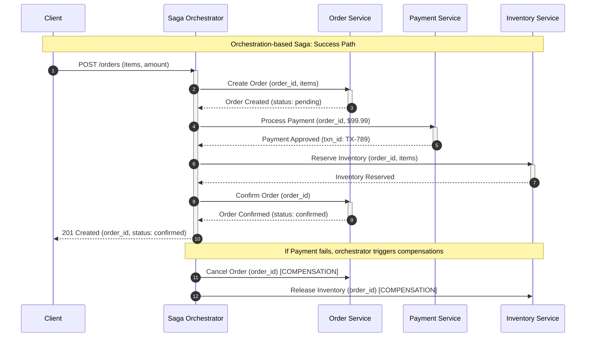
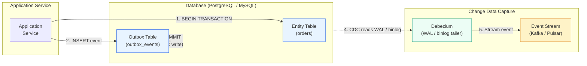

# Module 9: Microservices Patterns (Saga, Outbox, CQRS, Event Sourcing)

In high-throughput microservices, we must abandon the comfort of strong consistency and embrace eventual consistency to achieve planetary scale — this module covers the four essential patterns that maintain data integrity when a single business process spans multiple database boundaries.

---

## Table of Contents

- [1. The Saga Pattern for Distributed Transactions](#1-the-saga-pattern-for-distributed-transactions)
- [2. Reliable Messaging via the Transactional Outbox](#2-reliable-messaging-via-the-transactional-outbox)
- [3. CQRS & Event Sourcing](#3-cqrs--event-sourcing)
- [4. Real-World Failure Modes](#4-real-world-failure-modes)
- [5. Production Code Template: Orchestration-Based Saga Controller](#5-production-code-template-orchestration-based-saga-controller)
- [6. Distributed Data Checklists](#6-distributed-data-checklists)
- [7. Common Mistakes](#7-common-mistakes)
- [8. Key Takeaways](#8-key-takeaways)
- [9. Self-Assessment Questions](#9-self-assessment-questions)

---

## 1. The Saga Pattern for Distributed Transactions

### Why Two-Phase Commit (2PC) Fails at Scale

The classic **Two-Phase Commit** — which requires all participants to be available to "vote" on a commit — is a scalability killer in microservices. It is a synchronous protocol that locks resources across multiple services. If one service is slow or partitioned, the entire transaction stalls, violating high-availability goals.

Think of 2PC like a coordinated wedding toast: the best man asks everyone to raise their glasses ("prepare"), waits for every single guest to confirm they are ready ("vote"), and only then says "cheers" ("commit"). If one guest is stuck in traffic, everyone stands there with raised glasses, unable to drink. In microservices, those "raised glasses" are database row-level locks — and holding them while waiting for a slow participant can bring down the entire system.

### The Saga Pattern

A **Saga** is a sequence of local transactions. Each local transaction updates a service's own database and publishes an event to trigger the next step. Unlike 2PC, Sagas never hold locks across services — each step commits immediately, and if something goes wrong later, compensating transactions undo the damage.

#### Choreography-Based Sagas (Event-Driven)

In choreography, there is no central coordinator. Each service listens for events from other services and decides whether to act. Think of it like a bucket brigade: each person passes the bucket to the next person, and the work flows in a chain.

- Highly decoupled — services do not know about each other.
- Each service emits events and subscribes to events from other services.
- Workflow tracking becomes difficult as the number of services grows, because the logic is spread across every service's event handlers.
- Best suited for simple, linear workflows with few participants (2–4 services).

#### Orchestration-Based Sagas (Centralized Coordinator)

A central **Saga Orchestrator** tells each participant which local transaction to execute. Think of it like a film director: the director tells the actor ("action!"), the cinematographer ("roll camera!"), and the sound engineer ("record!"). If one step fails, the director calls "cut!" and tells everyone to reset.

- The orchestrator manages the full business workflow — easier to audit, debug, and handle complex transitions.
- The orchestrator is stateful — it must track the current step and which compensations to run on failure.
- Best suited for complex workflows with many participants (5+ services) or strict auditing requirements.

### Compensating Transactions

Because Sagas lack the "all-or-nothing" rollback of `ACID`, failures require **compensating transactions**. If a step fails (e.g., a payment service rejects a card after inventory was reserved), the Saga must execute "undo" operations for each previous successful step, bringing the system back to a consistent state.

A compensating transaction is not always a perfect inverse. For example, if the forward action was "send confirmation email," the compensation might be "send a follow-up email saying the previous email was in error" rather than "un-send the email." Compensations must be designed to leave the system in a **semantically consistent** state, not necessarily the exact previous state.

```text
Saga: Book Hotel → Reserve Flight → Charge Card
                           ↓ (FAIL)
Compensate:                ↻ Cancel Flight → Cancel Hotel
```

### Orchestration Saga Sequence Diagram



*Orchestration-based Saga: the central `Saga Orchestrator` sends commands sequentially to each service. Each service commits its local transaction immediately and responds. If any step fails (e.g., payment rejected), the orchestrator executes compensating transactions in reverse order — cancelling the order and releasing inventory.*

---

## 2. Reliable Messaging via the Transactional Outbox

### The Distributed Atomicity Problem

The **Dual-Write Problem**: how do you atomically update a database *and* send a message to a broker (`Kafka`, `RabbitMQ`)?

- Update DB first → crash before message send → downstream never knows. The customer sees "order confirmed," but the shipping service never receives the order.
- Send message first → DB update fails → downstream acts on an event that never occurred. The shipping service sends a package for an order that does not exist.

### The Transactional Outbox Pattern

The application updates its business tables **and** inserts a record into an `OUTBOX` table within the **same local database transaction**. Since both writes share the same `ACID` transaction, they either both succeed or both fail. The outbox record contains the message type, payload, and status — and a separate relay process reads from the outbox and publishes to the message broker.

### What Happens in Production: The $50K Hour of Lost Payments

A growing e-commerce company implemented a checkout flow where the Order Service would:
1. Insert the order row into `orders` table.
2. Call `KafkaProducer.send("payment", order_event)` to trigger payment processing.

During a routine database migration, the network between the application and Kafka experienced intermittent 5-second timeouts. In a single hour, 1,200 orders were created in the database, but the Kafka `send()` call timed out for 47 of them. Those 47 orders were never paid. The company shipped the products, expecting payment that never arrived.

**Loss:** ~$47,000 in uncollected revenue + customer service time handling "why was my order cancelled?" calls from customers whose orders were later cancelled when the payment never appeared.

**How it was diagnosed:** A weekly reconciliation script compared orders against payment records. It found 47 orders with no corresponding payment. Each one had an `orders.created_at` timestamp but no matching `payments.received_at` timestamp. The root cause was clear: the database insert succeeded, but the Kafka message was lost.

**The fix with Debezium:**
1. The team added an `outbox_events` table to the Order Service's database.
2. The order creation and outbox insert happened in the same database transaction.
3. Debezium was configured to tail the database's `WAL` (Write-Ahead Log) and stream new outbox rows to Kafka.
4. If the Debezium connector crashed, it resumed from the last committed `WAL` position — no messages lost.
5. The payment service became idempotent (using `order_id` as the idempotency key), so if a message was delivered twice, the second delivery was silently ignored.

### Transactional Outbox + CDC Architecture



*The diagram above shows the atomic dual-write: the `Application Service` inserts into both the `Entity Table` and the `Outbox Table` within a single database transaction. `Debezium` tails the database's transaction log (WAL / binlog) and streams new outbox events to `Kafka`.*

### Message Relay Mechanics

| Approach | Mechanism | Load on DB | Latency |
|---|---|---|---|
| **Polling Publisher** | Background process polls `OUTBOX` table for new rows | Higher (constant SELECT queries) | Higher (poll interval) |
| **Change Data Capture (CDC)** | Tool (e.g., `Debezium`) tails the database transaction log | Minimal (no polling) | Lower (real-time streaming) |

**Polling Publisher** is simpler to implement — a cron job or background thread runs every `N` seconds, queries `SELECT * FROM outbox_events WHERE status = 'pending'`, publishes the messages, and marks them as processed. The cost is that every poll cycle queries the database even when there are no new events.

**CDC** is more sophisticated and more reliable. `Debezium` connects to the database as a replication slave and receives every change as it happens. There is no polling, no `SELECT` queries, and no gap between the commit and the event appearing in Kafka. The cost is operational complexity — you must run and monitor a Debezium cluster.

---

## 3. CQRS & Event Sourcing

### CQRS: Splitting Write and Read Paths

**Command Query Responsibility Segregation (`CQRS`)** separates the "Command" side (writes) from the "Query" side (reads).

| Side | Responsibility | Typical Store |
|---|---|---|
| **Command (Write)** | Validate input, apply business rules, persist | Normalized SQL, NoSQL write-optimized |
| **Query (Read)** | Serve complex, low-latency lookups | Denormalized views, search indices (`Elasticsearch`) |

Why split? Read and write workloads have vastly different performance and scaling requirements. A write might need to validate constraints across five tables (slow, transactional), while a read might need to return a denormalized view of millions of records (fast, non-transactional). With CQRS, you can scale the read side independently (add more read replicas) and choose different storage engines for each side (normalized PostgreSQL for writes, Elasticsearch for reads).

**The analogy:** A library has two counters. The "check-in counter" (commands) handles returns — it validates the book's condition, updates the catalog, and charges late fees. The "search counter" (queries) has a different layout — it just needs to tell you where the book is and whether it is available. They serve different purposes, so they have different workflows and different staffing.

### Event Sourcing

**Event Sourcing** stores application state as an **append-only sequence of immutable events**, rather than current state snapshots. Instead of updating a row in a `users` table when the user changes their email, you append a `EmailChanged` event to an event store. The current state is derived by replaying the events.

**The analogy:** Event Sourcing is like a financial ledger — you do not erase old transactions when you deposit money. You append a new line: "Deposited $100." The current balance is the sum of all lines in the ledger.

#### Concrete Example: Bank Account Ledger

Here is how a bank account balance is derived from events:

```text
Account: 12345678

Events (append-only log):
# | Type              | Amount | Timestamp               | Resulting Balance
---|-------------------|--------|-------------------------|-------------------
1  | AccountOpened     | $0     | 2026-01-01T09:00:00Z    | $0
2  | Deposit           | $500   | 2026-01-02T10:00:00Z    | $500
3  | Withdrawal        | $100   | 2026-01-03T14:00:00Z    | $400
4  | Deposit           | $200   | 2026-01-04T11:00:00Z    | $600
5  | InterestApplied   | $1.50  | 2026-01-05T00:00:00Z    | $601.50
6  | Withdrawal        | $50    | 2026-01-06T09:00:00Z    | $551.50
```

To find the balance at any point in time, replay events up to that timestamp. The **snapshot** at version 4 tells us the balance was $600 — we can reconstruct from snapshot + events 5 and 6 to get $551.50 without replaying all 6 events from the beginning.

**Key properties of Event Sourcing:**
- **Auditability:** Every state change is recorded. You can answer "what was the balance on January 4?" by replaying events up to that date.
- **Temporal queries:** You can reconstruct the state at any point in time — useful for debugging, compliance, and historical reporting.
- **Event-driven integration:** Other services can subscribe to the event stream (e.g., a notification service can listen for `Withdrawal` events to send SMS alerts).
- **Snapshotting:** Without snapshots, replaying millions of events is too slow. A snapshot captures the state at a point, and reconstruction starts from the latest snapshot.

### Reconstructing State

```
Latest snapshot:  {balance: $600, version: 4, as_of: 2026-01-04}

Events since snapshot:
  - InterestApplied($1.50)
  - Withdrawal($50)

Replayed balance = $600 + $1.50 - $50 = $551.50
```

---

## 4. Real-World Failure Modes

### Dual-Write Failure (Network Drop)

A developer updates the database and then manually calls a message queue API. The DB commit succeeds, but the network drops before the message is sent — the message is lost forever. Downstream microservices are out of sync, often undetected until data audits.

**Fix:** Use the **Transactional Outbox** pattern. If the message must be sent, it must be written atomically in the same DB transaction. Never write to the database and then call an external system in the same request without an outbox.

#### What Happens in Production: The Double-Charge Race Condition

A subscription platform processed recurring payments with this flow:

```python
# VULNERABLE pseudo-code
def process_recurring_payment(user_id, amount):
    # Step 1: Charge the customer
    charge = stripe.charge(amount)  # External API

    # Step 2: Record in local database
    db.execute("INSERT INTO payments (user_id, amount, status) VALUES (?, ?, 'success')", user_id, amount)

    # Step 3: Send confirmation
    kafka.send("payment_confirmed", {"user_id": user_id})
```

The problem: the Stripe charge succeeded, but the database insert failed (constraint violation due to a race condition with a concurrent retry). The customer was charged, but the system had no record of the charge. The retry logic kicked in and charged the customer *again*. The second charge succeeded and was recorded. The customer was double-charged.

**The fix with idempotency keys:**

```python
# SAFE — idempotency key prevents double charge
def process_recurring_payment(user_id, amount, idempotency_key):
    # Step 1: Check if already processed
    existing = db.query_one("SELECT charge_id FROM payments WHERE idempotency_key = ?", idempotency_key)
    if existing:
        return existing.charge_id  # Already charged, return existing result

    # Step 2: Charge with idempotency key (Stripe de-duplicates)
    charge = stripe.charge(amount, idempotency_key=idempotency_key)

    # Step 3: Record locally (use INSERT with unique constraint on idempotency_key)
    try:
        db.execute(
            "INSERT INTO payments (user_id, amount, charge_id, idempotency_key) VALUES (?, ?, ?, ?)",
            user_id, amount, charge.id, idempotency_key
        )
    except UniqueViolation:
        # Another concurrent request inserted this idempotency key first
        return db.query_one("SELECT charge_id FROM payments WHERE idempotency_key = ?", idempotency_key).charge_id

    return charge.id
```

The **idempotency key** ensures that even if the same request is sent multiple times (due to retries, network issues, or race conditions), the side effect (charging the customer) happens exactly once. The system does not even need the Transactional Outbox for this specific case — the idempotency key at the Stripe level prevents the duplicate charge. But the combination of an outbox *and* idempotency keys provides defence in depth: the outbox guarantees the message is sent, and the idempotency key guarantees that processing it twice is safe.

### The Eventual Consistency Read Gap (CQRS)

In `CQRS`, the read-store is updated asynchronously after the write-store commits. A user submits a command to update their profile — the command succeeds — but the profile page (served by a lagging read replica) shows old data.

**Mitigations:**

- **Sticky sessions** — route a user's reads to the write master for a short window after their write. This sacrifices read scaling only for users who just wrote, which is typically a small fraction of total traffic.
- **Client-side optimistic updates** — immediately reflect the change in the UI while the backend propagates. The UI shows the new value instantly, even if the read replica has not caught up yet. If the backend write later fails, the UI must handle rollback.
- **Read-your-writes consistency** — the application layer waits until the read replica acknowledges the write before confirming to the user. This adds latency but guarantees the user sees their own writes immediately.

---

## 5. Production Code Template: Orchestration-Based Saga Controller

```python
"""
Orchestration-based Saga Controller for an e-commerce workflow.

Executes forward steps: Order → Payment → Inventory.
If any step fails, compensating transactions run in reverse order
to undo all previously successful steps.

Usage:
    async def main():
        saga = SagaOrchestrator()
        result = await saga.run(order_id="ORD-001", amount=99.99)
        print(result)

    asyncio.run(main())
"""

import asyncio
import logging
from dataclasses import dataclass, field
from typing import Callable, Coroutine, List, Optional

logging.basicConfig(level=logging.INFO, format="%(asctime)s [%(levelname)s] %(message)s")
logger = logging.getLogger("saga")


@dataclass
class SagaStep:
    """A single forward transaction and its compensating rollback.

    Attributes:
        name: Human-readable step name, used in logs and history.
        action: Coroutine that executes the forward transaction.
            Returns a result string on success, raises on failure.
        compensate: Coroutine that undoes the forward transaction.
            Called during rollback. Should not raise (errors are logged).
    """

    name: str
    action: Callable[[], Coroutine[None, None, str]]
    compensate: Callable[[], Coroutine[None, None, None]]


@dataclass
class SagaResult:
    """Result of a completed or failed saga execution.

    Attributes:
        success: True if all steps completed, False if rollback occurred.
        completed_steps: Names of steps that executed before failure.
        failed_step: Name of the step that raised an exception.
        error: The error message from the failed step.
    """

    success: bool
    completed_steps: List[str] = field(default_factory=list)
    failed_step: Optional[str] = None
    error: Optional[str] = None


class SagaOrchestrator:
    """Coordinates forward execution and compensating rollback
    for an e-commerce order workflow: Create Order → Process Payment
    → Reserve Inventory.
    """

    def __init__(self) -> None:
        self._steps: List[SagaStep] = []
        self._history: List[str] = []

    def add_step(
        self,
        name: str,
        action: Callable[[], Coroutine[None, None, str]],
        compensate: Callable[[], Coroutine[None, None, None]],
    ) -> None:
        """Register a saga step with its compensating transaction.

        Steps are executed in the order they are added. Compensations
        run in reverse order.
        """
        self._steps.append(SagaStep(name=name, action=action, compensate=compensate))

    async def run(self, order_id: str, amount: float) -> SagaResult:
        """Execute all steps sequentially. On failure, roll back
        completed steps in reverse order.

        Args:
            order_id: Business identifier for the order.
            amount: Order amount passed to the payment step.

        Returns:
            SagaResult indicating success or the failure point.
        """
        logger.info("Saga started for order %s (amount=%.2f)", order_id, amount)

        for step in self._steps:
            try:
                result = await step.action()
                self._history.append(step.name)
                logger.info("Step '%s' succeeded: %s", step.name, result)
            except Exception as exc:
                logger.error("Step '%s' failed: %s", step.name, exc)
                await self._rollback()
                return SagaResult(
                    success=False,
                    completed_steps=list(self._history),
                    failed_step=step.name,
                    error=str(exc),
                )

        logger.info("Saga completed successfully for order %s", order_id)
        return SagaResult(success=True, completed_steps=list(self._history))

    async def _rollback(self) -> None:
        """Execute compensating transactions in reverse order.

        Each compensation is attempted even if the previous one
        failed — we want to undo as much as possible. Errors are
        logged but do not halt the rollback.
        """
        logger.warning("Rolling back %d completed step(s)", len(self._history))
        for step_name in reversed(self._history):
            step = next(s for s in self._steps if s.name == step_name)
            try:
                await step.compensate()
                logger.info("Compensation for '%s' succeeded", step_name)
            except Exception as exc:
                logger.error("Compensation for '%s' failed: %s", step_name, exc)


# ------------------------------------------------------------------
# Domain Steps for E-Commerce Saga
# ------------------------------------------------------------------

async def create_order(order_id: str) -> str:
    logger.info("  [Order] Creating order %s ...", order_id)
    await asyncio.sleep(0.1)
    return f"order {order_id} created"


async def cancel_order(order_id: str) -> None:
    logger.info("  [Order] Cancelling order %s (compensation)", order_id)
    await asyncio.sleep(0.05)


async def process_payment(amount: float, should_fail: bool = False) -> str:
    logger.info("  [Payment] Charging $%.2f ...", amount)
    await asyncio.sleep(0.1)
    if should_fail:
        raise RuntimeError("payment provider rejected transaction")
    return f"payment of ${amount:.2f} approved"


async def refund_payment(amount: float) -> None:
    logger.info("  [Payment] Refunding $%.2f (compensation)", amount)
    await asyncio.sleep(0.05)


async def reserve_inventory(order_id: str) -> str:
    logger.info("  [Inventory] Reserving stock for %s ...", order_id)
    await asyncio.sleep(0.1)
    return f"inventory reserved for {order_id}"


async def release_inventory(order_id: str) -> None:
    logger.info("  [Inventory] Releasing stock for %s (compensation)", order_id)
    await asyncio.sleep(0.05)


# ------------------------------------------------------------------
# Main: Success and Failure Scenarios
# ------------------------------------------------------------------
async def main() -> None:
    # --- Successful flow ---
    logger.info("=== SCENARIO 1: SUCCESSFUL ORDER ===")
    saga_ok = SagaOrchestrator()
    saga_ok.add_step(
        "create_order",
        action=lambda: create_order("ORD-001"),
        compensate=lambda: cancel_order("ORD-001"),
    )
    saga_ok.add_step(
        "process_payment",
        action=lambda: process_payment(99.99),
        compensate=lambda: refund_payment(99.99),
    )
    saga_ok.add_step(
        "reserve_inventory",
        action=lambda: reserve_inventory("ORD-001"),
        compensate=lambda: release_inventory("ORD-001"),
    )

    result_ok = await saga_ok.run(order_id="ORD-001", amount=99.99)
    logger.info("Result: success=%s, completed=%s", result_ok.success, result_ok.completed_steps)

    # --- Failure flow (payment rejects) ---
    logger.info("=== SCENARIO 2: PAYMENT FAILURE (ROLLBACK) ===")
    saga_fail = SagaOrchestrator()
    saga_fail.add_step(
        "create_order",
        action=lambda: create_order("ORD-002"),
        compensate=lambda: cancel_order("ORD-002"),
    )
    saga_fail.add_step(
        "process_payment",
        action=lambda: process_payment(199.99, should_fail=True),
        compensate=lambda: refund_payment(199.99),
    )
    saga_fail.add_step(
        "reserve_inventory",
        action=lambda: reserve_inventory("ORD-002"),
        compensate=lambda: release_inventory("ORD-002"),
    )

    result_fail = await saga_fail.run(order_id="ORD-002", amount=199.99)
    logger.info(
        "Result: success=%s, failed_step=%s, error=%s",
        result_fail.success,
        result_fail.failed_step,
        result_fail.error,
    )


if __name__ == "__main__":
    asyncio.run(main())
```

### How the Saga Orchestrator Works (Step by Step)

1. **Step registration (`add_step`, line ~211):** Each step is registered with a name, an action coroutine, and a compensation coroutine. The order of registration determines the execution order. The orchestrator stores them as a list of `SagaStep` dataclass instances.

2. **Forward execution (`run`, line ~220):** The orchestrator iterates through the steps in registration order. For each step, it calls `await step.action()`. If the action returns successfully, the step name is appended to `self._history`. This history tracks which compensations must run if a later step fails.

3. **Failure handling (line ~230):** If `step.action()` raises an exception, the orchestrator immediately stops forward execution and calls `self._rollback()`. The `SagaResult` captures which step failed and the error message.

4. **Rollback (`_rollback`, line ~243):** The orchestrator iterates through `self._history` in **reverse** order. For each step name, it looks up the corresponding `SagaStep` and calls `step.compensate()`. Each compensation runs independently — if one compensation fails, the orchestrator logs the error but continues with the next one. This ensures maximal cleanup: even if cancelling the order fails, we still try to release the inventory.

5. **Idempotent compensations (design note):** In production, each compensation should be **idempotent** — calling it twice should have the same effect as calling it once. For example, `cancel_order` should succeed even if the order was already cancelled. This protects against the orchestrator crashing during rollback and needing to retry compensations.

---

## 6. Distributed Data Checklists

> **Challenge 1: Idempotency in At-Least-Once Delivery**  
> You use a Transactional Outbox with "at-least-once" delivery (e.g., Amazon SQS). The same message may be delivered to a consumer multiple times. How must the consumer be architected to safely handle duplicate deliveries?

<details><summary>Click for Senior Architecture Rubric</summary>

**Senior answer:**

The consumer **must be idempotent** — processing the same message twice must produce the same system state as processing it once.

- **Idempotency key pattern:** The consumer stores a unique message ID (or a business-level idempotency key like `order_id`) in a local database table with a unique constraint. Before executing business logic, it checks if the key has already been processed. If found, it acknowledges the message and skips the action.
- **Atomic deduplication:** The check-and-insert must happen atomically — either in the same database transaction as the business update, or using a conditional insert (`INSERT ... WHERE NOT EXISTS`).
- **Trade-offs:** The deduplication table grows linearly with processed messages. Implement a TTL-based cleanup job or use a time-bounded deduplication window (e.g., Redis with 24-hour expiry for the idempotency key). At-least-once + idempotency is generally preferred over exactly-once delivery, which is much harder to guarantee at the broker level.
</details>

> **Challenge 2: Orchestration vs. Choreography for High-Security Financial Workflows**  
> You are designing a complex financial loan approval process involving 12 different services with strict auditing requirements. Would you choose Choreography or Orchestration? Justify with trade-offs.

<details><summary>Click for Senior Architecture Rubric</summary>

**Senior answer:**

**Orchestration** is the correct choice for this scenario.

- **Why orchestration wins:**
  - **Single source of truth** — the orchestrator maintains the exact state of each loan application. Auditors query one service for the full workflow trace.
  - **Deterministic failure handling** — compensating transactions are executed in a known, controlled order. In choreography, the failure path may race across services.
  - **Debugging** — a single Saga log shows exactly which step failed and what compensation was triggered.
- **Trade-offs:**
  - Orchestration introduces a **single point of coordination** — the orchestrator itself must be highly available and replicated.
  - The orchestrator adds **latency** (sequential step execution). For loan approvals (minutes/hours), this is acceptable. For high-throughput, low-latency workflows, choreography may be preferred.
- **Hybrid approach:** Use orchestration for the core financial workflow (loan approval, funds transfer) with idempotent steps, and choreography for non-critical notifications (email, SMS) where eventual consistency and loss tolerance are acceptable.
</details>

> **Challenge 3: CQRS "Stale Read" After Account Update**  
> A user updates their account balance via a `Command`, but the next read from a sharded read-replica shows the old balance. How can you mitigate this without sacrificing the scaling benefits of CQRS?

<details><summary>Click for Senior Architecture Rubric</summary>

**Senior answer:**

The read-after-write inconsistency is inherent to eventually consistent CQRS. Several mitigations exist, each with trade-offs:

- **Sticky sessions (session affinity):** The load balancer routes a user's read requests to the same read-replica that received the write propagation. If the replica has not yet applied the write, the stale read still occurs. Requires the load balancer to be aware of replica lag.
- **Read-your-writes consistency via write-tracker:** After a command, the API returns a `write_version` (a timestamp or sequence number). The read path includes this version in its query; if the replica's version is behind, it either blocks until caught up or redirects to the write master.
- **Short-circuit to master:** For a configurable window (e.g., 5 seconds) after a user's write, route *all* that user's reads to the write database. Sacrifices read scaling for that user but guarantees consistency.
- **Client-side compensation:** The command handler writes the new data to a fast local cache (`Redis`) keyed by user ID + session. The read path checks the cache before hitting the read-store. The cache TTL matches the expected replication lag.
- **Trade-off summary:** The stronger the consistency guarantee, the more you pull traffic back from read replicas to the write master, reducing the horizontal read scaling that CQRS is meant to provide. The right choice depends on whether the business requirement is "the user must see their own writes immediately" (use master reads) or "the user can tolerate eventual consistency for a few seconds" (use client-side compensation).
</details>

---

## 7. Common Mistakes

> **⚠️ Mistake 1: Using 2PC across microservices.**  
> Two-Phase Commit does not scale across independent services. It holds locks during the prepare phase, and if the coordinator crashes, participants are blocked until it recovers. Use Sagas instead. Sagas sacrifice atomicity (intermediate states are visible) but gain availability and scalability.

> **⚠️ Mistake 2: Implementing compensating transactions as perfect inverses.**  
> A compensation for "send email" cannot "un-send" the email — it should send a follow-up saying the previous email was in error. Always design compensations as a separate semantic action that leaves the system in a consistent state, not a bitwise rollback.

> **⚠️ Mistake 3: Performing dual-writes without an outbox.**  
> Updating the database and then sending a Kafka message (or vice versa) is a race condition that will eventually lose data. Always use the Transactional Outbox pattern. If you cannot use CDC, use a polling publisher — it is still better than a dual-write.

> **⚠️ Mistake 4: Treating Event Sourcing as the default for every service.**  
> Event Sourcing adds significant complexity: event schema evolution, snapshot management, replay performance, and eventual consistency. It is the right choice when you need auditability (financial systems), temporal queries ("what was the state at this date?"), or event-driven integration. For simple CRUD services, a normal database table is the right choice.

---

## 8. Key Takeaways

1. **Sagas replace distributed transactions with local transactions + compensations.** They are the only practical way to maintain data integrity across microservices at scale. Choose orchestration for complex workflows; choose choreography for simple, linear flows.

2. **The Transactional Outbox pattern solves the dual-write problem atomically.** Write the business record and the outbox event in the same database transaction. Use CDC (Debezium) for minimal-latency event streaming without polling.

3. **Idempotency keys are the foundation of safe message processing.** Every consumer must be able to process the same message twice without producing duplicate side effects. Store processed message IDs in a unique-constraint table and check before executing business logic.

4. **CQRS enables independent scaling of read and write paths.** Use it when read and write workloads have different performance characteristics. The trade-off is eventual consistency — writes may take time to propagate to read replicas.

5. **Event Sourcing provides full auditability and temporal queries.** Store every state change as an immutable event. Derive current state by replaying events from the latest snapshot. Use it when auditability is a hard requirement, not as a general-purpose persistence strategy.

6. **Compensating transactions are not rollbacks.** They are forward actions that semantically undo a previous action. Design them as independent operations, not as inverse functions.

7. **CDC is more reliable than polling for outbox relay.** Debezium reads the database transaction log directly, eliminating the gap between commit and publication. The operational cost is higher, but the reliability gain is significant for production-critical event streams.

---

## 9. Self-Assessment Questions

> **Question 1: Saga Compensation Design**  
> A Saga executes three steps: (1) Reserve hotel room, (2) Book flight, (3) Charge credit card. Step 3 fails (card declined). The compensation for step 2 is "Cancel flight" and for step 1 is "Release hotel room." What happens if the "Cancel flight" compensation fails due to a network timeout? Should the orchestrator halt or continue?

<details><summary>Click for Answer</summary>

The orchestrator should **continue** with the remaining compensations even if one fails. In this case:

1. "Cancel flight" times out → logged as an error.
2. "Release hotel room" executes successfully → room is freed.
3. The final result is `success=False` with both the failed step (charge card) and the failed compensation (cancel flight) recorded.

The system is now in a **partial rollback** state: the hotel room is released, but the flight is still booked. This must be resolved manually or by a background reconciliation job. In practice, the orchestrator should also send an alert when any compensation fails, and a separate "saga recovery" process should handle stuck compensations.

**Design lesson:** Compensations should be idempotent and retryable. If "Cancel flight" had a retry with backoff, the transient network timeout would not cause a partial rollback. The orchestrator should retry compensations with a configurable max retry count before giving up.
</details>

> **Question 2: Transactional Outbox Ordering**  
> Two back-to-back updates to the same order (first "order created," then "order shipped") are written to the outbox table in the same database transaction. Does Debezium guarantee they are streamed to Kafka in the same order? What about two separate transactions?

<details><summary>Click for Answer</summary>

- **Same transaction:** Debezium streams both events in the order they were committed, because they share a single `WAL` commit record. The events appear in Kafka in the same order they were inserted (order created → order shipped).
- **Separate transactions:** Debezium streams events in `WAL` commit order. If Transaction A commits before Transaction B, the events from A will appear before events from B. However, if a network hiccup causes Debezium to disconnect and reconnect, it may resume at a `WAL` position that includes events from both transactions — but still in commit order.

**Caveat:** Events within the same outbox table are ordered by the database transaction log sequence number (`LSN`). Debezium preserves this order within a single partition. If the outbox events are published to different Kafka partitions (based on the topic key), ordering across partitions is not guaranteed. The consumer should be idempotent and handle out-of-order delivery if cross-partition ordering matters.
</details>

> **Question 3: Event Sourcing Snapshot Frequency**  
> A bank account service uses Event Sourcing with 10 million events. A snapshot is taken every 1,000 events. What is the storage overhead of snapshots? How does the choice of snapshot frequency affect recovery time?

<details><summary>Click for Answer</summary>

**Storage overhead:** Each snapshot stores the full account state at a point in time. If a snapshot is 1 KB and one is taken every 1,000 events, then after 10 million events there are 10,000 snapshots, consuming 10 MB of storage. This is negligible compared to the event store itself.

**Recovery time:** To reconstruct the current state, the system loads the latest snapshot and replays events since that snapshot. With a snapshot every 1,000 events, the maximum number of events to replay is 1,000. Without snapshots, all 10 million events must be replayed — a 10,000x increase in reconstruction time.

**Choosing the snapshot frequency:**
- **More frequent snapshots (e.g., every 100 events):** Faster recovery, higher storage cost. Good for services with frequent state reads.
- **Less frequent snapshots (e.g., every 10,000 events):** Lower storage cost, slower recovery. Good for services where state is rarely read and snapshots are taken on a schedule (e.g., hourly).

**Rule of thumb:** Set the snapshot frequency so that the maximum recovery time is acceptable for your SLO. If a service must recover in under 1 second, and replaying 1,000 events takes 10 ms, then snapshot every 1,000 events.
</details>

> **Question 4: CQRS Without Event Sourcing**  
> A team implements CQRS by having the command handler write to PostgreSQL and the query handler read from a separate PostgreSQL read-replica. The propagation delay is ~100 ms. Is this CQRS? What is this pattern called?

<details><summary>Click for Answer</summary>

Yes, this is still CQRS — the key requirement is that the write path and read path use different models (or different storage nodes), not that they use different storage technologies. This specific setup is called **CQRS with a replicated read-store**:

- **Command model:** Normalized PostgreSQL tables (write-optimized schema).
- **Query model:** The same tables, but on a read-replica (read-optimized for throughput).
- **Propagation:** PostgreSQL streaming replication (100 ms lag is typical for synchronous replication, or slightly more for asynchronous).

This is a perfectly valid CQRS implementation and is the most common one in practice. The team gets read scaling (read-replicas can serve queries without competing with writes) without the operational complexity of maintaining a separate Elasticsearch cluster. The trade-off is that the read model cannot be structurally different from the write model — if the team needs denormalized views, they would need a separate read store (e.g., Elasticsearch) and an event-driven synchronization pipeline.
</details>
