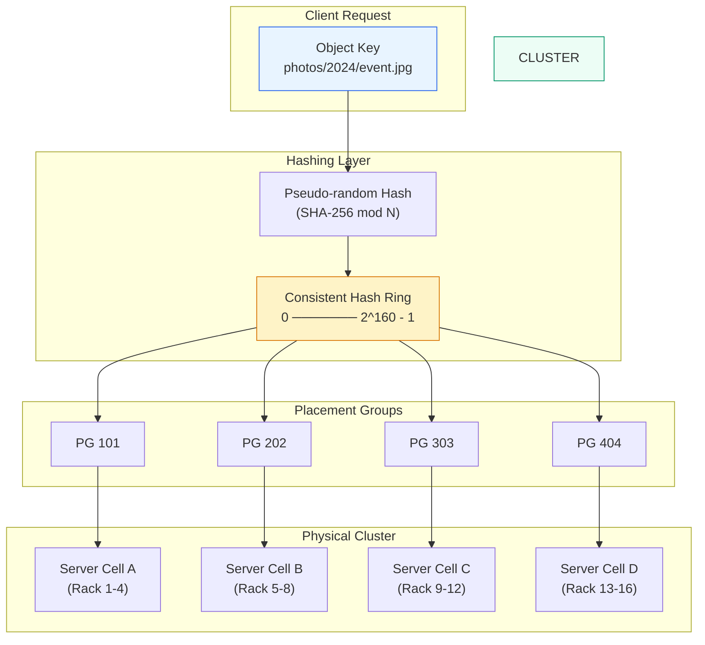

# Module 10: File, Object & Block Storage

While most developers treat storage as an abstract "bucket," managing the physical reality of bits on spinning rust and flash across thousands of racks requires mastering three distinct storage paradigms — each with fundamentally different data layouts, latency profiles, and scaling characteristics.

---

## Table of Contents

- [1. Storage Typologies Compared](#1-storage-typologies-compared)
- [2. The Mechanics of Object Storage Sharding](#2-the-mechanics-of-object-storage-sharding)
- [3. Concurrency & Consistency](#3-concurrency--consistency)
- [4. Real-World Failure Modes](#4-real-world-failure-modes)
- [5. Production Code Template: Erasure Coding Simulator](#5-production-code-template-erasure-coding-simulator)
- [6. Storage Engineering Challenges](#6-storage-engineering-challenges)

---

## 1. Storage Typologies Compared

### Defining the Layouts

| Dimension | Block Storage (EBS) | File Storage (EFS) | Object Storage (S3) |
|---|---|---|---|
| **Data Structure** | Raw blocks (sectors); closest to physical disk | Hierarchical directories and pathnames (`/home/user/data.txt`) | Flat namespace; key-value metadata over variable-length objects |
| **Throughput** | Very high; optimized for random I/O | Moderate; shared across NFS/SMB connections | High for sequential; throughput scales with prefix sharding |
| **Scale Boundaries** | Volume size limit (~16 TiB per EBS volume); bounded by attached instance | Scale-out via multiple gateways; limited by metadata server | Exabyte-scale; limited only by total cluster capacity |
| **Access Protocols** | `iSCSI`, `NVMe-oF`, `SCSI` passthrough | `NFS`, `SMB`, `CIFS` | `RESTful HTTP` (`S3 API`, `Azure Blob API`) |
| **Cost Metrics** | $/GB-month provisioned (+ IOPS pricing) | $/GB-month stored (+ throughput tier) | $/GB-month stored + request cost (PUT/GET/List) |
| **Typical Use Cases** | Databases (`PostgreSQL`, `MySQL`), boot volumes, high-frequency trading logs | Home directories, shared analytics datasets, media render farms | Backups, data lakes, static web assets, content distribution |

### Why Flat Scaling Wins

Hierarchical systems rely on a metadata server (like GFS's Master) to manage namespaces. At massive scale (billions of files), the master's memory becomes a bottleneck. **Object Storage** is flat — it uses a cluster map and hashing algorithms (like `CRUSH`) to calculate the physical location of data on-the-fly. Without a central directory to query for every operation, the system scales to exabytes by distributing location intelligence across the entire cluster.

---

## 2. The Mechanics of Object Storage Sharding

### Consistent Hashing Data Placement



*Object storage data placement via consistent hashing ring. An object key is hashed onto a ring, mapped into a Placement Group (PG), and the cluster map resolves the PG to a specific ordered list of physical devices (OSDs). Adding or removing a node only reshuffles a small fraction of the data.*

### Erasure Coding vs. Simple Replication

| Method | Storage Overhead | Durability | Read Cost | Write Cost |
|---|---|---|---|---|
| **3x Replication** | 200% (3 copies) | Tolerates 2 node failures | Low (read any copy) | Low (write 3x in parallel) |
| **Erasure Coding (k=10, m=4)** | 40% (14 shards for 10 data) | Tolerates 4 node failures | Higher (reconstruct from k shards) | Higher (compute + write all shards) |

**Erasure Coding** mathematically breaks data into `k` data shards and encodes `m` parity shards. The original data can be reconstructed from any `k` of the `k + m` shards. This secures durability with significantly lower overhead than replication, at the cost of additional computation for reads and writes.

---

## 3. Concurrency & Consistency

### GFS Concurrent Appends

The **Google File System** was optimized for **atomic record appends**. Multiple clients can append to the same file concurrently without a distributed lock manager:

1. The primary replica picks a serial order for mutations.
2. GFS guarantees the data is written **at least once** as an atomic unit.
3. Replicas may not be bytewise identical due to occasional padding or retries — a relaxed consistency model designed for bulk data throughput.

### Object Storage Immutability

Standard Object Storage models treat objects as **immutable**. While you can read/write byte ranges, standard updates involve overwriting the entire object or creating a new version. GFS's relaxed consistency — where a file region can be "consistent but undefined" during concurrent writes — was a radical departure to simplify the master and improve aggregate throughput for big data workloads.

---

## 4. Real-World Failure Modes

### Bit Rot & Silent Data Corruption

Physical disks occasionally disagree with the kernel about their state, causing silent corruption.

| Detection Mechanism | Description |
|---|---|
| **Checksum verification** | GFS breaks each chunk into 64 KB blocks with a 32-bit checksum in memory. On read, the checksum is verified before returning data. |
| **Background scrubbing** | During idle periods, servers scan and verify inactive chunks. If a mismatch is found, the master clones a fresh replica from a healthy node and deletes the corrupted one. |

### Hot-Spotting Inside a Bucket

If millions of clients access objects sharing the same prefix (e.g., a popular binary installed by a fleet of servers), the few OSDs hosting that partition become overloaded.

| Mitigation | How It Works |
|---|---|
| **Increase replication factor** | Add extra replicas for the hot chunk to distribute read load. |
| **Prefix spreading** | Add random hash prefixes (e.g., `hex(sha256(key))[:4]/actual-key`) to distribute objects across more partitions. |
| **Staggered starts** | Application-level timing skew prevents thundering herd against a single prefix. |

---

## 5. Production Code Template: Erasure Coding Simulator

```python
"""
Erasure Coding Simulator

Demonstrates data sharding with simple XOR-based redundancy.
A data string is split into ``k`` data shards, and ``m`` parity
shards are computed as XOR sums of sliding windows.

If any shards are lost, the missing pieces can be recovered as
long as at least ``k`` shards survive.

This is a pedagogical model. Production erasure coding uses
Reed-Solomon (e.g., ``unireedsolomon`` or ``pyrsistent``) on
finite fields for mathematically optimal recovery.

Usage:
    sim = ErasureCodingSimulator(k=3, m=2)
    shards = sim.encode(b"Hello World, this is a test message!")
    recovered = sim.decode(shards, missing_indices=[1, 4])
    print(recovered)  # b"Hello World, this is a test message!"
"""

import hashlib
from typing import List, Optional


class ErasureCodingSimulator:
    """Simulates a (k, m) erasure coding scheme using XOR parity.

    Args:
        k: Number of data shards.
        m: Number of parity shards.
    """

    def __init__(self, k: int = 3, m: int = 2) -> None:
        if k < 1:
            raise ValueError("k must be >= 1")
        if m < 1:
            raise ValueError("m must be >= 1")
        self.k = k
        self.m = m

    def _pad(self, data: bytes) -> bytes:
        """Pad data so its length is a multiple of ``self.k``."""
        remainder = len(data) % self.k
        if remainder == 0:
            return data
        padding_needed = self.k - remainder
        return data + b"\x00" * padding_needed

    def encode(self, data: bytes) -> List[bytes]:
        """Split ``data`` into ``k`` data shards and compute
        ``m`` parity shards.

        Parity shard ``j`` is the XOR of every ``k``-th byte
        starting at offset ``j``.

        Returns:
            A list of ``k + m`` shards: [shard_0, ..., shard_{k-1},
            parity_0, ..., parity_{m-1}].
        """
        padded = self._pad(data)
        shard_size = len(padded) // self.k

        data_shards: List[bytes] = [
            padded[i * shard_size : (i + 1) * shard_size]
            for i in range(self.k)
        ]

        parity_shards: List[bytes] = []
        for j in range(self.m):
            parity = bytearray(shard_size)
            # XOR every k-th byte starting at offset j
            for i in range(self.k):
                offset = (i + j) % self.k
                for byte_idx in range(shard_size):
                    parity[byte_idx] ^= data_shards[offset][byte_idx]
            parity_shards.append(bytes(parity))

        return data_shards + parity_shards

    def decode(
        self,
        all_shards: List[bytes],
        missing_indices: Optional[List[int]] = None,
    ) -> bytes:
        """Reconstruct the original data from available shards.

        If shards are missing, the parity shards are used to
        rebuild them via XOR.

        Args:
            all_shards: Full list of ``k + m`` shards (missing
                shards should be ``None`` or omitted).
            missing_indices: Positions of shards that need recovery.

        Returns:
            Reconstructed original data (padding stripped).
        """
        if missing_indices is None:
            missing_indices = []

        total = self.k + self.m
        shards: List[Optional[bytes]] = list(all_shards)

        if len(shards) < total:
            shards.extend([None] * (total - len(shards)))

        available = [
            i for i in range(total)
            if shards[i] is not None and i not in missing_indices
        ]

        if len(available) < self.k:
            raise ValueError(
                f"Need at least {self.k} shards, only {len(available)} available"
            )

        shard_size = len(next(s for s in shards if s is not None))

        # Rebuild missing shards using parity
        for missing in missing_indices:
            if missing < self.k:
                rebuild = bytearray(shard_size)
                # XOR all data shards and appropriate parity
                parity_idx = (self.k + missing) % self.m
                parity = shards[self.k + parity_idx]
                if parity is None:
                    raise ValueError(f"Parity shard {parity_idx} also missing")

                for byte_idx in range(shard_size):
                    xor_sum = parity[byte_idx]
                    for d in range(self.k):
                        if d != missing:
                            ds = shards[d]
                            if ds is not None:
                                xor_sum ^= ds[byte_idx]
                    rebuild[byte_idx] = xor_sum
                shards[missing] = bytes(rebuild)

        # Concatenate data shards and strip padding
        result_parts = [shards[i] for i in range(self.k)]
        if any(p is None for p in result_parts):
            raise ValueError("Some data shards remain None after recovery")

        result = b"".join(result_parts)  # type: ignore[arg-type]
        return result.rstrip(b"\x00")


# ------------------------------------------------------------------
# Usage Examples
# ------------------------------------------------------------------
if __name__ == "__main__":
    import os

    sim = ErasureCodingSimulator(k=3, m=2)

    message = b"Hello! This is a distributed storage test."

    print(f"Original: {message}")
    print(f"Original size: {len(message)} bytes")
    print(f"Shard count: {sim.k} data + {sim.m} parity = {sim.k + sim.m} shards")

    # Encode
    shards = sim.encode(message)
    for i, shard in enumerate(shards):
        tag = "data" if i < sim.k else "parity"
        print(f"  {tag} shard {i}: {len(shard)} bytes")

    # --- Scenario: Two shards lost ---
    print("\n--- Recovery scenario: losing shards 1 and 4 ---")
    shards[1] = None
    shards[4] = None

    recovered = sim.decode(shards, missing_indices=[1, 4])
    print(f"Recovered: {recovered}")
    assert recovered == message, "Recovery mismatch!"
    print("Recovery verified: data matches original.")

    # --- Scenario: Too many shards lost ---
    print("\n--- Failure scenario: losing 4 shards (only 1 remains) ---")
    try:
        sim.decode([shards[0]] + [None] * (sim.k + sim.m - 1), missing_indices=list(range(1, sim.k + sim.m)))
    except ValueError as exc:
        print(f"Correctly rejected: {exc}")
```

---

## 6. Storage Engineering Challenges

> **Challenge 1: The Metadata Bottleneck**  
> You are designing a storage system for 10 billion small files (1 KB each). Should you use a GFS-style hierarchical system or a RADOS-style object store? Quantify the memory requirement.

<details><summary>Click for Storage Engineering Rubric</summary>

**Senior answer:**

- **Memory calculation:** At ~64 bytes of metadata per file (inode + name + checksum), 10 billion files requires `10^10 × 64 B = 640 GB` of RAM on a single master node to hold the namespace in memory. This exceeds what a single machine can economically address.
- **Hierarchical limit (GFS):** GFS keeps all metadata in the master's memory. While prefix compression helps, 10 billion small files will exhaust the master's available RAM, forcing expensive vertical scaling or frequent master failures.
- **Recommended approach:** A flat object store using a cluster map and consistent hashing (RADOS/Ceph, S3). Location intelligence is distributed across the cluster — no single node holds the full namespace. The metadata footprint per object is still present but is spread across OSDs and can be scaled horizontally.
- **Senior insight:** For workloads dominated by tiny files, consider a small-file aggregation layer that packs many 1 KB files into a larger object (e.g., 64 MB segments) to reduce metadata density and improve streaming read efficiency.
</details>

> **Challenge 2: Recovery Sizing After a Chunkserver Failure**  
> A 600 GB chunkserver fails in a cluster with a 1 Gbps (100 MB/s) link between switches. How long will it take to restore 3x replication? Show the back-of-the-envelope math.

<details><summary>Click for Storage Engineering Rubric</summary>

**Senior answer:**

- **Naive calculation:** `600 GB ÷ 100 MB/s = 6,000 seconds ≈ 100 minutes`. This assumes a single-threaded copy over one link — an unrealistic worst case.
- **Real-world GFS behavior:** The cluster parallelizes recovery across 91 concurrent tasks (chunk cloning). The effective transfer rate in production clusters was ~440 MB/s, yielding `600 GB ÷ 440 MB/s ≈ 1,395 seconds ≈ 23 minutes`.
- **Key variables:**
  - Number of concurrent recovery threads (more parallelism = faster, but consumes cluster CPU and bandwidth).
  - Network topology: 1 Gbps links between switches may be oversubscribed; the bottleneck is often the ToR switch uplink or the source disk's read IOPS.
  - Source selection: GFS picks sources from different racks to maximize aggregate bandwidth.
- **Senior insight:** Recovery time scales with cluster load. In a heavily loaded cluster, recovery bandwidth is throttled to avoid degrading production traffic. Always budget for the 95th percentile recovery time, not the best case.
</details>

> **Challenge 3: Storage Efficiency — 3x Replication vs. Erasure Coding**  
> You need to store 72 PB of web crawl data over 3 years. Contrast the raw storage cost of 3x Replication vs. an Erasure Coding scheme with 1.5x overhead. When would each be the right choice?

<details><summary>Click for Storage Engineering Rubric</summary>

**Senior answer:**

- **Raw capacity comparison:**
  - 3x Replication: `72 PB × 3 = 216 PB` of raw disk.
  - Erasure Coding (1.5x overhead): `72 PB × 1.5 = 108 PB` of raw disk.
  - Savings: 108 PB of raw disk — at ~$10/TB-month for enterprise HDD, that is roughly $1M+ per month in avoided hardware cost.
- **When to pick 3x Replication:**
  - Write-heavy workloads: replication requires no parity computation, so write latency is lower.
  - Small random writes: EC requires read-modify-write cycles for partial updates, which is expensive.
  - Hot data with frequent overwrites: replication handles mutation more gracefully.
- **When to pick Erasure Coding:**
  - Read-heavy, append-only workloads (web crawl, log storage, backup archives).
  - Cold / archive data where write cost is amortized over long retention.
  - Capacity-constrained clusters where disk $ is the dominant cost.
- **Senior insight:** Many systems (e.g., Ceph, S3) support both — data is replicated while "hot" and transitioned to EC when "cool." This hybrid approach minimizes cost without sacrificing write performance for recently ingested data.
</details>
