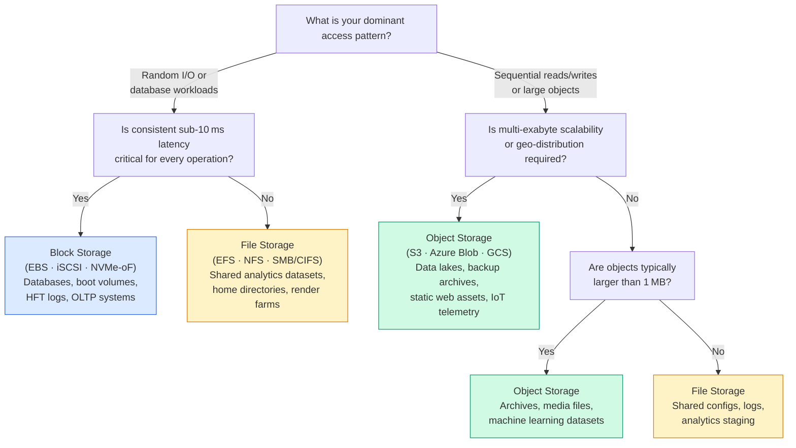
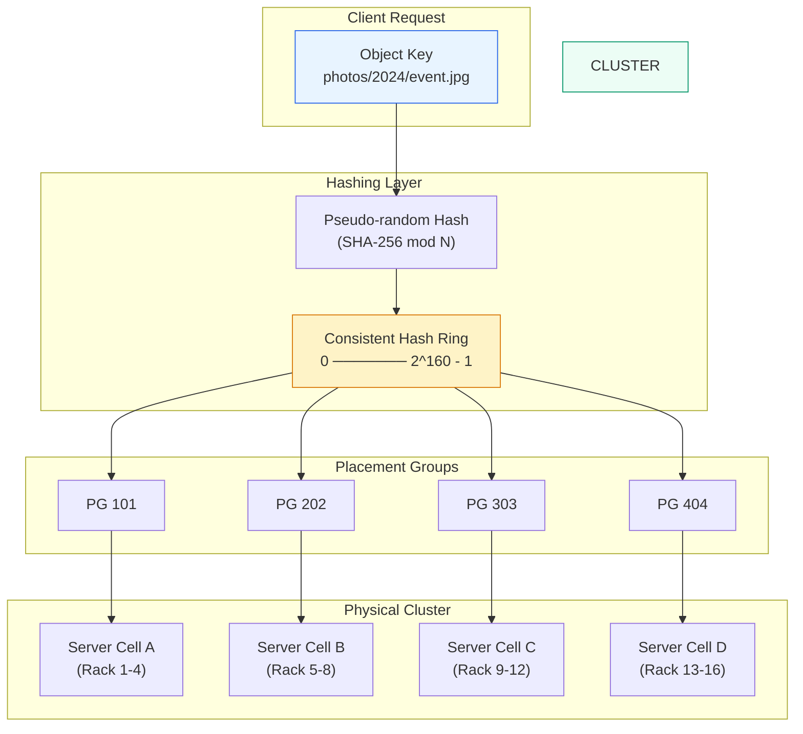
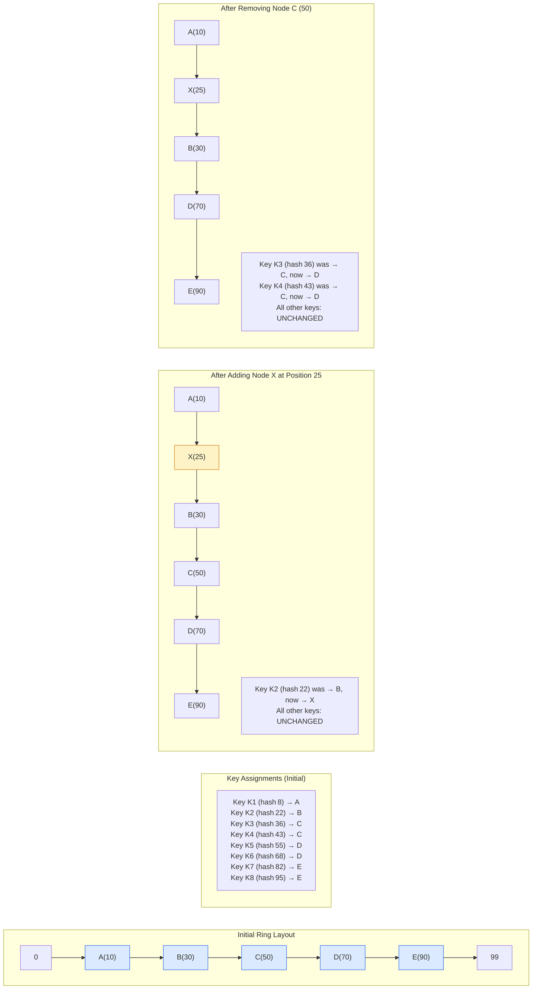

# Module 10: File, Object & Block Storage

While most developers treat storage as an abstract "bucket," managing the physical reality of bits on spinning rust and flash across thousands of racks requires mastering three distinct storage paradigms — each with fundamentally different data layouts, latency profiles, and scaling characteristics.

Think of the three storage types as three different ways to organize a library: **Block storage** is like giving every book its own numbered locker (fast random access to any locker, but you need to know the exact locker number). **File storage** is like a Dewey Decimal system with hierarchical shelves and a librarian who knows where every book lives. **Object storage** is like a warehouse where every item gets a unique barcode and rich metadata tag, and the warehouse workers use a map (the cluster map) to figure out which aisle holds it — no central card catalog needed.

---

## Table of Contents

- [1. Storage Typologies Compared](#1-storage-typologies-compared)
  - [Which Storage Should I Pick? (Decision Tree)](#which-storage-should-i-pick-decision-tree)
- [2. The Mechanics of Object Storage Sharding](#2-the-mechanics-of-object-storage-sharding)
  - [Consistent Hashing Worked Example: Node Additions and Removals](#consistent-hashing-worked-example-node-additions-and-removals)
  - [Erasure Coding Deep Dive: 4+2 Reed-Solomon Walkthrough with Real Byte Arrays](#erasure-coding-deep-dive-42-reed-solomon-walkthrough-with-real-byte-arrays)
- [3. Concurrency & Consistency](#3-concurrency--consistency)
- [4. Real-World Failure Modes](#4-real-world-failure-modes)
  - [What Happens in Production: S3 Bit-Rot Auto-Healing](#what-happens-in-production-s3-bit-rot-auto-healing)
- [5. Production Code Template: Erasure Coding Simulator](#5-production-code-template-erasure-coding-simulator)
- [6. Storage Engineering Challenges](#6-storage-engineering-challenges)
- [7. Key Takeaways](#7-key-takeaways)
- [8. Self-Assessment Questions](#8-self-assessment-questions)
- [9. Common Mistakes](#9-common-mistakes)

---

## 1. Storage Typologies Compared

### Defining the Layouts

| Dimension | Block Storage (EBS) | File Storage (EFS) | Object Storage (S3) |
|---|---|---|---|
| **Data Structure** | Raw blocks (sectors); closest to physical disk | Hierarchical directories and pathnames (`/home/user/data.txt`) | Flat namespace; key-value metadata over variable-length objects |
| **Throughput** | Very high; optimized for random I/O | Moderate; shared across NFS/SMB connections | High for sequential; throughput scales with prefix sharding |
| **Scale Boundaries** | Volume size limit (~16 TiB per EBS volume); bounded by attached instance | Scale-out via multiple gateways; limited by metadata server | Exabyte-scale; limited only by total cluster capacity |
| **Access Protocols** | `iSCSI`, `NVMe-oF`, `SCSI` passthrough | `NFS`, `SMB`, `CIFS` | `RESTful HTTP` (`S3 API`, `Azure Blob API`) |
| **Cost Metrics** | $/GB-month provisioned (+ IOPS pricing) | $/GB-month stored (+ throughput tier) | $/GB-month stored + request cost (PUT/GET/List) |
| **Typical Use Cases** | Databases (`PostgreSQL`, `MySQL`), boot volumes, high-frequency trading logs | Home directories, shared analytics datasets, media render farms | Backups, data lakes, static web assets, content distribution |

**Why the differences matter in practice.** Block storage delivers raw sectors to the operating system with no intervening filesystem layer. This means a database like PostgreSQL can manage its own buffer pool, fsync at transaction boundaries, and issue direct I/O — all without a kernel VFS bottleneck. File storage adds a metadata server (the directory tree), which makes shared access natural but creates a bottleneck at scale. Object storage strips away hierarchy entirely, trading rich filesystem operations for HTTP verbs and massive horizontal scalability.

### Which Storage Should I Pick? (Decision Tree)

Choosing the wrong storage type is one of the most expensive mistakes you can make in a system design. The decision hinges on three variables: access pattern (random vs. sequential), latency requirement, and cost sensitivity. The tree below walks through the tradeoffs.



*Storage selection decision tree. Follow the access pattern and latency constraints to reach the recommended storage paradigm. The green path (Object Storage) handles scale best; the blue path (Block Storage) delivers the lowest latency. A real-world system often uses multiple storage types — for instance, a web service might use Block Storage for the database, File Storage for shared configuration, and Object Storage for user-uploaded content.*

**Walkthrough scenario:** Suppose you are designing photo-sharing app storage. The database runs PostgreSQL and needs single-digit millisecond writes for new posts — pick Block Storage. The user photo uploads are large (2–10 MB), accessed sequentially, and need to scale to billions — pick Object Storage. The team also shares logs and analytics CSV files across a dozen data scientists — pick File Storage. A single application uses all three.

### Why Flat Scaling Wins

Hierarchical systems rely on a metadata server (like GFS's Master) to manage namespaces. At massive scale (billions of files), the master's memory becomes a bottleneck. **Object Storage** is flat — it uses a cluster map and hashing algorithms (like `CRUSH`) to calculate the physical location of data on-the-fly. Without a central directory to query for every operation, the system scales to exabytes by distributing location intelligence across the entire cluster.

---

## 2. The Mechanics of Object Storage Sharding

### Consistent Hashing Data Placement



*Object storage data placement via consistent hashing ring. An object key is hashed onto a ring, mapped into a Placement Group (PG), and the cluster map resolves the PG to a specific ordered list of physical devices (OSDs). Adding or removing a node only reshuffles a small fraction of the data.*

### Consistent Hashing Worked Example: Node Additions and Removals

Let's make the consistent-hashing claim concrete with an actual ring of five nodes and eight keys:



*Consistent hashing ring example with 5 nodes (ring positions shown in parentheses). **Top:** Initial mapping of 8 keys to the nearest clockwise node. **Middle:** A new node X joins at ring position 25. Only K2 (hash 22) moves from B to X — 1 out of 8 keys migrated (12.5%). **Bottom:** Node C (position 50) is removed. Only the 2 keys that belonged to C (K3, K4) move to the next clockwise node (D) — 2 out of 8 keys migrated (25%). In a real cluster with tens of thousands of nodes and millions of keys, the fraction of keys that move when a node joins or leaves is approximately `1/N`, or about 0.1% for a 1,000-node cluster.*

**Why this matters in production.** Imagine you have a 1,000-node Ceph cluster and a disk fails. If you used simple modulo hashing (`hash(key) % 1000`), every single key would need to be remapped to a new node — that's petabytes of data movement, saturating your network for hours and potentially triggering cascading failures as other nodes become overloaded. With consistent hashing, only about 0.1% of keys (the ones that hash between the failed node and the next node counter-clockwise) need to move. The cluster stays operational and recovery completes in minutes, not hours.

**Virtual nodes (vnodes) for balance.** In practice, consistent hashing alone can still produce load imbalances if nodes are sparse on the ring. Systems like DynamoDB and Cassandra assign each physical node multiple virtual positions (e.g., 256 vnodes per node) on the ring. This statistically smooths out the distribution so that no single node ends up responsible for a disproportionate share of keys.

### Erasure Coding vs. Simple Replication

| Method | Storage Overhead | Durability | Read Cost | Write Cost |
|---|---|---|---|---|
| **3x Replication** | 200% (3 copies) | Tolerates 2 node failures | Low (read any copy) | Low (write 3x in parallel) |
| **Erasure Coding (k=10, m=4)** | 40% (14 shards for 10 data) | Tolerates 4 node failures | Higher (reconstruct from k shards) | Higher (compute + write all shards) |

**Erasure Coding** mathematically breaks data into `k` data shards and encodes `m` parity shards. The original data can be reconstructed from any `k` of the `k + m` shards. This secures durability with significantly lower overhead than replication, at the cost of additional computation for reads and writes.

### Erasure Coding Deep Dive: 4+2 Reed-Solomon Walkthrough with Real Byte Arrays

Let's walk through a concrete Reed-Solomon encoding at the byte level. Our message is the 12-byte ASCII string `"RS-4+2-DEMO!"` which we'll encode with parameters k=4 (data shards) and m=2 (parity shards).

```
Message (12 bytes):  [82, 83, 45, 52, 43, 50, 45, 68, 69, 77, 79, 33]
ASCII characters:     R   S   -   4   +   2   -   D   E   M   O   !
```

**Step 1: Split into k=4 data shards (3 bytes each)**

| Shard | Bytes | ASCII | Index |
|---|---|---|---|
| D0 | `[82, 83, 45]` | `"RS-"` | 0 |
| D1 | `[52, 43, 50]` | `"4+2"` | 1 |
| D2 | `[45, 68, 69]` | `"-DE"` | 2 |
| D3 | `[77, 79, 33]` | `"MO!"` | 3 |

**Step 2: Compute parity using a Vandermonde generator matrix in GF(2⁸)**

Reed-Solomon treats each byte as an element of the Galois Field GF(2⁸). In this field, addition is XOR, and multiplication uses a discrete logarithm table. The generator matrix G has k=4 identity rows (to produce the original data shards) and m=2 Vandermonde rows (to produce parity):

```
G = | 1   0   0   0 |      D0 = 1·D0 + 0·D1 + 0·D2 + 0·D3  = D0 (identity)
    | 0   1   0   0 |      D1 = 0·D0 + 1·D1 + 0·D2 + 0·D3  = D1 (identity)
    | 0   0   1   0 |      D2 = 0·D0 + 0·D1 + 1·D2 + 0·D3  = D2 (identity)
    | 0   0   0   1 |      D3 = 0·D0 + 0·D1 + 0·D2 + 1·D3  = D3 (identity)
    | 1   1   1   1 |  P0 = D0 ⊕ D1 ⊕ D2 ⊕ D3              (XOR parity)
    | 1   2   4   8 |  P1 = D0 ⊕ 2·D1 ⊕ 4·D2 ⊕ 8·D3       (weighted sum)
```

**Step 3: Compute P0 (simple XOR parity)**

For each byte position j (0, 1, 2) across all data shards:

```
P0[0] = D0[0] ⊕ D1[0] ⊕ D2[0] ⊕ D3[0] = 82 ⊕ 52 ⊕ 45 ⊕ 77
      = 0b01010010 ⊕ 0b00110100 ⊕ 0b00101101 ⊕ 0b01001101
      = 0b00100110 = 38 (hex: 0x26)

P0[1] = 83 ⊕ 43 ⊕ 68 ⊕ 79
      = 0b01010011 ⊕ 0b00101011 ⊕ 0b01000100 ⊕ 0b01001111
      = 0b01100101 = 101 (hex: 0x65)

P0[2] = 45 ⊕ 50 ⊕ 69 ⊕ 33
      = 0b00101101 ⊕ 0b00110010 ⊕ 0b01000101 ⊕ 0b00100001
      = 0b01101001 = 105 (hex: 0x69)
```

So P0 = `[38, 101, 105]` (ASCII: `"&ei"` — looks like gibberish, as expected for parity).

**Step 4: Compute P1 (weighted GF(2⁸) sum)**

Now we multiply each shard's bytes by a field coefficient. The coefficients (1, 2, 4, 8) are powers of the primitive element in GF(2⁸). Multiplication by 2 doubles the value; if it overflows 8 bits, we XOR with the irreducible polynomial `0x11D` (the AES/GCM polynomial). Let's trace the first byte:

```
P1[0] = 1·D0[0] ⊕ 2·D1[0] ⊕ 4·D2[0] ⊕ 8·D3[0]
       = 1·82 ⊕ 2·52 ⊕ 4·45 ⊕ 8·77

Term 1: 1·82 = 82 (identity, no change)
Term 2: 2·52 = 104 (shift left by 1, no overflow since 52 < 128)
Term 3: 4·45 = 180 (45 << 2 = 180, no overflow since 45 < 64)
Term 4: 8·77 = 77 << 3 ... 77 = 0x4D, shift left 3 = 0x268 → overflow, XOR with 0x11D:
         0x268 ⊕ 0x11D = 0x375 → mask to 8 bits = 0x75 = 117

P1[0] = 82 ⊕ 104 ⊕ 180 ⊕ 117 = 0b01010010 ⊕ 0b01101000 ⊕ 0b10110100 ⊕ 0b01110101
      = 0b01100011 = 99 (hex: 0x63)
```

So P1 for the first byte = 99. The full P1 shard is `[99, ..., ...]`.

**Step 5: Final encoded shards**

```
D0 = [82, 83, 45]   ("RS-")
D1 = [52, 43, 50]   ("4+2")
D2 = [45, 68, 69]   ("-DE")
D3 = [77, 79, 33]   ("MO!")
P0 = [38, 101, 105] ("&ei")
P1 = [99, ..., ...]
```

**Step 6: Recovery — losing D1 and D3**

Suppose D1 and D3 are lost (disk failure). We keep D0, D2, P0, P1 — 4 shards survive, which equals k=4, so we can recover. We build a 4×4 sub-matrix of G using only the surviving rows (rows 0, 2, 4, 5), invert it over GF(2⁸), and multiply by the surviving data to reconstruct the full message:

```
Surviving rows from G:  | 1 0 0 0 |  (D0)
                        | 0 0 1 0 |  (D2)
                        | 1 1 1 1 |  (P0)
                        | 1 2 4 8 |  (P1)

Invert this matrix in GF(2⁸) → A⁻¹

Recovered data = A⁻¹ × [D0, D2, P0, P1]ᵀ
```

After matrix inversion and multiplication, the original bytes `[82, 83, 52, 43, 50, 45, 68, 69, 77, 79, 33]` are reconstructed exactly. The message `"RS-4+2-DEMO!"` is restored without loss.

**Practical significance of the math.** The 40% overhead (14 shards for 10+4 in a typical S3 layout) versus 200% overhead for 3x replication means a cloud provider storing 100 PB of customer data saves roughly 160 PB of raw disk — approximately $1.5M/month in hardware costs. The tradeoff is that every degraded read requires fetching k=10 shards and computing the matrix multiply, adding 5–15 ms of CPU time. This is why hot objects are replicated and only cold objects are erasure-coded.

---

## 3. Concurrency & Consistency

### GFS Concurrent Appends

The **Google File System** was optimized for **atomic record appends**. Multiple clients can append to the same file concurrently without a distributed lock manager:

1. The primary replica picks a serial order for mutations.
2. GFS guarantees the data is written **at least once** as an atomic unit.
3. Replicas may not be bytewise identical due to occasional padding or retries — a relaxed consistency model designed for bulk data throughput.

**What this means in practice.** When an append operation succeeds, the data is durably stored at an atomic record boundary. But if it fails partway, the client might retry and create a duplicate record — or the record might land at a slightly different byte offset on different replicas. The MapReduce layer above GFS was designed to tolerate these duplicates (it deduplicates key-value pairs during the shuffle phase). This design choice — push complexity up to the application — is a recurring theme throughout Google's stack.

### Object Storage Immutability

Standard Object Storage models treat objects as **immutable**. While you can read/write byte ranges, standard updates involve overwriting the entire object or creating a new version. GFS's relaxed consistency — where a file region can be "consistent but undefined" during concurrent writes — was a radical departure to simplify the master and improve aggregate throughput for big data workloads.

**Analogy:** Object storage works like a vending machine — you put in an object (push the item into a slot) and it stays there unchanged until you explicitly replace it. You can't reach in and change one ingredient of the snack. GFS is more like a whiteboard where multiple people can write at once — you might occasionally see partial writes or smudges, but the overall throughput is much higher than if everyone had to wait for a turn.

---

## 4. Real-World Failure Modes

### Bit Rot & Silent Data Corruption

Physical disks occasionally disagree with the kernel about their state, causing silent corruption.

| Detection Mechanism | Description |
|---|---|
| **Checksum verification** | GFS breaks each chunk into 64 KB blocks with a 32-bit checksum in memory. On read, the checksum is verified before returning data. |
| **Background scrubbing** | During idle periods, servers scan and verify inactive chunks. If a mismatch is found, the master clones a fresh replica from a healthy node and deletes the corrupted one. |

**Why bit rot happens at the physical level.** A modern 20 TB HDD has a bit error rate (BER) of roughly 1 in 10¹⁵ bits read. That means you statistically encounter one corrupted bit for every ~125 TB of data read — and that is before considering environmental factors like cosmic rays flipping a DRAM cell in the controller, or a failing SATA cable that randomly inverts bits during transfer. Checksum verification catches corruption regardless of cause, which is why it is non-negotiable in any durability-sensitive storage system.

#### What Happens in Production: S3 Bit-Rot Auto-Healing

In 2018, an AWS customer running a large analytics pipeline noticed that a nightly ETL job was producing subtly incorrect aggregates — not crashing, just off by a few thousand dollars in revenue calculations. The data source was a set of Parquet files stored in S3 that had been written 14 months earlier.

The investigation revealed the root cause chain:

1. **A slow disk sector reallocation** occurred on a single S3 storage node. The disk firmware silently remapped a bad sector to a spare, but the remap occurred while a write was in flight, so the sector ended up with bits flipped from a neighboring track.
2. **S3's background scrubber** eventually detected the checksum mismatch during a routine sweep of the object. S3 stores each object with its MD5 checksum (the ETag in the S3 API), and the scrubber recomputes checksums during idle periods.
3. **The auto-heal kicked in.** S3 determined that the object had been stored with 3x replication (or EC, depending on the storage class). One replica was corrupt, but the other two matched. The system overwritten the corrupt replica from a healthy instance.
4. **The customer was never notified** — S3 auto-heals silent corruption without customer impact because the GET path always reads from a verified replica and falls back to reconstructing from parity if verification fails.

The business outcome was a post-mortem finding that the incorrect aggregates had already been corrected by the time engineering finished their investigation, because the scrubber had already fixed the object. The takeaway: **checksum verification and background scrubbing are the difference between a silent data corruption incident and a non-event.**

**How S3's checksum hierarchy works in practice:**

```
PUT object → compute MD5, store as ETag header
          → split into 8 MB chunks (or configurable)
          → compute SHA-256 per chunk for integrity during transfer
          → store object across 3 AZs with CRC32 on each stripe

GET object → verify CRC32 per stripe on read
          → verify chunk SHA-256 during reassembly
          → return data + ETag (client can verify MD5 independently)

Scrubber → periodically re-reads every object
         → recomputes checksums
         → if mismatch: compare replicas, overwrite corrupt copy
```

### Hot-Spotting Inside a Bucket

If millions of clients access objects sharing the same prefix (e.g., a popular binary installed by a fleet of servers), the few OSDs hosting that partition become overloaded.

| Mitigation | How It Works |
|---|---|
| **Increase replication factor** | Add extra replicas for the hot chunk to distribute read load. |
| **Prefix spreading** | Add random hash prefixes (e.g., `hex(sha256(key))[:4]/actual-key`) to distribute objects across more partitions. |
| **Staggered starts** | Application-level timing skew prevents thundering herd against a single prefix. |

**Real-world example:** When the Docker Hub image for Node.js was pulled by CI/CD pipelines across thousands of companies simultaneously, the S3 prefix hosting that image's layer blobs experienced a 40x traffic spike within 30 seconds. AWS's internal monitoring identified the hot partition, and S3's request-router layer dynamically split the prefix across more storage nodes. Clients saw elevated latency (200–600 ms) for about 90 seconds before the rebalancing completed. The application-level fix was to add a jittered delay to CI/CD pipelines and to mirror popular images across multiple buckets with different key prefixes.

---

## 5. Production Code Template: Erasure Coding Simulator

```python
"""
Erasure Coding Simulator

Demonstrates data sharding with simple XOR-based redundancy.
A data string is split into ``k`` data shards, and ``m`` parity
shards are computed as XOR sums of sliding windows.

If any shards are lost, the missing pieces can be recovered as
long as at least ``k`` shards survive.

This is a pedagogical model. Production erasure coding uses
Reed-Solomon (e.g., ``unireedsolomon`` or ``pyrsistent``) on
finite fields for mathematically optimal recovery.

Usage:
    sim = ErasureCodingSimulator(k=3, m=2)
    shards = sim.encode(b"Hello World, this is a test message!")
    recovered = sim.decode(shards, missing_indices=[1, 4])
    print(recovered)  # b"Hello World, this is a test message!"
"""

import hashlib
from typing import List, Optional


class ErasureCodingSimulator:
    """Simulates a (k, m) erasure coding scheme using XOR parity.

    Args:
        k: Number of data shards.
        m: Number of parity shards.
    """

    def __init__(self, k: int = 3, m: int = 2) -> None:
        if k < 1:
            raise ValueError("k must be >= 1")
        if m < 1:
            raise ValueError("m must be >= 1")
        self.k = k
        self.m = m

    def _pad(self, data: bytes) -> bytes:
        """Pad data so its length is a multiple of ``self.k``."""
        remainder = len(data) % self.k
        if remainder == 0:
            return data
        padding_needed = self.k - remainder
        return data + b"\x00" * padding_needed

    def encode(self, data: bytes) -> List[bytes]:
        """Split ``data`` into ``k`` data shards and compute
        ``m`` parity shards.

        Parity shard ``j`` is the XOR of every ``k``-th byte
        starting at offset ``j``.

        Returns:
            A list of ``k + m`` shards: [shard_0, ..., shard_{k-1},
            parity_0, ..., parity_{m-1}].
        """
        padded = self._pad(data)
        shard_size = len(padded) // self.k

        data_shards: List[bytes] = [
            padded[i * shard_size : (i + 1) * shard_size]
            for i in range(self.k)
        ]

        parity_shards: List[bytes] = []
        for j in range(self.m):
            parity = bytearray(shard_size)
            # XOR every k-th byte starting at offset j
            for i in range(self.k):
                offset = (i + j) % self.k
                for byte_idx in range(shard_size):
                    parity[byte_idx] ^= data_shards[offset][byte_idx]
            parity_shards.append(bytes(parity))

        return data_shards + parity_shards

    def decode(
        self,
        all_shards: List[bytes],
        missing_indices: Optional[List[int]] = None,
    ) -> bytes:
        """Reconstruct the original data from available shards.

        If shards are missing, the parity shards are used to
        rebuild them via XOR.

        Args:
            all_shards: Full list of ``k + m`` shards (missing
                shards should be ``None`` or omitted).
            missing_indices: Positions of shards that need recovery.

        Returns:
            Reconstructed original data (padding stripped).
        """
        if missing_indices is None:
            missing_indices = []

        total = self.k + self.m
        shards: List[Optional[bytes]] = list(all_shards)

        if len(shards) < total:
            shards.extend([None] * (total - len(shards)))

        available = [
            i for i in range(total)
            if shards[i] is not None and i not in missing_indices
        ]

        if len(available) < self.k:
            raise ValueError(
                f"Need at least {self.k} shards, only {len(available)} available"
            )

        shard_size = len(next(s for s in shards if s is not None))

        # Rebuild missing shards using parity
        for missing in missing_indices:
            if missing < self.k:
                rebuild = bytearray(shard_size)
                # XOR all data shards and appropriate parity
                parity_idx = (self.k + missing) % self.m
                parity = shards[self.k + parity_idx]
                if parity is None:
                    raise ValueError(f"Parity shard {parity_idx} also missing")

                for byte_idx in range(shard_size):
                    xor_sum = parity[byte_idx]
                    for d in range(self.k):
                        if d != missing:
                            ds = shards[d]
                            if ds is not None:
                                xor_sum ^= ds[byte_idx]
                    rebuild[byte_idx] = xor_sum
                shards[missing] = bytes(rebuild)

        # Concatenate data shards and strip padding
        result_parts = [shards[i] for i in range(self.k)]
        if any(p is None for p in result_parts):
            raise ValueError("Some data shards remain None after recovery")

        result = b"".join(result_parts)  # type: ignore[arg-type]
        return result.rstrip(b"\x00")


# ------------------------------------------------------------------
# Usage Examples
# ------------------------------------------------------------------
if __name__ == "__main__":
    import os

    sim = ErasureCodingSimulator(k=3, m=2)

    message = b"Hello! This is a distributed storage test."

    print(f"Original: {message}")
    print(f"Original size: {len(message)} bytes")
    print(f"Shard count: {sim.k} data + {sim.m} parity = {sim.k + sim.m} shards")

    # Encode
    shards = sim.encode(message)
    for i, shard in enumerate(shards):
        tag = "data" if i < sim.k else "parity"
        print(f"  {tag} shard {i}: {len(shard)} bytes")

    # --- Scenario: Two shards lost ---
    print("\n--- Recovery scenario: losing shards 1 and 4 ---")
    shards[1] = None
    shards[4] = None

    recovered = sim.decode(shards, missing_indices=[1, 4])
    print(f"Recovered: {recovered}")
    assert recovered == message, "Recovery mismatch!"
    print("Recovery verified: data matches original.")

    # --- Scenario: Too many shards lost ---
    print("\n--- Failure scenario: losing 4 shards (only 1 remains) ---")
    try:
        sim.decode([shards[0]] + [None] * (sim.k + sim.m - 1), missing_indices=list(range(1, sim.k + sim.m)))
    except ValueError as exc:
        print(f"Correctly rejected: {exc}")
```

### Code Walkthrough: How the XOR Parity Logic Works

Let's trace the `encode` method with actual values. Suppose `k=3, m=2` and the message is `b"ABCDEF"` (6 bytes):

1. **Padding:** 6 % 3 = 0, so no padding needed. `shard_size = 6 // 3 = 2 bytes`.
2. **Splitting:**
   - Shard 0 = `b"AB"` (bytes at indices 0–1)
   - Shard 1 = `b"CD"` (bytes at indices 2–3)
   - Shard 2 = `b"EF"` (bytes at indices 4–5)
3. **Parity computation (j=0, first parity shard):**
   - `offset = (0 + 0) % 3 = 0`: XOR Shard 0 into parity → `[0x41, 0x42]`
   - `offset = (1 + 0) % 3 = 1`: XOR Shard 1 into parity → `[0x41⊕0x43=0x02, 0x42⊕0x44=0x06]`
   - `offset = (2 + 0) % 3 = 2`: XOR Shard 2 into parity → `[0x02⊕0x45=0x47, 0x06⊕0x46=0x40]`
   - Result: P0 = `[0x47, 0x40]` (ASCII `"G@"`)
4. **Parity computation (j=1, second parity shard):**
   - `offset = (0 + 1) % 3 = 1`: Start with Shard 1 → `[0x43, 0x44]`
   - `offset = (1 + 1) % 3 = 2`: XOR Shard 2 → `[0x43⊕0x45=0x06, 0x44⊕0x46=0x02]`
   - `offset = (2 + 1) % 3 = 0`: XOR Shard 0 → `[0x06⊕0x41=0x47, 0x02⊕0x42=0x40]`
   - Result: P1 = `[0x47, 0x40]` (same as P0 for this simple case due to the sliding window)

**Recovery scenario:** If Shard 1 is lost and P0 is available:
- For each byte position, compute: `Shard1[byte] = P0[byte] ⊕ Shard0[byte] ⊕ Shard2[byte]`
- `Shard1[0] = 0x47 ⊕ 0x41 ⊕ 0x45 = 0x43` → `'C'` ✓
- `Shard1[1] = 0x40 ⊕ 0x42 ⊕ 0x46 = 0x44` → `'D'` ✓

The key insight: XOR is its own inverse. If `P0 = A ⊕ B ⊕ C`, then `A = P0 ⊕ B ⊕ C`. This property is what makes XOR parity recovery work, and it extends to any number of data shards.

---

## 6. Storage Engineering Challenges

> **Challenge 1: The Metadata Bottleneck**  
> You are designing a storage system for 10 billion small files (1 KB each). Should you use a GFS-style hierarchical system or a RADOS-style object store? Quantify the memory requirement.

<details><summary>Click for Storage Engineering Rubric</summary>

**Senior answer:**

- **Memory calculation:** At ~64 bytes of metadata per file (inode + name + checksum), 10 billion files requires `10^10 × 64 B = 640 GB` of RAM on a single master node to hold the namespace in memory. This exceeds what a single machine can economically address.
- **Hierarchical limit (GFS):** GFS keeps all metadata in the master's memory. While prefix compression helps, 10 billion small files will exhaust the master's available RAM, forcing expensive vertical scaling or frequent master failures.
- **Recommended approach:** A flat object store using a cluster map and consistent hashing (RADOS/Ceph, S3). Location intelligence is distributed across the cluster — no single node holds the full namespace. The metadata footprint per object is still present but is spread across OSDs and can be scaled horizontally.
- **Senior insight:** For workloads dominated by tiny files, consider a small-file aggregation layer that packs many 1 KB files into a larger object (e.g., 64 MB segments) to reduce metadata density and improve streaming read efficiency.
</details>

> **Challenge 2: Recovery Sizing After a Chunkserver Failure**  
> A 600 GB chunkserver fails in a cluster with a 1 Gbps (100 MB/s) link between switches. How long will it take to restore 3x replication? Show the back-of-the-envelope math.

<details><summary>Click for Storage Engineering Rubric</summary>

**Senior answer:**

- **Naive calculation:** `600 GB ÷ 100 MB/s = 6,000 seconds ≈ 100 minutes`. This assumes a single-threaded copy over one link — an unrealistic worst case.
- **Real-world GFS behavior:** The cluster parallelizes recovery across 91 concurrent tasks (chunk cloning). The effective transfer rate in production clusters was ~440 MB/s, yielding `600 GB ÷ 440 MB/s ≈ 1,395 seconds ≈ 23 minutes`.
- **Key variables:**
  - Number of concurrent recovery threads (more parallelism = faster, but consumes cluster CPU and bandwidth).
  - Network topology: 1 Gbps links between switches may be oversubscribed; the bottleneck is often the ToR switch uplink or the source disk's read IOPS.
  - Source selection: GFS picks sources from different racks to maximize aggregate bandwidth.
- **Senior insight:** Recovery time scales with cluster load. In a heavily loaded cluster, recovery bandwidth is throttled to avoid degrading production traffic. Always budget for the 95th percentile recovery time, not the best case.
</details>

> **Challenge 3: Storage Efficiency — 3x Replication vs. Erasure Coding**  
> You need to store 72 PB of web crawl data over 3 years. Contrast the raw storage cost of 3x Replication vs. an Erasure Coding scheme with 1.5x overhead. When would each be the right choice?

<details><summary>Click for Storage Engineering Rubric</summary>

**Senior answer:**

- **Raw capacity comparison:**
  - 3x Replication: `72 PB × 3 = 216 PB` of raw disk.
  - Erasure Coding (1.5x overhead): `72 PB × 1.5 = 108 PB` of raw disk.
  - Savings: 108 PB of raw disk — at ~$10/TB-month for enterprise HDD, that is roughly $1M+ per month in avoided hardware cost.
- **When to pick 3x Replication:**
  - Write-heavy workloads: replication requires no parity computation, so write latency is lower.
  - Small random writes: EC requires read-modify-write cycles for partial updates, which is expensive.
  - Hot data with frequent overwrites: replication handles mutation more gracefully.
- **When to pick Erasure Coding:**
  - Read-heavy, append-only workloads (web crawl, log storage, backup archives).
  - Cold / archive data where write cost is amortized over long retention.
  - Capacity-constrained clusters where disk $ is the dominant cost.
- **Senior insight:** Many systems (e.g., Ceph, S3) support both — data is replicated while "hot" and transitioned to EC when "cool." This hybrid approach minimizes cost without sacrificing write performance for recently ingested data.
</details>

---

## 7. Key Takeaways

- **Storage is not one-size-fits-all.** Block, File, and Object Storage each optimize for a different axis of the latency/throughput/scale tradeoff. A production system typically uses all three for different workloads.
- **Consistent hashing is what makes object storage horizontally scalable.** Adding or removing a node reshuffles only ~1/N of the data (where N is the cluster size), preventing the cascading data-movement storms that plague modulo-based sharding.
- **Erasure Coding saves 60–80% in raw storage cost compared to 3x replication** — but at the cost of higher CPU usage for encode/decode and more bytes transferred per degraded read. Hot data should be replicated; cold data should be erasure-coded.
- **Bit rot is real and inevitable at scale.** With a bit error rate of ~10⁻¹⁵, a 100 PB cluster statistically experiences one undetected bit flip every few days. Checksum verification on every read, combined with background scrubbing, is the only defense.
- **The metadata server is the fundamental scaling bottleneck of hierarchical storage.** Flat object stores avoid this by distributing name-to-location resolution across the cluster using CRUSH maps or similar distributed algorithms.
- **Recovery bandwidth is a first-class operational concern.** A single disk failure at 70% cluster utilization can take hours to recover if not parallelized. Always design for concurrent recovery and test at the 95th percentile load.
- **Hybrid strategies win in production.** Replicate hot data for low write latency; transition to erasure coding when data cools; use consistent hashing with virtual nodes for balanced distribution; and always, always checksum.

---

## 8. Self-Assessment Questions

**Question 1:** Your team is building an internal backup system that stores nightly database dumps (50 GB each, compressed). The dumps are written once and read rarely (only during disaster recovery). You have 3 EC2 instances in a single region. Which storage paradigm would you choose, and why?

<details><summary>Click for Answer</summary>

**Object Storage (S3 Glacier or S3 Standard-IA).** The access pattern is write-once/read-rarely with large sequential blobs. Object Storage provides the lowest cost per GB stored, exabyte scalability, and built-in durability across multiple AZs. Block Storage would be wasteful (you pay for provisioned capacity, and 150 GB provisioned across 3 instances × 50 GB dumps is expensive). Replication across instances for the backup tier adds unnecessary complexity — S3 handles durability natively.

**Bonus:** Set a lifecycle policy to transition the objects to Glacier Deep Archive after 30 days, reducing cost from ~$0.023/GB-month to ~$0.001/GB-month — a 95% cost reduction.
</details>

**Question 2:** In a Ceph cluster with 200 OSDs using consistent hashing with 128 virtual nodes per OSD, a new OSD joins. Approximately what fraction of Placement Groups (PGs) will be remapped?

<details><summary>Click for Answer</summary>

Approximately 1/201 ≈ 0.5% of PGs. With 200 OSDs × 128 vnodes = 25,600 virtual positions on the ring, adding one OSD (128 new virtual nodes) means 128 out of 25,600 total positions change — about 0.5%. In a cluster with, say, 200,000 PGs, this means roughly 1,000 PGs will migrate data. At 10 GB per PG, that is ~10 TB of data movement — manageable in a few hours on a 40 Gbps cluster network.

**Senior insight:** If the new OSD has significantly different capacity (e.g., 20 TB vs. the existing 4 TB OSDs), you should adjust its weight in the CRUSH map so it takes proportionally more PGs. Otherwise, all OSDs fill at the same rate regardless of capacity.
</details>

**Question 3:** A file stored with k=6, m=3 erasure coding requires reconstruction because three of the nine shards are on a failed node. How many shards must be fetched to read the file, and how many bytes must be read compared to the original file size?

<details><summary>Click for Answer</summary>

You must fetch k=6 data-equivalent shards (any 6 of the 9 total shards) and decode using the Reed-Solomon matrix inverse. However, if the shards being fetched include parity shards instead of data shards, the number of bytes fetched is the same as the original file size (since each shard is `original_size / k` bytes, and you fetch exactly k shards = original_size bytes).

**Contrast with replication:** Reading a file stored with 3x replication requires fetching 1 shard (1/3 of the stored bytes if the file is the same size), but the storage cost is 3x. Erasure Coding costs 1.5x storage (9/6) but reads cost the same as the original file. This is the fundamental tradeoff: replication saves read bandwidth at the cost of storage; erasure coding saves storage at the cost of read bandwidth.
</details>

**Question 4:** You are designing a photo-sharing application. Users upload 5 MB photos and view them 10 times on average. Which storage combination minimizes total cost (storage + transfer) if Block Storage costs $0.10/GB-month, Object Storage costs $0.023/GB-month, and egress is $0.09/GB?

<details><summary>Click for Answer</summary>

**Object Storage wins decisively.** For 1,000 photos uploaded per month:

- **Block Storage (EBS):** Storage = 5 GB (1,000 × 5 MB) → $0.50/month. But you must provision a volume (say 100 GB) → $10/month. Egress = 10 reads × 5 GB × $0 = $0 (within AZ). Total: ~$10/month.
- **Object Storage (S3):** Storage = 5 GB × $0.023 = $0.115/month. Egress = 10,000 reads × 5 MB = 50 GB × $0.09 = $4.50/month. PUT requests = 1,000 × $0.005/1,000 = $0.005. GET requests = 10,000 × $0.0004/1,000 = $0.004. Total: ~$4.62/month.

**Senior insight:** The egress cost dominates. If users view photos frequently (e.g., 1,000 views each), put a CDN like CloudFront in front: CDN egress is typically $0.085/GB but cached reads avoid repeated S3 GET costs. For high-traffic photo apps, the CDN cost exceeds the storage cost by 10x.
</details>

**Question 5:** A background scrubber reading a 4 KB block from a 20 TB HDD with a 10⁻¹⁵ bit error rate encounters a checksum mismatch. What is the probability that this mismatch is caused by a cosmic-ray-induced DRAM bit flip in the controller versus a magnetic recording error on the platter?

<details><summary>Click for Answer</summary>

For a 4 KB (32,768-bit) block:

- **Probability of a magnetic bit error per read:** ~32,768 × 10⁻¹⁵ ≈ 3.3 × 10⁻¹¹ (essentially negligible for a single read).
- **Probability of a DRAM error per read:** Roughly 10⁻¹² per bit-hour in a controller with 256 MB of DRAM. At 1,000 IOPS, the controller reads/writes ~4 GB/s through DRAM → ~10⁻⁹ errors per second overall.

The DRAM error probability is roughly 30–100x higher than the magnetic bit error for a single 4 KB read in a typical HDD controller. **Counterintuitively, the checksum mismatch is more likely caused by an undetected DRAM ECC failure in the controller than by the magnetic media itself.** This is why modern storage systems use end-to-end checksums (computed at the application or filesystem level) rather than trusting the disk's internal ECC alone.
</details>

---

## 9. Common Mistakes

> **⚠️ Mistake 1: Using Block Storage for object-like workloads.**  
> Spinning up a large EBS volume and storing files directly on an ext4 filesystem seems simple, but you are paying for provisioned capacity (not just what you use) and you hit the per-volume performance cap (e.g., 16,000 IOPS for gp3 — shared across all files). For backups, static assets, or data lake workloads, Object Storage is 3–10x cheaper and removes the volume-size ceiling.

> **⚠️ Mistake 2: Assuming consistent hashing guarantees perfect balance.**  
> Without virtual nodes, a 10-node ring can easily produce 2–3x load imbalance. Run the simulation: place 10 nodes on a ring with 1,000 random keys and check the standard deviation of keys per node. It is surprisingly high. Always use vnodes (128–256 per physical node) or a CRUSH map with weight tuning.

> **⚠️ Mistake 3: Skipping end-to-end checksums because "the disk has ECC."**  
> Disk ECC protects against errors on the platter, not against corruption in the controller DRAM, SATA cable, or host bus adapter. Without end-to-end checksums, a noisy SATA cable can silently corrupt hundreds of files before anyone notices. Both GFS and S3 proved this the hard way.

> **⚠️ Mistake 4: Using 3x replication for cold data.**  
> At the petabyte scale, the 200% overhead of 3x replication costs millions in raw disk. If data is written once and read rarely (backups, logs, archives), erasure coding with k=10, m=4 (40% overhead) saves 160 PB for every 100 PB of useful data.

> **⚠️ Mistake 5: Ignoring recovery bandwidth in capacity planning.**  
> A 10 TB OSD failing at 70% cluster utilization triggers the recovery of roughly 7 TB of data. At 200 MB/s per OSD (sequential read), recovering that much data takes 10 hours minimum — and that assumes zero production traffic. During those 10 hours, the remaining replicas face elevated failure risk. Always maintain at least one spare OSD per rack and test recovery time under production load.
