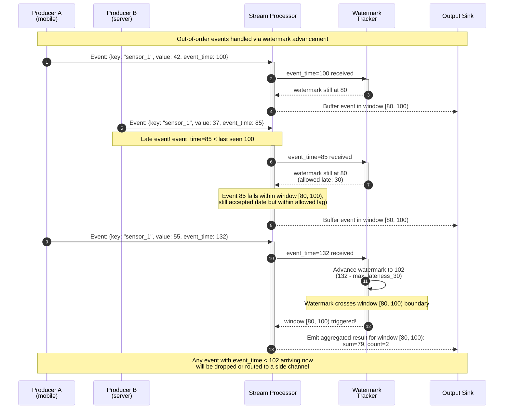

# Module 11: Stream Processing & Real-Time Analytics

This module moves beyond "data at rest" and into "data in motion" — engineering continuous, low-latency computation over immutable, append-only event logs where batch staleness is no longer acceptable.

---

## Table of Contents

- [1. The Log-Centric Distributed Data Architecture](#1-the-log-centric-distributed-data-architecture)
- [2. Time Semantics and Windowing](#2-time-semantics-and-windowing)
- [3. Lambda vs. Kappa Architecture](#3-lambda-vs-kappa-architecture)
- [4. Real-World Failure Modes](#4-real-world-failure-modes)
- [5. Production Code Template: Windowed Aggregator](#5-production-code-template-windowed-aggregator)
- [6. Streaming System Reviews](#6-streaming-system-reviews)

---

## 1. The Log-Centric Distributed Data Architecture

### The Log as a Unifying Abstraction

At the heart of real-time systems is Jay Kreps' concept of the **log** — a structured data journal: an append-only, totally-ordered sequence of records ordered by time. Records are appended to the end, and reads proceed left to right. Because the log records "what happened and when," it serves as the authoritative source of truth for distributed systems.

### Offsets and Consumer Groups

Consumer groups track their progress via **offsets** — logical pointers into the log. These offsets decouple producers from consumers, acting as a logical clock representing the "point in time" a system has read up to.

| Property | Benefit |
|---|---|
| **Multiple consumers** | A single log feed can serve a search index, a cache, and a Hadoop cluster simultaneously |
| **Replay** | Any consumer can rewind to offset 0 and reprocess from the beginning |
| **Independent pacing** | Fast consumers read ahead; slow consumers lag behind — no one blocks |

### Batch vs. Stream Processing

| Dimension | Batch Processing | Stream Processing |
|---|---|---|
| **Data model** | Periodic dumps (hourly/daily snapshots) | Continuous, unbounded event feed |
| **Latency** | Minutes to hours | Milliseconds to seconds |
| **Computation** | Static snapshots; data is stale on arrival | Process events as they arrive |
| **Typical stacks** | `MapReduce`, `Spark Batch`, `Hive` | `Apache Flink`, `Kafka Streams`, `Spark Streaming` |

---

## 2. Time Semantics and Windowing

### Event Time vs. Processing Time

| Concept | Definition | Risk |
|---|---|---|
| **Event Time** | Timestamp assigned when the action *actually occurred* (e.g., the user's phone recorded a click at 14:01:05 UTC) | Producer clock skew |
| **Processing Time** | Timestamp when a server node *actually processes* the log line | Non-deterministic; depends on scheduling, backpressure, and thread execution order |

### Watermarks and Out-of-Order Events

A **watermark** is a temporal cutoff that tells the stream processor: *"I am confident no event with Event Time older than this value will arrive."* When the watermark passes the end of a window, the window fires and emits its result.



*The diagram above shows two producers emitting events at different `Event Time`s. The `Stream Processor` tracks a **watermark** that advances based on the maximum observed event time minus an allowed lateness threshold. When the watermark crosses a window boundary, the window fires. Late events arriving within the allowed lag are still included; events beyond the watermark are discarded.*

### Stream Windowing Types

| Type | Behavior | Example |
|---|---|---|
| **Tumbling window** | Fixed-size, non-overlapping blocks. Every `N` seconds, a new window starts. | `[00:00, 00:05)`, `[00:05, 00:10)` |
| **Sliding window** | Fixed-size windows that overlap by a specified slide interval. A new window starts every slide interval. | Window length = 10 min, slide = 1 min |
| **Session window** | Windows defined by bursts of activity followed by a gap of inactivity. No fixed duration. | User click session: ends after 30 min of idle |

---

## 3. Lambda vs. Kappa Architecture

| Dimension | Lambda Architecture | Kappa Architecture |
|---|---|---|
| **Processing Layers** | Batch layer (reliable, high-latency) + Speed layer (low-latency, approximate) | Single stream processing pipeline |
| **Complexity** | High — two separate codebases, two deployment models, manual reconciliation | Lower — one pipeline, one codebase |
| **Latency** | Batch layer: minutes/hours; Speed layer: seconds | Seconds (no batch lag) |
| **Reprocessing** | Run full batch job again | Start new stream processor instance and replay the log from offset 0 |
| **Tooling** | `Hadoop` + `Spark Batch` + streaming engine | `Apache Kafka` + `Flink` / `Kafka Streams` |

### Kappa Architecture Core Idea

The log is the central repository of truth. If you need to re-process data or change your logic, you start a new instance of your stream processor and "replay" the log from the beginning. The database, search index, and analytics engine are merely **derived views** of the immutable log.

---

## 4. Real-World Failure Modes

### Out-of-Order Events

Network disconnections or process failures cause events to arrive out of order. If a stream processor re-orders two updates to the same record (e.g., a bank credit followed by a debit), it will compute the wrong final state.

**Mitigation:** The log provides a **total order within each partition**, ensuring all subscribers see the exact same sequence. Watermarks and allowed lateness windows give the processor a bounded buffer for re-ordering before computing results.

### Exactly-Once Semantics (EOS)

Achieving **exactly-once** processing requires the stream engine to ensure that even if a processor fails, the resulting state is as if every message was processed exactly once.

| Approach | Mechanism | Throughput Impact |
|---|---|---|
| **Two-phase commit** | Coordinated commit between stream source, processor state, and output sink | High — requires all participants to be available |
| **Chandy-Lamport snapshot variant** | Periodic checkpointing of operator state into a durable changelog; on failure, restore from latest checkpoint and replay from the corresponding offset | Moderate — checkpoint interval is tunable |
| **Idempotent sinks** | Accept duplicates at the output layer and deduplicate via unique message IDs | Lowest — no coordination needed during normal flow |

---

## 5. Production Code Template: Windowed Aggregator

```python
"""
Tumbling window aggregation engine.

Accepts events with ``timestamp``, ``key``, and ``value`` fields.
Accumulates sum and count per key within fixed-duration windows.
When the window ends, the aggregated result is emitted.

Sliding window support is provided via ``SlidingWindowedAggregator``.

Usage:
    agg = TumblingWindowedAggregator(window_ms=10_000, allowed_lateness_ms=2_000)
    agg.add_event({"timestamp": 1000, "key": "sensor_a", "value": 42})
    agg.add_event({"timestamp": 5000, "key": "sensor_a", "value": 37})
    results = agg.advance(10_000)  # triggers window close
"""

import logging
from dataclasses import dataclass, field
from typing import Any, Dict, List, Optional

logger = logging.getLogger("windowed_aggregator")


@dataclass
class WindowResult:
    """Aggregated output for a single key within a window."""

    window_start_ms: int
    window_end_ms: int
    key: str
    sum: float = 0.0
    count: int = 0

    @property
    def mean(self) -> Optional[float]:
        return self.sum / self.count if self.count > 0 else None


class TumblingWindowedAggregator:
    """Accumulates sum and count per key over fixed-size, non-overlapping
    time windows.

    Args:
        window_ms: Duration of each tumbling window in milliseconds.
        allowed_lateness_ms: Events whose ``timestamp`` falls within
            this offset past the window end are still accepted.
    """

    def __init__(self, window_ms: int = 10_000, allowed_lateness_ms: int = 2_000) -> None:
        self._window_ms = window_ms
        self._allowed_lateness_ms = allowed_lateness_ms
        # state[window_start][key] = WindowResult
        self._state: Dict[int, Dict[str, WindowResult]] = {}

    def _window_start(self, timestamp_ms: int) -> int:
        return (timestamp_ms // self._window_ms) * self._window_ms

    def add_event(self, event: Dict[str, Any]) -> None:
        """Ingest a single event.

        Event format::

            {
                "timestamp": int,   # event time in milliseconds
                "key": str,         # grouping key
                "value": float,     # numeric value to aggregate
            }
        """
        ts: int = event["timestamp"]
        key: str = event["key"]
        value: float = float(event["value"])

        win_start = self._window_start(ts)
        now = ts

        # Drop events that exceeded the allowed lateness
        if now - win_start > self._window_ms + self._allowed_lateness_ms:
            logger.warning("Dropping late event: ts=%d key=%s win_start=%d", ts, key, win_start)
            return

        if win_start not in self._state:
            self._state[win_start] = {}

        if key not in self._state[win_start]:
            self._state[win_start][key] = WindowResult(
                window_start_ms=win_start,
                window_end_ms=win_start + self._window_ms,
                key=key,
            )

        self._state[win_start][key].sum += value
        self._state[win_start][key].count += 1

    def advance(self, current_time_ms: int) -> List[WindowResult]:
        """Emit results for all windows whose end time has passed
        the current watermark (``current_time_ms - allowed_lateness``).

        Args:
            current_time_ms: The current watermark value (max observed
                event time or system clock).

        Returns:
            List of emitted ``WindowResult`` objects.
        """
        watermark = current_time_ms - self._allowed_lateness_ms
        completed: List[int] = []

        for win_start in self._state:
            if win_start + self._window_ms <= watermark:
                completed.append(win_start)

        results: List[WindowResult] = []
        for win_start in sorted(completed):
            for result in self._state[win_start].values():
                results.append(result)
            del self._state[win_start]

        return results

    @property
    def active_windows(self) -> int:
        return len(self._state)


class SlidingWindowedAggregator:
    """Sliding window aggregator using multiple tumbling window
    sub-buckets.

    A sliding window of ``length_ms`` slides every ``slide_ms``.
    Internally, events are stored in tumbling sub-buckets of size
    ``slide_ms``, and the result is computed by summing the
    ``length_ms / slide_ms`` most recent buckets.
    """

    def __init__(self, length_ms: int = 60_000, slide_ms: int = 10_000) -> None:
        self._length_ms = length_ms
        self._slide_ms = slide_ms
        # sub_buckets[bucket_start][key] = (sum, count)
        self._buckets: Dict[int, Dict[str, WindowResult]] = {}
        self._buckets_to_keep = length_ms // slide_ms

    def _bucket_start(self, timestamp_ms: int) -> int:
        return (timestamp_ms // self._slide_ms) * self._slide_ms

    def add_event(self, event: Dict[str, Any]) -> None:
        ts: int = event["timestamp"]
        key: str = event["key"]
        value: float = float(event["value"])

        bucket_start = self._bucket_start(ts)
        if bucket_start not in self._buckets:
            self._buckets[bucket_start] = {}

        if key not in self._buckets[bucket_start]:
            self._buckets[bucket_start][key] = WindowResult(
                window_start_ms=bucket_start,
                window_end_ms=bucket_start + self._slide_ms,
                key=key,
            )

        self._buckets[bucket_start][key].sum += value
        self._buckets[bucket_start][key].count += 1

    def advance(self, current_time_ms: int) -> List[WindowResult]:
        """Emit sliding window results for all completed windows."""
        cutoff = current_time_ms - self._length_ms
        # Remove expired buckets
        expired = [b for b in self._buckets if b < cutoff]
        for b in expired:
            del self._buckets[b]

        # Aggregate remaining buckets into sliding windows
        results: Dict[str, WindowResult] = {}
        for bucket_start, entries in self._buckets.items():
            window_end = bucket_start + self._length_ms
            if window_end > current_time_ms:
                continue  # bucket not yet complete
            for key, result in entries.items():
                if key not in results:
                    results[key] = WindowResult(
                        window_start_ms=cutoff,
                        window_end_ms=current_time_ms,
                        key=key,
                    )
                results[key].sum += result.sum
                results[key].count += result.count

        return list(results.values())


# ------------------------------------------------------------------
# Simulation: Late-Arriving Events
# ------------------------------------------------------------------
if __name__ == "__main__":
    logging.basicConfig(level=logging.INFO, format="%(message)s")

    print("=== Tumbling Window: On-Time Events ===")
    tumbling = TumblingWindowedAggregator(window_ms=50, allowed_lateness_ms=20)

    for i in range(3):
        tumbling.add_event({"timestamp": 10 + i * 15, "key": "sensor_x", "value": 10.0})

    # Advance watermark to 70 — window [0, 50) should fire
    results = tumbling.advance(70)
    for r in results:
        print(f"  Window [{r.window_start_ms}, {r.window_end_ms}) key={r.key} sum={r.sum} count={r.count}")

    print("\n=== Tumbling Window: Late Event (within lateness) ===")
    # Late event with event_time=45 arrives at watermark=70
    tumbling.add_event({"timestamp": 45, "key": "sensor_x", "value": 99.0})
    results = tumbling.advance(70)
    for r in results:
        print(f"  Window [{r.window_start_ms}, {r.window_end_ms}) key={r.key} sum={r.sum} count={r.count}")

    print("\n=== Tumbling Window: Dropped Event (beyond lateness) ===")
    # Very late event — should be dropped
    tumbling.add_event({"timestamp": 10, "key": "sensor_x", "value": 999.0})

    print("\n=== Sliding Window Demo ===")
    sliding = SlidingWindowedAggregator(length_ms=100, slide_ms=25)
    for ts in [10, 30, 50, 70, 90, 110, 130]:
        sliding.add_event({"timestamp": ts, "key": "sensor_y", "value": float(ts)})
    results = sliding.advance(150)
    for r in results:
        print(f"  Sliding [{r.window_start_ms}, {r.window_end_ms}) key={r.key} sum={r.sum:.0f} count={r.count}")
```

---

## 6. Streaming System Reviews

> **Challenge 1: The Role of the Log in Microservices**  
> A developer proposes using a message queue that deletes messages immediately after they are read. Explain why this violates the "Log-Centric" architecture and how it impacts a microservices ecosystem.

<details><summary>Click for Streaming System Rubric</summary>

**Senior answer:**

- **Violation:** The Log-Centric architecture requires the log to be **multi-subscriber** and **re-playable**. Deleting messages after a single read prevents new services (e.g., a newly deployed search index) from consuming historical data. The log ceases to be the source of truth and becomes a transient transport channel.
- **Impact on microservices:**
  - **No late-joining consumers:** A service deployed today cannot backfill from yesterday's events.
  - **Tight coupling:** Producer and consumer are implicitly coupled by message lifetime — if a consumer lags, the message is gone.
  - **Audit loss:** Without a replayable log, debugging past system states requires external point-in-time backups.
- **Solution:** Use a log-based broker (Kafka, Pulsar) with configurable retention (time or size). Each consumer group tracks its own offset; messages are retained until the retention policy evicts them, not when a single consumer reads them.
</details>

> **Challenge 2: State Management and Fault Tolerance**  
> You have a stream processor calculating a 24-hour moving average. The node crashes. How do you recover the state without re-processing 24 hours of data?

<details><summary>Click for Streaming System Rubric</summary>

**Senior answer:**

- **Recovery mechanism:** The processor should maintain its state in a durable **state store** backed by a changelog topic in Kafka (or a replicated embedded DB like RocksDB in Flink). Periodically checkpoint the operator state (e.g., every minute or every 10,000 events). On crash:
  1. Restore from the latest checkpoint / snapshot.
  2. Replay the source log from the offset corresponding to that checkpoint.
  3. Reprocess only the events that arrived *after* the checkpoint — not the full 24 hours.
- **Flink's approach:** `savepoints` / `checkpoints` — consistent snapshots of operator state (via a Chandy-Lamport variant). On restart, Flink loads the savepoint and rewinds the source offsets to the snapshot point.
- **Kafka Streams approach:** State stores are backed by changelog topics (compacted). On restart, the local RocksDB instance is rebuilt from the changelog.
- **Trade-off:** The checkpoint interval is a knob between recovery speed (frequent → fast recovery) and throughput impact (frequent → more overhead during normal processing).
</details>

> **Challenge 3: Scaling via Partitioning**  
> Your stream processing cluster is hitting CPU limits. How do you scale out, and what is the trade-off regarding global ordering?

<details><summary>Click for Streaming System Rubric</summary>

**Senior answer:**

- **Scale-out mechanism:** Chop the log into **partitions** (shards). Each partition is assigned to a separate consumer in the consumer group, allowing `N` consumers to process `N` partitions in parallel. Adding partitions and consumers provides linear scaling.
- **Ordering trade-off:**
  - **Within a partition:** Total order is preserved — all consumers see the exact same sequence of events for their assigned partition.
  - **Between partitions:** No global ordering guarantee. Event A (partition 0) may be processed after Event B (partition 1) even if A happened first.
- **Impact:** Applications that require strict global ordering across all keys (rare — typically only in financial transactions or log-only sequential archives) cannot use partitioning and must run on a single partition, limiting throughput.
- **Routing strategy:** The partition assignment is usually key-based — `hash(key) % num_partitions`. This ensures all events for a given key (e.g., `user_42` or `order_ORD-001`) land in the same partition, preserving per-key ordering without requiring global ordering.
</details>
