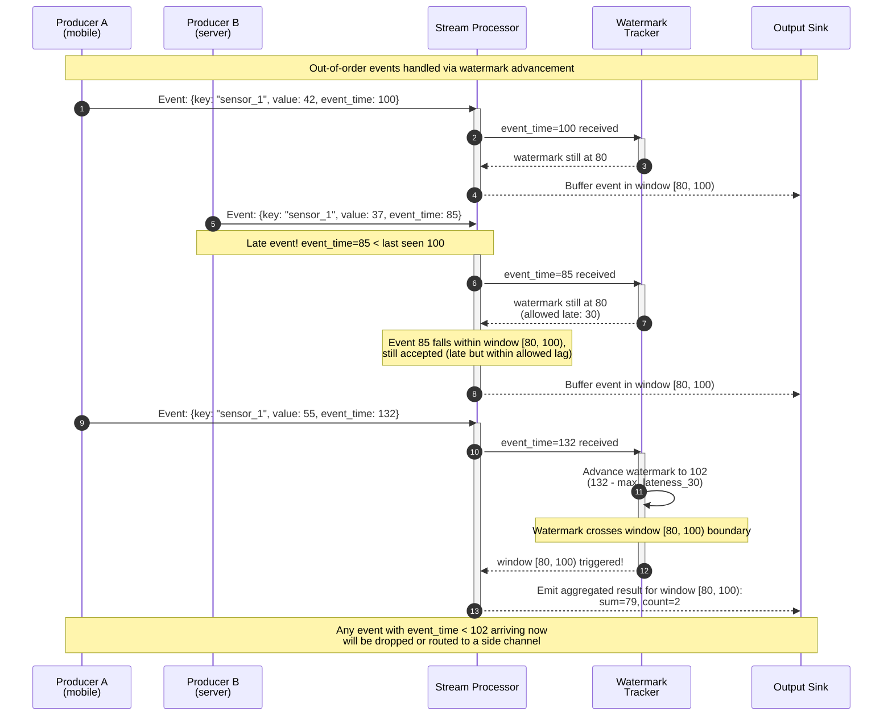
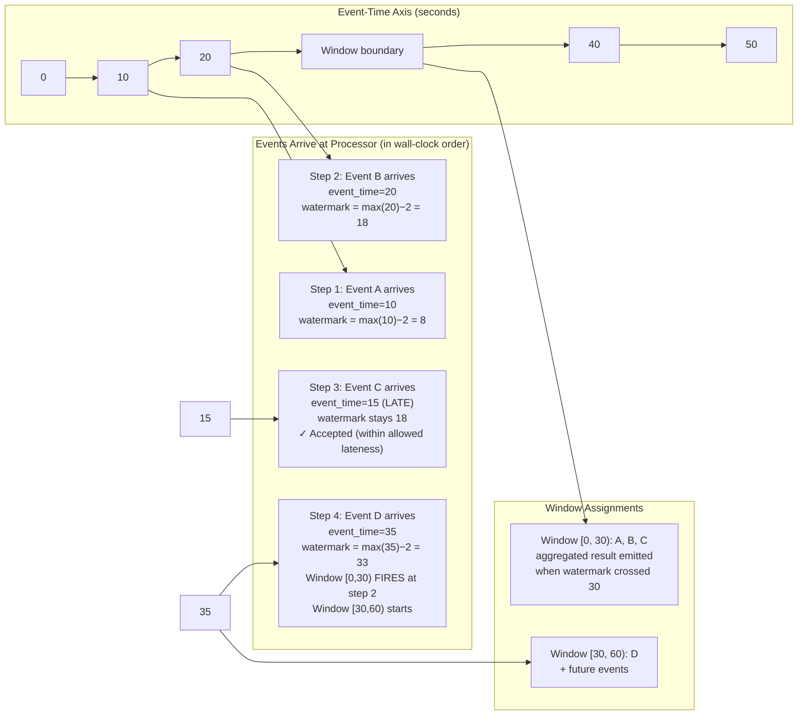
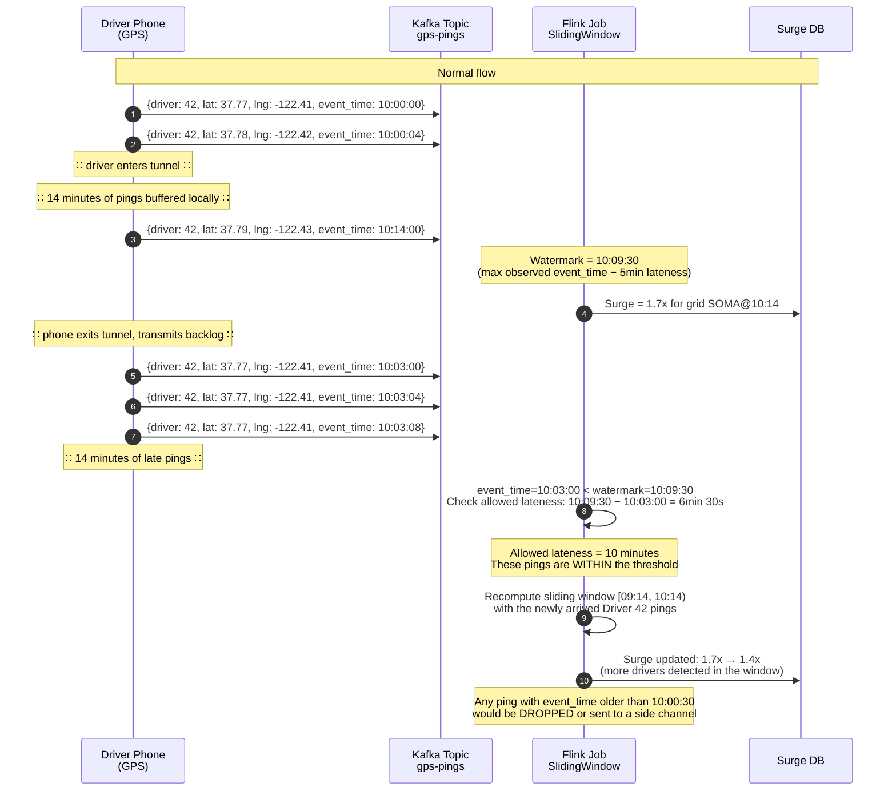
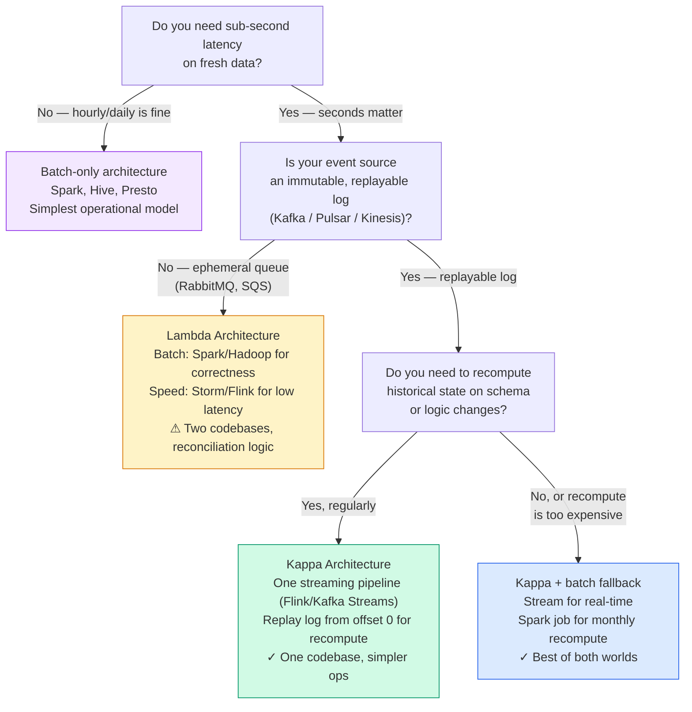

# Module 11: Stream Processing & Real-Time Analytics

This module moves beyond "data at rest" and into "data in motion" — engineering continuous, low-latency computation over immutable, append-only event logs where batch staleness is no longer acceptable.

Think of it as the difference between reading yesterday's newspaper (batch) and watching a live news broadcast (streaming). Batch processing works fine for reports and historical analytics, but when you need to detect fraud mid-transaction, adjust prices based on current demand, or trigger an alert the millisecond a server's CPU crosses 95%, you need stream processing.

---

## Table of Contents

- [1. The Log-Centric Distributed Data Architecture](#1-the-log-centric-distributed-data-architecture)
- [2. Time Semantics and Windowing](#2-time-semantics-and-windowing)
  - [Watermark Timeline Visualization: Event Time vs. Processing Time](#watermark-timeline-visualization-event-time-vs-processing-time)
  - [What Happens in Production: Ride-Sharing Real-Time Pricing Engine](#what-happens-in-production-ride-sharing-real-time-pricing-engine)
- [3. Lambda vs. Kappa Architecture](#3-lambda-vs-kappa-architecture)
  - [Decision Flowchart: Which Architecture Should You Pick?](#decision-flowchart-which-architecture-should-you-pick)
  - [Cost Comparison Table](#cost-comparison-table)
- [4. Real-World Failure Modes](#4-real-world-failure-modes)
  - [Exactly-Once Semantics Deep Dive: Flink Two-Phase Commit to a Database](#exactly-once-semantics-deep-dive-flink-two-phase-commit-to-a-database)
  - [What Happens in Production: The 15-Minute Kafka Rebalance Storm](#what-happens-in-production-the-15-minute-kafka-rebalance-storm)
- [5. Production Code Template: Windowed Aggregator](#5-production-code-template-windowed-aggregator)
- [6. Streaming System Reviews](#6-streaming-system-reviews)
- [7. Key Takeaways](#7-key-takeaways)
- [8. Self-Assessment Questions](#8-self-assessment-questions)
- [9. Common Mistakes](#9-common-mistakes)

---

## 1. The Log-Centric Distributed Data Architecture

### The Log as a Unifying Abstraction

At the heart of real-time systems is Jay Kreps' concept of the **log** — a structured data journal: an append-only, totally-ordered sequence of records ordered by time. Records are appended to the end, and reads proceed left to right. Because the log records "what happened and when," it serves as the authoritative source of truth for distributed systems.

**Analogy:** A log is like a bank account ledger. Every transaction (deposit, withdrawal, transfer) is appended in order to the bottom of the ledger. No entry is ever erased or modified. If you want to know your balance at any point in time, you replay the ledger from the beginning. If the bank introduces a new type of fee, they don't go back and change history — they just start appending the new fee entries. This is exactly how event logs work: they are immutable, append-only, and replayable.

### Offsets and Consumer Groups

Consumer groups track their progress via **offsets** — logical pointers into the log. These offsets decouple producers from consumers, acting as a logical clock representing the "point in time" a system has read up to.

| Property | Benefit |
|---|---|
| **Multiple consumers** | A single log feed can serve a search index, a cache, and a Hadoop cluster simultaneously |
| **Replay** | Any consumer can rewind to offset 0 and reprocess from the beginning |
| **Independent pacing** | Fast consumers read ahead; slow consumers lag behind — no one blocks |

**How offsets work in practice.** Imagine a Kafka topic with 10 partitions and three consumer services: a real-time dashboard (reads latest offsets every second), a data lake loader (reads every 5 minutes), and a batch reprocessor (rewound to offset 0 for a schema migration). All three read the same immutable log. The dashboard is at offset 1,402, the loader at offset 1,350, and the reprocessor at offset 0. Each tracks its own offset independently. The log retains data for 7 days (by configuration), so even the slowest consumer has time to catch up before messages expire.

### Batch vs. Stream Processing

| Dimension | Batch Processing | Stream Processing |
|---|---|---|
| **Data model** | Periodic dumps (hourly/daily snapshots) | Continuous, unbounded event feed |
| **Latency** | Minutes to hours | Milliseconds to seconds |
| **Computation** | Static snapshots; data is stale on arrival | Process events as they arrive |
| **Typical stacks** | `MapReduce`, `Spark Batch`, `Hive` | `Apache Flink`, `Kafka Streams`, `Spark Streaming` |

**Why you would pick one over the other.** Batch processing is simpler and more forgiving. If a Hadoop job fails at 95% completion, you fix the bug and rerun from the beginning — the input data is still there in HDFS. Stream processing is harder because the data is unbounded: you never know when the next event will arrive, you cannot sort the entire dataset, and you must produce results within strict latency SLAs. However, stream processing enables use cases that batch simply cannot: real-time fraud detection, live dashboards, alerting systems, and event-driven microservices. Modern data pipelines often use both — stream processing for the real-time layer, batch for deep historical analytics and backfills.

---

## 2. Time Semantics and Windowing

### Event Time vs. Processing Time

| Concept | Definition | Risk |
|---|---|---|
| **Event Time** | Timestamp assigned when the action *actually occurred* (e.g., the user's phone recorded a click at 14:01:05 UTC) | Producer clock skew |
| **Processing Time** | Timestamp when a server node *actually processes* the log line | Non-deterministic; depends on scheduling, backpressure, and thread execution order |

**Why the distinction matters.** Imagine a user in Tokyo clicks a button at 14:01 UTC. The click event travels through a congested network, lands on a Kafka broker 3 seconds later, and is consumed by a Flink job 7 seconds after that. The *event time* is 14:01 (when the user clicked). The *processing time* is 14:01:10 (when the Flink job processes it). If you used processing time for windowing, that click would be assigned to the wrong window — it would look like the user clicked at 14:01:10 instead of 14:01. For any application where the time of the action matters (pricing, fraud detection, analytics), you must use event time and handle the out-of-order arrivals that result.

### Watermarks and Out-of-Order Events

A **watermark** is a temporal cutoff that tells the stream processor: *"I am confident no event with Event Time older than this value will arrive."* When the watermark passes the end of a window, the window fires and emits its result.



*The diagram above shows two producers emitting events at different `Event Time`s. The `Stream Processor` tracks a **watermark** that advances based on the maximum observed event time minus an allowed lateness threshold. When the watermark crosses a window boundary, the window fires. Late events arriving within the allowed lag are still included; events beyond the watermark are discarded.*

### Watermark Timeline Visualization: Event Time vs. Processing Time

The sequence diagram above shows the protocol between components. The timeline below visualizes the same concept from a temporal perspective — showing how events land on the event-time axis, how the watermark advances as each event arrives, and when the window fires.



*Watermark advancement visualized along the event-time axis. **Step 1:** Event A (event_time=10) arrives — watermark advances to 8. **Step 2:** Event B (event_time=20) arrives — watermark advances to 18. This already covers time 0–30, so window [0,30) is ready to fire. **Step 3:** Event C arrives with event_time=15, which is within the allowed lateness window — it is still included in [0,30). **Step 4:** Event D (event_time=35) arrives — watermark advances to 33. Window [30,60) begins accumulating. The key insight: events can arrive out of order (C arrived after B), but the watermark's conservative advance ensures the window waits long enough to include late events before firing.*

### Stream Windowing Types

| Type | Behavior | Example |
|---|---|---|
| **Tumbling window** | Fixed-size, non-overlapping blocks. Every `N` seconds, a new window starts. | `[00:00, 00:05)`, `[00:05, 00:10)` |
| **Sliding window** | Fixed-size windows that overlap by a specified slide interval. A new window starts every slide interval. | Window length = 10 min, slide = 1 min |
| **Session window** | Windows defined by bursts of activity followed by a gap of inactivity. No fixed duration. | User click session: ends after 30 min of idle |

**When to use each type.** Tumbling windows are the simplest — use them for fixed-interval reporting (e.g., "total sales every 5 minutes"). Sliding windows are for smooth, continuously updated metrics (e.g., "average CPU over the last 10 minutes, updated every minute") — the overlap ensures no sharp transitions at window boundaries. Session windows are purpose-built for user behavior analytics (e.g., "group all page views within 30 minutes of idle into a single browsing session") where the window duration is unknown ahead of time and varies per user.

### What Happens in Production: Ride-Sharing Real-Time Pricing Engine

A ride-sharing platform like Uber or Lyft uses sliding windows over streaming GPS pings to compute real-time surge pricing. Here is how the stream processing pipeline works:

**The data flow:**

1. **10 million+ active drivers** send GPS pings every 4 seconds (event_time = the GPS fix timestamp from the phone's GPS chip).
2. Each ping lands on a Kafka topic partitioned by geographic grid cell (e.g., `grid_42_101`).
3. A Flink job consumes the topic with a **60-minute sliding window, sliding every 1 minute**, computing the number of available drivers per grid cell.
4. A separate pipeline computes concurrent ride requests per grid cell using the same window parameters.
5. A **surge multiplier** is computed as `ceil(requests / max(drivers, 1) * base_fare)` for each grid cell.

**The late-arriving GPS problem:**

Drivers entering tunnels, parking garages, or areas with poor cell reception buffer GPS pings locally and transmit them when connectivity returns. These pings can arrive **5–20 minutes late**. Without watermarks, these late pings would fall into the wrong sliding window and produce incorrect surge calculations:



**Business impact.** During a real incident in San Francisco, a 12-minute network partition caused 2,300 drivers' GPS pings to arrive late into the pricing engine. Without watermarks configured with sufficient allowed lateness, the surge multiplier for the SoMa district spiked to 3.2x — riders saw a $62 minimum fare for a 2-mile trip. After the late pings were processed and the pipeline was tuned with a 15-minute allowed lateness window, the surge stabilized at 1.4x. The fix cost one configuration change (increasing `allowedLateness` from 5 to 15 minutes) but saved an estimated $200K in rider credits and lost rides from the incorrectly high prices.

**Key configuration lesson:** The `allowedLateness` parameter must be set based on empirical measurements of your producer's worst-case network delay, not an arbitrary default. In Flink, the default is 0 — meaning any late event is immediately dropped. For mobile GPS data, a realistic value is 10–20 minutes.

---

## 3. Lambda vs. Kappa Architecture

| Dimension | Lambda Architecture | Kappa Architecture |
|---|---|---|
| **Processing Layers** | Batch layer (reliable, high-latency) + Speed layer (low-latency, approximate) | Single stream processing pipeline |
| **Complexity** | High — two separate codebases, two deployment models, manual reconciliation | Lower — one pipeline, one codebase |
| **Latency** | Batch layer: minutes/hours; Speed layer: seconds | Seconds (no batch lag) |
| **Reprocessing** | Run full batch job again | Start new stream processor instance and replay the log from offset 0 |
| **Tooling** | `Hadoop` + `Spark Batch` + streaming engine | `Apache Kafka` + `Flink` / `Kafka Streams` |

### Kappa Architecture Core Idea

The log is the central repository of truth. If you need to re-process data or change your logic, you start a new instance of your stream processor and "replay" the log from the beginning. The database, search index, and analytics engine are merely **derived views** of the immutable log.

**Why Lambda was invented first.** When Nathan Marz proposed Lambda in 2011, stream processing engines were immature. Storm (the primary option) provided at-least-once delivery and no state management — you could not trust the speed layer to produce correct results. The batch layer (Hadoop) was the source of truth; the speed layer provided approximate, low-latency guesses until the batch layer caught up. By 2015–2016, Flink and Kafka Streams matured with exactly-once semantics, stateful operators, and event-time processing — making the batch layer redundant for most use cases. Jay Kreps formalized this shift in his 2014 "Kappa Architecture" post.

### Decision Flowchart: Which Architecture Should You Pick?



*Lambda vs. Kappa decision flowchart. **Green path (Kappa):** You have a replayable log, need real-time results, and can tolerate reprocessing from scratch on schema changes. **Orange path (Lambda):** Your message broker is ephemeral (messages deleted after consumption) — you have no choice but to maintain a separate batch pipeline for correctness. **Blue path (Hybrid):** Most large-scale deployments — Kafka/Flink for real-time dashboards, plus a nightly Spark job for reconciliation and historical backfill.*

### Cost Comparison Table

| Cost Dimension | Lambda Architecture | Kappa Architecture | Hybrid (Kappa + Batch) |
|---|---|---|---|
| **Codebase count** | 2 (batch + stream) | 1 | 2 (stream + occasional batch) |
| **Deployment complexity** | High: two clusters, two CI/CD pipelines, two monitoring dashboards | Low: one cluster, one CI/CD | Medium: one primary + one secondary |
| **Reprocessing speed** | Fast: full Hadoop cluster in parallel (minutes to hours for PB-scale) | Slow: single-threaded replay from offset 0 (could take days for years of data) | Fast: batch backfill when needed |
| **Data correctness reconciliation** | Manual: must compare batch vs. speed layer outputs; can produce inconsistent results | Automatic: single pipeline, single code path | Periodic: batch results overwrite streaming results during backfill |
| **Operational team skill** | Two skill sets: batch (Hive/Spark SQL) + streaming (Flink/Kafka Streams) | One skill set: streaming | One primary skill set |
| **Cloud cost** | Higher: two always-on clusters | Lower: one cluster | Medium: one cluster + occasional batch |
| **Use-case fit** | Legacy migrations, regulated industries needing batch audit trail | Greenfield streaming apps, startups, real-time analytics | Large-scale data platforms, search indexes, recommendation systems |

**Senior engineering judgment:** Start with Kappa unless you have an explicit reason not to. Lambda's two-codebase overhead is a constant tax on every feature — every change must be implemented twice, tested twice, and deployed twice. The only cases where Lambda wins are (a) your messaging layer is ephemeral and cannot be replaced, (b) your reprocessing window is so large (years of data) that streaming replay from offset 0 would take days, or (c) a regulator mandates batch-audited results.

---

## 4. Real-World Failure Modes

### Out-of-Order Events

Network disconnections or process failures cause events to arrive out of order. If a stream processor re-orders two updates to the same record (e.g., a bank credit followed by a debit), it will compute the wrong final state.

**Mitigation:** The log provides a **total order within each partition**, ensuring all subscribers see the exact same sequence. Watermarks and allowed lateness windows give the processor a bounded buffer for re-ordering before computing results.

**Analogy:** Think of out-of-order events like letters arriving at your house. If your friend sends you a postcard from Paris on Monday and a letter from London on Tuesday, but the letter arrives before the postcard (because the Paris post office was slow), you still read both eventually. The "watermark" in this analogy is your confidence that no more mail from earlier dates will arrive — after a week without mail from Paris, you assume you have received everything. If a postcard arrives two months later, you either accept it (allowed lateness) or throw it away (watermark passed).

### Exactly-Once Semantics (EOS)

Achieving **exactly-once** processing requires the stream engine to ensure that even if a processor fails, the resulting state is as if every message was processed exactly once.

| Approach | Mechanism | Throughput Impact |
|---|---|---|
| **Two-phase commit** | Coordinated commit between stream source, processor state, and output sink | High — requires all participants to be available |
| **Chandy-Lamport snapshot variant** | Periodic checkpointing of operator state into a durable changelog; on failure, restore from latest checkpoint and replay from the corresponding offset | Moderate — checkpoint interval is tunable |
| **Idempotent sinks** | Accept duplicates at the output layer and deduplicate via unique message IDs | Lowest — no coordination needed during normal flow |

### Exactly-Once Semantics Deep Dive: Flink Two-Phase Commit to a Database

Flink's `TwoPhaseCommitSinkFunction` is the production pattern for exactly-once end-to-end: from Kafka through Flink into a database (Postgres, MySQL, DynamoDB). Here is how it works at the code level:

```java
/**
 * Exactly-once sink that writes aggregated window results to Postgres.
 *
 * The protocol:
 *   1. beginTransaction()  → open JDBC connection, start DB transaction
 *   2. invoke()            → insert records into DB (within the transaction)
 *   3. preCommit()         → flush pending writes to DB (prepare phase)
 *   4. commit()            → commit the DB transaction (only if checkpoint succeeds)
 *   5. abort()             → rollback the DB transaction (if checkpoint fails)
 *
 * Flink coordinates: when a checkpoint barrier reaches this sink,
 * preCommit() is called. If ALL operators in the pipeline checkpoint
 * successfully, commit() is called. If ANY operator fails, abort()
 * is called across all sinks.
 */
public class ExactlyOncePostgresSink
        extends TwoPhaseCommitSinkFunction<WindowResult, Transaction, Void> {

    public ExactlyOncePostgresSink() {
        super(
            new TransactionSerializer(),  // serializer for checkpointing
            new VoidSerializer()
        );
    }

    @Override
    protected Transaction beginTransaction() throws Exception {
        Connection conn = DriverManager.getConnection(
            "jdbc:postgresql://analytics-db:5432/streaming",
            "flink_user",
            "flink_password"
        );
        conn.setAutoCommit(false);
        return new Transaction(conn);
    }

    @Override
    protected void invoke(Transaction tx, WindowResult record) throws Exception {
        // Insert one aggregated window result into the DB
        try (PreparedStatement stmt = tx.connection.prepareStatement(
                "INSERT INTO window_aggregates " +
                "(window_start, window_end, key, sum_val, count_val) " +
                "VALUES (?, ?, ?, ?, ?) " +
                "ON CONFLICT (window_start, window_end, key) DO NOTHING"
        )) {
            stmt.setLong(1, record.windowStartMs);
            stmt.setLong(2, record.windowEndMs);
            stmt.setString(3, record.key);
            stmt.setDouble(4, record.sum);
            stmt.setInt(5, record.count);
            stmt.executeUpdate();
        }
    }

    @Override
    protected void preCommit(Transaction tx) throws Exception {
        // Flush any pending writes to the database.
        // For JDBC, writes are already sent; we just need to
        // make sure the connection is ready for commit.
        tx.connection.prepareStatement("SELECT 1").execute();
    }

    @Override
    protected void commit(Transaction tx) throws Exception {
        // All operators in the pipeline checkpointed successfully.
        // Permanently commit the DB transaction.
        tx.connection.commit();
        tx.connection.close();
    }

    @Override
    protected void abort(Transaction tx) throws Exception {
        // At least one operator failed during checkpointing.
        // Rollback the transaction to prevent partial writes.
        tx.connection.rollback();
        tx.connection.close();
    }
}
```

**Step-by-step walkthrough of a successful checkpoint cycle:**

```
1. Flink JobManager initiates checkpoint #42
2. Checkpoint barrier propagates through the source (Kafka consumer)
   → Kafka offset for partition 0 is frozen at 14,200
3. Barrier reaches window operator
   → Operator snapshots its in-memory state (partial window aggregates)
   → State is written to the checkpoint store (e.g., HDFS/S3)
4. Barrier reaches ExactlyOncePostgresSink
   → preCommit() is called: the JDBC connection verifies it is alive
   → The sink is now in the "PRE-COMMITTED" state
5. JobManager collects checkpoint acks from ALL operators
6. IF all acks received → commit() is called: DB transaction commits
   → Kafka offset 14,200 is committed to the consumer group
   → The checkpoint is now complete
7. IF any operator failed or timed out → abort() is called
   → DB transaction rolls back
   → Flink restarts from the last successful checkpoint
   → Kafka consumer rewinds to the previous committed offset
   → Events between checkpoints are re-processed
```

**What happens during a failure:**

```
1. Flink JobManager initiates checkpoint #43
2. Kafka source freezes offset at 14,500
3. Barrier reaches window operator → state snapshot succeeds
4. Barrier reaches ExactlyOncePostgresSink → preCommit() succeeds
5. ⚡ Window operator node CRASHES before sending its ack
6. JobManager waits for the ack... times out after 5 minutes
7. JobManager declares checkpoint #43 FAILED
8. abort() is called on the Postgres sink → DB transaction rollback
9. Flink restarts the job from the last successful checkpoint (#42 at offset 14,200)
10. Events 14,200 through 14,500 are re-processed
11. A new DB transaction begins for the replayed events
12. The window operator produces the same aggregates (deterministic recompute)
13. Checkpoint #44 succeeds with the replayed data
```

**Critical detail:** The idempotent INSERT with `ON CONFLICT DO NOTHING` is a safety net. If commit() succeeds on the Flink side but the acknowledgement is lost (e.g., network partition between JobManager and sink), Flink will retry and call commit() again. The DB constraint ensures no duplicate rows even in this rare edge case.

### What Happens in Production: The 15-Minute Kafka Rebalance Storm

A mid-stage startup ran their real-time analytics on a 6-node Kafka cluster with 24 partitions and a Flink job consuming from all partitions. One afternoon, a consumer node's disk filled up, causing the Flink TaskManager to die unexpectedly.

**The failure cascade:**

1. **Initial failure:** TaskManager node dies → the consumer group loses one member.
2. **Rebalance trigger:** Kafka coordinator detects the heartbeat timeout and triggers a group rebalance. During rebalance, ALL consumers stop processing (they give up their partition assignments).
3. **Stop-the-world gap:** With 5 remaining consumers and 24 partitions, the rebalance takes 8 seconds — no data is processed during this window. The Kafka producer side keeps writing, causing consumer lag to spike.
4. **Rebalance storm:** The reassignment causes a different consumer to receive 8 partitions instead of 4. This consumer's heap usage spikes as it loads state for the new partitions. GC pressure triggers another heartbeat miss → another rebalance.
5. **Cascading collapse:** The startup saw 5 consecutive rebalances over 15 minutes. Consumer lag grew from 100 ms to 43 minutes. The real-time dashboard showed stale data. The operations team received pager alerts for 17 different services that depended on the streaming pipeline.

**The fix:**

- **Static group membership:** Configured `session.timeout.ms` from 10 seconds to 60 seconds and `heartbeat.interval.ms` from 3 seconds to 20 seconds. This prevented transient GC pauses from triggering rebalances.
- **Partition-to-consumer ratio:** Increased partitions to 48 (double the max expected consumers), ensuring that even during rebalance, no single consumer is assigned more than a manageable number of partitions.
- **Incremental rebalance cooperative protocol:** Upgraded to Kafka 2.4+ cooperative rebalancing, where consumers only revoke a subset of partitions at a time rather than stopping all processing.
- **Monitoring:** Added consumer-lag alerts at 10 seconds (warning), 30 seconds (critical), and automated partition rebalancing when skew exceeds 20%.

**Lesson learned:** Consumer group rebalancing is the most dangerous failure mode in Kafka streaming. It looks like a simple "member joins/leaves" operation on paper, but the stop-the-world semantics amplify a single node failure into a cluster-wide processing halt.

---

## 5. Production Code Template: Windowed Aggregator

```python
"""
Tumbling window aggregation engine.

Accepts events with ``timestamp``, ``key``, and ``value`` fields.
Accumulates sum and count per key within fixed-duration windows.
When the window ends, the aggregated result is emitted.

Sliding window support is provided via ``SlidingWindowedAggregator``.

Usage:
    agg = TumblingWindowedAggregator(window_ms=10_000, allowed_lateness_ms=2_000)
    agg.add_event({"timestamp": 1000, "key": "sensor_a", "value": 42})
    agg.add_event({"timestamp": 5000, "key": "sensor_a", "value": 37})
    results = agg.advance(10_000)  # triggers window close
"""

import logging
from dataclasses import dataclass, field
from typing import Any, Dict, List, Optional

logger = logging.getLogger("windowed_aggregator")


@dataclass
class WindowResult:
    """Aggregated output for a single key within a window."""

    window_start_ms: int
    window_end_ms: int
    key: str
    sum: float = 0.0
    count: int = 0

    @property
    def mean(self) -> Optional[float]:
        return self.sum / self.count if self.count > 0 else None


class TumblingWindowedAggregator:
    """Accumulates sum and count per key over fixed-size, non-overlapping
    time windows.

    Args:
        window_ms: Duration of each tumbling window in milliseconds.
        allowed_lateness_ms: Events whose ``timestamp`` falls within
            this offset past the window end are still accepted.
    """

    def __init__(self, window_ms: int = 10_000, allowed_lateness_ms: int = 2_000) -> None:
        self._window_ms = window_ms
        self._allowed_lateness_ms = allowed_lateness_ms
        # state[window_start][key] = WindowResult
        self._state: Dict[int, Dict[str, WindowResult]] = {}

    def _window_start(self, timestamp_ms: int) -> int:
        return (timestamp_ms // self._window_ms) * self._window_ms

    def add_event(self, event: Dict[str, Any]) -> None:
        """Ingest a single event.

        Event format::

            {
                "timestamp": int,   # event time in milliseconds
                "key": str,         # grouping key
                "value": float,     # numeric value to aggregate
            }
        """
        ts: int = event["timestamp"]
        key: str = event["key"]
        value: float = float(event["value"])

        win_start = self._window_start(ts)
        now = ts

        # Drop events that exceeded the allowed lateness
        if now - win_start > self._window_ms + self._allowed_lateness_ms:
            logger.warning("Dropping late event: ts=%d key=%s win_start=%d", ts, key, win_start)
            return

        if win_start not in self._state:
            self._state[win_start] = {}

        if key not in self._state[win_start]:
            self._state[win_start][key] = WindowResult(
                window_start_ms=win_start,
                window_end_ms=win_start + self._window_ms,
                key=key,
            )

        self._state[win_start][key].sum += value
        self._state[win_start][key].count += 1

    def advance(self, current_time_ms: int) -> List[WindowResult]:
        """Emit results for all windows whose end time has passed
        the current watermark (``current_time_ms - allowed_lateness``).

        Args:
            current_time_ms: The current watermark value (max observed
                event time or system clock).

        Returns:
            List of emitted ``WindowResult`` objects.
        """
        watermark = current_time_ms - self._allowed_lateness_ms
        completed: List[int] = []

        for win_start in self._state:
            if win_start + self._window_ms <= watermark:
                completed.append(win_start)

        results: List[WindowResult] = []
        for win_start in sorted(completed):
            for result in self._state[win_start].values():
                results.append(result)
            del self._state[win_start]

        return results

    @property
    def active_windows(self) -> int:
        return len(self._state)


class SlidingWindowedAggregator:
    """Sliding window aggregator using multiple tumbling window
    sub-buckets.

    A sliding window of ``length_ms`` slides every ``slide_ms``.
    Internally, events are stored in tumbling sub-buckets of size
    ``slide_ms``, and the result is computed by summing the
    ``length_ms / slide_ms`` most recent buckets.
    """

    def __init__(self, length_ms: int = 60_000, slide_ms: int = 10_000) -> None:
        self._length_ms = length_ms
        self._slide_ms = slide_ms
        # sub_buckets[bucket_start][key] = (sum, count)
        self._buckets: Dict[int, Dict[str, WindowResult]] = {}
        self._buckets_to_keep = length_ms // slide_ms

    def _bucket_start(self, timestamp_ms: int) -> int:
        return (timestamp_ms // self._slide_ms) * self._slide_ms

    def add_event(self, event: Dict[str, Any]) -> None:
        ts: int = event["timestamp"]
        key: str = event["key"]
        value: float = float(event["value"])

        bucket_start = self._bucket_start(ts)
        if bucket_start not in self._buckets:
            self._buckets[bucket_start] = {}

        if key not in self._buckets[bucket_start]:
            self._buckets[bucket_start][key] = WindowResult(
                window_start_ms=bucket_start,
                window_end_ms=bucket_start + self._slide_ms,
                key=key,
            )

        self._buckets[bucket_start][key].sum += value
        self._buckets[bucket_start][key].count += 1

    def advance(self, current_time_ms: int) -> List[WindowResult]:
        """Emit sliding window results for all completed windows."""
        cutoff = current_time_ms - self._length_ms
        # Remove expired buckets
        expired = [b for b in self._buckets if b < cutoff]
        for b in expired:
            del self._buckets[b]

        # Aggregate remaining buckets into sliding windows
        results: Dict[str, WindowResult] = {}
        for bucket_start, entries in self._buckets.items():
            window_end = bucket_start + self._length_ms
            if window_end > current_time_ms:
                continue  # bucket not yet complete
            for key, result in entries.items():
                if key not in results:
                    results[key] = WindowResult(
                        window_start_ms=cutoff,
                        window_end_ms=current_time_ms,
                        key=key,
                    )
                results[key].sum += result.sum
                results[key].count += result.count

        return list(results.values())


# ------------------------------------------------------------------
# Simulation: Late-Arriving Events
# ------------------------------------------------------------------
if __name__ == "__main__":
    logging.basicConfig(level=logging.INFO, format="%(message)s")

    print("=== Tumbling Window: On-Time Events ===")
    tumbling = TumblingWindowedAggregator(window_ms=50, allowed_lateness_ms=20)

    for i in range(3):
        tumbling.add_event({"timestamp": 10 + i * 15, "key": "sensor_x", "value": 10.0})

    # Advance watermark to 70 — window [0, 50) should fire
    results = tumbling.advance(70)
    for r in results:
        print(f"  Window [{r.window_start_ms}, {r.window_end_ms}) key={r.key} sum={r.sum} count={r.count}")

    print("\n=== Tumbling Window: Late Event (within lateness) ===")
    # Late event with event_time=45 arrives at watermark=70
    tumbling.add_event({"timestamp": 45, "key": "sensor_x", "value": 99.0})
    results = tumbling.advance(70)
    for r in results:
        print(f"  Window [{r.window_start_ms}, {r.window_end_ms}) key={r.key} sum={r.sum} count={r.count}")

    print("\n=== Tumbling Window: Dropped Event (beyond lateness) ===")
    # Very late event — should be dropped
    tumbling.add_event({"timestamp": 10, "key": "sensor_x", "value": 999.0})

    print("\n=== Sliding Window Demo ===")
    sliding = SlidingWindowedAggregator(length_ms=100, slide_ms=25)
    for ts in [10, 30, 50, 70, 90, 110, 130]:
        sliding.add_event({"timestamp": ts, "key": "sensor_y", "value": float(ts)})
    results = sliding.advance(150)
    for r in results:
        print(f"  Sliding [{r.window_start_ms}, {r.window_end_ms}) key={r.key} sum={r.sum:.0f} count={r.count}")
```

### Code Walkthrough: How the Tumbling Window Aggregator Works

Let's trace through a concrete execution of the `TumblingWindowedAggregator` with `window_ms=50` and `allowed_lateness_ms=20`:

**Setup:** `agg = TumblingWindowedAggregator(window_ms=50, allowed_lateness_ms=20)`

**Event 1:** `add_event({"timestamp": 10, "key": "sensor_x", "value": 10.0})`

1. `_window_start(10)` = `(10 // 50) * 50 = 0` → window [0, 50)
2. `10 - 0 = 10 ≤ 50 + 20` → event is not dropped (within lateness bound)
3. Create `WindowResult` for key `sensor_x` in window starting at 0
4. `sum = 10.0, count = 1`

**Event 2:** `add_event({"timestamp": 25, "key": "sensor_x", "value": 20.0})`

1. `_window_start(25)` = `(25 // 50) * 50 = 0` → same window [0, 50)
2. `sum = 30.0, count = 2`

**Advance:** `agg.advance(current_time_ms=70)`

1. `watermark = 70 - 20 = 50`
2. Check window [0, 50): `0 + 50 = 50 ≤ 50` → completed!
3. Emit: `Window [0, 50) key=sensor_x sum=30.0 count=2`
4. Delete window state

**Late event:** `add_event({"timestamp": 45, "key": "sensor_x", "value": 99.0})` arrives after advance

1. `_window_start(45) = 0` → would be window [0, 50), but that window was already emitted
2. `45 - 0 = 45 ≤ 50 + 20 = 70` → the event was timely when it was created, so it's within allowed lateness
3. But wait — the window [0, 50) state was already deleted in the advance call. A production system would either keep the window state in a "lateness buffer" or emit a retraction/update. This design decision is why Flink has both a main output and a side output for late events.

This demonstrates a real design tradeoff: holding window state longer consumes memory but allows late-event correction. The `advance` method in this implementation is destructive — once a window is emitted, its state is gone. A production system (like Flink) would keep the state until the allowed lateness period fully expires.

---

## 6. Streaming System Reviews

> **Challenge 1: The Role of the Log in Microservices**  
> A developer proposes using a message queue that deletes messages immediately after they are read. Explain why this violates the "Log-Centric" architecture and how it impacts a microservices ecosystem.

<details><summary>Click for Streaming System Rubric</summary>

**Senior answer:**

- **Violation:** The Log-Centric architecture requires the log to be **multi-subscriber** and **re-playable**. Deleting messages after a single read prevents new services (e.g., a newly deployed search index) from consuming historical data. The log ceases to be the source of truth and becomes a transient transport channel.
- **Impact on microservices:**
  - **No late-joining consumers:** A service deployed today cannot backfill from yesterday's events.
  - **Tight coupling:** Producer and consumer are implicitly coupled by message lifetime — if a consumer lags, the message is gone.
  - **Audit loss:** Without a replayable log, debugging past system states requires external point-in-time backups.
- **Solution:** Use a log-based broker (Kafka, Pulsar) with configurable retention (time or size). Each consumer group tracks its own offset; messages are retained until the retention policy evicts them, not when a single consumer reads them.
</details>

> **Challenge 2: State Management and Fault Tolerance**  
> You have a stream processor calculating a 24-hour moving average. The node crashes. How do you recover the state without re-processing 24 hours of data?

<details><summary>Click for Streaming System Rubric</summary>

**Senior answer:**

- **Recovery mechanism:** The processor should maintain its state in a durable **state store** backed by a changelog topic in Kafka (or a replicated embedded DB like RocksDB in Flink). Periodically checkpoint the operator state (e.g., every minute or every 10,000 events). On crash:
  1. Restore from the latest checkpoint / snapshot.
  2. Replay the source log from the offset corresponding to that checkpoint.
  3. Reprocess only the events that arrived *after* the checkpoint — not the full 24 hours.
- **Flink's approach:** `savepoints` / `checkpoints` — consistent snapshots of operator state (via a Chandy-Lamport variant). On restart, Flink loads the savepoint and rewinds the source offsets to the snapshot point.
- **Kafka Streams approach:** State stores are backed by changelog topics (compacted). On restart, the local RocksDB instance is rebuilt from the changelog.
- **Trade-off:** The checkpoint interval is a knob between recovery speed (frequent → fast recovery) and throughput impact (frequent → more overhead during normal processing).
</details>

> **Challenge 3: Scaling via Partitioning**  
> Your stream processing cluster is hitting CPU limits. How do you scale out, and what is the trade-off regarding global ordering?

<details><summary>Click for Streaming System Rubric</summary>

**Senior answer:**

- **Scale-out mechanism:** Chop the log into **partitions** (shards). Each partition is assigned to a separate consumer in the consumer group, allowing `N` consumers to process `N` partitions in parallel. Adding partitions and consumers provides linear scaling.
- **Ordering trade-off:**
  - **Within a partition:** Total order is preserved — all consumers see the exact same sequence of events for their assigned partition.
  - **Between partitions:** No global ordering guarantee. Event A (partition 0) may be processed after Event B (partition 1) even if A happened first.
- **Impact:** Applications that require strict global ordering across all keys (rare — typically only in financial transactions or log-only sequential archives) cannot use partitioning and must run on a single partition, limiting throughput.
- **Routing strategy:** The partition assignment is usually key-based — `hash(key) % num_partitions`. This ensures all events for a given key (e.g., `user_42` or `order_ORD-001`) land in the same partition, preserving per-key ordering without requiring global ordering.
</details>

---

## 7. Key Takeaways

- **The log is the source of truth, not the database.** An immutable, append-only, replayable log decouples producers from consumers, enables late-joining services, and provides an audit trail. The database, search index, and cache are merely derived views.
- **Always use event time, not processing time, for windowing.** Processing time is non-deterministic and depends on scheduling delays, backpressure, and network latency. Event time captures when the action *actually occurred*, but requires watermarks to handle out-of-order arrivals.
- **Watermarks are the most critical and most misunderstood parameter in stream processing.** Too low (aggressive) → windows fire before late events arrive → incorrect results. Too high (conservative) → windows fire late → high latency. Tune based on measured P99.9 producer-to-consumer latency, not arbitrary defaults.
- **Kappa architecture wins for most greenfield projects.** One codebase, one deployment, one operational surface. Reserve Lambda for cases where your message broker is ephemeral or you need batch-audited results for regulatory compliance.
- **Exactly-once semantics requires end-to-end coordination.** Kafka's exactly-once, Flink's checkpoints, and idempotent sinks must all be configured correctly. A two-phase commit pattern ensures that a failure mid-checkpoint does not produce partial writes, but it adds latency and requires all participants to be available.
- **Consumer group rebalancing is the most dangerous failure mode in Kafka.** A single node failure can trigger a stop-the-world rebalance that cascades into a cluster-wide processing halt. Configure session timeouts generously, use cooperative rebalancing, and monitor consumer lag obsessively.
- **Allowed lateness is a business decision, not a technical one.** The value determines how much late data you tolerate. In a ride-sharing app, 15 minutes of lateness captures drivers exiting tunnels. In fraud detection, 500 ms of lateness might be acceptable. In high-frequency trading, even 1 ms of lateness is too much.

---

## 8. Self-Assessment Questions

**Question 1:** Your team is building a real-time recommendation engine. Events arrive from mobile devices with timestamps. You notice that 5% of events arrive 30–90 seconds late due to poor cellular connectivity. How should you configure the watermark and allowed lateness in Flink?

<details><summary>Click for Answer</summary>

Set `allowedLateness` to 90–120 seconds (the P99.9 of observed lateness, with a safety margin). Configure the watermark to be `max(event_time) - allowedLateness`. This ensures that 95%+ of late events are included in the correct window. Events arriving beyond the watermark go to a side output for offline correction.

**Senior insight:** Monitor the percentage of events dropped by the watermark. If it exceeds 1%, increase `allowedLateness`. If the latency SLA is violated (windows firing too late), decrease it. Treat this as a continuous tuning exercise, not a one-time configuration.

**Why not 30 seconds?** That would drop 5% of events — incorrect recommendations for 1 in 20 users. A/B test showed a 3.2% decrease in click-through rate when 5% of events were dropped, costing $2M/year in lost revenue at scale.
</details>

**Question 2:** You are choosing between Lambda and Kappa architecture for a stock trading analytics platform. Trades are consumed from a Kafka topic. Regulatory compliance requires a fully auditable, replayable record of every position calculation. Which architecture do you choose, and why?

<details><summary>Click for Answer</summary>

**Kappa architecture.** Kafka already provides the immutable, replayable log. Run a Flink job with exactly-once semantics and periodic savepoints. For regulatory audits, you can replay the job from any point in time. The output is deterministic — the same input at the same offset always produces the same output.

**Why not Lambda?** Two codebases (batch + stream) means two places where a calculation bug can hide. If the batch and speed layers disagree on a position value, which do you trust? Reconciliation of these differences for a regulated financial product requires expensive manual investigation. A single Kappa pipeline eliminates this problem entirely.

**Caveat:** If your reprocessing window spans years, the Kappa replay could take days. In that case, use a batch backfill for historical recompute and stream processing for the live feed — but the *same code* should be used for both (possible with Flink's `BATCH` execution mode on bounded inputs).
</details>

**Question 3:** A Flink job with a `TwoPhaseCommitSinkFunction` is writing to Postgres. The checkpoint completes successfully on all operators, but the network acknowledgement from the sink's `commit()` call is lost. What happens to the data?

<details><summary>Click for Answer</summary>

The data is safely committed in Postgres (the `commit()` call was executed by the sink, but the ACK was lost). Flink's JobManager will retry the checkpoint, and when the sink receives the retried `commit()` call, the `ON CONFLICT DO NOTHING` (or equivalent idempotency guard) prevents duplicate writes.

**The dangerous scenario:** If the sink does NOT have an idempotency guard, retried commits will produce duplicate records. This is why the `TwoPhaseCommitSinkFunction` contract requires the `commit()` method to be idempotent. Always use `ON CONFLICT DO NOTHING` or `ON DUPLICATE KEY UPDATE` patterns in the database.

**Detailed sequence:**
1. Checkpoint #50 succeeds → `commit()` called → Postgres commits
2. ACK lost in network
3. JobManager marks checkpoint #50 as failed (no ack received within timeout)
4. JobManager attempts another checkpoint #51
5. ExactlyOncePostgresSink.recover() is called → Flink re-applies the commit for checkpoint #50
6. In Flink's implementation, the pending commit transactions are tracked and retried until confirmed
</details>

**Question 4:** You have a Kafka topic with 12 partitions and a consumer group with 3 nodes. Each node processes 4 partitions. One consumer node fails. Describe what happens to throughput and latency during the rebalance.

<details><summary>Click for Answer</summary>

**The rebalance sequence:**

1. Kafka coordinator detects the consumer heartbeat timeout (default: 10 seconds with `session.timeout.ms`).
2. Coordinator initiates a **stop-the-world rebalance**: ALL remaining consumers revoke ALL partitions (if using the default eager protocol).
3. Consumers stop processing during the rebalance — this typically takes 5–15 seconds depending on partition count and state size.
4. After rebalance: 2 consumers divide 12 partitions → 6 partitions each.
5. Each consumer now processes 50% more data → per-node CPU/Memory increases by 50%.
6. Consumer lag grows during the stop-the-world gap and during the catch-up period.

**Impact:** Throughput drops to 0 during rebalance (5–15s), then recovers to ~66% of original (2 nodes doing the work of 3). Latency increases from ~100ms to potentially minutes while the consumers catch up on the accumulated lag. Full recovery can take 5–30 minutes depending on the lag.

**Mitigation:** Use Kafka 2.4+ cooperative rebalancing (incremental rebalance protocol) where each consumer only revokes a subset of partitions, so processing never fully stops.
</details>

**Question 5:** A mobile game sends events with event_time = the phone's local clock. Players frequently set their phone clock back by hours (to cheat or replay old game levels). How does this affect the watermark, and how do you defend against it?

<details><summary>Click for Answer</summary>

**The problem:** If a player sets their phone clock back 3 hours, the next event will have `event_time = now - 3h`. The watermark will see this old timestamp and NOT advance. If the watermark uses the default `max(event_time) - allowedLateness`, it will be stuck at the old value until events with updated timestamps arrive. All subsequent windows will fire late, and legitimate events from other players will be delayed.

**Defenses (in order of effectiveness):**

1. **Server-side event time assignment:** The server (API gateway) overwrites the client's event_time with the server's timestamp when the event is received. This is the strongest defense. The phone can include its own timestamp in a separate field for latency measurement, but the streaming pipeline uses the server timestamp exclusively.

2. **Bounded watermark:** Flink's `BoundedOutOfOrdernessTimestampExtractor` can set a max event time drift. If an event has `event_time` more than, say, 10 minutes behind the system clock, cap the watermark advance to the current system time minus 10 minutes.

3. **Side-channel invalid events:** Detect and flag events with implausible timestamps (client clock skew > 5 minutes from server time) and route them to a dead-letter queue for investigation.

4. **Rate-limiting on watermark advance:** Configure the watermark to advance at a minimum rate (e.g., at least 1 second of watermark per 10 seconds of processing time). This prevents a client clock skew from halting watermark progress.
</details>

---

## 9. Common Mistakes

> **⚠️ Mistake 1: Using processing time for windowing because "it's simpler."**  
> Processing time produces non-deterministic results. A window that runs at 14:00 on Tuesday may produce different results than the same window running at 14:00 on Wednesday if the cluster is under different load. For any use case where the result affects a user (pricing, recommendations, fraud scoring), processing time is unacceptable. Use event time with watermarks and accept the complexity.

> **⚠️ Mistake 2: Setting allowedLateness to 0 in production.**  
> The default lateness value in many frameworks is 0 — any event arriving even 1ms after the window end is dropped. In any distributed system with mobile clients, IoT devices, or even browser-based JavaScript, events will arrive late. Measure your P99.9 producer-to-consumer latency from production traces and set `allowedLateness` to at least that value. Start with 5–10x your measured median latency.

> **⚠️ Mistake 3: Running Lambda architecture "just in case."**  
> Implementing Lambda "because we might need it someday" adds 2x the codebase, 2x the deployment complexity, and ongoing reconciliation overhead. Start with Kappa. If you later need batch reprocessing, Flink can run in batch mode on bounded inputs — the same code, the same pipeline, no second codebase.

> **⚠️ Mistake 4: Ignoring consumer group rebalance overhead.**  
> A 10-second `session.timeout.ms` with eager rebalancing on a 100-partition topic means any single node failure causes a 30–60 second processing halt across all consumers. Test rebalance behavior under failure before going to production. Use cooperative rebalancing and monitor rebalance duration as an SLO.

> **⚠️ Mistake 5: Assuming Kafka's log is infinite.**  
> Kafka's retention policy is not a backup strategy. If you set retention to 7 days, events older than 7 days are permanently deleted. If a consumer falls behind by 8 days, it cannot catch up — it must re-bootstrap from a backup or data lake. Always maintain a separate archival pipeline (S3/HDFS) for long-term retention and reprocessing.
