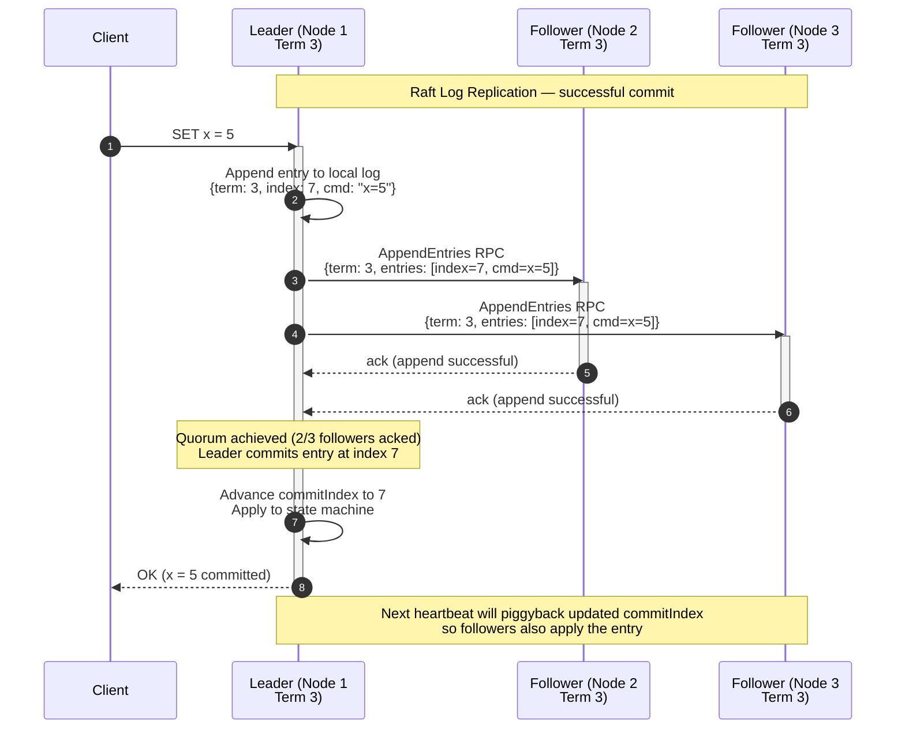
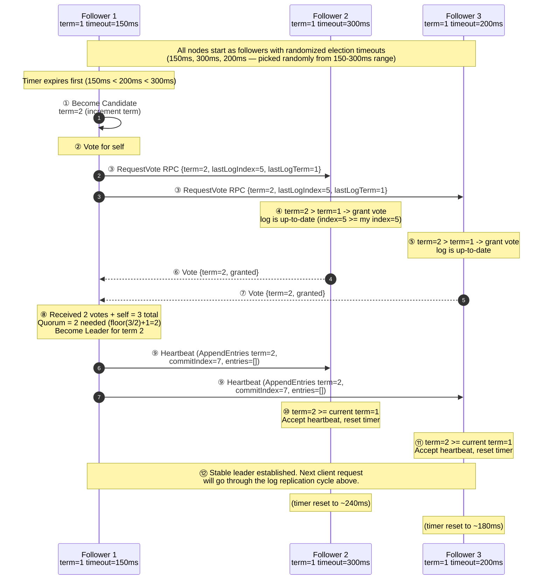
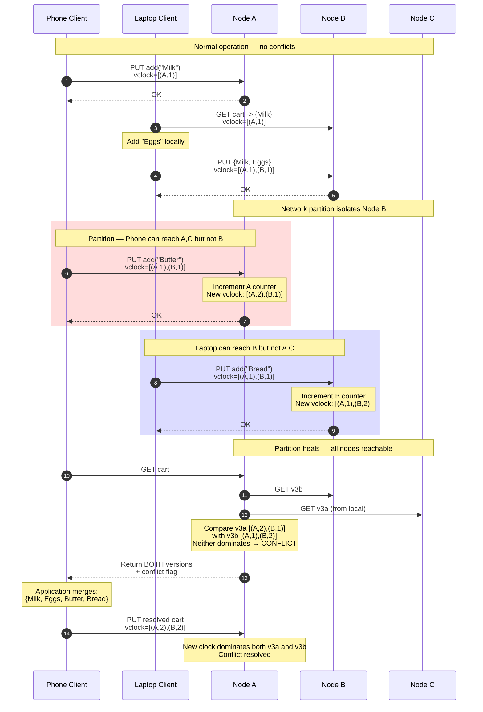

# Module 12: Distributed Transactions & Consensus

Consensus is the process of getting a group of unreliable machines to agree on a single, coherent state despite network partitions, packet loss, and hardware failures — the mathematical foundation of distributed truth.

**Analogy:** Consensus is like a group of chefs trying to agree on the day's special. If the head chef (leader) is in charge, everyone follows her recipe (Raft). If there's no head chef and every cook can update the menu board, they need a way to detect when two cooks wrote conflicting specials and a protocol to resolve it (Dynamo). And if one chef might be malicious and intentionally write the wrong special, you need Byzantine agreement (BFT).

---

## Table of Contents

- [1. Two-Phase Commit (2PC)](#1-two-phase-commit-2pc)
- [2. Three-Phase Commit (3PC)](#2-three-phase-commit-3pc)
- [3. Leader-Based Consensus (Raft)](#3-leader-based-consensus-raft)
  - [Raft Leader Election: Step-by-Step Timeline with Randomized Timeouts](#raft-leader-election-step-by-step-timeline-with-randomized-timeouts)
- [4. Leaderless Consensus & Resolution (Dynamo)](#4-leaderless-consensus--resolution-dynamo)
  - [Vector Clock Worked Example: Shopping Cart Conflict Resolution](#vector-clock-worked-example-shopping-cart-conflict-resolution)
  - [CFT vs. BFT: Real-World Systems Comparison](#cft-vs-bft-real-world-systems-comparison)
- [5. Real-World Failure Modes](#5-real-world-failure-modes)
  - [What Happens in Production: Elasticsearch Split-Brain Data Loss](#what-happens-in-production-elasticsearch-split-brain-data-loss)
  - [What Happens in Production: The etcd Election Storm](#what-happens-in-production-the-etcd-election-storm)
- [6. Production Code Template: Raft Quorum Simulator](#6-production-code-template-raft-quorum-simulator)
- [7. Consensus Engineering Challenges](#7-consensus-engineering-challenges)
- [8. Key Takeaways](#8-key-takeaways)
- [9. Self-Assessment Questions](#9-self-assessment-questions)
- [10. Common Mistakes](#10-common-mistakes)

---

## 1. Two-Phase Commit (2PC)

Two-Phase Commit ensures **atomicity** across multiple independent databases — all nodes commit or none do.

**Analogy:** Two-Phase Commit is like a wedding ceremony. The officiant (coordinator) asks the audience: "Does anyone object?" (Phase 1 — Prepare). If no one objects, the officiant says "I now pronounce you..." (Phase 2 — Commit). If anyone objects, the wedding is called off (Abort). The problem is that if the officiant collapses right after asking for objections, the guests are frozen — they have already declared they have no objection, but they don't know whether the wedding proceeded or was called off. They must stand there, holding their opinions, unable to leave, until the officiant is replaced.

### Phase 1: Prepare Phase

The **Coordinator** sends a `prepare` message to all **Participants**. Each participant executes the transaction locally up to the point of committing, locks the necessary resources, and replies with:

- **Yes** — ready to commit.
- **No** — failure or abort.

Think of this as "reserving a table" at a restaurant. The coordinator calls each restaurant (participant), tells them the order, and asks if they can fulfill it. Each restaurant prepares the food but doesn't serve it yet — they hold it in the kitchen, keeping those ingredients locked and unavailable for other customers.

### Phase 2: Commit Phase

- If the Coordinator receives **Yes** from every participant -> sends `commit` to all.
- If any participant sends **No** or times out -> sends `abort` to all.

### The Blocking Problem

2PC is a **blocking protocol**. If a participant has voted **Yes**, it must wait for the Coordinator's final decision before releasing its locks. If the Coordinator crashes after the Prepare phase but before the Commit phase, all participants who voted **Yes** are left in a state of **uncertainty** — they cannot unilaterally abort (others might have committed) or commit (others might have aborted). Resources remain locked until the Coordinator recovers.

```text
Coordinator         Participant-1       Participant-2
    |                    |                    |
    |---- prepare ------>|---- prepare ------>|
    |<------ Yes --------|<------ Yes --------|
    |                                        (Coordinator crashes here)
    |                    |                    |
    |              *** BLOCKED ***      *** BLOCKED ***
```

**Why blocking is so dangerous in production.** In a microservices environment, a coordinator crash during 2PC locks database rows, queue messages, and file handles across multiple services. If the coordinator does not recover quickly (and in distributed systems, "quickly" can mean minutes to hours), these locks propagate to other transactions that need the same resources. A single coordinator failure in a busy system can cause a cascading lock-contention deadlock that brings down an entire data tier. This is why Google's Spanner and similar systems avoid classical 2PC across datacenter boundaries and instead use a combination of reliable commit-coordinators, synchronous replication, and atomic clocks.

---

## 2. Three-Phase Commit (3PC)

Three-Phase Commit attempts to remove 2PC's blocking nature by adding a **Pre-Commit** phase:

| Phase | 2PC | 3PC |
|---|---|---|
| 1 | Prepare -> vote | Prepare -> vote |
| 2 | Commit / Abort | **Pre-Commit** (coordinator broadcasts that a majority agreed) |
| 3 | -- | Commit / Abort |

**How 3PC avoids blocking.** After the prepare phase, the coordinator broadcasts a `pre-commit` message to all participants indicating that a majority voted Yes. This gives every participant enough information to decide unilaterally if the coordinator fails:
- If a participant has received a `pre-commit` message and then the coordinator disappears, it knows that a majority voted Yes — so it can safely proceed to commit on a timeout.
- If a participant voted Yes but never received a `pre-commit` message, it knows the coordinator failed before broadcasting the majority decision — so it can safely abort on a timeout.

The extra phase allows participants to eventually time out and abort or commit based on peer state. However, 3PC remains complex to implement and is not a universal remedy — it can still block under network partitions.

**The practical reality:** 3PC is rarely used in production. The complexity of implementing the timeout and state-transition logic correctly overwhelms the marginal benefit over 2PC with a highly-available coordinator (e.g., using Raft for the coordinator role). Most systems either use 2PC with a replicated coordinator or skip distributed transactions entirely in favor of event-driven sagas.

---

## 3. Leader-Based Consensus (Raft)

Raft provides a robust, understandable consensus protocol by centering its logic around a **Strong Leader**.

**Analogy:** Raft is like a parliamentary democracy. The leader (prime minister) is elected. Once elected, all decisions flow through the leader — she proposes laws (log entries), and the cabinet (followers) must approve a majority before the law takes effect (commits). If the prime minister becomes unreachable, a new election is held. The "term" is like a parliamentary term — each election starts a new term, and a leader from an old term cannot make decisions.

### Core Concepts

| Concept | Definition |
|---|---|
| **Term** | A logical clock; time is divided into terms of arbitrary length, each starting with an election |
| **Quorum** | A majority of nodes: `floor(N/2) + 1` |
| **Log Replication** | Leader appends commands to its log and replicates them to followers via `AppendEntries` RPCs |

### Raft Log Replication Cycle



*Raft consensus: a successful log replication and commit. The `Leader` receives a client command, appends it to its local log, and issues `AppendEntries` RPCs to both `Followers`. After receiving acknowledgements from a majority (2 out of 3), the leader commits the entry, applies it to its state machine, and responds to the client.*

### Raft Leader Election: Step-by-Step Timeline with Randomized Timeouts

The most critical moment in Raft's lifecycle — and the most common source of failure — is leader election. The protocol uses **randomized election timeouts** to ensure that, with high probability, only one server becomes a candidate and wins the election. Here is how it plays out:



*Raft leader election walkthrough. **Steps 1-3:** Follower 1's randomized timeout (150ms) expires first. It increments its term to 2, votes for itself, and sends RequestVote RPCs to the other followers. **Steps 4-7:** Followers 2 and 3 see term=2 > their current term=1 and check that F1's log is at least as up-to-date as theirs — both grant their vote. **Step 8:** F1 receives 2 votes (plus its own = 3 total), which exceeds the quorum of 2. It becomes Leader for term 2. **Steps 9-11:** The leader immediately sends heartbeats to establish authority. Followers accept the heartbeat (term 2 >= 1) and reset their election timers. **Step 12:** Normal operation resumes. The leader's heartbeats (sent every 50-100ms in practice) continuously reset followers' timers, preventing any new election.*

**Why randomized timeouts prevent election collisions.** If all followers used the same timeout (say 200ms), they would all expire simultaneously when the leader fails — every follower becomes a candidate at the exact same instant, splits the vote (each gets its own vote plus one from another follower in a 3-node cluster), and no one reaches quorum. The election fails, a new term starts, and the same thing happens again (the "split-vote" loop). Randomizing timeouts over a range (typically 150-300ms) ensures that, with overwhelming probability, one follower's timer expires before the others, giving it a head start to collect votes before the other candidates emerge.

### The Mathematics of Quorum

A **Quorum** is defined as `floor(N/2) + 1`. In a cluster of `2N+1` nodes, you can survive the failure of up to `N` machines. Any two majorities in a cluster must overlap by at least one server — that overlapping server carries the most recent committed log entry, ensuring a newly elected leader possesses all previously committed data.

| Cluster Size | Quorum Size | Max Failures Tolerated |
|---|---|---:|---:|
| 1 | 1 | 0 |
| 3 | 2 | 1 |
| 5 | 3 | 2 |
| 7 | 4 | 3 |

**Why the overlapping property is essential for safety.** Imagine a 5-node cluster. Two different majorities of 3 nodes each could be {1,2,3} and {3,4,5}. The overlap is node 3. When a leader from the first majority commits an entry, node 3's copy of that entry is authoritative. If the first leader crashes and a new leader is elected from the second majority, node 3 ensures the new leader discovers the committed entry and never loses it. Without this overlap guarantee, a new leader could unknowingly overwrite a committed entry — a safety violation that Raft's design explicitly prevents.

### Leader Election

- Servers start as **Followers**.
- If they don't hear a heartbeat within a randomized **Election Timeout**, they become **Candidates** and request votes.
- A candidate becomes Leader if it receives votes from a majority.
- If a node discovers its **Term** is smaller than another's, it updates its term and reverts to Follower — neutralizing stale leaders.

**The "step-down" rule in practice.** This is the most important safety property in Raft. Imagine a leader (Node 1, term 5) gets network-partitioned but still believes it is the leader. Meanwhile, the rest of the cluster elects a new leader (Node 2, term 6). When the partition heals and Node 1 receives a heartbeat from Node 2 with term=6, Node 1 immediately reverts to follower. Any uncommitted writes that Node 1 accepted during the partition are never replicated to a majority — they simply vanish from the log when the new leader overwrites them. This is why Raft client libraries must retry on leader changes.

---

## 4. Leaderless Consensus & Resolution (Dynamo)

Amazon **Dynamo** uses a decentralized, "always writeable" model with no single distinguished leader.

**Analogy:** Dynamo is like a whiteboard in a shared office where anyone can write. If two people write conflicting appointments at the same time (one writes "Team Standup 10am" and another writes "Sprint Review 10am"), the whiteboard keeps both entries. A third person later arrives, sees the conflict, and merges them into "Standup followed by Sprint Review at 10am." This is exactly how Dynamo handles writes — it always accepts them and resolves conflicts at read time (or lets the application resolve them).

### Conflict Handling: Vector Clocks

Since any node can coordinate a write, data versions can diverge. Dynamo uses **Vector Clocks** — a list of `(node, counter)` pairs that capture causality:

- If one clock's counters are all <= another's -> the first is an **ancestor** (no conflict).
- If neither dominates -> **conflict** — requires semantic reconciliation by the application (e.g., merging two versions of a shopping cart).

### Vector Clock Worked Example: Shopping Cart Conflict Resolution

Let's trace a concrete scenario with three Dynamo nodes (A, B, C) and a shopping cart shared between two devices (phone and laptop). The cart starts empty.

**Initial state:**

| Version | Vector Clock | Cart Contents |
|---|---|---|
| v0 | `[]` | `{}` |

**Step 1: Phone adds "Milk" (coordinated by Node A)**

The phone sends `add("Milk")` to Node A. Node A creates a new version:

| Version | Vector Clock | Cart Contents |
|---|---|---|
| v1 | `[(A, 1)]` | `{Milk}` |

**Step 2: Laptop adds "Eggs" (coordinated by Node B)**

The laptop fetches the latest version (v1 with clock `[(A,1)]`), adds "Eggs", and sends the update to Node B. Node B increments its own counter:

| Version | Vector Clock | Cart Contents |
|---|---|---|
| v2 | `[(A, 1), (B, 1)]` | `{Milk, Eggs}` |

**Step 3: Network partition — concurrent updates**

A network partition isolates Node B from Nodes A and C. Both sides receive simultaneous updates:

| Side | Version | Vector Clock | Action | Cart Contents |
|---|---|---|---|---|
| {A, C} | v3a | `[(A, 2), (B, 1)]` | Phone adds "Butter" via Node A | `{Milk, Eggs, Butter}` |
| {B} | v3b | `[(A, 1), (B, 2)]` | Laptop adds "Bread" via Node B | `{Milk, Eggs, Bread}` |

Both v3a and v3b are accepted because Dynamo always accepts writes.

**Step 4: Partition heals — read triggers conflict detection**

A client performs a `GET` request and reads from a quorum of nodes. It receives both v3a and v3b. The vector clocks are compared:

```
v3a: [(A, 2), (B, 1)]
v3b: [(A, 1), (B, 2)]

Compare: A: 2 > 1, B: 1 < 2 → neither dominates
Result: CONFLICT — both are siblings
```

Since neither clock dominates the other, Dynamo returns **both versions** to the application layer. The application must merge them:

```python
def merge_shopping_carts(versions):
    """
    Merge conflicting shopping cart versions.
    Takes the union of all items across all versions.
    """
    merged = set()
    for cart in versions:
        for item in cart:
            merged.add(item)
    return list(merged)

# Dynamo returns both sibling versions
versions = [
    {"Milk", "Eggs", "Butter"},   # v3a from side A
    {"Milk", "Eggs", "Bread"},    # v3b from side B
]

resolved = merge_shopping_carts(versions)
# Result: {Milk, Eggs, Butter, Bread}
```

The resolved cart is written back with a new vector clock `[(A, 2), (B, 2)]` that dominates both predecessors:



*Vector clock conflict resolution with three Dynamo nodes. **Steps 1-3:** The shopping cart evolves normally through version v2. **Steps 4-5:** A network partition isolates Node B. Both sides of the partition concurrently update the cart — one adds Butter (incrementing A's counter), the other adds Bread (incrementing B's counter). **Step 6:** When the partition heals, a GET request discovers both sibling versions. The vector clocks [(A,2),(B,1)] and [(A,1),(B,2)] are incomparable — neither dominates. **Step 7:** The application merges the carts by taking the union of items. **Step 8:** The resolved cart is written with clock [(A,2),(B,2)], which dominates both predecessors, establishing a new causal ancestor.*

### Read-Repair

When a client performs a `get()`, the coordinator requests data from `R` nodes. If it detects divergent versions that can be reconciled syntactically (based on vector clocks), it immediately propagates the latest version to stale nodes — a process called **Read-Repair**.

**How Read-Repair works in the shopping cart example.** Suppose during the partition, version v3a was written to Nodes A and C, but Node B only has v2. After the partition heals, a GET from Node A (as coordinator) reads from all three nodes:
- Node A returns v3a (fresh)
- Node B returns v2 (stale — missing the Butter addition)
- Node C returns v3a (fresh)

The coordinator determines that v3a dominates v2 (A:2 > A:1, B:1 == B:1). It immediately writes v3a to Node B. The next read from Node B will get the correct data without waiting for the application merge. This propagation happens transparently to the client.

### CFT vs. BFT: Real-World Systems Comparison

| System | Fault Model | Min Nodes | Algorithm | Notes |
|---|---|---|---|---|
| **etcd / Consul** | CFT (crash-stop) | 3 (2f+1) | Raft | Kubernetes control plane, service discovery |
| **Apache ZooKeeper** | CFT (crash-stop) | 3 (2f+1) | Zab (ZooKeeper Atomic Broadcast) | Hadoop ecosystem, Kafka metadata |
| **Google Chubby** | CFT (crash-stop) | 5 (2f+1) | Paxos | Google's lock service, GFS/Bigtable metadata |
| **Apache Kafka (KRaft)** | CFT (crash-stop) | 3 (2f+1) | Raft variant | Kafka metadata quorum (since Kafka 2.8) |
| **Microsoft Azure FarmV2** | CFT (crash-stop) | 5 (2f+1) | Paxos | Azure storage and compute resource management |
| **Hyperledger Fabric** | BFT (byzantine) | 4 (3f+1) | PBFT (pBFT variant) | Permissioned blockchain for enterprise |
| **Tendermint (Cosmos)** | BFT (byzantine) | 4 (3f+1) | Tendermint (PBFT variant) | Proof-of-Stake blockchain, IBC protocol |
| **HotStuff (Libra/Diem)** | BFT (byzantine) | 4 (3f+1) | Chained HotStuff | Meta's blockchain, 3-phase linear BFT |
| **Bitcoin** | BFT (byzantine) | 1 (50% hash power) | Nakamoto Consensus (PoW) | Public blockchain, probabilistic finality |
| **Ethereum** | BFT (byzantine) | 1 (50% stake) | Gasper (Casper FFG + LMD-GHOST) | Smart contract platform, finality after 2 epochs |

**The key insight from this comparison.** CFT systems (Raft, Paxos, Zab) require only 2f+1 nodes and can tolerate f crash failures. They assume nodes fail by stopping — no node ever lies, cheats, or sends contradictory messages. BFT systems require 3f+1 nodes because they must defend against arbitrary (byzantine) behavior: a node could send different votes to different peers, forge messages, or collude. The extra f nodes provide the redundancy needed to detect and override malicious actors.

**Bitcoin's unique position.** Nakamoto Consensus is neither classical CFT nor classical BFT. It uses Proof-of-Work to bind identity to computational resources and provides probabilistic finality (6 blocks ~ 1 hour for practical certainty). Unlike PBFT, it is permissionless — anyone can join without prior authorization — but it cannot provide the deterministic finality that financial exchanges require (you can never be 100% sure a Bitcoin transaction won't be reorged).

**When would you choose BFT over CFT?** In permissioned enterprise settings (Hyperledger) where consortium members are known but might be competitors, or in public blockchains (Bitcoin, Ethereum) where there is no trust at all. In a single-organization datacenter, CFT is the right choice — it is simpler, faster (thousands of transactions per second vs. hundreds for BFT), and cheaper (2f+1 vs. 3f+1 nodes).

---

## 5. Real-World Failure Modes

### Split-Brain Voting Stalemates

In a network partition, a minority of nodes cannot elect a leader — they cannot achieve a **Quorum**. However, flaky networks cause nodes to repeatedly time out and start new elections, bumping their **Term** numbers progressively higher. When the partition heals, the spurious high terms can disrupt the legitimate leader.

```text
Before partition:  Leader (Node 1)  <->  Follower (Node 2)  <->  Follower (Node 3)
                           |
                     [Network partition]
                           |
After partition:   Leader (Node 1)          Follower (Node 2)  Follower (Node 3)
                   (majority side)     (minority — cannot elect, terms spiral)
```

### What Happens in Production: Elasticsearch Split-Brain Data Loss

In 2016, a mid-sized SaaS company running Elasticsearch 2.x across 6 nodes in 2 availability zones experienced a classic split-brain incident that caused permanent data loss.

**The setup:** A 6-node Elasticsearch cluster with `discovery.zen.minimum_master_nodes` set to 3 (the default 2.x behavior was `N/2 + 1`, which was correct at 4, but the operator had mistakenly set it to 3 during a configuration rollout).

**The trigger:** A network switch failure in AZ-A caused a 90-second partition. Three nodes in AZ-A became isolated from three nodes in AZ-B.

**The split-brain cascade:**

1. Both sides of the partition had exactly 3 nodes — exactly half the cluster. With `minimum_master_nodes=3`, both sides could elect a master.
2. AZ-A elected Node 1 as master. AZ-B elected Node 4 as master. Both masters accepted writes from their respective clients.
3. Each master started assigning shard replicas that existed on the other side of the partition as "missing" and re-allocated them to nodes within their own side.
4. When the partition healed 90 seconds later, both masters tried to assert authority — Elasticsearch 2.x had no equivalent of Raft's term-based "step-down" rule.
5. The cluster entered a **split-brain state** with two masters. Shard replication metadata diverged. In-memory buffers on both sides flushed conflicting segment data to disk.
6. When the operators manually intervened (killing the AZ-B master), the recovery merged the diverged metadata. Elasticsearch's segment-level merge could not reconcile the conflicting writes at the document level — approximately 2,700 documents (12% of the index for that day) were permanently lost.

**Business impact:** The lost documents were application logs from a financial reconciliation service. The compliance team required 90-day retention with no gaps. The gap in log coverage triggered a compliance audit that resulted in a $50K fine and a 6-month remediation plan.

**The fix:**

1. **`minimum_master_nodes` formula:** Changed to `floor(N/2) + 1` = 4 for a 6-node cluster. This ensures that no partition of 3 nodes can elect a master — only a majority of 4+ nodes can. Hard-coded as a static setting rather than relying on dynamic configuration that could be accidentally changed.
2. **Upgrade to Elasticsearch 7.x+:** Version 7 introduced the **Zen2** consensus layer, which implements a Raft-like protocol for master election. Zen2 uses term-based voting and guarantees at most one master per term, eliminating the split-brain scenario entirely.
3. **Availability zone layout:** Reconfigured to 3 AZs with 2 nodes each instead of 2 AZs with 3 nodes each. In any partition of 1 AZ (2 nodes), the remaining 4 nodes have a majority. This ensures write availability during the most common failure scenario (single-AZ outage).
4. **Monitoring:** Added a Grafana dashboard for cluster health that alerts when `number_of_nodes - number_of_master_elected_nodes > 0` for more than 5 seconds.

**The lesson:** Split-brain is not theoretical — it happens in production when the quorum configuration is wrong by even a single node. The difference between `minimum_master_nodes=3` and `=4` in a 6-node cluster is the difference between a healthy cluster and permanent data loss. Version 7's Zen2 consensus layer exists specifically because split-brain was the #1 cause of data loss in Elasticsearch 2.x clusters.

### Election Storms (Performance Death-Spiral)

Raft's availability depends on the timing inequality:

```
broadcastTime << electionTimeout << MTBF
```

If network latency (`broadcastTime`) increases until it approaches the `electionTimeout` threshold, followers time out and start new elections before receiving the leader's heartbeat. This creates a **storm** of continuous elections where no leader stays in power long enough to replicate a single log entry — the system halts.

### What Happens in Production: The etcd Election Storm

In 2017, a Kubernetes cluster with a 3-node etcd control plane experienced a cascading election storm during a routine network maintenance.

**The trigger:** A network engineer applied a QoS rate-limit policy to the Kubernetes control-plane VLAN. The policy was misconfigured, limiting the etcd heartbeat traffic to 5 Mbps — insufficient for the 3-node etcd cluster's gossip protocol.

**The cascade:**

1. Heartbeat latency between etcd nodes jumped from ~1ms to ~800ms.
2. The default `electionTimeout` was 1000ms. With heartbeats taking 800ms, followers had only 200ms of headroom before triggering elections.
3. Occasional TCP retransmissions pushed heartbeat latency past 1000ms. Followers started elections.
4. Election traffic consumed bandwidth, further delaying heartbeats. Other followers timed out and started their own elections. The cluster entered a perpetual election storm.
5. Over 5 minutes, the etcd cluster saw 47 leader elections, each pushing the term number higher. The Kubernetes API server (which depends on etcd for all state) returned 503 errors for all `kubectl` commands.
6. All cluster operations halted: no new pods could be scheduled, no deployments could be rolled out, and existing pods could not report health.

**The fix:**

1. **Removed the rate limit:** The QoS policy was removed from the control-plane VLAN within 8 minutes of the first alert. Heartbeat latency returned to ~1ms.
2. **Election timeout tuning:** Increased `electionTimeout` from 1000ms to 5000ms to provide more headroom against transient network latency spikes. This means failure detection takes longer (5 seconds without a heartbeat vs. 1 second), but the stability gain far outweighs the slower failover.
3. **Dedicated control-plane network:** Moved etcd traffic to a dedicated VLAN with guaranteed bandwidth and no rate limiting.
4. **Monitoring:** Added Prometheus alerts for `etcd_server_heartbeat_send_failures_total` and `etcd_server_leader_changes_seen_total`, with P95 heartbeat latency as a dashboard panel.

**The lesson:** An election storm is a "poison in the well" failure — the system consumes resources trying to fix the problem (elections) instead of doing useful work (serving requests). Once an election storm starts, it is self-sustaining until an external intervention breaks the cycle. The inequality `broadcastTime << electionTimeout` must be maintained with safety margins at all times, including under peak network load.

---

## 6. Production Code Template: Raft Quorum Simulator

```python
"""
Raft Quorum Simulator

Models a cluster of nodes with leader election, log replication,
and quorum-based commit. Demonstrates how a majority write succeeds
under normal conditions and how a network partition prevents quorum.

Usage:
    sim = RaftQuorumSimulator(total_nodes=5)
    sim.start_election()          # Node 0 becomes leader
    sim.replicate_write("x = 5") # succeeds (3/5 acks)
    sim.simulate_partition()     # isolate leader
    sim.replicate_write("y = 2") # fails  (only 2/5 acks)
"""

import logging
import random
from typing import Dict, List, Optional

logger = logging.getLogger("raft_quorum")


def has_quorum(acks: int, total_nodes: int) -> bool:
    """Check whether the number of acknowledgements constitutes a
    majority (quorum) of the cluster.

    Raft defines quorum as ``floor(total_nodes / 2) + 1``.

    Args:
        acks: Number of nodes that have acknowledged.
        total_nodes: Total number of nodes in the cluster.

    Returns:
        ``True`` if ``acks >= total_nodes // 2 + 1``.
    """
    return acks >= (total_nodes // 2) + 1


class RaftNode:
    """A single node in the Raft cluster."""

    def __init__(self, node_id: int) -> None:
        self.node_id = node_id
        self.term: int = 0
        self.state: str = "follower"  # follower | candidate | leader
        self.log: List[str] = []
        self.commit_index: int = -1
        self.active: bool = True

    def __repr__(self) -> str:
        return f"Node({self.node_id}, term={self.term}, state={self.state})"


class RaftQuorumSimulator:
    """Simulates quorum-based writes in a Raft cluster.

    Args:
        total_nodes: Number of nodes in the cluster.
        quorum_func: Function to evaluate quorum (defaults to
            ``has_quorum``). Override for testing custom majority rules.
    """

    def __init__(
        self,
        total_nodes: int = 5,
        quorum_func=has_quorum,
    ) -> None:
        self.nodes: Dict[int, RaftNode] = {
            i: RaftNode(i) for i in range(total_nodes)
        }
        self.total_nodes = total_nodes
        self.leader_id: Optional[int] = None
        self.partitioned: List[int] = []
        self._quorum_func = quorum_func

    def start_election(self) -> int:
        """Hold a simulated election. The candidate with the smallest
        ID wins (deterministic for demonstration).

        Returns:
            The node ID of the newly elected leader.
        """
        candidate_id = min(self.nodes.keys())
        leader = self.nodes[candidate_id]
        leader.state = "leader"
        leader.term += 1
        self.leader_id = candidate_id

        for node in self.nodes.values():
            if node.node_id != candidate_id:
                node.state = "follower"
        logger.info("Elected leader: %s", leader)
        return candidate_id

    def replicate_write(self, command: str) -> bool:
        """Attempt to replicate a write command to all active nodes.

        Returns:
            ``True`` if a quorum acknowledged the write, ``False``
            if the write could not be committed.
        """
        if self.leader_id is None:
            logger.warning("No leader — cannot replicate")
            return False

        leader = self.nodes[self.leader_id]
        leader.log.append(command)

        acks = 1  # leader acks itself
        for node in self.nodes.values():
            if node.node_id == self.leader_id:
                continue
            if not node.active:
                continue
            # Simulate network success for non-partitioned nodes
            if node.node_id in self.partitioned:
                continue
            node.log.append(command)
            acks += 1

        if self._quorum_func(acks, self.total_nodes):
            leader.commit_index = len(leader.log) - 1
            logger.info(
                "COMMIT: '%s' (acks=%d, quorum=%d, total=%d)",
                command,
                acks,
                (self.total_nodes // 2) + 1,
                self.total_nodes,
            )
            return True
        else:
            logger.warning(
                "NO QUORUM: '%s' (acks=%d, need %d, total=%d) — reverting",
                command,
                acks,
                (self.total_nodes // 2) + 1,
                self.total_nodes,
            )
            leader.log.pop()
            return False

    def simulate_partition(self, isolated_nodes: Optional[List[int]] = None) -> None:
        """Simulate a network partition by isolating nodes from the
        leader.

        Args:
            isolated_nodes: List of node IDs to isolate. If not
                provided, isolates a minority (2 out of 5).
        """
        if isolated_nodes is None:
            # Default: isolate 2 of 5 so the majority survives
            isolated_nodes = [3, 4]

        self.partitioned = isolated_nodes
        for node_id in isolated_nodes:
            self.nodes[node_id].active = True  # still alive, but unreachable
        logger.info(
            "Partition: isolated %s from leader (Node %d)",
            isolated_nodes,
            self.leader_id,
        )

    def heal_partition(self) -> None:
        """Restore network connectivity to all nodes."""
        logger.info("Partition healed — all nodes reachable")
        self.partitioned = []

    def quorum_size(self) -> int:
        return (self.total_nodes // 2) + 1


# ------------------------------------------------------------------
# Simulation Script
# ------------------------------------------------------------------
if __name__ == "__main__":
    logging.basicConfig(level=logging.INFO, format="%(message)s")

    sim = RaftQuorumSimulator(total_nodes=5)
    sim.start_election()
    print()

    # Successful write: 5 nodes, leader + 4 followers = 5 acks
    sim.replicate_write("SET inventory = 100")
    print()

    # Partition: isolate 2 nodes — leader + 2 healthy = 3 acks (quorum)
    sim.simulate_partition(isolated_nodes=[3, 4])
    sim.replicate_write("SET price = 29.99")
    print()

    # Now isolate 3 of 5 — leader + 1 healthy = 2 acks (no quorum)
    sim.simulate_partition(isolated_nodes=[1, 2, 3])
    sim.replicate_write("SET promo = TRUE")
    print()

    # Heal and confirm quorum is restored
    sim.heal_partition()
    sim.replicate_write("SET promo = TRUE")
    print()

    # Verify quorum function directly
    print("=== Quorum checks ===")
    for total in [1, 3, 5, 7]:
        q = (total // 2) + 1
        print(f"  total={total}: quorum={q}, max_failures={total - q}")
```

### Code Walkthrough: What Happens When a Partition Isolates the Leader

Let's trace through the simulation script and explain what happens at each step:

**Setup:** `sim = RaftQuorumSimulator(total_nodes=5)`

Five `RaftNode` objects are created (IDs 0-4), all in "follower" state, term=0.

**Election:** `sim.start_election()`

The simulator elects node 0 as leader (deterministic — picks the smallest ID for clarity). Node 0's term becomes 1. All other nodes become followers. In a real Raft cluster, the election would involve RequestVote RPCs and randomized timeouts (as shown in the sequence diagram above).

**Write 1: `replicate_write("SET inventory = 100")`**

1. Leader appends the command to its log.
2. Broadcasts to followers 1-4 via AppendEntries RPCs.
3. All 4 followers are active and not partitioned → all acknowledge.
4. `acks = 1 (self) + 4 = 5`. Quorum for 5 nodes is `5//2 + 1 = 3`.
5. `5 >= 3` → **COMMIT**. The command is applied to the state machine.

**Partition (minority): `simulate_partition([3, 4])`**

Nodes 3 and 4 are isolated from the leader. They remain "active" (not crashed) but unreachable. The leader side now has nodes {0, 1, 2} = 3 nodes.

**Write 2: `replicate_write("SET price = 29.99")`**

1. Leader (node 0) appends to its log.
2. Broadcasts to followers 1-4. Nodes 3 and 4 are partitioned → no response.
3. Nodes 1 and 2 acknowledge.
4. `acks = 1 (self) + 2 = 3`. Quorum is 3.
5. `3 >= 3` → **COMMIT**. The leader successfully committed with a minority partition because the majority side still has quorum.

**Partition (majority): `simulate_partition([1, 2, 3])`**

Now 3 of 5 nodes are isolated from the leader. The leader side has only {0, 4} = 2 nodes.

**Write 3: `replicate_write("SET promo = TRUE")`**

1. Leader appends to its log.
2. Broadcasts to followers 1-4. Nodes 1, 2, 3 are partitioned → no response. Only node 4 is reachable.
3. `acks = 1 (self) + 1 = 2`. Quorum is 3.
4. `2 < 3` → **NO QUORUM**. The write fails. The leader pops the command from its log.
5. In a real Raft cluster, the leader would also step down at this point (it knows it cannot serve the majority) and revert to follower.

**Heal:** `heal_partition()`

All nodes become reachable again.

**Write 4: `replicate_write("SET promo = TRUE")` (retry)**

With all 5 nodes reachable, the write succeeds on the first attempt. The retry demonstrates Raft's robustness: a failed write during a partition is safe to retry after the partition heals.

---

## 7. Consensus Engineering Challenges

> **Challenge 1: The Stale Leader's Last Stand**  
> A Raft Leader is partitioned away from the majority. It continues to accept writes from a local client. Meanwhile, the majority elects a new Leader. When the partition heals, what happens to the stale Leader's uncommitted writes?

<details><summary>Click for Consensus Engineering Rubric</summary>

**Senior answer:**

- **Immediate demotion:** The stale leader receives a heartbeat or `AppendEntries` RPC from the new leader containing a **higher term number**. It immediately reverts to **Follower** state — Raft's "step-down" rule.
- **Uncommitted writes discarded:** The stale leader's uncommitted entries (received during the partition) exist only in its local log at a term lower than the new leader's. Raft enforces **leader-driven log reconciliation**: the new leader's `AppendEntries` RPCs overwrite conflicting entries on followers. The stale leader's uncommitted entries are truncated.
- **Safety guarantee:** This is safe because the stale leader never achieved a **quorum** for those entries — they were never committed. Clients that received "success" responses during the partition received a lie; they must retry against the new leader.
- **System design implication:** Clients must be designed for **idempotency** and **retry**. A write that succeeded before a partition may not have been durably committed.
</details>

> **Challenge 2: Vector Clock Truncation Risk**  
> To save space, a Dynamo cluster truncates vector clocks once they reach 10 `(node, counter)` pairs by removing the oldest entries. What is the specific risk to data integrity?

<details><summary>Click for Consensus Engineering Rubric</summary>

**Senior answer:**

- **Loss of causality:** Vector clocks encode the complete causal history of a value. Truncation discards causal relationships, making it impossible to accurately derive **ancestor** relationships between versions.
- **Consequence — false conflicts:** Without a complete clock, the system may perceive a causal update (where one version clearly descends from another) as a **conflict**. This forces unnecessary — and potentially confusing — manual reconciliation on the user.
- **Consequence — true conflicts hidden:** Conversely, truncation could *merge* entries that should have been kept separate, silently losing a divergent update because the clock no longer captures the branching point.
- **Industry practice:** Dynamo-style systems typically bound vector clock size by pruning *sibling* entries rather than truncating the list. Alternatively, use **timestamp-based heuristics** as a fallback when causal history is too large, accepting the risk of occasional unnecessary conflicts in exchange for bounded metadata growth.
</details>

> **Challenge 3: Quorum Tuning (N, R, W)**  
> You need the highest possible write availability in a 3-node cluster. How do you set `N`, `R`, and `W`? What is the trade-off?

<details><summary>Click for Consensus Engineering Rubric</summary>

**Senior answer:**

- **Extreme setting:** `N=3, W=1, R=1`. A write is accepted as long as **one** node acknowledges it. This provides maximum write availability — a single surviving node can accept writes.
- **Trade-off — consistency collapse:** This violates the Dynamo quorum condition `R + W > N` (1 + 1 is not > 3). Reads are almost guaranteed to be stale: a read at `R=1` may hit a node that never received the write. The system provides **no read-your-writes** or **latest-wins** guarantee.
- **Practical middle ground:** `N=3, W=2, R=2` is the standard strong-setting (`W + R > N`). `W=1` sacrifices read consistency for write availability — acceptable only for append-only, loss-tolerant workloads (e.g., analytics event ingestion).
- **Senior insight:** "Highest write availability" is usually a trap in interviews. The right answer is to define the *minimum consistency requirement* first, then tune `R` and `W` to meet it. `W=1` is only safe if the application can tolerate losing or re-ordering writes.
</details>

---

## 8. Key Takeaways

- **Consensus is about agreeing on a single truth across unreliable machines.** The choice between protocols hinges on three questions: Do you need a leader (Raft) or can any node coordinate (Dynamo)? Can nodes fail only by stopping (CFT) or might they behave maliciously (BFT)? Can you tolerate blocking during coordinator failure (2PC) or must you make progress (3PC, Raft)?
- **Raft's randomized election timeouts are what make the protocol practical.** Without randomization, elections would almost always produce split votes and infinite retries. The 150-300ms random range (in practice) ensures near-certain election convergence with only one round.
- **Vector clocks capture causality, not truth.** They tell you which versions are related (ancestor/descendant) but not which version is correct. Application-level conflict resolution (shopping cart union, last-write-wins) is required when clocks diverge.
- **Split-brain is prevented by design, not by chance.** The `floor(N/2) + 1` quorum rule guarantees that at most one group can have a majority. If you set `minimum_master_nodes` incorrectly by even 1, you lose this guarantee. Modern consensus layers (Raft, Zen2) enforce this at the protocol level so operators cannot misconfigure it.
- **CFT is for trusted environments; BFT is for adversarial ones.** Permissioned blockchains (Hyperledger) need BFT because consortium members may be competitors. Single-organization databases (etcd, ZooKeeper) need only CFT — simpler, faster, and cheaper at 2f+1 nodes instead of 3f+1.
- **The election storm inequality is non-negotiable.** `broadcastTime << electionTimeout << MTBF` must hold under peak load, network jitter, and garbage collection pauses. If heartbeat latency approaches the election timeout, the system enters a self-sustaining election storm that halts all progress.
- **2PC's blocking problem is why distributed transactions are avoided.** Locking resources across multiple services during a coordinator crash creates cascading failures. Modern architectures prefer sagas (event-driven compensation) or idempotent retry patterns over distributed transactions.

---

## 9. Self-Assessment Questions

**Question 1:** You are designing a Raft cluster for a global payment system that requires 99.999% availability. Should you use 3 nodes or 5 nodes? Justify with quorum math.

<details><summary>Click for Answer</summary>

**5 nodes.** With 3 nodes, you tolerate 1 failure (quorum=2). During a rolling upgrade (1 node down for maintenance), a second failure would bring the cluster below quorum. With 5 nodes (quorum=3), you tolerate 2 failures. This allows a rolling upgrade with one node down while still surviving one unexpected failure.

**Cost-benefit:** 3 nodes costs 60% of 5 nodes but provides significantly less operational headroom. For a payment system where downtime costs $100K+/minute, the extra 2 nodes pay for themselves in the first minute of prevented downtime.

**Senior insight:** Also consider failure domains. With 5 nodes across 3 AZs (2+2+1), a single AZ failure (2 nodes) leaves 3 nodes — still a majority. With 3 nodes across 3 AZs (1+1+1), a single AZ failure leaves 2 nodes — exactly quorum, but no room for further failures during recovery.
</details>

**Question 2:** In a Dynamo-style shopping cart with N=3, W=2, R=2, a network partition isolates one node. Can the system still accept writes? Can it still guarantee read-your-writes consistency?

<details><summary>Click for Answer</summary>

- **Writes:** Yes, W=2 only requires 2 nodes to acknowledge. With 3 nodes total and 2 available, writes succeed.
- **Read-your-writes:** Not guaranteed. If a write goes to nodes {A, B} and a read goes to nodes {A, C}, node C may not have the latest data. The read could return stale data even though the write succeeded. This violates read-your-writes consistency.

**The fix:** Increase W=3 or R=3 (both sacrifice availability for consistency). Or use read-repair to propagate the latest version to node C during the read, accepting that the read might return slightly stale data but will self-heal quickly.

**Senior insight:** The R + W > N condition is the Dynamo equivalent of Raft's quorum. With N=3, W=2, R=2: 2 + 2 = 4 > 3, so strong consistency is possible. But during a partition where only 2 nodes are reachable, W=2 writes succeed but R=2 reads cannot guarantee freshness because the read quorum may overlap differently than the write quorum.
</details>

**Question 3:** A BFT system with 7 nodes can tolerate how many Byzantine faults? Show the formula.

<details><summary>Click for Answer</summary>

**2 Byzantine faults.** BFT requires `n >= 3f + 1`, where f is the maximum number of byzantine nodes. For n=7: `7 >= 3f + 1` → `3f <= 6` → `f <= 2`.

**Compare with CFT:** A 7-node CFT cluster using Raft tolerates f=3 crash failures (quorum=4, `7 - 4 = 3`).

**Why BFT needs more nodes:** Byzantine nodes can lie and collude. A byzantine node might tell one peer "vote for A" and another peer "vote for B." The honest nodes need enough votes to outvote the liars even in the worst case. With 3f+1 nodes, the honest majority (2f+1) can always outvote the byzantine minority (f), even if the byzantine nodes coordinate perfectly.
</details>

**Question 4:** An etcd cluster with 3 nodes uses 800ms heartbeat interval and 3000ms election timeout. During a network event, P99 heartbeat latency spikes to 2500ms. What happens? What configuration change do you recommend?

<details><summary>Click for Answer</summary>

**What happens:** The 2500ms heartbeat latency exceeds the 800ms interval but is still below the 3000ms election timeout. Followers will miss some heartbeats because the interval (800ms) is shorter than the latency (2500ms). When a follower misses enough consecutive heartbeats (typically one election timeout period = 3000ms / 800ms ~ 3-4 missed heartbeats), it starts an election.

**Risk:** If multiple followers time out simultaneously (possible because they all experience similar latency), the cluster enters an election storm. The election traffic adds to network congestion, further increasing latency.

**Recommendation:** Increase the heartbeat interval to at least 3x the P99 latency: set heartbeat interval to 1000ms and election timeout to 5000ms (5x heartbeat interval, which is the recommended ratio). This provides headroom: even with 2500ms heartbeat latency, the leader can still send 2 heartbeats before the 5000ms timeout expires. The tradeoff is slower failure detection (5 seconds instead of 3 seconds), but that is acceptable for most workloads.

**Alternative:** Fix the root cause — ensure the control-plane network has guaranteed bandwidth and no rate limiting.
</details>

**Question 5:** A 2PC coordinator persists its decision log to disk. After the Prepare phase, the coordinator crashes and restarts. It reads its decision log and finds no entry (the crash happened before it wrote the decision). What should it do?

<details><summary>Click for Answer</summary>

**It must abort.** The coordinator has no record of whether it sent commit or abort before crashing. It cannot unilaterally commit because some participants might have already aborted. It sends `abort` to all participants. Any participant that had already committed (because it received a commit before the coordinator crashed) must have idempotency mechanisms or compensating transactions to handle the abort.

**Why this is safe:** A participant that received a commit before the coordinator crashed has already released its locks and applied the transaction. When it receives the abort from the recovered coordinator, it can either:
1. **Ignore the abort** if the transaction is idempotent (the result is already visible).
2. **Execute a compensating transaction** (undo the committed work) if the system supports sagas.

**Why this is necessary:** The alternative — the coordinator attempting to commit — would violate atomicity if any participant aborted during the crash. The safe choice is always abort.

**Senior insight:** This scenario is precisely why 2PC is called a "blocking" protocol. Even with a persisted decision log and automatic recovery, the coordinator's uncertainty window (between prepare and log-write) creates a window where a crash forces abort. Google's Spanner avoids this by using a distributed lease-based coordinator (Paxos) where the coordinator role can fail over without losing the decision state.
</details>

---

## 10. Common Mistakes

> **Mistake 1: Running a 2-node Raft cluster.**  
> A 2-node cluster requires both nodes for quorum (quorum = 2). If either node fails, the cluster loses quorum and stops accepting writes. You gain zero fault tolerance over a single node but pay double the infrastructure cost. Always run at least 3 nodes for any consensus-based system.

> **Mistake 2: Setting `minimum_master_nodes` to half the cluster size instead of half + 1.**  
> In a 6-node cluster, setting `minimum_master_nodes=3` (half) allows both halves of a partition to elect a master — guaranteeing split-brain. The correct value is `floor(N/2) + 1 = 4`. This single configuration error was responsible for the majority of Elasticsearch data loss incidents in versions 2.x and earlier.

> **Mistake 3: Using processing time for conflict resolution in Dynamo-style systems.**  
> "Last-write-wins" using wall-clock timestamps is fragile because clocks drift. Two concurrent writes on different nodes can have identical timestamps (losing one update) or reversed timestamps (accepting an older write over a newer one). Always use vector clocks for causal ordering; use timestamps only as a tiebreaker when clocks are equal.

> **Mistake 4: Assuming BFT is always better because it's "more secure."**  
> BFT adds significant overhead: 3f+1 nodes instead of 2f+1, cryptographic signature verification on every message, and an order of magnitude lower throughput. For a single-organization database behind a firewall, CFT is the correct choice. Reserve BFT for environments where participants do not trust each other (blockchain, multi-organization consortiums).

> **Mistake 5: Not testing election behavior under network stress.**  
> Many teams test consensus clusters under ideal conditions and discover election storms in production. Run chaos experiments: inject latency between nodes, drop packets, and crash a leader during a write. Measure the time to elect a new leader and verify that no committed entries are lost. If your cluster cannot survive a `tc` (traffic control) injection of 200ms latency, it will not survive a real network incident.
