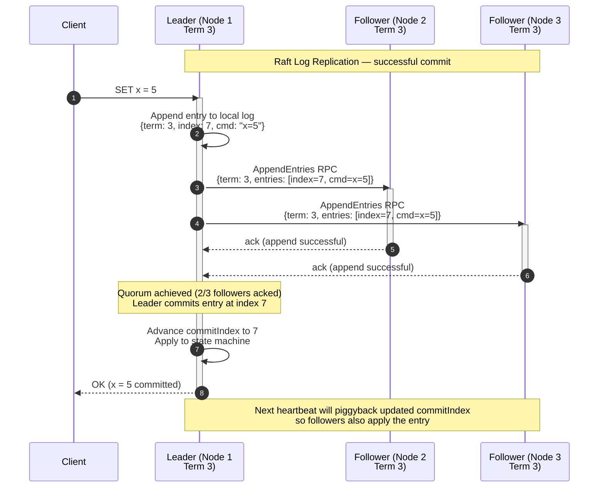

# Module 12: Distributed Transactions & Consensus

Consensus is the process of getting a group of unreliable machines to agree on a single, coherent state despite network partitions, packet loss, and hardware failures — the mathematical foundation of distributed truth.

---

## Table of Contents

- [1. Two-Phase Commit (2PC)](#1-two-phase-commit-2pc)
- [2. Three-Phase Commit (3PC)](#2-three-phase-commit-3pc)
- [3. Leader-Based Consensus (Raft)](#3-leader-based-consensus-raft)
- [4. Leaderless Consensus & Resolution (Dynamo)](#4-leaderless-consensus--resolution-dynamo)
- [5. Real-World Failure Modes](#5-real-world-failure-modes)
- [6. Production Code Template: Raft Quorum Simulator](#6-production-code-template-raft-quorum-simulator)
- [7. Consensus Engineering Challenges](#7-consensus-engineering-challenges)

---

## 1. Two-Phase Commit (2PC)

Two-Phase Commit ensures **atomicity** across multiple independent databases — all nodes commit or none do.

### Phase 1: Prepare Phase

The **Coordinator** sends a `prepare` message to all **Participants**. Each participant executes the transaction locally up to the point of committing, locks the necessary resources, and replies with:

- **Yes** — ready to commit.
- **No** — failure or abort.

### Phase 2: Commit Phase

- If the Coordinator receives **Yes** from every participant → sends `commit` to all.
- If any participant sends **No** or times out → sends `abort` to all.

### The Blocking Problem

2PC is a **blocking protocol**. If a participant has voted **Yes**, it must wait for the Coordinator's final decision before releasing its locks. If the Coordinator crashes after the Prepare phase but before the Commit phase, all participants who voted **Yes** are left in a state of **uncertainty** — they cannot unilaterally abort (others might have committed) or commit (others might have aborted). Resources remain locked until the Coordinator recovers.

```text
Coordinator         Participant-1       Participant-2
    |                    |                    |
    |---- prepare ------>|---- prepare ------>|
    |<------ Yes --------|<------ Yes --------|
    |                                        (Coordinator crashes here)
    |                    |                    |
    |              *** BLOCKED ***      *** BLOCKED ***
```

---

## 2. Three-Phase Commit (3PC)

Three-Phase Commit attempts to remove 2PC's blocking nature by adding a **Pre-Commit** phase:

| Phase | 2PC | 3PC |
|---|---|---|
| 1 | Prepare → vote | Prepare → vote |
| 2 | Commit / Abort | **Pre-Commit** (coordinator broadcasts that a majority agreed) |
| 3 | — | Commit / Abort |

The extra phase allows participants to eventually time out and abort or commit based on peer state. However, 3PC remains complex to implement and is not a universal remedy — it can still block under network partitions.

---

## 3. Leader-Based Consensus (Raft)

Raft provides a robust, understandable consensus protocol by centering its logic around a **Strong Leader**.

### Core Concepts

| Concept | Definition |
|---|---|
| **Term** | A logical clock; time is divided into terms of arbitrary length, each starting with an election |
| **Quorum** | A majority of nodes: `floor(N/2) + 1` |
| **Log Replication** | Leader appends commands to its log and replicates them to followers via `AppendEntries` RPCs |

### Raft Log Replication Cycle



*Raft consensus: a successful log replication and commit. The `Leader` receives a client command, appends it to its local log, and issues `AppendEntries` RPCs to both `Followers`. After receiving acknowledgements from a majority (2 out of 3), the leader commits the entry, applies it to its state machine, and responds to the client.*

### The Mathematics of Quorum

A **Quorum** is defined as `floor(N/2) + 1`. In a cluster of `2N+1` nodes, you can survive the failure of up to `N` machines. Any two majorities in a cluster must overlap by at least one server — that overlapping server carries the most recent committed log entry, ensuring a newly elected leader possesses all previously committed data.

| Cluster Size | Quorum Size | Max Failures Tolerated |
|---|---:|---:|
| 1 | 1 | 0 |
| 3 | 2 | 1 |
| 5 | 3 | 2 |
| 7 | 4 | 3 |

### Leader Election

- Servers start as **Followers**.
- If they don't hear a heartbeat within a randomized **Election Timeout**, they become **Candidates** and request votes.
- A candidate becomes Leader if it receives votes from a majority.
- If a node discovers its **Term** is smaller than another's, it updates its term and reverts to Follower — neutralizing stale leaders.

---

## 4. Leaderless Consensus & Resolution (Dynamo)

Amazon **Dynamo** uses a decentralized, "always writeable" model with no single distinguished leader.

### Conflict Handling: Vector Clocks

Since any node can coordinate a write, data versions can diverge. Dynamo uses **Vector Clocks** — a list of `(node, counter)` pairs that capture causality:

- If one clock's counters are all ≤ another's → the first is an **ancestor** (no conflict).
- If neither dominates → **conflict** — requires semantic reconciliation by the application (e.g., merging two versions of a shopping cart).

### Read-Repair

When a client performs a `get()`, the coordinator requests data from `R` nodes. If it detects divergent versions that can be reconciled syntactically (based on vector clocks), it immediately propagates the latest version to stale nodes — a process called **Read-Repair**.

### CFT vs. BFT

| Property | Crash-Fault Tolerant (CFT) | Byzantine Fault Tolerant (BFT) |
|---|---|---|
| **Failure model** | Nodes fail by stopping | Nodes may behave arbitrarily (maliciously) |
| **Environment** | Trusted (non-hostile) | Untrusted (byzantine actors) |
| **Examples** | `Raft`, `Paxos`, `Zab` | `PBFT`, `HotStuff`, `Tendermint` |
| **Cost** | Lower | Significantly higher (3f+1 nodes, cryptographic overhead) |

---

## 5. Real-World Failure Modes

### Split-Brain Voting Stalemates

In a network partition, a minority of nodes cannot elect a leader — they cannot achieve a **Quorum**. However, flaky networks cause nodes to repeatedly time out and start new elections, bumping their **Term** numbers progressively higher. When the partition heals, the spurious high terms can disrupt the legitimate leader.

```text
Before partition:  Leader (Node 1)  ←→  Follower (Node 2)  ←→  Follower (Node 3)
                           |
                    [Network partition]
                           |
After partition:   Leader (Node 1)          Follower (Node 2)  Follower (Node 3)
                   (majority side)     (minority — cannot elect, terms spiral)
```

### Election Storms (Performance Death-Spiral)

Raft's availability depends on the timing inequality:

```
broadcastTime ≪ electionTimeout ≪ MTBF
```

If network latency (`broadcastTime`) increases until it approaches the `electionTimeout` threshold, followers time out and start new elections before receiving the leader's heartbeat. This creates a **storm** of continuous elections where no leader stays in power long enough to replicate a single log entry — the system halts.

---

## 6. Production Code Template: Raft Quorum Simulator

```python
"""
Raft Quorum Simulator

Models a cluster of nodes with leader election, log replication,
and quorum-based commit. Demonstrates how a majority write succeeds
under normal conditions and how a network partition prevents quorum.

Usage:
    sim = RaftQuorumSimulator(total_nodes=5)
    sim.start_election()          # Node 0 becomes leader
    sim.replicate_write("x = 5") # succeeds (3/5 acks)
    sim.simulate_partition()     # isolate leader
    sim.replicate_write("y = 2") # fails  (only 2/5 acks)
"""

import logging
import random
from typing import Dict, List, Optional

logger = logging.getLogger("raft_quorum")


def has_quorum(acks: int, total_nodes: int) -> bool:
    """Check whether the number of acknowledgements constitutes a
    majority (quorum) of the cluster.

    Raft defines quorum as ``floor(total_nodes / 2) + 1``.

    Args:
        acks: Number of nodes that have acknowledged.
        total_nodes: Total number of nodes in the cluster.

    Returns:
        ``True`` if ``acks >= total_nodes // 2 + 1``.
    """
    return acks >= (total_nodes // 2) + 1


class RaftNode:
    """A single node in the Raft cluster."""

    def __init__(self, node_id: int) -> None:
        self.node_id = node_id
        self.term: int = 0
        self.state: str = "follower"  # follower | candidate | leader
        self.log: List[str] = []
        self.commit_index: int = -1
        self.active: bool = True

    def __repr__(self) -> str:
        return f"Node({self.node_id}, term={self.term}, state={self.state})"


class RaftQuorumSimulator:
    """Simulates quorum-based writes in a Raft cluster.

    Args:
        total_nodes: Number of nodes in the cluster.
        quorum_func: Function to evaluate quorum (defaults to
            ``has_quorum``). Override for testing custom majority rules.
    """

    def __init__(
        self,
        total_nodes: int = 5,
        quorum_func=has_quorum,
    ) -> None:
        self.nodes: Dict[int, RaftNode] = {
            i: RaftNode(i) for i in range(total_nodes)
        }
        self.total_nodes = total_nodes
        self.leader_id: Optional[int] = None
        self.partitioned: List[int] = []
        self._quorum_func = quorum_func

    def start_election(self) -> int:
        """Hold a simulated election. The candidate with the smallest
        ID wins (deterministic for demonstration).

        Returns:
            The node ID of the newly elected leader.
        """
        candidate_id = min(self.nodes.keys())
        leader = self.nodes[candidate_id]
        leader.state = "leader"
        leader.term += 1
        self.leader_id = candidate_id

        for node in self.nodes.values():
            if node.node_id != candidate_id:
                node.state = "follower"
        logger.info("Elected leader: %s", leader)
        return candidate_id

    def replicate_write(self, command: str) -> bool:
        """Attempt to replicate a write command to all active nodes.

        Returns:
            ``True`` if a quorum acknowledged the write, ``False``
            if the write could not be committed.
        """
        if self.leader_id is None:
            logger.warning("No leader — cannot replicate")
            return False

        leader = self.nodes[self.leader_id]
        leader.log.append(command)

        acks = 1  # leader acks itself
        for node in self.nodes.values():
            if node.node_id == self.leader_id:
                continue
            if not node.active:
                continue
            # Simulate network success for non-partitioned nodes
            if node.node_id in self.partitioned:
                continue
            node.log.append(command)
            acks += 1

        if self._quorum_func(acks, self.total_nodes):
            leader.commit_index = len(leader.log) - 1
            logger.info(
                "COMMIT: '%s' (acks=%d, quorum=%d, total=%d)",
                command,
                acks,
                (self.total_nodes // 2) + 1,
                self.total_nodes,
            )
            return True
        else:
            logger.warning(
                "NO QUORUM: '%s' (acks=%d, need %d, total=%d) — reverting",
                command,
                acks,
                (self.total_nodes // 2) + 1,
                self.total_nodes,
            )
            leader.log.pop()
            return False

    def simulate_partition(self, isolated_nodes: Optional[List[int]] = None) -> None:
        """Simulate a network partition by isolating nodes from the
        leader.

        Args:
            isolated_nodes: List of node IDs to isolate. If not
                provided, isolates a minority (2 out of 5).
        """
        if isolated_nodes is None:
            # Default: isolate 2 of 5 so the majority survives
            isolated_nodes = [3, 4]

        self.partitioned = isolated_nodes
        for node_id in isolated_nodes:
            self.nodes[node_id].active = True  # still alive, but unreachable
        logger.info(
            "Partition: isolated %s from leader (Node %d)",
            isolated_nodes,
            self.leader_id,
        )

    def heal_partition(self) -> None:
        """Restore network connectivity to all nodes."""
        logger.info("Partition healed — all nodes reachable")
        self.partitioned = []

    def quorum_size(self) -> int:
        return (self.total_nodes // 2) + 1


# ------------------------------------------------------------------
# Simulation Script
# ------------------------------------------------------------------
if __name__ == "__main__":
    logging.basicConfig(level=logging.INFO, format="%(message)s")

    sim = RaftQuorumSimulator(total_nodes=5)
    sim.start_election()
    print()

    # Successful write: 5 nodes, leader + 4 followers = 5 acks
    sim.replicate_write("SET inventory = 100")
    print()

    # Partition: isolate 2 nodes — leader + 2 healthy = 3 acks (quorum)
    sim.simulate_partition(isolated_nodes=[3, 4])
    sim.replicate_write("SET price = 29.99")
    print()

    # Now isolate 3 of 5 — leader + 1 healthy = 2 acks (no quorum)
    sim.simulate_partition(isolated_nodes=[1, 2, 3])
    sim.replicate_write("SET promo = TRUE")
    print()

    # Heal and confirm quorum is restored
    sim.heal_partition()
    sim.replicate_write("SET promo = TRUE")
    print()

    # Verify quorum function directly
    print("=== Quorum checks ===")
    for total in [1, 3, 5, 7]:
        q = (total // 2) + 1
        print(f"  total={total}: quorum={q}, max_failures={total - q}")
```

---

## 7. Consensus Engineering Challenges

> **Challenge 1: The Stale Leader's Last Stand**  
> A Raft Leader is partitioned away from the majority. It continues to accept writes from a local client. Meanwhile, the majority elects a new Leader. When the partition heals, what happens to the stale Leader's uncommitted writes?

<details><summary>Click for Consensus Engineering Rubric</summary>

**Senior answer:**

- **Immediate demotion:** The stale leader receives a heartbeat or `AppendEntries` RPC from the new leader containing a **higher term number**. It immediately reverts to **Follower** state — Raft's "step-down" rule.
- **Uncommitted writes discarded:** The stale leader's uncommitted entries (received during the partition) exist only in its local log at a term lower than the new leader's. Raft enforces **leader-driven log reconciliation**: the new leader's `AppendEntries` RPCs overwrite conflicting entries on followers. The stale leader's uncommitted entries are truncated.
- **Safety guarantee:** This is safe because the stale leader never achieved a **quorum** for those entries — they were never committed. Clients that received "success" responses during the partition received a lie; they must retry against the new leader.
- **System design implication:** Clients must be designed for **idempotency** and **retry**. A write that succeeded before a partition may not have been durably committed.
</details>

> **Challenge 2: Vector Clock Truncation Risk**  
> To save space, a Dynamo cluster truncates vector clocks once they reach 10 `(node, counter)` pairs by removing the oldest entries. What is the specific risk to data integrity?

<details><summary>Click for Consensus Engineering Rubric</summary>

**Senior answer:**

- **Loss of causality:** Vector clocks encode the complete causal history of a value. Truncation discards causal relationships, making it impossible to accurately derive **ancestor** relationships between versions.
- **Consequence — false conflicts:** Without a complete clock, the system may perceive a causal update (where one version clearly descends from another) as a **conflict**. This forces unnecessary — and potentially confusing — manual reconciliation on the user.
- **Consequence — true conflicts hidden:** Conversely, truncation could *merge* entries that should have been kept separate, silently losing a divergent update because the clock no longer captures the branching point.
- **Industry practice:** Dynamo-style systems typically bound vector clock size by pruning *sibling* entries rather than truncating the list. Alternatively, use **timestamp-based heuristics** as a fallback when causal history is too large, accepting the risk of occasional unnecessary conflicts in exchange for bounded metadata growth.
</details>

> **Challenge 3: Quorum Tuning (N, R, W)**  
> You need the highest possible write availability in a 3-node cluster. How do you set `N`, `R`, and `W`? What is the trade-off?

<details><summary>Click for Consensus Engineering Rubric</summary>

**Senior answer:**

- **Extreme setting:** `N=3, W=1, R=1`. A write is accepted as long as **one** node acknowledges it. This provides maximum write availability — a single surviving node can accept writes.
- **Trade-off — consistency collapse:** This violates the Dynamo quorum condition `R + W > N` (1 + 1 is not > 3). Reads are almost guaranteed to be stale: a read at `R=1` may hit a node that never received the write. The system provides **no read-your-writes** or **latest-wins** guarantee.
- **Practical middle ground:** `N=3, W=2, R=2` is the standard strong-setting (`W + R > N`). `W=1` sacrifices read consistency for write availability — acceptable only for append-only, loss-tolerant workloads (e.g., analytics event ingestion).
- **Senior insight:** "Highest write availability" is usually a trap in interviews. The right answer is to define the *minimum consistency requirement* first, then tune `R` and `W` to meet it. `W=1` is only safe if the application can tolerate losing or re-ordering writes.
</details>
