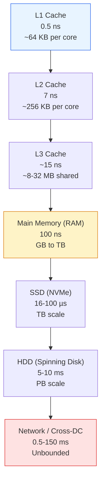

# Module 13: Back-of-the-Envelope Estimation & Capacity Planning

Capacity planning is the mathematical heartbeat of infrastructure reliability — we do not build on hunches; we build on back-of-the-envelope calculations that ensure when a product launches to 100 million users, the network does not melt and the storage does not hit a wall.

---

## Table of Contents

- [1. Latency Numbers Every Programmer Must Know](#1-latency-numbers-every-programmer-must-know)
- [2. The Power of Two Rules](#2-the-power-of-two-rules)
- [3. The Calculations Framework](#3-the-calculations-framework)
- [4. Worked Exercise: Photo-Sharing App (100M DAU)](#4-worked-exercise-photo-sharing-app-100m-dau)
- [5. Estimation Challenges](#5-estimation-challenges)

---

## 1. Latency Numbers Every Programmer Must Know

### Absolute Latency Table

| Operation | Latency | Relative (Human Scale) |
|---|---|---|
| **L1 cache reference** | 0.5 ns | 1 second |
| **L2 cache reference** | 7 ns | 14 seconds |
| **Main memory (RAM) reference** | 100 ns | 200 seconds (~3.3 min) |
| **SSD random read** | 16,000 ns (16 µs) | ~8.9 hours |
| **Same data-center round trip** | 500,000 ns (0.5 ms) | ~11.6 days |
| **Global cross-continental RTT** (CA→NL) | 150,000,000 ns (150 ms) | ~9.5 years |

*Human scale: L1 at 0.5 ns scaled to 1 second. Fetching data from across the world instead of L1 cache is the difference between a 1-second task and a 9.5-year wait.*

### Memory Hierarchy

*The memory hierarchy pyramid: each step down is 1–2 orders of magnitude slower but offers exponentially more capacity. The gap between L1 cache and a cross-continental network round trip spans **nine orders of magnitude**.*

---

## 2. The Power of Two Rules

### Data Unit Shortcuts

| Prefix | Power of 2 | Approx Value |
|---|---|---|
| Kilo (KB) | $2^{10}$ | 1,024 |
| Mega (MB) | $2^{20}$ | ~1 million |
| Giga (GB) | $2^{30}$ | ~1 billion |
| Tera (TB) | $2^{40}$ | ~1 trillion |
| Peta (PB) | $2^{50}$ | ~1 quadrillion |

### Traffic Shortcuts

| Daily Volume | Approx Avg QPS |
|---|---:|
| 1 million requests/day | ~12 QPS |
| 100 million requests/day | ~1,200 QPS |
| 1 billion requests/day | ~12,000 QPS |

$$
\text{QPS} = \frac{\text{Daily Volume}}{86{,}400}
$$

### Peak Multiplier

Always design for **peak load**, not averages:

- **Typical burst:** $2\times$ average
- **Viral / event spike:** $5\times$ average

---

## 3. The Calculations Framework

### Read/Write Queries Per Second (QPS)

$$
\text{Avg QPS} = \frac{\text{DAU} \times \text{Avg Requests Per User}}{86{,}400}
$$

### Network Bandwidth

$$
\text{Bandwidth (bytes/sec)} = \text{QPS} \times \text{Avg Request/Response Size}
$$

Convert to bits/sec: multiply by 8.

### Total Storage (5-Year Horizon)

$$
\text{5-Year Storage} = (\text{Daily Write Volume} \times 365 \times 5) \times \text{Padding Factor}
$$

Use a **padding factor** of 1.2× to 2× to account for metadata, indexing, and replication.

### RAM Cache Size (80/20 Pareto Rule)

If 20% of the data generates 80% of the traffic, the cache should hold that 20% working set:

$$
\text{Cache Size} = \text{Daily Read Volume} \times 0.20
$$

---

## 4. Worked Exercise: Photo-Sharing App (100M DAU)

**Scenario:** 100M Daily Active Users. Each user uploads 1 photo/day. Average photo size: 2 MB. Read/Write ratio assumed 10:1.

### 4.1 QPS Derivation

**Writes (uploads):**

$$
\frac{100{,}000{,}000 \text{ photos}}{86{,}400 \text{ sec/day}} \approx 1{,}157 \text{ avg write QPS}
$$

$$
\text{Peak write QPS (2×)} \approx 2{,}300 \text{ QPS}
$$

**Reads (10:1 read/write ratio):**

$$
\frac{1{,}000{,}000{,}000 \text{ reads}}{86{,}400 \text{ sec/day}} \approx 11{,}574 \text{ avg read QPS}
$$

### 4.2 Storage Derivation

| Period | Formula | Total |
|---|---|---|
| **Daily** | $100\text{M} \times 2\text{ MB}$ | **200 TB** |
| **Yearly** | $200\text{ TB} \times 365$ | **73 PB** |
| **5-Year (raw)** | $73\text{ PB} \times 5$ | **365 PB** |
| **5-Year (1.3× padding)** | $365\text{ PB} \times 1.3$ | **~475 PB** |

### 4.3 Bandwidth Derivation

**Ingress (writes):**

$$
1{,}157 \text{ QPS} \times 2\text{ MB} \approx 2.3\text{ GB/s}
$$

$$
2.3 \text{ GB/s} \times 8 = 18.4\text{ Gbps}
$$

**Egress (reads):**

$$
11{,}574 \text{ QPS} \times 2\text{ MB} \approx 23\text{ GB/s}
$$

$$
23 \text{ GB/s} \times 8 = 184\text{ Gbps}
$$

### 4.4 RAM Cache Sizing (80/20 Rule)

**Total daily read volume:**

$$
1\text{B reads} \times 2\text{ MB} = 2\text{ PB served per day}
$$

**Working set (20% of daily reads):**

$$
2\text{ PB} \times 0.20 = 400\text{ TB of RAM globally}
$$

Spread across regional cache clusters (e.g., 10 regions → ~40 TB per region).

### Summary Table

| Dimension | Average | Peak (2×) |
|---|---|---|
| Write QPS | ~1,157 | ~2,300 |
| Read QPS | ~11,574 | ~23,000 |
| Ingress bandwidth | ~2.3 GB/s (18.4 Gbps) | ~4.6 GB/s |
| Egress bandwidth | ~23 GB/s (184 Gbps) | ~46 GB/s |
| 5-Year storage | ~475 PB (with padding) | — |
| RAM cache (80/20) | 400 TB globally | — |

---

## 5. Estimation Challenges

> **Challenge 1: The URL Shortener**  
> A URL shortener handles 500 million new URLs per month. Each entry (short URL + long URL + metadata) is 500 bytes. What is the total storage required for 5 years? Assume 2× padding for indexes and replication.

Click for Capacity Planning Solution

**Step 1 — Monthly storage:**

$$
500 \times 10^6 \text{ URLs} \times 500 \text{ bytes} = 250 \times 10^9 \text{ bytes} = 250\text{ GB/month}
$$

**Step 2 — Yearly storage:**

$$
250\text{ GB} \times 12 = 3{,}000\text{ GB} = 3\text{ TB/year}
$$

**Step 3 — 5-Year raw storage:**

$$
3\text{ TB} \times 5 = 15\text{ TB}
$$

**Step 4 — With 2× padding (indexes + replication):**

$$
15\text{ TB} \times 2 = 30\text{ TB}
$$

**Final answer:** ~30 TB of raw disk over 5 years.

**Additional insight:** At 500M URLs/month, the write QPS is:

$$
\frac{500 \times 10^6}{86{,}400 \times 30} \approx 193 \text{ avg write QPS}
$$

A single modest database cluster can handle this — no need for a distributed store.

> **Challenge 2: The Video Firehose**  
> A live-streaming platform has 10,000 concurrent viewers. Each stream is delivered at 5 Mbps. What is the total egress bandwidth required in Gbps? If the platform uses a CDN that handles 80% of the traffic, what bandwidth does the origin server need?

Click for Capacity Planning Solution

**Step 1 — Total egress bandwidth:**

$$
10{,}000 \text{ viewers} \times 5\text{ Mbps} = 50{,}000\text{ Mbps}
$$

**Step 2 — Convert to Gbps:**

$$
\frac{50{,}000}{1{,}000} = 50\text{ Gbps}
$$

**Step 3 — Origin server bandwidth (CDN absorbs 80%):**

$$
50\text{ Gbps} \times (1 - 0.80) = 10\text{ Gbps}
$$

**Final answer:** 50 Gbps total edge egress; origin server needs only 10 Gbps.

**Additional insight:** If this is a 24/7 stream, the monthly data transfer is:

$$
50\text{ Gbps} \times 86{,}400 \times 30 \div 8 \approx 16.2\text{ PB/month}
$$

This is why live platforms negotiate flat-rate peering agreements rather than paying per-GB transfer.

> **Challenge 3: The Social Metadata Cache**  
> A social network serves 2 billion profile requests per day. Each profile metadata object is 1 KB. Using the 80/20 Pareto rule, how much RAM is needed for a distributed cache? Assume each cached object has an overhead of 256 bytes for keys and pointers.

Click for Capacity Planning Solution

**Step 1 — Total daily read data volume:**

$$
2 \times 10^9 \text{ requests} \times 1\text{ KB} = 2 \times 10^{12} \text{ bytes} = 2\text{ TB}
$$

**Step 2 — Working set (20% of daily reads per Pareto):**

$$
2\text{ TB} \times 0.20 = 0.4\text{ TB} = 400\text{ GB}
$$

**Step 3 — Add overhead per object (256 bytes for keys/pointers on top of 1 KB data = 25% overhead):**

$$
400\text{ GB} \times 1.25 = 500\text{ GB}
$$

**Step 4 — Add replication factor (2× for high availability):**

$$
500\text{ GB} \times 2 = 1{,}000\text{ GB} = 1\text{ TB}
$$

**Final answer:** ~1 TB of RAM across the distributed cache cluster.

**Additional insight:** In practice, this cache is sharded across dozens of `Redis` or `Memcached` nodes. With 32 GB per node, you need ~32 nodes. If the read QPS is:

$$
\frac{2 \times 10^9}{86{,}400} \approx 23{,}148 \text{ avg read QPS}
$$

Each node handles ~720 QPS — well within Redis's single-threaded capacity.

