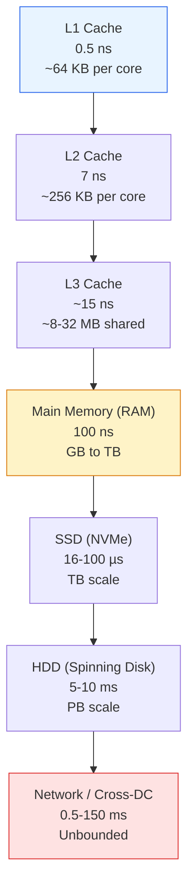
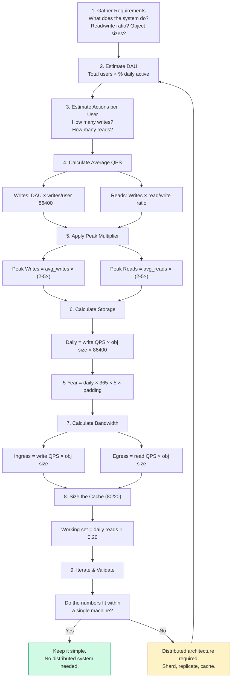

# Module 13: Back-of-the-Envelope Estimation & Capacity Planning

Capacity planning is the mathematical heartbeat of infrastructure reliability — we do not build on hunches; we build on back-of-the-envelope calculations that ensure when a product launches to 100 million users, the network does not melt and the storage does not hit a wall.

**Analogy:** Capacity planning is like planning a cross-country road trip. You estimate the distance (requests), fuel efficiency (bandwidth), how much luggage fits in the trunk (storage), and where you'll make pit stops (cache). If you guess wrong, you run out of gas in the desert — the application equivalent of a midnight pager alert that the database is full.

---

## Table of Contents

- [1. Latency Numbers Every Programmer Must Know](#1-latency-numbers-every-programmer-must-know)
- [2. The Power of Two Rules](#2-the-power-of-two-rules)
- [3. The Calculations Framework](#3-the-calculations-framework)
  - [The Estimation Workflow Roadmap](#the-estimation-workflow-roadmap)
- [4. Worked Exercise: Photo-Sharing App (100M DAU)](#4-worked-exercise-photo-sharing-app-100m-dau)
- [5. Additional Worked Exercises](#5-additional-worked-exercises)
  - [5.1 Worked Exercise: Real-Time Chat System (500M DAU)](#51-worked-exercise-real-time-chat-system-500m-dau)
  - [5.2 Worked Exercise: Metrics Ingestion Pipeline (10M Hosts)](#52-worked-exercise-metrics-ingestion-pipeline-10m-hosts)
  - [What Happens in Production: The 4 AM Storage Meltdown](#what-happens-in-production-the-4-am-storage-meltdown)
- [6. Estimation Challenges](#6-estimation-challenges)
- [7. Common Mistakes](#7-common-mistakes)
- [8. Key Takeaways](#8-key-takeaways)
- [9. Self-Assessment Questions](#9-self-assessment-questions)

---

## 1. Latency Numbers Every Programmer Must Know

### Absolute Latency Table

| Operation | Latency | Relative (Human Scale) |
|---|---|---|
| **L1 cache reference** | 0.5 ns | 1 second |
| **L2 cache reference** | 7 ns | 14 seconds |
| **Main memory (RAM) reference** | 100 ns | 200 seconds (~3.3 min) |
| **SSD random read** | 16,000 ns (16 µs) | ~8.9 hours |
| **Same data-center round trip** | 500,000 ns (0.5 ms) | ~11.6 days |
| **Global cross-continental RTT** (CA->NL) | 150,000,000 ns (150 ms) | ~9.5 years |

*Human scale: L1 at 0.5 ns scaled to 1 second. Fetching data from across the world instead of L1 cache is the difference between a 1-second task and a 9.5-year wait.*

**Why these numbers matter in design discussions.** When an engineer proposes "let's fetch this data from the US database on every request from Europe," the 150 ms cross-continental latency means each request adds 9.5 years on the human scale — an eternity. The same data fetched from L1 cache costs 1 second. This is why every senior engineer has these numbers memorized: they are the common language for making data-access tradeoff decisions without running a benchmark.

### Memory Hierarchy

*The memory hierarchy pyramid: each step down is 1-2 orders of magnitude slower but offers exponentially more capacity. The gap between L1 cache and a cross-continental network round trip spans **nine orders of magnitude**.*

---

## 2. The Power of Two Rules

### Data Unit Shortcuts

| Prefix | Power of 2 | Approx Value |
|---|---|---|
| Kilo (KB) | $2^{10}$ | 1,024 |
| Mega (MB) | $2^{20}$ | ~1 million |
| Giga (GB) | $2^{30}$ | ~1 billion |
| Tera (TB) | $2^{40}$ | ~1 trillion |
| Peta (PB) | $2^{50}$ | ~1 quadrillion |

**The most useful conversion to memorize.** $2^{30}$ is approximately $10^9$ (1 billion). When you see "1 billion bytes," round to 1 GB. This approximation is close enough for back-of-the-envelope calculations and makes mental math trivial. The difference between 1,000,000,000 (decimal) and 1,073,741,824 (binary) is less than 7.4% — well within the margin of error for capacity planning estimates.

### Traffic Shortcuts

| Daily Volume | Approx Avg QPS |
|---|---:|
| 1 million requests/day | ~12 QPS |
| 100 million requests/day | ~1,200 QPS |
| 1 billion requests/day | ~12,000 QPS |

$$
\text{QPS} = \frac{\text{Daily Volume}}{86{,}400}
$$

**The mental shortcut.** 100,000 requests/day = roughly 1 QPS. From there, scale linearly: 100 million/day = 1,000 QPS. This is the single most useful approximation in system design interviews — memorize it.

### Peak Multiplier

Always design for **peak load**, not averages:

- **Typical burst:** $2\times$ average
- **Viral / event spike:** $5\times$ average

**Why the multiplier matters more than the average.** A service handling 1,000 QPS average with a 5x viral spike needs to handle 5,000 QPS at peak. If you provision for the average, the system will fail during the first launch-day traffic spike. The peak-to-average ratio is the most commonly underestimated factor in capacity planning.

---

## 3. The Calculations Framework

### The Estimation Workflow Roadmap

Before diving into the individual formulas, here is the complete estimation workflow as a decision tree:

*The complete capacity planning workflow. Start by gathering requirements (step 1), then work through DAU, QPS, storage, bandwidth, and cache sizing sequentially. After each pass through the pipeline, validate whether the numbers fit within a single machine's capacity. If yes, keep the architecture simple. If no, you need sharding, replication, and distributed caching — and another pass through the pipeline with the new architecture assumptions.*

### Read/Write Queries Per Second (QPS)

$$
\text{Avg QPS} = \frac{\text{DAU} \times \text{Avg Requests Per User}}{86{,}400}
$$

**Always compute writes and reads separately.** Writes determine storage growth. Reads determine bandwidth and cache sizing. They have different scaling characteristics: writes are I/O-bound, reads are often cacheable.

### Network Bandwidth

$$
\text{Bandwidth (bytes/sec)} = \text{QPS} \times \text{Avg Request/Response Size}
$$

Convert to bits/sec: multiply by 8.

**Where engineers get this wrong.** They compute bandwidth in bytes but buy network links in bits. A 10 Gbps link can carry only 1.25 GB/s. A 184 Gbps egress requirement (like the photo-sharing app below) needs 184/10 ≈ 19 fully loaded 10 Gbps links — or 2 × 100 Gbps links. Never confuse bytes and bits when ordering hardware.

### Total Storage (5-Year Horizon)

$$
\text{5-Year Storage} = (\text{Daily Write Volume} \times 365 \times 5) \times \text{Padding Factor}
$$

Use a **padding factor** of 1.2x to 2x to account for metadata, indexing, and replication.

**Why 5 years?** Hardware refresh cycles in datacenters are typically 3-5 years. Planning beyond 5 years is unreliable (the growth curve changes). Planning less than 3 years misses the compounding effect of data accumulation. The 5-year horizon is the industry standard for capacity planning.

### RAM Cache Size (80/20 Pareto Rule)

If 20% of the data generates 80% of the traffic, the cache should hold that 20% working set:

$$
\text{Cache Size} = \text{Daily Read Volume} \times 0.20
$$

**When the 80/20 rule breaks down.** The Pareto assumption holds for most user-generated content (photos, videos, profiles) where a small fraction of objects are popular. It breaks down for:
- **Time-series data:** The most recent data generates nearly 100% of reads. Cache the last N hours instead.
- **Sequential scan workloads:** Analytics queries read entire datasets with no hot spots. Caching is ineffective.
- **Uniformly distributed access patterns:** Load balancer health checks, unique tokens. No hot objects to cache.

---

## 4. Worked Exercise: Photo-Sharing App (100M DAU)

**Scenario:** 100M Daily Active Users. Each user uploads 1 photo/day. Average photo size: 2 MB. Read/Write ratio assumed 10:1.

### 4.1 QPS Derivation

**Writes (uploads):**

$$
\frac{100{,}000{,}000 \text{ photos}}{86{,}400 \text{ sec/day}} \approx 1{,}157 \text{ avg write QPS}
$$

$$
\text{Peak write QPS (2x)} \approx 2{,}300 \text{ QPS}
$$

**Reads (10:1 read/write ratio):**

$$
\frac{1{,}000{,}000{,}000 \text{ reads}}{86{,}400 \text{ sec/day}} \approx 11{,}574 \text{ avg read QPS}
$$

**Why these numbers tell the story.** At 1,157 writes/second, a single Postgres instance can handle the writes (it tops out around 5,000-10,000 writes/second for simple inserts). But at 11,574 reads/second, you need a read replica or a cache layer. The QPS numbers alone tell you that the read path needs horizontal scaling while the write path may not.

### 4.2 Storage Derivation

| Period | Formula | Total |
|---|---|---|
| **Daily** | $100\text{M} \times 2\text{ MB}$ | **200 TB** |
| **Yearly** | $200\text{ TB} \times 365$ | **73 PB** |
| **5-Year (raw)** | $73\text{ PB} \times 5$ | **365 PB** |
| **5-Year (1.3x padding)** | $365\text{ PB} \times 1.3$ | **~475 PB** |

**The kicker:** 200 TB per day means you provision new storage every ~2.5 days on a 500 TB cluster. This growth rate dictates the architecture: you cannot use fixed-size volumes. You need object storage (S3, GCS) that scales elastically.

### 4.3 Bandwidth Derivation

**Ingress (writes):**

$$
1{,}157 \text{ QPS} \times 2\text{ MB} \approx 2.3\text{ GB/s}
$$

$$
2.3 \text{ GB/s} \times 8 = 18.4\text{ Gbps}
$$

**Egress (reads):**

$$
11{,}574 \text{ QPS} \times 2\text{ MB} \approx 23\text{ GB/s}
$$

$$
23 \text{ GB/s} \times 8 = 184\text{ Gbps}
$$

**What 184 Gbps means in hardware.** This is roughly 2 × 100 Gbps links fully saturated. At $2,000 per 100 Gbps port per month (typical cloud provider pricing), the egress bandwidth alone costs ~$4,000/month. If you serve video instead of photos, multiply by 10-100x. This is why bandwidth cost dominates storage cost for media-heavy applications.

### 4.4 RAM Cache Sizing (80/20 Rule)

**Total daily read volume:**

$$
1\text{B reads} \times 2\text{ MB} = 2\text{ PB served per day}
$$

**Working set (20% of daily reads):**

$$
2\text{ PB} \times 0.20 = 400\text{ TB of RAM globally}
$$

Spread across regional cache clusters (e.g., 10 regions -> ~40 TB per region).

**Practical reality check:** 400 TB of RAM at $5/GB (cloud instance pricing) is $2M just for the cache. In practice, you would use a multi-tier cache: L1 (in-memory, small, hot objects) + L2 (SSD-backed, larger working set). This reduces the cost while keeping the 80th percentile latency within SLA.

### Summary Table

| Dimension | Average | Peak (2x) |
|---|---|---|
| Write QPS | ~1,157 | ~2,300 |
| Read QPS | ~11,574 | ~23,000 |
| Ingress bandwidth | ~2.3 GB/s (18.4 Gbps) | ~4.6 GB/s |
| Egress bandwidth | ~23 GB/s (184 Gbps) | ~46 GB/s |
| 5-Year storage | ~475 PB (with padding) | -- |
| RAM cache (80/20) | 400 TB globally | -- |

---

## 5. Additional Worked Exercises

### 5.1 Worked Exercise: Real-Time Chat System (500M DAU)

**Scenario:** A WhatsApp-like messaging platform with 500M Daily Active Users. Each user sends 20 messages per day on average. Average message size: 200 bytes of text + 100 bytes of metadata (sender ID, receiver ID, timestamp, message type) = 300 bytes total. Read/Write ratio: approximately 1:1 (each message is delivered to 1 recipient, so 1 write generates approximately 1 read).

**Step-by-step calculation:**

**Step 1 — Write QPS:**

$$
\text{Daily messages} = 500 \times 10^6 \text{ users} \times 20 \text{ messages/user} = 10^{10} \text{ messages/day}
$$

$$
\text{Avg write QPS} = \frac{10^{10}}{86{,}400} \approx 115{,}740 \text{ QPS}
$$

**Step 2 — Peak write QPS:**

$$
\text{Peak QPS} = 115{,}740 \times 2 \approx 231{,}480 \text{ QPS}
$$

**Why this is a hard problem.** 115K writes/second is well beyond what a single database can handle. Even a sharded SQL cluster typically maxes out around 20-40K writes/second. You need a distributed message store (Cassandra, ScyllaDB) or a partitioned Kafka-based architecture.

**Step 3 — Read QPS (1:1 read/write, plus group chats):**

Assume 20% of messages are in group chats with an average of 5 recipients:

$$
\text{Reads per message} = 0.8 \times 1 + 0.2 \times 5 = 1.8 \text{ reads}
$$

$$
\text{Total reads/day} = 10^{10} \times 1.8 = 1.8 \times 10^{10}
$$

$$
\text{Avg read QPS} = \frac{1.8 \times 10^{10}}{86{,}400} \approx 208{,}333 \text{ QPS}
$$

**Step 4 — Storage derivation:**

| Period | Formula | Total |
|---|---|---|
| **Daily messages** | $10^{10} \times 300\text{ B}$ | **3 TB** |
| **Yearly raw** | $3\text{ TB} \times 365$ | **1.1 PB** |
| **5-Year raw** | $1.1\text{ PB} \times 5$ | **5.5 PB** |
| **5-Year (2x padding)** | $5.5\text{ PB} \times 2$ | **11 PB** |

The padding accounts for:
- **Message delivery state** (per-user read receipts, delivery confirmations): approximately 16 bytes per message per recipient.
- **Indexes** (by sender, by timestamp, by conversation): typically 50-100% overhead on a messaging workload.
- **Replication factor** (3x by default in Cassandra/ScyllaDB): already included in the 2x factor.

**Step 5 — Bandwidth derivation:**

$$
\text{Ingress (writes)} = 115{,}740 \text{ QPS} \times 300\text{ B} \approx 35\text{ MB/s}
$$

$$
35\text{ MB/s} \times 8 = 280\text{ Mbps}
$$

$$
\text{Egress (reads)} = 208{,}333 \text{ QPS} \times 300\text{ B} \approx 62\text{ MB/s}
$$

$$
62\text{ MB/s} \times 8 = 500\text{ Mbps}
$$

**Counterintuitive result:** The bandwidth is modest (500 Mbps) despite serving 500M users. This is because each message is tiny (300 bytes). The QPS is high but the byte throughput is low. This means the bottleneck is **IOPS**, not bandwidth. You need storage optimized for high operations per second with small I/O sizes — Cassandra or ScyllaDB on NVMe SSDs, not HDDs.

**Step 6 — Cache sizing:**

Messages are generally **write-once, read-once** (you read a message soon after it's sent, then rarely again). Caching has limited value. Instead, cache:
- **Conversation indexes** (which conversations exist, last message timestamp): ~10 bytes per conversation. With 500M users averaging 5 active conversations each: $2.5 \times 10^9 \times 10\text{ B} \times 2\text{x (overhead)} \approx 50\text{ GB of RAM}$.
- **User presence status** (online/offline): ~50 bytes per user. $500\text{M} \times 50\text{ B} = 25\text{ GB}$.

Total cache: ~100 GB of RAM across the fleet. This fits easily in a few Redis nodes.

### 5.2 Worked Exercise: Metrics Ingestion Pipeline (10M Hosts)

**Scenario:** A Datadog-like monitoring platform ingesting metrics from 10 million hosts. Each host reports 100 metrics every 60 seconds (the standard collection interval). Each metric consists of:

- Metric name: 20 bytes (e.g., `cpu.system.percent`)
- Value: 8 bytes (double-precision float)
- Timestamp: 8 bytes (Unix nanoseconds)
- Tags: 50 bytes average (e.g., `host=i-12345,env=prod,region=us-east-1`)
- Total per datapoint: ~86 bytes

Retention policy:
- Raw data (full resolution): 30 days
- Downsampled data (1-minute averages): 1 year
- Rollup data (1-hour averages): 7 years

**Step 1 — Ingestion QPS:**

$$
\text{Datapoints per second} = \frac{10^7 \text{ hosts} \times 100 \text{ metrics}}{60 \text{ seconds}} \approx 16{,}666{,}667 \text{ dps}
$$

This is **16.7 million datapoints per second** — a significant ingestion engineering challenge. For comparison, a single Kafka partition handles roughly 5-10 MB/s. At 86 bytes per datapoint, that is 58,000-116,000 dps per partition. You need approximately 150-300 Kafka partitions just for ingestion.

**Step 2 — Write bandwidth:**

$$
\text{Ingress bandwidth} = 16.7 \times 10^6 \text{ dps} \times 86\text{ B} \approx 1.43\text{ GB/s}
$$

$$
1.43\text{ GB/s} \times 8 \approx 11.4\text{ Gbps}
$$

**Step 3 — Raw storage (30 days):**

$$
\text{Daily volume} = 16.7 \times 10^6 \times 86\text{ B} \times 86{,}400 \approx 124\text{ TB/day}
$$

$$
\text{30-day raw} = 124\text{ TB} \times 30 \approx 3.7\text{ PB}
$$

**This is the shocker:** One month of raw metrics consumes 3.7 PB. Without downsampling, one year would be 45 PB — prohibitively expensive. This is why every metrics platform downsamples aggressively.

**Step 4 — Downsampled storage (1-year):**

Downsampling to 1-minute averages reduces data by a factor of 60 (the aggregation window):

$$
\text{Downsampled dps} = \frac{16.7 \times 10^6}{60} \approx 278{,}000 \text{ dps}
$$

$$
\text{Daily downsampled volume} = 278{,}000 \times 86\text{ B} \times 86{,}400 \approx 2.1\text{ TB/day}
$$

$$
\text{1-year downsampled} = 2.1\text{ TB/day} \times 365 \approx 750\text{ TB}
$$

**Step 5 — Rollup storage (7 years):**

One-hour rollups further compress by a factor of 60 (1 hour / 1 minute):

$$
\text{Hourly dps} = \frac{278{,}000}{60} \approx 4{,}630 \text{ dps}
$$

$$
\text{Daily rollup volume} = 4{,}630 \times 86\text{ B} \times 86{,}400 \approx 34\text{ GB/day}
$$

$$
\text{7-year rollup} = 34\text{ GB} \times 365 \times 7 \approx 87\text{ TB}
$$

**Step 6 — Total storage with replication (3x):**

| Tier | Duration | Raw | With 3x Replication |
|---|---|---|---|
| Raw | 30 days | 3.7 PB | 11.1 PB |
| Downsampled | 1 year | 750 TB | 2.25 PB |
| Rollup | 7 years | 87 TB | 261 TB |
| **Total** | | **~4.5 PB** | **~13.5 PB** |

**Key architecture decisions from these numbers:**

- **Downsampling must happen in real-time, inline with ingestion.** You cannot afford to store 124 TB/day of raw data and downsample later. The downsampling pipeline must run as a stream processor consuming the Kafka topic, writing only the aggregated data to long-term storage.
- **Hot/warm/cold storage tiers.** Raw 30-day data lives on NVMe SSDs for fast queries. Downsampled data goes on standard SSDs. Rollup data can go on HDDs or even S3 Glacier (infrequent access).
- **The ingestion cost dominates.** At $0.10/GB-month for SSDs, the 30-day raw tier costs ~$111K/month (11.1 PB ÷ 100 × $0.10/GB-month × 1,000 GB/PB... wait, let me recalculate: 11.1 PB = 11,100,000 GB × $0.10 = $1.11M/month). This is the dominant cost and the reason metrics platforms like Datadog charge per-host — the storage cost is real.
- **Retention is an economic decision, not a technical one.** You can store 7 years of rollup data for 261 TB × $0.02/GB-month (S3 standard) ≈ $5,220/month. But 30 days of raw at 11.1 PB costs orders of magnitude more. Set retention limits based on query patterns, not on "we might need it."

### What Happens in Production: The 4 AM Storage Meltdown

In 2019, a well-funded startup was preparing to launch version 2.0 of their mobile social app — a photo-sharing platform with short-form video support. The original capacity plan was created 18 months earlier for version 1.0 (photo-only, 10M DAU). The new version added 30-second video clips and expected 50M DAU within 3 months of launch.

**The miscalculation:**

The original capacity plan from 18 months earlier:

| Metric | Original (v1.0) | Actual (v2.0 launch) |
|---|---|---|
| Expected DAU | 10M | 50M (5x) |
| Content type | Photos (2 MB avg) | Photos + 30s video (5 MB avg) |
| Uploads/user/day | 0.5 | 2.0 (4x) |
| Storage growth rate | 10 TB/day | 500 TB/day (50x!) |

The original plan had used linear extrapolation: "We'll go from 10M to 20M DAU, so storage doubles from 10 TB/day to 20 TB/day." The actual launch had three multiplicative factors: 5x more users × 4x more uploads × 2.5x larger file size = 50x more storage.

**The 4 AM call:**

At 3:47 AM on launch day + 3, the ops team got a PagerDuty alert: `disk utilization 97% on primary storage cluster`. The 5-year capacity budget had been consumed in 3 days. The storage cluster was ingesting 500 TB/day but only had 12 PB provisioned — enough for 24 days at the original estimate, but consumed in 12 days at the real rate.

**The scramble (hours 4 AM - 10 AM):**

1. **Immediate mitigation (4 AM - 5 AM):** The team enabled S3 storage tier for "cold" photos (older than 7 days) and configured a lifecycle policy to migrate data from the primary SSD cluster to S3. This freed 60% of the primary cluster capacity.

2. **Sharding mid-flight (5 AM - 8 AM):** The primary database was Postgres with manual partitioning. The team wrote a migration script to add 16 new shards and redistribute data. This required 47 minutes of read-only mode — visible to users as "service under maintenance."

3. **Capacity reprovisioning (8 AM - 10 AM):** The ops team ordered 20 PB of additional S3 capacity and 5 PB of SSD storage from the cloud provider. The provider's sales team expedited the request, but the new capacity wouldn't be available for 72 hours.

4. **Rate limiting (10 AM):** The team deployed an emergency rate limiter that queued uploads when the ingestion rate exceeded 300 TB/day. Users saw "upload queued — your video will be available shortly" messages instead of hard errors.

**The root cause:**

The capacity plan had three compounding errors:

- **DAU growth was assumed linear, not exponential.** V1.0 grew from 1M to 10M DAU over 18 months, but the v2.0 launch included a viral sharing feature that the team had never modeled.
- **Object size was averaged, not modeled by cohort.** The plan used 2 MB (photo-only). The v2.0 launch included 30-second video at 5 MB, but the plan assumed most users would upload photos, not videos. In reality, 70% of uploads were video.
- **Padding factor was too optimistic.** The plan used 1.3x padding for indexes and replication. The actual overhead was 2.1x because of per-object metadata, thumbnail generation (3 sizes per photo + 1 poster frame per video), and replication lag buffer.

**The permanent fixes:**

- **Storage budget alerts at 40%, 60%, and 80%** of the forecast, not when the cluster is full.
- **Automatic scaling trigger:** If daily ingestion exceeds forecast by 20% for 7 consecutive days, auto-order 1.5x the projected remaining capacity.
- **Multi-tier storage from day 1:** Hot (SSD, 7 days), Warm (S3, 90 days), Cold (S3 Glacier, 5 years). Never store data on expensive SSDs for longer than necessary.
- **Capacity planning with uncertainty bounds:** Instead of a single number ("500 TB/day"), produce a range ("200-800 TB/day, most likely 500 TB/day") and provision for the upper bound. The extra cost of over-provisioning storage is insurance against the 4 AM call.

**The lesson:** Capacity planning is not a one-time spreadsheet exercise. It requires continuous recalibration against real traffic data, and the assumptions must be stress-tested before every major launch. Expect the unexpected to multiply — when three factors change simultaneously, the result is multiplicative, not additive.

---

## 6. Estimation Challenges

> **Challenge 1: The URL Shortener**  
> A URL shortener handles 500 million new URLs per month. Each entry (short URL + long URL + metadata) is 500 bytes. What is the total storage required for 5 years? Assume 2x padding for indexes and replication.

Click for Capacity Planning Solution

**Step 1 — Monthly storage:**

$$
500 \times 10^6 \text{ URLs} \times 500 \text{ bytes} = 250 \times 10^9 \text{ bytes} = 250\text{ GB/month}
$$

**Step 2 — Yearly storage:**

$$
250\text{ GB} \times 12 = 3{,}000\text{ GB} = 3\text{ TB/year}
$$

**Step 3 — 5-Year raw storage:**

$$
3\text{ TB} \times 5 = 15\text{ TB}
$$

**Step 4 — With 2x padding (indexes + replication):**

$$
15\text{ TB} \times 2 = 30\text{ TB}
$$

**Final answer:** ~30 TB of raw disk over 5 years.

**Additional insight:** At 500M URLs/month, the write QPS is:

$$
\frac{500 \times 10^6}{86{,}400 \times 30} \approx 193 \text{ avg write QPS}
$$

A single modest database cluster can handle this — no need for a distributed store. The URL shortener is one of the few system design problems where the answer is "don't over-engineer it."

> **Challenge 2: The Video Firehose**  
> A live-streaming platform has 10,000 concurrent viewers. Each stream is delivered at 5 Mbps. What is the total egress bandwidth required in Gbps? If the platform uses a CDN that handles 80% of the traffic, what bandwidth does the origin server need?

Click for Capacity Planning Solution

**Step 1 — Total egress bandwidth:**

$$
10{,}000 \text{ viewers} \times 5\text{ Mbps} = 50{,}000\text{ Mbps}
$$

**Step 2 — Convert to Gbps:**

$$
\frac{50{,}000}{1{,}000} = 50\text{ Gbps}
$$

**Step 3 — Origin server bandwidth (CDN absorbs 80%):**

$$
50\text{ Gbps} \times (1 - 0.80) = 10\text{ Gbps}
$$

**Final answer:** 50 Gbps total edge egress; origin server needs only 10 Gbps.

**Additional insight:** If this is a 24/7 stream, the monthly data transfer is:

$$
50\text{ Gbps} \times 86{,}400 \times 30 \div 8 \approx 16.2\text{ PB/month}
$$

This is why live platforms negotiate flat-rate peering agreements rather than paying per-GB transfer. At $0.02/GB egress, 16.2 PB/month would cost $324,000/month in bandwidth alone.

> **Challenge 3: The Social Metadata Cache**  
> A social network serves 2 billion profile requests per day. Each profile metadata object is 1 KB. Using the 80/20 Pareto rule, how much RAM is needed for a distributed cache? Assume each cached object has an overhead of 256 bytes for keys and pointers.

Click for Capacity Planning Solution

**Step 1 — Total daily read data volume:**

$$
2 \times 10^9 \text{ requests} \times 1\text{ KB} = 2 \times 10^{12} \text{ bytes} = 2\text{ TB}
$$

**Step 2 — Working set (20% of daily reads per Pareto):**

$$
2\text{ TB} \times 0.20 = 0.4\text{ TB} = 400\text{ GB}
$$

**Step 3 — Add overhead per object (256 bytes for keys/pointers on top of 1 KB data = 25% overhead):**

$$
400\text{ GB} \times 1.25 = 500\text{ GB}
$$

**Step 4 — Add replication factor (2x for high availability):**

$$
500\text{ GB} \times 2 = 1{,}000\text{ GB} = 1\text{ TB}
$$

**Final answer:** ~1 TB of RAM across the distributed cache cluster.

**Additional insight:** In practice, this cache is sharded across dozens of `Redis` or `Memcached` nodes. With 32 GB per node, you need ~32 nodes. If the read QPS is:

$$
\frac{2 \times 10^9}{86{,}400} \approx 23{,}148 \text{ avg read QPS}
$$

Each node handles ~720 QPS — well within Redis's single-threaded capacity. The bottleneck is memory capacity, not CPU.

---

## 7. Common Mistakes

> **Mistake 1: Forgetting leap years and variable month lengths.**  
> A common exercise: "365 days × 5 years = 1,825 days." But a 5-year period always contains at least one leap year (1,826 days). For high-volume systems, that extra day adds up. A system ingesting 500 TB/day stores 500 TB × 1,826 = 913 PB instead of 912.5 PB — a 0.05% error that is well within the margin of error for back-of-the-envelope calculations. However, for billing systems or compliance retention (where "5 years" means exactly 5 calendar years), missing the leap day can trigger compliance violations.

> **Mistake 2: Ignoring metadata overhead.**  
> The object stored is never just the object. Thumbnails, transcoded versions, indexes, checksums, replication copies, and filesystem block slack all consume storage. A 2 MB photo generates: 2 MB (original) + 3 thumbnails at 50 KB each (150 KB) + SHA-256 checksum (32 bytes) + database index entries (~100 bytes) + filesystem block padding (~4 KB per file on a typical FS). Total: ~2.2 MB — 10% overhead. For small objects (like a 300-byte chat message), the overhead can be 3-5x the data size due to per-object metadata and index entries.

> **Mistake 3: Underestimating the peak-to-average ratio.**  
> Most services assume a 2x peak-to-average ratio. But consumer internet traffic follows diurnal patterns: for a global app, traffic doubles during the evening peak in each timezone. The true peak-to-average ratio for a widely distributed app is closer to 3-5x. A service with 1,000 QPS average sees 3,000-5,000 QPS at the evening peak. If you provision for 2,000 QPS peak (2x multiplier), the system fails at 5 PM daily.

> **Mistake 4: Using decimal (SI) units instead of binary (IEC) units when provisioning storage.**  
> A 10 TB hard drive (decimal: 10,000,000,000,000 bytes) formats to approximately 9.09 TiB (binary: 9,094,949,701,632 bytes). The cloud provider sells you "10 TB" but the filesystem reports 9.09 TiB. At the petabyte scale, this 10% discrepancy can mean you run out of storage 10% earlier than expected. Always use binary units (TiB, GiB) in capacity calculations and convert to decimal units only when ordering from vendors.

> **Mistake 5: Planning for average QPS without considering cold-start scenarios.**  
> A newly launched feature can go from 0 to millions of users in hours. The capacity plan should include a "surge scenario" where traffic doubles every 24 hours for 7 days. If the provisioning pipeline requires 72 hours to spin up new capacity (typical for large database clusters), the system must survive 3 days of exponential growth without intervention. Capacity plans must model growth velocity, not just steady-state volume.

---

## 8. Key Takeaways

- **Capacity planning is about bounding uncertainty, not predicting the future.** Produce a range (low-medium-high) and provision for the upper bound. The cost of over-provisioning is insurance against the 4 AM pager call.
- **The three most important numbers to memorize:** 100,000 requests/day ≈ 1 QPS, 86,400 seconds/day, and the latency numbers table (especially L1 = 0.5 ns, RAM = 100 ns, SSD = 16 µs, cross-continental = 150 ms). These let you do 90% of estimation without a calculator.
- **Storage multiplies faster than you think.** Three multiplicative factors (DAU × uploads/user × object size) can turn a 10 TB/day estimate into 500 TB/day overnight. Always model scenarios where all three factors increase simultaneously.
- **Downsampling is a financial necessity, not an optimization.** For any time-series workload, raw data retention should be measured in days, not years. The cost of storing raw 1-second resolution data for 7 years is prohibitive at any scale.
- **Bandwidth cost dominates for media-rich applications; IOPS cost dominates for message-passing applications.** Know which cost model applies to your workload. For a photo-sharing app, bandwidth is the constraint. For a chat app, IOPS is the constraint.
- **The padding factor is the most commonly mis-estimated number.** A 1.3x padding factor might cover indexes, but it does not cover replication (3x), filesystem overhead (1.1x), temporary space for compactions (1.2x), and headroom for recovery (1.5x). The composite padding for a production system is typically 2-3x.
- **Revisit the capacity plan before every major launch, not once a year.** The 4 AM storage meltdown story is a cautionary tale about a stale plan. Continuous recalibration against real traffic data is the only defense.

---

## 9. Self-Assessment Questions

**Question 1:** A video-sharing platform has 200M DAU. Each user watches 5 videos per day. Average video size is 10 MB. Video is served at 4 Mbps for a 20-second average watch duration. Calculate: (a) total daily data served, (b) peak egress bandwidth, (c) 5-year storage if 10% of users upload 1 video/day.

Click for Answer

**(a) Total daily data served:**

$$
200\text{M DAU} \times 5 \text{ videos/user} \times 10\text{ MB} = 10^{10} \text{ MB} = 10\text{ PB/day}
$$

**(b) Peak egress bandwidth:**

$$
\text{Daily video seconds} = 200\text{M} \times 5 \times 20\text{ sec} = 2 \times 10^{10} \text{ sec/day}
$$

$$
\text{Avg bandwidth} = \frac{2 \times 10^{10} \times 4\text{ Mbps}}{86{,}400} \approx 926{,}000 \text{ Mbps} \approx 926\text{ Gbps}
$$

$$
\text{Peak bandwidth (2x)} \approx 1.85\text{ Tbps}
$$

1.85 Tbps requires approximately 19 × 100 Gbps links. This is why every major video platform has a CDN and uses peerings, not internet transit.

**(c) 5-Year storage for uploads:**

$$
\text{Daily uploads} = 200\text{M} \times 0.10 \times 1 = 20\text{M videos/day}
$$

$$
\text{Daily storage} = 20\text{M} \times 10\text{ MB} = 200\text{ TB/day}
$$

$$
\text{5-Year raw} = 200\text{ TB} \times 365 \times 5 \approx 365\text{ PB}
$$

$$
\text{5-Year with 2x padding} \approx 730\text{ PB}
$$

This is economically viable with object storage using erasure coding (1.5x overhead instead of 2x padding from replication).

**Question 2:** A metrics platform ingests from 1M hosts, each sending 50 metrics every 30 seconds. Each metric is 120 bytes. Raw data is kept for 7 days, 1-minute rollups for 6 months, 1-hour rollups for 5 years. Compare the storage cost at each tier (SSD: $0.20/GB-month, HDD: $0.05/GB-month, S3 Glacier: $0.004/GB-month).

Click for Answer

**Ingestion rate:**

$$
\text{dps} = \frac{10^6 \times 50}{30} \approx 1.67\text{M dps}
$$

$$
\text{Daily raw volume} = 1.67\text{M} \times 120\text{ B} \times 86{,}400 \approx 17.3\text{ TB/day}
$$

**Tier 1 — Raw (7 days on SSD):**

$$
17.3\text{ TB} \times 7 = 121\text{ TB} \times \$0.20/\text{GB-month} = \$24{,}200/\text{month}
$$

**Tier 2 — 1-min rollup (6 months on HDD):**

$$
\text{Rollup factor} = 30\text{ sec} \times 2 = 60\text{x compression}
$$

$$
\text{Daily rollup volume} = \frac{17.3\text{ TB}}{60} \approx 288\text{ GB/day}
$$

$$
\text{6-month volume} = 288\text{ GB} \times 182 \approx 52.4\text{ TB}
$$

$$
\text{Cost} = 52.4\text{ TB} \times \$0.05 = \$2{,}620/\text{month}
$$

**Tier 3 — 1-hour rollup (5 years on Glacier):**

$$
\text{Rollup factor} = 60\text{x further} = 3{,}600\text{x total}
$$

$$
\text{Daily rollup volume} = \frac{17.3\text{ TB}}{3{,}600} \approx 4.8\text{ GB/day}
$$

$$
\text{5-year volume} = 4.8\text{ GB} \times 365 \times 5 \approx 8.8\text{ TB}
$$

$$
\text{Cost} = 8.8\text{ TB} \times \$0.004 = \$35/\text{month}
$$

**Total monthly cost:** ~$26,855/month — dominated entirely by the raw SSD tier. This is why aggressive downsampling and short raw retention are economic imperatives, not just engineering preferences.

**Question 3:** A messaging app stores 500 bytes per message (including metadata). Average user sends 10 messages/day. DAU is 300M. 30% of messages are images (200 KB each, stored separately from the text). Calculate total storage for 3 years. Where does the majority of storage come from?

Click for Answer

**Text messages:**

$$
\text{Daily text} = 300\text{M} \times 10 \times 500\text{ B} = 1.5 \times 10^{12} \text{ B} = 1.5\text{ TB/day}
$$

**Image messages:**

$$
\text{Daily images} = 300\text{M} \times 10 \times 0.30 \times 200\text{ KB} = 1.8 \times 10^{14} \text{ B} = 180\text{ TB/day}
$$

**3-Year total with 1.5x padding:**

$$
\text{Text} = 1.5\text{ TB} \times 365 \times 3 \times 1.5 \approx 2.5\text{ PB}
$$

$$
\text{Images} = 180\text{ TB} \times 365 \times 3 \times 1.5 \approx 296\text{ PB}
$$

**Total: ~298.5 PB. Images contribute 99.2% of the storage despite being only 30% of messages.**

**Implication:** The storage architecture for text (high IOPS, low capacity, requires strong consistency) is completely different from the storage architecture for images (high throughput, high capacity, eventual consistency is fine). Never architect a single storage solution for a mixed workload — separate the text store (Cassandra/ScyllaDB) from the image store (S3/GCS) from day 1.

**Question 4:** Your team forecasts 10,000 QPS average for a new service. The ops team provisions for 15,000 QPS peak. On launch day, traffic hits 28,000 QPS. The peak-to-average ratio was underestimated. What multiplier should have been used, and what steps should you take reactively?

Click for Answer

**Analysis:** The actual peak-to-average ratio was 28,000 / 10,000 = 2.8x. The team used 1.5x. This is a 87% under-estimation of peak traffic.

**Reactive steps:**

1. **Immediate:** Enable request queueing or rate limiting to shed excess traffic. Degrade non-critical features (remove animations, disable real-time updates) to reduce per-request processing cost.
2. **Short-term (1 hour):** Scale horizontally — add more application server instances. If the bottleneck is the database, increase read replica count (if reads) or shard (if writes).
3. **Medium-term (1 day):** Analyze traffic patterns. Was the spike a one-time launch-day effect (friend invitations, PR coverage) or the new steady state? If the latter, permanently provision for 3x multiplier.

**Long-term fix:** Always use a 3x multiplier for launch-day estimates unless you have reliable data from a beta with representative traffic. After launch, recalibrate based on the observed peak-to-average ratio.

**Question 5:** A photo backup service stores 75 million photos per day. Average photo size (after compression) is 1.5 MB. Users sync all devices, so each photo is uploaded an average of 1.3 times (duplicate detection removes 100% of exact duplicates, but partial edits create unique copies). Calculate the actual daily storage ingestion, considering that 15% of uploads are edits that replace (delete then recreate) the original.

Click for Answer

**Raw upload volume:**

$$
75\text{M} \times 1.5\text{ MB} \times 1.3 = 146.25\text{ TB/day}
$$

**Net new storage:**

Only 85% of uploads are truly new (15% are edits that replace originals):

$$
\text{Net new daily} = 146.25\text{ TB} \times 0.85 \approx 124.3\text{ TB/day}
$$

**5-Year net storage:**

$$
124.3\text{ TB} \times 365 \times 5 \times 1.5\text{ (padding + replication)} \approx 340\text{ PB}
$$

**Senior insight:** The 1.3x device multiplier is the silent killer in backup/storage apps. A naive estimate that ignores multi-device sync would be 75M photos × 1.5 MB = 112.5 TB/day — 27% lower than the real 146.25 TB/day. The device multiplier usually ranges from 1.2 (few users with multiple devices) to 2.0 (heavy multi-device ecosystems like Apple). When in doubt, use 1.5.

