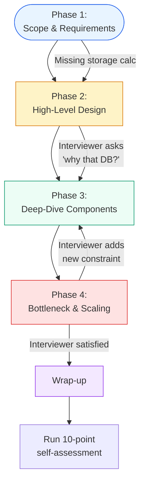

# Module 14: System Design Interview Framework

The system design interview is not a test of how many components you can name — it is a test of how methodically you decompose complexity and defend your decisions through mathematical and structural trade-offs.

Think of it like a martial arts grading: you are not being judged on whether you can name every technique (the interviewer already knows them). You are being judged on how you handle pressure, how you react when an unexpected constraint is thrown at you, and whether your fundamentals are solid enough to build a coherent system from scratch in 45 minutes.

---

## Table of Contents

- [1. The 4-Phase Whiteboard Roadmap](#1-the-4-phase-whiteboard-roadmap)
  - [Full Mock Interview: Design a URL Shortener](#full-mock-interview-design-a-url-shortener)
- [2. The Seniority Signal](#2-the-seniority-signal)
  - [Seniority Levels with Example Dialogue](#seniority-levels-with-example-dialogue)
- [3. The Defensive Whiteboarding Art](#3-the-defensive-whiteboarding-art)
  - [Common Anti-Patterns (Pitfalls to Avoid)](#common-anti-patterns-pitfalls-to-avoid)
- [4. Execution Flow](#4-execution-flow)
- [5. The Bar Raiser Checklist](#5-the-bar-raiser-checklist)
- [6. Question Bank: 10 Classic System Design Problems](#6-question-bank-10-classic-system-design-problems)
- [7. Key Takeaways](#7-key-takeaways)
- [8. Self-Assessment Questions](#8-self-assessment-questions)
- [9. Common Mistakes](#9-common-mistakes)

---

## 1. The 4-Phase Whiteboard Roadmap

A standard 45-minute interview is an open-ended conversation that **you** are expected to lead.

### Phase 1: Scope & Requirements (5-10 min)

Do not start drawing until you have extracted the **functional** and **non-functional** constraints.

| Action | Signal to Sender |
|---|---|
| Ask who the users are and what the primary inputs/outputs are | You establish scope instead of guessing |
| Clarify DAU, read/write ratio, data size per entity | You are thinking about capacity from minute one |
| Compute back-of-the-envelope: QPS, storage (5-year), bandwidth | You prove the system must be distributed |
| Confirm consistency vs. availability trade-off up front | You anchor the conversation on CAP before drawing a box |

**What the interviewer is looking for:** Can you drive an ambiguous conversation toward concrete numbers? A junior candidate waits for the interviewer to say "100M DAU." A senior candidate says, "I'll assume 100M DAU and calculate from there — if that's wrong, adjust."

### Phase 2: High-Level Design (10-15 min)

Sketch the request path from **Client** to **Data Store**. Keep it box-and-arrow — no deep dives yet.

```
[Client] -> [DNS / CDN] -> [L7 Reverse Proxy] -> [App Servers (stateless)] -> [Primary DB]
                                                           |
                                                     [Cache Layer (Redis / Memcached)]
```

- Map the **Edge Infrastructure** (DNS, CDN, reverse proxy).
- Show the **Application Tier** as stateless (horizontal scaling).
- Place the **Storage Layer** without yet choosing SQL vs. NoSQL.
- Label arrows with protocols (HTTP/gRPC) and data formats (JSON/Protobuf).

### Phase 3: Deep-Dive Component Engineering (15-20 min)

Steer the conversation into specific modules based on the system's bottlenecks.

- **Data schemas** — define the core entities and their relationships.
- **Database justification** — SQL (ACID, joins) vs. NoSQL (BASE, high-speed ingestion).
- **Cache strategy** — cache-aside, write-through, or write-behind. Address invalidation and thundering herd.
- **Sharding logic** — pick a shard key; explain how consistent hashing prevents reshuffle storms.
- **Async boundaries** — insert message queues for heavy operations (fan-out, report generation, image processing).

### Phase 4: Bottleneck & Scaling (5 min)

Defensively stress-test your own design.

- How do you scale horizontally? Where is the first bottleneck?
- How does Master-Slave replication lag affect reads?
- What happens when a cache node fails? A DB primary?
- What is the single point of failure in your current diagram?

### Full Mock Interview: Design a URL Shortener

This walkthrough shows exactly what the candidate draws and says at each phase. The right column shows the interviewer's evaluation.

---

**Phase 1: Scope & Requirements (7 min)**

The candidate picks up the marker and starts a new board section labeled **REQUIREMENTS**:

| Candidate Says | Candidate Draws |
|---|---|
| "Let me start by scoping the problem. Our primary function is to accept a long URL and return a short key, then redirect when someone visits that key." | `POST /shorten { long_url } -> { short_key }` `GET /:key -> HTTP 301 -> long_url` |
| "I'll assume 100M new URLs per month. That gives us about 38 QPS average for writes. For reads — each short URL gets clicked, say, 10 times — so 1B reads/month = ~385 QPS reads. That's comfortable for a single DB, but let's confirm with storage." | `100M / (86400 x 30) ≈ 38 write QPS` `1B / (86400 x 30) ≈ 385 read QPS` `Storage: 100M x 500B x 12 x 5 = 30 TB` |
| "Each entry is about 500 bytes (6 chars for the key + 2000 chars for the URL + timestamps + user_id). Over 5 years with a 2x replication factor, that's about 30 TB. Comfortably fits on a single Postgres instance with SSDs." | `500 bytes/entry → 30 TB/5 years` |
| "For CAP: this is a read-heavy system with 10:1 read/write ratio. I'll prioritize **availability** — a user who gets a 404 on a valid short link is worse than a temporarily stale response. I'll go AP." | Writes `AP` on the board. |
| **Interviewer signal:** Strong opening. Candidate established scope, calculated capacity, and declared CAP before drawing a single box. | ✅ Senior behavior |

---

**Phase 2: High-Level Design (10 min)**

The candidate erases the scratch calculations and draws the architecture:

| Candidate Says | Candidate Draws |
|---|---|
| "The write path: Client -> Load Balancer -> App Server -> Primary DB. The read path: Client -> CDN (for cached redirects) -> Load Balancer -> App Server -> Cache -> DB." | ```
[Client] -> [CDN] -> [LB] -> [App Servers] -> [Redis Cache]
                                  |                   |
                            [Key Gen Service]    [Postgres Primary]
                                  |                   |
                            [Kafka queue]      [Read Replicas]
                                  |
                            [Analytics DB]
``` |
| "I'm adding a CDN for static content and cached redirects. The app servers are stateless — they scale horizontally behind the LB. I'll explain the Key Generation Service in the deep-dive." | |
| "Notice I'm calling out the CDN even though the primary use case is dynamic redirects — many short URLs are shared on social media, so CDN caching of the most popular 20% of redirects saves us 80% of read traffic." | |
| **Interviewer signal:** Candidate showed the full path before digging into any single component. The CDN mention shows operational awareness beyond the basic diagram. | ✅ Senior behavior |

---

**Phase 3: Deep-Dive — Key Generation and Data Schema (15 min)**

The candidate drills into the most interesting part of the system:

| Candidate Says | Candidate Draws |
|---|---|
| "Let me design the key generation. A 7-character base62 key gives us 62^7 ≈ 3.5 trillion combinations — more than enough. The naive approach is auto-increment ID encoded as base62, but that creates predictable keys. I'll use a distributed key generator." | `base62(62^7 ≈ 3.5T keys)` `ID = (timestamp_ms << 23) | (server_id << 10) | counter` |
| "Each app server pre-allocates a batch of keys from a centralized key-range table and caches them locally. If a server crashes, it loses at most one batch — acceptable since 10,000 unused keys is noise at our scale." | **key_ranges table:** `server_id | start_id | end_id | allocated_at` |
| "For the data schema: short_key (VARCHAR(7), PK), long_url (TEXT), created_at, last_accessed_at, user_id. I'll index on user_id for the user's link listing page. The long URL gets an index too for deduplication." | ```sql
CREATE TABLE urls (
  short_key VARCHAR(7) PRIMARY KEY,
  long_url TEXT NOT NULL,
  created_at TIMESTAMPTZ,
  user_id UUID
);
CREATE INDEX idx_user ON urls(user_id);
``` |
| "For reads: cache-aside with Redis. On a GET request, check Redis first. On miss, read from DB, write to Redis with a 24-hour TTL. On write (new URL), invalidate the cache entry for that key." | `GET: cache → miss → DB → set cache → return` `POST: DB insert → invalidate cache` |
| "For redirection strategy: 301 (permanent) for repeated redirects to the same URL — browsers cache it, saving us a request. But if links can be edited (e.g., to fix a typo), use 302 (temporary) so the client always checks with us." | `301 Moved Permanently → browser caches` `302 Found → browser always asks` |
| **Interviewer signal:** Candidate went deep on the most non-trivial component (key generation) and made an intelligent trade-off decision (301 vs 302) without being asked. | ✅ Staff behavior |

---

**Phase 4: Bottleneck & Scaling (5 min)**

| Candidate Says | Candidate Draws |
|---|---|
| "Let me stress-test this. First bottleneck: the centralized key-range table. If 100 app servers request batches simultaneously at peak, the DB handles 100 writes/second — trivial. But if the key-range table goes down, we fall back to generating random base62 keys with a Bloom filter for collision detection." | Draws fallback path: `Random Key Gen -> Bloom Filter -> DB` |
| "Second: cache failure. If Redis goes down, reads fall through to Postgres. The read replicas handle the surge. To prevent a thundering herd on cache warmup, I'll use a mutex per key — the first request that misses the cache locks and fetches from DB; subsequent requests wait or get a stale copy from local memory." | Draws a mutex around the cache-miss path. |
| "Third: analytics. Every redirect generates an event. I don't want this on the write path. I'll push click events to a Kafka topic consumed by a separate analytics service writing to a columnar store (ClickHouse). This keeps the critical path clean." | `GET /:key → redirect → push event to Kafka → ClickHouse` |
| **Interviewer signal:** Candidate proactively identified three bottlenecks, proposed concrete mitigations, and separated the critical path from the analytics path. | ✅ Staff behavior |

---

**Summary of what this mock interview demonstrates:**

| Skill | How the Candidate Demonstrated It |
|---|---|
| **Requirement gathering** | Asked about DAU, read/write ratio, calculated QPS and storage before drawing |
| **Capacity planning** | 38 write QPS, 385 read QPS, 30 TB/5 years — all mental math on the board |
| **CAP declaration** | Said "AP" explicitly and justified why |
| **Full-path design** | CDN → LB → App → Cache → DB → Workers, all in one pass |
| **Deep dive on key component** | Distributed key generation with pre-allocated batches and fallback |
| **Trade-off awareness** | 301 vs 302, cache-aside vs write-through, random keys vs sequential |
| **Failure mode stress test** | Key-range table failure, cache failure, analytics backpressure |
| **Operational maturity** | Monitored components (Bloom filter, mutex, Kafka queue) as first-class parts of the design |

---

## 2. The Seniority Signal

A Bar Raiser distinguishes **Junior** from **Staff+** engineers by watching for these specific behaviors:

| Aspect | Junior Behavior | Staff+ Behavior |
|---|---|---|
| **Requirement elicitation** | Waits for the interviewer to state each requirement | Asks pointed questions about DAU, latency SLOs, and write/read ratios before drawing |
| **Diagramming** | Draws one box and immediately dives into implementation details | Draws the full end-to-end path (client -> edge -> app -> cache -> DB -> workers) before refining |
| **Handling ambiguity** | Freezes or asks "what do you want me to do?" | States assumptions out loud (e.g., "I'll assume 5 nines for reads, 3 nines for writes") and proceeds |
| **Trade-off discussion** | Calls components "perfect" or "simple" | States explicitly that "everything is a trade-off" — e.g., "Increasing availability in this Dynamo-style system means accepting eventual consistency" |
| **Proactivity** | Needs prompting for every next step | Drives the roadmap independently: "I've finished the high-level layout; let me now deep-dive into the cache layer" |
| **Operational empathy** | Ignores failure modes until asked | Discusses observability, security (mTLS/JWT), and SLOs as primary concerns, not afterthoughts |

### Seniority Levels with Example Dialogue

| Level | Signal | Example Dialogue |
|---|---|---|
| **Junior** | Solves the first problem presented, needs prompting for next steps | **Interviewer:** "How would you handle 10x traffic?" **Junior:** "Add more servers?" (pauses, looks at interviewer) |
| **Mid** | Completes all phases but needs guardrails; offers alternatives when asked | **Interviewer:** "How would you handle 10x traffic?" **Mid:** "I'd add more app servers behind the load balancer. If the DB becomes the bottleneck, I'd add read replicas. For writes, I could shard the DB by user_id hash. Should I go deeper on any of these?" |
| **Senior** | Drives the conversation; proactively identifies bottlenecks and trade-offs | **Interviewer:** "How would you handle 10x traffic?" **Senior:** "Let me check which component hits capacity first. At 10x, the write QPS goes from 38 to 380 — Postgres handles that. But reads go from 385 to 3,850 — the cache hit ratio drops because the working set grows. I'd first add more cache nodes, then verify whether the DB read replicas can absorb the cache-miss traffic. If not, I'd add more replicas. I'll start with the cache expansion since that's the fastest path." |
| **Staff** | Considers the organizational and operational impact alongside the technical solution | **Interviewer:** "How would you handle 10x traffic?" **Staff:** "Technically: the cache layer scales first, then read replicas, then we consider sharding. But the harder problem is operational: at 10x traffic, our deployment pipeline needs to handle zero-downtime scaling. I'd also add autoscaling policies, update the SLOs in our monitoring, and run a load test against the staging environment mirroring the 10x traffic pattern before touching production. The risk isn't the scaling itself — it's discovering during the 10x event that our CI/CD pipeline can't provision new cache nodes fast enough." |

**How to read this table:** The same question ("handle 10x traffic") produces very different responses at each level. The Junior solves the immediate problem. The Mid lists options. The Senior sequences the response by bottleneck priority. The Staff considers the operational and organizational context. The interview is not a quiz — it is a simulation of how you would behave on the job. The Staff response is not about knowing more facts; it is about thinking more broadly about what "solving" a problem means.

---

## 3. The Defensive Whiteboarding Art

When an interviewer drops a mid-session constraint, you must think aloud using distributed systems fundamentals.

### Example: "The network between our app and cache has 5% packet loss."

**Step 1 — Apply CAP:** 5% packet loss is a **Network Partition** (P). I must decide: do we sacrifice **Availability** (refuse requests until the network stabilizes) or **Consistency** (serve potentially stale cache data)?

**Step 2 — Decorate for fault tolerance:**
- **Retries with exponential backoff** — prevent thundering herds from crushing the backend on retry.
- **Back pressure** — return HTTP 503 if the connection pool to the cache saturates.
- **Circuit breaker** — trip the cache circuit after N consecutive failures; serve stale data from a local replica or fall back to the database.

**Step 3 — Durability under partition:**
- If this is a write-heavy system (like Dynamo), use **Sloppy Quorums** and **Hinted Handoff** — writes are accepted by a healthy node outside the primary partition until the network heals.

### Common Anti-Patterns (Pitfalls to Avoid)

| Anti-Pattern | Why It Hurts You | How to Fix It |
|---|---|---|
| **Starting with microservices** | You draw 8 boxes with arrows between them before clarifying the requirements. The interviewer has no idea if the boxes are even needed because you haven't established scale. | Start with a monolith. Prove that it needs to be distributed by showing QPS/storage numbers. Only split when a single machine hits a concrete limit. |
| **Ignoring failure modes** | Your design works perfectly — until the interviewer says "the cache is down." Then you panic because you didn't plan a fallback. | After drawing each component, add a 2-second mental check: "What happens if this box disappears?" Mention the fallback briefly in the deep-dive. |
| **Over-engineering the obvious** | You spend 15 minutes designing a distributed queue for a system that handles 10 QPS. | Match the complexity to the scale. A single Postgres instance handles 5,000 QPS. You don't need Kafka until you exceed that or need replay semantics. |
| **Silent drawing** | You draw for 3 minutes without speaking. The interviewer has no idea what you're thinking. | Talk continuously. Every line you draw should be accompanied by a sentence explaining what it is and why it belongs there. |
| **Picking a DB you cannot justify** | You say "we'll use MongoDB" but cannot explain why not Postgres or Cassandra. | If you pick a specific database, be ready to explain: (1) data model fit, (2) consistency model, (3) scaling story, (4) operational maturity. If you cannot defend all four, leave it as a generic "data store" box. |
| **Forgetting the edge** | Your diagram starts at the load balancer — no CDN, no DNS, no TLS termination. | Always start with the client and work through the edge: DNS resolution, CDN cache, TLS termination, load balancing. The edge handles 80% of production incidents. |
| **Defensive about constraints** | When the interviewer suggests a scenario (e.g., "what if the DB is in a different region?"), you argue why it's unrealistic rather than adapting. | Accept the constraint and redesign around it: "Interesting. With cross-region latency, my cache strategy changes. Let me think about how to keep the hot path fast..." |

---

## 4. Execution Flow



*The system design interview execution flow. The candidate moves through four phases sequentially, but feedback loops (decision diamonds) may send them back to earlier phases. The 10-point checklist runs at wrap-up.*

---

## 5. The Bar Raiser Checklist

Use this 10-point checklist to self-assess any design before concluding. Each item should be answerable with a clear **yes** or **no**.

> - [ ] **1. Requirements bounded** — Calculated storage (5-year), QPS, and bandwidth before choosing a database.
> - [ ] **2. CAP alignment** — Explicitly stated whether the system is **CP** (sacrifice availability) or **AP** (sacrifice consistency) under a network partition.
> - [ ] **3. Edge integrity** — DNS, CDN, L4/L7 load balancers correctly positioned with TLS termination at the edge.
> - [ ] **4. Stateless scaling** — Application tier is stateless, enabling independent horizontal scaling via a load balancer.
> - [ ] **5. Database justification** — Justified SQL (ACID, normalized) vs. NoSQL (BASE, denormalized) based on data structure and access patterns.
> - [ ] **6. Sharding logic** — Chose a shard key and described consistent hashing or range-based partitioning to prevent hot-spots.
> - [ ] **7. Cache strategy** — Addressed cache invalidation (TTL, write-through vs. cache-aside) and the thundering herd problem.
> - [ ] **8. Async decoupling** — Expensive or fan-out workloads moved to a message queue (Kafka / SQS / RabbitMQ).
> - [ ] **9. Security & auth** — Included JWT/OAuth2 for the public edge and mTLS for internal service-to-service communication.
> - [ ] **10. Graceful degradation** — Defined a fallback or "gutter" pool behavior when a core component (cache, DB, queue) becomes unavailable.

---

## 6. Question Bank: 10 Classic System Design Problems

| # | Problem | Key Hints |
|---|---|---|
| 1 | **Design URL Shortener** (bit.ly, TinyURL) | Focus on key generation (base62, distributed ID), 301 vs 302 redirect strategy, cache for hot URLs, analytics pipeline as a separate async path. See the full mock interview above. |
| 2 | **Design a Chat System** (WhatsApp, Messenger) | 1:1 and group chat have very different data models. Use a message-store-per-conversation or time-ordered partition key. Focus on delivery guarantees (at-least-once vs exactly-once), last-seen presence (heartbeat + stale timeout), and multi-device sync (vector clocks or last-write-wins). |
| 3 | **Design a News Feed** (Facebook, Twitter) | Push (fan-out-on-write) for high-value users with few followers; pull (fan-out-on-read) for celebrities with millions of followers. Hybrid: push to cache for active followers, pull for the long tail. Rank by recency + engagement signals. |
| 4 | **Design a Video Streaming Platform** (YouTube, Netflix) | Storage hierarchy: hot videos on SSD/CDN, warm on HDD, cold on archival. Chunk videos into segments (HLS/DASH). Pre-transcode to multiple bitrates. CDN placement is the core scaling challenge — edge cache for popular content, origin fetch for long-tail. |
| 5 | **Design a Ride-Sharing Service** (Uber, Lyft) | The core technical challenge is real-time driver location matching. Use a geospatial index (geohash, quad-tree, or S2) to map driver locations to grid cells. Kafka for the real-time location stream. The matching algorithm is a bounded nearest-neighbor search within the rider's geohash + neighboring cells. Surge pricing uses supply/demand sliding windows. |
| 6 | **Design a Distributed Key-Value Store** (DynamoDB, Cassandra) | The Dynamo paper is the blueprint: consistent hashing for partitioning, vector clocks for versioning, N/R/W quorum for tunable consistency, gossip protocol for membership, hinted handoff for durability during partition. Focus on the read-repair and anti-entropy mechanisms. |
| 7 | **Design a Rate Limiter** | Token bucket (burst-friendly) vs sliding window (smooth). Distributed rate limiting requires a shared counter (Redis with Lua scripting) or local approximation with sync. For a global rate limit, shard by user_id to keep each user's counter on one Redis node. |
| 8 | **Design a Search Autocomplete System** | Trie data structure in memory. Top N completions precomputed offline from search logs. Trie sharded by prefix. For real-time updates, a streaming pipeline updates the trie with recent search data. Cache the top 10 completions for the most common 10,000 prefixes in a CDN. |
| 9 | **Design a Collaborative Document Editor** (Google Docs) | Operational Transformation (OT) for concurrent text editing with a centralized server. Conflict-Free Replicated Data Types (CRDTs) for peer-to-peer collaboration. The core challenge is ordering concurrent edits correctly. Use a server-authoritative model with version vectors and transform conflicting operations against each other. |
| 10 | **Design a Web Crawler** | BFS-based URL frontier with politeness policies (delay between requests to the same domain). URL deduplication with a Bloom filter (1% false positive rate saves 90% of hash table memory). Priority queue for important pages. Distributed frontier sharded by domain hash. |

**How to use this question bank:** Pick any problem, set a 45-minute timer, and go through all four phases. Then run yourself through the 10-point bar raiser checklist. Identify which checklist items you skipped and focus your next practice on those gaps.

---

## 7. Key Takeaways

- **The four phases are a framework for structuring ambiguity, not a script.** The best candidates use them as a mental checklist, not a rigid agenda. If the interviewer goes deep on a particular component in Phase 2, follow them — do not say "I'll cover that in Phase 3."
- **Capacity math is the most repeatable skill to practice.** Memorize: 100K requests/day ≈ 1 QPS, 86,400 seconds/day, and the latency numbers table. Practice calculating QPS and storage for different scenarios until it takes less than 30 seconds.
- **State your assumptions out loud.** The interviewer cannot read your mind. If you silently assume 100M DAU and they wanted 1M DAU, you waste 15 minutes designing a distributed system for a problem that fits on a laptop. Say "I'm assuming 100M DAU — flag if that's off."
- **The trade-off is more important than the decision.** Interviewers care less about whether you pick SQL or NoSQL, and far more about how you weighed the trade-offs. Always say "I'm choosing X because [reason], at the cost of [downside]."
- **Failures are first-class design components.** Mentioning what happens when the cache fails or the DB primary goes down is not "extra credit" — it is the minimum bar for a Senior-level pass. Design for failure from the first diagram.
- **Match complexity to scale.** The most common mistake senior candidates make is over-engineering. A system handling 1,000 QPS does not need Kafka, Cassandra, Kubernetes, and a service mesh. A single Postgres instance handles it. Prove the need for distribution before introducing distributed components.
- **The wrap-up matters.** The last 2 minutes are when the interviewer consolidates their impression. Summarize your design in 3 sentences, mention the two riskiest assumptions you made, and ask if there are any concerns.

---

## 8. Self-Assessment Questions

**Question 1:** In the URL shortener mock interview, the candidate chose distributed key generation with pre-allocated batches. What happens if all pre-allocated keys on a server are exhausted and the key-range table is unreachable? Design a degradation strategy.

<details><summary>Click for Answer</summary>

**Degradation strategy — fallback to random keys with collision detection:**

1. The server detects that its local key batch is empty and the key-range table is unreachable (connection timeout).
2. It switches to generating random 8-character base62 keys (slightly longer to reduce collision probability).
3. Before confirming the short URL, it checks a Bloom filter in local memory for collision detection.
4. If the Bloom filter says "maybe present," it does a point query against the DB (read replica or primary — whichever is reachable).
5. If confirmed as a duplicate, it generates a new random key and retries (expected retries: ~1 in 62^8 ≈ 1 in 218 trillion for 100M keys — essentially zero).
6. Once the key-range table is reachable again, the server replenishes its batch and resumes normal operation.

**Why this works:** Random key generation is slower (requires Bloom filter + DB check) but guarantees availability during the key-range table outage. The key insight is that the probability of collision with 8-character random base62 keys at 100M entries is negligible.
</details>

**Question 2:** A Mid-level candidate draws a design with microservices (Auth Service, URL Service, Analytics Service, User Service, Notification Service) for a URL shortener handling 100M URLs/month. Critique this approach. What should the candidate have done instead?

<details><summary>Click for Answer</summary>

**Critique:** The candidate started with microservices before establishing scale. A URL shortener at 38 write QPS and 385 read QPS fits comfortably on a single Postgres instance with a Redis cache. The microservice architecture adds:
- Network latency between services (each internal API call adds 1-5 ms).
- Operational complexity (5 deployment pipelines, service discovery, inter-service auth).
- Debugging difficulty (distributed tracing, log aggregation across 5 services).

**What the candidate should have done:** Start with a monolith: a single app server reading/writing to Postgres with Redis as cache. As the candidate draws the monolith, they mention: "If we grow to 10x this scale, I'd split the analytics path into a separate service consuming from Kafka, and the key generation into a standalone service. But at current scale, keeping it as one service is simpler and faster."

**The lesson:** Prove the need for distribution before distributing. The Senior signal is knowing when NOT to use microservices.
</details>

**Question 3:** During a design interview, the interviewer says: "The load balancer has a 500 ms timeout. Your cache nodes occasionally take 600 ms to respond under load. What breaks?"

<details><summary>Click for Answer</summary>

**What breaks:** When the cache takes 600 ms and the LB times out at 500 ms, the LB returns a 504 Gateway Timeout to the client before the cache responds. The client sees an error even though the cache eventually returns the correct data. This causes false-positive error alerts and a poor user experience.

**The fix — multi-level timeout:**
1. **Client-side timeout:** App server's HTTP client to cache should be 400 ms (less than the LB timeout).
2. **App-level circuit breaker:** If 3 consecutive cache requests exceed 400 ms, trip the circuit breaker and fall through to the database for 30 seconds.
3. **LB timeout tuning:** Increase the LB timeout to 2 seconds (for the database fallback path) if the application circuit breaker is handling cache failures gracefully.

**Senior insight:** Timeout stacking is one of the hardest distributed debugging problems. Always ensure your internal timeouts (app -> cache) are shorter than your external timeouts (LB -> app) by a comfortable margin, with a circuit breaker to handle the fallback path.
</details>

**Question 4:** You have 15 minutes left in the interview. You have completed the high-level design but have not yet deep-dived into any component. What do you do?

<details><summary>Click for Answer</summary>

**Prioritize the bottleneck component — the part that will fail first under scale:**

1. **Scan your design for the bottleneck** (30 seconds): Is it the database writes? The cache hit ratio? The key generation? Pick ONE.
2. **Announce your intent:** "I have 15 minutes left. The most interesting bottleneck in this design is the database write path at 38 QPS — that's comfortable, but the read path at 385 QPS with potential cache misses worries me more. Let me deep-dive into the cache strategy."
3. **Go deep on ONE component** (12 minutes): Data schema, cache invalidation, thundering herd prevention, and what happens when the cache fails.
4. **Leave 2 minutes for the checklist:** Run through the 10-point bar raiser checklist quickly, flagging any gaps.

**What NOT to do:** Try to cover three components shallowly. Going deep on one shows the interviewer you can do the same for any component. Going shallow on three shows you avoid hard problems.
</details>

**Question 5:** After presenting your design, the interviewer asks: "How would you handle a viral short link that gets 1 million clicks in 5 minutes?" What is your response plan?

<details><summary>Click for Answer</summary>

**Immediate analysis:** 1M clicks / 300 seconds ≈ 3,333 QPS to a single short key. This is 10x the average read QPS (385) concentrated on a single key — a classic hot-spot problem.

**The fix — multi-level defense:**

1. **CDN cache the redirect:** A 301 redirect is cacheable. The CDN should absorb 99%+ of these requests. Set the CDN TTL to 1 hour for the first 10 minutes after detecting the spike, then 24 hours if sustained.
2. **App-level local cache:** Each app server keeps a local in-memory cache (LRU, 10 MB) of the most frequently accessed redirects. A read that misses Redis reads from the local cache instead — no network call.
3. **Redis read replicas:** If the hot key makes it past the CDN and local cache, distribute reads across Redis replicas. The primary Redis handles writes only.
4. **Rate-limit the origin:** If the DB is at risk, the app server rate-limits requests to the hot key to 100 QPS at the DB level — old data is better than no data.

**Senior insight:** Viral events are not anomalies — they are the standard failure mode for any social or shareable link system. Your design should explicitly call out how hot-keys are handled, not treat them as edge cases.
</details>

---

## 9. Common Mistakes

> **Mistake 1: Designing for a scale you cannot justify.**  
> You draw a Kubernetes cluster with 20 microservices, Kafka, Cassandra, and Redis Cluster for a system handling 100 QPS. The interviewer cannot distinguish between "you know these technologies" and "you don't know when to use them." Always start simple and add complexity only when the numbers demand it.

> **Mistake 2: Talking too fast or too slow.**  
> Speaking too fast makes you seem nervous; too slow wastes the 45-minute clock. The right pace: one sentence per box you draw. If you draw 4 boxes in a row silently, you have lost the interviewer for 30 seconds. Fill the gaps with "why" explanations.

> **Mistake 3: Defending a bad decision instead of adapting.**  
> When the interviewer challenges your database choice, they are not testing whether you picked the "right" one — they are testing whether you can pivot when given new information. Say "That's a good point. With that constraint, I would switch to X because..." instead of "I disagree, Y is better."

> **Mistake 4: Writing unreadable diagrams.**  
> Tiny text, overlapping arrows, and no labels make your design impossible to evaluate. Use a full whiteboard. Write legibly. Label every arrow with the protocol (HTTP, gRPC, Kafka) and every box with a component name. A visually clear diagram is worth 2 minutes of explanation.

> **Mistake 5: Skipping the wrap-up.**  
> When the interviewer says "we have 2 minutes left," do not start a new component. Summarize your design in 3 sentences: "We have a stateless app tier behind a CDN and LB, with Redis cache and Postgres DB. The key generation uses pre-allocated batches with random fallback. The biggest risk is cache warmup after a failure — I'd add a mutex per key to prevent thundering herd." Then ask: "Is there anything you'd like me to clarify?" A strong summary leaves a lasting positive impression.
